# 预约服务系统

四端预约服务管理平台：用户端微信小程序 + Flutter APP + HarmonyOS APP（同账号身份切换）、PC 管理后台。

> **项目状态**: 全部完成 ✅ | 143 控制器（service 69 / admin 74） | 87 模型 | 722 测试（service 558 / admin 164） | 95 数据表 | 388 路由（service 227 / admin 161）

## 项目介绍


**预约服务系统**是一套面向生活服务行业的四端预约管理平台：用户端覆盖**微信小程序、Flutter APP、HarmonyOS APP** 三端，同账号跨端自由切换，配合 **PC 管理后台**，实现"用户预约 → 技师接单 → 后台运营"全流程数字化闭环。无论门店预约、技师服务、会员营销还是财务结算，一套系统全部搞定。

**一站式预约体验**

用户三端体验一致：按日历直观选时预约、优惠券/次卡/积分抵扣、秒杀与拼团优惠、微信/余额支付，订单状态全程可追踪——改期、取消、退款、售后、电子发票全流程在线完成；技师端提供工作台、上下班打卡、批量排班、服务核销与提现审批，运营效率一目了然。

**全链路营销增长**

内置满减活动、秒杀、拼团、优惠券转赠、积分商城与幸运转盘、会员卡/成长等级权益、两级分销返佣、回头客奖励等十余种营销工具，配合消息订阅推送与 APP 推送，帮助商家持续拉新、留存与复购。

**企业级安全与合规**

采用自研安全组件：JWT 鉴权、ID 混淆、31 类攻击检测、敏感数据双层加密、价格服务端校验、支付回调严格比对与幂等防重，同时支持微信官方分账、隐私数据导出与账号注销，满足合规要求。

**成熟的技术底座**

基于 PHP 8.3 + webman 高性能常驻框架，MySQL 8.0 + Redis + Elasticsearch 支撑；95 张数据表、388 个接口、285 个细粒度权限点，722 项自动化测试全部通过，并有完善的中英文架构文档与一键安装脚本，开箱即用、易于二次开发。

无论是单店预约还是多门店连锁，预约服务系统都能为您提供稳定、安全、可扩展的一体化解决方案。

## 项目结构

```
appointment-php/
├── admin/                     # 管理后台 (webman v2 + Flutter Web，独立部署 :8787)
│   ├── app/                   #   admin(后台控制器)/api/model/middleware/process/view
│   ├── apps/                  #   Flutter Web 后台 / HarmonyOS / 微信管理端
│   ├── config/                #   路由/数据库/进程/插件配置
│   ├── database/              #   备份脚本（表结构与种子数据统一见 docs/install.sql）
│   ├── tests/                 #   PHPUnit（#[\Test] 属性风格）
│   └── start.php
├── service/                   # 业务API服务 (webman v2，独立部署 :8787)
│   ├── app/                   #   api/user/technician/order/wallet/marketing/notification 等模块
│   ├── config/                #   路由/数据库/进程/支付等配置
│   ├── support/               #   Model 基类（generateId）/Request/Response
│   ├── tests/                 #   PHPUnit
│   └── start.php
├── apps/                      # 用户端前端应用
│   ├── wechat/                #   微信小程序（原生）
│   ├── flutter/               #   Flutter APP（iOS + Android）
│   └── harmonyos/             #   HarmonyOS APP（鸿蒙原生）
└── docs/                      # 项目文档
    ├── API.md / FEATURES.md / STRUCTURE.md / install.sql / README.md ...
    └── diagrams/              #   架构/流程图（SVG + mermaid）
```

## 快速开始

### 环境要求

- PHP 8.3+
- MySQL 8.0+
- Redis
- Composer

### Web 安装向导（推荐）

```bash
cd admin/
cp .env.example .env
composer install
php start.php start -d
```

浏览器打开 `http://localhost:8787/install`，按指引填写数据库和管理员账号即可完成安装。

### 手动安装

```bash
# 1. 安装依赖
cd service/ && cp .env.example .env && composer install
cd ../admin/ && cp .env.example .env && composer install

# 2. 一键导入数据库（含全部 95 张表 + 权限/配置种子）
mysql -u root -p < docs/install.sql

# 3. 启动服务
cd service/ && php start.php start -d   # 业务API → :8787
cd ../admin/ && php start.php start -d  # 管理后台 → :8787
```

### Docker 部署

```bash
cd admin/ && cp .env.docker .env && docker-compose up -d
cd ../service/ && cp .env.docker .env && docker-compose up -d
```

## 技术栈

| 层级 | 技术 | 说明 |
|------|------|------|
| 后端框架 | webman v2 (PHP 8.3+) | 高性能常驻内存HTTP服务 |
| 数据库 | MySQL 8.0 | 表前缀 `erik_` |
| 缓存 | Redis | 缓存/限流/Session/队列 |
| 搜索 | Elasticsearch | 全文检索（via webman-scout） |
| 管理后台前端 | Flutter Web | PC管理后台风格 |
| 用户端APP | Flutter | iOS + Android |
| 用户端小程序 | 原生微信小程序 | WXML/WXSS/JS |
| 用户端鸿蒙APP | HarmonyOS ArkTS | 原生 @ohos.net.http |
| ID生成 | erikwang2013/snowflake-php | BIGINT非自增主键 |
| API ID加解密 | erikwang2013/hashids | 对外隐藏真实ID |
| JWT认证 | erikwang2013/jwt-webman | Bearer Token |
| 敏感数据加密 | erikwang2013/encryption + encryptable | API + DB双层加密 |
| 安全防护 | erikwang2013/security-php | 31种攻击检测 |
| 操作验证 | erikwang2013/poster-php | 敏感操作随机验证 |
| 国家旗帜 | erikwang2013/season | 国旗图标 |
| ES同步 | erikwang2013/webman-scout | 模型自动同步 |

## 系统架构



## 核心流程

### 服务预约流程



### 支付与退款流程



## 订单生命周期



## 安全架构

### 纵深防御七层体系



> 更多详细图示：[流程图](docs/diagrams/FLOWCHART.md)（含技师提现/身份切换）| [功能脑图](docs/diagrams/FUNCTION-DIAGRAM.md) | [全部生命周期](docs/diagrams/LIFECYCLE-DIAGRAM.md) | [完整安全架构](docs/diagrams/SECURITY-ARCHITECTURE.md)

## 核心功能亮点（第 6-24 轮）

| 功能 | 说明 |
|------|------|
| 储值钱包 | user_wallet / wallet_recharge / wallet_txn 表；余额+流水、微信支付充值（回调 R 前缀单号）、订单余额支付（pay_channel=balance）、微信/余额退款自动回充余额 |
| 管理后台 UI 完整补齐 | Flutter Web 20 页面：dashboard/用户/角色/配置/日志/核销/排班/服务/技师/订单/优惠券/会员/次卡/公告/FAQ/提现/评价/报表/个人中心 |
| 小程序订阅消息 | 订单 3 场景订阅推送（支付成功/退款到账/核销成功）；push_sent_at 幂等；未配置模板自动降级站内通知 |
| 技师提现 | 管理端审核；金额 ≥500 两级审批（店长→财务）；状态机 pending→approved→completed（rejected/failed） |
| 次卡核销闭环 | 我的次卡实时计算 used_up/expired；核销 Redis NX 幂等 + 行锁扣次，直建 completed 订单 + OrderItem + OrderPayment(pay_type='card') |
| 技师工作台 | 今日任务/完成记录/开始·完成（行锁+状态机守卫+幂等，完成后写站内通知）；小程序 tech-work 三 Tab |
| 优惠券抵扣 | PriceCalculator：applyCoupon 只读算额 / consume 支付置 used / restoreCouponAndCard 退款幂等归还；fixed/percent + min_amount 门槛 |
| 礼品卡 | redeem 时 cash 类型充值到钱包（行锁防双入账，WalletTxn type='gift_card'），gift 类型仅标记 |
| 积分体系 | 签到返积分；核销消费返积分 floor(paid×1)（order_id 幂等，balance 快照）；退款按比例回扣；明细分页 + type/source 过滤 |
| 会员管理 | erik_user.member_level 列（迁移 000008）；管理端会员卡完整 CRUD（权限 365-369） |
| 小程序下单链路 | 服务详情 → 确认订单（选券/门槛置灰/客户端预估金额）→ POST /order → 微信/余额支付；小程序共 20 个页面 |
| 拼团闭环 | join 重复参与 422 + 满员锁定 + 到期惰性关闭；成团下单 store 传 promotion_id 以拼团价（discount_percent）下单，禁用优惠券/次卡/积分叠加，未成团自动取消订单并释放技师锁（旧 FLASH_SALE 促销通道已下线，秒杀走独立通道） |
| 店长工作台 | service /api/store-manager 4 接口（overview/orders/technicians/revenue）store_id 强制隔离（无门店 403）；admin 门店工作台概览 + 订单 store_id 筛选 + Flutter 页面 + 权限 372 |
| 分销返佣 | 被推荐人首单 completed 后按 paid_amount × reward_rate（系统配置，默认 0.05）给推荐人返佣入钱包（WalletTxn referral_reward）；行锁+判空+首单复查三重幂等；earnings 明细 + admin 记录查看（权限 379） |
| 积分兑换商城 | 兑换商品/兑换记录两表；兑换接口 Redis NX + 行锁防超兑 + uk_user_goods 同用户限一次；coupon 发券 / wallet 入账 / gift_card 卡密三结果；admin CRUD + 上下架 + 记录（权限 373-378） |
| 预约改期 | POST /api/order/reschedule/{id} 同技师换时间；仅 pending/paid/confirmed 且距原服务开始 ≥6h 可改；order_lock + 新时段技师锁 SETNX(180s) 并发防超卖 + B2 排班冲突校验；落 erik_order_reschedule + SCENE_RESCHEDULE 订阅消息 |
| 优惠券转赠 | 8 位唯一转赠码（uk_code 兜底，7 天有效）；claim 防滥用：Redis NX 锁 + 行锁复验防双花、uk_user_coupon 限转赠一次、被转赠券不可再转、不可自领；懒过期恢复原券 |
| 积分过期 | expires_at（默认 365 天，配置 points.expiry_days）；PointsExpiryTimer 60s 游标扫描写 type=expire 负值扣减（三层幂等）+ 聚合站内通知；过期积分不可抵现/兑换 |
| 技师等级自动评定 | TierRatingService 实时统计订单量+均分回写 profile，按 tier_config 从高到低匹配；仅升级不降级（allowDowngrade 供人工重评）；变更落 erik_technician_tier_log + 站内通知；admin 日志查看（权限 380） |
| 秒杀下单闭环 | /api/seckill 活动 + buy 幂等/防并发，下单注入 seckill_id 复用 store()，库存统一在事务内行锁扣减（秒杀价 = seckill_price 以 DB 为准），售罄 422「已抢光」，取消不回补库存；旧 promotion flash_sale 通道已下线 |
| 服务开始前提醒 | ServiceReminderTimer 60s 扫描 1h 内开始的 confirmed/serving 订单 → SCENE_REMINDER 订阅消息+站内通知（order_id+type 防重，三层幂等）；模板未配置自动降级站内通知 |
| 到期提醒 | ExpiryReminderTimer 6h 扫描 3 天内到期的会员卡/优惠券 → type=card_expiry/coupon_expiry + SCENE_EXPIRY 订阅消息（order_id 记来源防重） |
| 技师回复评价 | POST /api/technician/review/reply/{order_id}：非本人 404、重复回复 422、回复成功站内通知用户；erik_order_review 补 replied_at；admin 回复详情（权限 381） |
| 充值到账通知 | 微信充值回调事务内写站内通知 type='wallet_recharge'（复用回调幂等，同事务原子提交，失败不阻塞主流程） |
| 余额转账 | POST /api/wallet/transfer 用户间转账：金额 0.01-1000/笔 + 单日 5000 限额；Redis NX 锁 + 双方钱包行锁（user_id 升序防死锁）+ client_token 24h 幂等；WalletTxn transfer_out/transfer_in 双流水含 balance_after 快照；接收方站内通知 type='balance_received' |
| 积分转赠 | POST /api/user/points/transfer 用户间转赠：1-10000 积分 + 单日累计 10000 限额；Redis NX 锁 + 双方最后一条流水 lockForUpdate（升序防死锁）+ 锁内复验；发送方 consume/接收方 earn 双流水（接收含 expires_at 可正常过期）；接收方站内通知 type='points_received' |
| 评价追评 | POST /api/order/review/{order_id}/append：非本人 404/重复 422/空内容 422/非 completed 422，成功写技师站内通知 type='review_append'；erik_order_review 增 append_content/append_images(JSON)/append_at；顺带补注册用户提交评价路由（原 store 无路由不可达）并修复其潜伏 TypeError |
| 用户端物流跟踪 | GET /api/order/logistics/{id}：仅本人 product 订单（404 非本人/非商品/未发货）；读取 order.remark JSON（shipping_company/tracking_no/shipped_at，admin 发货写入）；收货人手机号脱敏 138****5678 |
| 消息偏好设置 | erik_user_notify_setting 表（uk_user_type 唯一键，缺省行=默认开）；GET/PUT /api/user/notify-settings；5 类开关 service_reminder/card_expiry/points_expiry/marketing/system（system 恒开不可关）；notifySettingEnabled 门控 3 定时器 + 订阅事件，关闭则站内通知与订阅消息一并跳过 |
| 预约月历 | GET /api/calendar/technician/{id}（月视图）+ /day（日视图）：time_slots JSON 展开小时槽、erik_order 已约时段排除；门店排班可视化选时 |
| 用户成长等级 | erik_user_growth + erik_growth_level（青铜0/白银100/黄金500/铂金2000/钻石5000）；签到+10、评价+20、消费每1元1点（复用既有状态复验天然幂等）；GET /api/growth（概览/records/levels 公开档位） |
| 电子发票 | POST/GET /api/invoices（申请/列表/详情）：uk_order_type(order_id,order_type) 防重复申请、金额服务端带出；admin 开票/驳回（权限 382-384） |
| 客服工单 | POST/GET /api/tickets + /{id}/close：用户提交/列表/详情/关闭；admin 回复（权限 385/387） |
| 多级分销-二级返佣 | 订单支付后给一级推荐人的推荐人发 paid×level2_rate（配置 0.02）：事务行锁 + uk_order_referred 幂等防重复发放；WalletTxn TYPE_REFERRAL_LEVEL2；admin 记录查看（权限 386） |
| 成长等级权益 | GrowthLevel.benefits 空壳落地：下单按等级 discount_rate 折扣（仅标准订单，券/次卡→等级折扣叠加，折扣额入 discount_amount + 备注可追溯，下限保护截断为 0）；支付回调成长值 floor(paid×points_multiplier) 倍率入账（支付时点取档，不抬级） |
| 发票抬头管理 | erik_invoice_title 常用抬头库：保存/编辑/删除/默认（首条自动默认、删默认自动转移、设默认事务清零）；申请发票可选 title_id 带入，手填兼容保留 |
| 工单满意度 | 关闭工单可打分 1-5（越界 422，未提供兼容 NULL）；admin 满意度汇总：平均分/1-5 星分布/已评未评计数（权限 388） |
| 评价图片审核 | admin ReviewAuditController：带图评价列表（JSON_LENGTH 过滤 + join 用户/技师名）、隐藏/恢复（hide 仅 visible、restore 仅 hidden，422 双向校验）；隐藏后技师评价列表自动不可见（权限 389-391） |
| 浏览足迹 | erik_browse_history（uk_user_item 重复浏览只刷 viewed_at）：服务详情挂接记录（try/catch 不阻塞主流程、未登录跳过）；列表 join 服务信息 + hashid；删单条/清空仅本人 |

> 第 8 轮运维性修复：移除 12 处 Poster::verify 潜伏 fatal；DashboardController 统计改用 Capsule Manager 查询。
>
> Round-15 补充：积分回补（取消/退款归还 points_offset 积分，refundOffsetPoints 5 挂接点幂等）；PromotionParticipant 状态改整型常量（修复严格模式下 join 1366 损坏）。
>
> Round-16 补充：积分兑换（PointsExchangeController，类型 consume/source=exchange）；拼团下单（erik_order 新增 promotion_id/participant_id 列）；分销返佣（ReferralRewardService 挂接 WorkController::complete）。
>
> Round-17 补充：预约改期（erik_order_reschedule + reschedule 接口）；优惠券转赠（erik_user_coupon_transfer + transfer/claim/transfers）；积分过期（expires_at + PointsExpiryTimer 进程）；技师等级自动评定（TierRatingService + erik_technician_tier_log，权限 380）。
>
> Round-17 修复：AutoCancelTimer 通知插入改用 \support\Model::generateId()（原调用不存在的 Snowflake::generate()，自动取消通知静默失败）。
>
> Round-18 补充：秒杀下单（store() 支持 flash_sale 秒杀价）；服务开始前提醒（ServiceReminderTimer + SCENE_REMINDER）；会员卡/优惠券到期提醒（ExpiryReminderTimer + SCENE_EXPIRY）；技师回复评价（review reply 接口 + replied_at 列 + 权限 381）；充值到账通知（回调事务内 type='wallet_recharge'）。
>
> Round-19 补充：余额转账（erik_wallet_transfer + WalletTransferController，权限内双行锁 + client_token 幂等）；积分转赠（erik_user_points_transfer + PointsTransferController，单日限额 + 双向流水）；评价追评（erik_order_review append 三列 + append 接口 + 补注册 store 路由）；用户端物流跟踪（logistics 接口 + remark JSON 解析 + 手机号脱敏）；消息偏好设置（erik_user_notify_setting + NotifySettingController + 3 定时器门控）。
>
> Round-20 补充：预约月历（CalendarController 月/日视图 + 已约排除）；用户成长等级（erik_user_growth + erik_growth_level 5 档 + 签到/评价/消费挂接）；电子发票（erik_invoice + uk_order_type 防重复 + 后台开票/驳回，权限 382-384）；客服工单（erik_ticket 提交/列表/详情/关闭 + 后台回复，权限 385/387）；多级分销-二级返佣（payLevel2Reward 事务行锁 + uk_order_referred 幂等，权限 386）。
>
> Round-21 补充：成长等级权益落地（下单 discount_rate 折扣 + 支付 points_multiplier 积分倍率，迁移种子 5 档 benefits）；发票抬头管理（erik_invoice_title 抬头库 + 申请 title_id 联动）；工单满意度（关闭打分 rating/rated_at + admin 汇总统计，权限 388）；评价图片审核（ReviewAuditController 隐藏/恢复，权限 389-391）；用户浏览足迹（erik_browse_history + 详情挂接 + 列表/删除/清空）。
>
> Round-22 补充：满减活动（erik_full_reduction 自动减免 + 门槛校验，权限 396-400）；ICS 日历导出（RFC5545 我的预约）；技师打卡考勤（erik_technician_attendance 上下班打卡 + 迟到标记 + admin 统计，权限 392-393）；APP 推送服务（配置驱动抽象 + 5 处事件接入，erik_push_log）；微信官方分账（erik_profit_sharing_log 配置驱动 + 降级，权限 394）；隐私合规（数据导出 + 账号注销 72h 状态机 close_status）。
>
> Round-23 补充：用户健康档案（erik_user_health_profile）；钱包支付密码（erik_user_wallet pay_password 设置/校验）；技师批量排班（batch 导入 + 重叠冲突检测）；订单状态时间线（erik_order_status_log 8 状态埋点 + 用户端/后台展示）；积分幸运转盘（erik_lucky_wheel + erik_wheel_record 权重抽奖，权限 401-406）；积分有效期（points.expiry_days 配置 + 新 earn 流水带 expires_at）。
>
> Round-24 补充：游客模式（/api/guest/* 未登录只读浏览 + Redis 缓存）；秒杀（erik_seckill_activity + Redis NX 行锁抢购 + erik_order.seckill_id 注入下单，权限 407-411/420）；APP 版本管理与检测更新（erik_app_version + /api/app/version，权限 416-419）；回头客奖励（30 天二次消费奖金 type=return_customer，权限 412-414）；排班 CSV 导出（UTF-8 BOM + 时间槽明细，权限 415）。
>
> 2026-08-26 安全加固：下单接口订单项价格一律以数据库记录为准（客户端价格不可信，未知 target_type 422，target_id 必须 hashid），拼团/秒杀价同以 DB 为准；秒杀库存统一由 /api/order store() 事务内行锁扣减（SeckillController::buy 不再预扣，保留 Redis 活动锁 + client_token 幂等）；技师提现申请时在途预留、审批转账前复核、并发审批防双打款；微信支付回调 total_fee 与订单应付严格比对、支付宝回调日志脱敏；/install 安装成功写 .install.lock 双重校验防重装；依赖版本收敛（webman-scout 2.0.5 / opensearch-php ^2.6 / dompdf、security-php、webman-database 精确锁定）；两应用 phpstan.neon 修复可运行（php -d memory_limit=2G）。

## 文档导航

| 文档 | 说明 |
|------|------|
| [架构说明](docs/ARCHITECTURE.md) | 系统架构、三端关系、技术组件、数据流 |
| [功能说明](docs/FEATURES.md) | 用户端/技师端/管理后台完整功能清单 |
| [架构设计](docs/ARCHITECTURE-DESIGN.md) | 分层设计、中间件链、数据库设计、安全设计 |
| [功能设计](docs/FEATURE-DESIGN.md) | 核心业务流程、业务规则、状态机、退款规则 |
| [API文档](docs/API.md) | 业务API + 管理后台API，含请求/响应示例 + OpenAPI端点 |
| [安装说明](docs/INSTALL.md) | 环境要求、Docker部署、环境变量、第三方配置、常见问题 |
| [使用说明](docs/USAGE.md) | 管理后台配置、用户端/技师端操作、退款规则（API 接口见 API.md） |
| [项目结构](docs/STRUCTURE.md) | 完整目录布局、中间件执行链、数据库表清单 |
| [测试报告](docs/TEST-REPORT.md) | 全量测试覆盖审计（558 用例 / 2508 断言） |
| [设计规范](docs/superpowers/specs/2026-05-26-appointment-system-design.md) | 系统设计规范 |
| [实现计划](docs/superpowers/plans/2026-05-26-appointment-system-plan.md) | 分阶段实现计划 |
| [文档索引](docs/README.md) | 全部文档索引（含 12 种语言入口） |

## 多语言文档 / Languages

| 语言 | 入口 |
|------|------|
| 简体中文 | [README.md（本页）](README.md（本页）) |
| English | [docs/en/README.md](docs/en/README.md) |
| 한국어 | [docs/ko/README.md](docs/ko/README.md) |
| Русский | [docs/ru/README.md](docs/ru/README.md) |
| Deutsch | [docs/de/README.md](docs/de/README.md) |
| Français | [docs/fr/README.md](docs/fr/README.md) |
| Español | [docs/es/README.md](docs/es/README.md) |
| Português | [docs/pt/README.md](docs/pt/README.md) |
| हिन्दी | [docs/hi/README.md](docs/hi/README.md) |
| العربية | [docs/ar/README.md](docs/ar/README.md) |
| বাংলা | [docs/bn/README.md](docs/bn/README.md) |
| Bahasa Indonesia | [docs/id/README.md](docs/id/README.md) |
| 日本語 | [docs/ja/README.md](docs/ja/README.md) |

## 支持项目 / Support

如果这个项目对你有帮助，欢迎支持！感谢你的鼓励 :heart:

If this project helps you, your support is welcome and appreciated!

<table>
  <tr>
    <td align="center" width="50%">
      <br>
      <b>微信支付</b><br>WeChat Pay
    </td>
    <td align="center" width="50%">
      <br>
      <b>支付宝</b><br>Alipay
    </td>
  </tr>
</table>

### 全球转账 / Global Bank Transfer

支持全球转账打赏（港元 / 人民币 / 美元 / 其他币种），感谢你的慷慨 :heart:

Global bank transfer donations are welcome (HKD / CNY / USD / other currencies). Thank you for your generosity!

| 项目 Item | 信息 Details |
|-----------|-------------|
| 收款人姓名 Beneficiary Name | WANG KEXUN |
| 收款账户号码 Account Number | 881015918251 |
| 收款银行 Bank | ZA Bank Limited（SWIFT Code：AABLHKHHXXX，银行编号 Bank Code：387） |
| 银行地址 Bank Address | Core F, Cyberport 3, 100 Cyberport Road, Hong Kong |

> **跨境汇款代理银行（如需）/ Intermediary Bank (if required)**
> 此为跨境汇款代理银行（中转银行）信息，非收款银行信息，请向汇款银行查询是否需要提供。
> Note: this is intermediary bank information, not the receiving bank. Please check with your remitting bank whether it is required.
>
> - 汇入港元、人民币及美元（For HKD / CNY / USD）：**Citibank N.A. Hong Kong** — SWIFT Code：CITIHKHXXXX，银行编号 Bank Code：006，分行名称 Branch：Hong Kong Branch，分行编号 Branch Code：391，地址 Address：Citibank Tower, Citibank Plaza, 3 Garden Road, Central, Hong Kong
> - 汇入其他币种（For other currencies）：**The Bank of New York Mellon** — SWIFT Code：IRVTUS3NXXX，地址 Address：240 Greenwich Street, New York, United States

## 版权

Copyright (c) 2026 erik <erik@erik.xyz> — https://erik.xyz
