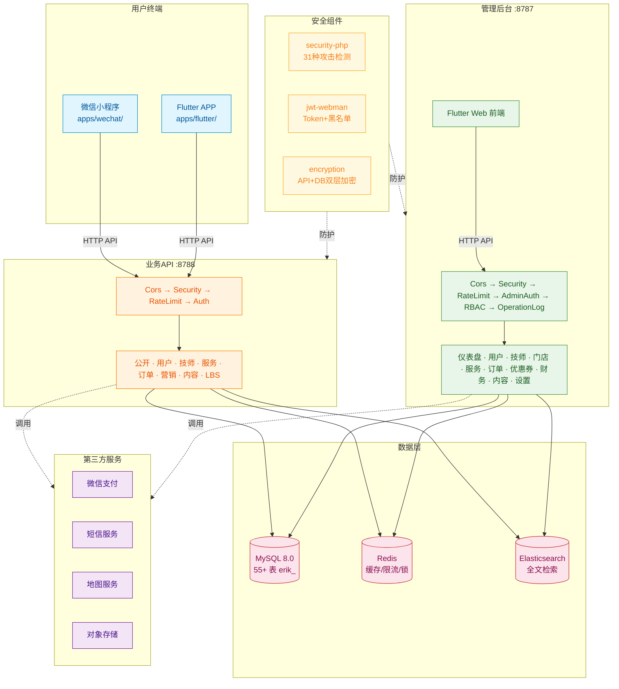
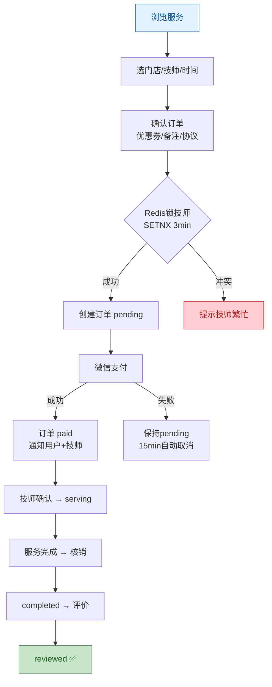
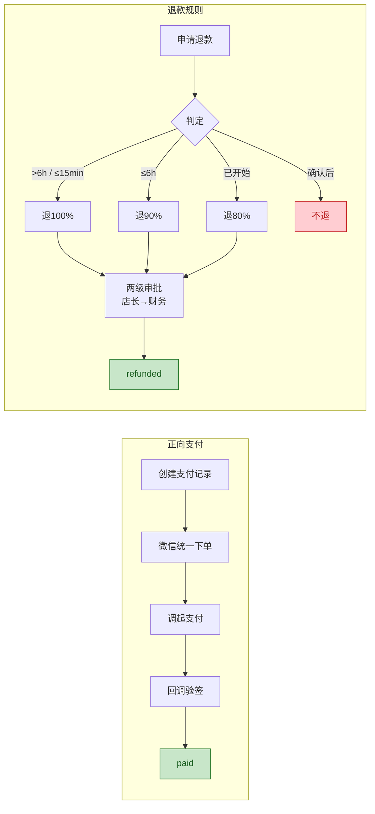
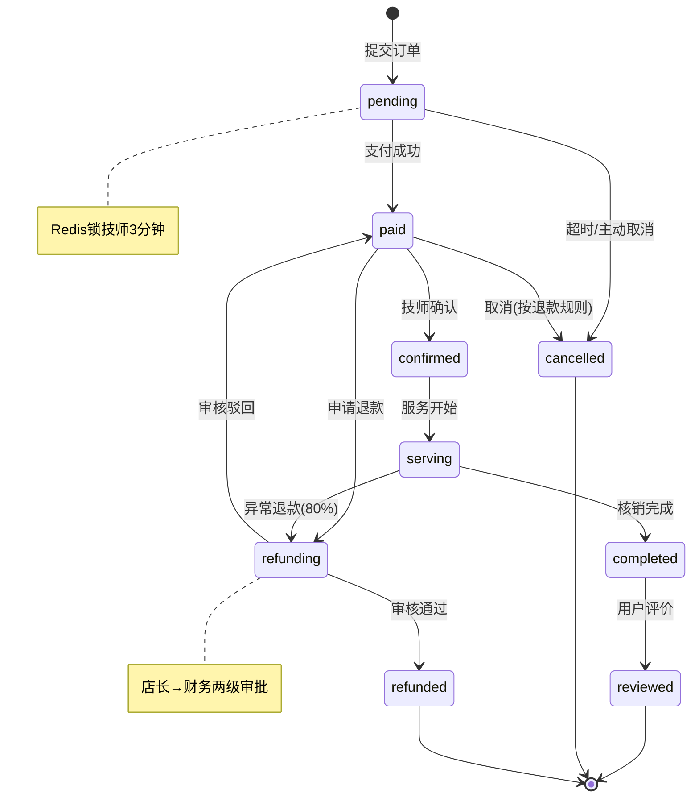
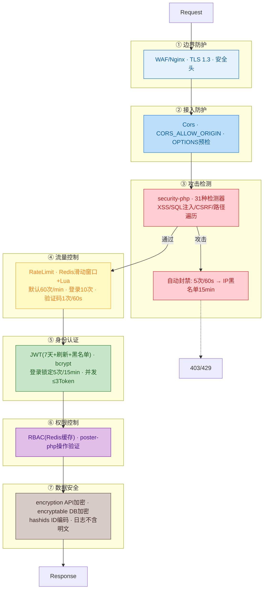

# 预约服务系统

三端预约服务管理平台：用户端微信小程序 + Flutter APP（同账号身份切换）、PC管理后台。

> **项目状态**: 全部完成 ✅ | 104 控制器 | 58 模型 | 80 测试 | 55+ 数据表 | 242 路由

## 项目结构

```
appointment-php/
├── admin/              # 管理后台 (webman v2 + Flutter Web)
├── service/            # 业务API服务 (webman v2)
├── apps/               # 用户端前端应用
│   ├── wechat/         #   微信小程序（原生）
│   └── flutter/        #   Flutter APP（iOS + Android）
└── docs/               # 项目文档
```

## 快速开始

### 环境要求

- PHP 8.3+
- MySQL 8.0+
- Redis
- Composer

### Web 安装向导（推荐）

```bash
cd admin/
cp .env.example .env
composer install
php start.php start -d
```

浏览器打开 `http://localhost:8787/install`，按指引填写数据库和管理员账号即可完成安装。

### 手动安装

```bash
# 1. 安装依赖
cd service/ && cp .env.example .env && composer install
cd ../admin/ && cp .env.example .env && composer install

# 2. 一键导入数据库（含全部 55 张表 + 演示数据）
mysql -u root -p < docs/install.sql

# 3. 启动服务
cd service/ && php start.php start -d   # 业务API → :8788
cd ../admin/ && php start.php start -d  # 管理后台 → :8787
```

### Docker 部署

```bash
cd admin/ && cp .env.docker .env && docker-compose up -d
cd ../service/ && cp .env.docker .env && docker-compose up -d
```

## 技术栈

| 层级 | 技术 | 说明 |
|------|------|------|
| 后端框架 | webman v2 (PHP 8.3+) | 高性能常驻内存HTTP服务 |
| 数据库 | MySQL 8.0 | 表前缀 `erik_` |
| 缓存 | Redis | 缓存/限流/Session/队列 |
| 搜索 | Elasticsearch | 全文检索（via webman-scout） |
| 管理后台前端 | Flutter Web | PC管理后台风格 |
| 用户端APP | Flutter | iOS + Android |
| 用户端小程序 | 原生微信小程序 | WXML/WXSS/JS |
| ID生成 | erikwang2013/snowflake-php | BIGINT非自增主键 |
| API ID加解密 | erikwang2013/hashids | 对外隐藏真实ID |
| JWT认证 | erikwang2013/jwt-webman | Bearer Token |
| 敏感数据加密 | erikwang2013/encryption + encryptable | API + DB双层加密 |
| 安全防护 | erikwang2013/security-php | 31种攻击检测 |
| 操作验证 | erikwang2013/poster-php | 敏感操作随机验证 |
| 国家旗帜 | erikwang2013/season | 国旗图标 |
| ES同步 | erikwang2013/webman-scout | 模型自动同步 |

## 系统架构



## 核心流程

### 服务预约流程



### 支付与退款流程



## 订单生命周期



## 安全架构

### 纵深防御七层体系



> 更多详细图示：[流程图](docs/diagrams/FLOWCHART.md)（含技师提现/身份切换）| [功能脑图](docs/diagrams/FUNCTION-DIAGRAM.md) | [全部生命周期](docs/diagrams/LIFECYCLE-DIAGRAM.md) | [完整安全架构](docs/diagrams/SECURITY-ARCHITECTURE.md)

## 文档导航

| 文档 | 说明 |
|------|------|
| [架构说明](docs/ARCHITECTURE.md) | 系统架构、三端关系、技术组件、数据流 |
| [功能说明](docs/FEATURES.md) | 用户端/技师端/管理后台完整功能清单 |
| [架构设计](docs/ARCHITECTURE-DESIGN.md) | 分层设计、中间件链、数据库设计、安全设计 |
| [功能设计](docs/FEATURE-DESIGN.md) | 核心业务流程、业务规则、状态机、退款规则 |
| [API文档](docs/API.md) | 业务API + 管理后台API，含请求/响应示例 + OpenAPI端点 |
| [安装说明](docs/INSTALL.md) | 环境要求、Docker部署、环境变量、第三方配置、常见问题 |
| [使用说明](docs/USAGE.md) | 管理后台配置、用户端/技师端操作、API示例、退款规则 |
| [项目结构](docs/STRUCTURE.md) | 完整目录布局、中间件执行链、数据库表清单 |
| [设计规范](docs/superpowers/specs/2026-05-26-appointment-system-design.md) | 系统设计规范 |
| [实现计划](docs/superpowers/plans/2026-05-26-appointment-system-plan.md) | 分阶段实现计划 |

## 支持项目 / Support

如果这个项目对你有帮助，欢迎支持！感谢你的鼓励 :heart:

If this project helps you, your support is welcome and appreciated!

<table>
  <tr>
    <td align="center" width="50%">
      <br>
      <b>微信支付</b><br>WeChat Pay
    </td>
    <td align="center" width="50%">
      <br>
      <b>支付宝</b><br>Alipay
    </td>
  </tr>
</table>

## 版权

Copyright (c) 2026 erik <erik@erik.xyz> — https://erik.xyz
