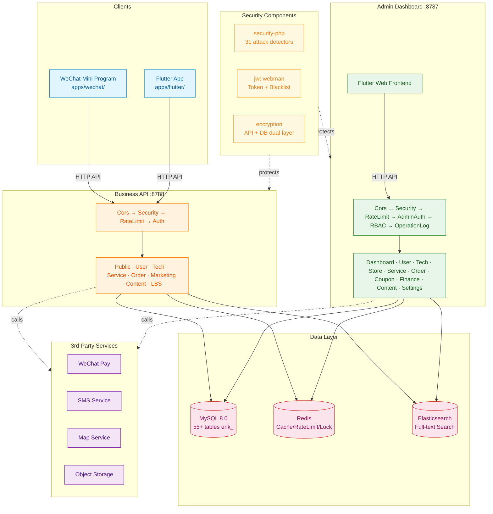
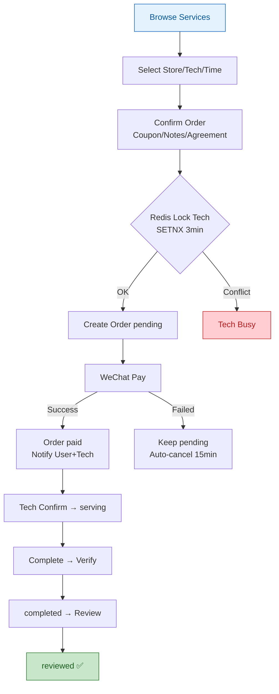
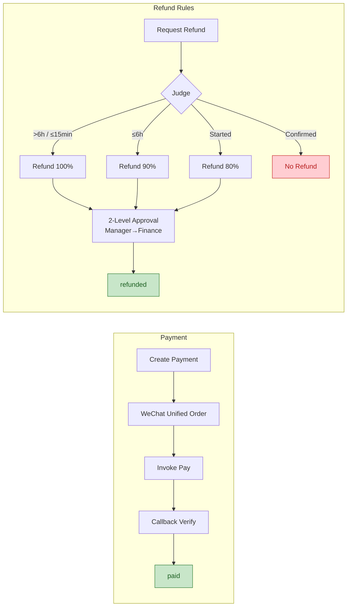
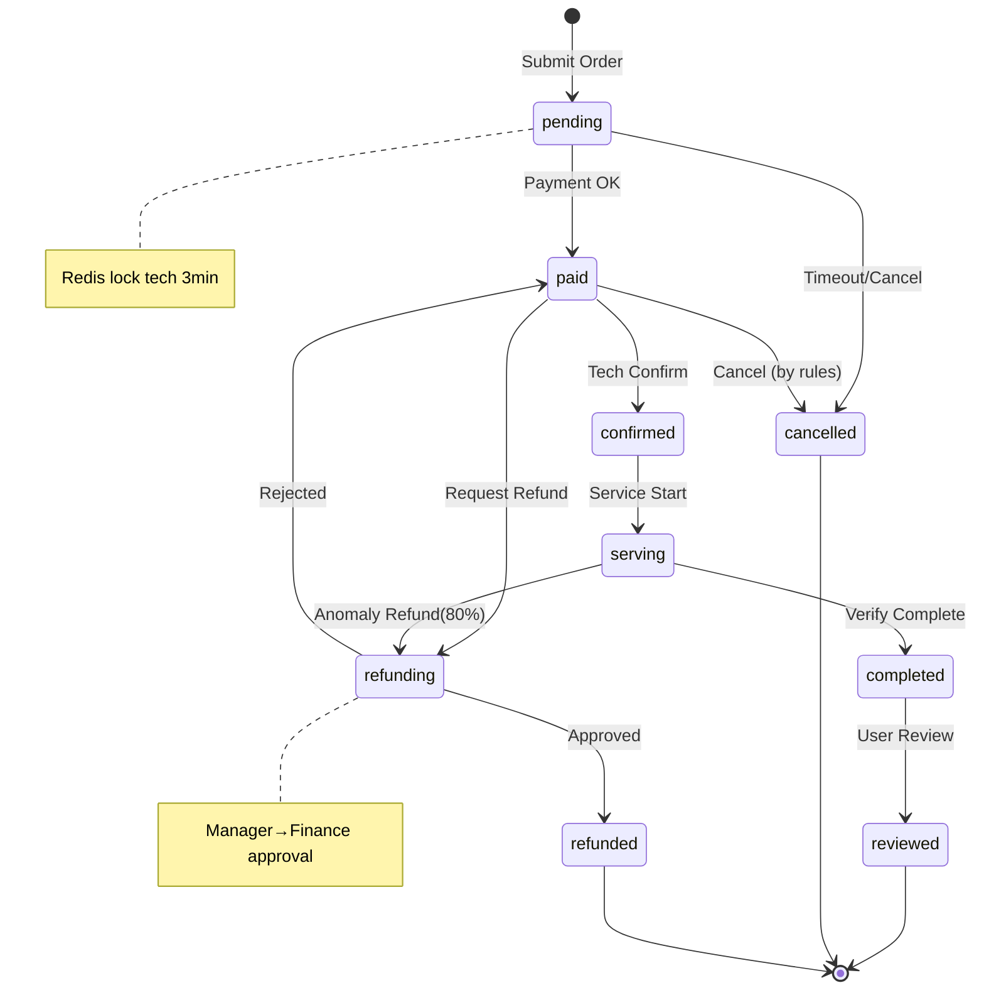
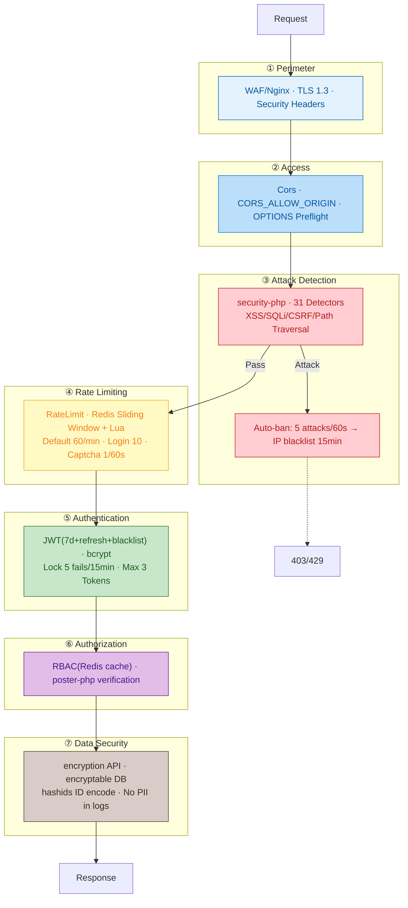

# Appointment Service System

A three-platform appointment service management platform: WeChat Mini Program + Flutter App (same-account role switching) + PC Admin Dashboard.

> **Status**: All complete | 104 Controllers | 58 Models | 80 Tests | 55+ Tables | 242 Routes

## Project Structure

```
appointment-php/
├── admin/              # Admin dashboard (webman v2 + Flutter Web)
├── service/            # Business API service (webman v2)
├── apps/               # Client-side frontend apps
│   ├── wechat/         #   WeChat Mini Program (native)
│   └── flutter/        #   Flutter App (iOS + Android)
└── docs/               # Documentation
```

## Quick Start

### Requirements

- PHP 8.3+
- MySQL 8.0+
- Redis
- Composer

### Web Installer (Recommended)

```bash
cd admin/
cp .env.example .env
composer install
php start.php start -d
```

Open `http://localhost:8787/install` in browser and follow the wizard to configure database and admin account.

### Manual Installation

```bash
# 1. Install dependencies
cd service/ && cp .env.example .env && composer install
cd ../admin/ && cp .env.example .env && composer install

# 2. Import unified database script (55 tables + demo data)
mysql -u root -p < docs/install.sql

# 3. Start services
cd service/ && php start.php start -d   # Business API → :8788
cd ../admin/ && php start.php start -d  # Admin API → :8787
```

### Docker Deployment

```bash
cd admin/ && cp .env.docker .env && docker-compose up -d
cd ../service/ && cp .env.docker .env && docker-compose up -d
```

## Tech Stack

| Layer | Technology | Description |
|-------|------------|-------------|
| Backend Framework | webman v2 (PHP 8.3+) | High-performance persistent-memory HTTP service |
| Database | MySQL 8.0 | Table prefix `erik_` |
| Cache | Redis | Cache / Rate limiting / Session / Queue |
| Search | Elasticsearch | Full-text search (via webman-scout) |
| Admin Frontend | Flutter Web | PC admin dashboard style |
| Client App | Flutter | iOS + Android |
| Client Mini Program | Native WeChat Mini Program | WXML / WXSS / JS |
| ID Generation | erikwang2013/snowflake-php | BIGINT non-auto-increment primary keys |
| API ID Encode/Decode | erikwang2013/hashids | Hide real IDs from external exposure |
| JWT Authentication | erikwang2013/jwt-webman | Bearer Token |
| Sensitive Data Encryption | erikwang2013/encryption + encryptable | Dual-layer API + DB encryption |
| Security Protection | erikwang2013/security-php | 31 attack detectors |
| Action Verification | erikwang2013/poster-php | Random verification for sensitive actions |
| Country Flags | erikwang2013/season | Flag icons |
| ES Sync | erikwang2013/webman-scout | Automatic model synchronization |

## Architecture



## Core Flows

### Appointment Booking



### Payment & Refund



## Order Lifecycle



## Security Architecture

### Defense-in-Depth (7 Layers)



> More diagrams: [Flowcharts](docs/diagrams/FLOWCHART.md) (withdrawal/role switch) | [Function Map](docs/diagrams/FUNCTION-DIAGRAM.md) | [All Lifecycles](docs/diagrams/LIFECYCLE-DIAGRAM.md) | [Full Security Architecture](docs/diagrams/SECURITY-ARCHITECTURE.md)

## Documentation

| Document | Description |
|----------|-------------|
| [Architecture](docs/ARCHITECTURE.md) | System architecture, platform relationships, technical components, data flow |
| [Features](docs/FEATURES.md) | Complete feature list: client / technician / admin dashboard |
| [Architecture Design](docs/ARCHITECTURE-DESIGN.md) | Layered design, middleware chain, database design, security design |
| [Feature Design](docs/FEATURE-DESIGN.md) | Core business flows, business rules, state machines, refund rules |
| [API Reference](docs/API.md) | Business API + Admin API with request/response examples + OpenAPI endpoint |
| [Installation](docs/INSTALL.md) | Requirements, Docker deployment, environment variables, third-party config, FAQ |
| [Usage Guide](docs/USAGE.md) | Admin configuration, client/technician operations, API examples, refund rules |
| [Project Structure](docs/STRUCTURE.md) | Full directory layout, middleware execution chain, database table list |
| [Design Spec](docs/superpowers/specs/2026-05-26-appointment-system-design.md) | System design specification |
| [Implementation Plan](docs/superpowers/plans/2026-05-26-appointment-system-plan.md) | Phased implementation plan |

## Support

If this project helps you, your support is welcome and appreciated!

<table>
  <tr>
    <td align="center" width="50%">
      <br>
      <b>WeChat Pay</b>
    </td>
    <td align="center" width="50%">
      <br>
      <b>Alipay</b>
    </td>
  </tr>
</table>

## License

Copyright (c) 2026 erik <erik@erik.xyz> — https://erik.xyz
