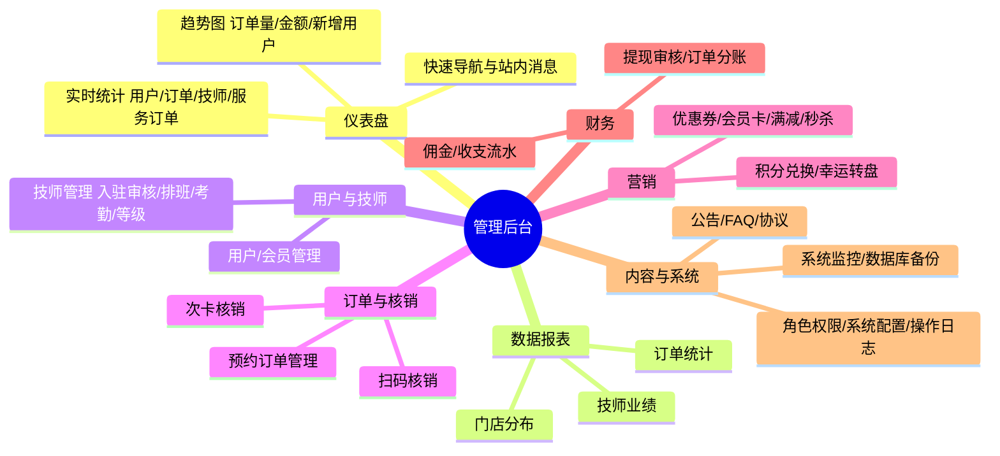

# 管理后台 Flutter Web 应用（admin_app）

> **多语言**：[English](../../../../README_EN.md) · [한국어](../../../../docs/ko/README.md) · [Русский](../../../../docs/ru/README.md) · [Deutsch](../../../../docs/de/README.md) · [Français](../../../../docs/fr/README.md) · [Español](../../../../docs/es/README.md) · [Português](../../../../docs/pt/README.md) · [हिन्दी](../../../../docs/hi/README.md) · [العربية](../../../../docs/ar/README.md) · [বাংলা](../../../../docs/bn/README.md) · [Bahasa Indonesia](../../../../docs/id/README.md) · [日本語](../../../../docs/ja/README.md)

本目录是预约服务系统 **PC 管理后台前端**：Flutter Web 单页应用（Material 3 + GetX，PC 管理后台风格），与 webman 后端（`admin/`，端口 :8787）配套使用。用户端三端（微信小程序 / Flutter APP / HarmonyOS APP）详见根 [README](../../../../README.md) 与 [docs/FEATURES.md](../../../../docs/FEATURES.md)。

## 功能概览

- **仪表盘**：实时统计（用户数 / 订单总数 / 技师数 / 服务订单数）+ 折线趋势（订单量 / 金额 / 新增用户 / 活跃度）+ 快速导航与站内消息
- **数据报表**：3 个报表端点——订单统计、技师业绩、门店分布（后端 Redis 缓存 300s）
- **页面规模**：21 个页面——仪表盘 / 用户 / 角色 / 配置 / 日志 / 核销 / 排班 / 服务 / 技师 / 订单 / 优惠券 / 会员 / 次卡 / 公告 / FAQ / 提现 / 评价 / 报表 / 售后 / 门店工作台 / 个人中心

## 一键安装

对齐根 README「快速开始」，安装管理后台（含本 Flutter Web 界面所依赖的 API）：

```bash
cd admin/
cp .env.example .env
composer install --no-dev --optimize-autoloader
php start.php start -d     # 默认端口 8787
```

浏览器打开 `http://localhost:8787/install`，按 4 步安装向导完成：

1. **环境检查** — 自动检测 PHP 版本、必需扩展、文件权限
2. **数据库配置** — 填写 MySQL 连接信息，测试连接
3. **管理员账号** — 设置应用名称、管理员用户名和密码
4. **执行安装** — 自动导入 SQL → 创建管理员 → 写入 .env 配置

安装完成后访问 `http://localhost:8787` 即可登录管理后台（默认管理员 `admin` / `admin123`，首次登录后请立即修改密码）。详细步骤见 [docs/INSTALL.md](../../../../docs/INSTALL.md)。

## Flutter Web 构建

```bash
cd admin/apps/flutter/
flutter pub get
flutter build web
```

- 产物输出至 `build/web/`，部署到任意 Web 服务器（如 Nginx 静态目录）即可
- API 地址默认 `http://localhost:8787`，可用 `--dart-define` 覆盖：

```bash
flutter build web --dart-define=API_BASE_URL=https://api.example.com
```

- 本地开发调试：

```bash
flutter run -d chrome --web-port 8080
```

## 使用说明

1. **登录**：打开 `http://localhost:8787` → 输入管理员账号密码（含验证码，连续 5 次失败锁定 15 分钟）
2. **仪表盘**：首页查看实时统计与趋势图，快速导航直达待处理模块
3. **数据报表**：报表页查看 3 类报表——订单统计（`GET /admin/reports/orders`）、技师业绩（`GET /admin/reports/technicians`）、门店分布（`GET /admin/reports/distribution`）
4. **日常运营**：用户 / 技师 / 门店 / 服务 / 订单 / 核销 / 排班 / 优惠券 / 会员 / 次卡 / 提现 / 评价 / 售后等管理页面

## 功能图



> 完整功能图见 [docs/diagrams/FUNCTION-DIAGRAM.md](../../../../docs/diagrams/FUNCTION-DIAGRAM.md)

## 相关文档

- 管理后台后端（webman）：`admin/` 下 ARCHITECTURE.md / DESIGN.md / SECURITY.md / API.md
- 项目文档索引：[docs/README.md](../../../../docs/README.md)

## 版权

Copyright (c) 2026 erik <erik@erik.xyz> — https://erik.xyz
