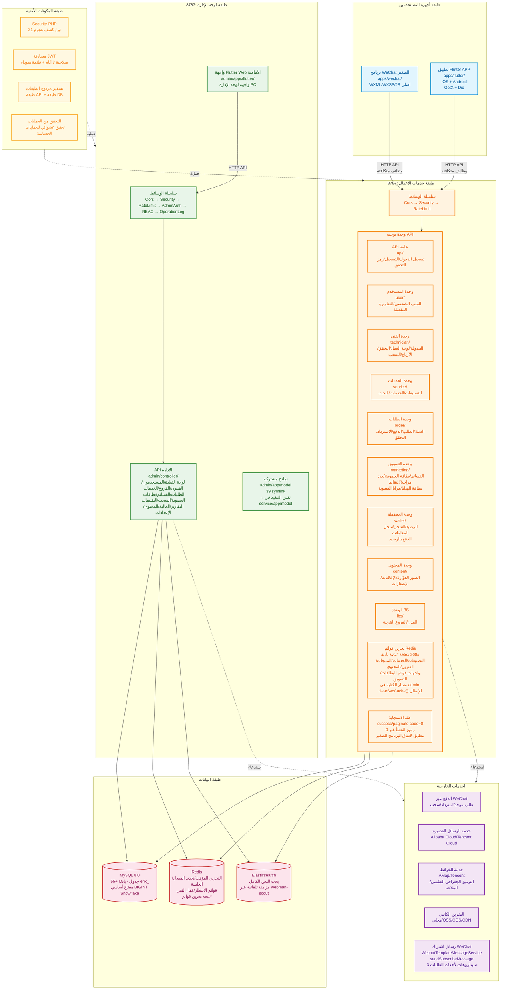

# مخطط بنية النظام

```mermaid
graph TB
    subgraph 用户终端层["طبقة أجهزة المستخدمين"]
        WX["برنامج WeChat الصغير<br/>apps/wechat/<br/>WXML/WXSS/JS أصلي"]
        APP["تطبيق Flutter APP<br/>apps/flutter/<br/>iOS + Android<br/>GetX + Dio"]
    end

    subgraph 业务服务层["طبقة خدمات الأعمال :8787"]
        direction TB
        MW1["سلسلة الوسائط<br/>Cors → Security → RateLimit"]
        subgraph API模块["وحدة توجيه API"]
            PUB["API عامة<br/>api/<br/>تسجيل الدخول/التسجيل/رمز التحقق"]
            USER["وحدة المستخدم<br/>user/<br/>الملف الشخصي/العناوين/المفضلة"]
            TECH["وحدة الفني<br/>technician/<br/>الجدولة/لوحة العمل/التحقق/الأرباح/السحب"]
            SVC["وحدة الخدمات<br/>service/<br/>التصنيفات/الخدمات/البحث"]
            ORD["وحدة الطلبات<br/>order/<br/>السلة/الطلب/الدفع/الاسترداد/التحقق"]
            MKT["وحدة التسويق<br/>marketing/<br/>القسائم/بطاقة العضوية(بعدد مرات)/النقاط<br/>بطاقة الهدايا/مزايا العضوية"]
            WALLET["وحدة المحفظة<br/>wallet/<br/>الرصيد/الشحن/سجل المعاملات<br/>الدفع بالرصيد"]
            CTN["وحدة المحتوى<br/>content/<br/>الصور الدوّارة/الإعلانات/الإشعارات"]
            LBS["وحدة LBS<br/>lbs/<br/>المدن/الفروع القريبة"]
            CACHE["تخزين قوائم Redis<br/>بادئة svc:* setex 300s<br/>التصنيفات/الخدمات/المنتجات/الفنيون/المحتوى<br/>واجهات قوائم البطاقات/التسويق<br/>مسار الكتابة في admin clearSvcCache() للإبطال"]
            RES["عقد الاستجابة<br/>success/paginate code=0<br/>رموز الخطأ غير 0<br/>مطابق لاتفاق البرنامج الصغير"]
        end
    end

    subgraph 管理后台层["طبقة لوحة الإدارة :8787"]
        MW2["سلسلة الوسائط<br/>Cors → Security → RateLimit → AdminAuth → RBAC → OperationLog"]
        ADMIN_API["API الإدارة<br/>admin/controller/<br/>لوحة القيادة/المستخدمون/الفنيون/الفروع/الخدمات<br/>الطلبات/القسائم/بطاقات العضوية/السحب/التقييمات<br/>التقارير/المالية/المحتوى/الإعدادات"]
        FLUTTER_WEB["واجهة Flutter Web الأمامية<br/>admin/apps/flutter/<br/>واجهة لوحة الإدارة PC"]
        MODEL["نماذج مشتركة<br/>admin/app/model<br/>39 symlink<br/>→ نفس التنفيذ في service/app/model"]
    end

    subgraph 数据层["طبقة البيانات"]
        MySQL[("MySQL 8.0<br/>55+ جدول · بادئة erik_<br/>مفتاح أساسي BIGINT Snowflake")]
        Redis[("Redis<br/>التخزين المؤقت/تحديد المعدل/الجلسة<br/>قوائم الانتظار/قفل الفني<br/>تخزين قوائم svc:*")]
        ES[("Elasticsearch<br/>بحث النص الكامل<br/>مزامنة تلقائية عبر webman-scout")]
    end

    subgraph 外部服务["الخدمات الخارجية"]
        WXPAY["الدفع عبر WeChat<br/>طلب موحد/استرداد/سحب"]
        SMS["خدمة الرسائل القصيرة<br/>Alibaba Cloud/Tencent Cloud"]
        MAP["خدمة الخرائط<br/>AMap/Tencent<br/>الترميز الجغرافي العكسي/الملاحة"]
        OSS["التخزين الكائني<br/>محلي/OSS/COS/CDN"]
        SUBMSG["رسائل اشتراك WeChat<br/>WechatTemplateMessageService<br/>sendSubscribeMessage<br/>3 سيناريوهات لأحداث الطلبات"]
    end

    subgraph 安全组件["طبقة المكونات الأمنية"]
        SEC["Security-PHP<br/>31 نوع كشف هجوم"]
        JWT["مصادقة JWT<br/>صلاحية 7 أيام + قائمة سوداء"]
        ENC["تشفير مزدوج الطبقات<br/>طبقة API + طبقة DB"]
        POSTER["التحقق من العمليات<br/>تحقق عشوائي للعمليات الحساسة"]
    end

    WX -->|"HTTP API<br/>وظائف متكافئة"| MW1
    APP -->|"HTTP API<br/>وظائف متكافئة"| MW1
    MW1 --> API模块

    FLUTTER_WEB -->|"HTTP API"| MW2
    MW2 --> ADMIN_API

    API模块 --> MySQL
    API模块 --> Redis
    API模块 --> ES
    ADMIN_API --> MySQL
    ADMIN_API --> Redis
    ADMIN_API --> ES

    安全组件 -.->|حماية| 业务服务层
    安全组件 -.->|حماية| 管理后台层

    API模块 -.->|استدعاء| 外部服务
    ADMIN_API -.->|استدعاء| 外部服务

    classDef terminal fill:#e1f5fe,stroke:#0288d1,stroke-width:2px,color:#01579b
    classDef service fill:#fff3e0,stroke:#f57c00,stroke-width:2px,color:#e65100
    classDef admin fill:#e8f5e9,stroke:#388e3c,stroke-width:2px,color:#1b5e20
    classDef data fill:#fce4ec,stroke:#c62828,stroke-width:2px,color:#880e4f
    classDef external fill:#f3e5f5,stroke:#7b1fa2,stroke-width:2px,color:#4a148c
    classDef security fill:#fff8e1,stroke:#f9a825,stroke-width:2px,color:#f57f17

    class WX,APP terminal
    class MW1,API模块,PUB,USER,TECH,SVC,ORD,MKT,WALLET,CTN,LBS,CACHE,RES service
    class MW2,ADMIN_API,FLUTTER_WEB,MODEL admin
    class MySQL,Redis,ES data
    class WXPAY,SMS,MAP,OSS,SUBMSG external
    class SEC,JWT,ENC,POSTER security
```
