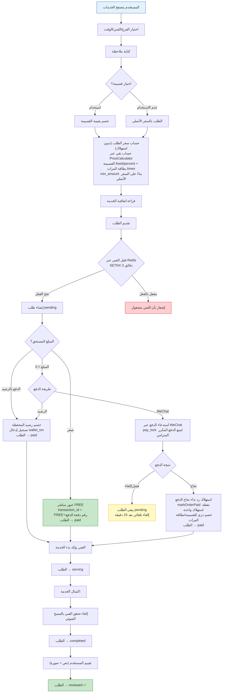
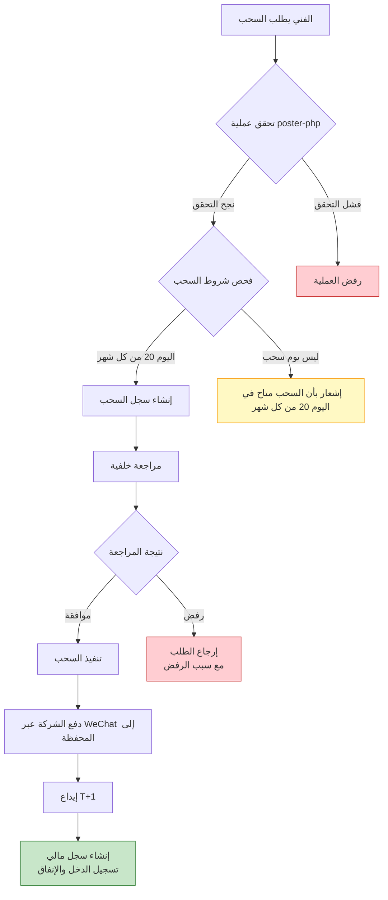
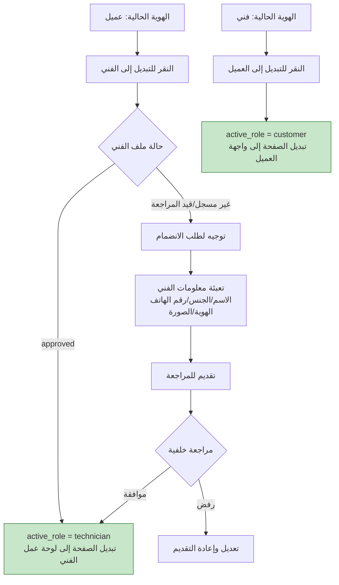
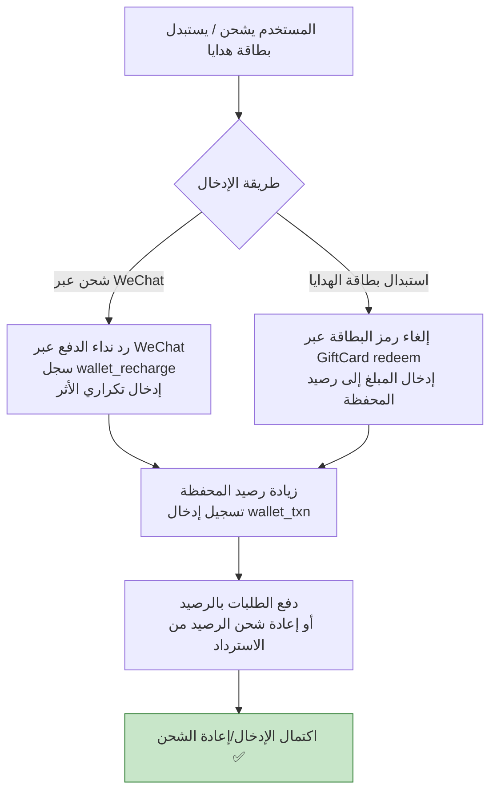

# مخطط تدفق الأعمال الأساسية
> **Languages**: [中文](../../diagrams/FLOWCHART.md) · [English](../../en/diagrams/FLOWCHART.md) · [한국어](../../ko/diagrams/FLOWCHART.md) · [Русский](../../ru/diagrams/FLOWCHART.md) · [Deutsch](../../de/diagrams/FLOWCHART.md) · [Français](../../fr/diagrams/FLOWCHART.md) · [Español](../../es/diagrams/FLOWCHART.md) · [Português](../../pt/diagrams/FLOWCHART.md) · [हिन्दी](../../hi/diagrams/FLOWCHART.md) · [বাংলা](../../bn/diagrams/FLOWCHART.md) · [Bahasa Indonesia](../../id/diagrams/FLOWCHART.md) · [日本語](../../ja/diagrams/FLOWCHART.md)

## 1. تدفق حجز الخدمة

## 2. تدفق الدفع والاسترداد

```mermaid
flowchart TD
    subgraph 支付流程["تدفق الدفع المباشر"]
        P1["إنشاء سجل الدفع"] --> P2["طلب موحد عبر WeChat<br/>pay_lock لمنع التزامن<br/>out_trade_no = order_no تكراري الأثر"]
        P2 --> P3["الواجهة الأمامية تستدعي الدفع<br/>اختيار طريقة الدفع"]
        P3 -->|"الرصيد"| PB["خصم رصيد المحفظة<br/>تسجيل إدخال wallet_txn<br/>تكراري الأثر، خصم مرة واحدة فقط"]
        P3 -->|"WeChat"| P4["رد نداء WeChat notify"]
        P4 --> P5["نجاح التحقق من التوقيع"]
        PB --> P6["markOrderPaid تكراري الأثر<br/>القسيمة/بطاقة المرات تُستهلك مرة واحدة فقط"]
        P5 --> P6
        P6 --> P7["الطلب → paid<br/>إشعار المستخدم + الفني"]
    end

    subgraph 退款流程["تدفق الاسترداد"]
        R1["المستخدم يطلب الاسترداد<br/>refund_lock لمنع التزامن"] --> R2{"تحديد قاعدة الاسترداد"}
        R2 -->|"الطلب خلال ≤15 دقيقة أو البعد عن البداية >6 ساعات"| R3["استرداد 100%"]
        R2 -->|"البعد عن البداية ≤6 ساعات"| R4["استرداد 90%"]
        R2 -->|"بدأ ولم يُؤكد"| R5["استرداد 80%"]
        R2 -->|"بعد تأكيد الخدمة"| R6["لا استرداد"]
        R3 --> R7["الطلب → refunding"]
        R4 --> R7
        R5 --> R7
        R7 --> R8["موافقة من مستويين<br/>مدير الفرع → المالية"]
        R8 --> R9["استرداد من مرحلتين<br/>إنشاء سجل الاسترداد داخل المعاملة<br/>إدخال/إخراج استرداد WeChat خارج المعاملة"]
        R9 -->|"فشل WeChat"| R10["إرجاع الطلب إلى PAID<br/>إمكانية إعادة محاولة الاسترداد"]
        R9 -->|"نجاح الاسترداد"| R11["الطلب → refunded<br/>إرجاع WeChat عبر نفس المسار / إعادة شحن الرصيد<br/>إرجاع القسيمة + استرداد النقاط"]
    end

    style P6 fill:#c8e6c9,stroke:#2e7d32,color:#333
    style R6 fill:#ffcdd2,stroke:#c62828,color:#333
    style R11 fill:#c8e6c9,stroke:#2e7d32,color:#333
    style R10 fill:#fff9c4,stroke:#f9a825,color:#333
```

## 3. تدفق سحب أرباح الفني

## 4. تدفق تبديل الهوية

## 5. تدفق شحن المحفظة/إدخال بطاقة الهدايا

