# مخطط دورة الحياة
> **Languages**: [中文](../../diagrams/LIFECYCLE-DIAGRAM.md) · [English](../../en/diagrams/LIFECYCLE-DIAGRAM.md) · [한국어](../../ko/diagrams/LIFECYCLE-DIAGRAM.md) · [Русский](../../ru/diagrams/LIFECYCLE-DIAGRAM.md) · [Deutsch](../../de/diagrams/LIFECYCLE-DIAGRAM.md) · [Français](../../fr/diagrams/LIFECYCLE-DIAGRAM.md) · [Español](../../es/diagrams/LIFECYCLE-DIAGRAM.md) · [Português](../../pt/diagrams/LIFECYCLE-DIAGRAM.md) · [हिन्दी](../../hi/diagrams/LIFECYCLE-DIAGRAM.md) · [বাংলা](../../bn/diagrams/LIFECYCLE-DIAGRAM.md) · [Bahasa Indonesia](../../id/diagrams/LIFECYCLE-DIAGRAM.md) · [日本語](../../ja/diagrams/LIFECYCLE-DIAGRAM.md)

## 1. دورة حياة الطلب (آلة الحالة)

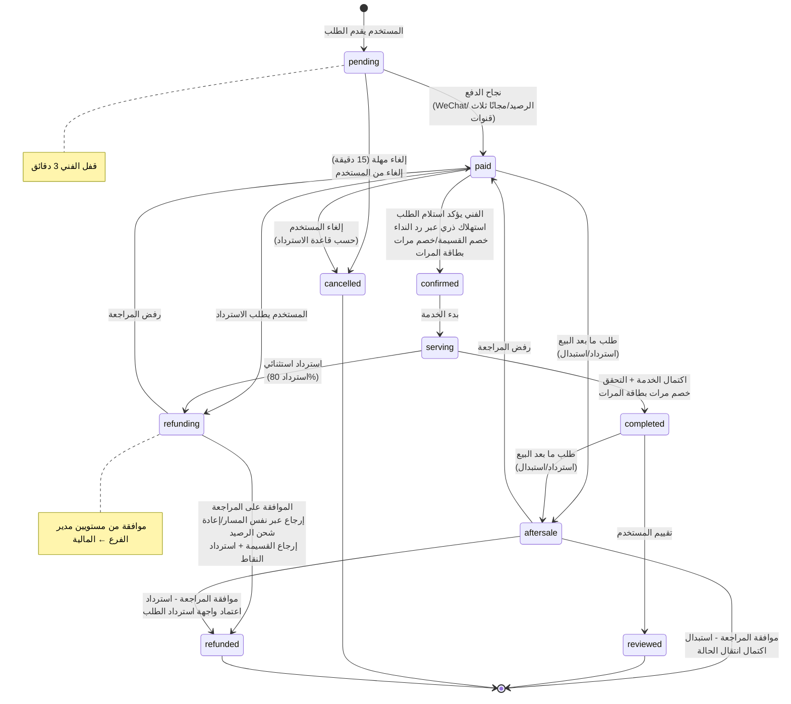
```mermaid
stateDiagram-v2
    [*] --> pending: المستخدم يقدم الطلب

    pending --> paid: نجاح الدفع<br/>(WeChat/الرصيد/مجانًا ثلاث قنوات)

    pending --> cancelled: إلغاء مهلة (15 دقيقة)<br/>إلغاء من المستخدم

    paid --> confirmed: الفني يؤكد استلام الطلب<br/>استهلاك ذري عبر رد النداء<br/>خصم القسيمة/خصم مرات بطاقة المرات
    paid --> cancelled: إلغاء المستخدم<br/>(حسب قاعدة الاسترداد)
    paid --> refunding: المستخدم يطلب الاسترداد
    paid --> aftersale: طلب ما بعد البيع<br/>(استرداد/استبدال)

    confirmed --> serving: بدء الخدمة

    serving --> completed: اكتمال الخدمة + التحقق<br/>خصم مرات بطاقة المرات

    serving --> refunding: استرداد استثنائي<br/>(استرداد 80%)

    completed --> reviewed: تقييم المستخدم
    completed --> aftersale: طلب ما بعد البيع<br/>(استرداد/استبدال)

    refunding --> refunded: الموافقة على المراجعة<br/>إرجاع عبر نفس المسار/إعادة شحن الرصيد<br/>إرجاع القسيمة + استرداد النقاط
    refunding --> paid: رفض المراجعة

    aftersale --> refunded: موافقة المراجعة - استرداد<br/>اعتماد واجهة استرداد الطلب
    aftersale --> paid: رفض المراجعة
    aftersale --> [*]: موافقة المراجعة - استبدال<br/>اكتمال انتقال الحالة

    reviewed --> [*]
    cancelled --> [*]
    refunded --> [*]

    note right of pending: قفل الفني 3 دقائق
    note right of refunding: موافقة من مستويين مدير الفرع ← المالية
```

## 2. دورة حياة بطاقة العضوية

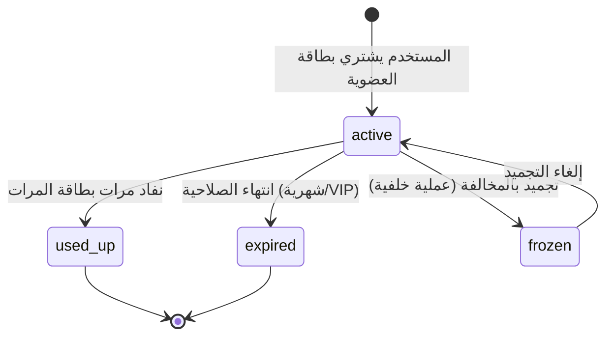
```mermaid
stateDiagram-v2
    [*] --> active: المستخدم يشتري بطاقة العضوية

    active --> used_up: نفاد مرات بطاقة المرات

    active --> expired: انتهاء الصلاحية (شهرية/VIP)

    active --> frozen: تجميد بالمخالفة (عملية خلفية)

    frozen --> active: إلغاء التجميد

    used_up --> [*]
    expired --> [*]
```

## 3. دورة حياة انضمام الفني

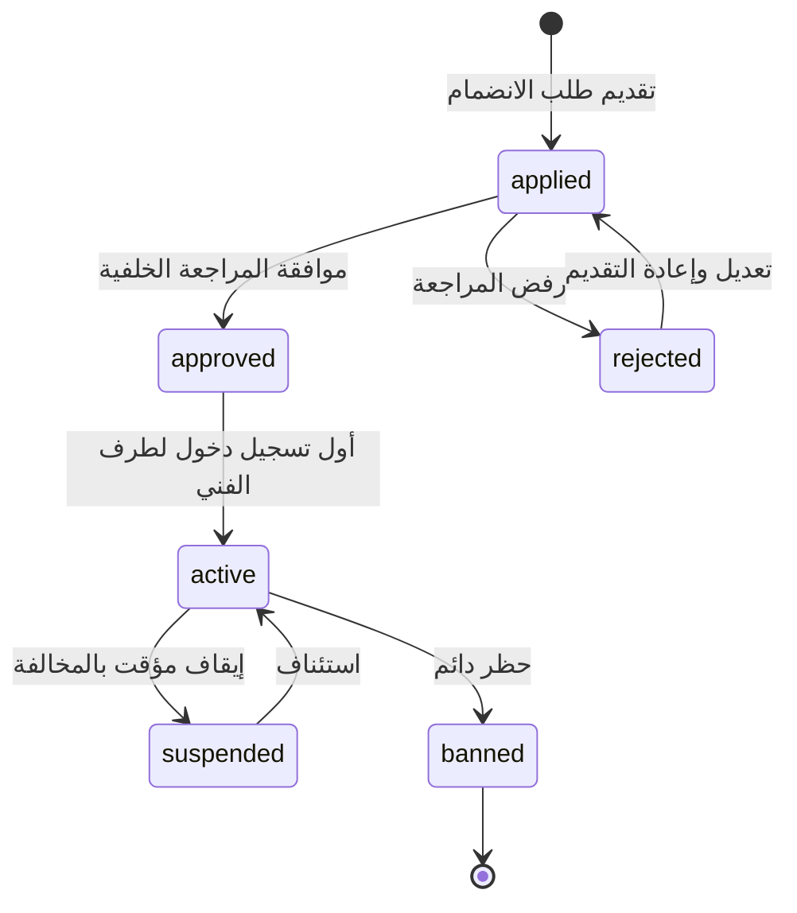
```mermaid
stateDiagram-v2
    [*] --> applied: تقديم طلب الانضمام

    applied --> approved: موافقة المراجعة الخلفية
    applied --> rejected: رفض المراجعة

    rejected --> applied: تعديل وإعادة التقديم

    approved --> active: أول تسجيل دخول لطرف الفني

    active --> suspended: إيقاف مؤقت بالمخالفة
    suspended --> active: استئناف
    active --> banned: حظر دائم

    banned --> [*]
```

## 4. دورة حياة القسيمة

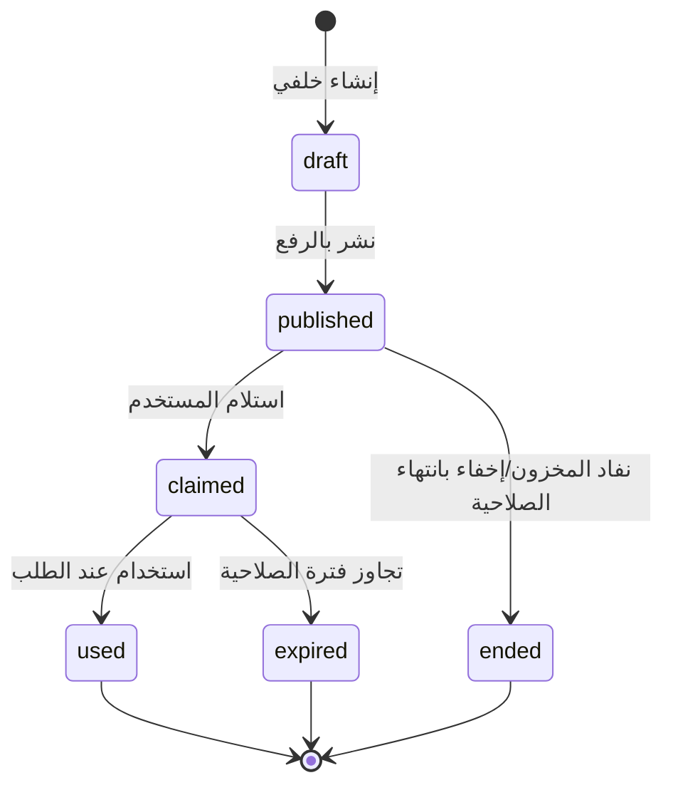
```mermaid
stateDiagram-v2
    [*] --> draft: إنشاء خلفي

    draft --> published: نشر بالرفع

    published --> claimed: استلام المستخدم

    claimed --> used: استخدام عند الطلب
    claimed --> expired: تجاوز فترة الصلاحية

    published --> ended: نفاد المخزون/إخفاء بانتهاء الصلاحية

    used --> [*]
    expired --> [*]
    ended --> [*]
```

## 5. دورة حياة سحب الفني

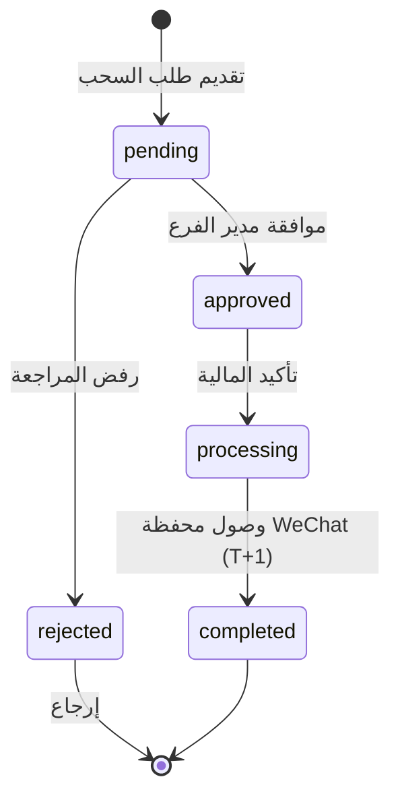
```mermaid
stateDiagram-v2
    [*] --> pending: تقديم طلب السحب

    pending --> approved: موافقة مدير الفرع
    pending --> rejected: رفض المراجعة

    rejected --> [*]: إرجاع

    approved --> processing: تأكيد المالية

    processing --> completed: وصول محفظة WeChat (T+1)

    completed --> [*]
```

## 6. دورة حياة مصادقة Token

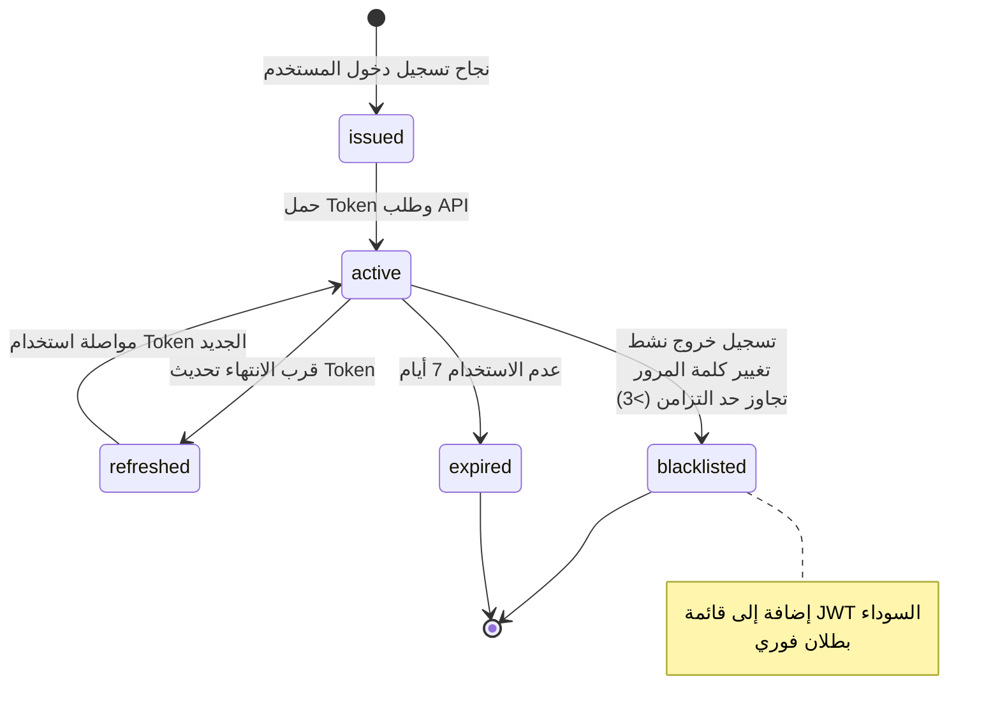
```mermaid
stateDiagram-v2
    [*] --> issued: نجاح تسجيل دخول المستخدم

    issued --> active: حمل Token وطلب API

    active --> refreshed: قرب الانتهاء تحديث Token

    refreshed --> active: مواصلة استخدام Token الجديد

    active --> blacklisted: تسجيل خروج نشط<br/>تغيير كلمة المرور<br/>تجاوز حد التزامن (>3)

    active --> expired: عدم الاستخدام 7 أيام

    blacklisted --> [*]
    expired --> [*]

    note right of blacklisted: إضافة إلى قائمة JWT السوداء<br/>بطلان فوري
```

## 7. دورة حياة نشاط التشكيل الجماعي

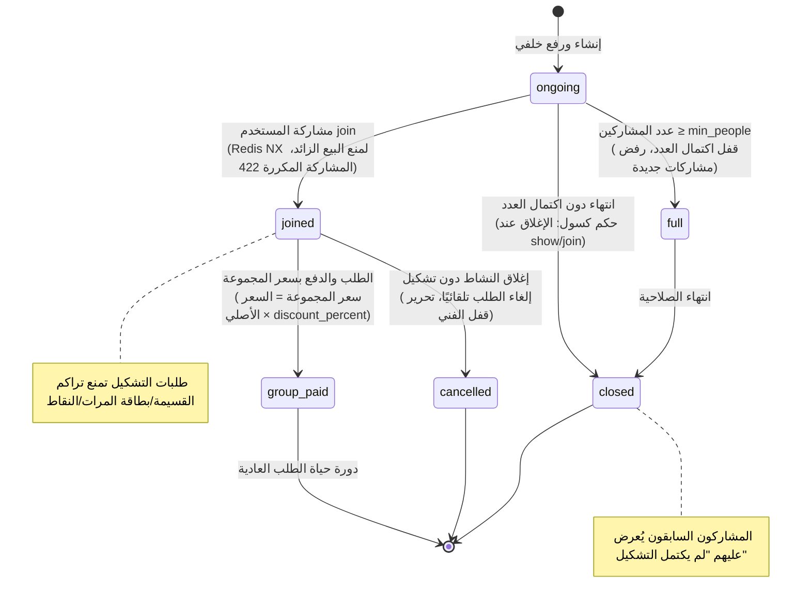
```mermaid
stateDiagram-v2
    [*] --> ongoing: إنشاء ورفع خلفي

    ongoing --> full: عدد المشاركين ≥ min_people<br/>(قفل اكتمال العدد، رفض مشاركات جديدة)

    ongoing --> closed: انتهاء دون اكتمال العدد<br/>(حكم كسول: الإغلاق عند show/join)

    full --> closed: انتهاء الصلاحية

    ongoing --> joined: مشاركة المستخدم join<br/>(Redis NX لمنع البيع الزائد، المشاركة المكررة 422)

    joined --> group_paid: الطلب والدفع بسعر المجموعة<br/>(سعر المجموعة = السعر الأصلي × discount_percent)

    joined --> cancelled: إغلاق النشاط دون تشكيل<br/>(إلغاء الطلب تلقائيًا، تحرير قفل الفني)

    group_paid --> [*]: دورة حياة الطلب العادية
    cancelled --> [*]
    closed --> [*]

    note right of joined: طلبات التشكيل تمنع تراكم القسيمة/بطاقة المرات/النقاط
    note right of closed: المشاركون السابقون يُعرض عليهم "لم يكتمل التشكيل"
```

## 8. دورة حياة إهداء القسيمة

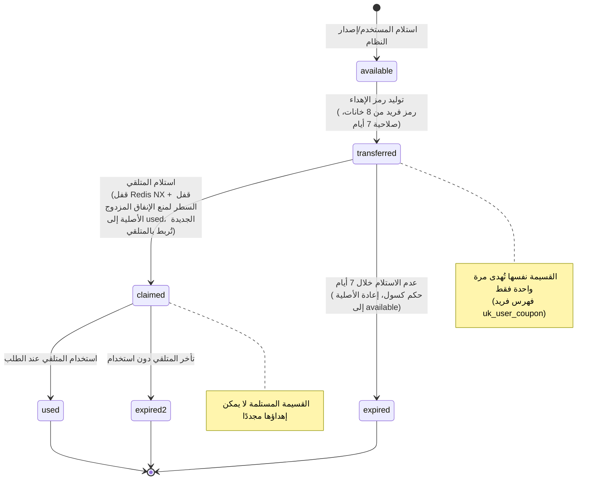
```mermaid
stateDiagram-v2
    [*] --> available: استلام المستخدم/إصدار النظام

    available --> transferred: توليد رمز الإهداء<br/>(رمز فريد من 8 خانات، صلاحية 7 أيام)

    transferred --> claimed: استلام المتلقي<br/>(قفل Redis NX + قفل السطر لمنع الإنفاق المزدوج<br/>الأصلية إلى used، الجديدة تُربط بالمتلقي)

    transferred --> expired: عدم الاستلام خلال 7 أيام<br/>(حكم كسول، إعادة الأصلية إلى available)

    claimed --> used: استخدام المتلقي عند الطلب
    claimed --> expired2: تأخر المتلقي دون استخدام

    used --> [*]
    expired --> [*]
    expired2 --> [*]

    note right of transferred: القسيمة نفسها تُهدى مرة واحدة فقط<br/>(فهرس فريد uk_user_coupon)
    note right of claimed: القسيمة المستلمة لا يمكن إهداؤها مجددًا
```

## 9. دورة حياة انتهاء النقاط

```mermaid
stateDiagram-v2
    [*] --> earned: تسجيل دخول/استرداد الاستهلاك/تعويض<br/>(expires_at = الآن + 365 يومًا)

    earned --> used: الخصم/استهلاك الاستبدال

    earned --> expired: انتهاء الصلاحية دون استخدام<br/>(PointsExpiryTimer مسح كل 60 ثانية<br/>كتابة سطر خصم سالب type=expire)

    expired --> [*]: إشعار داخلي "النقاط منتهية"
    used --> [*]

    note right of expired: تكرار ثلاثي الأثر: إعادة تحقق قفل السطر الأصلي<br/>+ ترقيم صفحات بمنزلق id + الإشعار من جولة الخصم فقط
```

## 10. دورة حياة التحويل (الجولة 19: تحويل الرصيد + إهداء النقاط)

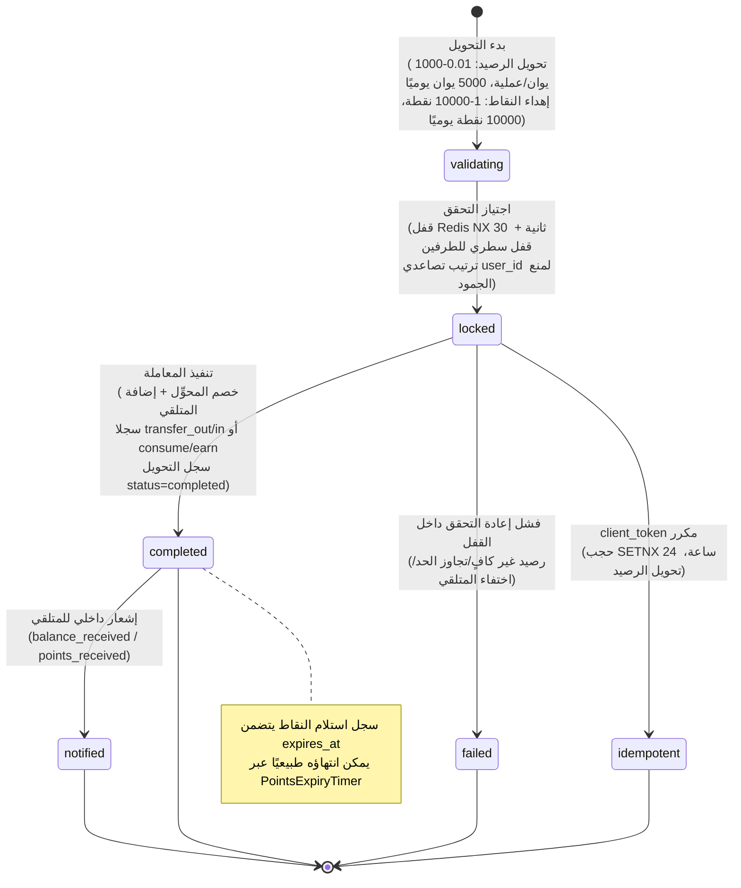
```mermaid
stateDiagram-v2
    [*] --> validating: بدء التحويل<br/>(تحويل الرصيد: 0.01-1000 يوان/عملية، 5000 يوان يوميًا<br/>إهداء النقاط: 1-10000 نقطة، 10000 نقطة يوميًا)

    validating --> locked: اجتياز التحقق<br/>(قفل Redis NX 30 ثانية + قفل سطري للطرفين<br/>ترتيب تصاعدي user_id لمنع الجمود)

    locked --> completed: تنفيذ المعاملة<br/>(خصم المحوِّل + إضافة المتلقي<br/>سجلا transfer_out/in أو consume/earn<br/>سجل التحويل status=completed)

    locked --> failed: فشل إعادة التحقق داخل القفل<br/>(رصيد غير كافٍ/تجاوز الحد/اختفاء المتلقي)
    locked --> idempotent: client_token مكرر<br/>(حجب SETNX 24 ساعة، تحويل الرصيد)

    completed --> notified: إشعار داخلي للمتلقي<br/>(balance_received / points_received)
    completed --> [*]
    failed --> [*]
    idempotent --> [*]
    notified --> [*]

    note right of completed: سجل استلام النقاط يتضمن expires_at<br/>يمكن انتهاؤه طبيعيًا عبر PointsExpiryTimer
```

## 11. دورة حياة تذكرة الدعم (الجولة 20)

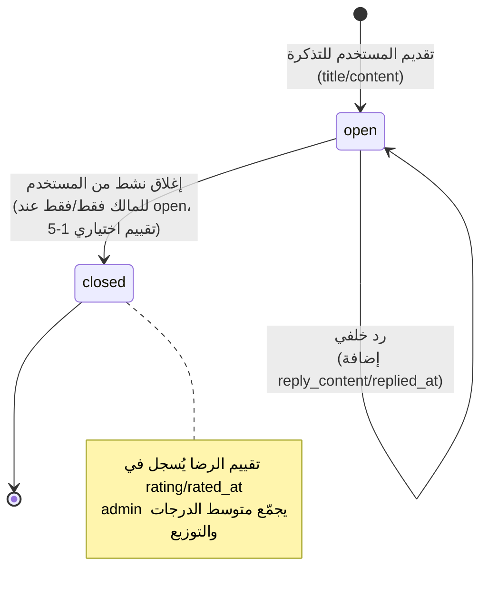
```mermaid
stateDiagram-v2
    [*] --> open: تقديم المستخدم للتذكرة<br/>(title/content)

    open --> open: رد خلفي<br/>(إضافة reply_content/replied_at)

    open --> closed: إغلاق نشط من المستخدم<br/>(للمالك فقط/فقط عند open، تقييم اختياري 1-5)

    closed --> [*]

    note right of closed: تقييم الرضا يُسجل في rating/rated_at<br/>admin يجمّع متوسط الدرجات والتوزيع
```

## 12. دورة حياة الفاتورة الإلكترونية (الجولة 20)

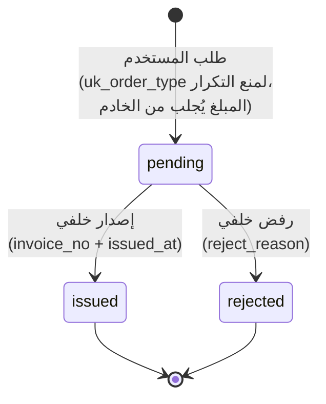
```mermaid
stateDiagram-v2
    [*] --> pending: طلب المستخدم<br/>(uk_order_type لمنع التكرار،<br/>المبلغ يُجلب من الخادم)

    pending --> issued: إصدار خلفي<br/>(invoice_no + issued_at)

    pending --> rejected: رفض خلفي<br/>(reject_reason)

    issued --> [*]
    rejected --> [*]
```

## 13. دورة حياة نشاط الخصم الشرطي (الجولة 22)

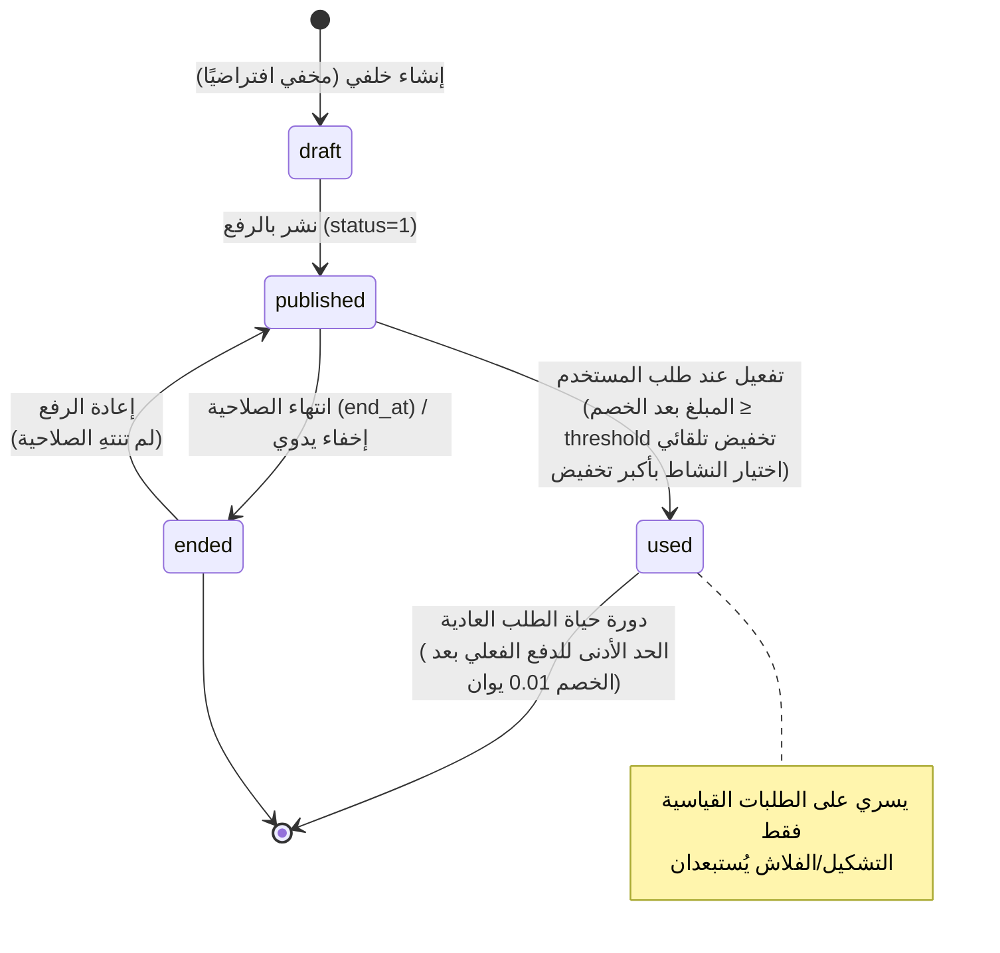
```mermaid
stateDiagram-v2
    [*] --> draft: إنشاء خلفي (مخفي افتراضيًا)

    draft --> published: نشر بالرفع (status=1)

    published --> ended: انتهاء الصلاحية (end_at) / إخفاء يدوي

    published --> used: تفعيل عند طلب المستخدم<br/>(المبلغ بعد الخصم ≥ threshold تخفيض تلقائي<br/>اختيار النشاط بأكبر تخفيض)

    used --> [*]: دورة حياة الطلب العادية<br/>(الحد الأدنى للدفع الفعلي بعد الخصم 0.01 يوان)

    ended --> published: إعادة الرفع<br/>(لم تنتهِ الصلاحية)
    ended --> [*]

    note right of used: يسري على الطلبات القياسية فقط<br/>التشكيل/الفلاش يُستبعدان
```

## 15. دورة حياة سحب الدولاب (الجولة 23)

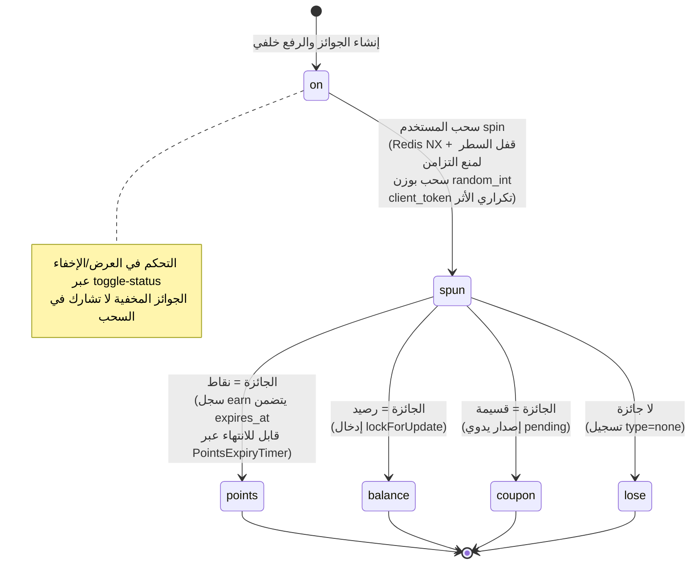
```mermaid
stateDiagram-v2
    [*] --> on: إنشاء الجوائز والرفع خلفي

    on --> spun: سحب المستخدم spin<br/>(Redis NX + قفل السطر لمنع التزامن<br/>سحب بوزن random_int<br/>client_token تكراري الأثر)

    spun --> points: الجائزة = نقاط<br/>(سجل earn يتضمن expires_at<br/>قابل للانتهاء عبر PointsExpiryTimer)

    spun --> balance: الجائزة = رصيد<br/>(إدخال lockForUpdate)

    spun --> coupon: الجائزة = قسيمة<br/>(إصدار يدوي pending)

    spun --> lose: لا جائزة<br/>(تسجيل type=none)

    points --> [*]
    balance --> [*]
    coupon --> [*]
    lose --> [*]

    note right of on: التحكم في العرض/الإخفاء عبر toggle-status<br/>الجوائز المخفية لا تشارك في السحب
```

## 14. دورة حياة إلغاء الحساب (الجولة 22)

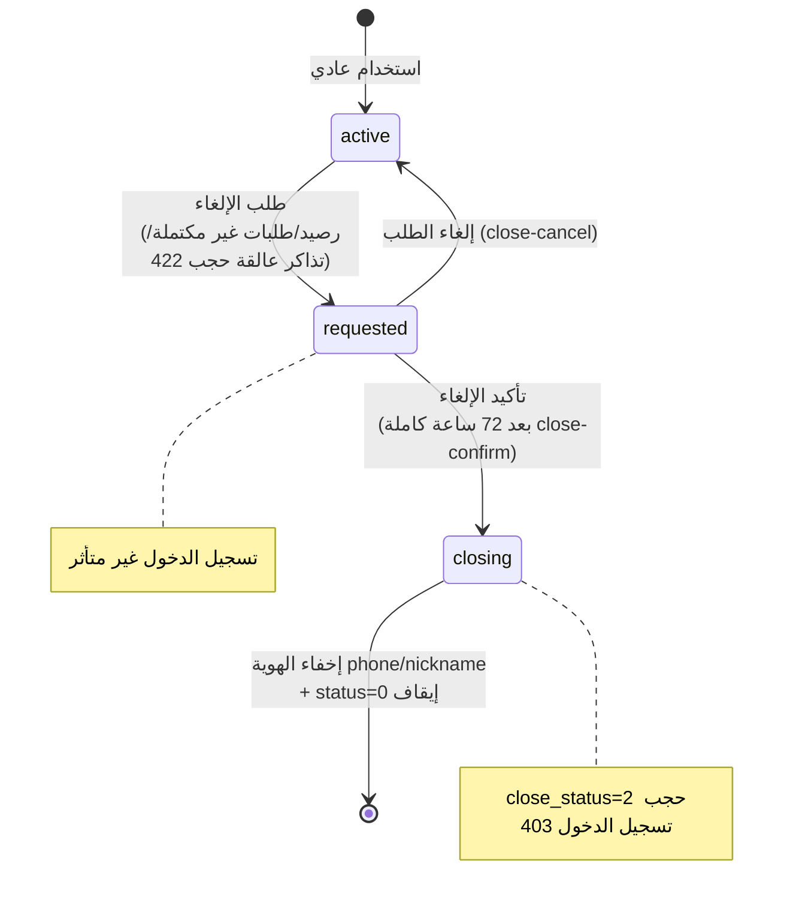
```mermaid
stateDiagram-v2
    [*] --> active: استخدام عادي

    active --> requested: طلب الإلغاء<br/>(رصيد/طلبات غير مكتملة/تذاكر عالقة حجب 422)

    requested --> active: إلغاء الطلب (close-cancel)

    requested --> closing: تأكيد الإلغاء<br/>(بعد 72 ساعة كاملة close-confirm)

    closing --> [*]: إخفاء الهوية phone/nickname<br/>+ status=0 إيقاف

    note right of requested: تسجيل الدخول غير متأثر
    note right of closing: close_status=2 حجب تسجيل الدخول 403
```

## 16. دورة حياة نشاط الفلاش (الجولة 24)

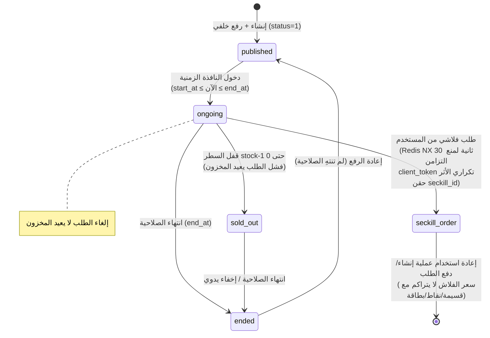
```mermaid
stateDiagram-v2
    [*] --> published: إنشاء + رفع خلفي (status=1)

    published --> ongoing: دخول النافذة الزمنية<br/>(start_at ≤ الآن ≤ end_at)

    ongoing --> sold_out: قفل السطر stock-1 حتى 0<br/>(فشل الطلب يعيد المخزون)

    ongoing --> ended: انتهاء الصلاحية (end_at)

    sold_out --> ended: انتهاء الصلاحية / إخفاء يدوي

    ended --> published: إعادة الرفع (لم تنتهِ الصلاحية)

    ongoing --> seckill_order: طلب فلاشي من المستخدم<br/>(Redis NX 30 ثانية لمنع التزامن<br/>client_token تكراري الأثر<br/>حقن seckill_id)

    seckill_order --> [*]: إعادة استخدام عملية إنشاء/دفع الطلب<br/>(سعر الفلاش لا يتراكم مع قسيمة/نقاط/بطاقة)

    note right of ongoing: إلغاء الطلب لا يعيد المخزون
```

## 17. دورة حياة مكافأة العميل العائد (الجولة 24)

```mermaid
stateDiagram-v2
    [*] --> completed: اكتمال الطلب<br/>(WorkController::complete معاملة بقفل السطر)

    completed --> checked: تحديد الاستهلاك الثاني لنفس الفني خلال 30 يومًا

    checked --> none: استهلاك أول / المفتاح مغلق<br/>(enabled=0)

    checked --> pending: استهلاك ثانٍ<br/>(المكافأة = الدفع الفعلي × ratio<br/>تكراري الأثر بنفس order_id+type)

    pending --> settled: تسوية موحدة عبر سلسلة تسوية العمولة<br/>(appointment_technician_earnings<br/>type=return_customer)

    settled --> [*]
    none --> [*]

    note right of pending: status=pending<br/>ملخص أرباح طرف الفني يشملها تلقائيًا
```
