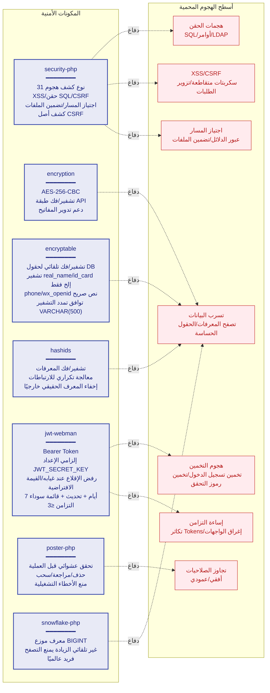
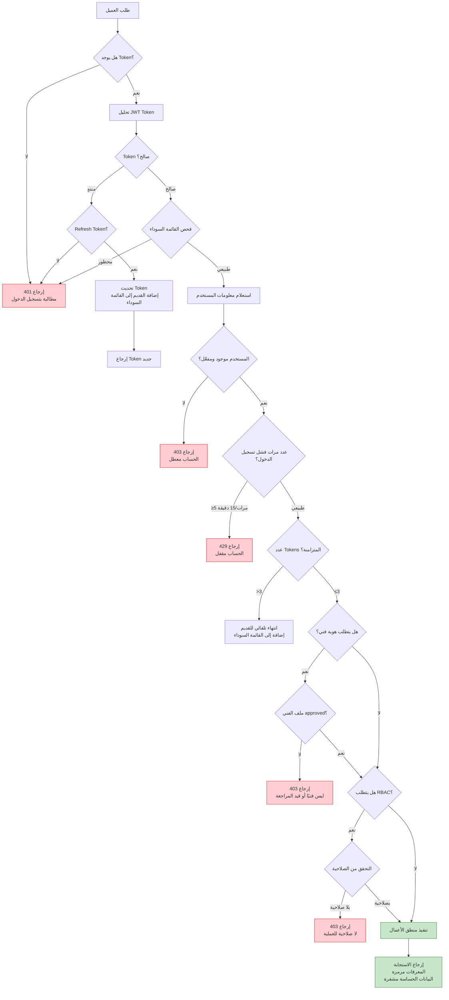
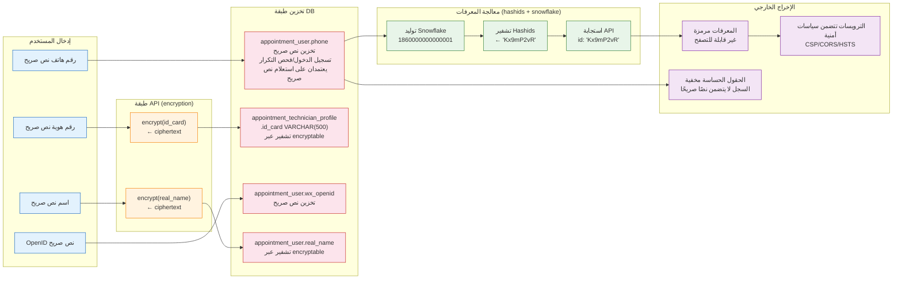

# مخطط البنية الأمنية
> **Languages**: [中文](../../diagrams/SECURITY-ARCHITECTURE.md) · [English](../../en/diagrams/SECURITY-ARCHITECTURE.md) · [한국어](../../ko/diagrams/SECURITY-ARCHITECTURE.md) · [Русский](../../ru/diagrams/SECURITY-ARCHITECTURE.md) · [Deutsch](../../de/diagrams/SECURITY-ARCHITECTURE.md) · [Français](../../fr/diagrams/SECURITY-ARCHITECTURE.md) · [Español](../../es/diagrams/SECURITY-ARCHITECTURE.md) · [Português](../../pt/diagrams/SECURITY-ARCHITECTURE.md) · [हिन्दी](../../hi/diagrams/SECURITY-ARCHITECTURE.md) · [বাংলা](../../bn/diagrams/SECURITY-ARCHITECTURE.md) · [Bahasa Indonesia](../../id/diagrams/SECURITY-ARCHITECTURE.md) · [日本語](../../ja/diagrams/SECURITY-ARCHITECTURE.md)

## 1. نظام الدفاع متعدد الطبقات

```mermaid
graph TB
    subgraph 边界防护["الطبقة الأولى: حماية الحدود"]
        WAF["WAF / Nginx<br/>ترويسات استجابة أمنية<br/>حماية الملفات الحساسة<br/>TLS 1.3"]
    end

    subgraph 接入防护["الطبقة الثانية: حماية الوصول"]
        CORS["وسيط Cors<br/>قائمة بيضاء CORS_ALLOW_ORIGIN<br/>إعادة عرض * · عدم الإعداد يعني نفس الأصل فقط<br/>6 ترويسات استجابة أمنية<br/>فحص مسبق OPTIONS"]
    end

    subgraph 攻击检测["الطبقة الثالثة: كشف الهجمات"]
        SEC["وسيط Security<br/>erikwang2013/security-php<br/>31 كاشف هجوم<br/>XSS / حقن SQL / CSRF<br/>اجتياز المسار / تضمين الملفات<br/>كشف أصل CSRF (block)"]
        BLOCK["حظر تلقائي<br/>5 هجمات / 60 ثانية<br/>← قائمة IP السوداء 15 دقيقة"]
    end

    subgraph 流量控制["الطبقة الرابعة: التحكم في الحركة"]
        RL["وسيط RateLimit<br/>نافذة منزلقة Redis + Lua ذرية<br/>الافتراضي: 60 مرة/دقيقة/IP<br/>تسجيل الدخول: 10 مرات/دقيقة<br/>التسجيل: 5 مرات/دقيقة<br/>رمز التحقق: مرة/60 ثانية/رقم هاتف"]
    end

    subgraph 身份认证["الطبقة الخامسة: مصادقة الهوية"]
        AUTH["وسيط Auth<br/>JWT Bearer Token (7 أيام)<br/>إلزامي الإعداد JWT_SECRET_KEY<br/>رفض الإقلاع عند غيابه/قيمة افتراضية عامة<br/>كلمات مرور bcrypt<br/>تحديث Token + قائمة سوداء<br/>قفل تسجيل الدخول: 5 فشلات ← 15 دقيقة<br/>حد التزامن: 3 Tokens كحد أقصى"]
        TECH_AUTH["TechnicianAuth<br/>التحقق من ملف الفني<br/>فحص حالة approved"]
        ADMIN_AUTH["AdminAuth<br/>مصادقة JWT لطرف الإدارة<br/>قائمة Token السوداء"]
    end

    subgraph 权限控制["الطبقة السادسة: التحكم في الصلاحيات"]
        RBAC["AdminPermission<br/>التحقق من صلاحيات الأدوار RBAC<br/>تخزين مؤقت Redis 60 ثانية<br/>مستخدم ← دور ← صلاحية"]
        POSTER["تحقق Poster<br/>erikwang2013/poster-php<br/>حذف/مراجعة/سحب<br/>تحقق عشوائي للعمليات الحساسة"]
    end

    subgraph 数据安全["الطبقة السابعة: أمان البيانات"]
        ENC_API["تشفير طبقة API<br/>erikwang2013/encryption<br/>تشفير/فك الحقول الحساسة"]
        ENC_DB["تشفير طبقة DB<br/>erikwang2013/encryptable<br/>تشفير/فك تلقائي عبر trait النموذج<br/>تشفير real_name/id_card إلخ فقط<br/>phone/wx_openid يجب تخزينهما نصًا صريحًا<br/>(تسجيل الدخول/فحص التكرار يعتمدان على استعلام نص صريح)"]
        HASHID["تشفير/فك المعرفات<br/>erikwang2013/hashids<br/>إخفاء المعرف الحقيقي خارجيًا<br/>تشفير/فك تكراري"]
        SLOG["سجل أمني<br/>إخفاء موحد للشواذ M3<br/>نص عام + Log::error<br/>البيانات الحساسة لا تدخل السجل<br/>OperationLog مصادر 8 أطراف"]
    end

    subgraph 管理端防护["الطبقة الثامنة: حماية طرف الإدارة"]
        EXCEL["حماية التصدير<br/>safeCellValue()<br/>بدء بـ = + - @ / Tab/CR<br/>بادئة ' للهروب من حقن الصيغ"]
        UPLOAD["تحقق الرفع<br/>finfo magic bytes<br/>عدم تطابق MIME مع الامتداد<br/>← رفض 422"]
        INSTALL["قفل التثبيت<br/>مثبّت بالفعل (installed=1<br/>أو وجود مدير)<br/>← 404 تعطيل معالج التثبيت"]
    end

    请求["HTTP Request"] --> WAF
    WAF --> CORS
    CORS --> SEC
    SEC -->|"اجتياز"| RL
    SEC -->|"رصد هجوم"| BLOCK
    BLOCK -.->|"رفض"| 拒绝["HTTP 403/429<br/>تسجيل سجل الهجوم"]
    RL -->|"اجتياز"| AUTH
    RL -->|"تجاوز الحد"| 限流拒绝["HTTP 429<br/>Retry-After"]
    AUTH --> TECH_AUTH
    AUTH --> ADMIN_AUTH
    TECH_AUTH --> RBAC
    ADMIN_AUTH --> RBAC
    RBAC --> POSTER
    POSTER --> ENC_API
    ENC_API --> ENC_DB
    ENC_DB --> HASHID
    HASHID --> SLOG
    SLOG --> EXCEL
    EXCEL --> UPLOAD
    UPLOAD --> INSTALL
    INSTALL --> 响应["HTTP Response<br/>البيانات مشفرة + مرمزة"]

    classDef layer1 fill:#e3f2fd,stroke:#1565c0,stroke-width:2px,color:#01579b
    classDef layer2 fill:#bbdefb,stroke:#1976d2,stroke-width:2px,color:#01579b
    classDef layer3 fill:#ffcdd2,stroke:#c62828,stroke-width:2px,color:#b71c1c
    classDef layer4 fill:#fff9c4,stroke:#f9a825,stroke-width:2px,color:#f57f17
    classDef layer5 fill:#c8e6c9,stroke:#2e7d32,stroke-width:2px,color:#1b5e20
    classDef layer6 fill:#e1bee7,stroke:#7b1fa2,stroke-width:2px,color:#4a148c
    classDef layer7 fill:#d7ccc8,stroke:#5d4037,stroke-width:2px,color:#3e2723
    classDef layer8 fill:#cfd8dc,stroke:#37474f,stroke-width:2px,color:#263238
    classDef reject fill:#ff5252,stroke:#b71c1c,stroke-width:2px,color:#fff

    class WAF layer1
    class CORS layer2
    class SEC,BLOCK layer3
    class RL layer4
    class AUTH,TECH_AUTH,ADMIN_AUTH layer5
    class RBAC,POSTER layer6
    class ENC_API,ENC_DB,HASHID,SLOG layer7
    class EXCEL,UPLOAD,INSTALL layer8
    class 拒绝,限流拒绝 reject
```

## 2. مصفوفة المكونات الأمنية

## 3. تدفق المصادقة والتفويض

## 4. تدفق أمان البيانات

