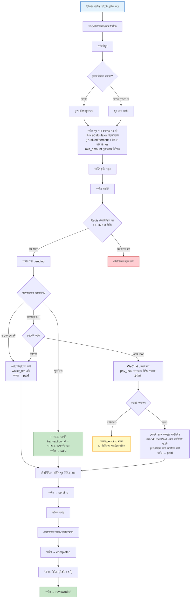
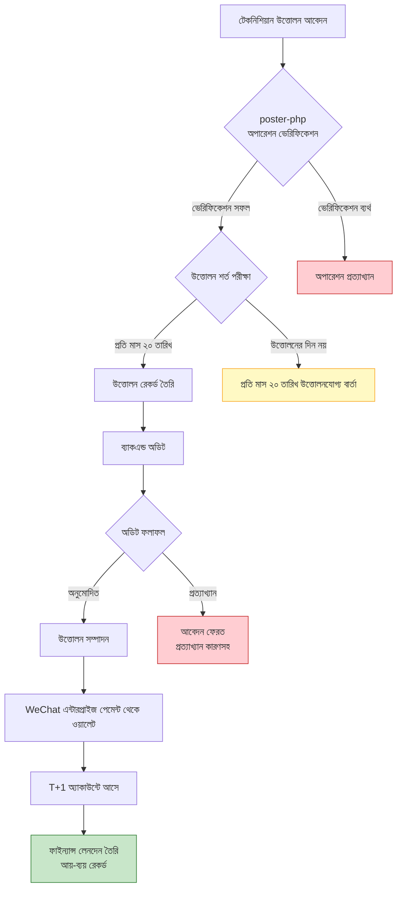
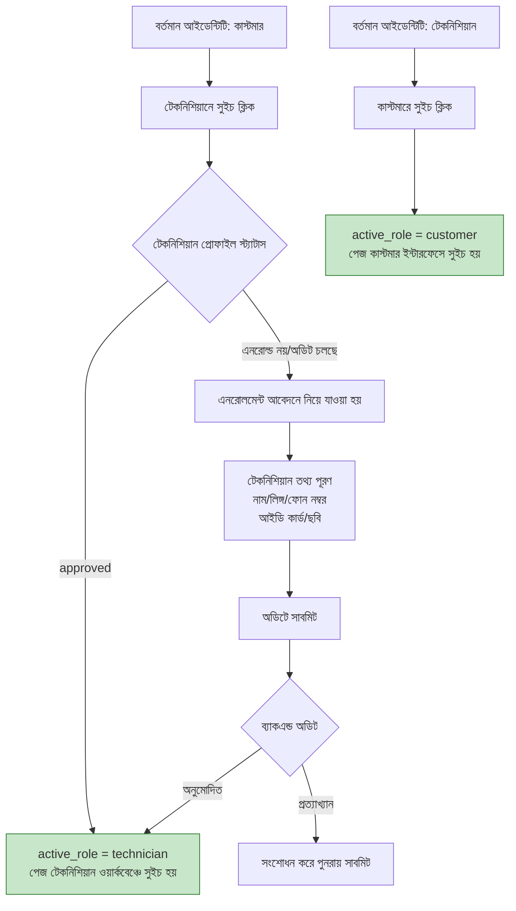
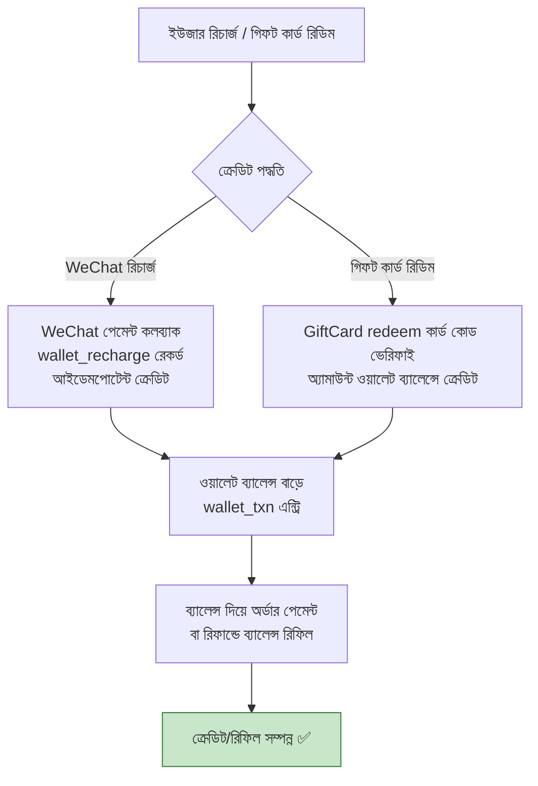

# কোর বিজনেস ফ্লোচার্ট
> **Languages**: [中文](../../diagrams/FLOWCHART.md) · [English](../../en/diagrams/FLOWCHART.md) · [한국어](../../ko/diagrams/FLOWCHART.md) · [Русский](../../ru/diagrams/FLOWCHART.md) · [Deutsch](../../de/diagrams/FLOWCHART.md) · [Français](../../fr/diagrams/FLOWCHART.md) · [Español](../../es/diagrams/FLOWCHART.md) · [Português](../../pt/diagrams/FLOWCHART.md) · [हिन्दी](../../hi/diagrams/FLOWCHART.md) · [العربية](../../ar/diagrams/FLOWCHART.md) · [Bahasa Indonesia](../../id/diagrams/FLOWCHART.md) · [日本語](../../ja/diagrams/FLOWCHART.md)

> বাংলা অনুবাদ · মূল: [中文](../../diagrams/FLOWCHART.md)

## 1. সার্ভিস বুকিং ফ্লো

## 2. পেমেন্ট ও রিফান্ড ফ্লো

```mermaid
flowchart TD
    subgraph 支付流程["ফরওয়ার্ড পেমেন্ট ফ্লো"]
        P1["পেমেন্ট রেকর্ড তৈরি"] --> P2["WeChat ইউনিফাইড অর্ডার<br/>pay_lock কনকারেন্সি প্রতিরোধ<br/>out_trade_no = order_no আইডেমপোটেন্ট"]
        P2 --> P3["ফ্রন্টএন্ড পেমেন্ট শুরু<br/>পেমেন্ট পদ্ধতি নির্বাচন"]
        P3 -->|"ব্যালেন্স"| PB["ওয়ালেট ব্যালেন্স কাটা<br/>wallet_txn এন্ট্রি<br/>আইডেমপোটেন্ট শুধু একবার কাটে"]
        P3 -->|"WeChat"| P4["WeChat কলব্যাক notify"]
        P4 --> P5["সাইন ভেরিফিকেশন সফল"]
        PB --> P6["markOrderPaid আইডেমপোটেন্ট<br/>কুপন/টাইমস কার্ড শুধু এখানেই কনজিউম হয়"]
        P5 --> P6
        P6 --> P7["অর্ডার → paid<br/>ইউজার + টেকনিশিয়ানকে নোটিফিকেশন"]
    end

    subgraph 退款流程["রিফান্ড ফ্লো"]
        R1["ইউজার রিফান্ড আবেদন<br/>refund_lock কনকারেন্সি প্রতিরোধ"] --> R2{"রিফান্ড নিয়ম নির্ধারণ"}
        R2 -->|"অর্ডার ≤১৫ মিনিট বা শুরু >৬ ঘণ্টা আগে"| R3["রিফান্ড 100%"]
        R2 -->|"শুরু ≤৬ ঘণ্টা আগে"| R4["রিফান্ড 90%"]
        R2 -->|"শুরু হয়েছে নিশ্চিত হয়নি"| R5["রিফান্ড 80%"]
        R2 -->|"সার্ভিস নিশ্চিত হওয়ার পর"| R6["রিফান্ড নেই"]
        R3 --> R7["অর্ডার → refunding"]
        R4 --> R7
        R5 --> R7
        R7 --> R8["দ্বি-স্তর অনুমোদন<br/>শাখা ম্যানেজার → ফাইন্যান্স"]
        R8 --> R9["দ্বি-পর্যায় রিফান্ড<br/>ট্রানজেকশনের ভেতরে রিফান্ড রেকর্ড তৈরি<br/>ট্রানজেকশনের বাইরে WeChat রিফান্ড IO"]
        R9 -->|"WeChat ব্যর্থ"| R10["অর্ডার PAID-এ রোলব্যাক<br/>রিফান্ড পুনরায় চেষ্টাযোগ্য"]
        R9 -->|"রিফান্ড সফল"| R11["অর্ডার → refunded<br/>WeChat মূল পথে ফেরত / ব্যালেন্স রিফিল<br/>কুপন ফেরত + পয়েন্ট রিবেট"]
    end

    style P6 fill:#c8e6c9,stroke:#2e7d32,color:#333
    style R6 fill:#ffcdd2,stroke:#c62828,color:#333
    style R11 fill:#c8e6c9,stroke:#2e7d32,color:#333
    style R10 fill:#fff9c4,stroke:#f9a825,color:#333
```

## 3. টেকনিশিয়ান উত্তোলন ফ্লো

## 4. আইডেন্টিটি সুইচ ফ্লো

## 5. ওয়ালেট রিচার্জ/গিফট কার্ড ক্রেডিট ফ্লো

