# লাইফসাইকেল ডায়াগ্রাম
> **Languages**: [中文](../../diagrams/LIFECYCLE-DIAGRAM.md) · [English](../../en/diagrams/LIFECYCLE-DIAGRAM.md) · [한국어](../../ko/diagrams/LIFECYCLE-DIAGRAM.md) · [Русский](../../ru/diagrams/LIFECYCLE-DIAGRAM.md) · [Deutsch](../../de/diagrams/LIFECYCLE-DIAGRAM.md) · [Français](../../fr/diagrams/LIFECYCLE-DIAGRAM.md) · [Español](../../es/diagrams/LIFECYCLE-DIAGRAM.md) · [Português](../../pt/diagrams/LIFECYCLE-DIAGRAM.md) · [हिन्दी](../../hi/diagrams/LIFECYCLE-DIAGRAM.md) · [العربية](../../ar/diagrams/LIFECYCLE-DIAGRAM.md) · [Bahasa Indonesia](../../id/diagrams/LIFECYCLE-DIAGRAM.md) · [日本語](../../ja/diagrams/LIFECYCLE-DIAGRAM.md)

> বাংলা অনুবাদ · মূল: [中文](../../diagrams/LIFECYCLE-DIAGRAM.md)

## 1. অর্ডার লাইফসাইকেল (স্টেট মেশিন)

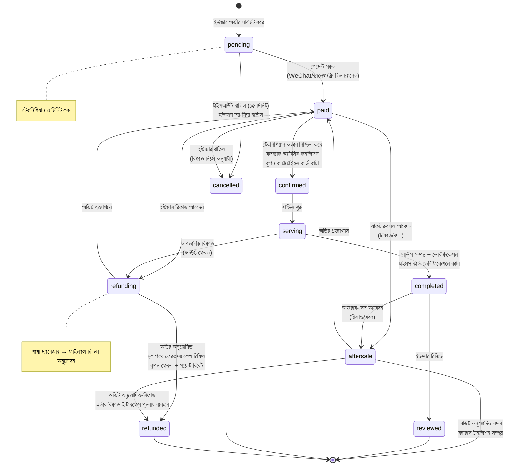
```mermaid
stateDiagram-v2
    [*] --> pending: ইউজার অর্ডার সাবমিট করে

    pending --> paid: পেমেন্ট সফল<br/>(WeChat/ব্যালেন্স/ফ্রি তিন চ্যানেল)

    pending --> cancelled: টাইমআউট বাতিল (১৫ মিনিট)<br/>ইউজার স্বয়ংক্রিয় বাতিল

    paid --> confirmed: টেকনিশিয়ান অর্ডার নিশ্চিত করে<br/>কলব্যাক অ্যাটমিক কনজিউম<br/>কুপন কাটা/টাইমস কার্ড কাটা
    paid --> cancelled: ইউজার বাতিল<br/>(রিফান্ড নিয়ম অনুযায়ী)
    paid --> refunding: ইউজার রিফান্ড আবেদন
    paid --> aftersale: আফটার-সেল আবেদন<br/>(রিফান্ড/বদল)

    confirmed --> serving: সার্ভিস শুরু

    serving --> completed: সার্ভিস সম্পন্ন + ভেরিফিকেশন<br/>টাইমস কার্ড ভেরিফিকেশনে কাটা

    serving --> refunding: অস্বাভাবিক রিফান্ড<br/>(৮০% ফেরত)

    completed --> reviewed: ইউজার রিভিউ
    completed --> aftersale: আফটার-সেল আবেদন<br/>(রিফান্ড/বদল)

    refunding --> refunded: অডিট অনুমোদিত<br/>মূল পথে ফেরত/ব্যালেন্স রিফিল<br/>কুপন ফেরত + পয়েন্ট রিবেট
    refunding --> paid: অডিট প্রত্যাখ্যান

    aftersale --> refunded: অডিট অনুমোদিত-রিফান্ড<br/>অর্ডার রিফান্ড ইন্টারফেস পুনরায় ব্যবহার
    aftersale --> paid: অডিট প্রত্যাখ্যান
    aftersale --> [*]: অডিট অনুমোদিত-বদল<br/>স্ট্যাটাস ট্রানজিশন সম্পন্ন

    reviewed --> [*]
    cancelled --> [*]
    refunded --> [*]

    note right of pending: টেকনিশিয়ান ৩ মিনিট লক
    note right of refunding: শাখা ম্যানেজার → ফাইন্যান্স দ্বি-স্তর অনুমোদন
```

## 2. মেম্বার কার্ড লাইফসাইকেল

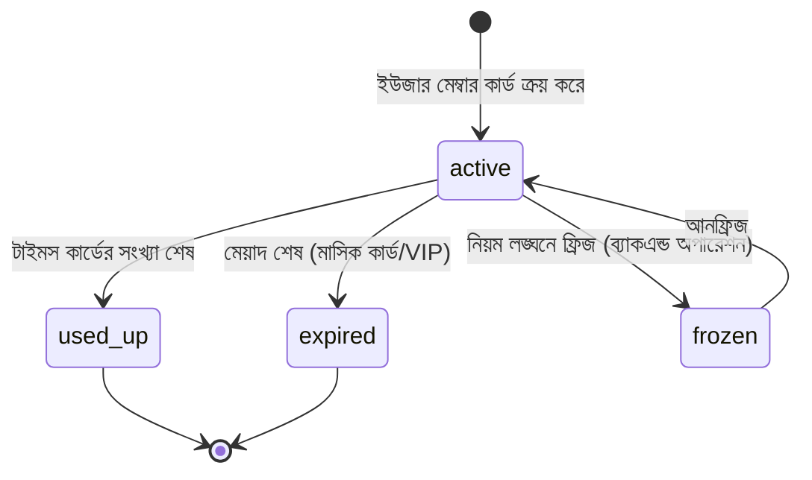
```mermaid
stateDiagram-v2
    [*] --> active: ইউজার মেম্বার কার্ড ক্রয় করে

    active --> used_up: টাইমস কার্ডের সংখ্যা শেষ

    active --> expired: মেয়াদ শেষ (মাসিক কার্ড/VIP)

    active --> frozen: নিয়ম লঙ্ঘনে ফ্রিজ (ব্যাকএন্ড অপারেশন)

    frozen --> active: আনফ্রিজ

    used_up --> [*]
    expired --> [*]
```

## 3. টেকনিশিয়ান এনরোলমেন্ট লাইফসাইকেল

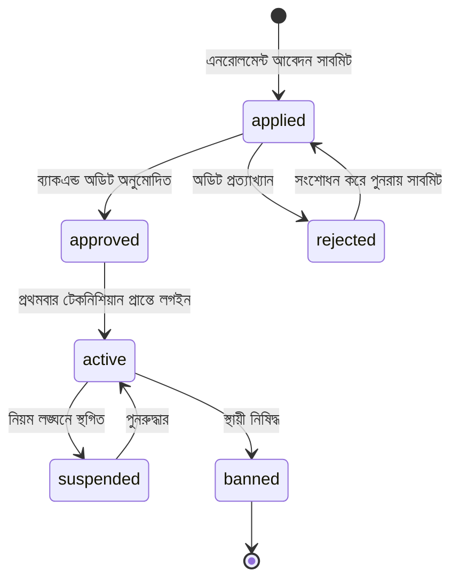
```mermaid
stateDiagram-v2
    [*] --> applied: এনরোলমেন্ট আবেদন সাবমিট

    applied --> approved: ব্যাকএন্ড অডিট অনুমোদিত
    applied --> rejected: অডিট প্রত্যাখ্যান

    rejected --> applied: সংশোধন করে পুনরায় সাবমিট

    approved --> active: প্রথমবার টেকনিশিয়ান প্রান্তে লগইন

    active --> suspended: নিয়ম লঙ্ঘনে স্থগিত
    suspended --> active: পুনরুদ্ধার
    active --> banned: স্থায়ী নিষিদ্ধ

    banned --> [*]
```

## 4. কুপন লাইফসাইকেল

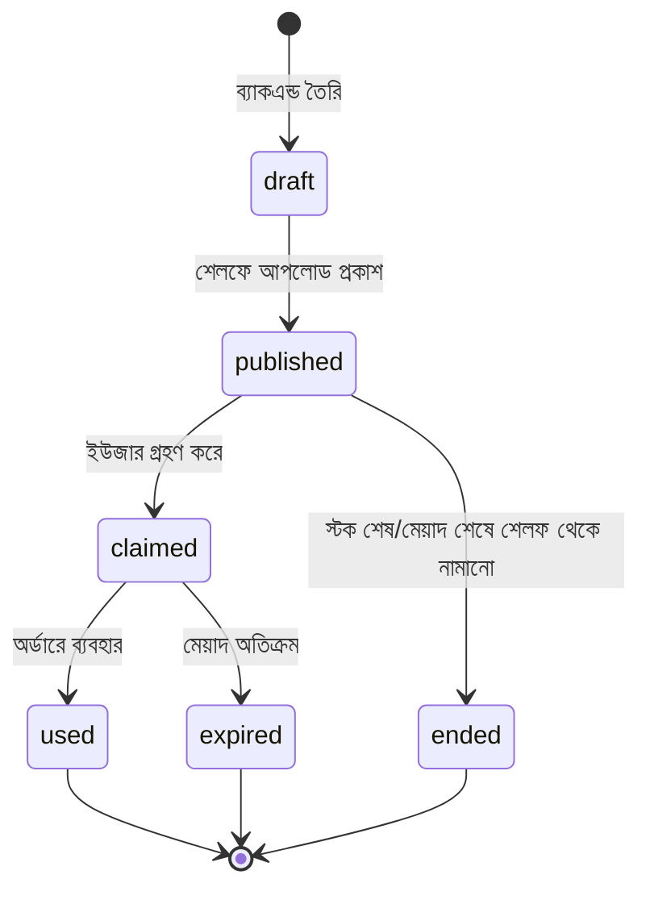
```mermaid
stateDiagram-v2
    [*] --> draft: ব্যাকএন্ড তৈরি

    draft --> published: শেলফে আপলোড প্রকাশ

    published --> claimed: ইউজার গ্রহণ করে

    claimed --> used: অর্ডারে ব্যবহার
    claimed --> expired: মেয়াদ অতিক্রম

    published --> ended: স্টক শেষ/মেয়াদ শেষে শেলফ থেকে নামানো

    used --> [*]
    expired --> [*]
    ended --> [*]
```

## 5. টেকনিশিয়ান উত্তোলন লাইফসাইকেল

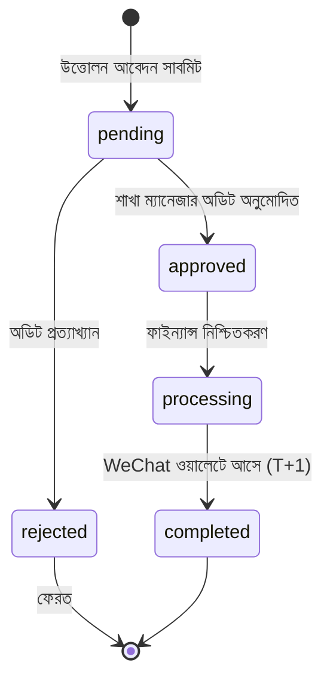
```mermaid
stateDiagram-v2
    [*] --> pending: উত্তোলন আবেদন সাবমিট

    pending --> approved: শাখা ম্যানেজার অডিট অনুমোদিত
    pending --> rejected: অডিট প্রত্যাখ্যান

    rejected --> [*]: ফেরত

    approved --> processing: ফাইন্যান্স নিশ্চিতকরণ

    processing --> completed: WeChat ওয়ালেটে আসে (T+1)

    completed --> [*]
```

## 6. Token অথেনটিকেশন লাইফসাইকেল

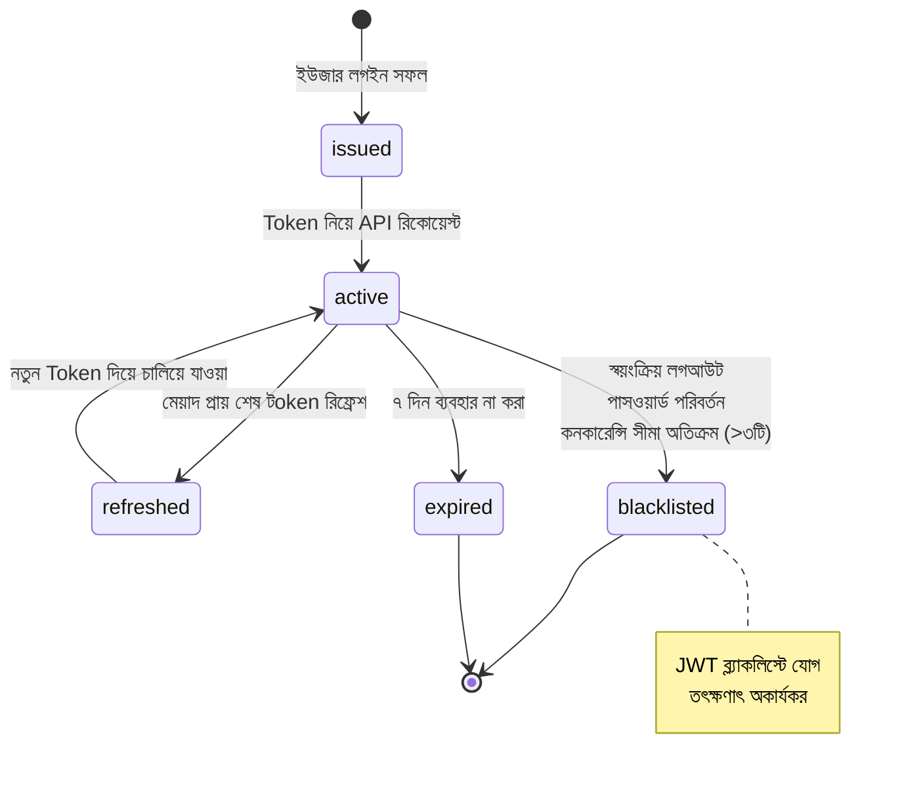
```mermaid
stateDiagram-v2
    [*] --> issued: ইউজার লগইন সফল

    issued --> active: Token নিয়ে API রিকোয়েস্ট

    active --> refreshed: মেয়াদ প্রায় শেষ টoken রিফ্রেশ

    refreshed --> active: নতুন Token দিয়ে চালিয়ে যাওয়া

    active --> blacklisted: স্বয়ংক্রিয় লগআউট<br/>পাসওয়ার্ড পরিবর্তন<br/>কনকারেন্সি সীমা অতিক্রম (>৩টি)

    active --> expired: ৭ দিন ব্যবহার না করা

    blacklisted --> [*]
    expired --> [*]

    note right of blacklisted: JWT ব্ল্যাকলিস্টে যোগ<br/>তৎক্ষণাৎ অকার্যকর
```

## 7. গ্রুপবাই অ্যাক্টিভিটি লাইফসাইকেল

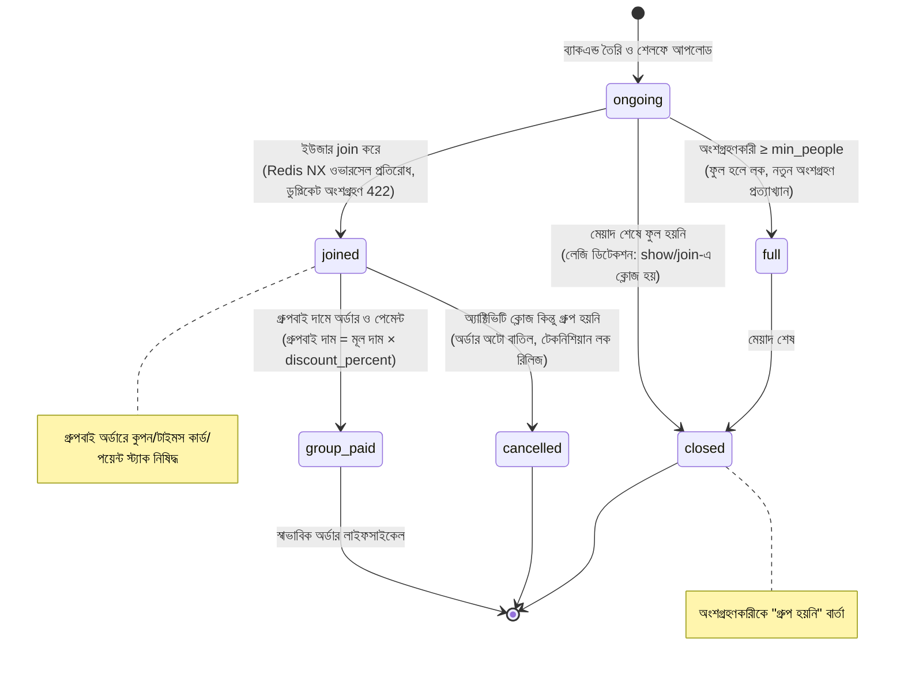
```mermaid
stateDiagram-v2
    [*] --> ongoing: ব্যাকএন্ড তৈরি ও শেলফে আপলোড

    ongoing --> full: অংশগ্রহণকারী ≥ min_people<br/>(ফুল হলে লক, নতুন অংশগ্রহণ প্রত্যাখ্যান)

    ongoing --> closed: মেয়াদ শেষে ফুল হয়নি<br/>(লেজি ডিটেকশন: show/join-এ ক্লোজ হয়)

    full --> closed: মেয়াদ শেষ

    ongoing --> joined: ইউজার join করে<br/>(Redis NX ওভারসেল প্রতিরোধ, ডুপ্লিকেট অংশগ্রহণ 422)

    joined --> group_paid: গ্রুপবাই দামে অর্ডার ও পেমেন্ট<br/>(গ্রুপবাই দাম = মূল দাম × discount_percent)

    joined --> cancelled: অ্যাক্টিভিটি ক্লোজ কিন্তু গ্রুপ হয়নি<br/>(অর্ডার অটো বাতিল, টেকনিশিয়ান লক রিলিজ)

    group_paid --> [*]: স্বাভাবিক অর্ডার লাইফসাইকেল
    cancelled --> [*]
    closed --> [*]

    note right of joined: গ্রুপবাই অর্ডারে কুপন/টাইমস কার্ড/পয়েন্ট স্ট্যাক নিষিদ্ধ
    note right of closed: অংশগ্রহণকারীকে "গ্রুপ হয়নি" বার্তা
```

## 8. কুপন ট্রান্সফার লাইফসাইকেল

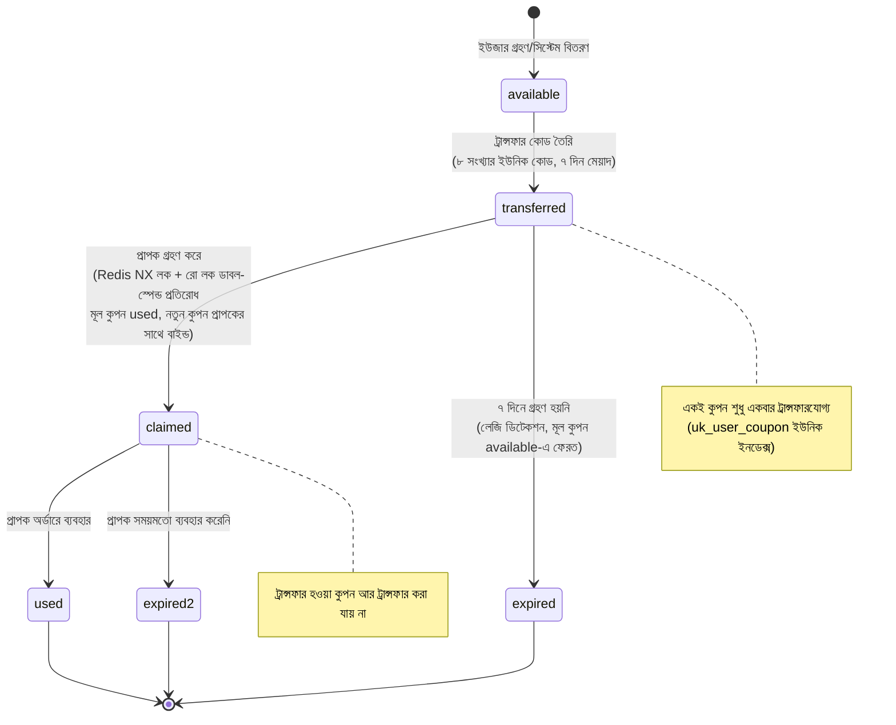
```mermaid
stateDiagram-v2
    [*] --> available: ইউজার গ্রহণ/সিস্টেম বিতরণ

    available --> transferred: ট্রান্সফার কোড তৈরি<br/>(৮ সংখ্যার ইউনিক কোড, ৭ দিন মেয়াদ)

    transferred --> claimed: প্রাপক গ্রহণ করে<br/>(Redis NX লক + রো লক ডাবল-স্পেন্ড প্রতিরোধ<br/>মূল কুপন used, নতুন কুপন প্রাপকের সাথে বাইন্ড)

    transferred --> expired: ৭ দিনে গ্রহণ হয়নি<br/>(লেজি ডিটেকশন, মূল কুপন available-এ ফেরত)

    claimed --> used: প্রাপক অর্ডারে ব্যবহার
    claimed --> expired2: প্রাপক সময়মতো ব্যবহার করেনি

    used --> [*]
    expired --> [*]
    expired2 --> [*]

    note right of transferred: একই কুপন শুধু একবার ট্রান্সফারযোগ্য<br/>(uk_user_coupon ইউনিক ইনডেক্স)
    note right of claimed: ট্রান্সফার হওয়া কুপন আর ট্রান্সফার করা যায় না
```

## 9. পয়েন্ট এক্সপায়ার লাইফসাইকেল

```mermaid
stateDiagram-v2
    [*] --> earned: চেক-ইন/কনজাম্পশন রিটার্ন/ব্যাকফিল<br/>(expires_at = now + ৩৬৫ দিন)

    earned --> used: মূল্য ছাড়/বিনিময় কনজাম্পশন

    earned --> expired: মেয়াদে ব্যবহার হয়নি<br/>(PointsExpiryTimer ৬০ সেকেন্ড স্ক্যান<br/>type=expire নেগেটিভ ডিডাকশন রো লেখা)

    expired --> [*]: সাইট-মেসেজ "পয়েন্ট এক্সপায়ার হয়েছে"
    used --> [*]

    note right of expired: তিন স্তর আইডেমপোটেন্সি: মূল রো লক রি-ভেরিফাই<br/>+ id কার্সর পেজিনেশন + নোটিফিকেশন শুধু ডিডাকশন রাউন্ডে
```

## 10. ট্রান্সফার লাইফসাইকেল (রাউন্ড ১৯: ব্যালেন্স ট্রান্সফার + পয়েন্ট গিফট)

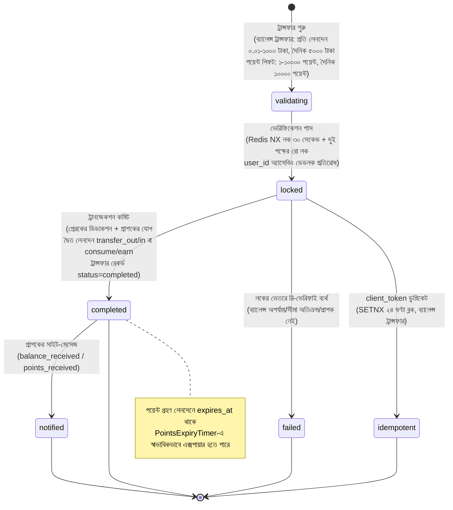
```mermaid
stateDiagram-v2
    [*] --> validating: ট্রান্সফার শুরু<br/>(ব্যালেন্স ট্রান্সফার: প্রতি লেনদেন ০.০১-১০০০ টাকা, দৈনিক ৫০০০ টাকা<br/>পয়েন্ট গিফট: ১-১০০০০ পয়েন্ট, দৈনিক ১০০০০ পয়েন্ট)

    validating --> locked: ভেরিফিকেশন পাস<br/>(Redis NX লক ৩০ সেকেন্ড + দুই পক্ষের রো লক<br/>user_id অ্যাসেন্ডিং ডেডলক প্রতিরোধ)

    locked --> completed: ট্রানজেকশন কমিট<br/>(প্রেরকের ডিডাকশন + প্রাপকের যোগ<br/>দ্বৈত লেনদেন transfer_out/in বা consume/earn<br/>ট্রান্সফার রেকর্ড status=completed)

    locked --> failed: লকের ভেতরে রি-ভেরিফাই ব্যর্থ<br/>(ব্যালেন্স অপর্যাপ্ত/সীমা অতিক্রম/প্রাপক নেই)
    locked --> idempotent: client_token ডুপ্লিকেট<br/>(SETNX ২৪ ঘণ্টা ব্লক, ব্যালেন্স ট্রান্সফার)

    completed --> notified: প্রাপকের সাইট-মেসেজ<br/>(balance_received / points_received)
    completed --> [*]
    failed --> [*]
    idempotent --> [*]
    notified --> [*]

    note right of completed: পয়েন্ট গ্রহণ লেনদেনে expires_at থাকে<br/>PointsExpiryTimer-এ স্বাভাবিকভাবে এক্সপায়ার হতে পারে
```

## 11. কাস্টমার সার্ভিস টিকিট লাইফসাইকেল (রাউন্ড ২০)

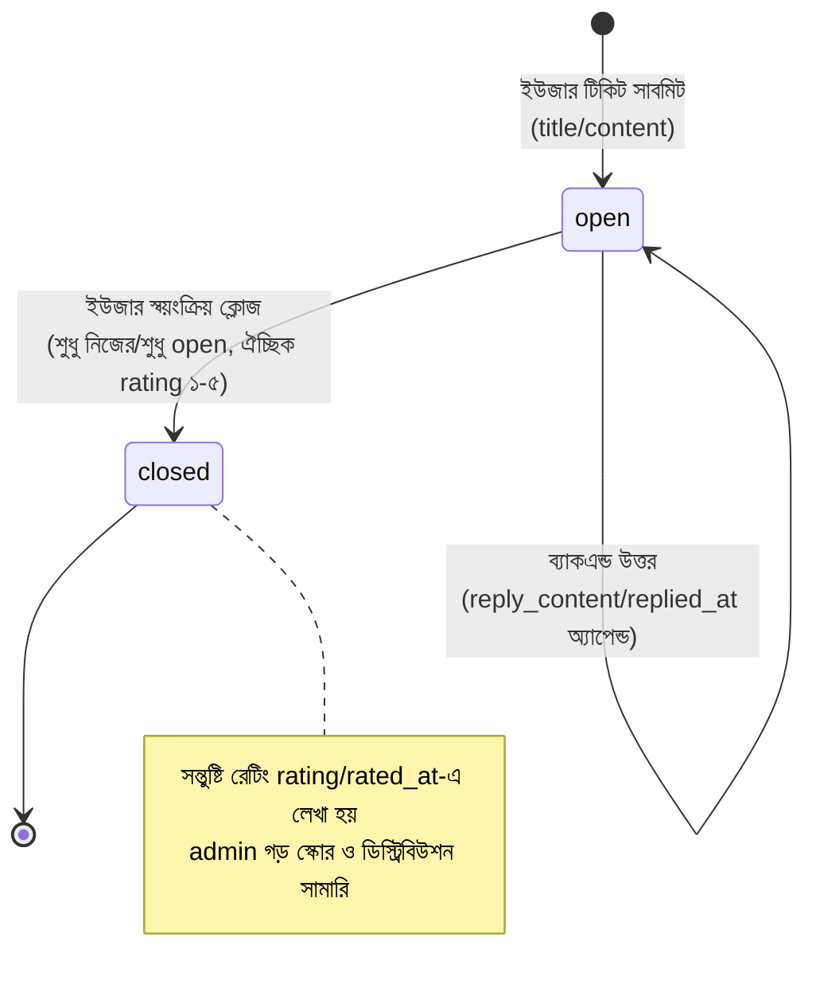
```mermaid
stateDiagram-v2
    [*] --> open: ইউজার টিকিট সাবমিট<br/>(title/content)

    open --> open: ব্যাকএন্ড উত্তর<br/>(reply_content/replied_at অ্যাপেন্ড)

    open --> closed: ইউজার স্বয়ংক্রিয় ক্লোজ<br/>(শুধু নিজের/শুধু open, ঐচ্ছিক rating ১-৫)

    closed --> [*]

    note right of closed: সন্তুষ্টি রেটিং rating/rated_at-এ লেখা হয়<br/>admin গড় স্কোর ও ডিস্ট্রিবিউশন সামারি
```

## 12. ইলেকট্রনিক ইনভয়েস লাইফসাইকেল (রাউন্ড ২০)

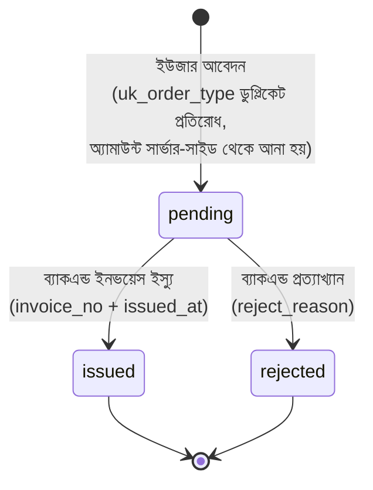
```mermaid
stateDiagram-v2
    [*] --> pending: ইউজার আবেদন<br/>(uk_order_type ডুপ্লিকেট প্রতিরোধ,<br/>অ্যামাউন্ট সার্ভার-সাইড থেকে আনা হয়)

    pending --> issued: ব্যাকএন্ড ইনভয়েস ইস্যু<br/>(invoice_no + issued_at)

    pending --> rejected: ব্যাকএন্ড প্রত্যাখ্যান<br/>(reject_reason)

    issued --> [*]
    rejected --> [*]
```

## 13. স্পেন্ড-রিডিউস অ্যাক্টিভিটি লাইফসাইকেল (রাউন্ড ২২)

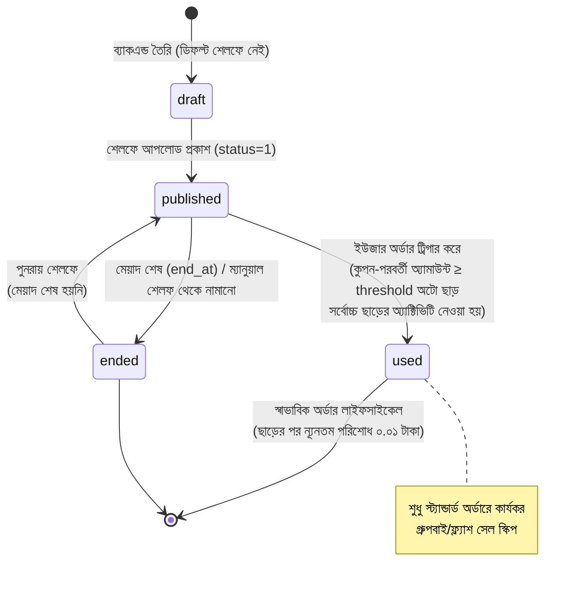
```mermaid
stateDiagram-v2
    [*] --> draft: ব্যাকএন্ড তৈরি (ডিফল্ট শেলফে নেই)

    draft --> published: শেলফে আপলোড প্রকাশ (status=1)

    published --> ended: মেয়াদ শেষ (end_at) / ম্যানুয়াল শেলফ থেকে নামানো

    published --> used: ইউজার অর্ডার ট্রিগার করে<br/>(কুপন-পরবর্তী অ্যামাউন্ট ≥ threshold অটো ছাড়<br/>সর্বোচ্চ ছাড়ের অ্যাক্টিভিটি নেওয়া হয়)

    used --> [*]: স্বাভাবিক অর্ডার লাইফসাইকেল<br/>(ছাড়ের পর ন্যূনতম পরিশোধ ০.০১ টাকা)

    ended --> published: পুনরায় শেলফে<br/>(মেয়াদ শেষ হয়নি)

    ended --> [*]

    note right of used: শুধু স্ট্যান্ডার্ড অর্ডারে কার্যকর<br/>গ্রুপবাই/ফ্ল্যাশ সেল স্কিপ
```

## 15. লাকি স্পিন লাইফসাইকেল (রাউন্ড ২৩)

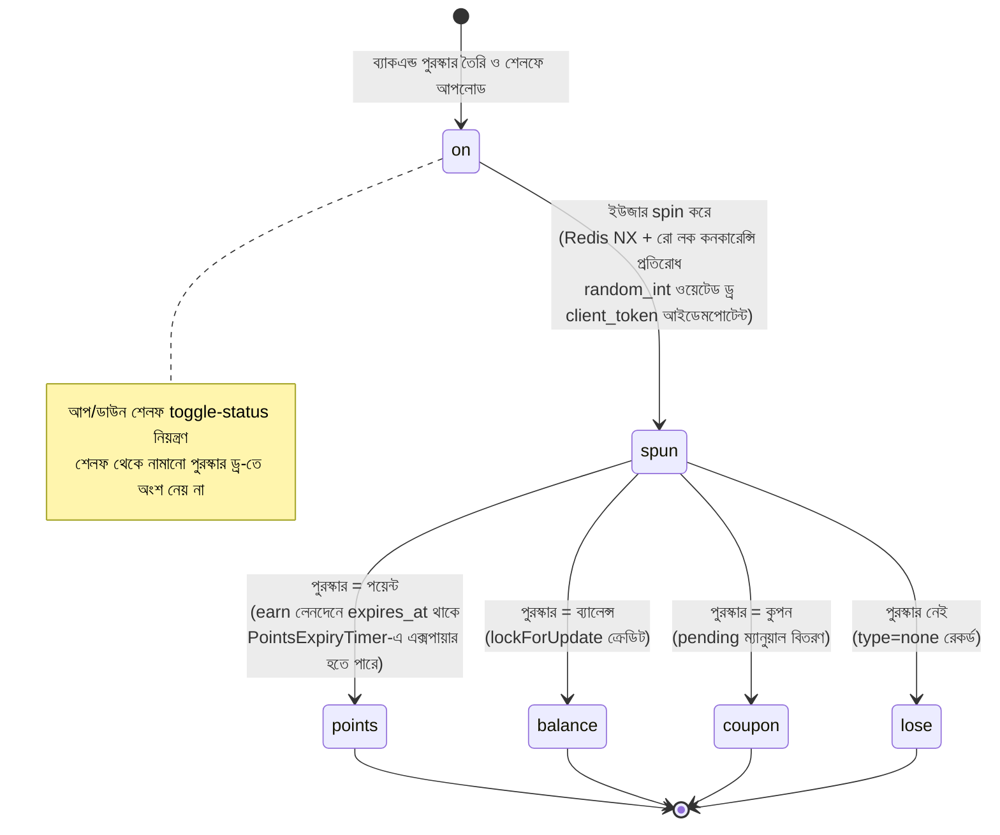
```mermaid
stateDiagram-v2
    [*] --> on: ব্যাকএন্ড পুরস্কার তৈরি ও শেলফে আপলোড

    on --> spun: ইউজার spin করে<br/>(Redis NX + রো লক কনকারেন্সি প্রতিরোধ<br/>random_int ওয়েটেড ড্র<br/>client_token আইডেমপোটেন্ট)

    spun --> points: পুরস্কার = পয়েন্ট<br/>(earn লেনদেনে expires_at থাকে<br/>PointsExpiryTimer-এ এক্সপায়ার হতে পারে)

    spun --> balance: পুরস্কার = ব্যালেন্স<br/>(lockForUpdate ক্রেডিট)

    spun --> coupon: পুরস্কার = কুপন<br/>(pending ম্যানুয়াল বিতরণ)

    spun --> lose: পুরস্কার নেই<br/>(type=none রেকর্ড)

    points --> [*]
    balance --> [*]
    coupon --> [*]
    lose --> [*]

    note right of on: আপ/ডাউন শেলফ toggle-status নিয়ন্ত্রণ<br/>শেলফ থেকে নামানো পুরস্কার ড্র-তে অংশ নেয় না
```

## 14. অ্যাকাউন্ট বাতিল লাইফসাইকেল (রাউন্ড ২২)

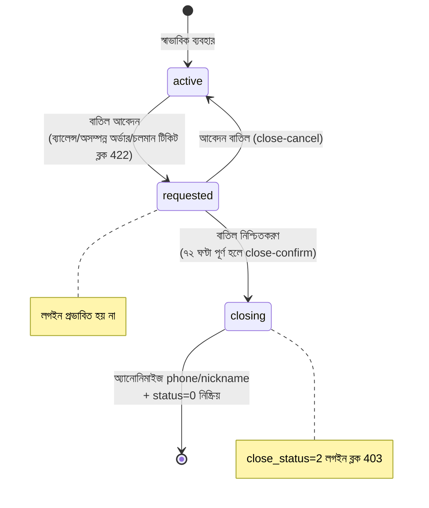
```mermaid
stateDiagram-v2
    [*] --> active: স্বাভাবিক ব্যবহার

    active --> requested: বাতিল আবেদন<br/>(ব্যালেন্স/অসম্পন্ন অর্ডার/চলমান টিকিট ব্লক 422)

    requested --> active: আবেদন বাতিল (close-cancel)

    requested --> closing: বাতিল নিশ্চিতকরণ<br/>(৭২ ঘণ্টা পূর্ণ হলে close-confirm)

    closing --> [*]: অ্যানোনিমাইজ phone/nickname<br/>+ status=0 নিষ্ক্রিয়

    note right of requested: লগইন প্রভাবিত হয় না
    note right of closing: close_status=2 লগইন ব্লক 403
```

## 16. ফ্ল্যাশ সেল অ্যাক্টিভিটি লাইফসাইকেল (রাউন্ড ২৪)

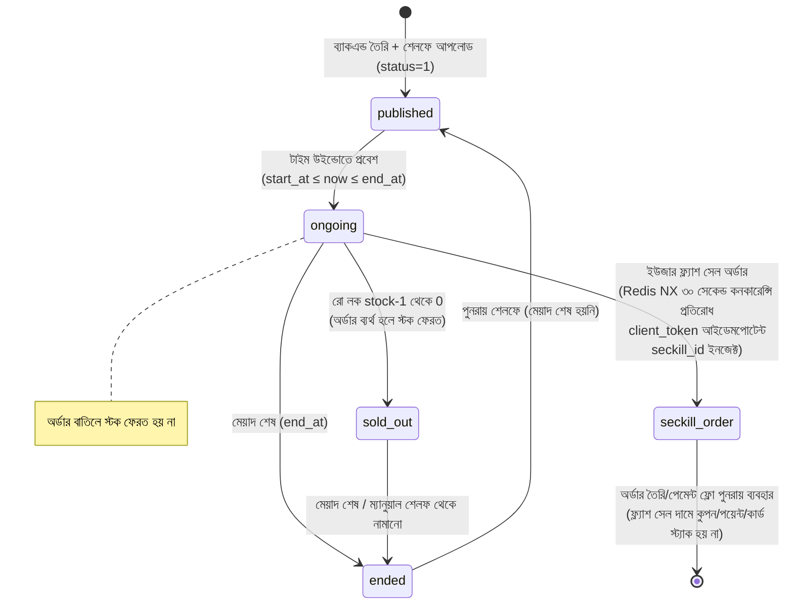
```mermaid
stateDiagram-v2
    [*] --> published: ব্যাকএন্ড তৈরি + শেলফে আপলোড (status=1)

    published --> ongoing: টাইম উইন্ডোতে প্রবেশ<br/>(start_at ≤ now ≤ end_at)

    ongoing --> sold_out: রো লক stock-1 থেকে 0<br/>(অর্ডার ব্যর্থ হলে স্টক ফেরত)

    ongoing --> ended: মেয়াদ শেষ (end_at)

    sold_out --> ended: মেয়াদ শেষ / ম্যানুয়াল শেলফ থেকে নামানো

    ended --> published: পুনরায় শেলফে (মেয়াদ শেষ হয়নি)

    ongoing --> seckill_order: ইউজার ফ্ল্যাশ সেল অর্ডার<br/>(Redis NX ৩০ সেকেন্ড কনকারেন্সি প্রতিরোধ<br/>client_token আইডেমপোটেন্ট<br/>seckill_id ইনজেক্ট)

    seckill_order --> [*]: অর্ডার তৈরি/পেমেন্ট ফ্লো পুনরায় ব্যবহার<br/>(ফ্ল্যাশ সেল দামে কুপন/পয়েন্ট/কার্ড স্ট্যাক হয় না)

    note right of ongoing: অর্ডার বাতিলে স্টক ফেরত হয় না
```

## 17. রিটার্নিং-কাস্টমার রিওয়ার্ড লাইফসাইকেল (রাউন্ড ২৪)

```mermaid
stateDiagram-v2
    [*] --> completed: অর্ডার সম্পন্ন<br/>(WorkController::complete রো লক ট্রানজেকশন)

    completed --> checked: ৩০ দিনের মধ্যে একই টেকনিশিয়ানে দ্বিতীয় কনজাম্পশন নির্ধারণ

    checked --> none: প্রথম কনজাম্পশন / সুইচ বন্ধ<br/>(enabled=0)

    checked --> pending: দ্বিতীয় কনজাম্পশন<br/>(বোনাস = পরিশোধিত অ্যামাউন্ট × ratio<br/>একই order_id+type আইডেমপোটেন্ট)

    pending --> settled: কমিশন সেটেলমেন্ট চেইনে ইউনিফাইড সেটেলমেন্ট<br/>(appointment_technician_earnings<br/>type=return_customer)

    settled --> [*]
    none --> [*]

    note right of pending: status=pending<br/>টেকনিশিয়ান প্রান্তের আয় সামারিতে অটো অন্তর্ভুক্ত
```
