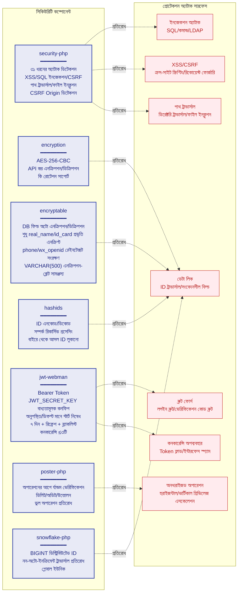
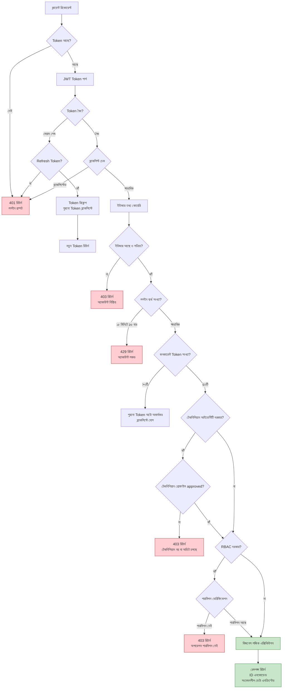
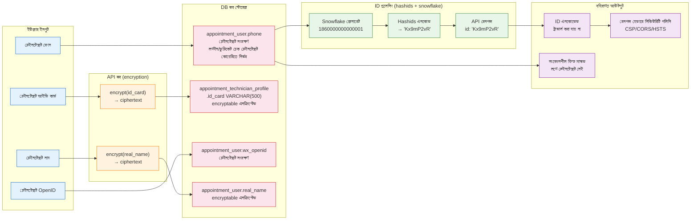

# সিকিউরিটি আর্কিটেকচার ডায়াগ্রাম
> **Languages**: [中文](../../diagrams/SECURITY-ARCHITECTURE.md) · [English](../../en/diagrams/SECURITY-ARCHITECTURE.md) · [한국어](../../ko/diagrams/SECURITY-ARCHITECTURE.md) · [Русский](../../ru/diagrams/SECURITY-ARCHITECTURE.md) · [Deutsch](../../de/diagrams/SECURITY-ARCHITECTURE.md) · [Français](../../fr/diagrams/SECURITY-ARCHITECTURE.md) · [Español](../../es/diagrams/SECURITY-ARCHITECTURE.md) · [Português](../../pt/diagrams/SECURITY-ARCHITECTURE.md) · [हिन्दी](../../hi/diagrams/SECURITY-ARCHITECTURE.md) · [العربية](../../ar/diagrams/SECURITY-ARCHITECTURE.md) · [Bahasa Indonesia](../../id/diagrams/SECURITY-ARCHITECTURE.md) · [日本語](../../ja/diagrams/SECURITY-ARCHITECTURE.md)

> বাংলা অনুবাদ · মূল: [中文](../../diagrams/SECURITY-ARCHITECTURE.md)

## 1. ডিফেন্স-ইন-ডেপথ সিস্টেম

```mermaid
graph TB
    subgraph 边界防护["স্তর ১: বাউন্ডারি প্রোটেকশন"]
        WAF["WAF / Nginx<br/>সিকিউরিটি রেসপন্স হেডার<br/>সংবেদনশীল ফাইল প্রোটেকশন<br/>TLS 1.3"]
    end

    subgraph 接入防护["স্তর ২: অ্যাক্সেস প্রোটেকশন"]
        CORS["Cors মিডলওয়্যার<br/>CORS_ALLOW_ORIGIN হোয়াইটলিস্ট<br/>* ইকো · কনফিগ না থাকলে শুধু সম-অরিজিন<br/>৬টি সিকিউরিটি রেসপন্স হেডার<br/>OPTIONS প্রি-ফ্লাইট"]
    end

    subgraph 攻击检测["স্তর ৩: অ্যাটাক ডিটেকশন"]
        SEC["Security মিডলওয়্যার<br/>erikwang2013/security-php<br/>৩১ ধরনের অ্যাটাক ডিটেক্টর<br/>XSS / SQL ইনজেকশন / CSRF<br/>পাথ ট্রাভার্সাল / ফাইল ইনক্লুশন<br/>CSRF Origin ডিটেকশন(block)"]
        BLOCK["স্বয়ংক্রিয় ব্লক<br/>৬০ সেকেন্ডে ৫ বার অ্যাটাক<br/>→ IP ব্ল্যাকলিস্ট ১৫ মিনিট"]
    end

    subgraph 流量控制["স্তর ৪: ট্রাফিক কন্ট্রোল"]
        RL["RateLimit মিডলওয়্যার<br/>Redis স্লাইডিং উইন্ডো + Lua অ্যাটমিক<br/>ডিফল্ট: প্রতি মিনিটে ৬০ বার/IP<br/>লগইন: প্রতি মিনিটে ১০ বার<br/>রেজিস্ট্রেশন: প্রতি মিনিটে ৫ বার<br/>ভেরিফিকেশন কোড: প্রতি ৬০ সেকেন্ডে ১ বার/ফোন"]
    end

    subgraph 身份认证["স্তর ৫: আইডেন্টিটি অথেনটিকেশন"]
        AUTH["Auth মিডলওয়্যার<br/>JWT Bearer Token (৭ দিন)<br/>JWT_SECRET_KEY বাধ্যতামূলক কনফিগ<br/>অনুপস্থিত/পাবলিক ডিফল্ট মানে স্টার্ট নিষেধ<br/>পাসওয়ার্ড bcrypt হ্যাশ<br/>Token রিফ্রেশ + ব্ল্যাকলিস্ট<br/>লগইন লক: ৫ বার ব্যর্থ → ১৫ মিনিট<br/>কনকারেন্সি সীমা: সর্বোচ্চ ৩টি Token"]
        TECH_AUTH["TechnicianAuth<br/>টেকনিশিয়ান প্রোফাইল ভেরিফিকেশন<br/>approved স্ট্যাটাস চেক"]
        ADMIN_AUTH["AdminAuth<br/>Admin প্রান্তের JWT অথেনটিকেশন<br/>Token ব্ল্যাকলিস্ট"]
    end

    subgraph 权限控制["স্তর ৬: পারমিশন কন্ট্রোল"]
        RBAC["AdminPermission<br/>RBAC রোল পারমিশন ভেরিফিকেশন<br/>Redis ৬০ সেকেন্ড ক্যাশ<br/>ইউজার → রোল → পারমিশন"]
        POSTER["Poster ভেরিফিকেশন<br/>erikwang2013/poster-php<br/>ডিলিট/অডিট/উত্তোলন<br/>সংবেদনশীল অপারেশনে র্যান্ডম ভেরিফিকেশন"]
    end

    subgraph 数据安全["স্তর ৭: ডেটা সিকিউরিটি"]
        ENC_API["API স্তর এনক্রিপশন<br/>erikwang2013/encryption<br/>সংবেদনশীল ফিল্ড এনক্রিপশন/ডিক্রিপশন"]
        ENC_DB["DB স্তর এনক্রিপশন<br/>erikwang2013/encryptable<br/>Model trait অটো এনক্রিপশন/ডিক্রিপশন<br/>শুধু real_name/id_card প্রভৃতি এনক্রিপ্ট হয়<br/>phone/wx_openid প্লেইনটেক্সটে সংরক্ষণ বাধ্যতামূলক<br/>(লগইন/ডুপ্লিকেট চেক প্লেইনটেক্সট কোয়েরিতে নির্ভর করে)"]
        HASHID["ID এনক্রিপশন/ডিক্রিপশন<br/>erikwang2013/hashids<br/>বাইরে থেকে আসল ID লুকানো<br/>রিকার্সিভ এনকোড/ডিকোড"]
        SLOG["সিকিউরিটি লগ<br/>M3 অস্বাভাবিকতা ইউনিফাইড মাস্কিং<br/>সাধারণ টেক্সট + Log::error<br/>সংবেদনশীল ডেটা লগে যায় না<br/>OperationLog ৮ প্রান্তের সোর্স"]
    end

    subgraph 管理端防护["স্তর ৮: ম্যানেজমেন্ট প্রান্ত প্রোটেকশন"]
        EXCEL["এক্সপোর্ট প্রোটেকশন<br/>safeCellValue()<br/>= + - @ / Tab/CR শুরু<br/>প্রিফিক্স ' এস্কেপ ফর্মুলা ইনজেকশন প্রতিরোধ"]
        UPLOAD["আপলোড ভেরিফিকেশন<br/>finfo magic bytes<br/>MIME ও এক্সটেনশন মেলবন্ধ না হলে<br/>→ 422 প্রত্যাখ্যান"]
        INSTALL["ইনস্টল লক<br/>ইনস্টল করা থাকলে (installed=1<br/>বা অ্যাডমিন আছে)<br/>→ 404 ইনস্টল উইজার নিষ্ক্রিয়"]
    end

    请求["HTTP Request"] --> WAF
    WAF --> CORS
    CORS --> SEC
    SEC -->|"পাস"| RL
    SEC -->|"অ্যাটাক ডিটেক্টেড"| BLOCK
    BLOCK -.->|"প্রত্যাখ্যান"| 拒绝["HTTP 403/429<br/>অ্যাটাক লগ রেকর্ড"]
    RL -->|"পাস"| AUTH
    RL -->|"সীমা অতিক্রম"| 限流拒绝["HTTP 429<br/>Retry-After"]
    AUTH --> TECH_AUTH
    AUTH --> ADMIN_AUTH
    TECH_AUTH --> RBAC
    ADMIN_AUTH --> RBAC
    RBAC --> POSTER
    POSTER --> ENC_API
    ENC_API --> ENC_DB
    ENC_DB --> HASHID
    HASHID --> SLOG
    SLOG --> EXCEL
    EXCEL --> UPLOAD
    UPLOAD --> INSTALL
    INSTALL --> 响应["HTTP Response<br/>ডেটা এনক্রিপ্টেড + এনকোডেড"]

    classDef layer1 fill:#e3f2fd,stroke:#1565c0,stroke-width:2px,color:#01579b
    classDef layer2 fill:#bbdefb,stroke:#1976d2,stroke-width:2px,color:#01579b
    classDef layer3 fill:#ffcdd2,stroke:#c62828,stroke-width:2px,color:#b71c1c
    classDef layer4 fill:#fff9c4,stroke:#f9a825,stroke-width:2px,color:#f57f17
    classDef layer5 fill:#c8e6c9,stroke:#2e7d32,stroke-width:2px,color:#1b5e20
    classDef layer6 fill:#e1bee7,stroke:#7b1fa2,stroke-width:2px,color:#4a148c
    classDef layer7 fill:#d7ccc8,stroke:#5d4037,stroke-width:2px,color:#3e2723
    classDef layer8 fill:#cfd8dc,stroke:#37474f,stroke-width:2px,color:#263238
    classDef reject fill:#ff5252,stroke:#b71c1c,stroke-width:2px,color:#fff

    class WAF layer1
    class CORS layer2
    class SEC,BLOCK layer3
    class RL layer4
    class AUTH,TECH_AUTH,ADMIN_AUTH layer5
    class RBAC,POSTER layer6
    class ENC_API,ENC_DB,HASHID,SLOG layer7
    class EXCEL,UPLOAD,INSTALL layer8
    class 拒绝,限流拒绝 reject
```

## 2. সিকিউরিটি কম্পোনেন্ট ম্যাট্রিক্স

## 3. অথেনটিকেশন ও অথরাইজেশন ফ্লো

## 4. ডেটা সিকিউরিটি ফ্লো

