# Buchungsservice-System
> **Languages**: [中文](../README.md) · [English](../en/README.md) · [한국어](../ko/README.md) · [Русский](../ru/README.md) · [Français](../fr/README.md) · [Español](../es/README.md) · [Português](../pt/README.md) · [हिन्दी](../hi/README.md) · [العربية](../ar/README.md) · [বাংলা](../bn/README.md) · [Bahasa Indonesia](../id/README.md) · [日本語](../ja/README.md)

> Deutsche Übersetzung · Original: [中文](../../README.md)

Plattform für Buchungsdienstleistungen auf vier Endgeräten: WeChat-Miniprogramm für Kunden + Flutter APP + HarmonyOS APP (Identitätswechsel mit demselben Konto) sowie PC-Verwaltungsbackend.

> **Projektstatus**: vollständig abgeschlossen ✅ | 143 Controller (service 69 / admin 74) | 87 Modelle | 722 Tests (service 558 / admin 164) | 95 Datenbanktabellen | 388 Routen (service 227 / admin 161)

## Projektvorstellung


**Das Buchungsservice-System** ist eine Buchungsverwaltungsplattform für vier Endgeräte, die sich an die Lebensdienstleistungsbranche richtet: Die Kundenseite umfasst das **WeChat-Miniprogramm, die Flutter APP und die HarmonyOS APP** – mit demselben Konto ist ein freier Wechsel zwischen den Endgeräten möglich. Zusammen mit dem **PC-Verwaltungsbackend** entsteht ein vollständig digitalisierter Kreislauf: „Kundenbuchung → Techniker-Auftragsannahme → Backend-Betrieb". Ob Filialbuchung, Techniker-Service, Mitgliedermarketing oder Finanzabrechnung – ein System deckt alles ab.

**Buchungserlebnis aus einer Hand**

Die Kundenerfahrung ist auf allen drei Endgeräten identisch: intuitive Terminwahl über den Kalender, Gutscheine/Stempelkarten/Punkte als Rabatt, Blitzangebote und Gruppeneinkäufe, WeChat-/Guthaben-Zahlung, vollständig nachvollziehbarer Bestellstatus – Umbuchung, Stornierung, Rückerstattung, Kundendienst und elektronische Rechnungen laufen komplett online ab; für Techniker gibt es einen Arbeitsplatz, Ein-/Ausstempeln, Massen-Schichtplanung, Service-Verifizierung und Auszahlungsfreigabe – die Betriebseffizienz ist auf einen Blick erkennbar.

**Ganzheitliches Marketing-Wachstum über die gesamte Kette**

Integriert sind mehr als ein Dutzend Marketing-Tools: Rabattaktionen ab Mindestbetrag, Blitzangebote, Gruppeneinkäufe, Gutschein-Weitergabe, Punkte-Shop mit Glücksrad, Mitgliedskarten/Wachstumsstufen-Vorteile, zweistufiges Empfehlungs-Provisionen und Stammkunden-Belohnungen – zusammen mit Abo-Nachrichten-Push und APP-Push helfen sie Händlern, kontinuierlich neue Kunden zu gewinnen, Kunden zu binden und Wiederholungskäufe zu fördern.

**Enterprise-Sicherheit und Compliance**

Eigene Sicherheitskomponenten: JWT-Authentifizierung, ID-Verschleierung, 31 Arten von Angriffserkennung, doppelte Verschlüsselung sensibler Daten, serverseitige Preisvalidierung, strikter Abgleich von Zahlungsrückmeldungen mit Idempotenz-Schutz – zusätzlich unterstützt durch offizielle WeChat-Profit-Sharing, Export privater Daten und Konto-Löschung, um die Compliance-Anforderungen zu erfüllen.

**Ausgereifte Technologiebasis**

Basiert auf PHP 8.3 + webman, einem leistungsstarken langlaufenden Framework, unterstützt durch MySQL 8.0 + Redis + Elasticsearch; 95 Datenbanktabellen, 388 Schnittstellen, 285 granulare Berechtigungspunkte, 722 automatisierte Tests – alle bestanden – sowie vollständige chinesische und englische Architekturdokumentation und Ein-Klick-Installationsskripte: einsatzbereit und leicht weiterzuentwickeln.

Ob Einzelfilialbuchung oder Multi-Filial-Kette – das Buchungsservice-System bietet Ihnen eine stabile, sichere und skalierbare Komplettlösung.

## Projektstruktur

```
appointment-php/
├── admin/                     # Verwaltungsbackend (webman v2 + Flutter Web, separate Bereitstellung :8787)
│   ├── app/                   #   admin(Backend-Controller)/api/v1/model/middleware/process/view
│   ├── apps/                  #   Flutter Web Backend / HarmonyOS / WeChat-Verwaltung
│   ├── config/                #   Konfiguration von Routen/Datenbank/Prozessen/Plugins
│   ├── database/              #   Sicherungsskripte (Tabellenstruktur und Seed-Daten zentral in docs/install.sql)
│   ├── tests/                 #   PHPUnit (#[\Test]-Attributstil)
│   └── start.php
├── service/                   # Business-API-Service (webman v2, separate Bereitstellung :8787)
│   ├── app/                   #   Module wie api/user/technician/order/wallet/marketing/notification
│   ├── config/                #   Konfiguration von Routen/Datenbank/Prozessen/Zahlungen
│   ├── support/               #   Model-Basisklasse (generateId)/Request/Response
│   ├── tests/                 #   PHPUnit
│   └── start.php
├── apps/                      # Frontend-Apps für Kunden
│   ├── wechat/                #   WeChat-Miniprogramm (nativ)
│   ├── flutter/               #   Flutter APP (iOS + Android)
│   └── harmonyos/             #   HarmonyOS APP (HarmonyOS-nativ)
└── docs/                      # Projektdokumentation
    ├── API.md / FEATURES.md / STRUCTURE.md / install.sql / README.md ...
    └── diagrams/              #   Architektur-/Flussdiagramme (SVG + mermaid)
```

## Schnellstart

### Systemvoraussetzungen

- PHP 8.3+
- MySQL 8.0+
- Redis
- Composer

### Web-Installationsassistent (empfohlen)

```bash
cd admin/
cp .env.example .env
composer install
php start.php start -d
```

Öffnen Sie im Browser `http://localhost:8787/install` und füllen Sie die Datenbank- und Admin-Kontodaten gemäß den Anweisungen aus, um die Installation abzuschließen.

### Manuelle Installation

```bash
# 1. Abhängigkeiten installieren
cd service/ && cp .env.example .env && composer install
cd ../admin/ && cp .env.example .env && composer install

# 2. Datenbank per Ein-Klick importieren (alle 95 Tabellen + Berechtigungs-/Konfigurations-Seeds)
mysql -u root -p < docs/install.sql

# 3. Dienste starten
cd service/ && php start.php start -d   # Business-API → :8787
cd ../admin/ && php start.php start -d  # Verwaltungsbackend → :8787
```

### Docker-Bereitstellung

```bash
cd admin/ && cp .env.docker .env && docker-compose up -d
cd ../service/ && cp .env.docker .env && docker-compose up -d
```

## Technologie-Stack

| Ebene | Technologie | Beschreibung |
|------|------|------|
| Backend-Framework | webman v2 (PHP 8.3+) | Leistungsstarker langlaufender HTTP-Service im Arbeitsspeicher |
| Datenbank | MySQL 8.0 | Tabellenpräfix `appointment_` |
| Cache | Redis | Cache/Rate-Limit/Session/Queue |
| Suche | Elasticsearch | Volltextsuche (via webman-scout) |
| Verwaltungsbackend-Frontend | Flutter Web | PC-Verwaltungsbackend-Stil |
| Kunden-APP | Flutter | iOS + Android |
| Kunden-Miniprogramm | Nativeres WeChat-Miniprogramm | WXML/WXSS/JS |
| Kunden-HarmonyOS-APP | HarmonyOS ArkTS | Nativ @ohos.net.http |
| ID-Generierung | erikwang2013/snowflake-php | BIGINT nicht autoinkrementierende Primärschlüssel |
| API-ID-Verschlüsselung | erikwang2013/hashids | Verbirgt echte IDs nach außen |
| JWT-Authentifizierung | erikwang2013/jwt-webman | Bearer Token |
| Verschlüsselung sensibler Daten | erikwang2013/encryption + encryptable | Doppelte Verschlüsselung auf API- + DB-Ebene |
| Sicherheitsschutz | erikwang2013/security-php | 31 Arten von Angriffserkennung |
| Operations-Validierung | erikwang2013/poster-php | Zufallsvalidierung bei sensiblen Operationen |
| Länderflaggen | erikwang2013/season | Flaggen-Icons |
| ES-Synchronisierung | erikwang2013/webman-scout | Automatische Modell-Synchronisierung |

## Systemarchitektur



## Kernabläufe

### Service-Buchungsablauf



### Zahlungs- und Rückerstattungsablauf



## Bestelllebenszyklus



## Sicherheitsarchitektur

### Siebenstufiges System der Verteidigung in der Tiefe



> Weitere detaillierte Diagramme: [Flussdiagramm](diagrams/FLOWCHART.md) (inkl. Techniker-Auszahlung/Identitätswechsel) | [Funktions-Mindmap](diagrams/FUNCTION-DIAGRAM.md) | [Alle Lebenszyklen](diagrams/LIFECYCLE-DIAGRAM.md) | [Vollständige Sicherheitsarchitektur](diagrams/SECURITY-ARCHITECTURE.md)

## Kernfunktionen im Überblick (Runde 6–24)

| Funktion | Beschreibung |
|------|------|
| Guthaben-Wallet | Tabellen user_wallet / wallet_recharge / wallet_txn; Guthaben + Transaktionshistorie, WeChat-Zahlungsaufladung (Rückmeldung mit R-Präfix-Bestellnummer), Bestellzahlung per Guthaben (pay_channel=balance), WeChat-/Guthaben-Rückerstattung lädt das Guthaben automatisch wieder auf |
| Verwaltungsbackend-UI vollständig ergänzt | Flutter Web 21 Seiten: Dashboard/Benutzer/Rollen/Konfiguration/Logs/Verifizierung/Schichtplanung/Dienste/Techniker/Bestellungen/Gutscheine/Mitglieder/Stempelkarten/Ankündigungen/FAQ/Auszahlungen/Bewertungen/Berichte/After-Sales/Store-Manager/Profil |
| Dashboard-Echtzeitstatistik | Admin-Startseite rendert dynamisch 7 Statistik-Karten (Gesamtnutzer/neue heute/aktive Nutzer/Operationsprotokoll/heutige Buchungen/ausstehende Auszahlungen/ausstehende Technikerprüfung) + 30-Tage-Trenddiagramme (Bestellvolumen/Betrag/neue Nutzer/Aktivität) + Benutzerstatus-Verteilungsdiagramm + letzte Operationsprotokolle, Redis svc:dashboard-Cache 300s |
| Datenberichte | ReportController 3 Endpunkte: Bestellstatistik / Techniker-TOP10 / Kanalverteilung (GET /admin/reports/orders\|technicians\|distribution, 7/30-Tage-Bereich, Redis-Cache 300s) + Verkaufsstatistik (svc:sales_stats) + Finanzstatistik (svc:finance_stats Einnahmen/Erstattungen/Auszahlungen/Provisionen) |
| MiniProgramm-Abo-Nachrichten | Abo-Push für 3 Bestell-Szenarien (Zahlungserfolg/Rückerstattung eingegangen/Verifizierung erfolgreich); push_sent_at idempotent; automatischer Fallback auf In-App-Benachrichtigung bei nicht konfigurierter Vorlage |
| Techniker-Auszahlung | Verwaltungsprüfung; zweistufige Freigabe (Filialleiter → Finanzen) ab 500; Statusmaschine pending→approved→completed (rejected/failed) |
| Stempelkarten-Verifizierungskreislauf | Meine Stempelkarten berechnen used_up/expired in Echtzeit; Verifizierung mit Redis NX idempotent + Zeilensperre für Abzug, erstellt direkt completed-Bestellung + OrderItem + OrderPayment(pay_type='card') |
| Techniker-Arbeitsplatz | Heutige Aufgaben/Abschlussprotokoll/Starten·Abschließen (Zeilensperre + Statusmaschinen-Wächter + Idempotenz, nach Abschluss In-App-Benachrichtigung); MiniProgramm tech-work mit 3 Tabs |
| Gutschein-Anrechnung | PriceCalculator: applyCoupon nur lesend berechnen / consume setzt bei Zahlung used / restoreCouponAndCard idempotente Rückgabe bei Rückerstattung; fixed/percent + min_amount-Schwelle |
| Geschenkkarten | Beim redeem wird der cash-Typ dem Wallet gutgeschrieben (Zeilensperre gegen Doppelbuchung, WalletTxn type='gift_card'), der gift-Typ wird nur markiert |
| Punktesystem | Punkte für Check-in; Punkte für Verifizierungs-Käufe floor(paid×1) (order_id idempotent, balance-Snapshot); anteilige Rückbuchung bei Rückerstattung; detaillierte Aufteilung mit Seiten + type/source-Filter |
| Mitgliederverwaltung | appointment_user.member_level-Spalte (Migration 000008); vollständiges CRUD für Mitgliederkarten im Backend (Berechtigungen 365–369) |
| MiniProgramm-Bestellkette | Dienst-Details → Bestellung bestätigen (Gutschein wählen/Schwellenwert ausgegraut/Client-Schätzung) → POST /order → WeChat-/Guthaben-Zahlung; insgesamt 20 MiniProgramm-Seiten |
| Gruppeneinkauf-Kreislauf | join: 422 bei erneuter Teilnahme + Vollbelegungssperre + träge Schließung bei Ablauf; Bestellung nach Gruppenbildung mit store über promotion_id zum Gruppenpreis (discount_percent), Gutscheine/Stempelkarten/Punkte nicht kombinierbar, nicht gebildete Gruppen stornieren automatisch und geben die Technikersperre frei (alter FLASH_SALE-Promotionskanal entfernt, Blitzangebote laufen über einen eigenen Kanal) |
| Filialleiter-Arbeitsplatz | service /api/v1/store-manager mit 4 Schnittstellen (overview/orders/technicians/revenue), store_id erzwingt Isolierung (403 ohne Filiale); admin Filialarbeitsplatz-Übersicht + Bestellfilter nach store_id + Flutter-Seite + Berechtigung 372 |
| Vertriebs-Provisionen | Nach der ersten abgeschlossenen Bestellung des Geworbenen erhält der Empfehler paid_amount × reward_rate (Systemkonfiguration, Standard 0,05) als Provision ins Wallet (WalletTxn referral_reward); dreifache Idempotenz: Zeilensperre + Nullprüfung + erneute Prüfung der ersten Bestellung; earnings-Details + admin-Einsicht (Berechtigung 379) |
| Punkte-Einlöse-Shop | Zwei Tabellen für Einlöseartikel/Einlöseprotokoll; Einlöseschnittstelle mit Redis NX + Zeilensperre gegen Über-Einlösung + uk_user_goods begrenzt pro Benutzer auf einmal; drei Ergebnisse: coupon vergibt Gutschein / wallet verbucht Guthaben / gift_card liefert Kartencode; admin CRUD + Veröffentlichung/Zurückziehen + Protokoll (Berechtigungen 373–378) |
| Buchungsumänderung | POST /api/v1/order/reschedule/{id} gleicher Techniker, andere Zeit; nur pending/paid/confirmed und ≥6h vor Originalbeginn möglich; order_lock + Technikersperre für neuen Zeitraum SETNX(180s) gegen Überverkauf + B2-Schichtplanungskonfliktprüfung; schreibt appointment_order_reschedule + SCENE_RESCHEDULE-Abo-Nachricht |
| Gutschein-Weitergabe | 8-stelliger eindeutiger Weitergabecode (uk_code als Absicherung, 7 Tage gültig); claim gegen Missbrauch: Redis NX-Sperre + Zeilensperre-Nachprüfung gegen Doppelverwendung, uk_user_coupon begrenzt Weitergabe auf einmal, weitergegebene Gutscheine nicht erneut weitergebbar, kein Selbstempfang; träge Ablauf rückgängig machen stellt Originalgutschein wieder her |
| Punkteablauf | expires_at (Standard 365 Tage, Konfiguration points.expiry_days); PointsExpiryTimer scannt alle 60 s mit Cursor und schreibt type=expire als negativen Abzug (dreifache Idempotenz) + aggregierte In-App-Benachrichtigung; abgelaufene Punkte nicht einlösbar/übertragbar |
| Automatische Techniker-Einstufung | TierRatingService wertet Bestellanzahl + Durchschnittsbewertung in Echtzeit zurück ins Profil, Abgleich mit tier_config von hoch nach niedrig; nur Aufwertung ohne Abwertung (allowDowngrade für manuelle Neubewertung); Änderungen in appointment_technician_tier_log + In-App-Benachrichtigung; admin Log-Einsicht (Berechtigung 380) |
| Blitzangebot-Bestellkreislauf | /api/v1/seckill Aktivitäten + buy idempotent/parallelitätssicher, Bestellung injiziert seckill_id und nutzt store() wieder, Lagerbestand wird einheitlich innerhalb der Transaktion per Zeilensperre abgezogen (Blitzpreis = seckill_price, DB ist maßgeblich), ausverkauft → 422 „ausverkauft", Stornierung gibt Lagerbestand nicht zurück; alter promotion flash_sale-Kanal entfernt |
| Erinnerung vor Dienstbeginn | ServiceReminderTimer scannt alle 60 s Bestellungen mit Status confirmed/serving, die innerhalb von 1 h beginnen → SCENE_REMINDER-Abo-Nachricht + In-App-Benachrichtigung (order_id+type gegen Duplikate, dreifache Idempotenz); Fallback auf In-App-Benachrichtigung bei nicht konfigurierter Vorlage |
| Ablauf-Erinnerung | ExpiryReminderTimer scannt alle 6 h Mitgliederkarten/Gutscheine, die innerhalb von 3 Tagen ablaufen → type=card_expiry/coupon_expiry + SCENE_EXPIRY-Abo-Nachricht (order_id als Quelle gegen Duplikate) |
| Techniker-Antwort auf Bewertungen | POST /api/v1/technician/review/reply/{order_id}: 404 bei fremder Bewertung, 422 bei wiederholter Antwort, nach Erfolg In-App-Benachrichtigung an den Kunden; appointment_order_review ergänzt replied_at; admin Antwort-Details (Berechtigung 381) |
| Auflade-Benachrichtigung | WeChat-Auflade-Rückmeldung schreibt innerhalb der Transaktion eine In-App-Benachrichtigung type='wallet_recharge' (nutzt Rückmeldungs-Idempotenz, atomarer Commit in derselben Transaktion, Fehler blockiert Hauptablauf nicht) |
| Guthaben-Überweisung | POST /api/v1/wallet/transfer Überweisung zwischen Benutzern: 0,01–1000 pro Transaktion + Tageslimit 5000; Redis NX-Sperre + Zeilensperre beider Wallets (user_id aufsteigend gegen Deadlock) + client_token 24 h Idempotenz; WalletTxn transfer_out/transfer_in Doppelbuchungen mit balance_after-Snapshot; In-App-Benachrichtigung type='balance_received' für Empfänger |
| Punkte-Weitergabe | POST /api/v1/user/points/transfer Weitergabe zwischen Benutzern: 1–10000 Punkte + Tageslimit 10000; Redis NX-Sperre + lockForUpdate auf den letzten Buchungen beider Seiten (aufsteigend gegen Deadlock) + Nachprüfung innerhalb der Sperre; Sender consume/Empfänger earn Doppelbuchungen (Empfänger enthält expires_at und läuft normal ab); In-App-Benachrichtigung type='points_received' für Empfänger |
| Bewertungs-Nachtrag | POST /api/v1/order/review/{order_id}/append: 404 bei fremder Bestellung/422 bei Duplikat/422 bei leerem Inhalt/422 bei nicht completed, bei Erfolg In-App-Benachrichtigung type='review_append' an den Techniker; appointment_order_review ergänzt append_content/append_images(JSON)/append_at; zusätzlich fehlende Route für Benutzer-Bewertungsabgabe ergänzt (original store-Route war unerreichbar) und deren latenten TypeError behoben |
| Sendungsverfolgung für Kunden | GET /api/v1/order/logistics/{id}: nur eigene product-Bestellungen (404 bei fremder/nicht Produkt/nicht versendet); liest order.remark JSON (shipping_company/tracking_no/shipped_at, vom admin beim Versand geschrieben); Empfängernummer maskiert 138\*\*\*\*5678 |
| Nachrichteneinstellungen | Tabelle appointment_user_notify_setting (Unique-Key uk_user_type, fehlende Zeile = Standard an); GET/PUT /api/v1/user/notify-settings; 5 Schalter service_reminder/card_expiry/points_expiry/marketing/system (system immer an, nicht abschaltbar); notifySettingEnabled steuert 3 Timer + Abo-Events, bei Deaktivierung werden In-App-Benachrichtigung und Abo-Nachrichten übersprungen |
| Buchungskalender | GET /api/v1/calendar/technician/{id} (Monatsansicht) + /day (Tagesansicht): time_slots JSON expandiert zu Stunden-Slots, bereits gebuchte Zeiträume in appointment_order ausgeschlossen; visuelle Zeitwahl für Filial-Schichtplanung |
| Kunden-Wachstumsstufen | appointment_user_growth + appointment_growth_level (Bronze 0/Silber 100/Gold 500/Platin 2000/Diamant 5000); Check-in +10, Bewertung +20, 1 Punkt pro 1 Yuan Ausgaben (nutzt bestehende Zustandsprüfungen, natürlich idempotent); GET /api/v1/growth (Übersicht/records/levels öffentliche Stufen) |
| Elektronische Rechnungen | POST/GET /api/v1/invoices (Beantragen/Liste/Details): uk_order_type(order_id,order_type) gegen doppelte Anträge, Betrag serverseitig; admin Ausstellung/Ablehnung (Berechtigungen 382–384) |
| Kundenservice-Tickets | POST/GET /api/v1/tickets + /{id}/close: Benutzer reicht ein/Liste/Details/Schließen; admin Antwort (Berechtigungen 385/387) |
| Mehrstufiger Vertrieb – zweistufige Provision | Nach Bestellzahlung erhält der Empfehler des Erstreferenten paid×level2_rate (Konfiguration 0,02): Transaktions-Zeilensperre + uk_order_referred Idempotenz gegen doppelte Auszahlung; WalletTxn TYPE_REFERRAL_LEVEL2; admin Protokolleinsicht (Berechtigung 386) |
| Wachstumsstufen-Vorteile | GrowthLevel.benefits umgesetzt: Rabatt beim Bestellen nach Stufe discount_rate (nur Standardbestellungen, Gutscheine/Stempelkarten → Stufenrabatt kombinierbar, Rabattbetrag in discount_amount + nachvollziehbarer Hinweis, Untergrenzen-Schutz kappt bei 0); Zahlungsrückmeldung schreibt Wachstumswert floor(paid×points_multiplier) (Stufe zum Zahlungszeitpunkt, keine Stufenanhebung) |
| Rechnungsanschrift-Verwaltung | appointment_invoice_title Bibliothek gängiger Anschriften: Speichern/Bearbeiten/Löschen/Standard (erste automatisch Standard, Löschen der Standardanschrift überträgt automatisch, Setzen als Standard in Transaktion); Antrag kann title_id übernehmen, manuelle Eingabe bleibt kompatibel |
| Ticket-Zufriedenheit | Beim Schließen des Tickets Bewertung 1–5 (außerhalb 422, nicht angegeben → NULL kompatibel); admin Zufriedenheitsübersicht: Durchschnitt/1-5-Sterne-Verteilung/bewertet vs. unbewertet (Berechtigung 388) |
| Bewertungsbild-Prüfung | admin ReviewAuditController: Liste von Bewertungen mit Bildern (JSON_LENGTH-Filter + join Benutzer-/Technikername), Ausblenden/Wiederherstellen (hide nur visible, restore nur hidden, 422 beidseitige Validierung); nach Ausblenden automatisch unsichtbar in Techniker-Bewertungsliste (Berechtigungen 389–391) |
| Browserverlauf | appointment_browse_history (uk_user_item, wiederholtes Ansehen aktualisiert nur viewed_at): Dienst-Detailseiten protokollieren (try/catch blockiert Hauptablauf nicht, ohne Login übersprungen); Liste mit Service-Info + hashid; Einzellöschung/Leeren nur für sich selbst |

> Runde-8-Betriebsreparaturen: 12 latente Poster::verify-Fatalfehler entfernt; DashboardController-Statistiken verwenden Capsule Manager-Abfragen.
>
> Runde-15-Ergänzungen: Punkterückbuchung (Stornierung/Rückerstattung gibt points_offset-Punkte zurück, refundOffsetPoints mit 5 idempotenten Anbindungspunkten); PromotionParticipant-Status auf Integer-Konstanten umgestellt (behebt join-1366-Beschädigung im strikten Modus).
>
> Runde-16-Ergänzungen: Punkte-Einlösung (PointsExchangeController, Typ consume/source=exchange); Gruppeneinkauf-Bestellung (appointment_order neue Spalten promotion_id/participant_id); Vertriebs-Provisionen (ReferralRewardService an WorkController::complete angebunden).
>
> Runde-17-Ergänzungen: Buchungsumänderung (appointment_order_reschedule + reschedule-Schnittstelle); Gutschein-Weitergabe (appointment_user_coupon_transfer + transfer/claim/transfers); Punkteablauf (expires_at + PointsExpiryTimer-Prozess); automatische Techniker-Einstufung (TierRatingService + appointment_technician_tier_log, Berechtigung 380).
>
> Runde-17-Fix: AutoCancelTimer-Benachrichtigungen nutzen jetzt \support\Model::generateId() (ursprünglich wurde das nicht existierende Snowflake::generate() aufgerufen, Stornierungs-Benachrichtigungen scheiterten still).
>
> Runde-18-Ergänzungen: Blitzangebot-Bestellung (store() unterstützt flash_sale-Blitzpreise); Erinnerung vor Dienstbeginn (ServiceReminderTimer + SCENE_REMINDER); Ablauf-Erinnerung für Mitgliederkarten/Gutscheine (ExpiryReminderTimer + SCENE_EXPIRY); Techniker-Antwort auf Bewertungen (review reply-Schnittstelle + replied_at-Spalte + Berechtigung 381); Auflade-Benachrichtigung (type='wallet_recharge' in der Rückmeldungstransaktion).
>
> Runde-19-Ergänzungen: Guthaben-Überweisung (appointment_wallet_transfer + WalletTransferController, Doppel-Zeilensperre in Berechtigung + client_token Idempotenz); Punkte-Weitergabe (appointment_user_points_transfer + PointsTransferController, Tageslimit + doppelte Buchungsrichtung); Bewertungs-Nachtrag (appointment_order_review append 3 Spalten + append-Schnittstelle + fehlende store-Route ergänzt); Sendungsverfolgung für Kunden (logistics-Schnittstelle + remark JSON-Parsing + Nummern-Maskierung); Nachrichteneinstellungen (appointment_user_notify_setting + NotifySettingController + 3 Timer-Steuerung).
>
> Runde-20-Ergänzungen: Buchungskalender (CalendarController Monats-/Tagesansicht + Ausschluss gebuchter Zeiten); Kunden-Wachstumsstufen (appointment_user_growth + appointment_growth_level 5 Stufen + Check-in/Bewertung/Kauf-Anbindung); elektronische Rechnungen (appointment_invoice + uk_order_type gegen Duplikate + Backend-Ausstellung/Ablehnung, Berechtigungen 382–384); Kundenservice-Tickets (appointment_ticket Einreichung/Liste/Details/Schließen + Backend-Antwort, Berechtigungen 385/387); zweistufige Provision (payLevel2Reward Transaktions-Zeilensperre + uk_order_referred Idempotenz, Berechtigung 386).
>
> Runde-21-Ergänzungen: Wachstumsstufen-Vorteile umgesetzt (discount_rate-Rabatt beim Bestellen + points_multiplier-Punktemultiplikator bei Zahlung, Migration-Seeds für 5 Stufen benefits); Rechnungsanschrift-Verwaltung (appointment_invoice_title Anschriftenbibliothek + title_id-Verknüpfung im Antrag); Ticket-Zufriedenheit (rating/rated_at beim Schließen + admin Übersichtsstatistik, Berechtigung 388); Bewertungsbild-Prüfung (ReviewAuditController Ausblenden/Wiederherstellen, Berechtigungen 389–391); Browserverlauf (appointment_browse_history + Detailseiten-Anbindung + Liste/Löschen/Leeren).
>
> Runde-22-Ergänzungen: Rabatt ab Mindestbetrag (appointment_full_reduction automatischer Abzug + Schwellenprüfung, Berechtigungen 396–400); ICS-Kalenderexport (RFC5545 Meine Buchungen); Techniker-Stempelkontrolle (appointment_technician_attendance Ein-/Ausstempeln + Verspätungsmarkierung + admin Statistik, Berechtigungen 392–393); APP-Push-Dienst (konfigurationsgetriebene Abstraktion + 5 Event-Anbindungen, appointment_push_log); offizielles WeChat-Profit-Sharing (appointment_profit_sharing_log konfigurationsgetrieben + Degradation, Berechtigung 394); Datenschutz-Compliance (Datenexport + Kontolöschung 72 h Statusmaschine close_status).
>
> Runde-23-Ergänzungen: Gesundheitsprofil (appointment_user_health_profile); Wallet-Zahlungspasswort (appointment_user_wallet pay_password setzen/prüfen); Techniker-Massen-Schichtplanung (batch-Import + Überlappungskonflikterkennung); Bestellstatus-Zeitachse (appointment_order_status_log 8 Statusmarkierungen + Anzeige Kunde/Backend); Punkte-Glücksrad (appointment_lucky_wheel + appointment_wheel_record gewichtete Ziehung, Berechtigungen 401–406); Punktegültigkeit (points.expiry_days-Konfiguration + neue earn-Buchungen mit expires_at).
>
> Runde-24-Ergänzungen: Gastmodus (/api/v1/guest/* schreibgeschütztes Browsen ohne Login + Redis-Cache); Blitzangebote (appointment_seckill_activity + Redis NX Zeilensperre beim Kauf + appointment_order.seckill_id in Bestellung injiziert, Berechtigungen 407–411/420); APP-Versionsverwaltung und Update-Prüfung (appointment_app_version + /api/v1/app/version, Berechtigungen 416–419); Stammkunden-Belohnung (30-Tage-Zweitkauf-Bonus type=return_customer, Berechtigungen 412–414); Schichtplan-CSV-Export (UTF-8 BOM + Zeitslot-Details, Berechtigung 415).
>
> Sicherheitshärtung 2026-08-26: Preise der Bestellpositionen werden bei der Bestellung ausschließlich aus der Datenbank übernommen (Client-Preise nicht vertrauenswürdig, unbekannter target_type 422, target_id muss hashid sein), Gruppen-/Blitzpreise ebenfalls DB-basiert; Blitz-Lagerbestand einheitlich in /api/v1/order store() innerhalb der Transaktion per Zeilensperre abgezogen (SeckillController::buy reserviert nicht mehr, Redis-Aktivitätssperre + client_token Idempotenz bleiben); Techniker-Auszahlungen reservieren den Betrag bei Antrag, prüfen vor Freigabeüberweisung nach, verhindern Doppelauszahlung bei paralleler Freigabe; WeChat-Zahlungsrückmeldung vergleicht total_fee strikt mit dem fälligen Bestellbetrag, Alipay-Rückmeldungslogs maskiert; /install schreibt nach Erfolg .install.lock zur Doppelprüfung gegen Neuinstallation; Abhängigkeitsversionen konsolidiert (webman-scout 2.0.5 / opensearch-php ^2.6 / dompdf, security-php, webman-database exakt gepinnt); phpstan.neon beider Apps repariert und lauffähig (php -d memory_limit=2G).

## Dokumentationsnavigation

| Dokument | Beschreibung |
|------|------|
| [Architektur](ARCHITECTURE.md) | Systemarchitektur, Beziehungen der drei Endgeräte, technische Komponenten, Datenfluss |
| [Funktionen](FEATURES.md) | Vollständige Funktionsliste für Kunden-/Techniker-/Verwaltungsbackend |
| [Architekturdesign](ARCHITECTURE-DESIGN.md) | Schichtenarchitektur, Middleware-Kette, Datenbankdesign, Sicherheitsdesign |
| [Funktionsdesign](FEATURE-DESIGN.md) | Kern-Geschäftsabläufe, Geschäftsregeln, Statusmaschinen, Rückerstattungsregeln |
| [API-Dokumentation](API.md) | Business-API + Verwaltungsbackend-API, mit Anfrage-/Antwortbeispielen + OpenAPI-Endpunkten |
| [Installationsanleitung](INSTALL.md) | Systemvoraussetzungen, Docker-Bereitstellung, Umgebungsvariablen, Drittanbieter-Konfiguration, FAQ |
| [Bedienungsanleitung](USAGE.md) | Verwaltungsbackend-Konfiguration, Bedienung Kunde/Techniker, Rückerstattungsregeln (API-Schnittstellen siehe API.md) |
| [Projektstruktur](STRUCTURE.md) | Vollständige Verzeichnisstruktur, Middleware-Ausführungskette, Datenbanktabellenliste |
| [Testbericht](TEST-REPORT.md) | Vollständiges Testabdeckungs-Audit (558 Fälle / 2508 Assertions) |
| [Design-Spezifikation](specs/2026-05-26-appointment-system-design.md) | Systemdesign-Spezifikation |
| [Implementierungsplan](plans/2026-05-26-appointment-system-plan.md) | Phasenweiser Implementierungsplan |

## Unterstützung / Support

Wenn Ihnen dieses Projekt hilft, freuen wir uns über Ihre Unterstützung! Danke für Ihre Ermutigung :heart:

If this project helps you, your support is welcome and appreciated!

<table>
  <tr>
    <td align="center" width="50%">
      <br>
      <b>微信支付</b><br>WeChat Pay
    </td>
    <td align="center" width="50%">
      <br>
      <b>支付宝</b><br>Alipay
    </td>
  </tr>
</table>

### Globale Banküberweisung / Global Bank Transfer

Wir freuen uns über Spenden per globaler Banküberweisung (Hongkong-Dollar / CNY / USD / andere Währungen). Danke für Ihre Großzügigkeit :heart:

Global bank transfer donations are welcome (HKD / CNY / USD / other currencies). Thank you for your generosity!

| Projekt Item | Informationen Details |
|-----------|-------------|
| Empfängername Beneficiary Name | WANG KEXUN |
| Kontonummer Account Number | 881015918251 |
| Empfängerbank Bank | ZA Bank Limited (SWIFT-Code: AABLHKHHXXX, Bank Code: 387) |
| Bankadresse Bank Address | Core F, Cyberport 3, 100 Cyberport Road, Hong Kong |

> **Zwischenbank bei grenzüberschreitender Überweisung (falls erforderlich) / Intermediary Bank (if required)**
> Dies sind Informationen zur zwischengeschalteten Bank (Korrespondenzbank) für grenzüberschreitende Überweisungen, nicht zur Empfängerbank. Bitte erfragen Sie bei Ihrer überweisenden Bank, ob diese Angaben benötigt werden.
> Note: this is intermediary bank information, not the receiving bank. Please check with your remitting bank whether it is required.
>
> - Für HKD / CNY / USD (For HKD / CNY / USD): **Citibank N.A. Hong Kong** — SWIFT-Code: CITIHKHXXXX, Bank Code: 006, Filiale Branch: Hong Kong Branch, Branch Code: 391, Adresse Address: Citibank Tower, Citibank Plaza, 3 Garden Road, Central, Hong Kong
> - Für andere Währungen (For other currencies): **The Bank of New York Mellon** — SWIFT-Code: IRVTUS3NXXX, Adresse Address: 240 Greenwich Street, New York, United States

## Urheberrecht

Copyright (c) 2026 erik <erik@erik.xyz> — https://erik.xyz

### Krypto-Spenden (Crypto Donation)

Wenn dieses Projekt Ihnen hilft, scannen Sie gerne den QR-Code, um zu spenden. Vielen Dank!

| Netzwerk (Network) | QR-Code (QR Code) | Wallet-Adresse (Wallet Address) |
|---|---|---|
| BNB Smart Chain (BEP20) | [](../coin/1.jpg) | `0x355d429f97511897ccb4e271ec888205f9ab6629` |
| Tron (TRC20) | [](../coin/2.jpg) | `TEdDHWLajt1XvqtPDWmQctdrJaC3pzZZzz` |
| Ethereum (ERC20) | [](../coin/3.jpg) | `0x355d429f97511897ccb4e271ec888205f9ab6629` |
| Aptos | [](../coin/4.jpg) | `0x836e3780edfc3f7b2372b39e2a1a3a5d7adfaccd96c726f21cfde1b50dd68030` |
| Plasma | [](../coin/5.jpg) | `0x355d429f97511897ccb4e271ec888205f9ab6629` |
| Polygon POS | [](../coin/6.jpg) | `0x355d429f97511897ccb4e271ec888205f9ab6629` |
| Solana | [](../coin/7.jpg) | `2hfhboHdmdrYsY25XfQSsEWxq5ip4EQsR7f4AzSRMUyr` |
| The Open Network (TON) | [](../coin/8.jpg) | `UQB9kFQohzmXUir9QSSZq01iwl9aQZIDdBpNmDklljRtCoGK` |
| Arbitrum One | [](../coin/9.jpg) | `0x355d429f97511897ccb4e271ec888205f9ab6629` |
| AVAX C-Chain | [](../coin/10.jpg) | `0x355d429f97511897ccb4e271ec888205f9ab6629` |

