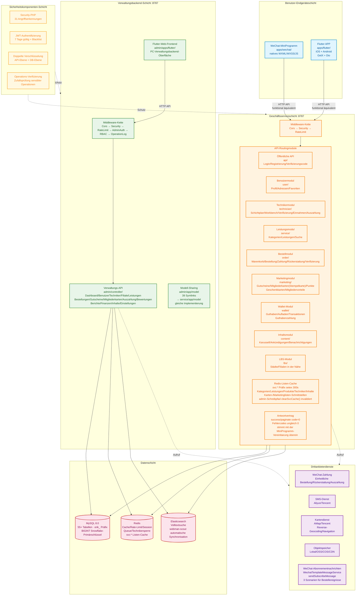

# Systemarchitektur-Diagramm

> Deutsche Übersetzung · Original: [中文](../../diagrams/ARCHITECTURE-DIAGRAM.md)

```mermaid
graph TB
    subgraph 用户终端层["Benutzer-Endgeräteschicht"]
        WX["WeChat-MiniProgramm<br/>apps/wechat/<br/>natives WXML/WXSS/JS"]
        APP["Flutter APP<br/>apps/flutter/<br/>iOS + Android<br/>GetX + Dio"]
    end

    subgraph 业务服务层["Geschäftsserviceschicht :8787"]
        direction TB
        MW1["Middleware-Kette<br/>Cors → Security → RateLimit"]
        subgraph API模块["API-Routingmodule"]
            PUB["Öffentliche API<br/>api/<br/>Login/Registrierung/Verifizierungscode"]
            USER["Benutzermodul<br/>user/<br/>Profil/Adressen/Favoriten"]
            TECH["Technikermodul<br/>technician/<br/>Schichtplan/Workbench/Verifizierung/Einnahmen/Auszahlung"]
            SVC["Leistungsmodul<br/>service/<br/>Kategorien/Leistungen/Suche"]
            ORD["Bestellmodul<br/>order/<br/>Warenkorb/Bestellung/Zahlung/Rückerstattung/Verifizierung"]
            MKT["Marketingmodul<br/>marketing/<br/>Gutscheine/Mitgliederkarten(Stempelkarte)/Punkte<br/>Geschenkkarten/Mitgliedervorteile"]
            WALLET["Wallet-Modul<br/>wallet/<br/>Guthaben/Aufladen/Transaktionen<br/>Guthabenzahlung"]
            CTN["Inhaltsmodul<br/>content/<br/>Karussell/Ankündigungen/Benachrichtigungen"]
            LBS["LBS-Modul<br/>lbs/<br/>Städte/Filialen in der Nähe"]
            CACHE["Redis-Listen-Cache<br/>svc:* Präfix setex 300s<br/>Kategorien/Leistungen/Produkte/Techniker/Inhalte<br/>Karten-/Marketinglisten-Schnittstellen<br/>admin-Schreibpfad clearSvcCache() invalidiert"]
            RES["Antwortvertrag<br/>success/paginate code=0<br/>Fehlercodes ungleich 0<br/>stimmt mit der MiniProgramm-Vereinbarung überein"]
        end
    end

    subgraph 管理后台层["Verwaltungsbackend-Schicht :8787"]
        MW2["Middleware-Kette<br/>Cors → Security → RateLimit → AdminAuth → RBAC → OperationLog"]
        ADMIN_API["Verwaltungs-API<br/>admin/controller/<br/>Dashboard/Benutzer/Techniker/Filiale/Leistungen<br/>Bestellungen/Gutscheine/Mitgliederkarten/Auszahlung/Bewertungen<br/>Berichte/Finanzen/Inhalte/Einstellungen"]
        FLUTTER_WEB["Flutter-Web-Frontend<br/>admin/apps/flutter/<br/>PC-Verwaltungsbackend-Oberfläche"]
        MODEL["Modell-Sharing<br/>admin/app/model<br/>39 Symlinks<br/>→ service/app/model gleiche Implementierung"]
    end

    subgraph 数据层["Datenschicht"]
        MySQL[("MySQL 8.0<br/>55+ Tabellen · erik_ Präfix<br/>BIGINT Snowflake-Primärschlüssel")]
        Redis[("Redis<br/>Cache/Rate-Limit/Session<br/>Queue/Technikersperre<br/>svc:* Listen-Cache")]
        ES[("Elasticsearch<br/>Volltextsuche<br/>webman-scout automatische Synchronisation")]
    end

    subgraph 外部服务["Drittanbieterdienste"]
        WXPAY["WeChat-Zahlung<br/>Einheitliche Bestellung/Rückerstattung/Auszahlung"]
        SMS["SMS-Dienst<br/>Aliyun/Tencent"]
        MAP["Kartendienst<br/>AMap/Tencent<br/>Reverse-Geocoding/Navigation"]
        OSS["Objektspeicher<br/>Lokal/OSS/COS/CDN"]
        SUBMSG["WeChat-Abonnementnachrichten<br/>WechatTemplateMessageService<br/>sendSubscribeMessage<br/>3 Szenarien für Bestellereignisse"]
    end

    subgraph 安全组件["Sicherheitskomponenten-Schicht"]
        SEC["Security-PHP<br/>31 Angriffserkennungen"]
        JWT["JWT-Authentifizierung<br/>7 Tage gültig + Blacklist"]
        ENC["Doppelte Verschlüsselung<br/>API-Ebene + DB-Ebene"]
        POSTER["Operations-Verifizierung<br/>Zufallsprüfung sensibler Operationen"]
    end

    WX -->|"HTTP API<br/>funktional äquivalent"| MW1
    APP -->|"HTTP API<br/>funktional äquivalent"| MW1
    MW1 --> API模块

    FLUTTER_WEB -->|"HTTP API"| MW2
    MW2 --> ADMIN_API

    API模块 --> MySQL
    API模块 --> Redis
    API模块 --> ES
    ADMIN_API --> MySQL
    ADMIN_API --> Redis
    ADMIN_API --> ES

    安全组件 -.->|Schutz| 业务服务层
    安全组件 -.->|Schutz| 管理后台层

    API模块 -.->|Aufruf| 外部服务
    ADMIN_API -.->|Aufruf| 外部服务

    classDef terminal fill:#e1f5fe,stroke:#0288d1,stroke-width:2px,color:#01579b
    classDef service fill:#fff3e0,stroke:#f57c00,stroke-width:2px,color:#e65100
    classDef admin fill:#e8f5e9,stroke:#388e3c,stroke-width:2px,color:#1b5e20
    classDef data fill:#fce4ec,stroke:#c62828,stroke-width:2px,color:#880e4f
    classDef external fill:#f3e5f5,stroke:#7b1fa2,stroke-width:2px,color:#4a148c
    classDef security fill:#fff8e1,stroke:#f9a825,stroke-width:2px,color:#f57f17

    class WX,APP terminal
    class MW1,API模块,PUB,USER,TECH,SVC,ORD,MKT,WALLET,CTN,LBS,CACHE,RES service
    class MW2,ADMIN_API,FLUTTER_WEB,MODEL admin
    class MySQL,Redis,ES data
    class WXPAY,SMS,MAP,OSS,SUBMSG external
    class SEC,JWT,ENC,POSTER security
```
