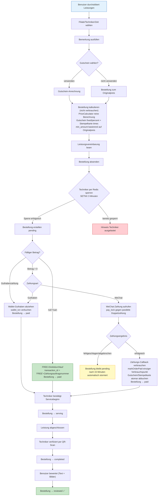
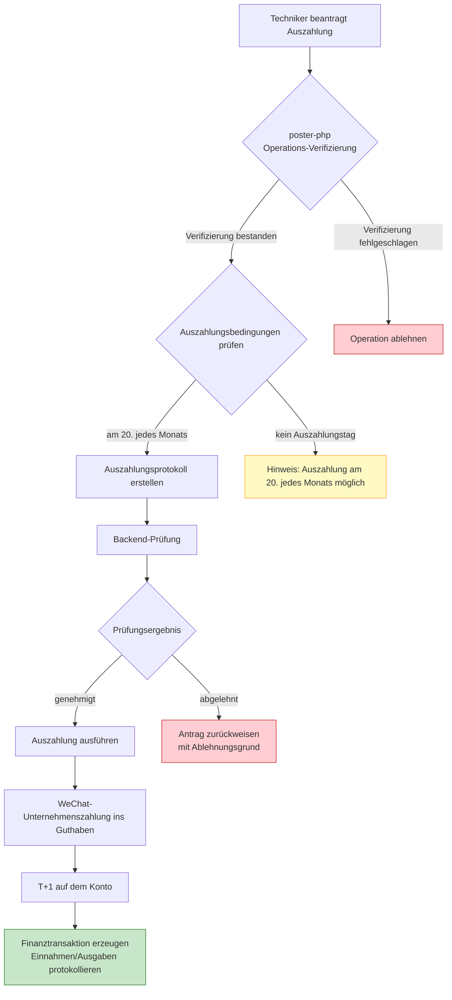
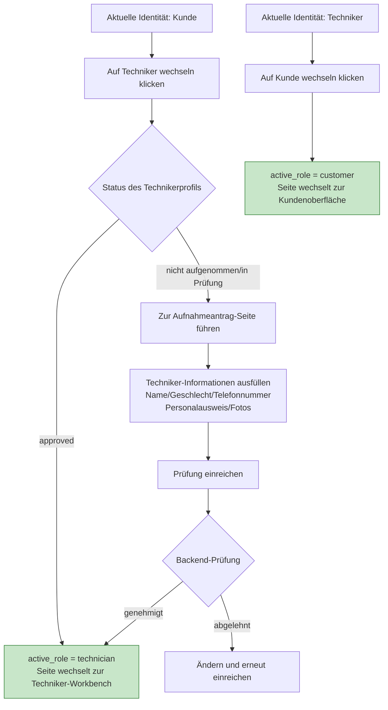
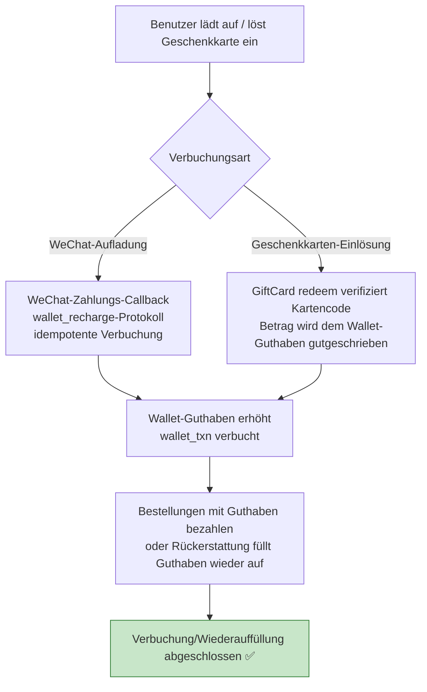

# Kern-Geschäftsprozess-Diagramm

> Deutsche Übersetzung · Original: [中文](../../diagrams/FLOWCHART.md)

## 1. Leistungsbuchungsablauf

## 2. Zahlungs- und Rückerstattungsablauf

```mermaid
flowchart TD
    subgraph 支付流程["Positiver Zahlungsablauf"]
        P1["Zahlungsprotokoll erstellen"] --> P2["WeChat-Einheitliche-Bestellung<br/>pay_lock gegen Konkurrenz<br/>out_trade_no = order_no idempotent"]
        P2 --> P3["Frontend startet Zahlung<br/>Zahlungsart wählen"]
        P3 -->|"Guthaben"| PB["Wallet-Guthaben abziehen<br/>wallet_txn verbuchen<br/>idempotent nur einmal abbuchen"]
        P3 -->|"WeChat"| P4["WeChat-Callback notify"]
        P4 --> P5["Signaturprüfung bestanden"]
        PB --> P6["markOrderPaid idempotent<br/>Gutschein/Stempelkarte nur einmal verbraucht"]
        P5 --> P6
        P6 --> P7["Bestellung → paid<br/>Benutzer + Techniker benachrichtigen"]
    end

    subgraph 退款流程["Rückerstattungsablauf"]
        R1["Benutzer beantragt Rückerstattung<br/>refund_lock gegen Konkurrenz"] --> R2{"Rückerstattungsregel prüfen"}
        R2 -->|"Bestellung ≤15min oder >6h vor Beginn"| R3["Rückerstattung 100 %"]
        R2 -->|"≤6h vor Beginn"| R4["Rückerstattung 90 %"]
        R2 -->|"begonnen, nicht bestätigt"| R5["Rückerstattung 80 %"]
        R2 -->|"nach Servicebestätigung"| R6["Keine Rückerstattung"]
        R3 --> R7["Bestellung → refunding"]
        R4 --> R7
        R5 --> R7
        R7 --> R8["Zweistufige Freigabe<br/>Filialleiter → Finanzabteilung"]
        R8 --> R9["Zweistufige Rückerstattung<br/>innerhalb der Transaktion Rückerstattungsprotokoll anlegen<br/>außerhalb der Transaktion WeChat-Rückerstattung IO"]
        R9 -->|"WeChat fehlgeschlagen"| R10["Bestellung auf PAID zurücksetzen<br/>Rückerstattung wiederholbar"]
        R9 -->|"Rückerstattung erfolgreich"| R11["Bestellung → refunded<br/>WeChat-Originalweg-Rückzahlung / Guthaben-Wiederauffüllung<br/>Gutschein zurück + Punkte abgezogen"]
    end

    style P6 fill:#c8e6c9,stroke:#2e7d32,color:#333
    style R6 fill:#ffcdd2,stroke:#c62828,color:#333
    style R11 fill:#c8e6c9,stroke:#2e7d32,color:#333
    style R10 fill:#fff9c4,stroke:#f9a825,color:#333
```

## 3. Techniker-Auszahlungsablauf

## 4. Identitätswechsel-Ablauf

## 5. Wallet-Auflade-/Geschenkkarten-Verbuchungsablauf

