# Lebenszyklus-Diagramme

> Deutsche Übersetzung · Original: [中文](../../diagrams/LIFECYCLE-DIAGRAM.md)

## 1. Bestelllebenszyklus (Zustandsmaschine)

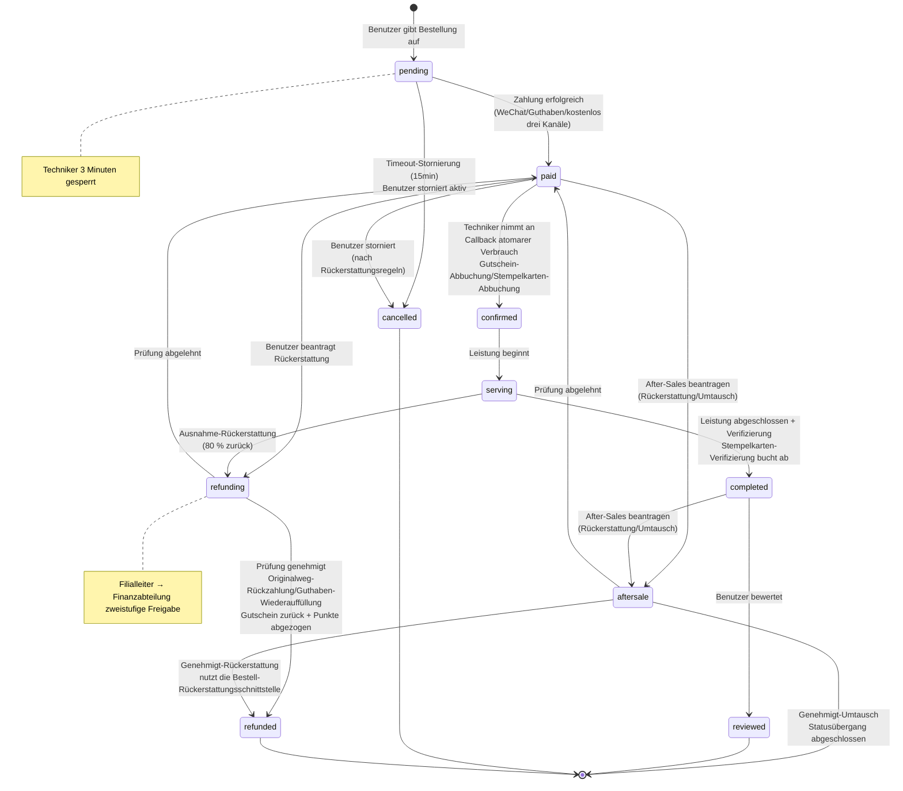
```mermaid
stateDiagram-v2
    [*] --> pending: Benutzer gibt Bestellung auf

    pending --> paid: Zahlung erfolgreich<br/>(WeChat/Guthaben/kostenlos drei Kanäle)

    pending --> cancelled: Timeout-Stornierung (15min)<br/>Benutzer storniert aktiv

    paid --> confirmed: Techniker nimmt an<br/>Callback atomarer Verbrauch<br/>Gutschein-Abbuchung/Stempelkarten-Abbuchung
    paid --> cancelled: Benutzer storniert<br/>(nach Rückerstattungsregeln)
    paid --> refunding: Benutzer beantragt Rückerstattung
    paid --> aftersale: After-Sales beantragen<br/>(Rückerstattung/Umtausch)

    confirmed --> serving: Leistung beginnt

    serving --> completed: Leistung abgeschlossen + Verifizierung<br/>Stempelkarten-Verifizierung bucht ab

    serving --> refunding: Ausnahme-Rückerstattung<br/>(80 % zurück)

    completed --> reviewed: Benutzer bewertet
    completed --> aftersale: After-Sales beantragen<br/>(Rückerstattung/Umtausch)

    refunding --> refunded: Prüfung genehmigt<br/>Originalweg-Rückzahlung/Guthaben-Wiederauffüllung<br/>Gutschein zurück + Punkte abgezogen
    refunding --> paid: Prüfung abgelehnt

    aftersale --> refunded: Genehmigt-Rückerstattung<br/>nutzt die Bestell-Rückerstattungsschnittstelle
    aftersale --> paid: Prüfung abgelehnt
    aftersale --> [*]: Genehmigt-Umtausch<br/>Statusübergang abgeschlossen

    reviewed --> [*]
    cancelled --> [*]
    refunded --> [*]

    note right of pending: Techniker 3 Minuten gesperrt
    note right of refunding: Filialleiter → Finanzabteilung zweistufige Freigabe
```

## 2. Mitgliederkarten-Lebenszyklus

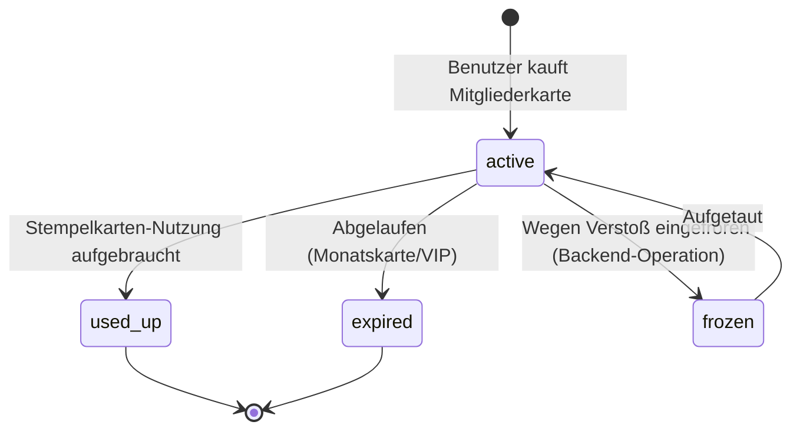
```mermaid
stateDiagram-v2
    [*] --> active: Benutzer kauft Mitgliederkarte

    active --> used_up: Stempelkarten-Nutzung aufgebraucht

    active --> expired: Abgelaufen (Monatskarte/VIP)

    active --> frozen: Wegen Verstoß eingefroren (Backend-Operation)

    frozen --> active: Aufgetaut

    used_up --> [*]
    expired --> [*]
```

## 3. Techniker-Aufnahme-Lebenszyklus

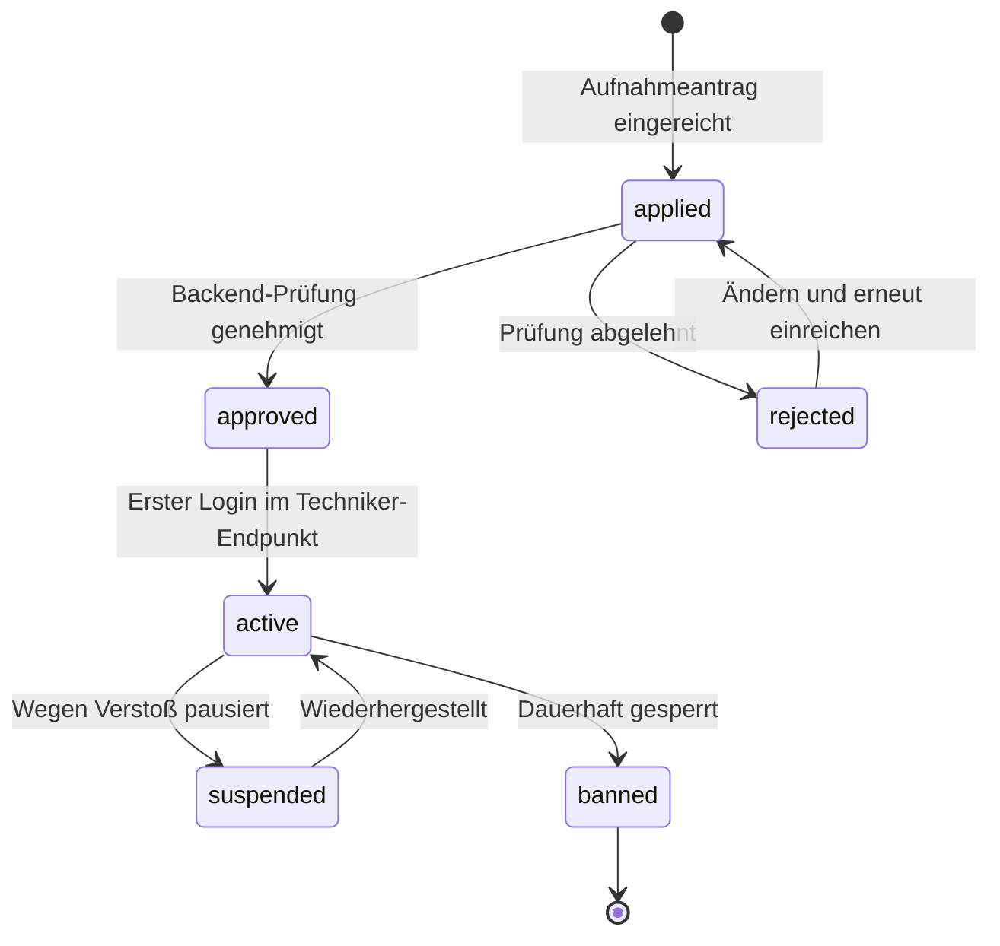
```mermaid
stateDiagram-v2
    [*] --> applied: Aufnahmeantrag eingereicht

    applied --> approved: Backend-Prüfung genehmigt
    applied --> rejected: Prüfung abgelehnt

    rejected --> applied: Ändern und erneut einreichen

    approved --> active: Erster Login im Techniker-Endpunkt

    active --> suspended: Wegen Verstoß pausiert
    suspended --> active: Wiederhergestellt
    active --> banned: Dauerhaft gesperrt

    banned --> [*]
```

## 4. Gutschein-Lebenszyklus

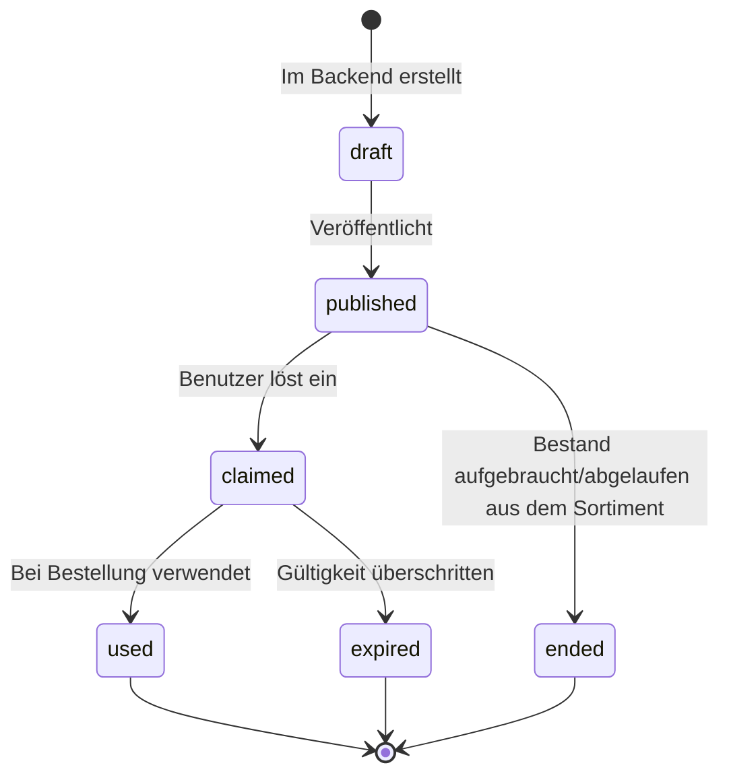
```mermaid
stateDiagram-v2
    [*] --> draft: Im Backend erstellt

    draft --> published: Veröffentlicht

    published --> claimed: Benutzer löst ein

    claimed --> used: Bei Bestellung verwendet
    claimed --> expired: Gültigkeit überschritten

    published --> ended: Bestand aufgebraucht/abgelaufen aus dem Sortiment

    used --> [*]
    expired --> [*]
    ended --> [*]
```

## 5. Techniker-Auszahlungs-Lebenszyklus

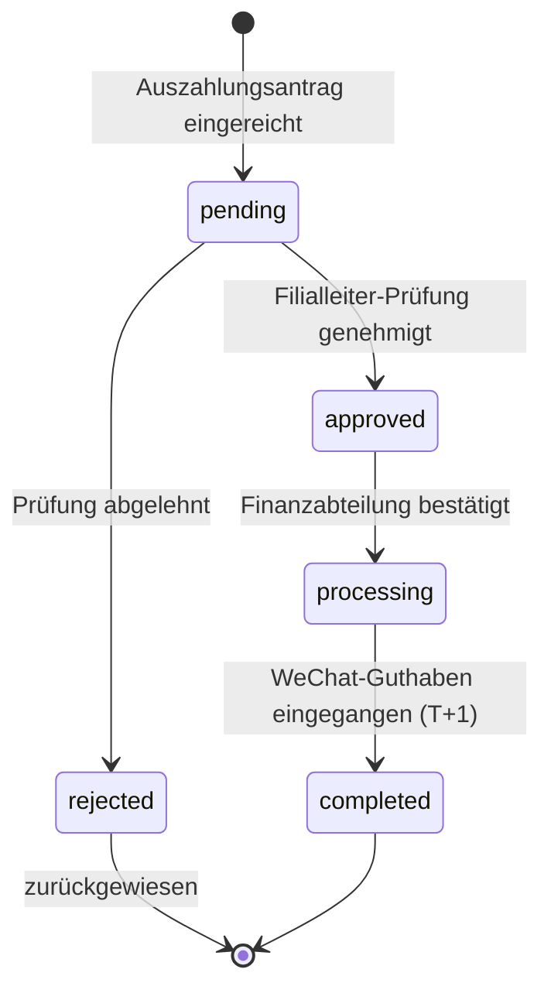
```mermaid
stateDiagram-v2
    [*] --> pending: Auszahlungsantrag eingereicht

    pending --> approved: Filialleiter-Prüfung genehmigt
    pending --> rejected: Prüfung abgelehnt

    rejected --> [*]: zurückgewiesen

    approved --> processing: Finanzabteilung bestätigt

    processing --> completed: WeChat-Guthaben eingegangen (T+1)

    completed --> [*]
```

## 6. Token-Authentifizierungs-Lebenszyklus

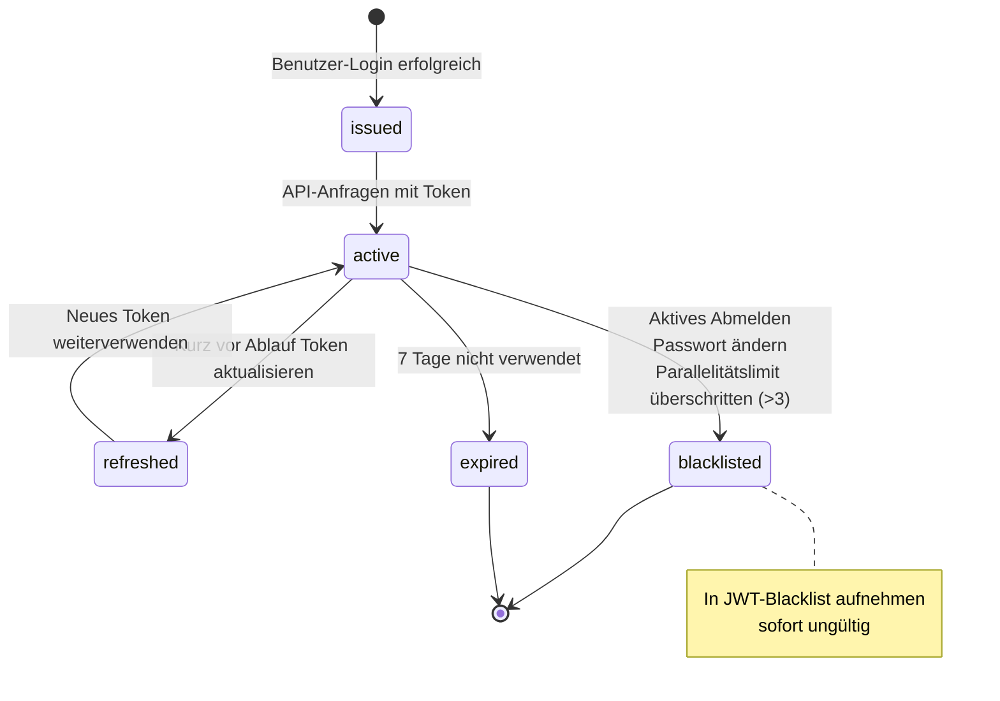
```mermaid
stateDiagram-v2
    [*] --> issued: Benutzer-Login erfolgreich

    issued --> active: API-Anfragen mit Token

    active --> refreshed: Kurz vor Ablauf Token aktualisieren

    refreshed --> active: Neues Token weiterverwenden

    active --> blacklisted: Aktives Abmelden<br/>Passwort ändern<br/>Parallelitätslimit überschritten (>3)

    active --> expired: 7 Tage nicht verwendet

    blacklisted --> [*]
    expired --> [*]

    note right of blacklisted: In JWT-Blacklist aufnehmen<br/>sofort ungültig
```

## 7. Gruppenkauf-Aktivitäts-Lebenszyklus

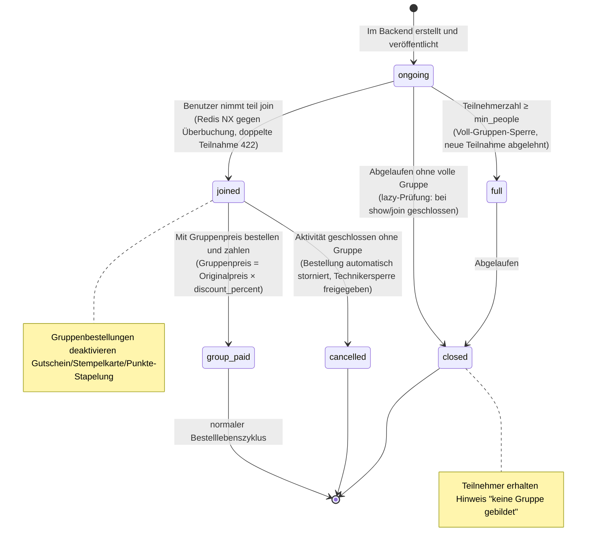
```mermaid
stateDiagram-v2
    [*] --> ongoing: Im Backend erstellt und veröffentlicht

    ongoing --> full: Teilnehmerzahl ≥ min_people<br/>(Voll-Gruppen-Sperre, neue Teilnahme abgelehnt)

    ongoing --> closed: Abgelaufen ohne volle Gruppe<br/>(lazy-Prüfung: bei show/join geschlossen)

    full --> closed: Abgelaufen

    ongoing --> joined: Benutzer nimmt teil join<br/>(Redis NX gegen Überbuchung, doppelte Teilnahme 422)

    joined --> group_paid: Mit Gruppenpreis bestellen und zahlen<br/>(Gruppenpreis = Originalpreis × discount_percent)

    joined --> cancelled: Aktivität geschlossen ohne Gruppe<br/>(Bestellung automatisch storniert, Technikersperre freigegeben)

    group_paid --> [*]: normaler Bestelllebenszyklus
    cancelled --> [*]
    closed --> [*]

    note right of joined: Gruppenbestellungen deaktivieren Gutschein/Stempelkarte/Punkte-Stapelung
    note right of closed: Teilnehmer erhalten Hinweis "keine Gruppe gebildet"
```

## 8. Gutschein-Übertragungs-Lebenszyklus

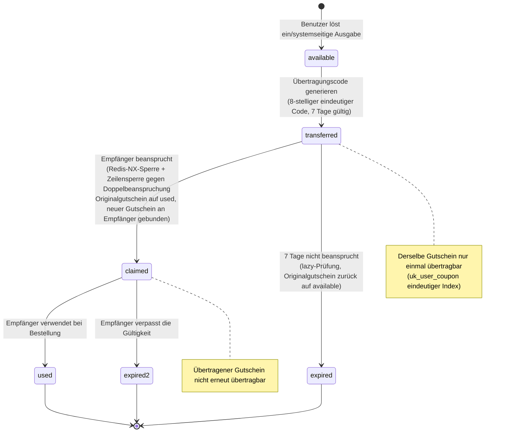
```mermaid
stateDiagram-v2
    [*] --> available: Benutzer löst ein/systemseitige Ausgabe

    available --> transferred: Übertragungscode generieren<br/>(8-stelliger eindeutiger Code, 7 Tage gültig)

    transferred --> claimed: Empfänger beansprucht<br/>(Redis-NX-Sperre + Zeilensperre gegen Doppelbeanspruchung<br/>Originalgutschein auf used, neuer Gutschein an Empfänger gebunden)

    transferred --> expired: 7 Tage nicht beansprucht<br/>(lazy-Prüfung, Originalgutschein zurück auf available)

    claimed --> used: Empfänger verwendet bei Bestellung
    claimed --> expired2: Empfänger verpasst die Gültigkeit

    used --> [*]
    expired --> [*]
    expired2 --> [*]

    note right of transferred: Derselbe Gutschein nur einmal übertragbar<br/>(uk_user_coupon eindeutiger Index)
    note right of claimed: Übertragener Gutschein nicht erneut übertragbar
```

## 9. Punkte-Ablauf-Lebenszyklus

```mermaid
stateDiagram-v2
    [*] --> earned: Check-in/Konsum-Rückvergütung/Rückerstattung<br/>(expires_at = now + 365 Tage)

    earned --> used: Anrechnung/Einlösung verbraucht

    earned --> expired: Abgelaufen ohne Verwendung<br/>(PointsExpiryTimer 60s-Scan<br/>schreibt type=expire negative Abbuchungszeilen)

    expired --> [*]: In-App-Benachrichtigung "Punkte abgelaufen"
    used --> [*]

    note right of expired: Dreischichtige Idempotenz: Zeilensperre des Originals<br/>+ ID-Cursor-Paginierung + Benachrichtigung nur aus Abbuchungsrunden
```

## 10. Übertragungs-Lebenszyklus (Runde 19: Guthabenübertragung + Punkte-Übertragung)

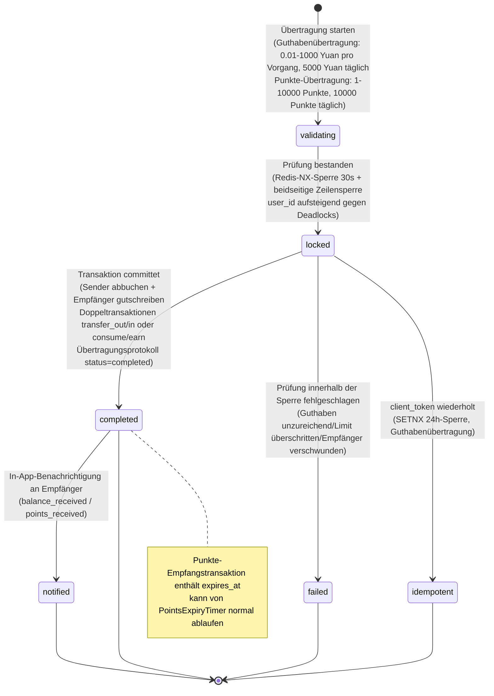
```mermaid
stateDiagram-v2
    [*] --> validating: Übertragung starten<br/>(Guthabenübertragung: 0.01-1000 Yuan pro Vorgang, 5000 Yuan täglich<br/>Punkte-Übertragung: 1-10000 Punkte, 10000 Punkte täglich)

    validating --> locked: Prüfung bestanden<br/>(Redis-NX-Sperre 30s + beidseitige Zeilensperre<br/>user_id aufsteigend gegen Deadlocks)

    locked --> completed: Transaktion committet<br/>(Sender abbuchen + Empfänger gutschreiben<br/>Doppeltransaktionen transfer_out/in oder consume/earn<br/>Übertragungsprotokoll status=completed)

    locked --> failed: Prüfung innerhalb der Sperre fehlgeschlagen<br/>(Guthaben unzureichend/Limit überschritten/Empfänger verschwunden)
    locked --> idempotent: client_token wiederholt<br/>(SETNX 24h-Sperre, Guthabenübertragung)

    completed --> notified: In-App-Benachrichtigung an Empfänger<br/>(balance_received / points_received)
    completed --> [*]
    failed --> [*]
    idempotent --> [*]
    notified --> [*]

    note right of completed: Punkte-Empfangstransaktion enthält expires_at<br/>kann von PointsExpiryTimer normal ablaufen
```

## 11. Kundendienst-Ticket-Lebenszyklus (Runde 20)

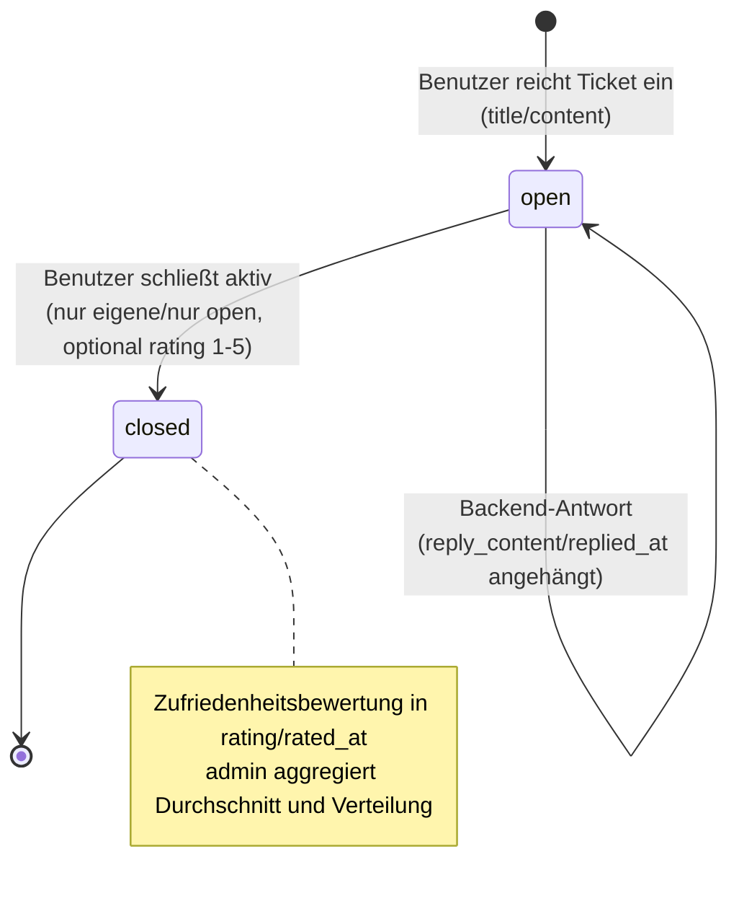
```mermaid
stateDiagram-v2
    [*] --> open: Benutzer reicht Ticket ein<br/>(title/content)

    open --> open: Backend-Antwort<br/>(reply_content/replied_at angehängt)

    open --> closed: Benutzer schließt aktiv<br/>(nur eigene/nur open, optional rating 1-5)

    closed --> [*]

    note right of closed: Zufriedenheitsbewertung in rating/rated_at<br/>admin aggregiert Durchschnitt und Verteilung
```

## 12. Elektronische-Rechnung-Lebenszyklus (Runde 20)

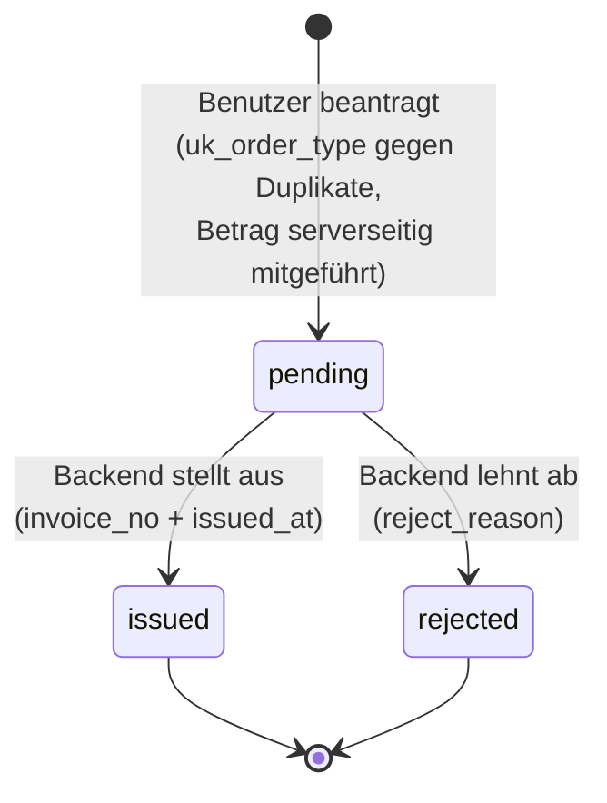
```mermaid
stateDiagram-v2
    [*] --> pending: Benutzer beantragt<br/>(uk_order_type gegen Duplikate,<br/>Betrag serverseitig mitgeführt)

    pending --> issued: Backend stellt aus<br/>(invoice_no + issued_at)

    pending --> rejected: Backend lehnt ab<br/>(reject_reason)

    issued --> [*]
    rejected --> [*]
```

## 13. Rabatt-ab-Mindestbetrag-Aktions-Lebenszyklus (Runde 22)

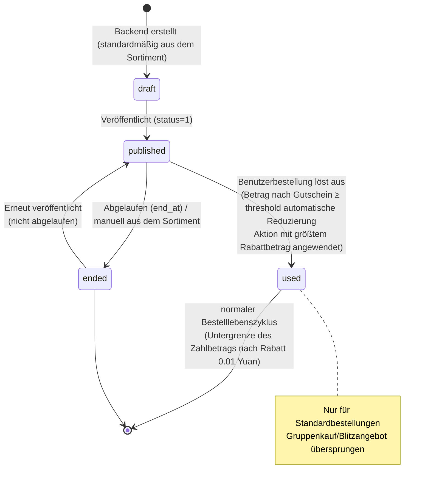
```mermaid
stateDiagram-v2
    [*] --> draft: Backend erstellt (standardmäßig aus dem Sortiment)

    draft --> published: Veröffentlicht (status=1)

    published --> ended: Abgelaufen (end_at) / manuell aus dem Sortiment

    published --> used: Benutzerbestellung löst aus<br/>(Betrag nach Gutschein ≥ threshold automatische Reduzierung<br/>Aktion mit größtem Rabattbetrag angewendet)

    used --> [*]: normaler Bestelllebenszyklus<br/>(Untergrenze des Zahlbetrags nach Rabatt 0.01 Yuan)

    ended --> published: Erneut veröffentlicht<br/>(nicht abgelaufen)
    ended --> [*]

    note right of used: Nur für Standardbestellungen<br/>Gruppenkauf/Blitzangebot übersprungen
```

## 15. Glücksrad-Ziehungs-Lebenszyklus (Runde 23)

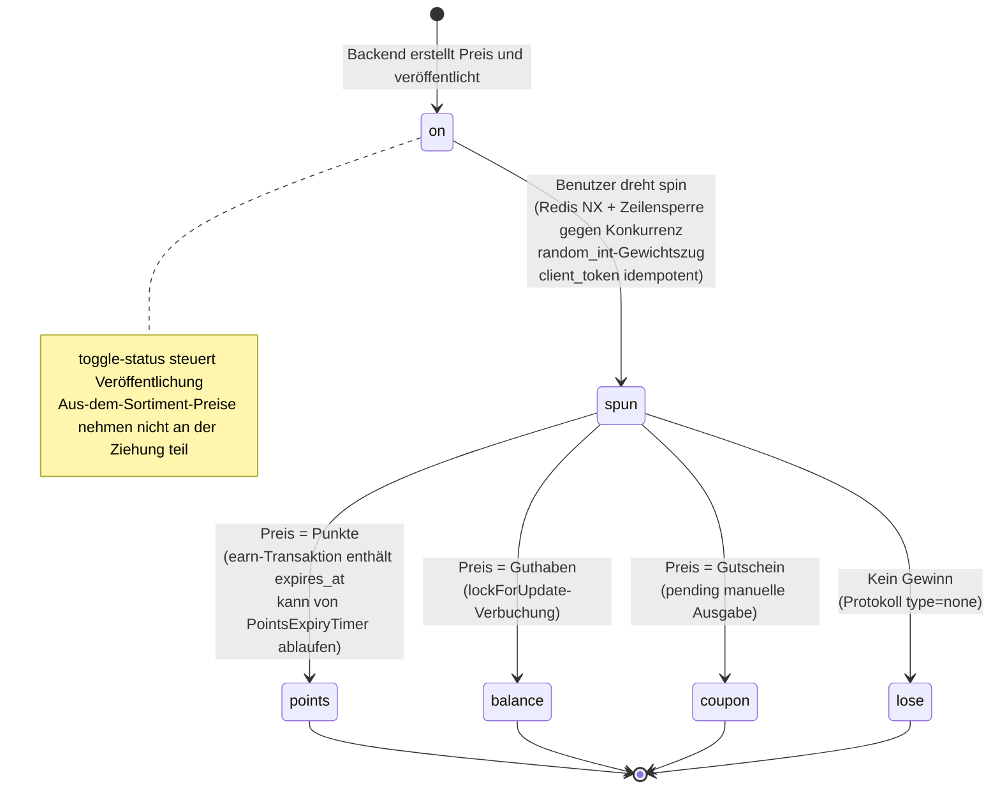
```mermaid
stateDiagram-v2
    [*] --> on: Backend erstellt Preis und veröffentlicht

    on --> spun: Benutzer dreht spin<br/>(Redis NX + Zeilensperre gegen Konkurrenz<br/>random_int-Gewichtszug<br/>client_token idempotent)

    spun --> points: Preis = Punkte<br/>(earn-Transaktion enthält expires_at<br/>kann von PointsExpiryTimer ablaufen)

    spun --> balance: Preis = Guthaben<br/>(lockForUpdate-Verbuchung)

    spun --> coupon: Preis = Gutschein<br/>(pending manuelle Ausgabe)

    spun --> lose: Kein Gewinn<br/>(Protokoll type=none)

    points --> [*]
    balance --> [*]
    coupon --> [*]
    lose --> [*]

    note right of on: toggle-status steuert Veröffentlichung<br/>Aus-dem-Sortiment-Preise nehmen nicht an der Ziehung teil
```

## 14. Kontolöschungs-Lebenszyklus (Runde 22)

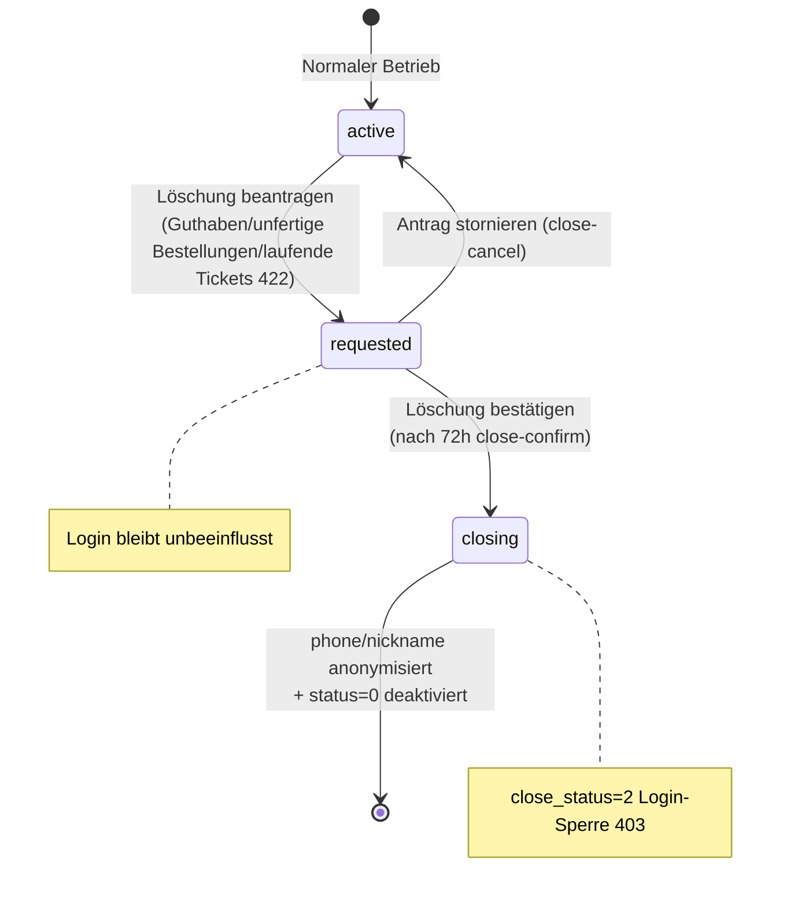
```mermaid
stateDiagram-v2
    [*] --> active: Normaler Betrieb

    active --> requested: Löschung beantragen<br/>(Guthaben/unfertige Bestellungen/laufende Tickets 422)

    requested --> active: Antrag stornieren (close-cancel)

    requested --> closing: Löschung bestätigen<br/>(nach 72h close-confirm)

    closing --> [*]: phone/nickname anonymisiert<br/>+ status=0 deaktiviert

    note right of requested: Login bleibt unbeeinflusst
    note right of closing: close_status=2 Login-Sperre 403
```

## 16. Blitzangebots-Aktivitäts-Lebenszyklus (Runde 24)

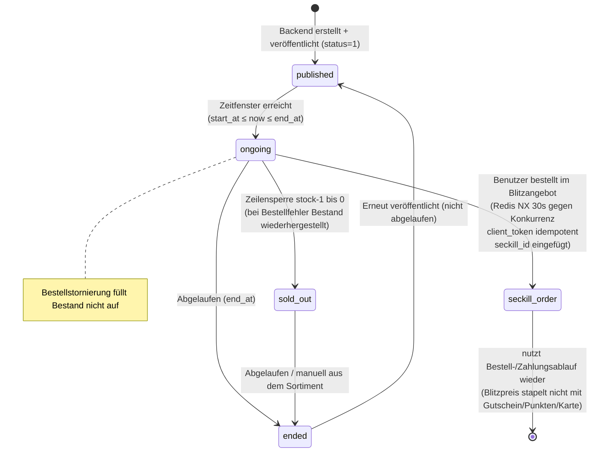
```mermaid
stateDiagram-v2
    [*] --> published: Backend erstellt + veröffentlicht (status=1)

    published --> ongoing: Zeitfenster erreicht<br/>(start_at ≤ now ≤ end_at)

    ongoing --> sold_out: Zeilensperre stock-1 bis 0<br/>(bei Bestellfehler Bestand wiederhergestellt)

    ongoing --> ended: Abgelaufen (end_at)

    sold_out --> ended: Abgelaufen / manuell aus dem Sortiment

    ended --> published: Erneut veröffentlicht (nicht abgelaufen)

    ongoing --> seckill_order: Benutzer bestellt im Blitzangebot<br/>(Redis NX 30s gegen Konkurrenz<br/>client_token idempotent<br/>seckill_id eingefügt)

    seckill_order --> [*]: nutzt Bestell-/Zahlungsablauf wieder<br/>(Blitzpreis stapelt nicht mit Gutschein/Punkten/Karte)

    note right of ongoing: Bestellstornierung füllt Bestand nicht auf
```

## 17. Stammkunden-Belohnungs-Lebenszyklus (Runde 24)

```mermaid
stateDiagram-v2
    [*] --> completed: Bestellung abgeschlossen<br/>(WorkController::complete Zeilensperren-Transaktion)

    completed --> checked: 2. Konsum beim selben Techniker innerhalb von 30 Tagen prüfen

    checked --> none: Erstkonsum / Schalter aus<br/>(enabled=0)

    checked --> pending: 2. Konsum<br/>(Bonus = real gezahlt × ratio<br/>idempotent über order_id+type)

    pending --> settled: Einheitliche Abrechnung über die Provisionskette<br/>(erik_technician_earnings<br/>type=return_customer)

    settled --> [*]
    none --> [*]

    note right of pending: status=pending<br/>Einnahmen-Zusammenfassung der Technikerseite enthält automatisch
```
