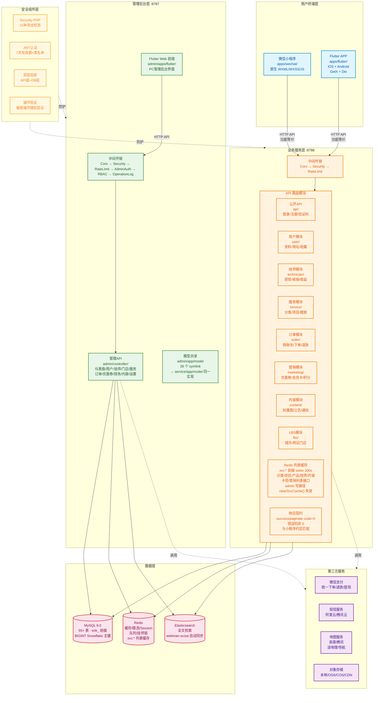

# 系统架构图

```mermaid
graph TB
    subgraph 用户终端层["用户终端层"]
        WX["微信小程序<br/>apps/wechat/<br/>原生 WXML/WXSS/JS"]
        APP["Flutter APP<br/>apps/flutter/<br/>iOS + Android<br/>GetX + Dio"]
    end

    subgraph 业务服务层["业务服务层 :8788"]
        direction TB
        MW1["中间件链<br/>Cors → Security → RateLimit"]
        subgraph API模块["API 路由模块"]
            PUB["公开API<br/>api/<br/>登录/注册/验证码"]
            USER["用户模块<br/>user/<br/>资料/地址/收藏"]
            TECH["技师模块<br/>technician/<br/>排班/核销/收益"]
            SVC["服务模块<br/>service/<br/>分类/项目/搜索"]
            ORD["订单模块<br/>order/<br/>购物车/下单/退款"]
            MKT["营销模块<br/>marketing/<br/>优惠券/会员卡/积分"]
            CTN["内容模块<br/>content/<br/>轮播图/公告/通知"]
            LBS["LBS模块<br/>lbs/<br/>城市/附近门店"]
            CACHE["Redis 列表缓存<br/>svc:* 前缀 setex 300s<br/>分类/项目/产品/技师/内容<br/>卡项/营销列表接口<br/>admin 写路径 clearSvcCache() 失效"]
            RES["响应契约<br/>success/paginate code=0<br/>错误码非 0<br/>与小程序约定匹配"]
        end
    end

    subgraph 管理后台层["管理后台层 :8787"]
        MW2["中间件链<br/>Cors → Security → RateLimit → AdminAuth → RBAC → OperationLog"]
        ADMIN_API["管理API<br/>admin/controller/<br/>仪表盘/用户/技师/门店/服务<br/>订单/优惠券/财务/内容/设置"]
        FLUTTER_WEB["Flutter Web 前端<br/>admin/apps/flutter/<br/>PC管理后台界面"]
        MODEL["模型共享<br/>admin/app/model<br/>39 个 symlink<br/>→ service/app/model 同一实现"]
    end

    subgraph 数据层["数据层"]
        MySQL[("MySQL 8.0<br/>55+ 表 · erik_ 前缀<br/>BIGINT Snowflake 主键")]
        Redis[("Redis<br/>缓存/限流/Session<br/>队列/技师锁<br/>svc:* 列表缓存")]
        ES[("Elasticsearch<br/>全文检索<br/>webman-scout 自动同步")]
    end

    subgraph 外部服务["第三方服务"]
        WXPAY["微信支付<br/>统一下单/退款/提现"]
        SMS["短信服务<br/>阿里云/腾讯云"]
        MAP["地图服务<br/>高德/腾讯<br/>逆地理/导航"]
        OSS["对象存储<br/>本地/OSS/COS/CDN"]
    end

    subgraph 安全组件["安全组件层"]
        SEC["Security-PHP<br/>31种攻击检测"]
        JWT["JWT认证<br/>7天有效期+黑名单"]
        ENC["双层加密<br/>API层+DB层"]
        POSTER["操作验证<br/>敏感操作随机验证"]
    end

    WX -->|"HTTP API<br/>功能等价"| MW1
    APP -->|"HTTP API<br/>功能等价"| MW1
    MW1 --> API模块

    FLUTTER_WEB -->|"HTTP API"| MW2
    MW2 --> ADMIN_API

    API模块 --> MySQL
    API模块 --> Redis
    API模块 --> ES
    ADMIN_API --> MySQL
    ADMIN_API --> Redis
    ADMIN_API --> ES

    安全组件 -.->|防护| 业务服务层
    安全组件 -.->|防护| 管理后台层

    API模块 -.->|调用| 外部服务
    ADMIN_API -.->|调用| 外部服务

    classDef terminal fill:#e1f5fe,stroke:#0288d1,stroke-width:2px,color:#01579b
    classDef service fill:#fff3e0,stroke:#f57c00,stroke-width:2px,color:#e65100
    classDef admin fill:#e8f5e9,stroke:#388e3c,stroke-width:2px,color:#1b5e20
    classDef data fill:#fce4ec,stroke:#c62828,stroke-width:2px,color:#880e4f
    classDef external fill:#f3e5f5,stroke:#7b1fa2,stroke-width:2px,color:#4a148c
    classDef security fill:#fff8e1,stroke:#f9a825,stroke-width:2px,color:#f57f17

    class WX,APP terminal
    class MW1,API模块,PUB,USER,TECH,SVC,ORD,MKT,CTN,LBS,CACHE,RES service
    class MW2,ADMIN_API,FLUTTER_WEB,MODEL admin
    class MySQL,Redis,ES data
    class WXPAY,SMS,MAP,OSS external
    class SEC,JWT,ENC,POSTER security
```
