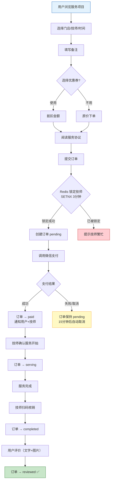
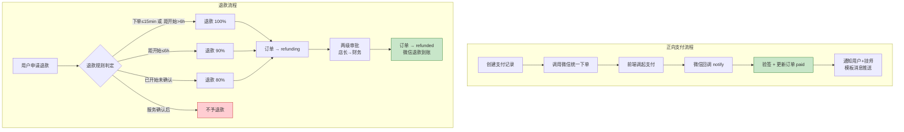
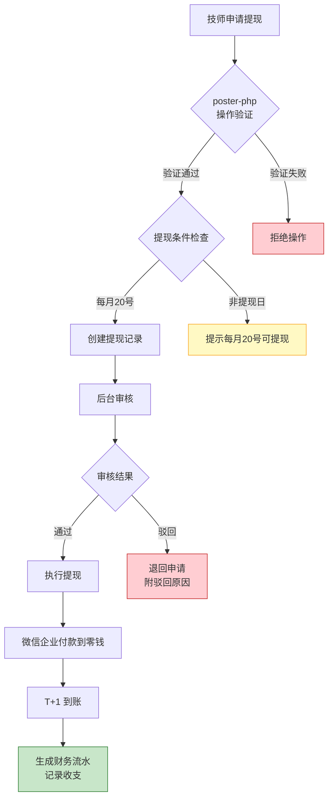
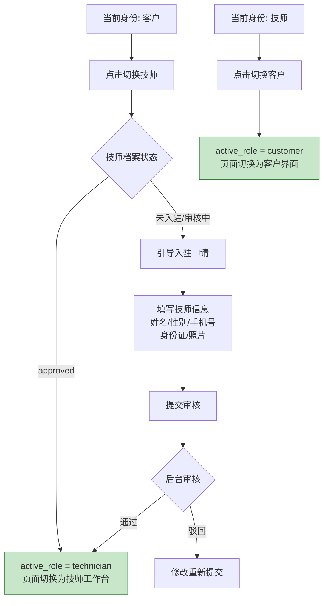

# 核心业务流程图

## 1. 服务预约流程

```mermaid
flowchart TD
    A["用户浏览服务项目"] --> B["选择门店/技师/时间"]
    B --> C["填写备注"]
    C --> D{"选择优惠券?"}
    D -->|"使用"| E["抵扣金额"]
    D -->|"不用"| F["原价下单"]
    E --> G["阅读服务协议"]
    F --> G
    G --> H["提交订单"]
    H --> I{"Redis 锁定技师<br/>SETNX 3分钟"}
    I -->|"锁定成功"| J["创建订单 pending"]
    I -->|"已被锁定"| K["提示技师繁忙"]
    J --> L["调用微信支付"]
    L --> M{"支付结果"}
    M -->|"成功"| N["订单 → paid<br/>通知用户+技师"]
    M -->|"失败/取消"| O["订单保持 pending<br/>15分钟后自动取消"]
    N --> P["技师确认服务开始"]
    P --> Q["订单 → serving"]
    Q --> R["服务完成"]
    R --> S["技师扫码核销"]
    S --> T["订单 → completed"]
    T --> U["用户评价（文字+图片）"]
    U --> V["订单 → reviewed ✅"]

    style A fill:#e3f2fd,stroke:#1565c0,color:#333
    style V fill:#c8e6c9,stroke:#2e7d32,color:#333
    style K fill:#ffcdd2,stroke:#c62828,color:#333
    style O fill:#fff9c4,stroke:#f9a825,color:#333
```

## 2. 支付与退款流程

```mermaid
flowchart TD
    subgraph 支付流程["正向支付流程"]
        P1["创建支付记录"] --> P2["调用微信统一下单"]
        P2 --> P3["前端调起支付"]
        P3 --> P4["微信回调 notify"]
        P4 --> P5["验签 + 更新订单 paid"]
        P5 --> P6["通知用户+技师<br/>模板消息推送"]
    end

    subgraph 退款流程["退款流程"]
        R1["用户申请退款"] --> R2{"退款规则判定"}
        R2 -->|"下单≤15min 或 距开始>6h"| R3["退款 100%"]
        R2 -->|"距开始≤6h"| R4["退款 90%"]
        R2 -->|"已开始未确认"| R5["退款 80%"]
        R2 -->|"服务确认后"| R6["不予退款"]
        R3 --> R7["订单 → refunding"]
        R4 --> R7
        R5 --> R7
        R7 --> R8["两级审批<br/>店长→财务"]
        R8 --> R9["订单 → refunded<br/>微信退款到账"]
    end

    style P5 fill:#c8e6c9,stroke:#2e7d32,color:#333
    style R6 fill:#ffcdd2,stroke:#c62828,color:#333
    style R9 fill:#c8e6c9,stroke:#2e7d32,color:#333
```

## 3. 技师提现流程

```mermaid
flowchart TD
    A["技师申请提现"] --> B{"poster-php<br/>操作验证"}
    B -->|"验证通过"| C{"提现条件检查"}
    B -->|"验证失败"| X["拒绝操作"]
    C -->|"每月20号"| D["创建提现记录"]
    C -->|"非提现日"| Y["提示每月20号可提现"]
    D --> E["后台审核"]
    E --> F{"审核结果"}
    F -->|"通过"| G["执行提现"]
    F -->|"驳回"| H["退回申请<br/>附驳回原因"]
    G --> I["微信企业付款到零钱"]
    I --> J["T+1 到账"]
    J --> K["生成财务流水<br/>记录收支"]

    style K fill:#c8e6c9,stroke:#2e7d32,color:#333
    style X fill:#ffcdd2,stroke:#c62828,color:#333
    style Y fill:#fff9c4,stroke:#f9a825,color:#333
    style H fill:#ffcdd2,stroke:#c62828,color:#333
```

## 4. 身份切换流程

```mermaid
flowchart TD
    A["当前身份: 客户"] --> B["点击切换技师"]
    B --> C{"技师档案状态"}
    C -->|"approved"| D["active_role = technician<br/>页面切换为技师工作台"]
    C -->|"未入驻/审核中"| E["引导入驻申请"]
    E --> F["填写技师信息<br/>姓名/性别/手机号<br/>身份证/照片"]
    F --> G["提交审核"]
    G --> H{"后台审核"}
    H -->|"通过"| D
    H -->|"驳回"| I["修改重新提交"]

    J["当前身份: 技师"] --> K["点击切换客户"]
    K --> L["active_role = customer<br/>页面切换为客户界面"]

    style D fill:#c8e6c9,stroke:#2e7d32,color:#333
    style L fill:#c8e6c9,stroke:#2e7d32,color:#333
```
