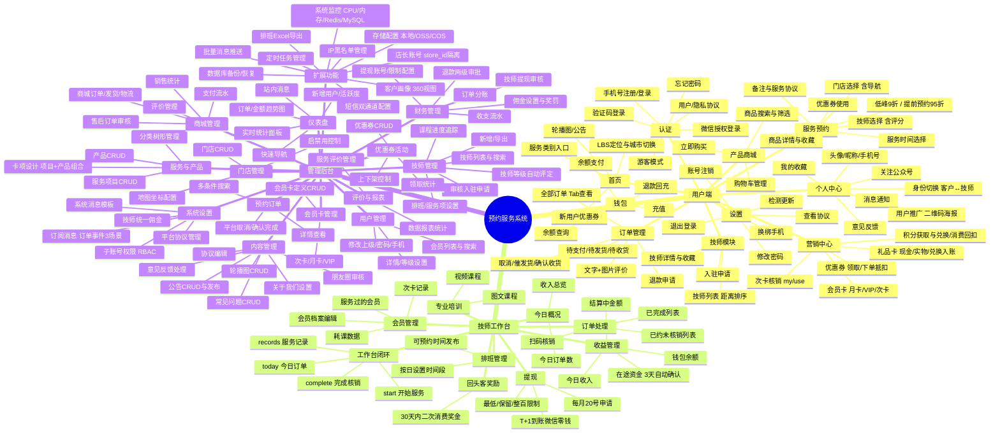

# 系统功能图

```mermaid
mindmap
  root((预约服务系统))
    用户端
      认证
        手机号注册/登录
        验证码登录
        微信授权登录
        游客模式
        忘记密码
        用户/隐私协议
      首页
        LBS定位与城市切换
        轮播图/公告
        服务类别入口
        新用户优惠券
      服务预约
        门店选择 含导航
        技师选择 含评分
        服务时间选择
        低峰9折 / 提前预约95折
        优惠券使用
        备注与服务协议
      产品商城
        商品搜索与筛选
        商品详情与收藏
        购物车管理
        立即购买
      订单管理
        全部订单 Tab查看
        待支付/待发货/待收货
        取消/催发货/确认收货
        退款申请
        文字+图片评价
      技师模块
        技师列表 距离排序
        技师详情与收藏
        入驻申请
      营销中心
        优惠券 领取/下单抵扣
        会员卡 月卡/VIP/次卡
        次卡核销 my/use
        积分获取与兑换/消费回扣
        礼品卡 现金/实物/兑换入账
      钱包
        余额查询
        充值
        余额支付
        退款回充
      个人中心
        头像/昵称/手机号
        身份切换 客户↔技师
        消息通知
        我的收藏
        关注公众号
        用户推广 二维码海报
        意见反馈
      设置
        修改密码
        换绑手机
        查看协议
        检测更新
        账号注销
        退出登录

    技师工作台
      工作台闭环
        today 今日订单
        records 服务记录
        start 开始服务
        complete 完成核销
      今日概况
        今日订单数
        收入总览
      排班管理
        按日设置时间段
        可预约时间发布
      订单处理
        已约未核销列表
        已完成列表
        扫码核销
      会员管理
        服务过的会员
        耗课数据
        次卡记录
        会员档案编辑
      收益管理
        今日收入
        结算中金额
        钱包余额
        在途资金 3天自动确认
      提现
        每月20号申请
        T+1到账微信零钱
        最低/保留/整百限制
      回头客奖励
        30天内二次消费奖金
      专业培训
        视频课程
        图文课程

    管理后台
      仪表盘
        实时统计面板
        订单/金额趋势图
        新增用户/活跃度
        快速导航
        站内消息
      技师管理
        技师列表与搜索
        新增/导出
        审核入驻申请
        排班/服务项设置
        课程进度追踪
        技师等级自动评定
      用户管理
        会员列表与搜索
        详情/等级设置
        修改上级/密码/手机
      门店管理
        门店CRUD
        启禁用控制
        地图坐标配置
      服务与产品
        服务项目CRUD
        产品CRUD
        分类树形管理
        卡项设计 项目+产品组合
      商城管理
        商城订单/发货/物流
        售后订单审核
        评价管理
        支付流水
        销售统计
      预约订单
        多条件搜索
        平台取消/确认完成
        详情查看
      优惠券活动
        优惠券CRUD
        上下架控制
        领取统计
      会员卡管理
        会员卡定义CRUD
        次卡/月卡/VIP
      评价与报表
        服务评价管理
        数据报表统计
      财务管理
        订单分账
        技师提现审核
        佣金设置与奖罚
        收支流水
        提现账号/限制配置
        退款两级审批
      内容管理
        轮播图CRUD
        公告CRUD与发布
        协议编辑
        常见问题CRUD
        意见反馈处理
        朋友圈审核
        关于我们设置
      系统设置
        平台协议管理
        技师统一佣金
        系统消息模板
        订阅消息 订单事件3场景
        子账号权限 RBAC
      扩展功能
        系统监控 CPU/内存/Redis/MySQL
        IP黑名单管理
        数据库备份/恢复
        客户画像 360视图
        批量消息推送
        定时任务管理
        短信双通道配置
        存储配置 本地/OSS/COS
        排班Excel导出
        店长账号 store_id隔离
```
