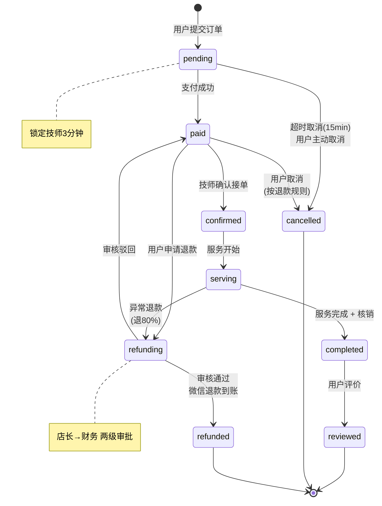
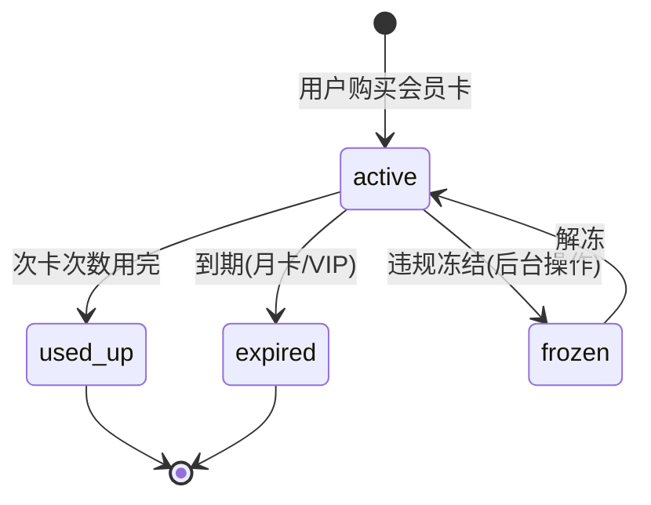
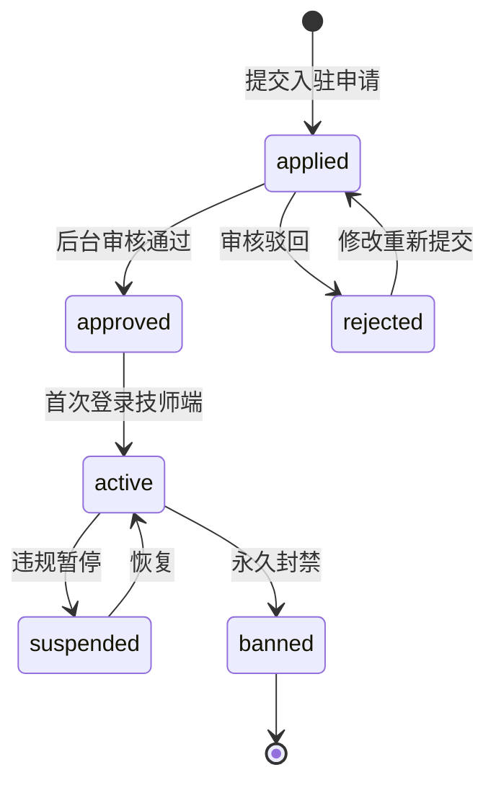
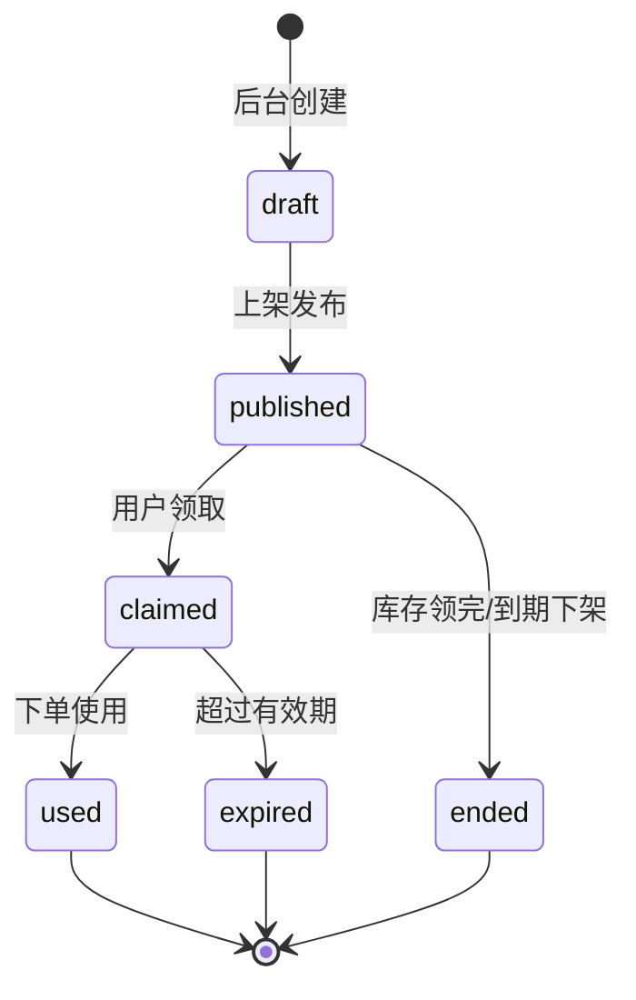
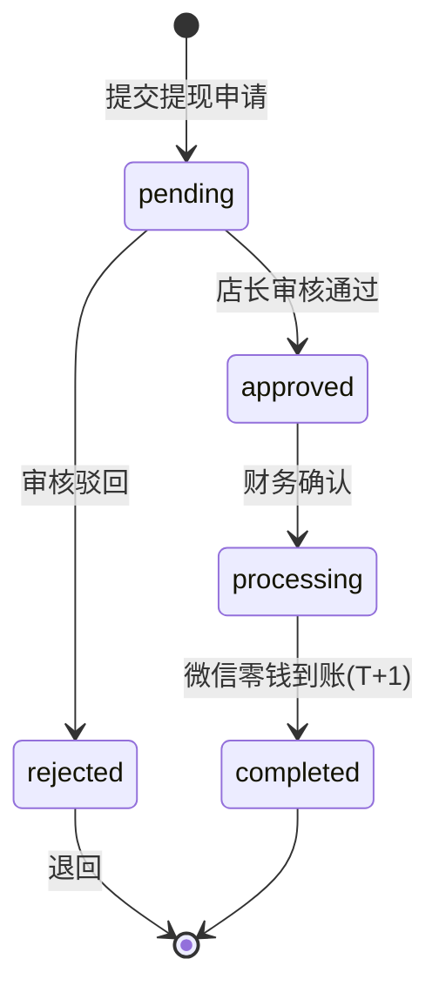
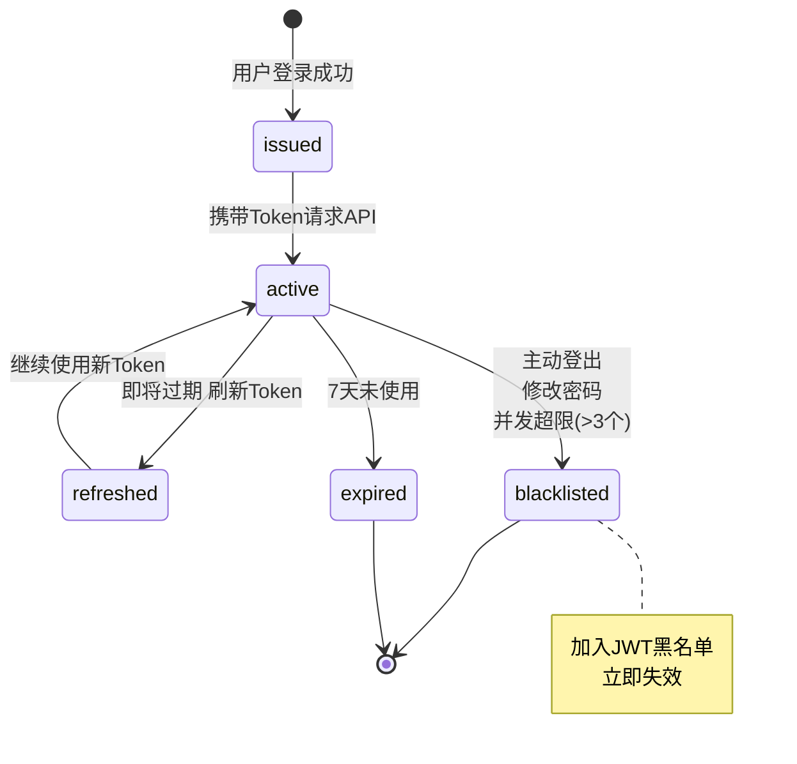

# 生命周期图

## 1. 订单生命周期（状态机）

```mermaid
stateDiagram-v2
    [*] --> pending: 用户提交订单

    pending --> paid: 支付成功
    pending --> cancelled: 超时取消(15min)<br/>用户主动取消

    paid --> confirmed: 技师确认接单
    paid --> cancelled: 用户取消<br/>(按退款规则)
    paid --> refunding: 用户申请退款

    confirmed --> serving: 服务开始

    serving --> completed: 服务完成 + 核销
    serving --> refunding: 异常退款<br/>(退80%)

    completed --> reviewed: 用户评价

    refunding --> refunded: 审核通过<br/>微信退款到账
    refunding --> paid: 审核驳回

    reviewed --> [*]
    cancelled --> [*]
    refunded --> [*]

    note right of pending: 锁定技师3分钟
    note right of refunding: 店长→财务 两级审批
```

## 2. 会员卡生命周期

```mermaid
stateDiagram-v2
    [*] --> active: 用户购买会员卡

    active --> used_up: 次卡次数用完

    active --> expired: 到期(月卡/VIP)

    active --> frozen: 违规冻结(后台操作)

    frozen --> active: 解冻

    used_up --> [*]
    expired --> [*]
```

## 3. 技师入驻生命周期

```mermaid
stateDiagram-v2
    [*] --> applied: 提交入驻申请

    applied --> approved: 后台审核通过
    applied --> rejected: 审核驳回

    rejected --> applied: 修改重新提交

    approved --> active: 首次登录技师端

    active --> suspended: 违规暂停
    suspended --> active: 恢复
    active --> banned: 永久封禁

    banned --> [*]
```

## 4. 优惠券生命周期

```mermaid
stateDiagram-v2
    [*] --> draft: 后台创建

    draft --> published: 上架发布

    published --> claimed: 用户领取

    claimed --> used: 下单使用
    claimed --> expired: 超过有效期

    published --> ended: 库存领完/到期下架

    used --> [*]
    expired --> [*]
    ended --> [*]
```

## 5. 技师提现生命周期

```mermaid
stateDiagram-v2
    [*] --> pending: 提交提现申请

    pending --> approved: 店长审核通过
    pending --> rejected: 审核驳回

    rejected --> [*]: 退回

    approved --> processing: 财务确认

    processing --> completed: 微信零钱到账(T+1)

    completed --> [*]
```

## 6. Token 认证生命周期

```mermaid
stateDiagram-v2
    [*] --> issued: 用户登录成功

    issued --> active: 携带Token请求API

    active --> refreshed: 即将过期 刷新Token

    refreshed --> active: 继续使用新Token

    active --> blacklisted: 主动登出<br/>修改密码<br/>并发超限(>3个)

    active --> expired: 7天未使用

    blacklisted --> [*]
    expired --> [*]

    note right of blacklisted: 加入JWT黑名单<br/>立即失效
```
