# 生命周期图
> **多语言**：[English](en/diagrams/LIFECYCLE-DIAGRAM.md) · [한국어](ko/diagrams/LIFECYCLE-DIAGRAM.md) · [Русский](ru/diagrams/LIFECYCLE-DIAGRAM.md) · [Deutsch](de/diagrams/LIFECYCLE-DIAGRAM.md) · [Français](fr/diagrams/LIFECYCLE-DIAGRAM.md) · [Español](es/diagrams/LIFECYCLE-DIAGRAM.md) · [Português](pt/diagrams/LIFECYCLE-DIAGRAM.md) · [हिन्दी](hi/diagrams/LIFECYCLE-DIAGRAM.md) · [العربية](ar/diagrams/LIFECYCLE-DIAGRAM.md) · [বাংলা](bn/diagrams/LIFECYCLE-DIAGRAM.md) · [Bahasa Indonesia](id/diagrams/LIFECYCLE-DIAGRAM.md) · [日本語](ja/diagrams/LIFECYCLE-DIAGRAM.md)

## 1. 订单生命周期（状态机）

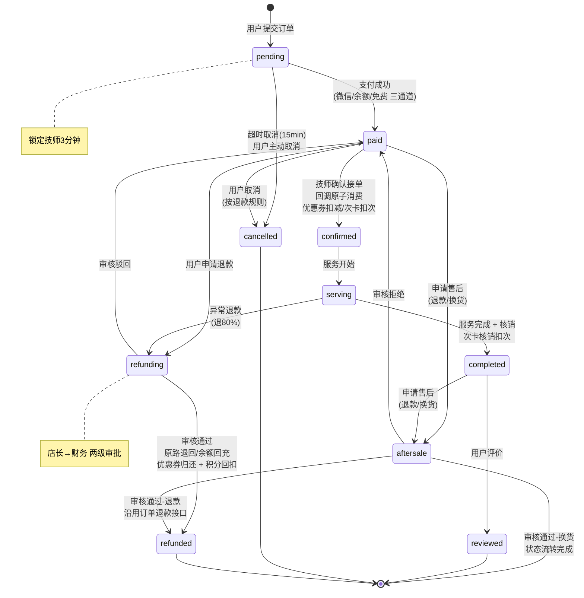
```mermaid
stateDiagram-v2
    [*] --> pending: 用户提交订单

    pending --> paid: 支付成功<br/>(微信/余额/免费 三通道)

    pending --> cancelled: 超时取消(15min)<br/>用户主动取消

    paid --> confirmed: 技师确认接单<br/>回调原子消费<br/>优惠券扣减/次卡扣次
    paid --> cancelled: 用户取消<br/>(按退款规则)
    paid --> refunding: 用户申请退款
    paid --> aftersale: 申请售后<br/>(退款/换货)

    confirmed --> serving: 服务开始

    serving --> completed: 服务完成 + 核销<br/>次卡核销扣次

    serving --> refunding: 异常退款<br/>(退80%)

    completed --> reviewed: 用户评价
    completed --> aftersale: 申请售后<br/>(退款/换货)

    refunding --> refunded: 审核通过<br/>原路退回/余额回充<br/>优惠券归还 + 积分回扣
    refunding --> paid: 审核驳回

    aftersale --> refunded: 审核通过-退款<br/>沿用订单退款接口
    aftersale --> paid: 审核拒绝
    aftersale --> [*]: 审核通过-换货<br/>状态流转完成

    reviewed --> [*]
    cancelled --> [*]
    refunded --> [*]

    note right of pending: 锁定技师3分钟
    note right of refunding: 店长→财务 两级审批
```

## 2. 会员卡生命周期

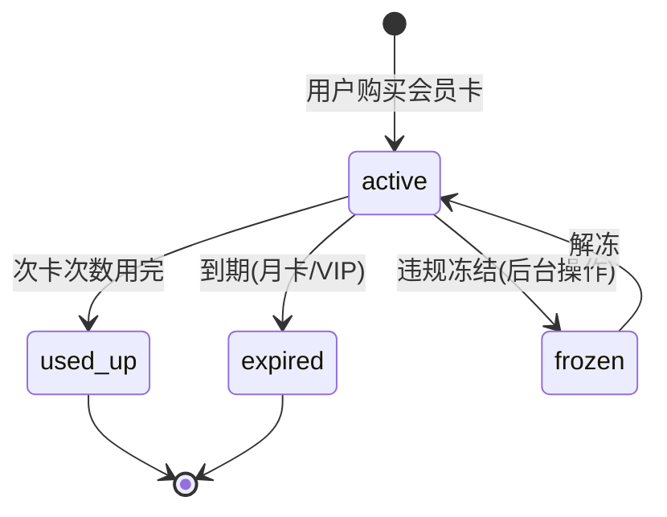
```mermaid
stateDiagram-v2
    [*] --> active: 用户购买会员卡

    active --> used_up: 次卡次数用完

    active --> expired: 到期(月卡/VIP)

    active --> frozen: 违规冻结(后台操作)

    frozen --> active: 解冻

    used_up --> [*]
    expired --> [*]
```

## 3. 技师入驻生命周期

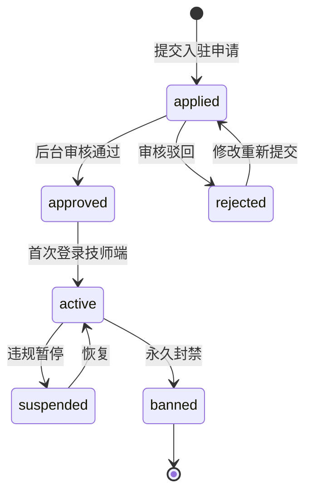
```mermaid
stateDiagram-v2
    [*] --> applied: 提交入驻申请

    applied --> approved: 后台审核通过
    applied --> rejected: 审核驳回

    rejected --> applied: 修改重新提交

    approved --> active: 首次登录技师端

    active --> suspended: 违规暂停
    suspended --> active: 恢复
    active --> banned: 永久封禁

    banned --> [*]
```

## 4. 优惠券生命周期

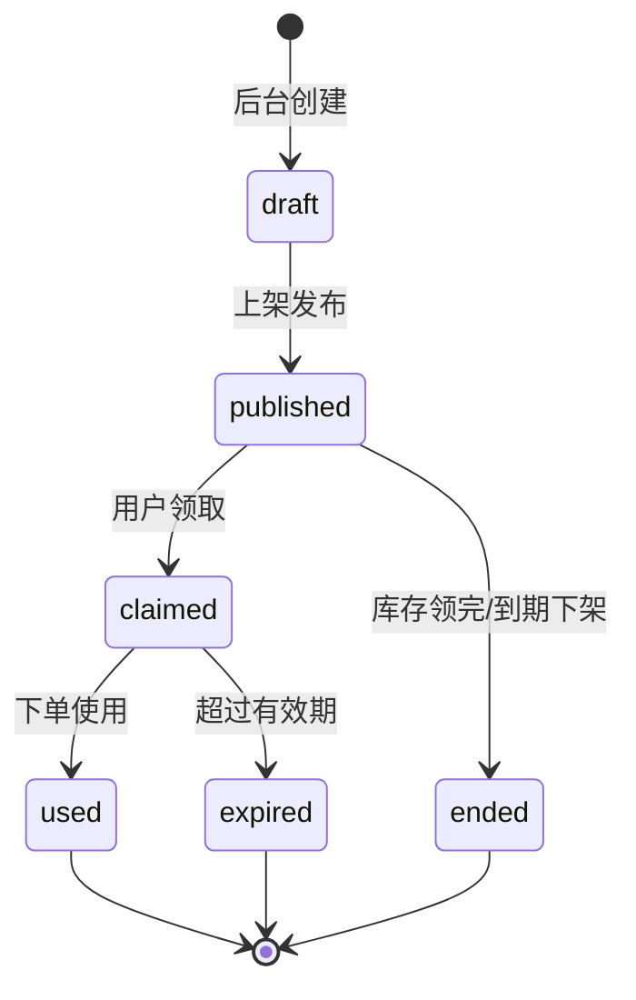
```mermaid
stateDiagram-v2
    [*] --> draft: 后台创建

    draft --> published: 上架发布

    published --> claimed: 用户领取

    claimed --> used: 下单使用
    claimed --> expired: 超过有效期

    published --> ended: 库存领完/到期下架

    used --> [*]
    expired --> [*]
    ended --> [*]
```

## 5. 技师提现生命周期

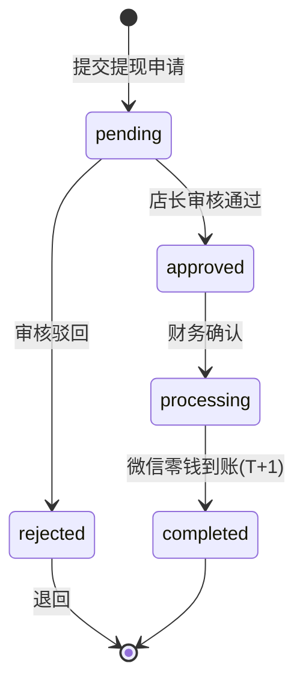
```mermaid
stateDiagram-v2
    [*] --> pending: 提交提现申请

    pending --> approved: 店长审核通过
    pending --> rejected: 审核驳回

    rejected --> [*]: 退回

    approved --> processing: 财务确认

    processing --> completed: 微信零钱到账(T+1)

    completed --> [*]
```

## 6. Token 认证生命周期

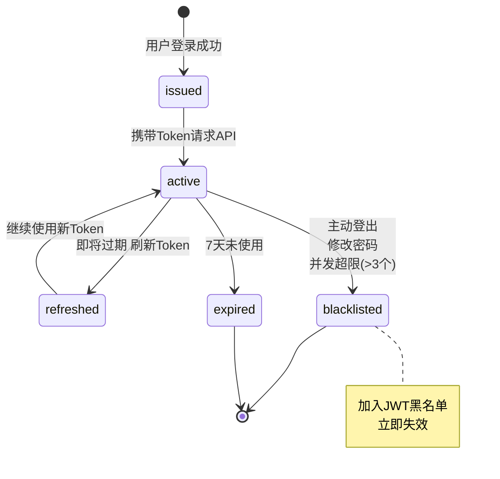
```mermaid
stateDiagram-v2
    [*] --> issued: 用户登录成功

    issued --> active: 携带Token请求API

    active --> refreshed: 即将过期 刷新Token

    refreshed --> active: 继续使用新Token

    active --> blacklisted: 主动登出<br/>修改密码<br/>并发超限(>3个)

    active --> expired: 7天未使用

    blacklisted --> [*]
    expired --> [*]

    note right of blacklisted: 加入JWT黑名单<br/>立即失效
```

## 7. 拼团活动生命周期

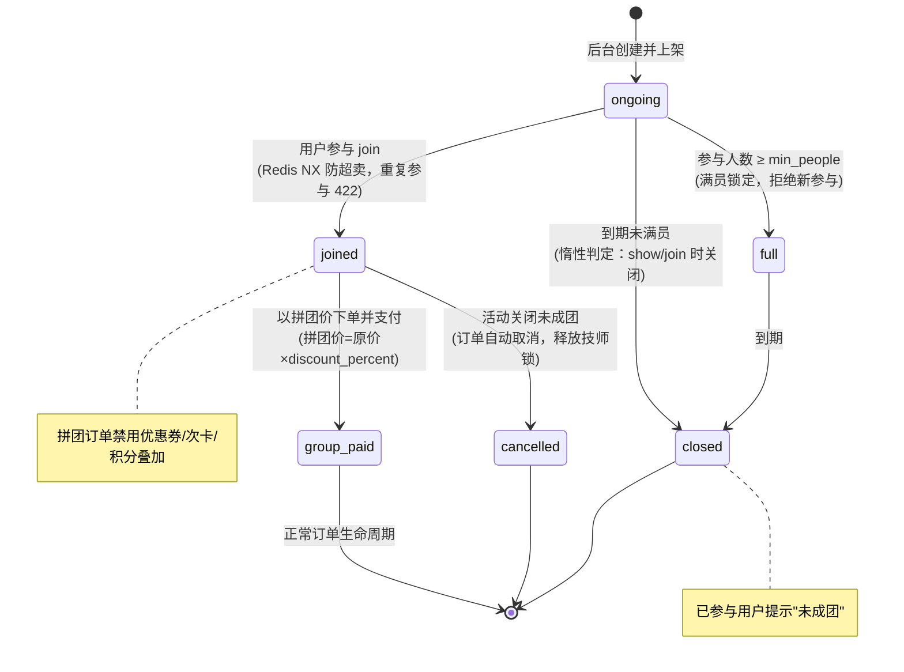
```mermaid
stateDiagram-v2
    [*] --> ongoing: 后台创建并上架

    ongoing --> full: 参与人数 ≥ min_people<br/>(满员锁定，拒绝新参与)

    ongoing --> closed: 到期未满员<br/>(惰性判定：show/join 时关闭)

    full --> closed: 到期

    ongoing --> joined: 用户参与 join<br/>(Redis NX 防超卖，重复参与 422)

    joined --> group_paid: 以拼团价下单并支付<br/>(拼团价=原价×discount_percent)

    joined --> cancelled: 活动关闭未成团<br/>(订单自动取消，释放技师锁)

    group_paid --> [*]: 正常订单生命周期
    cancelled --> [*]
    closed --> [*]

    note right of joined: 拼团订单禁用优惠券/次卡/积分叠加
    note right of closed: 已参与用户提示"未成团"
```

## 8. 优惠券转赠生命周期

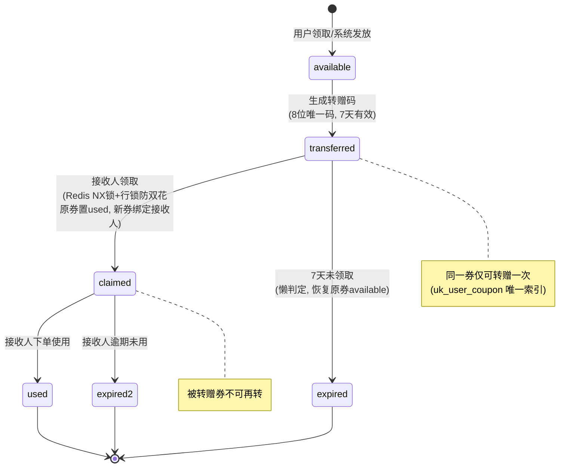
```mermaid
stateDiagram-v2
    [*] --> available: 用户领取/系统发放

    available --> transferred: 生成转赠码<br/>(8位唯一码, 7天有效)

    transferred --> claimed: 接收人领取<br/>(Redis NX锁+行锁防双花<br/>原券置used, 新券绑定接收人)

    transferred --> expired: 7天未领取<br/>(懒判定, 恢复原券available)

    claimed --> used: 接收人下单使用
    claimed --> expired2: 接收人逾期未用

    used --> [*]
    expired --> [*]
    expired2 --> [*]

    note right of transferred: 同一券仅可转赠一次<br/>(uk_user_coupon 唯一索引)
    note right of claimed: 被转赠券不可再转
```

## 9. 积分过期生命周期

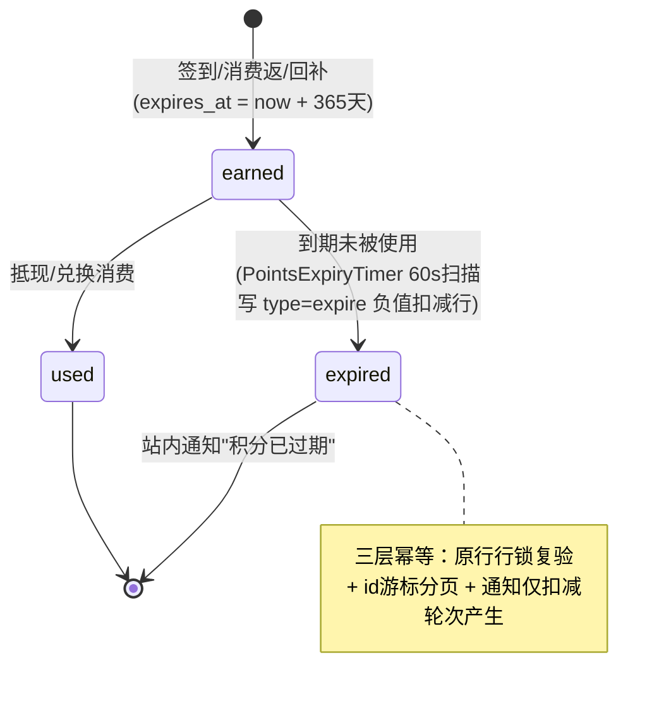
```mermaid
stateDiagram-v2
    [*] --> earned: 签到/消费返/回补<br/>(expires_at = now + 365天)

    earned --> used: 抵现/兑换消费

    earned --> expired: 到期未被使用<br/>(PointsExpiryTimer 60s扫描<br/>写 type=expire 负值扣减行)

    expired --> [*]: 站内通知"积分已过期"
    used --> [*]

    note right of expired: 三层幂等：原行行锁复验<br/>+ id游标分页 + 通知仅扣减轮次产生
```

## 10. 转账生命周期（第19轮：余额转账 + 积分转赠）

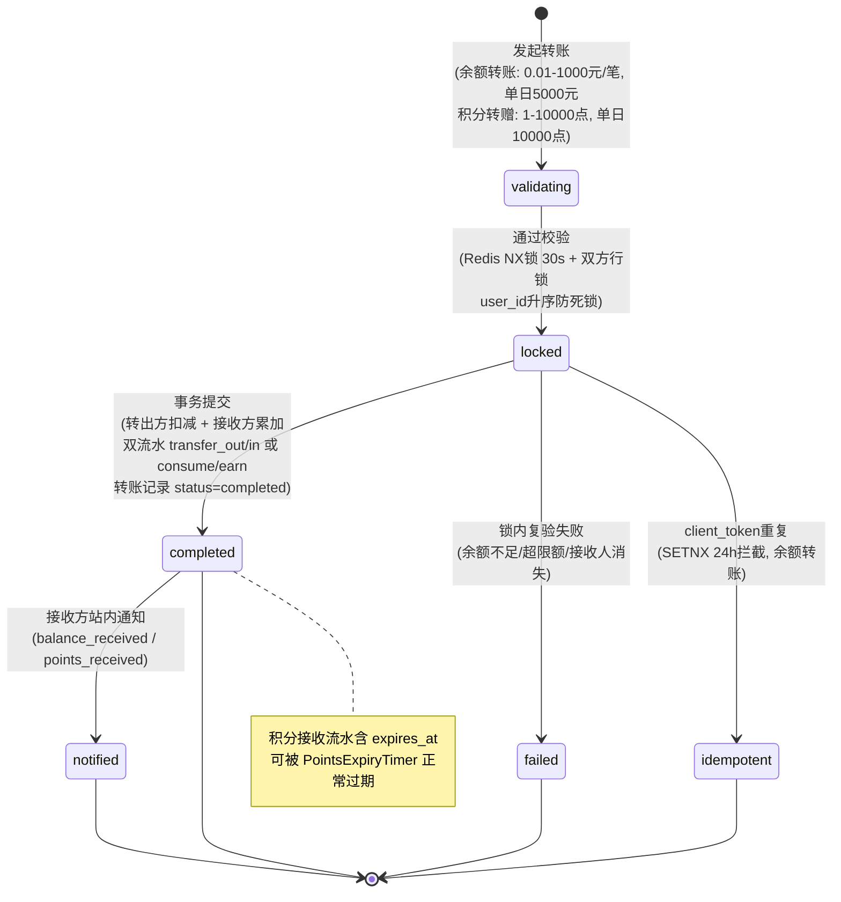
```mermaid
stateDiagram-v2
    [*] --> validating: 发起转账<br/>(余额转账: 0.01-1000元/笔, 单日5000元<br/>积分转赠: 1-10000点, 单日10000点)

    validating --> locked: 通过校验<br/>(Redis NX锁 30s + 双方行锁<br/>user_id升序防死锁)

    locked --> completed: 事务提交<br/>(转出方扣减 + 接收方累加<br/>双流水 transfer_out/in 或 consume/earn<br/>转账记录 status=completed)

    locked --> failed: 锁内复验失败<br/>(余额不足/超限额/接收人消失)
    locked --> idempotent: client_token重复<br/>(SETNX 24h拦截, 余额转账)

    completed --> notified: 接收方站内通知<br/>(balance_received / points_received)
    completed --> [*]
    failed --> [*]
    idempotent --> [*]
    notified --> [*]

    note right of completed: 积分接收流水含 expires_at<br/>可被 PointsExpiryTimer 正常过期
```

## 11. 客服工单生命周期（第20轮）

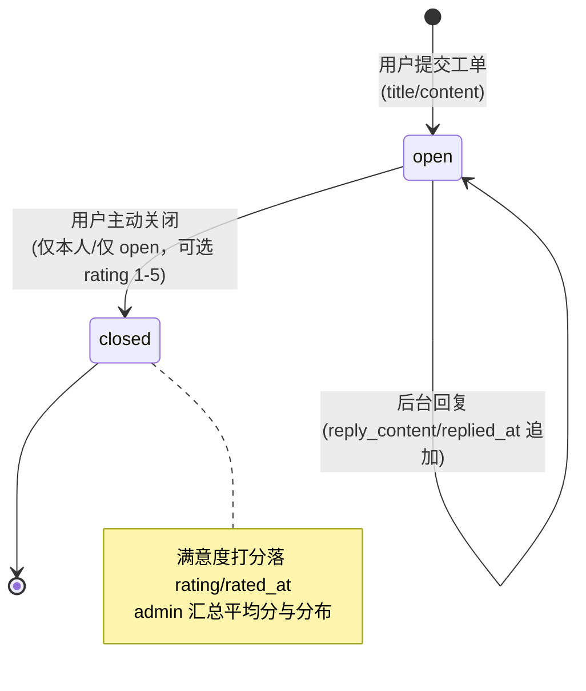
```mermaid
stateDiagram-v2
    [*] --> open: 用户提交工单<br/>(title/content)

    open --> open: 后台回复<br/>(reply_content/replied_at 追加)

    open --> closed: 用户主动关闭<br/>(仅本人/仅 open，可选 rating 1-5)

    closed --> [*]

    note right of closed: 满意度打分落 rating/rated_at<br/>admin 汇总平均分与分布
```

## 12. 电子发票生命周期（第20轮）

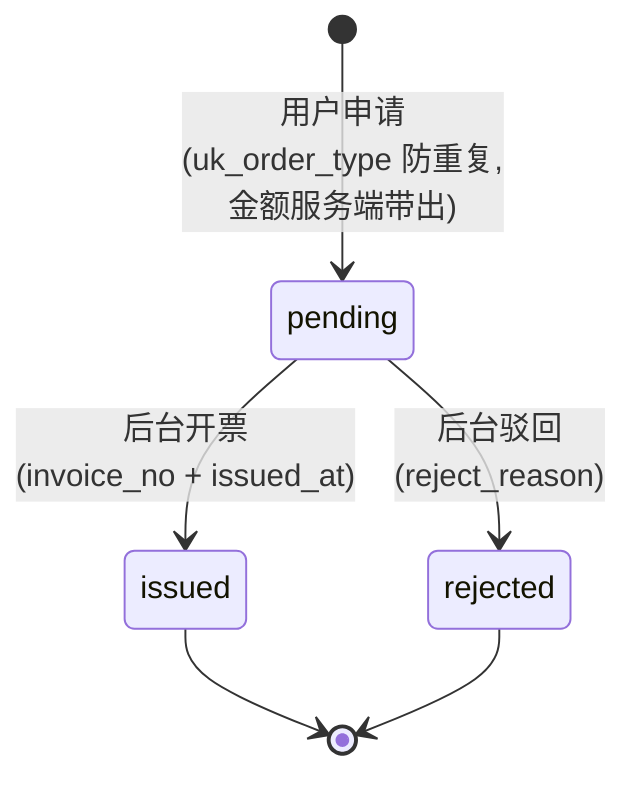
```mermaid
stateDiagram-v2
    [*] --> pending: 用户申请<br/>(uk_order_type 防重复,<br/>金额服务端带出)

    pending --> issued: 后台开票<br/>(invoice_no + issued_at)

    pending --> rejected: 后台驳回<br/>(reject_reason)

    issued --> [*]
    rejected --> [*]
```

## 13. 满减活动生命周期（第22轮）

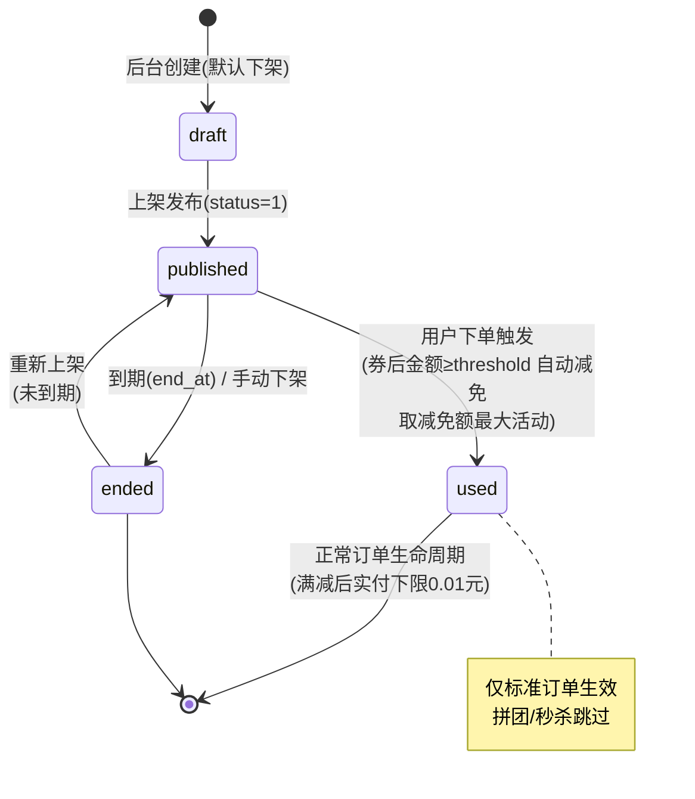
```mermaid
stateDiagram-v2
    [*] --> draft: 后台创建(默认下架)

    draft --> published: 上架发布(status=1)

    published --> ended: 到期(end_at) / 手动下架

    published --> used: 用户下单触发<br/>(券后金额≥threshold 自动减免<br/>取减免额最大活动)

    used --> [*]: 正常订单生命周期<br/>(满减后实付下限0.01元)

    ended --> published: 重新上架<br/>(未到期)
    ended --> [*]

    note right of used: 仅标准订单生效<br/>拼团/秒杀跳过
```

## 15. 转盘抽奖生命周期（第23轮）

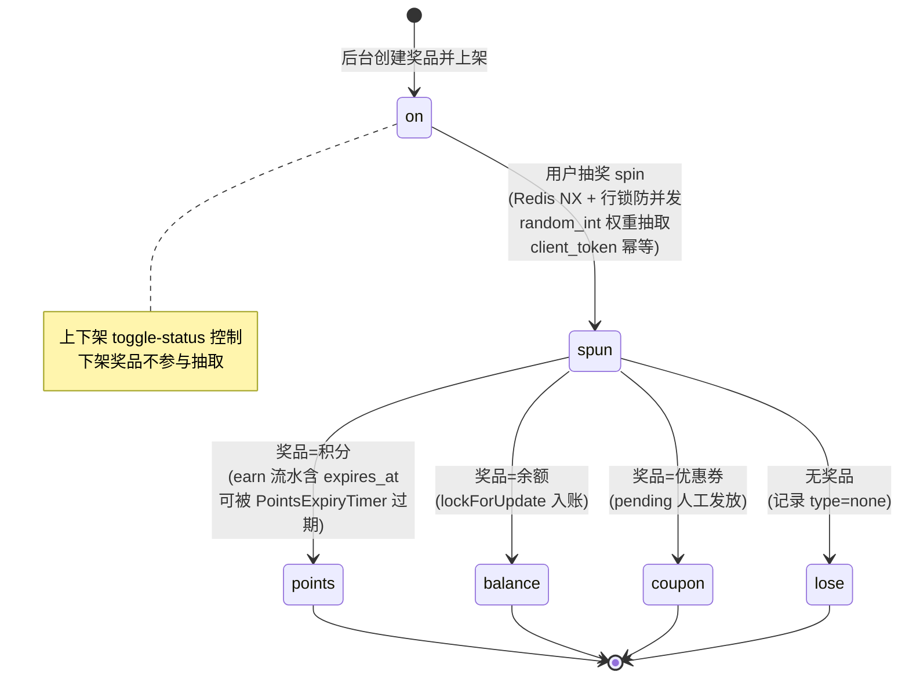
```mermaid
stateDiagram-v2
    [*] --> on: 后台创建奖品并上架

    on --> spun: 用户抽奖 spin<br/>(Redis NX + 行锁防并发<br/>random_int 权重抽取<br/>client_token 幂等)

    spun --> points: 奖品=积分<br/>(earn 流水含 expires_at<br/>可被 PointsExpiryTimer 过期)

    spun --> balance: 奖品=余额<br/>(lockForUpdate 入账)

    spun --> coupon: 奖品=优惠券<br/>(pending 人工发放)

    spun --> lose: 无奖品<br/>(记录 type=none)

    points --> [*]
    balance --> [*]
    coupon --> [*]
    lose --> [*]

    note right of on: 上下架 toggle-status 控制<br/>下架奖品不参与抽取
```

## 14. 账号注销生命周期（第22轮）

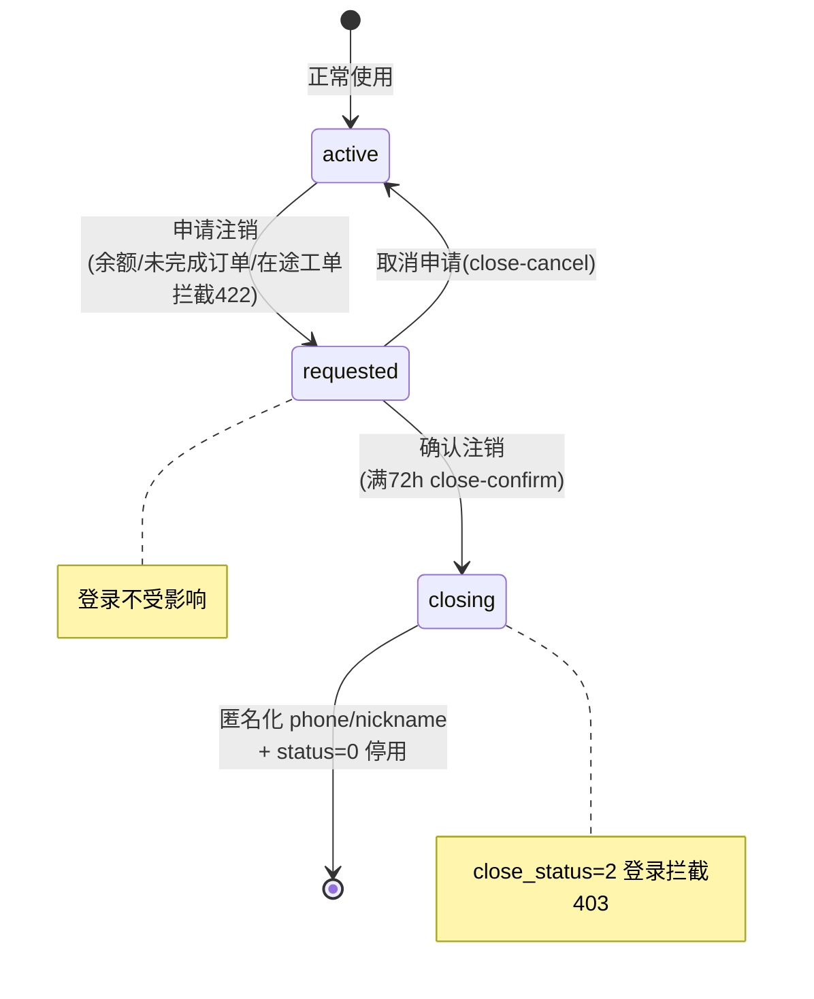
```mermaid
stateDiagram-v2
    [*] --> active: 正常使用

    active --> requested: 申请注销<br/>(余额/未完成订单/在途工单拦截422)

    requested --> active: 取消申请(close-cancel)

    requested --> closing: 确认注销<br/>(满72h close-confirm)

    closing --> [*]: 匿名化 phone/nickname<br/>+ status=0 停用

    note right of requested: 登录不受影响
    note right of closing: close_status=2 登录拦截403
```

## 16. 秒杀活动生命周期（第24轮）

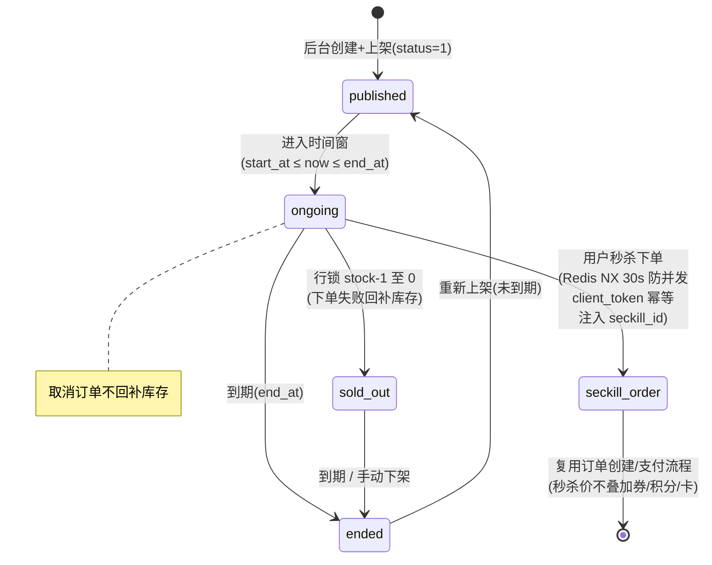
```mermaid
stateDiagram-v2
    [*] --> published: 后台创建+上架(status=1)

    published --> ongoing: 进入时间窗<br/>(start_at ≤ now ≤ end_at)

    ongoing --> sold_out: 行锁 stock-1 至 0<br/>(下单失败回补库存)

    ongoing --> ended: 到期(end_at)

    sold_out --> ended: 到期 / 手动下架

    ended --> published: 重新上架(未到期)

    ongoing --> seckill_order: 用户秒杀下单<br/>(Redis NX 30s 防并发<br/>client_token 幂等<br/>注入 seckill_id)

    seckill_order --> [*]: 复用订单创建/支付流程<br/>(秒杀价不叠加券/积分/卡)

    note right of ongoing: 取消订单不回补库存
```

## 17. 回头客奖励生命周期（第24轮）

```mermaid
stateDiagram-v2
    [*] --> completed: 订单完成<br/>(WorkController::complete 行锁事务)

    completed --> checked: 30天内同技师二次消费判定

    checked --> none: 首次消费 / 开关关闭<br/>(enabled=0)

    checked --> pending: 二次消费<br/>(奖金=实付×ratio<br/>同 order_id+type 幂等)

    pending --> settled: 佣金结算链统一结算<br/>(erik_technician_earnings<br/>type=return_customer)

    settled --> [*]
    none --> [*]

    note right of pending: status=pending<br/>技师端收益汇总自动包含
```

