# Appointment Service System

A four-client appointment service management platform: WeChat Mini Program + Flutter APP + HarmonyOS APP for users (same-account identity switching), plus a PC admin dashboard.

> **Project status**: All complete ✅ | 143 controllers (service 69 / admin 74) | 87 models | 722 tests (service 558 / admin 164) | 95 database tables | 388 routes (service 227 / admin 161)

> English translation · Original: [中文](../../README.md)

## Introduction


**Appointment Service System** is a four-client appointment management platform for the life-services industry: the user side covers **WeChat Mini Program, Flutter APP, and HarmonyOS APP** with free cross-client switching under the same account, together with a **PC admin dashboard**, forming a full digital loop of "user appointment → technician takes the order → back-office operations". Whether it is in-store appointments, technician services, membership marketing, or financial settlement, one system handles it all.

**One-stop appointment experience**

Consistent experience across all three user clients: intuitive calendar-based time slot selection, coupon/session-card/points deductions, flash sales and group-buying discounts, WeChat/balance payment, and fully trackable order status — rescheduling, cancellation, refund, after-sales, and e-invoices are all completed online; the technician side provides a workbench, clock-in/clock-out, batch scheduling, service verification, and withdrawal approval, giving full visibility into operational efficiency.

**End-to-end marketing growth**

Built in are more than a dozen marketing tools — full-reduction promotions, flash sales, group buying, coupon gifting, a points mall and lucky wheel, membership cards/growth-level benefits, two-level distribution commissions, return-customer rewards — combined with WeChat subscribe-message push and APP push to help merchants continuously acquire, retain, and re-engage customers.

**Enterprise-grade security and compliance**

Uses self-developed security components: JWT authentication, ID obfuscation, 31 types of attack detection, double-layer encryption of sensitive data, server-side price validation, strict payment callback comparison with idempotent deduplication; it also supports WeChat official profit sharing, privacy data export, and account deletion to satisfy compliance requirements.

**Mature technology foundation**

Built on PHP 8.3 + the high-performance resident webman framework, backed by MySQL 8.0 + Redis + Elasticsearch; 95 database tables, 388 APIs, 285 fine-grained permission points, and 722 automated tests all passing, with complete bilingual (Chinese/English) architecture documentation and a one-click install script — ready to use out of the box and easy to extend.

Whether you run a single store or a multi-store chain, Appointment Service System provides a stable, secure, and scalable all-in-one solution.

## Project Structure

```
appointment-php/
├── admin/                     # 管理后台 (webman v2 + Flutter Web，独立部署 :8787)
│   ├── app/                   #   admin(后台控制器)/api/model/middleware/process/view
│   ├── apps/                  #   Flutter Web 后台 / HarmonyOS / 微信管理端
│   ├── config/                #   路由/数据库/进程/插件配置
│   ├── database/              #   备份脚本（表结构与种子数据统一见 docs/install.sql）
│   ├── tests/                 #   PHPUnit（#[\Test] 属性风格）
│   └── start.php
├── service/                   # 业务API服务 (webman v2，独立部署 :8787)
│   ├── app/                   #   api/user/technician/order/wallet/marketing/notification 等模块
│   ├── config/                #   路由/数据库/进程/支付等配置
│   ├── support/               #   Model 基类（generateId）/Request/Response
│   ├── tests/                 #   PHPUnit
│   └── start.php
├── apps/                      # 用户端前端应用
│   ├── wechat/                #   微信小程序（原生）
│   ├── flutter/               #   Flutter APP（iOS + Android）
│   └── harmonyos/             #   HarmonyOS APP（鸿蒙原生）
└── docs/                      # 项目文档
    ├── API.md / FEATURES.md / STRUCTURE.md / install.sql / README.md ...
    └── diagrams/              #   架构/流程图（SVG + mermaid）
```

## Quick Start

### Requirements

- PHP 8.3+
- MySQL 8.0+
- Redis
- Composer

### Web Install Wizard (recommended)

```bash
cd admin/
cp .env.example .env
composer install
php start.php start -d
```

Open `http://localhost:8787/install` in the browser and follow the wizard to enter the database and administrator account to complete the installation.

### Manual Installation

```bash
# 1. Install dependencies
cd service/ && cp .env.example .env && composer install
cd ../admin/ && cp .env.example .env && composer install

# 2. Import the database in one go (all 95 tables + permission/config seeds)
mysql -u root -p < docs/install.sql

# 3. Start the services
cd service/ && php start.php start -d   # business API → :8787
cd ../admin/ && php start.php start -d  # admin dashboard → :8787
```

### Docker Deployment

```bash
cd admin/ && cp .env.docker .env && docker-compose up -d
cd ../service/ && cp .env.docker .env && docker-compose up -d
```

## Tech Stack

| Layer | Technology | Description |
|------|------|------|
| Backend framework | webman v2 (PHP 8.3+) | High-performance resident-memory HTTP service |
| Database | MySQL 8.0 | Table prefix `erik_` |
| Cache | Redis | Cache / rate limiting / Session / queues |
| Search | Elasticsearch | Full-text search (via webman-scout) |
| Admin frontend | Flutter Web | PC admin dashboard UI |
| User APP | Flutter | iOS + Android |
| User Mini Program | Native WeChat Mini Program | WXML/WXSS/JS |
| User HarmonyOS APP | HarmonyOS ArkTS | Native @ohos.net.http |
| ID generation | erikwang2013/snowflake-php | BIGINT non-auto-increment primary keys |
| API ID encryption | erikwang2013/hashids | Hides real IDs externally |
| JWT auth | erikwang2013/jwt-webman | Bearer Token |
| Sensitive data encryption | erikwang2013/encryption + encryptable | API + DB double-layer encryption |
| Security protection | erikwang2013/security-php | 31 types of attack detection |
| Operation verification | erikwang2013/poster-php | Random verification for sensitive operations |
| Country flags | erikwang2013/season | Flag icons |
| ES sync | erikwang2013/webman-scout | Automatic model sync |

## System Architecture



## Core Flows

### Service Appointment Flow



### Payment & Refund Flow



## Order Lifecycle



## Security Architecture

### Seven-Layer Defense-in-Depth



> More detailed diagrams: [Flowcharts](diagrams/FLOWCHART.md) (incl. technician withdrawal/identity switching) | [Function mindmap](diagrams/FUNCTION-DIAGRAM.md) | [All lifecycles](diagrams/LIFECYCLE-DIAGRAM.md) | [Complete security architecture](diagrams/SECURITY-ARCHITECTURE.md)

## Core Feature Highlights (Rounds 6–24)

| Feature | Description |
|------|------|
| Stored-value wallet | `user_wallet` / `wallet_recharge` / `wallet_txn` tables; balance + transaction log, WeChat Pay top-up (callback uses R-prefixed order numbers), order balance payment (`pay_channel=balance`), WeChat/balance refunds automatically top up the wallet |
| Admin UI completed | Flutter Web 20 pages: dashboard/users/roles/config/logs/verification/schedule/services/technicians/orders/coupons/members/session cards/announcements/FAQ/withdrawals/reviews/reports/profile |
| Mini Program subscribe messages | Order 3-scenario subscribe pushes (payment success/refund received/verification success); `push_sent_at` idempotent; auto fallback to in-app notification when template not configured |
| Technician withdrawals | Admin review; two-level approval for amounts ≥500 (store manager → finance); state machine pending→approved→completed (rejected/failed) |
| Session-card verification loop | "My session cards" computes used_up/expired in real time; verification uses Redis NX idempotency + row lock to deduct times, directly creating a completed order + OrderItem + OrderPayment(pay_type='card') |
| Technician workbench | Today's tasks / completion records / start·complete (row lock + state-machine guard + idempotency, writes in-app notification on completion); Mini Program tech-work 3 tabs |
| Coupon deduction | PriceCalculator: `applyCoupon` read-only amount calculation / `consume` sets used on payment / `restoreCouponAndCard` idempotent return on refund; fixed/percent + min_amount threshold |
| Gift cards | On `redeem`, cash-type cards top up the wallet (row lock prevents double crediting, WalletTxn type='gift_card'), gift-type only marked |
| Points system | Check-in returns points; verified consumption returns floor(paid×1) points (order_id idempotent, balance snapshot); refunds claw back proportionally; paged detail + type/source filters |
| Membership management | `erik_user.member_level` column (migration 000008); admin member-card full CRUD (permissions 365-369) |
| Mini Program order flow | Service detail → confirm order (coupon selection/threshold disabled/estimated amount) → POST /order → WeChat/balance payment; 20 pages in total |
| Group-buy loop | `join` duplicate participation 422 + full-team lock + lazy close on expiry; group order `store` passes promotion_id for group price (discount_percent), disables coupon/session-card/points stacking; failed groups auto-cancel orders and release the technician lock (old FLASH_SALE channel retired, flash sales use a separate channel) |
| Store manager workbench | service `/api/store-manager` 4 endpoints (overview/orders/technicians/revenue) with mandatory store_id isolation (403 without store); admin store workbench overview + order store_id filter + Flutter page + permission 372 |
| Referral commission | After the referred user's first order completes, pay referrer paid_amount × reward_rate (system config, default 0.05) into wallet (WalletTxn referral_reward); row lock + null check + first-order recheck triple idempotency; earnings detail + admin records (permission 379) |
| Points redemption mall | Redemption goods + redemption records tables; exchange endpoint Redis NX + row lock prevents over-redemption + uk_user_goods limits once per user; coupon issue / wallet credit / gift_card card-key three outcomes; admin CRUD + on/off shelf + records (permissions 373-378) |
| Appointment rescheduling | POST /api/order/reschedule/{id} same-technician time change; only pending/paid/confirmed and ≥6h before original start; order_lock + new-slot technician lock SETNX(180s) concurrency anti-oversell + B2 schedule conflict check; records erik_order_reschedule + SCENE_RESCHEDULE subscribe message |
| Coupon gifting | 8-character unique gift code (uk_code fallback, valid 7 days); claim anti-abuse: Redis NX lock + row-lock recheck prevents double-spend, uk_user_coupon limits one gift per coupon, gifted coupons cannot be re-gifted, cannot claim own gift; lazy expiry restores the original coupon |
| Points expiry | expires_at (default 365 days, config points.expiry_days); PointsExpiryTimer 60s cursor scan writes type=expire negative deductions (triple idempotency) + aggregated in-app notification; expired points cannot be used for cash offset/exchange |
| Technician tier auto-rating | TierRatingService real-time stats order count + average rating back to profile, matched high-to-low by tier_config; upgrade-only (allowDowngrade for manual re-evaluation); changes logged to erik_technician_tier_log + in-app notification; admin log view (permission 380) |
| Flash sale order loop | /api/seckill activities + `buy` idempotent/concurrency-safe, order injects seckill_id reusing store(), stock deducted by row lock inside the transaction (flash price = seckill_price, DB authoritative), sold out 422 "已抢光", cancellation does not restore stock; old promotion flash_sale channel retired |
| Pre-service reminder | ServiceReminderTimer 60s scans confirmed/serving orders starting within 1h → SCENE_REMINDER subscribe message + in-app notification (order_id+type dedup, triple idempotency); auto fallback to in-app notification when template not configured |
| Expiry reminder | ExpiryReminderTimer 6h scans member cards/coupons expiring within 3 days → type=card_expiry/coupon_expiry + SCENE_EXPIRY subscribe message (order_id records source for dedup) |
| Technician review reply | POST /api/technician/review/reply/{order_id}: not owner 404, duplicate reply 422, in-app notification to user on success; erik_order_review gains replied_at; admin reply detail (permission 381) |
| Recharge arrival notification | WeChat recharge callback writes in-app notification type='wallet_recharge' inside the transaction (reuses callback idempotency, atomic with status change, failure does not block main flow) |
| Balance transfer | POST /api/wallet/transfer between users: 0.01-1000 per transfer + 5000/day limit; Redis NX lock + both wallet row locks (user_id ascending prevents deadlock) + client_token 24h idempotency; WalletTxn transfer_out/transfer_in double records with balance_after snapshot; recipient in-app notification type='balance_received' |
| Points transfer | POST /api/user/points/transfer between users: 1-10000 points + 10000/day limit; Redis NX lock + both last-record lockForUpdate (ascending prevents deadlock) + in-lock recheck; sender consume/recipient earn double records (recipient includes expires_at for normal expiry); recipient in-app notification type='points_received' |
| Review follow-up | POST /api/order/review/{order_id}/append: not owner 404 / duplicate 422 / empty 422 / non-completed 422, success writes technician in-app notification type='review_append'; erik_order_review gains append_content/append_images(JSON)/append_at; also registered the missing review submission route and fixed its latent TypeError |
| Logistics tracking | GET /api/order/logistics/{id}: own product orders only (404 not-owner/not-product/not-shipped); reads order.remark JSON (shipping_company/tracking_no/shipped_at, written by admin on shipment); recipient phone masked 138****5678 |
| Notification preferences | erik_user_notify_setting table (uk_user_type unique key, missing row = default on); GET/PUT /api/user/notify-settings; 5 switches service_reminder/card_expiry/points_expiry/marketing/system (system always on); notifySettingEnabled gates 3 timers + subscribe events, both in-app notifications and subscribe messages skipped when off |
| Appointment calendar | GET /api/calendar/technician/{id} (month view) + /day (day view): time_slots JSON expanded to hour slots, booked slots in erik_order excluded; visual scheduling for stores |
| User growth levels | erik_user_growth + erik_growth_level (Bronze 0/Silver 100/Gold 500/Platinum 2000/Diamond 5000); check-in +10, review +20, 1 point per 1 CNY spent (reuses existing state recheck, naturally idempotent); GET /api/growth (overview/records/levels public) |
| E-invoices | POST/GET /api/invoices (apply/list/detail): uk_order_type(order_id,order_type) prevents duplicate applications, amount carried server-side; admin issue/reject (permissions 382-384) |
| Support tickets | POST/GET /api/tickets + /{id}/close: user submit/list/detail/close; admin reply (permissions 385/387) |
| Multi-level distribution — level-2 commission | After order payment, pay the level-1 referrer's referrer paid×level2_rate (config 0.02): transaction row lock + uk_order_referred idempotent prevents duplicate payouts; WalletTxn TYPE_REFERRAL_LEVEL2; admin records view (permission 386) |
| Growth level benefits | GrowthLevel.benefits implemented: order discount by tier discount_rate (standard orders only; coupons/session cards → tier discount stacks, discount amount into discount_amount + traceable remark, floor protection truncates to 0); payment callback growth points floor(paid×points_multiplier) (tier taken at payment time, no intra-order upgrade) |
| Invoice title management | erik_invoice_title common title library: save/edit/delete/default (first auto-default, deleting default auto-transfers, setting default zeroes others in a transaction); applications may pass title_id, manual entry retained |
| Ticket satisfaction | Closing a ticket can rate 1-5 (out-of-range 422, absent stays NULL); admin satisfaction summary: average/1-5 star distribution/rated & unrated counts (permission 388) |
| Review image audit | admin ReviewAuditController: review list with images (JSON_LENGTH filter + join user/technician names), hide/restore (hide only visible, restore only hidden, 422 both directions); hidden reviews auto-invisible in technician review lists (permissions 389-391) |
| Browse history | erik_browse_history (uk_user_item re-browse only refreshes viewed_at): service detail hooks recording (try/catch non-blocking, skipped when not logged in); list joins service info + hashid; delete single/clear own only |

> Round-8 ops fixes: removed 12 latent fatal `Poster::verify` call sites; DashboardController stats switched to Capsule Manager queries.
>
> Round-15 additions: points restitution (cancel/refund returns points_offset points, refundOffsetPoints 5 idempotent hook points); PromotionParticipant status switched to integer constants (fixes strict-mode join 1366 corruption).
>
> Round-16 additions: points exchange (PointsExchangeController, type consume/source=exchange); group-buy ordering (erik_order new promotion_id/participant_id columns); referral commission (ReferralRewardService hooked into WorkController::complete).
>
> Round-17 additions: appointment rescheduling (erik_order_reschedule + reschedule endpoint); coupon gifting (erik_user_coupon_transfer + transfer/claim/transfers); points expiry (expires_at + PointsExpiryTimer process); technician tier auto-rating (TierRatingService + erik_technician_tier_log, permission 380).
>
> Round-17 fix: AutoCancelTimer notification inserts switched to `\support\Model::generateId()` (previously called a non-existent Snowflake::generate(), so auto-cancel notifications silently failed).
>
> Round-18 additions: flash sale ordering (store() supports flash_sale price); pre-service reminder (ServiceReminderTimer + SCENE_REMINDER); member-card/coupon expiry reminder (ExpiryReminderTimer + SCENE_EXPIRY); technician review reply (review reply endpoint + replied_at column + permission 381); recharge arrival notification (type='wallet_recharge' inside callback transaction).
>
> Round-19 additions: balance transfer (erik_wallet_transfer + WalletTransferController, double row locks + client_token idempotency); points transfer (erik_user_points_transfer + PointsTransferController, daily limit + double records); review follow-up (erik_order_review append 3 columns + append endpoint + missing store route registered); user logistics tracking (logistics endpoint + remark JSON parsing + phone masking); notification preferences (erik_user_notify_setting + NotifySettingController + 3 timer gates).
>
> Round-20 additions: appointment calendar (CalendarController month/day views + booked exclusion); user growth levels (erik_user_growth + erik_growth_level 5 tiers + check-in/review/spend hooks); e-invoices (erik_invoice + uk_order_type dedup + admin issue/reject, permissions 382-384); support tickets (erik_ticket submit/list/detail/close + admin reply, permissions 385/387); multi-level distribution level-2 commission (payLevel2Reward transaction row lock + uk_order_referred idempotency, permission 386).
>
> Round-21 additions: growth level benefits implemented (order discount_rate + payment points_multiplier, migration seeds 5 tiers of benefits); invoice title management (erik_invoice_title title library + application title_id link); ticket satisfaction (close rating rating/rated_at + admin summary stats, permission 388); review image audit (ReviewAuditController hide/restore, permissions 389-391); user browse history (erik_browse_history + detail hook + list/delete/clear).
>
> Round-22 additions: full-reduction promotions (erik_full_reduction auto discount + threshold check, permissions 396-400); ICS calendar export (RFC5545 my appointments); technician attendance (erik_technician_attendance clock-in/out + late flag + admin stats, permissions 392-393); APP push service (config-driven abstraction + 5 event hooks, erik_push_log); WeChat official profit sharing (erik_profit_sharing_log config-driven + fallback, permission 394); privacy compliance (data export + account deletion 72h state machine close_status).
>
> Round-23 additions: user health profile (erik_user_health_profile); wallet pay password (erik_user_wallet pay_password set/verify); technician batch scheduling (batch import + overlap conflict detection); order status timeline (erik_order_status_log 8 status events + user/admin display); points lucky wheel (erik_lucky_wheel + erik_wheel_record weighted drawing, permissions 401-406); points validity (points.expiry_days config + new earn records carry expires_at).
>
> Round-24 additions: guest mode (/api/guest/* unauthenticated read-only browsing + Redis cache); flash sales (erik_seckill_activity + Redis NX row-lock purchase + erik_order.seckill_id order injection, permissions 407-411/420); APP version management & update check (erik_app_version + /api/app/version, permissions 416-419); return-customer rewards (30-day second-purchase bonus type=return_customer, permissions 412-414); schedule CSV export (UTF-8 BOM + time slot detail, permission 415).
>
> 2026-08-26 security hardening: order item prices always sourced from the database (client prices untrusted, unknown target_type 422, target_id must be hashid); group-buy/flash prices likewise DB-authoritative; flash sale stock uniformly deducted by row lock inside /api/order store() transaction (SeckillController::buy no longer pre-deducts, keeps Redis activity lock + client_token idempotency); technician withdrawal in-transit reservation at application, recheck before approval transfer, concurrent approvals cannot double-pay; WeChat payment callback total_fee strictly compared with order payable, Alipay callback logs masked; /install writes .install.lock double check against reinstall; dependency versions pinned (webman-scout 2.0.5 / opensearch-php ^2.6 / dompdf, security-php, webman-database exact pins); both apps' phpstan.neon fixed and runnable (php -d memory_limit=2G).

## Documentation

| Document | Description |
|------|------|
| [Architecture](ARCHITECTURE.md) | System architecture, relationships between the three clients, technical components, data flows |
| [Features](FEATURES.md) | Complete feature list for user/technician/admin |
| [Architecture Design](ARCHITECTURE-DESIGN.md) | Layered design, middleware chain, database design, security design |
| [Feature Design](FEATURE-DESIGN.md) | Core business flows, business rules, state machines, refund rules |
| [API Documentation](API.md) | Business API + admin API, with request/response examples + OpenAPI endpoints |
| [Installation](INSTALL.md) | Requirements, Docker deployment, environment variables, third-party config, FAQ |
| [Usage](USAGE.md) | Admin configuration, user/technician operations, refund rules (API endpoints in API.md) |
| [Project Structure](STRUCTURE.md) | Complete directory layout, middleware execution chain, database table list |
| [Test Report](TEST-REPORT.md) | Full test coverage audit (558 cases / 2508 assertions) |
| [Design Spec](specs/2026-05-26-appointment-system-design.md) | System design specification |
| [Implementation Plan](plans/2026-05-26-appointment-system-plan.md) | Phased implementation plan |

## 支持项目 / Support

如果这个项目对你有帮助，欢迎支持！感谢你的鼓励 :heart:

If this project helps you, your support is welcome and appreciated!

<table>
  <tr>
    <td align="center" width="50%">
      <br>
      <b>微信支付</b><br>WeChat Pay
    </td>
    <td align="center" width="50%">
      <br>
      <b>支付宝</b><br>Alipay
    </td>
  </tr>
</table>

### 全球转账 / Global Bank Transfer

支持全球转账打赏（港元 / 人民币 / 美元 / 其他币种），感谢你的慷慨 :heart:

Global bank transfer donations are welcome (HKD / CNY / USD / other currencies). Thank you for your generosity!

| 项目 Item | 信息 Details |
|-----------|-------------|
| 收款人姓名 Beneficiary Name | WANG KEXUN |
| 收款账户号码 Account Number | 881015918251 |
| 收款银行 Bank | ZA Bank Limited（SWIFT Code：AABLHKHHXXX，银行编号 Bank Code：387） |
| 银行地址 Bank Address | Core F, Cyberport 3, 100 Cyberport Road, Hong Kong |

> **跨境汇款代理银行（如需）/ Intermediary Bank (if required)**
> 此为跨境汇款代理银行（中转银行）信息，非收款银行信息，请向汇款银行查询是否需要提供。
> Note: this is intermediary bank information, not the receiving bank. Please check with your remitting bank whether it is required.
>
> - 汇入港元、人民币及美元（For HKD / CNY / USD）：**Citibank N.A. Hong Kong** — SWIFT Code：CITIHKHXXXX，银行编号 Bank Code：006，分行名称 Branch：Hong Kong Branch，分行编号 Branch Code：391，地址 Address：Citibank Tower, Citibank Plaza, 3 Garden Road, Central, Hong Kong
> - 汇入其他币种（For other currencies）：**The Bank of New York Mellon** — SWIFT Code：IRVTUS3NXXX，地址 Address：240 Greenwich Street, New York, United States

## Copyright

Copyright (c) 2026 erik <erik@erik.xyz> — https://erik.xyz
