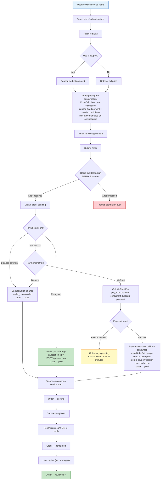
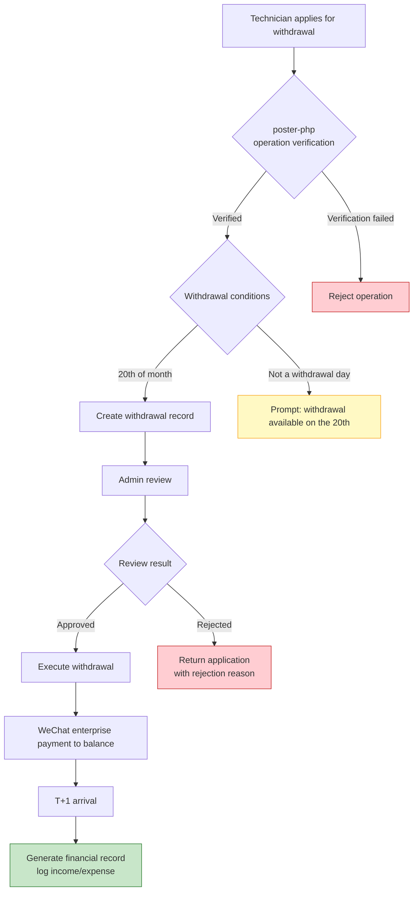
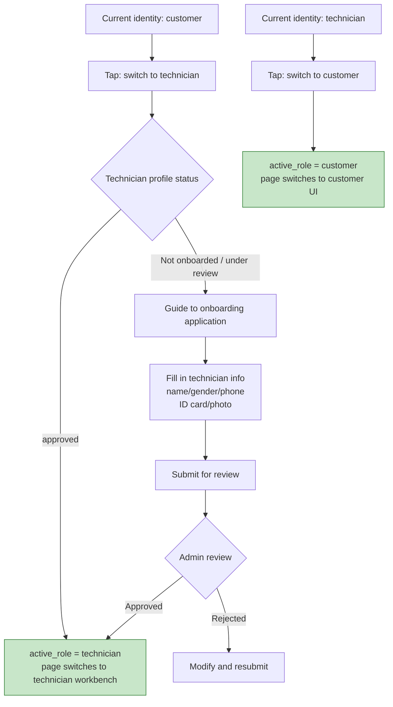
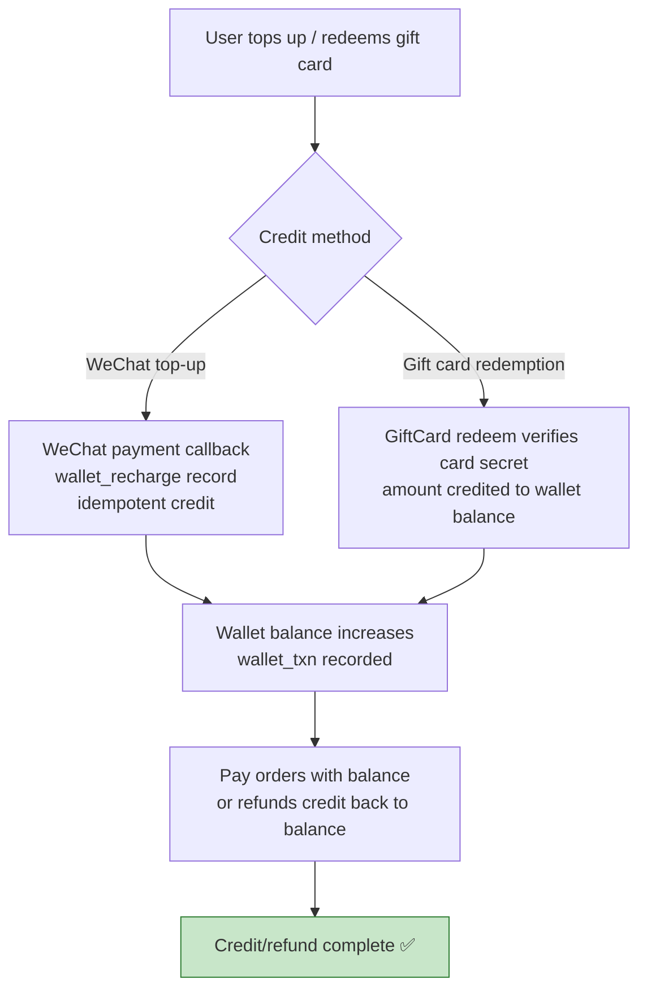

# Core Business Flowcharts
> **Languages**: [中文](../../diagrams/FLOWCHART.md) · [한국어](../../ko/diagrams/FLOWCHART.md) · [Русский](../../ru/diagrams/FLOWCHART.md) · [Deutsch](../../de/diagrams/FLOWCHART.md) · [Français](../../fr/diagrams/FLOWCHART.md) · [Español](../../es/diagrams/FLOWCHART.md) · [Português](../../pt/diagrams/FLOWCHART.md) · [हिन्दी](../../hi/diagrams/FLOWCHART.md) · [العربية](../../ar/diagrams/FLOWCHART.md) · [বাংলা](../../bn/diagrams/FLOWCHART.md) · [Bahasa Indonesia](../../id/diagrams/FLOWCHART.md) · [日本語](../../ja/diagrams/FLOWCHART.md)

## 1. Service Appointment Flow

## 2. Payment and Refund Flow

```mermaid
flowchart TD
    subgraph 支付流程["Forward payment flow"]
        P1["Create payment record"] --> P2["WeChat unified order<br/>pay_lock prevents concurrency<br/>out_trade_no = order_no idempotent"]
        P2 --> P3["Frontend initiates payment<br/>select payment method"]
        P3 -->|"Balance"| PB["Deduct wallet balance<br/>wallet_txn recorded<br/>idempotent, deducted only once"]
        P3 -->|"WeChat"| P4["WeChat callback notify"]
        P4 --> P5["Signature verified"]
        PB --> P6["markOrderPaid idempotent<br/>coupon/session card consumed only here"]
        P5 --> P6
        P6 --> P7["Order → paid<br/>notify user + technician"]
    end

    subgraph 退款流程["Refund flow"]
        R1["User applies for refund<br/>refund_lock prevents concurrency"] --> R2{"Refund rule check"}
        R2 -->|"Ordered ≤15min or >6h before start"| R3["Refund 100%"]
        R2 -->|"≤6h before start"| R4["Refund 90%"]
        R2 -->|"Started but not confirmed"| R5["Refund 80%"]
        R2 -->|"After service confirmed"| R6["No refund"]
        R3 --> R7["Order → refunding"]
        R4 --> R7
        R5 --> R7
        R7 --> R8["Two-level approval<br/>store manager → finance"]
        R8 --> R9["Two-stage refund<br/>refund record inside transaction<br/>WeChat refund IO outside transaction"]
        R9 -->|"WeChat failed"| R10["Roll back order to PAID<br/>refund retryable"]
        R9 -->|"Refund success"| R11["Order → refunded<br/>WeChat original route / balance credit<br/>coupon returned + points clawed back"]
    end

    style P6 fill:#c8e6c9,stroke:#2e7d32,color:#333
    style R6 fill:#ffcdd2,stroke:#c62828,color:#333
    style R11 fill:#c8e6c9,stroke:#2e7d32,color:#333
    style R10 fill:#fff9c4,stroke:#f9a825,color:#333
```

## 3. Technician Withdrawal Flow

## 4. Identity Switching Flow

## 5. Wallet Top-Up / Gift Card Credit Flow

