# Lifecycle Diagrams
> **Languages**: [中文](../../diagrams/LIFECYCLE-DIAGRAM.md) · [한국어](../../ko/diagrams/LIFECYCLE-DIAGRAM.md) · [Русский](../../ru/diagrams/LIFECYCLE-DIAGRAM.md) · [Deutsch](../../de/diagrams/LIFECYCLE-DIAGRAM.md) · [Français](../../fr/diagrams/LIFECYCLE-DIAGRAM.md) · [Español](../../es/diagrams/LIFECYCLE-DIAGRAM.md) · [Português](../../pt/diagrams/LIFECYCLE-DIAGRAM.md) · [हिन्दी](../../hi/diagrams/LIFECYCLE-DIAGRAM.md) · [العربية](../../ar/diagrams/LIFECYCLE-DIAGRAM.md) · [বাংলা](../../bn/diagrams/LIFECYCLE-DIAGRAM.md) · [Bahasa Indonesia](../../id/diagrams/LIFECYCLE-DIAGRAM.md) · [日本語](../../ja/diagrams/LIFECYCLE-DIAGRAM.md)

## 1. Order Lifecycle (State Machine)

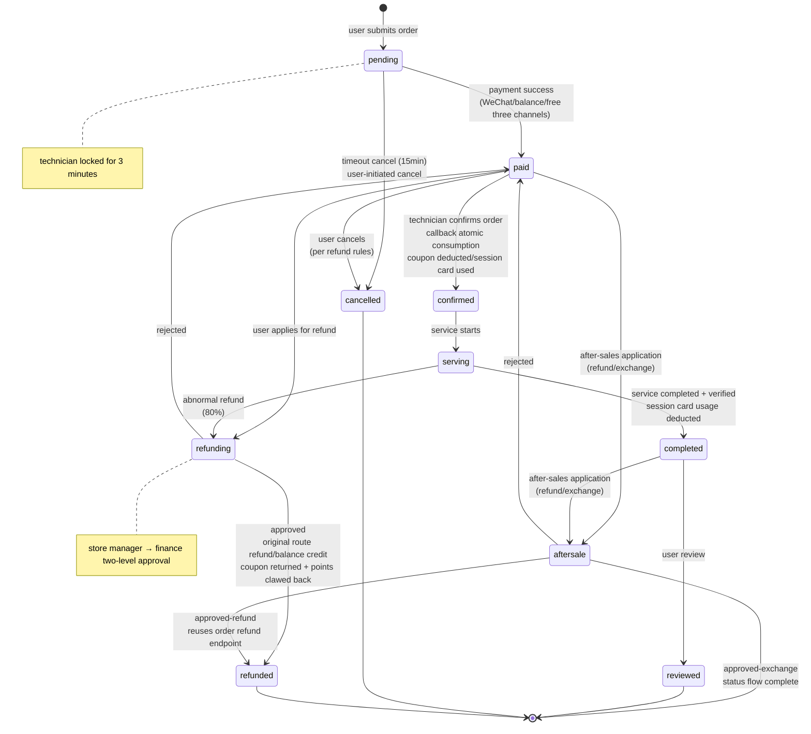
```mermaid
stateDiagram-v2
    [*] --> pending: user submits order

    pending --> paid: payment success<br/>(WeChat/balance/free three channels)

    pending --> cancelled: timeout cancel (15min)<br/>user-initiated cancel

    paid --> confirmed: technician confirms order<br/>callback atomic consumption<br/>coupon deducted/session card used
    paid --> cancelled: user cancels<br/>(per refund rules)
    paid --> refunding: user applies for refund
    paid --> aftersale: after-sales application<br/>(refund/exchange)

    confirmed --> serving: service starts

    serving --> completed: service completed + verified<br/>session card usage deducted

    serving --> refunding: abnormal refund<br/>(80%)

    completed --> reviewed: user review
    completed --> aftersale: after-sales application<br/>(refund/exchange)

    refunding --> refunded: approved<br/>original route refund/balance credit<br/>coupon returned + points clawed back
    refunding --> paid: rejected

    aftersale --> refunded: approved-refund<br/>reuses order refund endpoint
    aftersale --> paid: rejected
    aftersale --> [*]: approved-exchange<br/>status flow complete

    reviewed --> [*]
    cancelled --> [*]
    refunded --> [*]

    note right of pending: technician locked for 3 minutes
    note right of refunding: store manager → finance two-level approval
```

## 2. Member Card Lifecycle

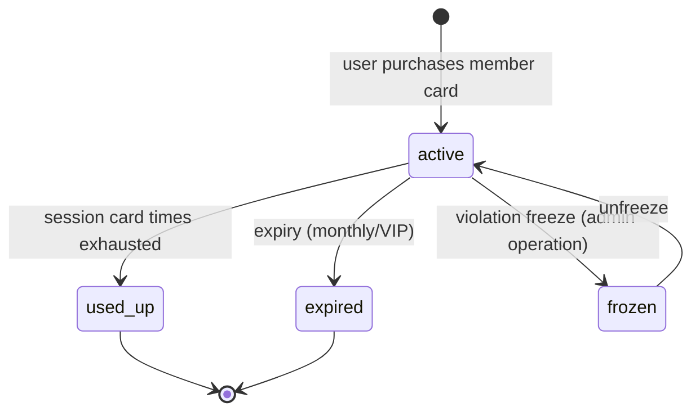
```mermaid
stateDiagram-v2
    [*] --> active: user purchases member card

    active --> used_up: session card times exhausted

    active --> expired: expiry (monthly/VIP)

    active --> frozen: violation freeze (admin operation)

    frozen --> active: unfreeze

    used_up --> [*]
    expired --> [*]
```

## 3. Technician Onboarding Lifecycle

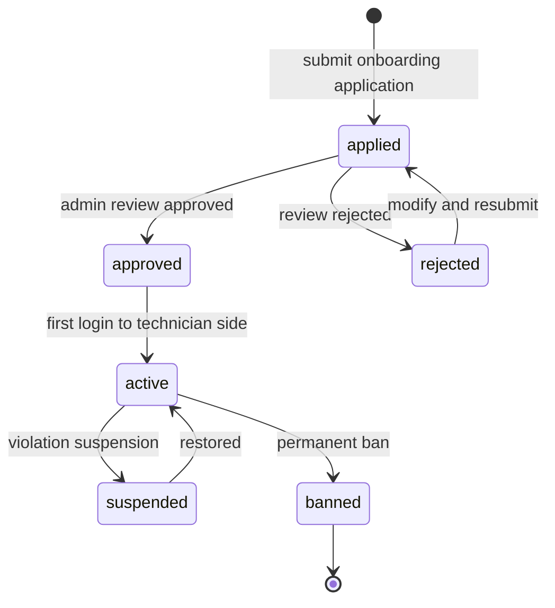
```mermaid
stateDiagram-v2
    [*] --> applied: submit onboarding application

    applied --> approved: admin review approved
    applied --> rejected: review rejected

    rejected --> applied: modify and resubmit

    approved --> active: first login to technician side

    active --> suspended: violation suspension
    suspended --> active: restored
    active --> banned: permanent ban

    banned --> [*]
```

## 4. Coupon Lifecycle

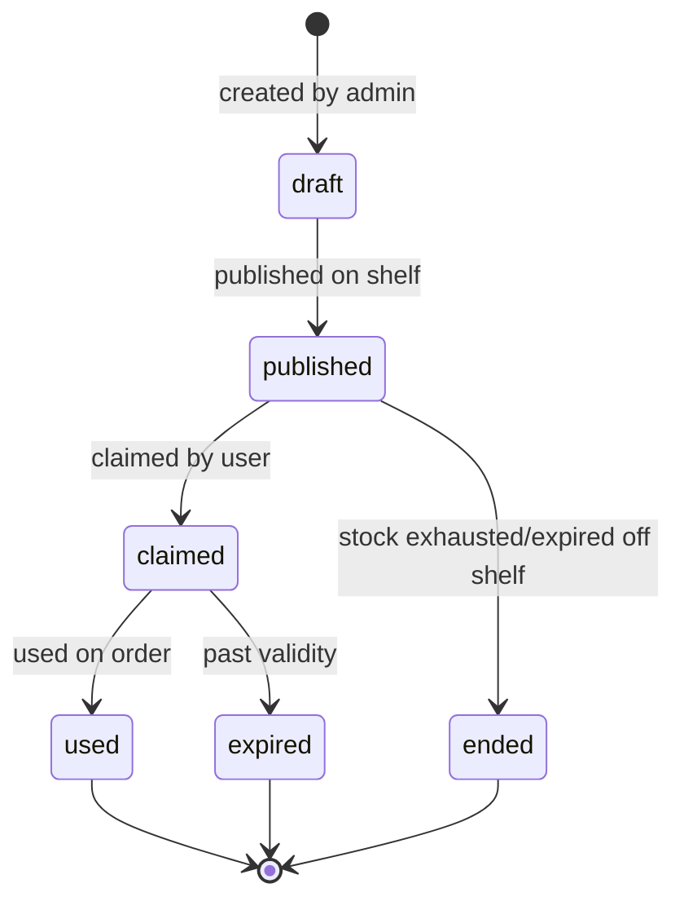
```mermaid
stateDiagram-v2
    [*] --> draft: created by admin

    draft --> published: published on shelf

    published --> claimed: claimed by user

    claimed --> used: used on order
    claimed --> expired: past validity

    published --> ended: stock exhausted/expired off shelf

    used --> [*]
    expired --> [*]
    ended --> [*]
```

## 5. Technician Withdrawal Lifecycle

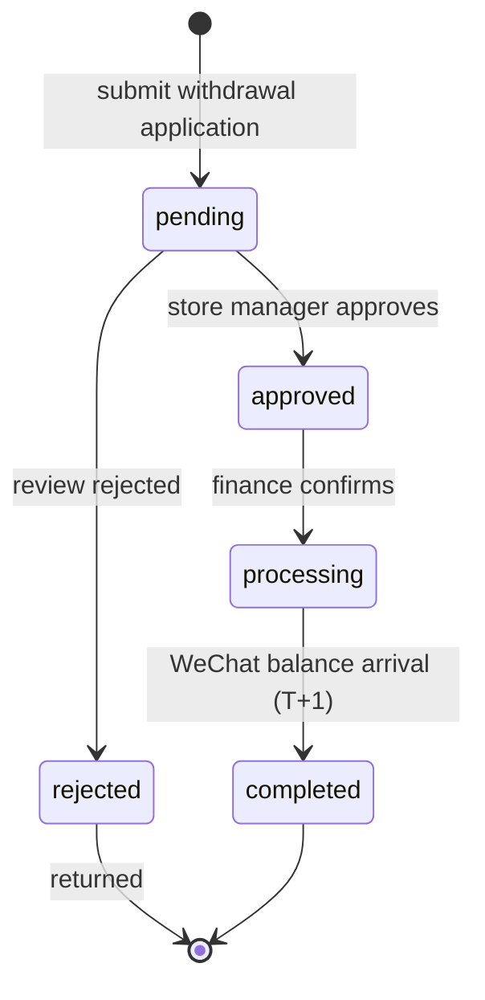
```mermaid
stateDiagram-v2
    [*] --> pending: submit withdrawal application

    pending --> approved: store manager approves
    pending --> rejected: review rejected

    rejected --> [*]: returned

    approved --> processing: finance confirms

    processing --> completed: WeChat balance arrival (T+1)

    completed --> [*]
```

## 6. Token Authentication Lifecycle

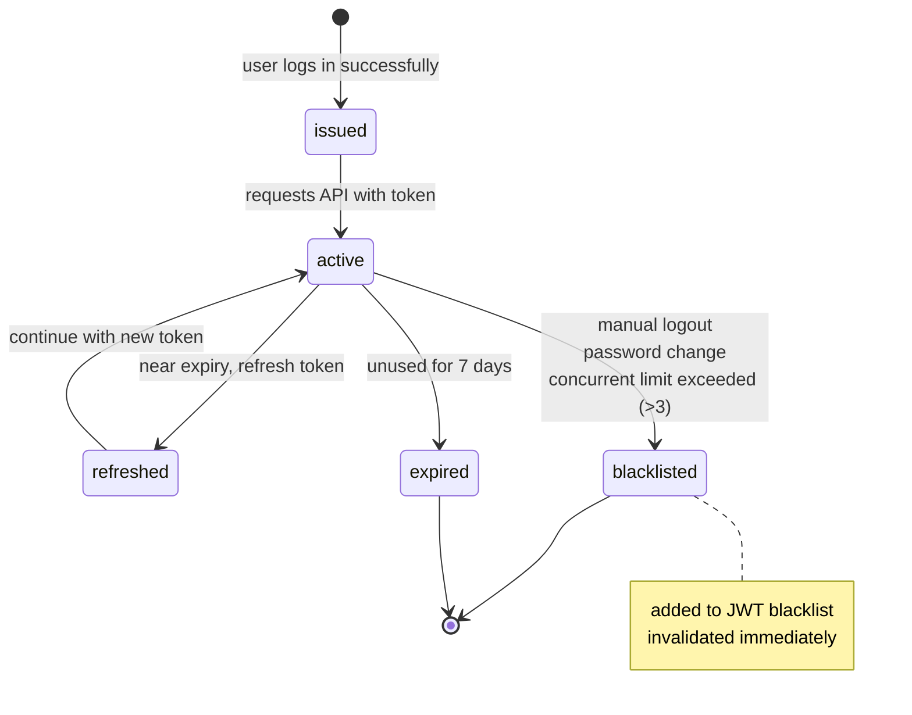
```mermaid
stateDiagram-v2
    [*] --> issued: user logs in successfully

    issued --> active: requests API with token

    active --> refreshed: near expiry, refresh token

    refreshed --> active: continue with new token

    active --> blacklisted: manual logout<br/>password change<br/>concurrent limit exceeded (>3)

    active --> expired: unused for 7 days

    blacklisted --> [*]
    expired --> [*]

    note right of blacklisted: added to JWT blacklist<br/>invalidated immediately
```

## 7. Group-Buy Activity Lifecycle

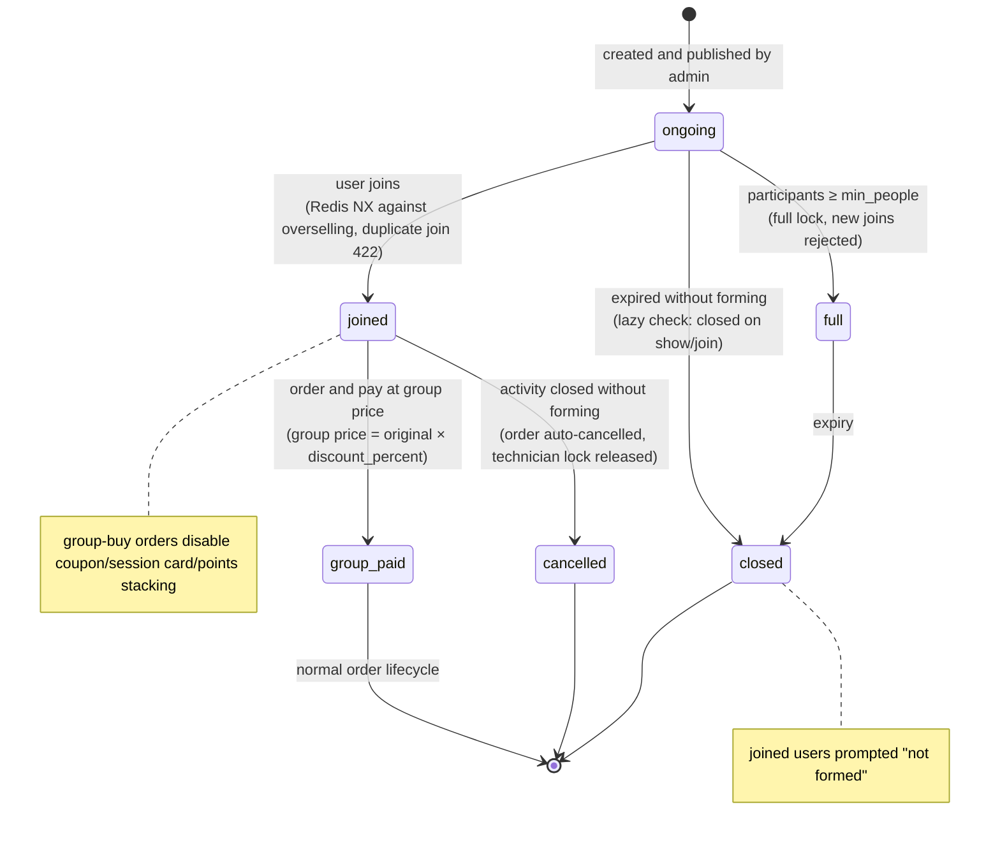
```mermaid
stateDiagram-v2
    [*] --> ongoing: created and published by admin

    ongoing --> full: participants ≥ min_people<br/>(full lock, new joins rejected)

    ongoing --> closed: expired without forming<br/>(lazy check: closed on show/join)

    full --> closed: expiry

    ongoing --> joined: user joins<br/>(Redis NX against overselling, duplicate join 422)

    joined --> group_paid: order and pay at group price<br/>(group price = original × discount_percent)

    joined --> cancelled: activity closed without forming<br/>(order auto-cancelled, technician lock released)

    group_paid --> [*]: normal order lifecycle
    cancelled --> [*]
    closed --> [*]

    note right of joined: group-buy orders disable coupon/session card/points stacking
    note right of closed: joined users prompted "not formed"
```

## 8. Coupon Transfer Lifecycle

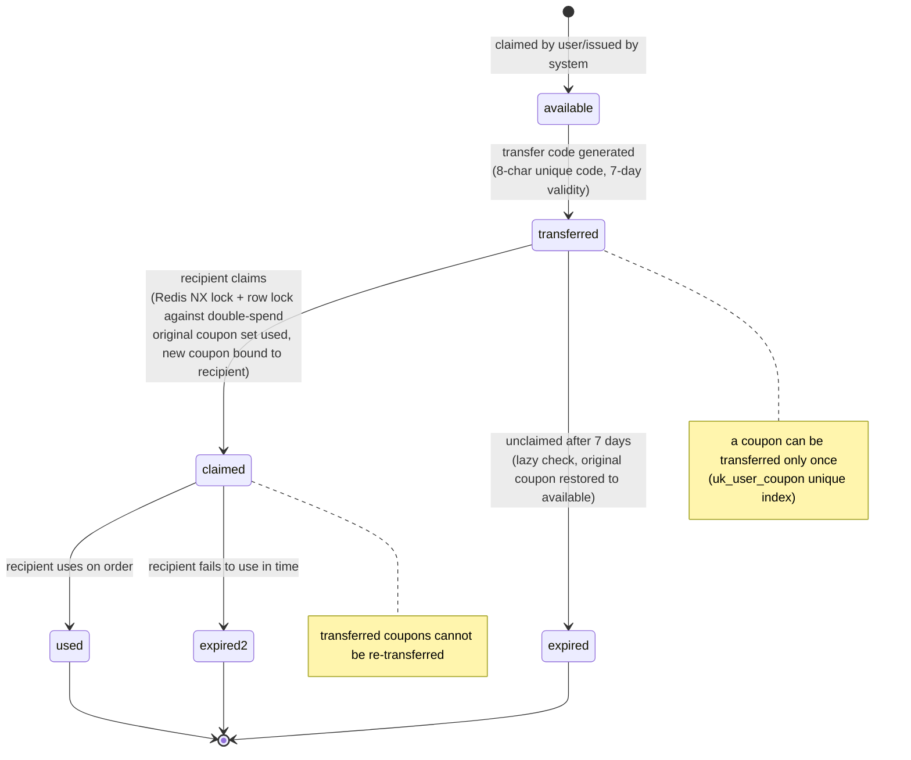
```mermaid
stateDiagram-v2
    [*] --> available: claimed by user/issued by system

    available --> transferred: transfer code generated<br/>(8-char unique code, 7-day validity)

    transferred --> claimed: recipient claims<br/>(Redis NX lock + row lock against double-spend<br/>original coupon set used, new coupon bound to recipient)

    transferred --> expired: unclaimed after 7 days<br/>(lazy check, original coupon restored to available)

    claimed --> used: recipient uses on order
    claimed --> expired2: recipient fails to use in time

    used --> [*]
    expired --> [*]
    expired2 --> [*]

    note right of transferred: a coupon can be transferred only once<br/>(uk_user_coupon unique index)
    note right of claimed: transferred coupons cannot be re-transferred
```

## 9. Points Expiry Lifecycle

```mermaid
stateDiagram-v2
    [*] --> earned: check-in/purchase rebate/refund credit<br/>(expires_at = now + 365 days)

    earned --> used: cash-off/exchange consumption

    earned --> expired: unused by expiry<br/>(PointsExpiryTimer scans every 60s<br/>writes type=expire negative deduction rows)

    expired --> [*]: in-app notification "points expired"
    used --> [*]

    note right of expired: three-layer idempotency: original-row row-lock re-check<br/>+ id cursor pagination + notification only on deduction rounds
```

## 10. Transfer Lifecycle (Round 19: balance transfer + points transfer)

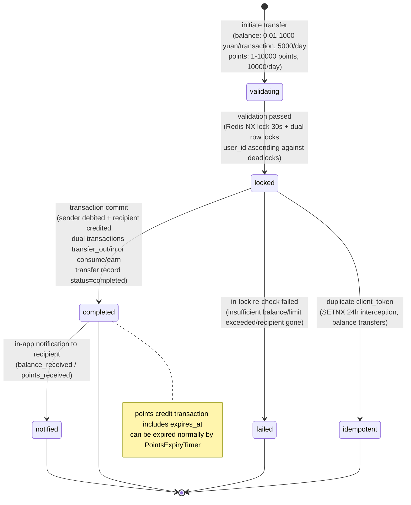
```mermaid
stateDiagram-v2
    [*] --> validating: initiate transfer<br/>(balance: 0.01-1000 yuan/transaction, 5000/day<br/>points: 1-10000 points, 10000/day)

    validating --> locked: validation passed<br/>(Redis NX lock 30s + dual row locks<br/>user_id ascending against deadlocks)

    locked --> completed: transaction commit<br/>(sender debited + recipient credited<br/>dual transactions transfer_out/in or consume/earn<br/>transfer record status=completed)

    locked --> failed: in-lock re-check failed<br/>(insufficient balance/limit exceeded/recipient gone)
    locked --> idempotent: duplicate client_token<br/>(SETNX 24h interception, balance transfers)

    completed --> notified: in-app notification to recipient<br/>(balance_received / points_received)
    completed --> [*]
    failed --> [*]
    idempotent --> [*]
    notified --> [*]

    note right of completed: points credit transaction includes expires_at<br/>can be expired normally by PointsExpiryTimer
```

## 11. Customer Service Ticket Lifecycle (Round 20)

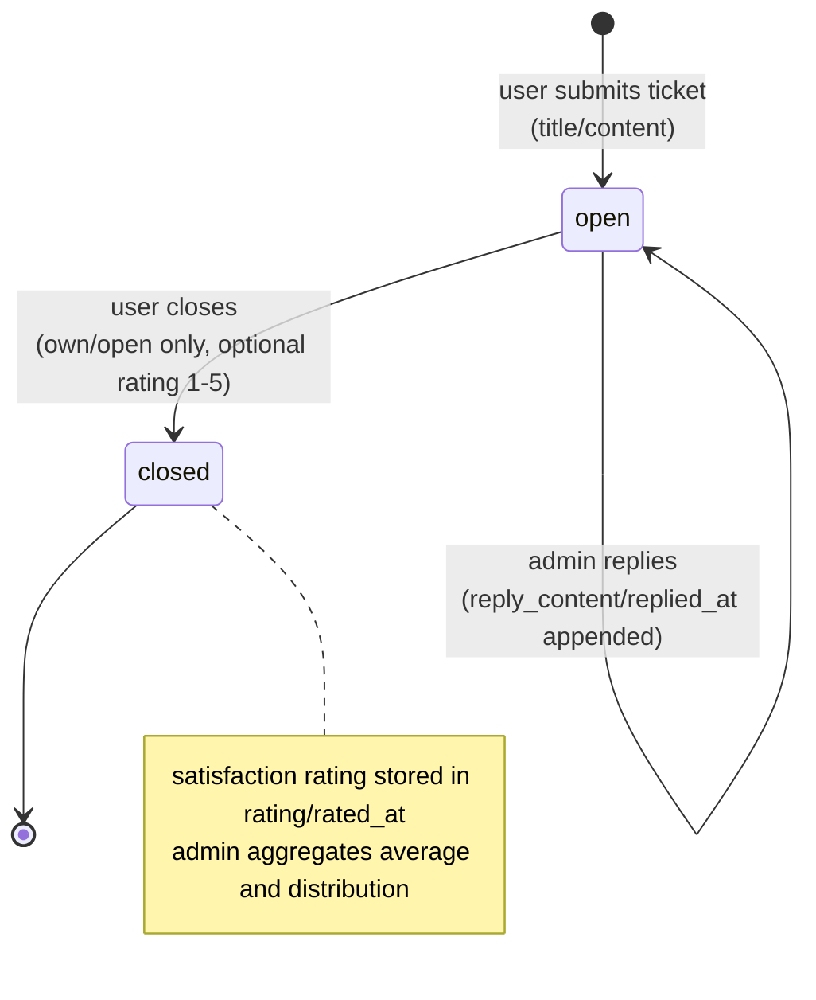
```mermaid
stateDiagram-v2
    [*] --> open: user submits ticket<br/>(title/content)

    open --> open: admin replies<br/>(reply_content/replied_at appended)

    open --> closed: user closes<br/>(own/open only, optional rating 1-5)

    closed --> [*]

    note right of closed: satisfaction rating stored in rating/rated_at<br/>admin aggregates average and distribution
```

## 12. E-Invoice Lifecycle (Round 20)

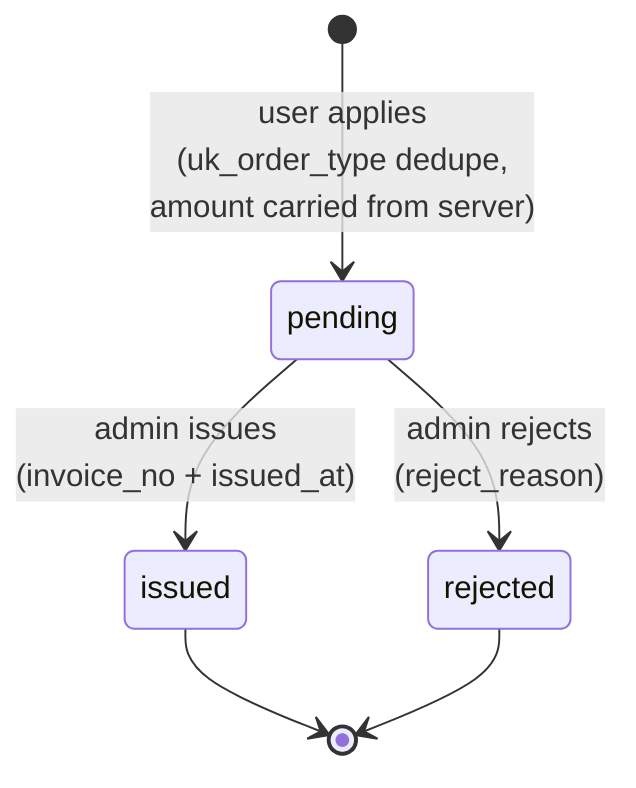
```mermaid
stateDiagram-v2
    [*] --> pending: user applies<br/>(uk_order_type dedupe,<br/>amount carried from server)

    pending --> issued: admin issues<br/>(invoice_no + issued_at)

    pending --> rejected: admin rejects<br/>(reject_reason)

    issued --> [*]
    rejected --> [*]
```

## 13. Full-Reduction Activity Lifecycle (Round 22)

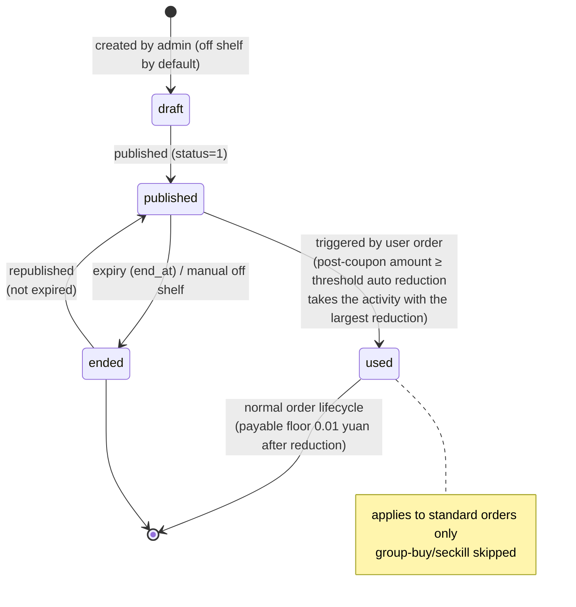
```mermaid
stateDiagram-v2
    [*] --> draft: created by admin (off shelf by default)

    draft --> published: published (status=1)

    published --> ended: expiry (end_at) / manual off shelf

    published --> used: triggered by user order<br/>(post-coupon amount ≥ threshold auto reduction<br/>takes the activity with the largest reduction)

    used --> [*]: normal order lifecycle<br/>(payable floor 0.01 yuan after reduction)

    ended --> published: republished<br/>(not expired)
    ended --> [*]

    note right of used: applies to standard orders only<br/>group-buy/seckill skipped
```

## 15. Wheel Draw Lifecycle (Round 23)

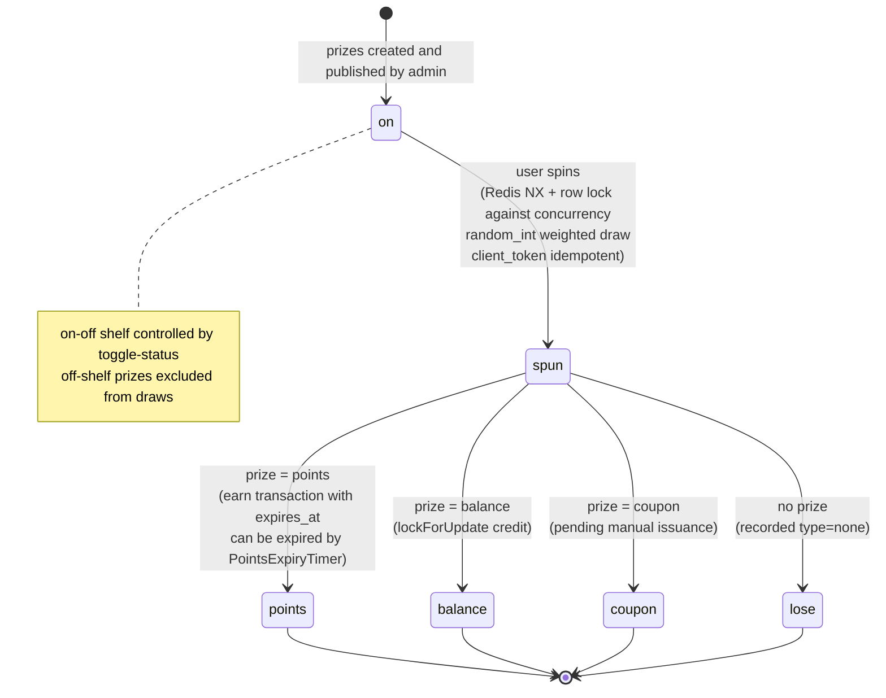
```mermaid
stateDiagram-v2
    [*] --> on: prizes created and published by admin

    on --> spun: user spins<br/>(Redis NX + row lock against concurrency<br/>random_int weighted draw<br/>client_token idempotent)

    spun --> points: prize = points<br/>(earn transaction with expires_at<br/>can be expired by PointsExpiryTimer)

    spun --> balance: prize = balance<br/>(lockForUpdate credit)

    spun --> coupon: prize = coupon<br/>(pending manual issuance)

    spun --> lose: no prize<br/>(recorded type=none)

    points --> [*]
    balance --> [*]
    coupon --> [*]
    lose --> [*]

    note right of on: on-off shelf controlled by toggle-status<br/>off-shelf prizes excluded from draws
```

## 14. Account Closure Lifecycle (Round 22)

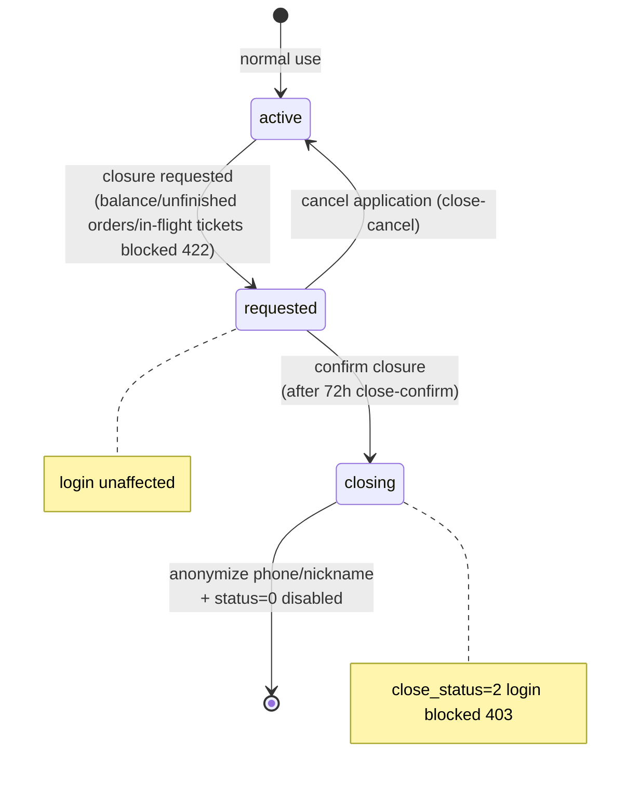
```mermaid
stateDiagram-v2
    [*] --> active: normal use

    active --> requested: closure requested<br/>(balance/unfinished orders/in-flight tickets blocked 422)

    requested --> active: cancel application (close-cancel)

    requested --> closing: confirm closure<br/>(after 72h close-confirm)

    closing --> [*]: anonymize phone/nickname<br/>+ status=0 disabled

    note right of requested: login unaffected
    note right of closing: close_status=2 login blocked 403
```

## 16. Seckill Activity Lifecycle (Round 24)

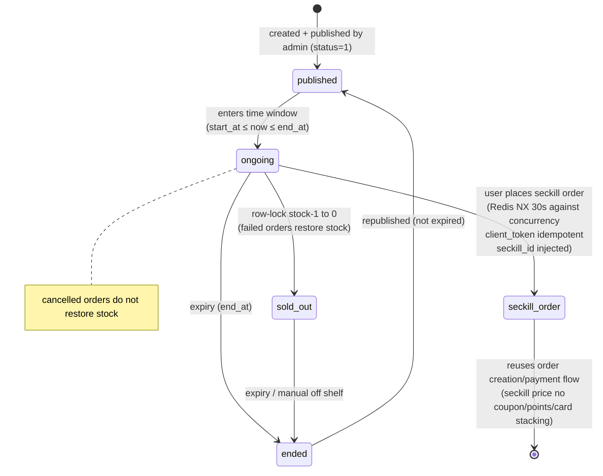
```mermaid
stateDiagram-v2
    [*] --> published: created + published by admin (status=1)

    published --> ongoing: enters time window<br/>(start_at ≤ now ≤ end_at)

    ongoing --> sold_out: row-lock stock-1 to 0<br/>(failed orders restore stock)

    ongoing --> ended: expiry (end_at)

    sold_out --> ended: expiry / manual off shelf

    ended --> published: republished (not expired)

    ongoing --> seckill_order: user places seckill order<br/>(Redis NX 30s against concurrency<br/>client_token idempotent<br/>seckill_id injected)

    seckill_order --> [*]: reuses order creation/payment flow<br/>(seckill price no coupon/points/card stacking)

    note right of ongoing: cancelled orders do not restore stock
```

## 17. Return-Customer Reward Lifecycle (Round 24)

```mermaid
stateDiagram-v2
    [*] --> completed: order completed<br/>(WorkController::complete row-lock transaction)

    completed --> checked: second purchase with same technician within 30 days

    checked --> none: first purchase / toggle off<br/>(enabled=0)

    checked --> pending: second purchase<br/>(bonus = paid × ratio<br/>same order_id+type idempotent)

    pending --> settled: settled via commission chain<br/>(appointment_technician_earnings<br/>type=return_customer)

    settled --> [*]
    none --> [*]

    note right of pending: status=pending<br/>auto-included in technician earnings summary
```
