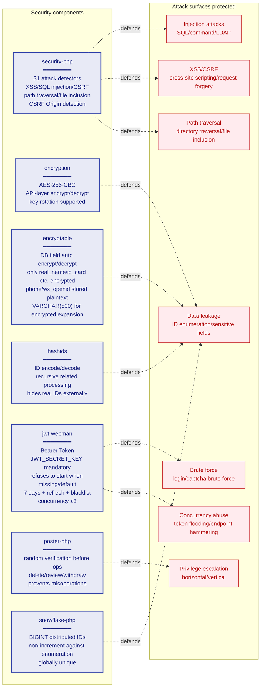
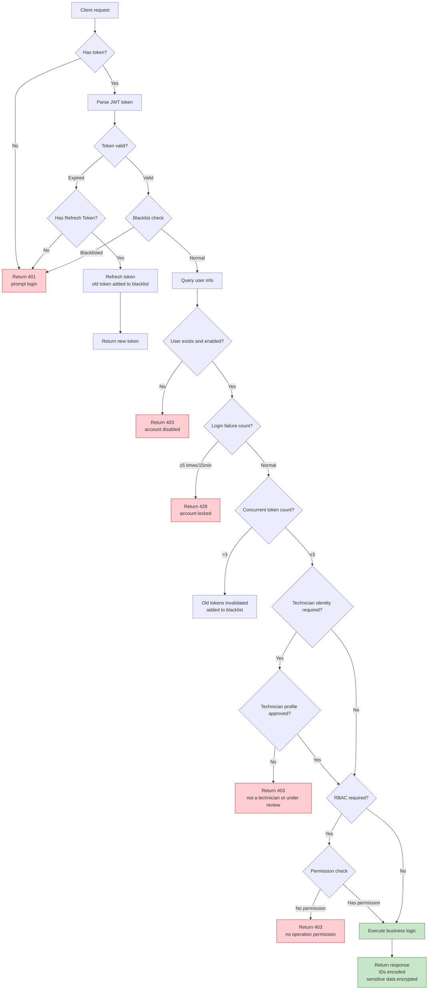
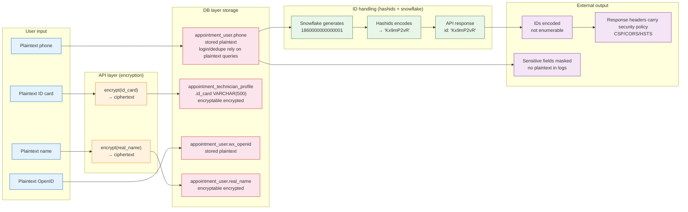

# Security Architecture Diagram
> **Languages**: [中文](../../diagrams/SECURITY-ARCHITECTURE.md) · [한국어](../../ko/diagrams/SECURITY-ARCHITECTURE.md) · [Русский](../../ru/diagrams/SECURITY-ARCHITECTURE.md) · [Deutsch](../../de/diagrams/SECURITY-ARCHITECTURE.md) · [Français](../../fr/diagrams/SECURITY-ARCHITECTURE.md) · [Español](../../es/diagrams/SECURITY-ARCHITECTURE.md) · [Português](../../pt/diagrams/SECURITY-ARCHITECTURE.md) · [हिन्दी](../../hi/diagrams/SECURITY-ARCHITECTURE.md) · [العربية](../../ar/diagrams/SECURITY-ARCHITECTURE.md) · [বাংলা](../../bn/diagrams/SECURITY-ARCHITECTURE.md) · [Bahasa Indonesia](../../id/diagrams/SECURITY-ARCHITECTURE.md) · [日本語](../../ja/diagrams/SECURITY-ARCHITECTURE.md)

## 1. Defense in Depth

```mermaid
graph TB
    subgraph 边界防护["Layer 1: Perimeter Defense"]
        WAF["WAF / Nginx<br/>security response headers<br/>sensitive file protection<br/>TLS 1.3"]
    end

    subgraph 接入防护["Layer 2: Access Control"]
        CORS["Cors middleware<br/>CORS_ALLOW_ORIGIN whitelist<br/>* echoed · same-origin only when unconfigured<br/>6 security response headers<br/>OPTIONS preflight"]
    end

    subgraph 攻击检测["Layer 3: Attack Detection"]
        SEC["Security middleware<br/>erikwang2013/security-php<br/>31 attack detectors<br/>XSS / SQL injection / CSRF<br/>path traversal / file inclusion<br/>CSRF Origin detection (block)"]
        BLOCK["Auto ban<br/>5 attacks/60s<br/>→ IP blacklist 15min"]
    end

    subgraph 流量控制["Layer 4: Traffic Control"]
        RL["RateLimit middleware<br/>Redis sliding window + atomic Lua<br/>default: 60/min/IP<br/>login: 10/min<br/>register: 5/min<br/>captcha: 1/60s/phone"]
    end

    subgraph 身份认证["Layer 5: Identity & Authentication"]
        AUTH["Auth middleware<br/>JWT Bearer Token (7 days)<br/>JWT_SECRET_KEY mandatory<br/>refuses to start when missing/public default<br/>bcrypt password hashing<br/>token refresh + blacklist<br/>login lockout: 5 failures → 15min<br/>concurrency limit: max 3 tokens"]
        TECH_AUTH["TechnicianAuth<br/>technician profile validation<br/>approved status check"]
        ADMIN_AUTH["AdminAuth<br/>admin JWT auth<br/>token blacklist"]
    end

    subgraph 权限控制["Layer 6: Permission Control"]
        RBAC["AdminPermission<br/>RBAC role permission check<br/>Redis 60s cache<br/>user → role → permission"]
        POSTER["Poster verification<br/>erikwang2013/poster-php<br/>delete/review/withdraw<br/>random verification for sensitive ops"]
    end

    subgraph 数据安全["Layer 7: Data Security"]
        ENC_API["API-layer encryption<br/>erikwang2013/encryption<br/>sensitive field encrypt/decrypt"]
        ENC_DB["DB-layer encryption<br/>erikwang2013/encryptable<br/>model trait auto encrypt/decrypt<br/>only real_name/id_card etc. encrypted<br/>phone/wx_openid stored plaintext<br/>(login/dedupe depend on plaintext queries)"]
        HASHID["ID encrypt/decrypt<br/>erikwang2013/hashids<br/>hides real IDs externally<br/>recursive encode/decode"]
        SLOG["Security logging<br/>M3 exceptions uniformly masked<br/>generic message + Log::error<br/>no sensitive data in logs<br/>OperationLog 8-platform sources"]
    end

    subgraph 管理端防护["Layer 8: Admin-Side Protection"]
        EXCEL["Export protection<br/>safeCellValue()<br/>= + - @ / Tab/CR prefixes<br/>escaped with ' against formula injection"]
        UPLOAD["Upload validation<br/>finfo magic bytes<br/>MIME vs extension mismatch<br/>→ 422 rejected"]
        INSTALL["Install lock<br/>already installed (installed=1<br/>or admin exists)<br/>→ 404 disables install wizard"]
    end

    请求["HTTP Request"] --> WAF
    WAF --> CORS
    CORS --> SEC
    SEC -->|"passed"| RL
    SEC -->|"attack detected"| BLOCK
    BLOCK -.->|"rejected"| 拒绝["HTTP 403/429<br/>attack logged"]
    RL -->|"passed"| AUTH
    RL -->|"limit exceeded"| 限流拒绝["HTTP 429<br/>Retry-After"]
    AUTH --> TECH_AUTH
    AUTH --> ADMIN_AUTH
    TECH_AUTH --> RBAC
    ADMIN_AUTH --> RBAC
    RBAC --> POSTER
    POSTER --> ENC_API
    ENC_API --> ENC_DB
    ENC_DB --> HASHID
    HASHID --> SLOG
    SLOG --> EXCEL
    EXCEL --> UPLOAD
    UPLOAD --> INSTALL
    INSTALL --> 响应["HTTP Response<br/>data encrypted + encoded"]

    classDef layer1 fill:#e3f2fd,stroke:#1565c0,stroke-width:2px,color:#01579b
    classDef layer2 fill:#bbdefb,stroke:#1976d2,stroke-width:2px,color:#01579b
    classDef layer3 fill:#ffcdd2,stroke:#c62828,stroke-width:2px,color:#b71c1c
    classDef layer4 fill:#fff9c4,stroke:#f9a825,stroke-width:2px,color:#f57f17
    classDef layer5 fill:#c8e6c9,stroke:#2e7d32,stroke-width:2px,color:#1b5e20
    classDef layer6 fill:#e1bee7,stroke:#7b1fa2,stroke-width:2px,color:#4a148c
    classDef layer7 fill:#d7ccc8,stroke:#5d4037,stroke-width:2px,color:#3e2723
    classDef layer8 fill:#cfd8dc,stroke:#37474f,stroke-width:2px,color:#263238
    classDef reject fill:#ff5252,stroke:#b71c1c,stroke-width:2px,color:#fff

    class WAF layer1
    class CORS layer2
    class SEC,BLOCK layer3
    class RL layer4
    class AUTH,TECH_AUTH,ADMIN_AUTH layer5
    class RBAC,POSTER layer6
    class ENC_API,ENC_DB,HASHID,SLOG layer7
    class EXCEL,UPLOAD,INSTALL layer8
    class 拒绝,限流拒绝 reject
```

## 2. Security Component Matrix

## 3. Authentication & Authorization Flow

## 4. Data Security Flow

