# Sistema de Reservas de Servicios
> **Languages**: [中文](../README.md) · [English](../en/README.md) · [한국어](../ko/README.md) · [Русский](../ru/README.md) · [Deutsch](../de/README.md) · [Français](../fr/README.md) · [Português](../pt/README.md) · [हिन्दी](../hi/README.md) · [العربية](../ar/README.md) · [বাংলা](../bn/README.md) · [Bahasa Indonesia](../id/README.md) · [日本語](../ja/README.md)

Plataforma de gestión de reservas de servicios en cuatro extremos: mini programa WeChat del usuario + APP Flutter + APP HarmonyOS (cambio de identidad con la misma cuenta) y panel de administración para PC.

> **Estado del proyecto**: todo completado ✅ | 143 controladores (service 69 / admin 74) | 87 modelos | 722 pruebas (service 558 / admin 164) | 95 tablas de datos | 388 rutas (service 227 / admin 161)

## Introducción del proyecto


**Sistema de Reservas de Servicios** es una plataforma de gestión de reservas en cuatro extremos orientada a la industria de servicios de estilo de vida: el extremo del usuario cubre **mini programa WeChat, APP Flutter, APP HarmonyOS** en tres extremos, con cambio libre entre extremos con la misma cuenta, junto con el **panel de administración para PC**, logrando el cierre digital de todo el proceso de «el usuario reserva → el técnico acepta el pedido → operación del panel». Tanto para reservas de tienda, servicios de técnicos, marketing de membresía o liquidación financiera, un solo sistema lo resuelve todo.

**Experiencia de reserva integral**

La experiencia del usuario es consistente en los tres extremos: elegir hora de reserva visualmente en el calendario, descuentos con cupones / tarjetas por uso / puntos, ofertas flash y compras grupales, pago con WeChat / saldo, y estado del pedido rastreable en todo momento — cambio de fecha, cancelación, reembolso, posventa y factura electrónica se completan en línea en todo el proceso; el extremo del técnico ofrece panel de trabajo, registro de entrada y salida, horarios por lotes, verificación de servicios y aprobación de retiros, con eficiencia operativa visible de un vistazo.

**Crecimiento de marketing en toda la cadena**

Incluye más de diez herramientas de marketing integradas: actividades de reducción de importe, ofertas flash, compras grupales, transferencia de cupones, tienda de puntos y ruleta de la suerte, tarjetas de membresía / beneficios por nivel de crecimiento, comisión de distribución en dos niveles, recompensas para clientes habituales, etc., junto con mensajes de suscripción push y push de APP, para ayudar a los comercios a captar, retener y fidelizar clientes continuamente.

**Seguridad y cumplimiento de nivel empresarial**

Con componentes de seguridad de desarrollo propio: autenticación JWT, ofuscación de ID, detección de 31 tipos de ataques, doble cifrado de datos sensibles, validación de precios en el servidor, comparación estricta y prevención de duplicados idempotente en las devoluciones de pago, además de soporte para el reparto oficial de WeChat, exportación de datos privados y cancelación de cuenta, cumpliendo con los requisitos de cumplimiento normativo.

**Base técnica madura**

Basado en PHP 8.3 + webman, un framework residente de alto rendimiento, con soporte de MySQL 8.0 + Redis + Elasticsearch; 95 tablas de datos, 388 interfaces, 285 puntos de permisos de grano fino, 722 pruebas automatizadas todas superadas, y documentación de arquitectura completa en chino e inglés con script de instalación de un solo clic — listo para usar y fácil de realizar desarrollo secundario.

Ya sea para reservas de una sola tienda o cadenas de múltiples tiendas, el Sistema de Reservas de Servicios puede ofrecerle una solución integrada estable, segura y escalable.

## Estructura del proyecto

```
appointment-php/
├── admin/                     # Panel de administración (webman v2 + Flutter Web, despliegue independiente :8787)
│   ├── app/                   #   admin (controladores del panel)/api/model/middleware/process/view
│   ├── apps/                  #   Flutter Web del panel / HarmonyOS / extremo de gestión WeChat
│   ├── config/                #   Configuración de rutas/base de datos/procesos/plugins
│   ├── database/              #   Scripts de respaldo (estructura de tablas y datos semilla unificados en docs/install.sql)
│   ├── tests/                 #   PHPUnit (estilo de atributos #[\Test])
│   └── start.php
├── service/                   # Servicio de API de negocio (webman v2, despliegue independiente :8787)
│   ├── app/                   #   Módulos api/user/technician/order/wallet/marketing/notification, etc.
│   ├── config/                #   Configuración de rutas/base de datos/procesos/pagos, etc.
│   ├── support/               #   Clase base Model (generateId)/Request/Response
│   ├── tests/                 #   PHPUnit
│   └── start.php
├── apps/                      # Aplicaciones frontend del extremo de usuario
│   ├── wechat/                #   Mini programa WeChat (nativo)
│   ├── flutter/               #   APP Flutter (iOS + Android)
│   └── harmonyos/             #   APP HarmonyOS (nativo HarmonyOS)
└── docs/                      # Documentación del proyecto
    ├── API.md / FEATURES.md / STRUCTURE.md / install.sql / README.md ...
    └── diagrams/              #   Diagramas de arquitectura/flujo (SVG + mermaid)
```

## Inicio rápido

### Requisitos del entorno

- PHP 8.3+
- MySQL 8.0+
- Redis
- Composer

### Asistente de instalación web (recomendado)

```bash
cd admin/
cp .env.example .env
composer install
php start.php start -d
```

Abra `http://localhost:8787/install` en el navegador y siga las indicaciones para completar la instalación con los datos de la base de datos y la cuenta de administrador.

### Instalación manual

```bash
# 1. Instalar dependencias
cd service/ && cp .env.example .env && composer install
cd ../admin/ && cp .env.example .env && composer install

# 2. Importar la base de datos con un solo clic (incluye las 95 tablas + semillas de permisos/configuración)
mysql -u root -p < docs/install.sql

# 3. Iniciar los servicios
cd service/ && php start.php start -d   # API de negocio → :8787
cd ../admin/ && php start.php start -d  # Panel de administración → :8787
```

### Despliegue con Docker

```bash
cd admin/ && cp .env.docker .env && docker-compose up -d
cd ../service/ && cp .env.docker .env && docker-compose up -d
```

## Stack tecnológico

| Capa | Tecnología | Descripción |
|------|------|------|
| Framework backend | webman v2 (PHP 8.3+) | Servicio HTTP residente en memoria de alto rendimiento |
| Base de datos | MySQL 8.0 | Prefijo de tablas `appointment_` |
| Caché | Redis | Caché / límite de tráfico / sesión / colas |
| Búsqueda | Elasticsearch | Búsqueda de texto completo (vía webman-scout) |
| Frontend del panel de administración | Flutter Web | Estilo de panel de administración para PC |
| APP del extremo de usuario | Flutter | iOS + Android |
| Mini programa del extremo de usuario | Mini programa WeChat nativo | WXML/WXSS/JS |
| APP HarmonyOS del extremo de usuario | HarmonyOS ArkTS | Nativo @ohos.net.http |
| Generación de ID | erikwang2013/snowflake-php | Claves primarias BIGINT no autoincrementales |
| Cifrado/descifrado de ID de API | erikwang2013/hashids | Oculta los ID reales al exterior |
| Autenticación JWT | erikwang2013/jwt-webman | Bearer Token |
| Cifrado de datos sensibles | erikwang2013/encryption + encryptable | Doble cifrado API + DB |
| Protección de seguridad | erikwang2013/security-php | Detección de 31 tipos de ataques |
| Verificación de operaciones | erikwang2013/poster-php | Verificación aleatoria de operaciones sensibles |
| Banderas de países | erikwang2013/season | Iconos de banderas |
| Sincronización ES | erikwang2013/webman-scout | Sincronización automática de modelos |

## Arquitectura del sistema



## Flujos principales

### Flujo de reserva de servicios



### Flujo de pago y reembolso



## Ciclo de vida del pedido



## Arquitectura de seguridad

### Sistema de defensa en profundidad de siete capas



> Más diagramas detallados: [Diagrama de flujo](diagrams/FLOWCHART.md) (incluye retiros de técnicos / cambio de identidad) | [Mapa mental de funciones](diagrams/FUNCTION-DIAGRAM.md) | [Todos los ciclos de vida](diagrams/LIFECYCLE-DIAGRAM.md) | [Arquitectura de seguridad completa](diagrams/SECURITY-ARCHITECTURE.md)

## Destacados de funciones principales (Rondas 6-24)

| Función | Descripción |
|------|------|
| Billetera de valor almacenado | Tablas user_wallet / wallet_recharge / wallet_txn; saldo + historial, recarga con WeChat Pay (devolución de llamada con prefijo R en el número de pedido), pago de pedido con saldo (pay_channel=balance), reembolsos de WeChat/saldo que recargan automáticamente el saldo |
| UI completa del panel de administración | Flutter Web 20 páginas: dashboard/usuarios/roles/configuración/logs/verificación/horarios/servicios/técnicos/pedidos/cupones/membresías/tarjetas por uso/anuncios/FAQ/retiros/evaluaciones/informes/centro personal |
| Mensajes de suscripción del mini programa | Push de suscripción en 3 escenarios de pedido (pago correcto / reembolso recibido / verificación correcta); idempotencia push_sent_at; degradación automática a notificación interna si la plantilla no está configurada |
| Retiro de técnicos | Revisión en el extremo de administración; aprobación en dos niveles para importes ≥500 (gerente de tienda → finanzas); máquina de estados pending→approved→completed (rejected/failed) |
| Cierre de verificación de tarjeta por uso | Mi tarjeta por uso calcula en tiempo real used_up/expired; verificación con Redis NX idempotente + bloqueo de fila para descontar usos, crea directamente pedido completed + OrderItem + OrderPayment(pay_type='card') |
| Panel de trabajo del técnico | Tareas de hoy / registros completados / iniciar·completar (bloqueo de fila + guardias de máquina de estados + idempotencia, notificación interna al completar); mini programa tech-work con tres pestañas |
| Descuento con cupones | PriceCalculator: applyCoupon solo calcula el importe de solo lectura / consume marca used al pagar / restoreCouponAndCard devuelve idempotentemente al reembolsar; umbral fixed/percent + min_amount |
| Tarjeta regalo | Al canjear, el tipo cash recarga en la billetera (bloqueo de fila contra doble ingreso, WalletTxn type='gift_card'); el tipo gift solo se marca |
| Sistema de puntos | Puntos por registro diario; puntos por consumo verificado floor(paid×1) (idempotente con order_id, instantánea de balance); recuperación proporcional al reembolsar; detalles paginados + filtro type/source |
| Gestión de membresías | Columna appointment_user.member_level (migración 000008); CRUD completo de tarjetas de membresía en el panel (permisos 365-369) |
| Cadena de pedidos del mini programa | Detalle del servicio → confirmar pedido (elegir cupón / umbral deshabilitado / importe estimado en el cliente) → POST /order → pago WeChat/saldo; 20 páginas en total en el mini programa |
| Cierre de compra grupal | join con participación repetida 422 + bloqueo cuando está lleno + cierre diferido al vencer; al formar grupo, el pedido store pasa promotion_id para comprar a precio de grupo (discount_percent), se prohíben cupones/tarjetas por uso/puntos superpuestos; si no se forma grupo, el pedido se cancela automáticamente y se libera el bloqueo del técnico (el antiguo canal de promoción FLASH_SALE se ha retirado; las ofertas flash usan un canal independiente) |
| Panel de trabajo del gerente de tienda | service /api/store-manager con 4 interfaces (overview/orders/technicians/revenue) con aislamiento forzado por store_id (403 sin tienda); vista general del panel de trabajo de tienda en admin + filtro por store_id en pedidos + página Flutter + permiso 372 |
| Comisión de distribución | Tras el primer pedido completed del recomendado, comisión de paid_amount × reward_rate (configuración del sistema, por defecto 0.05) al recomendador en la billetera (WalletTxn referral_reward); triple idempotencia con bloqueo de fila + verificación de vacío + re-verificación del primer pedido; detalle de earnings + visualización de registros en admin (permiso 379) |
| Tienda de canje de puntos | Dos tablas de productos de canje / registros de canje; interfaz de canje con Redis NX + bloqueo de fila contra sobrecanje + uk_user_goods limita una vez por usuario; tres resultados: coupon emite cupón / wallet ingresa saldo / gift_card entrega tarjeta con código; CRUD en admin + alta/baja + registros (permisos 373-378) |
| Reprogramación de reservas | POST /api/order/reschedule/{id} cambia de hora con el mismo técnico; solo pending/paid/confirmed y con ≥6 h antes del inicio del servicio original; order_lock + bloqueo del técnico en el nuevo horario con SETNX(180s) contra sobreventa concurrente + validación de conflicto de horarios B2; se registra en appointment_order_reschedule + mensaje de suscripción SCENE_RESCHEDULE |
| Transferencia de cupones | Código de transferencia único de 8 caracteres (respaldo uk_code, válido 7 días); claim con protección contra abuso: bloqueo Redis NX + re-verificación con bloqueo de fila contra doble gasto, uk_user_coupon limita una transferencia, los cupones transferidos no se pueden volver a transferir, no se puede reclamar uno mismo; recuperación diferida del cupón original al vencer |
| Caducidad de puntos | expires_at (por defecto 365 días, configuración points.expiry_days); PointsExpiryTimer escanea con cursor cada 60 s escribiendo deducciones negativas type=expire (triple idempotencia) + notificación interna agregada; los puntos caducados no pueden convertirse en efectivo ni canjearse |
| Evaluación automática de nivel de técnico | TierRatingService calcula en tiempo real el volumen de pedidos + puntuación media y la escribe de vuelta en el perfil, coincidiendo de mayor a menor según tier_config; solo sube de nivel, no baja (allowDowngrade para re-evaluación manual); los cambios se registran en appointment_technician_tier_log + notificación interna; visualización de registros en admin (permiso 380) |
| Cierre de pedidos flash | /api/seckill actividades + buy idempotente/anti-concurrencia, inyección de seckill_id al hacer el pedido reutilizando store(), stock reducido uniformemente con bloqueo de fila dentro de la transacción (precio flash = seckill_price según DB), agotado 422 «se ha agotado», la cancelación no repone el stock; el antiguo canal de promoción flash_sale se ha retirado |
| Recordatorio antes del inicio del servicio | ServiceReminderTimer escanea cada 60 s los pedidos confirmed/serving que comienzan en 1 h → mensaje de suscripción SCENE_REMINDER + notificación interna (order_id+type contra duplicados, triple idempotencia); degradación automática a notificación interna si la plantilla no está configurada |
| Recordatorio de caducidad | ExpiryReminderTimer escanea cada 6 h las tarjetas de membresía/cupones que caducan en 3 días → type=card_expiry/coupon_expiry + mensaje de suscripción SCENE_EXPIRY (order_id registra el origen contra duplicados) |
| Respuesta del técnico a las evaluaciones | POST /api/technician/review/reply/{order_id}: 404 si no es su propia evaluación, 422 por respuesta repetida, notificación interna al usuario al responder; appointment_order_review añade replied_at; detalle de respuesta en admin (permiso 381) |
| Notificación de llegada de recarga | La devolución de llamada de recarga de WeChat escribe dentro de la transacción la notificación interna type='wallet_recharge' (reutiliza la idempotencia de la devolución de llamada, confirmación atómica en la misma transacción, un fallo no bloquea el flujo principal) |
| Transferencia de saldo | POST /api/wallet/transfer transferencia entre usuarios: 0.01-1000 por operación + límite diario de 5000; bloqueo Redis NX + bloqueo de fila de ambas billeteras (user_id ascendente contra deadlocks) + idempotencia client_token de 24 h; doble historial WalletTxn transfer_out/transfer_in con instantánea balance_after; notificación interna al receptor type='balance_received' |
| Transferencia de puntos | POST /api/user/points/transfer transferencia entre usuarios: 1-10000 puntos + límite diario acumulado de 10000; bloqueo Redis NX + lockForUpdate del último historial de ambas partes (ascendente contra deadlocks) + re-verificación dentro del bloqueo; doble historial consume del emisor / earn del receptor (el receptor incluye expires_at y puede caducar normalmente); notificación interna al receptor type='points_received' |
| Evaluación complementaria | POST /api/order/review/{order_id}/append: 404 si no es su propia evaluación / 422 repetida / 422 contenido vacío / 422 no completed; al tener éxito escribe notificación interna al técnico type='review_append'; appointment_order_review añade append_content/append_images(JSON)/append_at; de paso se completa la ruta de envío de evaluaciones de usuarios registrados (la ruta original store no era alcanzable) y se corrige su TypeError latente |
| Seguimiento logístico del extremo de usuario | GET /api/order/logistics/{id}: solo pedidos de producto propios (404 si no es propio/no es producto/no enviado); lee el JSON de order.remark (shipping_company/tracking_no/shipped_at, escrito por admin al enviar); teléfono del receptor desidentificado 138\*\*\*\*5678 |
| Preferencias de notificaciones | Tabla appointment_user_notify_setting (clave única uk_user_type, fila ausente = activado por defecto); GET/PUT /api/user/notify-settings; 5 interruptores service_reminder/card_expiry/points_expiry/marketing/system (system siempre activo, no se puede desactivar); notifySettingEnabled controla 3 temporizadores + eventos de suscripción; al desactivar, se omiten tanto las notificaciones internas como los mensajes de suscripción |
| Calendario de reservas | GET /api/calendar/technician/{id} (vista mensual) + /day (vista diaria): time_slots JSON expande los intervalos horarios, se excluyen los horarios ya reservados de appointment_order; selección visual de horarios con horarios de tienda |
| Nivel de crecimiento del usuario | appointment_user_growth + appointment_growth_level (bronce 0 / plata 100 / oro 500 / platino 2000 / diamante 5000); registro diario +10, evaluación +20, 1 punto por cada yuan consumido (reutiliza la re-verificación de estado existente, idempotente de forma natural); GET /api/growth (vista general / registros / niveles públicos) |
| Factura electrónica | POST/GET /api/invoices (solicitud / lista / detalle): uk_order_type(order_id,order_type) contra solicitudes duplicadas, el importe lo aporta el servidor; emisión/rechazo en admin (permisos 382-384) |
| Tickets de atención al cliente | POST/GET /api/tickets + /{id}/close: envío/lista/detalle/cierre del usuario; respuesta en admin (permisos 385/387) |
| Distribución multinivel: comisión de nivel 2 | Tras el pago del pedido, al recomendador del recomendador de nivel 1 se le envía paid×level2_rate (configuración 0.02): bloqueo de fila transaccional + idempotencia uk_order_referred contra pagos duplicados; WalletTxn TYPE_REFERRAL_LEVEL2; visualización de registros en admin (permiso 386) |
| Beneficios de nivel de crecimiento | Beneficios de GrowthLevel.benefits implementados: descuento discount_rate según nivel al hacer el pedido (solo pedidos estándar, cupón/tarjeta por uso → el descuento de nivel se superpone, el importe del descuento va a discount_amount + nota trazable, protección de límite inferior truncando a 0); crecimiento en la devolución de pago con multiplicador floor(paid×points_multiplier) (se toma el nivel en el momento del pago, no sube de nivel) |
| Gestión de títulos de factura | Biblioteca de títulos habituales appointment_invoice_title: guardar/editar/eliminar/predeterminado (el primero se predetermina automáticamente, al eliminar el predeterminado se transfiere automáticamente, al establecer el predeterminado se limpia la transacción); al solicitar factura se puede pasar title_id, se mantiene la compatibilidad con relleno manual |
| Satisfacción de tickets | Al cerrar un ticket se puede puntuar 1-5 (422 fuera de rango, compatibilidad NULL si no se proporciona); resumen de satisfacción en admin: puntuación media / distribución de estrellas 1-5 / conteo de evaluados y no evaluados (permiso 388) |
| Revisión de imágenes de evaluaciones | ReviewAuditController de admin: lista de evaluaciones con imágenes (filtro JSON_LENGTH + join de nombre de usuario/técnico), ocultar/restaurar (hide solo visible, restore solo hidden, validación bidireccional 422); tras ocultar, la lista de evaluaciones del técnico deja de ser visible automáticamente (permisos 389-391) |
| Historial de navegación | appointment_browse_history (uk_user_item: navegación repetida solo actualiza viewed_at): registro conectado en el detalle del servicio (try/catch sin bloquear el flujo principal, salto si no se ha iniciado sesión); la lista une la información del servicio + hashid; eliminar uno/vaciar solo para el propio usuario |

> Ronda 8, correcciones operativas: eliminados 12 Poster::verify fatales latentes; las estadísticas de DashboardController usan ahora consultas con Capsule Manager.
>
> Complemento Ronda-15: recuperación de puntos (la cancelación/reembolso devuelve los puntos points_offset, 5 puntos de enganche idempotentes de refundOffsetPoints); PromotionParticipant cambia a constantes enteras (repara el daño de join 1366 en modo estricto).
>
> Complemento Ronda-16: canje de puntos (PointsExchangeController, tipo consume/source=exchange); pedido de compra grupal (appointment_order añade columnas promotion_id/participant_id); comisión de distribución (ReferralRewardService enganchado a WorkController::complete).
>
> Complemento Ronda-17: reprogramación de reservas (appointment_order_reschedule + interfaz reschedule); transferencia de cupones (appointment_user_coupon_transfer + transfer/claim/transfers); caducidad de puntos (expires_at + proceso PointsExpiryTimer); evaluación automática de nivel de técnico (TierRatingService + appointment_technician_tier_log, permiso 380).
>
> Corrección Ronda-17: la inserción de notificaciones de AutoCancelTimer usa ahora \support\Model::generateId() (antes llamaba a un inexistente Snowflake::generate(), la notificación de cancelación automática fallaba silenciosamente).
>
> Complemento Ronda-18: pedido flash (store() soporta el precio flash flash_sale); recordatorio antes del inicio del servicio (ServiceReminderTimer + SCENE_REMINDER); recordatorio de caducidad de tarjetas de membresía/cupones (ExpiryReminderTimer + SCENE_EXPIRY); respuesta del técnico a evaluaciones (interfaz review reply + columna replied_at + permiso 381); notificación de llegada de recarga (type='wallet_recharge' dentro de la transacción de devolución de llamada).
>
> Complemento Ronda-19: transferencia de saldo (appointment_wallet_transfer + WalletTransferController, doble bloqueo de fila dentro de permisos + idempotencia client_token); transferencia de puntos (appointment_user_points_transfer + PointsTransferController, límite diario + doble historial); evaluación complementaria (tres columnas append de appointment_order_review + interfaz append + ruta store de registro completada); seguimiento logístico del extremo de usuario (interfaz logistics + análisis del JSON de remark + teléfono desidentificado); preferencias de notificaciones (appointment_user_notify_setting + NotifySettingController + control de 3 temporizadores).
>
> Complemento Ronda-20: calendario de reservas (CalendarController vistas mensual/diaria + exclusión de lo ya reservado); nivel de crecimiento del usuario (appointment_user_growth + appointment_growth_level 5 niveles + enganches de registro/evaluación/consumo); factura electrónica (appointment_invoice + uk_order_type contra duplicados + emisión/rechazo en el panel, permisos 382-384); tickets de atención al cliente (appointment_ticket envío/lista/detalle/cierre + respuesta del panel, permisos 385/387); distribución multinivel: comisión de nivel 2 (payLevel2Reward bloqueo de fila transaccional + idempotencia uk_order_referred, permiso 386).
>
> Complemento Ronda-21: beneficios de nivel de crecimiento implementados (descuento discount_rate al hacer el pedido + multiplicador points_multiplier en el pago, semillas de migración con 5 beneficios); gestión de títulos de factura (biblioteca appointment_invoice_title + vinculación title_id en la solicitud); satisfacción de tickets (puntuación rating/rated_at al cerrar + estadísticas agregadas en admin, permiso 388); revisión de imágenes de evaluaciones (ReviewAuditController ocultar/restaurar, permisos 389-391); historial de navegación del usuario (appointment_browse_history + enganche en el detalle + lista/eliminar/vaciar).
>
> Complemento Ronda-22: actividades de reducción de importe (appointment_full_reduction reducción automática + validación de umbral, permisos 396-400); exportación de calendario ICS (RFC5545 mis reservas); registro de asistencia de técnicos (appointment_technician_attendance registro de entrada/salida + marcado de retraso + estadísticas en admin, permisos 392-393); servicio push de APP (abstracción impulsada por configuración + integración de 5 eventos, appointment_push_log); reparto oficial de WeChat (appointment_profit_sharing_log impulsado por configuración + degradación, permiso 394); cumplimiento de privacidad (exportación de datos + cancelación de cuenta con máquina de estados de 72 h close_status).
>
> Complemento Ronda-23: perfil de salud del usuario (appointment_user_health_profile); contraseña de pago de billetera (appointment_user_wallet pay_password configuración/validación); horarios masivos de técnicos (importación batch + detección de conflictos superpuestos); línea de tiempo de estados de pedido (appointment_order_status_log con 8 puntos de marcado + visualización en el extremo de usuario/panel); ruleta de la suerte de puntos (appointment_lucky_wheel + appointment_wheel_record sorteo ponderado, permisos 401-406); período de validez de puntos (configuración points.expiry_days + nuevo historial earn con expires_at).
>
> Complemento Ronda-24: modo invitado (/api/guest/* navegación de solo lectura sin iniciar sesión + caché Redis); ofertas flash (appointment_seckill_activity + compra con bloqueo de fila Redis NX + inyección de appointment_order.seckill_id al hacer el pedido, permisos 407-411/420); gestión de versiones de APP y detección de actualizaciones (appointment_app_version + /api/app/version, permisos 416-419); recompensa de cliente habitual (bono por segundo consumo en 30 días type=return_customer, permisos 412-414); exportación CSV de horarios (UTF-8 BOM + detalle de intervalos horarios, permiso 415).
>
> 2026-08-26 refuerzo de seguridad: en la interfaz de pedidos los precios de los ítems siempre se basan en los registros de la base de datos (los precios del cliente no son fiables, target_type desconocido 422, target_id debe ser hashid); los precios de compra grupal/flash también según DB; el stock de ofertas flash se reduce uniformemente con bloqueo de fila dentro de la transacción de /api/order store() (SeckillController::buy ya no reserva de antemano, se mantienen el bloqueo de actividad Redis + la idempotencia client_token); al solicitar retiro de técnico se reserva en tránsito, se re-verifica antes de la transferencia de aprobación, y la aprobación concurrente previene doble pago; la devolución de llamada de WeChat Pay compara estrictamente total_fee con el importe a pagar del pedido, y los registros de la devolución de llamada de Alipay se desidentifican; /install escribe .install.lock tras una instalación correcta con doble validación contra reinstalación; convergencia de versiones de dependencias (webman-scout 2.0.5 / opensearch-php ^2.6 / dompdf, security-php, webman-database bloqueados con precisión); los dos phpstan.neon reparados y ejecutables (php -d memory_limit=2G).

## Navegación de documentación

| Documento | Descripción |
|------|------|
| [Descripción de arquitectura](ARCHITECTURE.md) | Arquitectura del sistema, relaciones entre los tres extremos, componentes técnicos, flujos de datos |
| [Descripción de funciones](FEATURES.md) | Lista completa de funciones del extremo de usuario / técnico / panel de administración |
| [Diseño de arquitectura](ARCHITECTURE-DESIGN.md) | Diseño en capas, cadena de middleware, diseño de base de datos, diseño de seguridad |
| [Diseño de funciones](FEATURE-DESIGN.md) | Flujos de negocio principales, reglas de negocio, máquinas de estado, reglas de reembolso |
| [Documentación de API](API.md) | API de negocio + API del panel de administración, con ejemplos de solicitud/respuesta + extremo OpenAPI |
| [Instrucciones de instalación](INSTALL.md) | Requisitos del entorno, despliegue Docker, variables de entorno, configuración de terceros, preguntas frecuentes |
| [Instrucciones de uso](USAGE.md) | Configuración del panel de administración, operaciones del extremo de usuario/técnico, reglas de reembolso (las interfaces API en API.md) |
| [Estructura del proyecto](STRUCTURE.md) | Diseño completo de directorios, cadena de ejecución de middleware, lista de tablas de base de datos |
| [Informe de pruebas](TEST-REPORT.md) | Auditoría de cobertura de pruebas completa (558 casos / 2508 aserciones) |
| [Especificación de diseño](specs/2026-05-26-appointment-system-design.md) | Especificación de diseño del sistema |
| [Plan de implementación](plans/2026-05-26-appointment-system-plan.md) | Plan de implementación por fases |

## Apoyar el proyecto / Support

Si este proyecto te resulta útil, ¡tu apoyo es bienvenido! Gracias por tu aliento :heart:

If this project helps you, your support is welcome and appreciated!

<table>
  <tr>
    <td align="center" width="50%">
      <br>
      <b>微信支付</b><br>WeChat Pay
    </td>
    <td align="center" width="50%">
      <br>
      <b>支付宝</b><br>Alipay
    </td>
  </tr>
</table>

### Transferencia bancaria global / Global Bank Transfer

Se aceptan donaciones por transferencia bancaria global (dólar de Hong Kong / yuan chino / dólar estadounidense / otras divisas). ¡Gracias por tu generosidad! :heart:

Global bank transfer donations are welcome (HKD / CNY / USD / other currencies). Thank you for your generosity!

| Elemento | Detalles |
|-----------|-------------|
| Nombre del beneficiario / Beneficiary Name | WANG KEXUN |
| Número de cuenta / Account Number | 881015918251 |
| Banco / Bank | ZA Bank Limited（Código SWIFT：AABLHKHHXXX，Código de banco / Bank Code：387） |
| Dirección del banco / Bank Address | Core F, Cyberport 3, 100 Cyberport Road, Hong Kong |

> **Banco intermediario para transferencias transfronterizas (si es necesario) / Intermediary Bank (if required)**
> Esta es la información del banco intermediario (de tránsito) para transferencias transfronterizas, no la del banco receptor. Consulte con su banco emisor si es necesario proporcionarla.
> Note: this is intermediary bank information, not the receiving bank. Please check with your remitting bank whether it is required.
>
> - Para HKD / CNY / USD（For HKD / CNY / USD）：**Citibank N.A. Hong Kong** — Código SWIFT：CITIHKHXXXX，Código de banco / Bank Code：006，Sucursal / Branch：Hong Kong Branch，Código de sucursal / Branch Code：391，Dirección / Address：Citibank Tower, Citibank Plaza, 3 Garden Road, Central, Hong Kong
> - Para otras divisas（For other currencies）：**The Bank of New York Mellon** — Código SWIFT：IRVTUS3NXXX，Dirección / Address：240 Greenwich Street, New York, United States

## Derechos de autor

Copyright (c) 2026 erik <erik@erik.xyz> — https://erik.xyz
