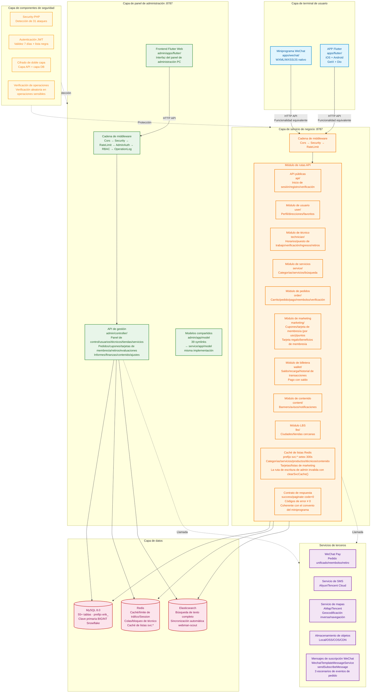

# Diagrama de arquitectura del sistema

```mermaid
graph TB
    subgraph 用户终端层["Capa de terminal de usuario"]
        WX["Miniprograma WeChat<br/>apps/wechat/<br/>WXML/WXSS/JS nativo"]
        APP["APP Flutter<br/>apps/flutter/<br/>iOS + Android<br/>GetX + Dio"]
    end

    subgraph 业务服务层["Capa de servicio de negocio :8787"]
        direction TB
        MW1["Cadena de middleware<br/>Cors → Security → RateLimit"]
        subgraph API模块["Módulo de rutas API"]
            PUB["API públicas<br/>api/<br/>Inicio de sesión/registro/verificación"]
            USER["Módulo de usuario<br/>user/<br/>Perfil/direcciones/favoritos"]
            TECH["Módulo de técnico<br/>technician/<br/>Horarios/puesto de trabajo/verificación/ingresos/retiros"]
            SVC["Módulo de servicios<br/>service/<br/>Categorías/servicios/búsqueda"]
            ORD["Módulo de pedidos<br/>order/<br/>Carrito/pedido/pago/reembolso/verificación"]
            MKT["Módulo de marketing<br/>marketing/<br/>Cupones/tarjeta de membresía (por uso)/puntos<br/>Tarjeta regalo/beneficios de membresía"]
            WALLET["Módulo de billetera<br/>wallet/<br/>Saldo/recarga/historial de transacciones<br/>Pago con saldo"]
            CTN["Módulo de contenido<br/>content/<br/>Banners/avisos/notificaciones"]
            LBS["Módulo LBS<br/>lbs/<br/>Ciudades/tiendas cercanas"]
            CACHE["Caché de listas Redis<br/>prefijo svc:* setex 300s<br/>Categorías/servicios/productos/técnicos/contenido<br/>Tarjetas/listas de marketing<br/>La ruta de escritura de admin invalida con clearSvcCache()"]
            RES["Contrato de respuesta<br/>success/paginate code=0<br/>Códigos de error ≠ 0<br/>Coherente con el convenio del miniprograma"]
        end
    end

    subgraph 管理后台层["Capa de panel de administración :8787"]
        MW2["Cadena de middleware<br/>Cors → Security → RateLimit → AdminAuth → RBAC → OperationLog"]
        ADMIN_API["API de gestión<br/>admin/controller/<br/>Panel de control/usuarios/técnicos/tiendas/servicios<br/>Pedidos/cupones/tarjetas de membresía/retiros/evaluaciones<br/>Informes/finanzas/contenido/ajustes"]
        FLUTTER_WEB["Frontend Flutter Web<br/>admin/apps/flutter/<br/>Interfaz del panel de administración PC"]
        MODEL["Modelos compartidos<br/>admin/app/model<br/>39 symlinks<br/>→ service/app/model misma implementación"]
    end

    subgraph 数据层["Capa de datos"]
        MySQL[("MySQL 8.0<br/>55+ tablas · prefijo erik_<br/>Clave primaria BIGINT Snowflake")]
        Redis[("Redis<br/>Caché/límite de tráfico/Session<br/>Colas/bloqueo de técnico<br/>Caché de listas svc:*")]
        ES[("Elasticsearch<br/>Búsqueda de texto completo<br/>Sincronización automática webman-scout")]
    end

    subgraph 外部服务["Servicios de terceros"]
        WXPAY["WeChat Pay<br/>Pedido unificado/reembolso/retiro"]
        SMS["Servicio de SMS<br/>Aliyun/Tencent Cloud"]
        MAP["Servicio de mapas<br/>AMap/Tencent<br/>Geocodificación inversa/navegación"]
        OSS["Almacenamiento de objetos<br/>Local/OSS/COS/CDN"]
        SUBMSG["Mensajes de suscripción WeChat<br/>WechatTemplateMessageService<br/>sendSubscribeMessage<br/>3 escenarios de eventos de pedido"]
    end

    subgraph 安全组件["Capa de componentes de seguridad"]
        SEC["Security-PHP<br/>Detección de 31 ataques"]
        JWT["Autenticación JWT<br/>Validez 7 días + lista negra"]
        ENC["Cifrado de doble capa<br/>Capa API + capa DB"]
        POSTER["Verificación de operaciones<br/>Verificación aleatoria en operaciones sensibles"]
    end

    WX -->|"HTTP API<br/>Funcionalidad equivalente"| MW1
    APP -->|"HTTP API<br/>Funcionalidad equivalente"| MW1
    MW1 --> API模块

    FLUTTER_WEB -->|"HTTP API"| MW2
    MW2 --> ADMIN_API

    API模块 --> MySQL
    API模块 --> Redis
    API模块 --> ES
    ADMIN_API --> MySQL
    ADMIN_API --> Redis
    ADMIN_API --> ES

    安全组件 -.->|"Protección"| 业务服务层
    安全组件 -.->|"Protección"| 管理后台层

    API模块 -.->|"Llamada"| 外部服务
    ADMIN_API -.->|"Llamada"| 外部服务

    classDef terminal fill:#e1f5fe,stroke:#0288d1,stroke-width:2px,color:#01579b
    classDef service fill:#fff3e0,stroke:#f57c00,stroke-width:2px,color:#e65100
    classDef admin fill:#e8f5e9,stroke:#388e3c,stroke-width:2px,color:#1b5e20
    classDef data fill:#fce4ec,stroke:#c62828,stroke-width:2px,color:#880e4f
    classDef external fill:#f3e5f5,stroke:#7b1fa2,stroke-width:2px,color:#4a148c
    classDef security fill:#fff8e1,stroke:#f9a825,stroke-width:2px,color:#f57f17

    class WX,APP terminal
    class MW1,API模块,PUB,USER,TECH,SVC,ORD,MKT,WALLET,CTN,LBS,CACHE,RES service
    class MW2,ADMIN_API,FLUTTER_WEB,MODEL admin
    class MySQL,Redis,ES data
    class WXPAY,SMS,MAP,OSS,SUBMSG external
    class SEC,JWT,ENC,POSTER security
```
