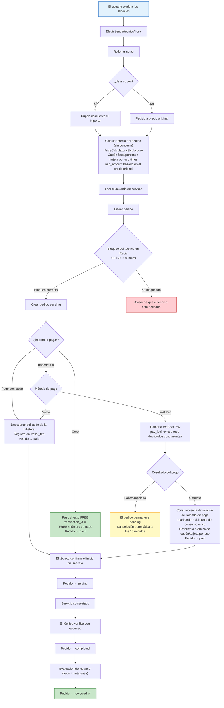
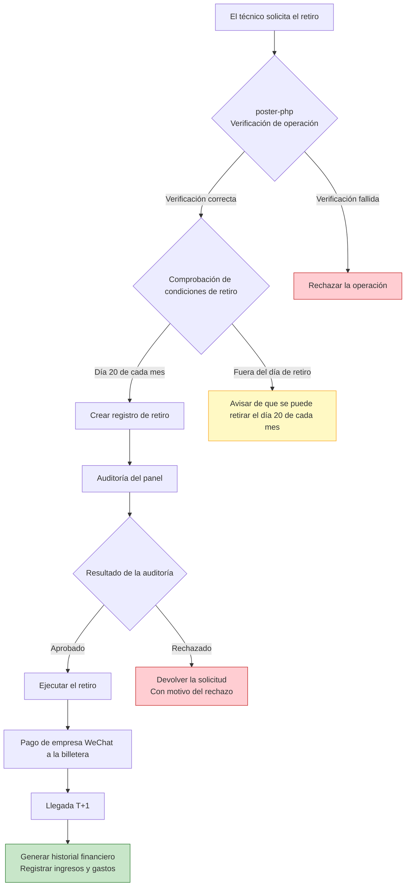
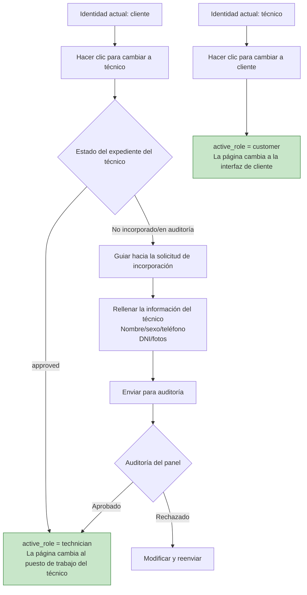
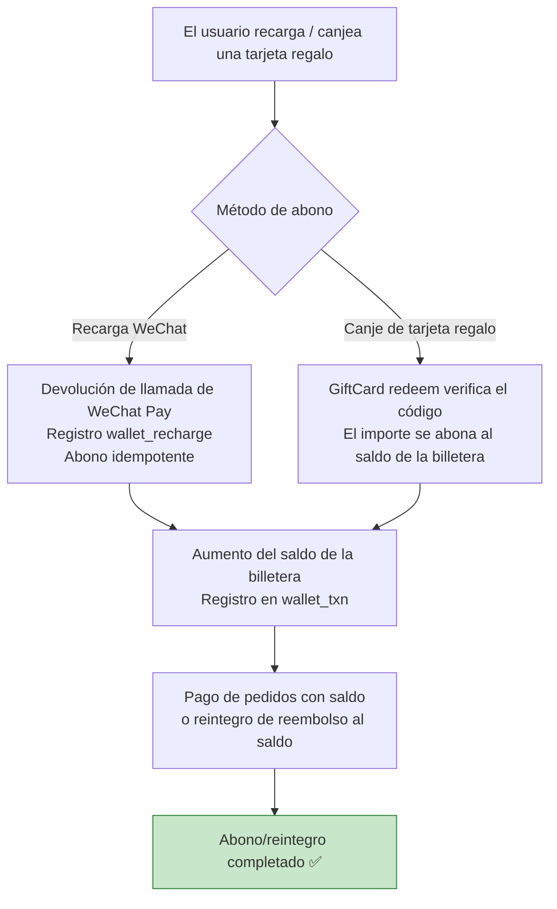

# Diagrama de flujo del negocio principal

## 1. Flujo de reserva de servicios

## 2. Flujo de pago y reembolso

```mermaid
flowchart TD
    subgraph 支付流程["Flujo de pago directo"]
        P1["Crear registro de pago"] --> P2["Pedido unificado WeChat<br/>pay_lock evita concurrencia<br/>out_trade_no = order_no idempotente"]
        P2 --> P3["El frontend inicia el pago<br/>Elegir método de pago"]
        P3 -->|"Saldo"| PB["Descuento del saldo de la billetera<br/>Registro en wallet_txn<br/>Idempotente, solo se descuenta una vez"]
        P3 -->|"WeChat"| P4["Devolución de llamada de WeChat notify"]
        P4 --> P5["Verificación de firma correcta"]
        PB --> P6["markOrderPaid idempotente<br/>Cupón/tarjeta por uso solo se consume aquí"]
        P5 --> P6
        P6 --> P7["Pedido → paid<br/>Notificar al usuario + técnico"]
    end

    subgraph 退款流程["Flujo de reembolso"]
        R1["El usuario solicita el reembolso<br/>refund_lock evita concurrencia"] --> R2{"Determinación de la regla de reembolso"}
        R2 -->|"Pedido ≤15 min o a >6 h del inicio"| R3["Reembolso 100%"]
        R2 -->|"A ≤6 h del inicio"| R4["Reembolso 90%"]
        R2 -->|"Empezado sin confirmar"| R5["Reembolso 80%"]
        R2 -->|"Tras confirmar el servicio"| R6["Sin reembolso"]
        R3 --> R7["Pedido → refunding"]
        R4 --> R7
        R5 --> R7
        R7 --> R8["Aprobación de dos niveles<br/>Gerente de tienda → Finanzas"]
        R8 --> R9["Reembolso en dos fases<br/>Registro de reembolso dentro de la transacción<br/>IO del reembolso WeChat fuera de la transacción"]
        R9 -->|"Fallo de WeChat"| R10["Reversión del pedido a PAID<br/>Reembolso reintentable"]
        R9 -->|"Reembolso correcto"| R11["Pedido → refunded<br/>Devolución original de WeChat / reintegro al saldo<br/>Devolución del cupón + descuento de puntos"]
    end

    style P6 fill:#c8e6c9,stroke:#2e7d32,color:#333
    style R6 fill:#ffcdd2,stroke:#c62828,color:#333
    style R11 fill:#c8e6c9,stroke:#2e7d32,color:#333
    style R10 fill:#fff9c4,stroke:#f9a825,color:#333
```

## 3. Flujo de retiro del técnico

## 4. Flujo de cambio de identidad

## 5. Flujo de recarga de la billetera / abono de tarjeta regalo

