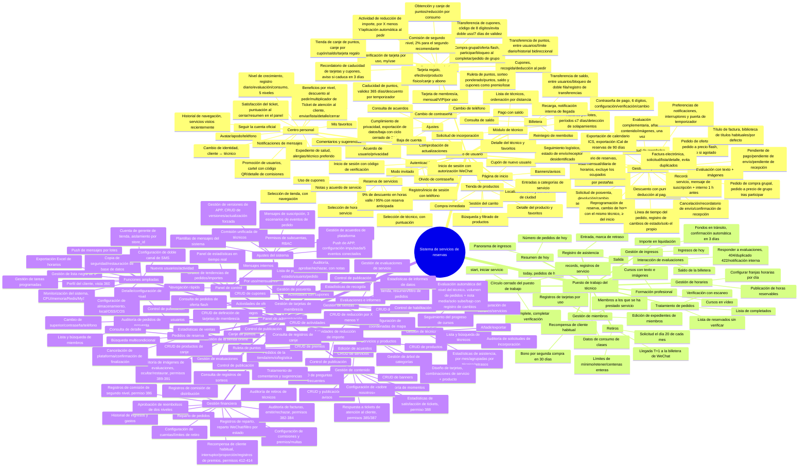

# Diagrama de funciones del sistema

```mermaid
mindmap
  root((Sistema de servicios de reservas))
    Extremo de usuario
      Autenticación
        Registro/inicio de sesión con teléfono
        Inicio de sesión con código de verificación
        Inicio de sesión con autorización WeChat
        Modo invitado
        Olvido de contraseña
        Acuerdo de usuario/privacidad
      Página de inicio
        Localización LBS y cambio de ciudad
        Banners/avisos
        Entradas a categorías de servicio
        Cupón de nuevo usuario
      Reserva de servicios
        Selección de tienda, con navegación
        Selección de técnico, con puntuación
        Selección de hora de servicio
        9% de descuento en horas valle / 95% con reserva anticipada
        Uso de cupones
        Notas y acuerdo de servicio
      Tienda de productos
        Búsqueda y filtrado de productos
        Detalle del producto y favoritos
        Gestión del carrito
        Compra inmediata
      Gestión de pedidos
        Todos los pedidos, vista por pestañas
        Pendiente de pago/pendiente de envío/pendiente de recepción
        Cancelación/recordatorio de envío/confirmación de recepción
        Solicitud de reembolso
        Solicitud de posventa, devolución/cambio, seguimiento de estado
        Descuento con puntos, deducción al pagar
        Pedido de compra grupal, pedido a precio de grupo tras participar
        Pedido de oferta flash, pedido a precio flash, bloqueo si agotado
        Reprogramación de reserva, cambio de hora con el mismo técnico, ≥6 h del inicio
        Calendario de reservas, vista mensual/diaria de horarios, excluye los ocupados
        Recordatorio antes del servicio, mensaje de suscripción + interno 1 h antes
        Evaluación con texto + imágenes
        Evaluación complementaria, añadir contenido/imágenes, una vez
        Seguimiento logístico, estado de envío/receptor desidentificado
        Factura electrónica, solicitud/lista/detalle, evita duplicados
        Exportación de calendario ICS, exportación iCal de reservas de 90 días
        Línea de tiempo del pedido, registro de cambios de estado/solo el propio
        Título de factura, biblioteca de títulos habituales/por defecto
        Preferencias de notificaciones, interruptores y puerta de temporizador
      Módulo de técnico
        Lista de técnicos, ordenación por distancia
        Detalle del técnico y favoritos
        Solicitud de incorporación
        Horarios por lotes, períodos ≤7 días/detección de solapamientos
      Centro de marketing
        Cupones, recogida/deducción al pedir
        Transferencia de cupones, código de 8 dígitos/evita doble uso/7 días de validez
        Tarjeta de membresía, mensual/VIP/por uso
        Verificación de tarjeta por uso, my/use
        Obtención y canje de puntos/reducción por consumo
        Caducidad de puntos, validez 365 días/descuento por temporizador
        Tienda de canje de puntos, canje por cupón/saldo/tarjeta regalo
        Compra grupal/oferta flash, participar/bloqueo al completar/pedido de grupo
        Recordatorio de caducidad de tarjetas y cupones, aviso si caduca en 3 días
        Tarjeta regalo, efectivo/producto físico/canje y abono
        Transferencia de puntos, entre usuarios/límite diario/historial bidireccional
        Comisión de segundo nivel, 2% para el segundo recomendante
        Actividad de reducción de importe, por X menos Y/aplicación automática al pedir
        Ruleta de puntos, sorteo ponderado/puntos, saldo y cupones como premio/lose
      Billetera
        Consulta de saldo
        Recarga, notificación interna de llegada
        Pago con saldo
        Reintegro de reembolso
        Transferencia de saldo, entre usuarios/bloqueo de doble fila/registro de transferencias
        Contraseña de pago, 6 dígitos, configuración/verificación/cambio
      Centro personal
        Avatar/apodo/teléfono
        Cambio de identidad, cliente ↔ técnico
        Notificaciones de mensajes
        Mis favoritos
        Historial de navegación, servicios vistos recientemente
        Expediente de salud, alergias/técnico preferido
        Seguir la cuenta oficial
        Promoción de usuarios, cartel con código QR/detalle de comisiones
        Nivel de crecimiento, registro diario/evaluación/consumo, 5 niveles
        Beneficios por nivel, descuento al pedir/multiplicador de puntos
        Ticket de atención al cliente, enviar/lista/detalle/cerrar
        Satisfacción del ticket, puntuación al cerrar/resumen en el panel
        Comentarios y sugerencias
      Ajustes
        Cambio de contraseña
        Cambio de teléfono
        Consulta de acuerdos
        Comprobación de actualizaciones
        Cumplimiento de privacidad, exportación de datos/baja con ciclo cerrado de 72 h
        Baja de cuenta

    Puesto de trabajo del técnico
      Registro de asistencia
        Entrada, marca de retraso
        Salida
      Círculo cerrado del puesto de trabajo
        today, pedidos de hoy
        records, registros de servicio
        start, iniciar servicio
        complete, completar verificación
      Resumen de hoy
        Número de pedidos de hoy
        Panorama de ingresos
      Gestión de horarios
        Configurar franjas horarias por día
        Publicación de horas reservables
      Tratamiento de pedidos
        Lista de reservados sin verificar
        Lista de completados
        Verificación con escaneo
      Gestión de miembros
        Miembros a los que se ha prestado servicio
        Datos de consumo de clases
        Registros de tarjetas por uso
        Edición de expedientes de miembros
      Interacción de evaluaciones
        Responder a evaluaciones, 404/duplicado 422/notificación interna
      Gestión de ingresos
        Ingresos de hoy
        Importe en liquidación
        Saldo de la billetera
        Fondos en tránsito, confirmación automática en 3 días
      Retiros
        Solicitud el día 20 de cada mes
        Llegada T+1 a la billetera de WeChat
        Límites de mínimo/retener/centenas enteras
      Recompensa de cliente habitual
        Bono por segunda compra en 30 días
      Formación profesional
        Cursos en vídeo
        Cursos con texto e imágenes

    Panel de administración
      Panel de control
        Panel de estadísticas en tiempo real
        Gráfico de tendencias de pedidos/importes
        Nuevos usuarios/actividad
        Navegación rápida
        Mensajes internos
      Gestión de técnicos
        Lista y búsqueda de técnicos
        Añadir/exportar
        Auditoría de solicitudes de incorporación
        Configuración de horarios/servicios
        Seguimiento del progreso de cursos
        Evaluación automática del nivel del técnico, volumen de pedidos + nota media/solo sube/bajo con registro de cambios
        Estadísticas de asistencia, por mes/agrupadas por técnico/retrasos
      Gestión de usuarios
        Lista y búsqueda de miembros
        Detalle/configuración de nivel
        Cambio de superior/contraseña/teléfono
      Gestión de tiendas
        CRUD de tiendas
        Control de habilitación
        Configuración de coordenadas de mapa
        Puesto de trabajo de la tienda, resumen/filtro de pedidos
      Servicios y productos
        CRUD de servicios
        CRUD de productos
        Gestión de árbol de categorías
        Diseño de tarjetas, combinaciones de servicio + producto
      Gestión de la tienda online
        Pedidos de la tienda/envío/logística
        Auditoría de pedidos de posventa
        Gestión de evaluaciones
        Auditoría de imágenes de evaluaciones, ocultar/restaurar, permisos 389-391
        Historial de pagos
        Estadísticas de ventas
      Pedidos de reserva
        Búsqueda multicondicional
        Cancelación de plataforma/confirmación de finalización
        Consulta de detalle
      Actividades con cupones
        CRUD de cupones
        Control de publicación
        Estadísticas de recogida
      Actividades de reducción de importe
        CRUD de reducción por X menos Y
        Control de publicación
      Ruleta de puntos
        CRUD de premios
        Control de publicación
        Consulta de registros de sorteos
      Actividades de oferta flash
        CRUD de actividades
        Control de publicación
        Consulta de pedidos de oferta flash
      Canje de puntos
        CRUD de productos de canje
        Control de publicación
        Consulta de registros de canje
      Gestión de tarjetas de membresía
        CRUD de definición de tarjetas de membresía
        Por uso/mensual/VIP
      Gestión de posventa
        Lista de posventa, filtro por estado/usuario/pedido
        Auditoría, aprobar/rechazar, con notas
      Evaluaciones e informes
        Gestión de evaluaciones de servicio
        Estadísticas de informes de datos
      Gestión financiera
        Reparto de pedidos
        Auditoría de retiros de técnicos
        Configuración de comisiones y premios/multas
        Historial de ingresos y gastos
        Configuración de cuentas/límites de retiro
        Aprobación de reembolsos de dos niveles
        Registros de comisión de distribución
        Registros de comisión de segundo nivel, permiso 386
        Registros de reparto, reparto WeChat/filtro por estado
        Auditoría de facturas, emitir/rechazar, permisos 382-384
        Recompensa de cliente habitual, interruptor/proporción/registros de premios, permisos 412-414
      Gestión de contenido
        CRUD de banners
        CRUD y publicación de avisos
        Edición de acuerdos
        CRUD de preguntas frecuentes
        Tratamiento de comentarios y sugerencias
        Respuesta a tickets de atención al cliente, permisos 385/387
        Estadísticas de satisfacción de tickets, permiso 388
        Auditoría de momentos
        Configuración de «sobre nosotros»
      Ajustes del sistema
        Gestión de acuerdos de plataforma
        Comisión unificada de técnicos
        Plantillas de mensajes del sistema
        Push de APP, configuración impulsada/5 eventos conectados
        Mensajes de suscripción, 3 escenarios de eventos de pedido
        Gestión de versiones de APP, CRUD de versiones/actualización forzada
        Permisos de subcuentas, RBAC
      Funciones ampliadas
        Monitorización del sistema, CPU/memoria/Redis/MySQL
        Gestión de lista negra de IP
        Copia de seguridad/restauración de base de datos
        Perfil del cliente, vista 360
        Push de mensajes por lotes
        Gestión de tareas programadas
        Configuración de doble canal de SMS
        Configuración de almacenamiento, local/OSS/COS
        Exportación Excel de horarios
        Cuenta de gerente de tienda, aislamiento por store_id
```
