# Diagrama de ciclo de vida

## 1. Ciclo de vida del pedido (máquina de estados)

```mermaid
stateDiagram-v2
    [*] --> pending: El usuario envía el pedido

    pending --> paid: Pago correcto<br/>(tres canales: WeChat/saldo/gratuito)

    pending --> cancelled: Cancelación por tiempo de espera (15 min)<br/>Cancelación activa del usuario

    paid --> confirmed: El técnico confirma la recepción<br/>Consumo atómico en la devolución de llamada<br/>Descuento de cupón/consumo de tarjeta por uso
    paid --> cancelled: Cancelación del usuario<br/>(según reglas de reembolso)
    paid --> refunding: El usuario solicita el reembolso
    paid --> aftersale: Solicitud de posventa<br/>(reembolso/cambio)

    confirmed --> serving: Inicio del servicio

    serving --> completed: Servicio completado + verificación<br/>Consumo de tarjeta por uso al verificar

    serving --> refunding: Reembolso excepcional<br/>(reembolso del 80%)

    completed --> reviewed: Evaluación del usuario
    completed --> aftersale: Solicitud de posventa<br/>(reembolso/cambio)

    refunding --> refunded: Auditoría aprobada<br/>Devolución original/reintegro al saldo<br/>Devolución del cupón + descuento de puntos
    refunding --> paid: Auditoría rechazada

    aftersale --> refunded: Aprobado para reembolso<br/>Reutiliza la interfaz de reembolso de pedidos
    aftersale --> paid: Rechazado
    aftersale --> [*]: Aprobado para cambio<br/>Flujo de estados completado

    reviewed --> [*]
    cancelled --> [*]
    refunded --> [*]

    note right of pending: Bloqueo del técnico 3 minutos
    note right of refunding: Aprobación de dos niveles: gerente de tienda → finanzas
```

## 2. Ciclo de vida de la tarjeta de membresía

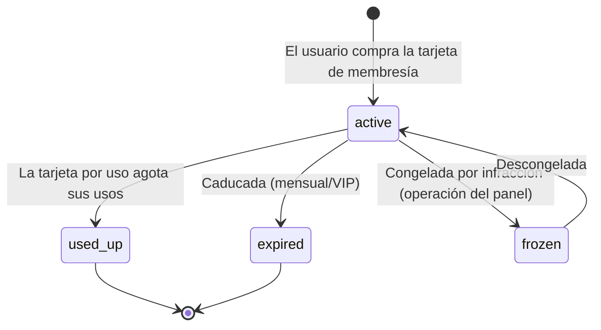
```mermaid
stateDiagram-v2
    [*] --> active: El usuario compra la tarjeta de membresía

    active --> used_up: La tarjeta por uso agota sus usos

    active --> expired: Caducada (mensual/VIP)

    active --> frozen: Congelada por infracción (operación del panel)

    frozen --> active: Descongelada

    used_up --> [*]
    expired --> [*]
```

## 3. Ciclo de vida de la incorporación del técnico

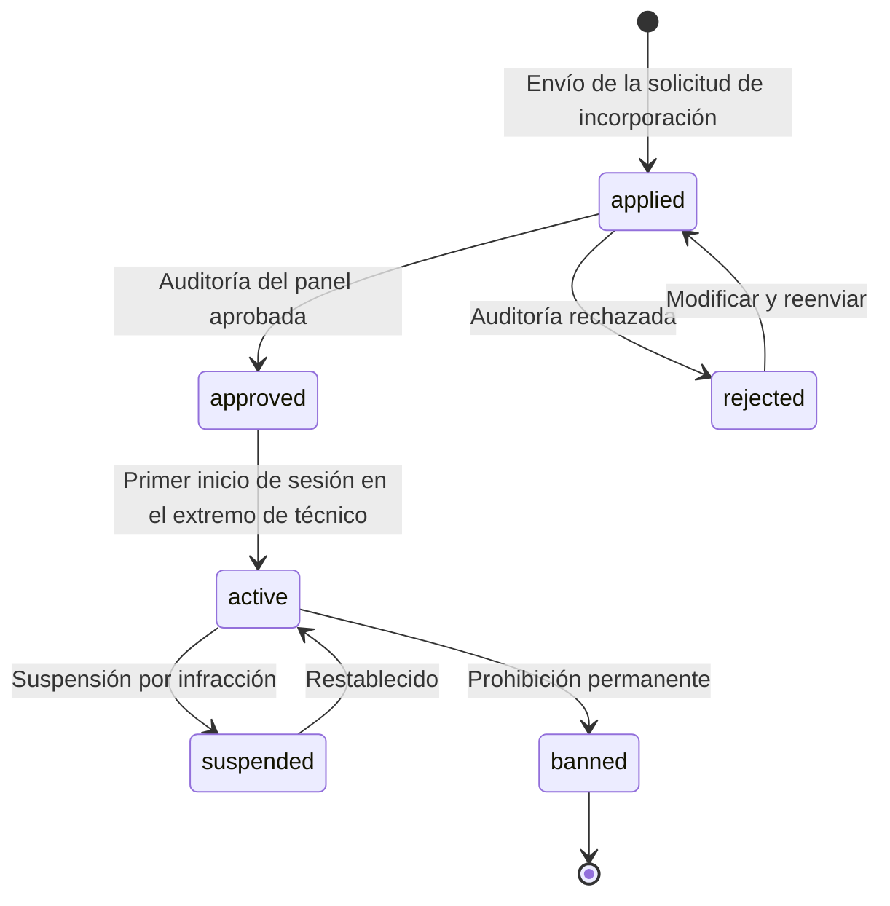
```mermaid
stateDiagram-v2
    [*] --> applied: Envío de la solicitud de incorporación

    applied --> approved: Auditoría del panel aprobada
    applied --> rejected: Auditoría rechazada

    rejected --> applied: Modificar y reenviar

    approved --> active: Primer inicio de sesión en el extremo de técnico

    active --> suspended: Suspensión por infracción
    suspended --> active: Restablecido
    active --> banned: Prohibición permanente

    banned --> [*]
```

## 4. Ciclo de vida del cupón

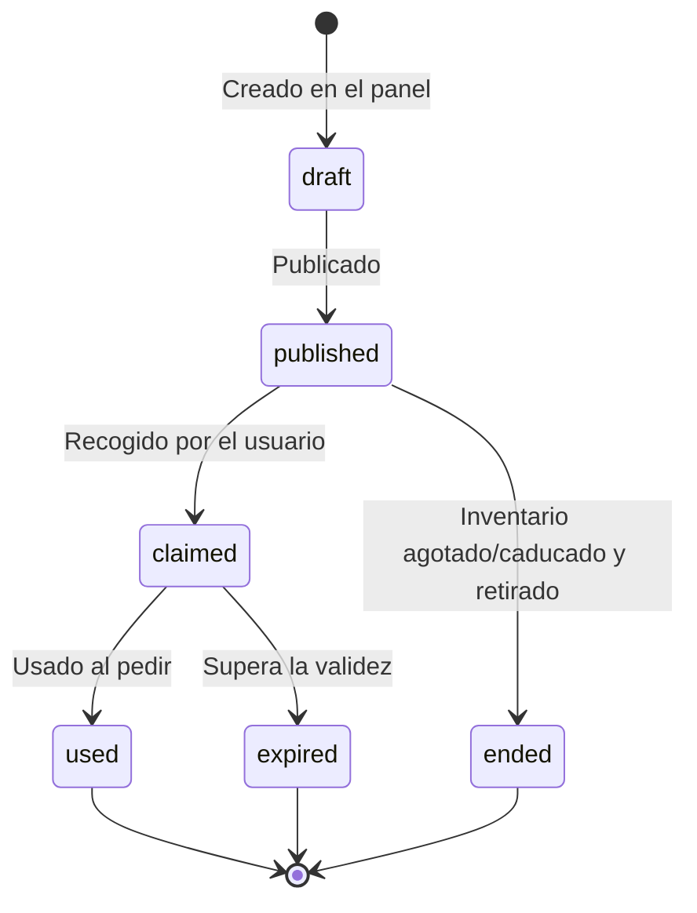
```mermaid
stateDiagram-v2
    [*] --> draft: Creado en el panel

    draft --> published: Publicado

    published --> claimed: Recogido por el usuario

    claimed --> used: Usado al pedir
    claimed --> expired: Supera la validez

    published --> ended: Inventario agotado/caducado y retirado

    used --> [*]
    expired --> [*]
    ended --> [*]
```

## 5. Ciclo de vida del retiro del técnico

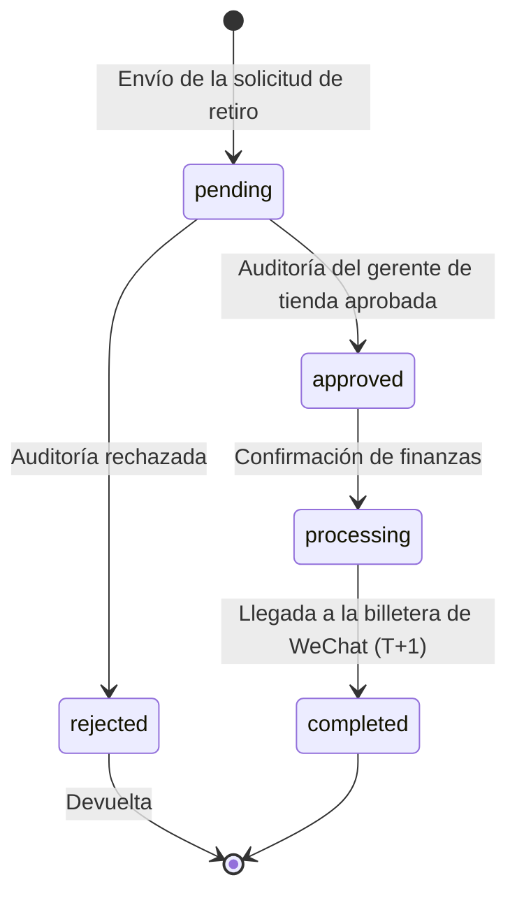
```mermaid
stateDiagram-v2
    [*] --> pending: Envío de la solicitud de retiro

    pending --> approved: Auditoría del gerente de tienda aprobada
    pending --> rejected: Auditoría rechazada

    rejected --> [*]: Devuelta

    approved --> processing: Confirmación de finanzas

    processing --> completed: Llegada a la billetera de WeChat (T+1)

    completed --> [*]
```

## 6. Ciclo de vida de autenticación del Token

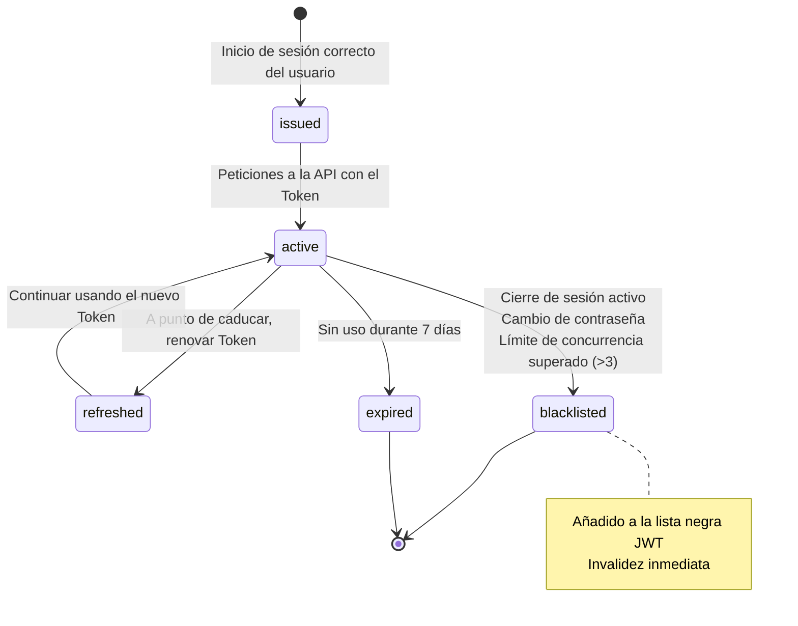
```mermaid
stateDiagram-v2
    [*] --> issued: Inicio de sesión correcto del usuario

    issued --> active: Peticiones a la API con el Token

    active --> refreshed: A punto de caducar, renovar Token

    refreshed --> active: Continuar usando el nuevo Token

    active --> blacklisted: Cierre de sesión activo<br/>Cambio de contraseña<br/>Límite de concurrencia superado (>3)

    active --> expired: Sin uso durante 7 días

    blacklisted --> [*]
    expired --> [*]

    note right of blacklisted: Añadido a la lista negra JWT<br/>Invalidez inmediata
```

## 7. Ciclo de vida de la actividad de compra grupal

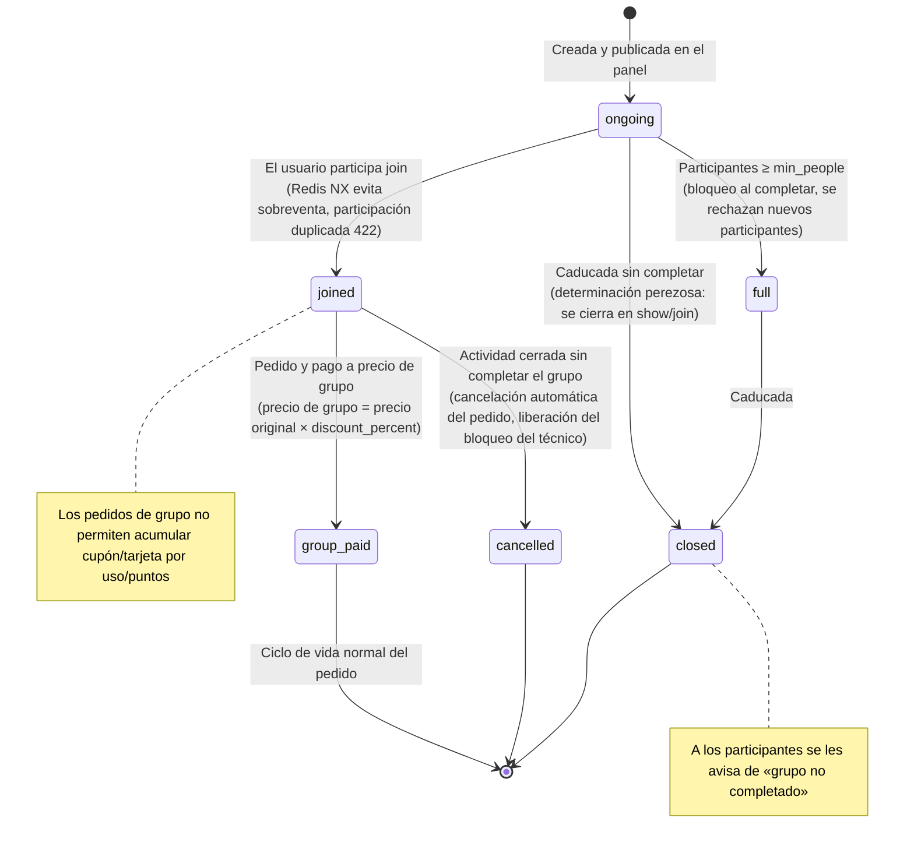
```mermaid
stateDiagram-v2
    [*] --> ongoing: Creada y publicada en el panel

    ongoing --> full: Participantes ≥ min_people<br/>(bloqueo al completar, se rechazan nuevos participantes)

    ongoing --> closed: Caducada sin completar<br/>(determinación perezosa: se cierra en show/join)

    full --> closed: Caducada

    ongoing --> joined: El usuario participa join<br/>(Redis NX evita sobreventa, participación duplicada 422)

    joined --> group_paid: Pedido y pago a precio de grupo<br/>(precio de grupo = precio original × discount_percent)

    joined --> cancelled: Actividad cerrada sin completar el grupo<br/>(cancelación automática del pedido, liberación del bloqueo del técnico)

    group_paid --> [*]: Ciclo de vida normal del pedido
    cancelled --> [*]
    closed --> [*]

    note right of joined: Los pedidos de grupo no permiten acumular cupón/tarjeta por uso/puntos
    note right of closed: A los participantes se les avisa de «grupo no completado»
```

## 8. Ciclo de vida de la transferencia de cupones

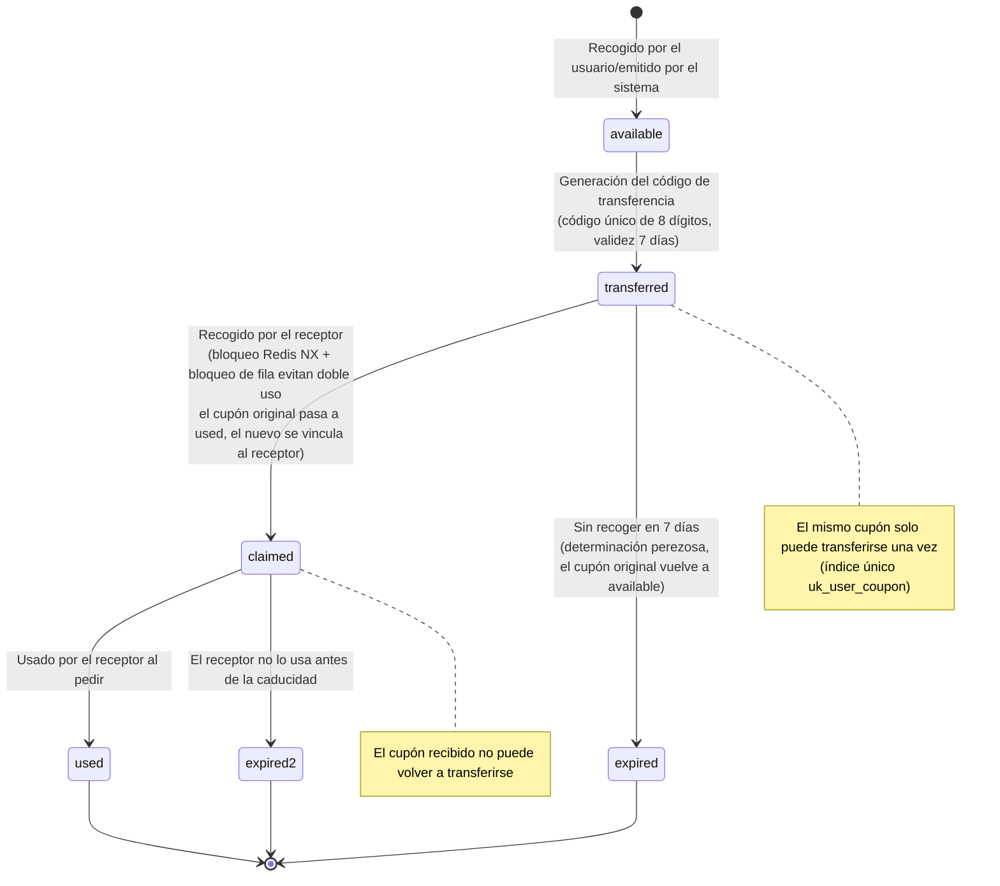
```mermaid
stateDiagram-v2
    [*] --> available: Recogido por el usuario/emitido por el sistema

    available --> transferred: Generación del código de transferencia<br/>(código único de 8 dígitos, validez 7 días)

    transferred --> claimed: Recogido por el receptor<br/>(bloqueo Redis NX + bloqueo de fila evitan doble uso<br/>el cupón original pasa a used, el nuevo se vincula al receptor)

    transferred --> expired: Sin recoger en 7 días<br/>(determinación perezosa, el cupón original vuelve a available)

    claimed --> used: Usado por el receptor al pedir
    claimed --> expired2: El receptor no lo usa antes de la caducidad

    used --> [*]
    expired --> [*]
    expired2 --> [*]

    note right of transferred: El mismo cupón solo puede transferirse una vez<br/>(índice único uk_user_coupon)
    note right of claimed: El cupón recibido no puede volver a transferirse
```

## 9. Ciclo de vida de la caducidad de puntos

```mermaid
stateDiagram-v2
    [*] --> earned: Registro diario/devolución por consumo/compensación<br/>(expires_at = now + 365 días)

    earned --> used: Descuento al pagar/canje y consumo

    earned --> expired: Caducado sin usar<br/>(PointsExpiryTimer escanea cada 60 s<br/>escribe fila de descuento negativa type=expire)

    expired --> [*]: Notificación interna «puntos caducados»
    used --> [*]

    note right of expired: Idempotencia de tres capas: reverificación con bloqueo de fila de la fila original<br/>+ paginación por cursor de id + la notificación solo se genera en la ronda de descuento
```

## 10. Ciclo de vida de las transferencias (ronda 19: transferencia de saldo + transferencia de puntos)

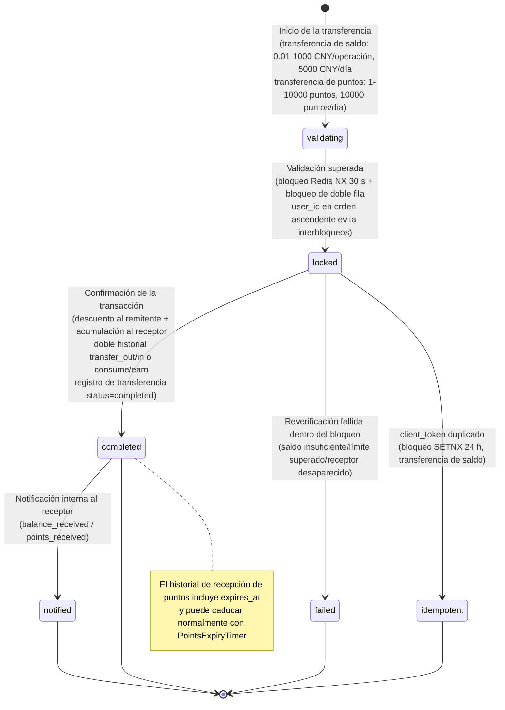
```mermaid
stateDiagram-v2
    [*] --> validating: Inicio de la transferencia<br/>(transferencia de saldo: 0.01-1000 CNY/operación, 5000 CNY/día<br/>transferencia de puntos: 1-10000 puntos, 10000 puntos/día)

    validating --> locked: Validación superada<br/>(bloqueo Redis NX 30 s + bloqueo de doble fila<br/>user_id en orden ascendente evita interbloqueos)

    locked --> completed: Confirmación de la transacción<br/>(descuento al remitente + acumulación al receptor<br/>doble historial transfer_out/in o consume/earn<br/>registro de transferencia status=completed)

    locked --> failed: Reverificación fallida dentro del bloqueo<br/>(saldo insuficiente/límite superado/receptor desaparecido)
    locked --> idempotent: client_token duplicado<br/>(bloqueo SETNX 24 h, transferencia de saldo)

    completed --> notified: Notificación interna al receptor<br/>(balance_received / points_received)
    completed --> [*]
    failed --> [*]
    idempotent --> [*]
    notified --> [*]

    note right of completed: El historial de recepción de puntos incluye expires_at<br/>y puede caducar normalmente con PointsExpiryTimer
```

## 11. Ciclo de vida del ticket de atención al cliente (ronda 20)

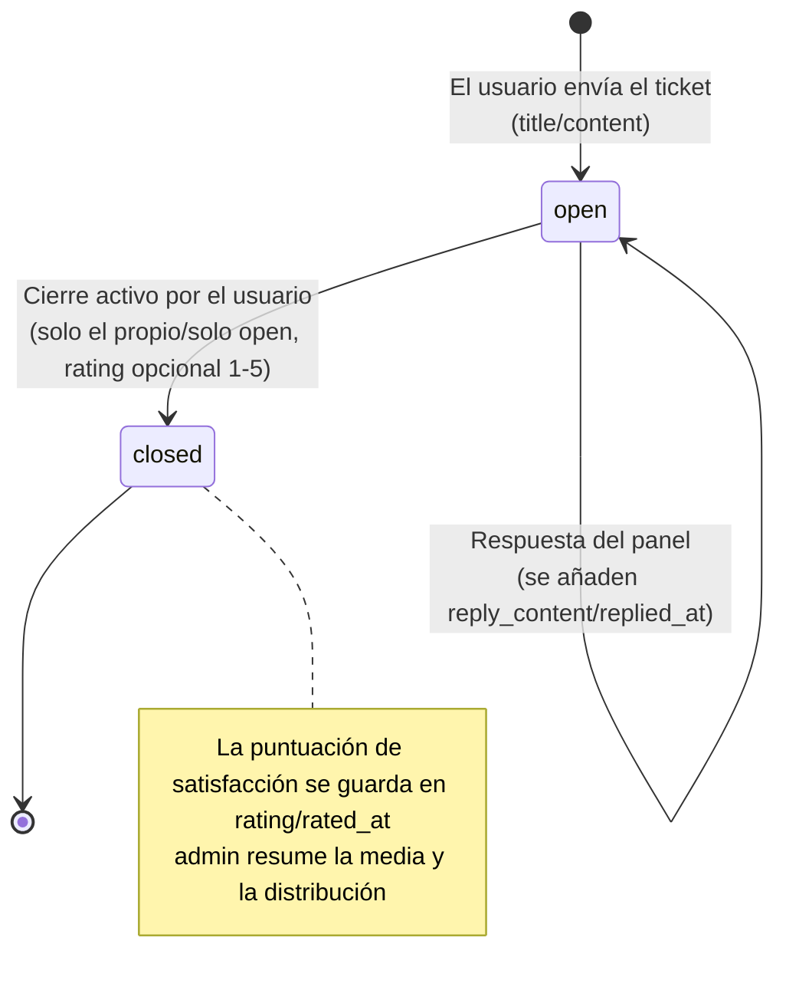
```mermaid
stateDiagram-v2
    [*] --> open: El usuario envía el ticket<br/>(title/content)

    open --> open: Respuesta del panel<br/>(se añaden reply_content/replied_at)

    open --> closed: Cierre activo por el usuario<br/>(solo el propio/solo open, rating opcional 1-5)

    closed --> [*]

    note right of closed: La puntuación de satisfacción se guarda en rating/rated_at<br/>admin resume la media y la distribución
```

## 12. Ciclo de vida de la factura electrónica (ronda 20)

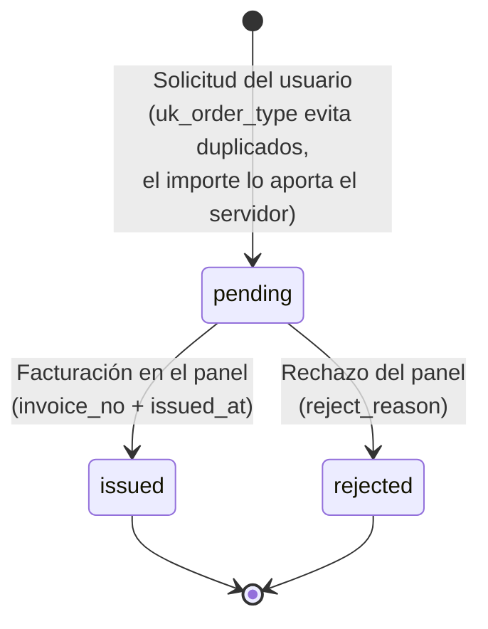
```mermaid
stateDiagram-v2
    [*] --> pending: Solicitud del usuario<br/>(uk_order_type evita duplicados,<br/>el importe lo aporta el servidor)

    pending --> issued: Facturación en el panel<br/>(invoice_no + issued_at)

    pending --> rejected: Rechazo del panel<br/>(reject_reason)

    issued --> [*]
    rejected --> [*]
```

## 13. Ciclo de vida de la actividad de reducción de importe (ronda 22)

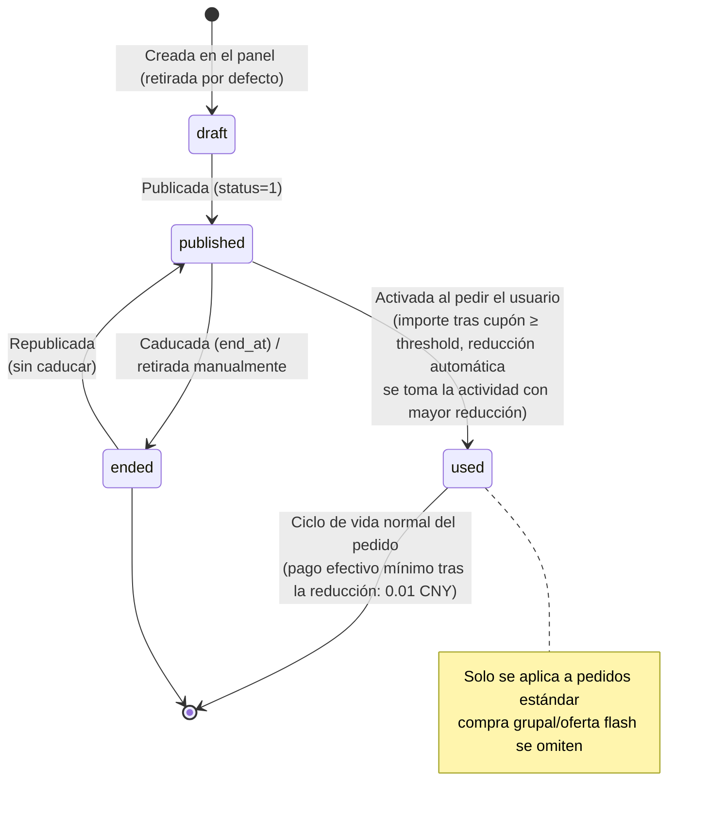
```mermaid
stateDiagram-v2
    [*] --> draft: Creada en el panel (retirada por defecto)

    draft --> published: Publicada (status=1)

    published --> ended: Caducada (end_at) / retirada manualmente

    published --> used: Activada al pedir el usuario<br/>(importe tras cupón ≥ threshold, reducción automática<br/>se toma la actividad con mayor reducción)

    used --> [*]: Ciclo de vida normal del pedido<br/>(pago efectivo mínimo tras la reducción: 0.01 CNY)

    ended --> published: Republicada<br/>(sin caducar)
    ended --> [*]

    note right of used: Solo se aplica a pedidos estándar<br/>compra grupal/oferta flash se omiten
```

## 15. Ciclo de vida del sorteo de la ruleta (ronda 23)

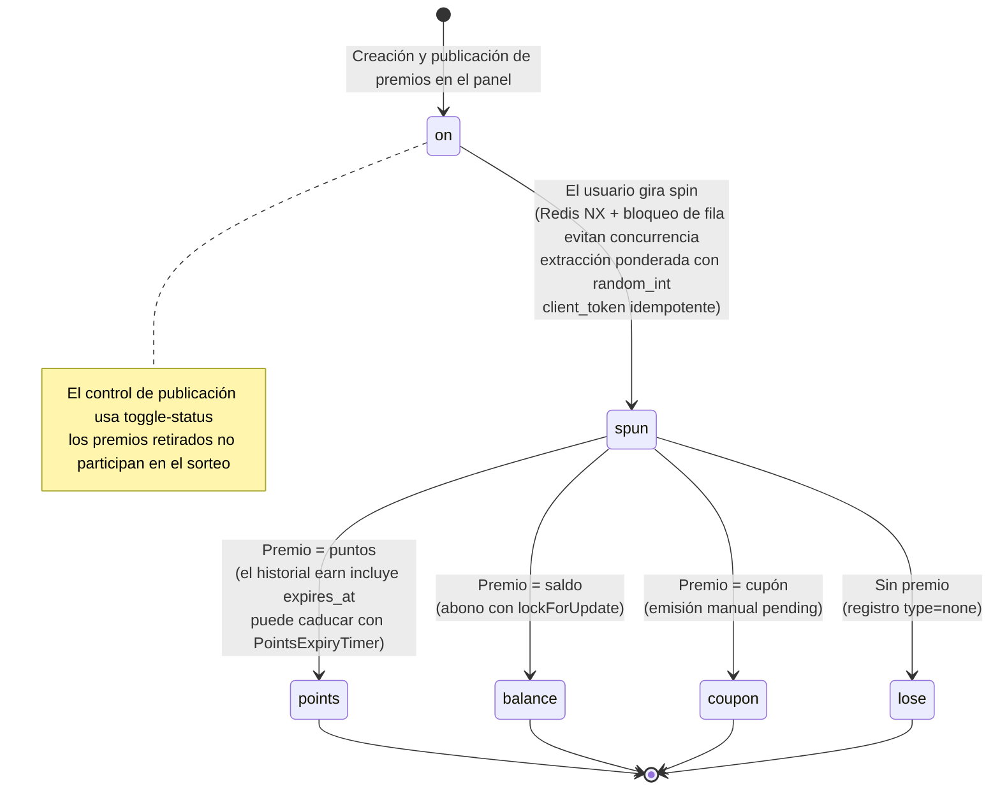
```mermaid
stateDiagram-v2
    [*] --> on: Creación y publicación de premios en el panel

    on --> spun: El usuario gira spin<br/>(Redis NX + bloqueo de fila evitan concurrencia<br/>extracción ponderada con random_int<br/>client_token idempotente)

    spun --> points: Premio = puntos<br/>(el historial earn incluye expires_at<br/>puede caducar con PointsExpiryTimer)

    spun --> balance: Premio = saldo<br/>(abono con lockForUpdate)

    spun --> coupon: Premio = cupón<br/>(emisión manual pending)

    spun --> lose: Sin premio<br/>(registro type=none)

    points --> [*]
    balance --> [*]
    coupon --> [*]
    lose --> [*]

    note right of on: El control de publicación usa toggle-status<br/>los premios retirados no participan en el sorteo
```

## 14. Ciclo de vida de la baja de cuenta (ronda 22)

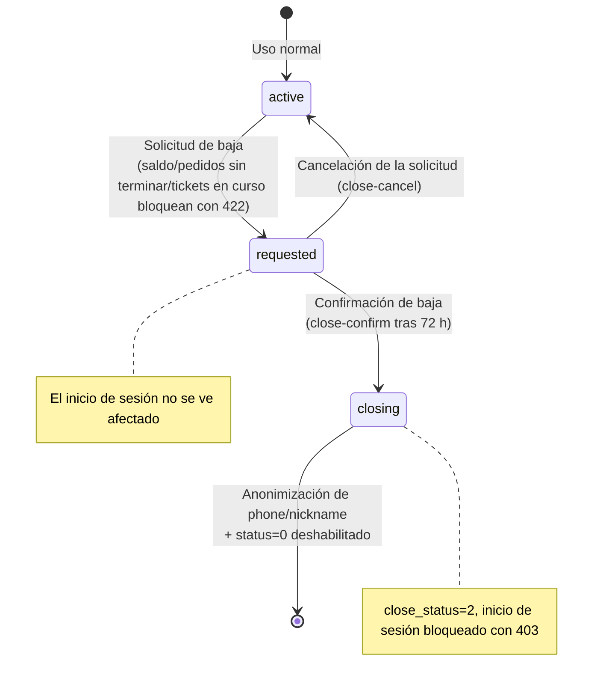
```mermaid
stateDiagram-v2
    [*] --> active: Uso normal

    active --> requested: Solicitud de baja<br/>(saldo/pedidos sin terminar/tickets en curso bloquean con 422)

    requested --> active: Cancelación de la solicitud (close-cancel)

    requested --> closing: Confirmación de baja<br/>(close-confirm tras 72 h)

    closing --> [*]: Anonimización de phone/nickname<br/>+ status=0 deshabilitado

    note right of requested: El inicio de sesión no se ve afectado
    note right of closing: close_status=2, inicio de sesión bloqueado con 403
```

## 16. Ciclo de vida de la actividad de oferta flash (ronda 24)

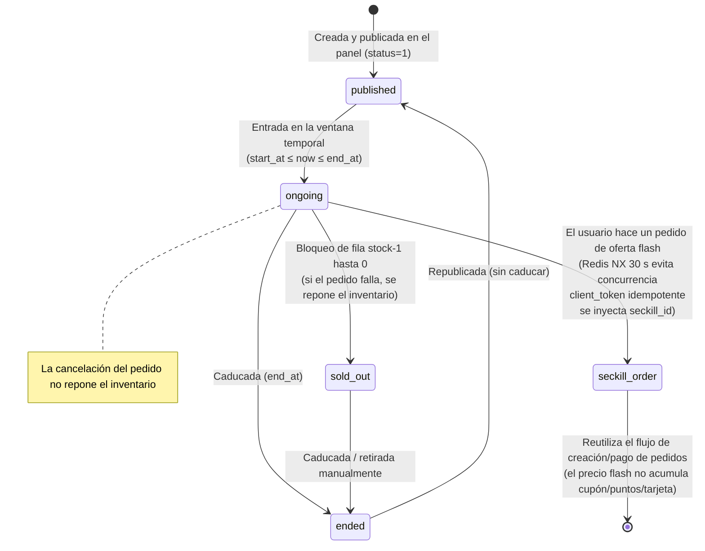
```mermaid
stateDiagram-v2
    [*] --> published: Creada y publicada en el panel (status=1)

    published --> ongoing: Entrada en la ventana temporal<br/>(start_at ≤ now ≤ end_at)

    ongoing --> sold_out: Bloqueo de fila stock-1 hasta 0<br/>(si el pedido falla, se repone el inventario)

    ongoing --> ended: Caducada (end_at)

    sold_out --> ended: Caducada / retirada manualmente

    ended --> published: Republicada (sin caducar)

    ongoing --> seckill_order: El usuario hace un pedido de oferta flash<br/>(Redis NX 30 s evita concurrencia<br/>client_token idempotente<br/>se inyecta seckill_id)

    seckill_order --> [*]: Reutiliza el flujo de creación/pago de pedidos<br/>(el precio flash no acumula cupón/puntos/tarjeta)

    note right of ongoing: La cancelación del pedido no repone el inventario
```

## 17. Ciclo de vida de la recompensa de cliente habitual (ronda 24)

```mermaid
stateDiagram-v2
    [*] --> completed: Pedido completado<br/>(WorkController::complete transacción con bloqueo de fila)

    completed --> checked: Determinación de segunda compra al mismo técnico en 30 días

    checked --> none: Primera compra / interruptor desactivado<br/>(enabled=0)

    checked --> pending: Segunda compra<br/>(bono = pago efectivo × ratio<br/>idempotente por order_id+type)

    pending --> settled: Liquidación unificada en la cadena de liquidación de comisiones<br/>(erik_technician_earnings<br/>type=return_customer)

    settled --> [*]
    none --> [*]

    note right of pending: status=pending<br/>el resumen de ingresos del extremo de técnico lo incluye automáticamente
```
