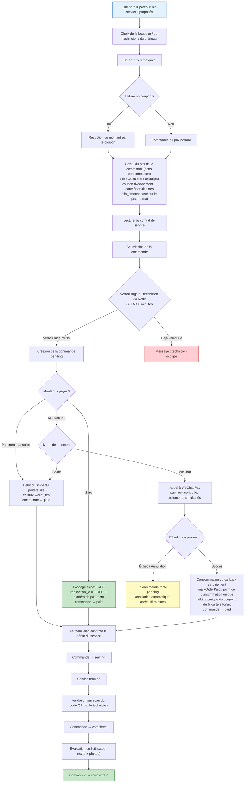
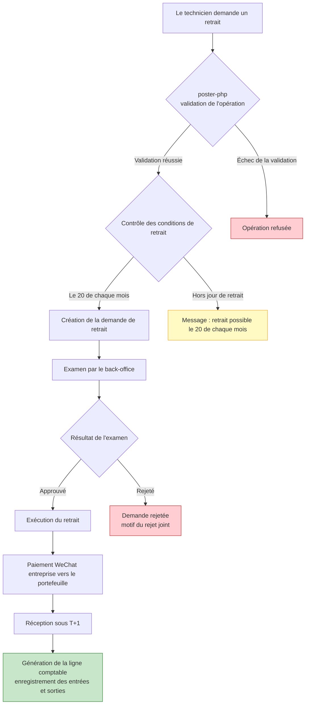
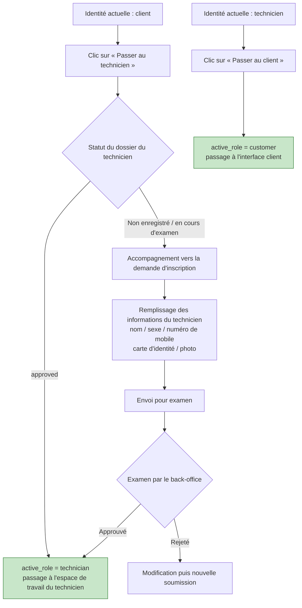
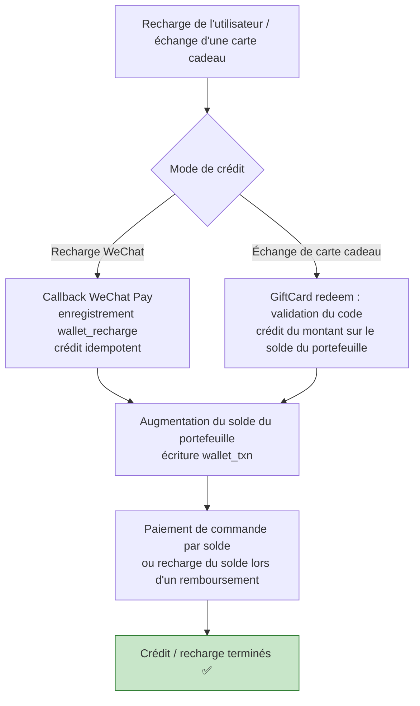

# Diagramme de flux métier

## 1. Processus de réservation de service

## 2. Processus de paiement et de remboursement

```mermaid
flowchart TD
    subgraph 支付流程["Processus de paiement"]
        P1["Création de l'enregistrement de paiement"] --> P2["Commande unifiée WeChat<br/>pay_lock anti-concurrence<br/>out_trade_no = order_no idempotent"]
        P2 --> P3["Le frontend déclenche le paiement<br/>choix du mode de paiement"]
        P3 -->|"Solde"| PB["Débit du solde du portefeuille<br/>écriture wallet_txn<br/>idempotent : débit unique"]
        P3 -->|"WeChat"| P4["Callback WeChat notify"]
        P4 --> P5["Vérification de la signature réussie"]
        PB --> P6["markOrderPaid idempotent<br/>consommation unique du coupon / de la carte à forfait"]
        P5 --> P6
        P6 --> P7["Commande → paid<br/>notification à l'utilisateur et au technicien"]
    end

    subgraph 退款流程["Processus de remboursement"]
        R1["L'utilisateur demande un remboursement<br/>refund_lock anti-concurrence"] --> R2{"Application des règles de remboursement"}
        R2 -->|"Commande ≤ 15 min ou début > 6 h"| R3["Remboursement 100 %"]
        R2 -->|"Début ≤ 6 h"| R4["Remboursement 90 %"]
        R2 -->|"Service commencé, non confirmé"| R5["Remboursement 80 %"]
        R2 -->|"Après confirmation du service"| R6["Aucun remboursement"]
        R3 --> R7["Commande → refunding"]
        R4 --> R7
        R5 --> R7
        R7 --> R8["Approbation à deux niveaux<br/>gérant → comptable"]
        R8 --> R9["Remboursement en deux temps<br/>enregistrement du remboursement dans la transaction<br/>IO de remboursement WeChat hors transaction"]
        R9 -->|"Échec WeChat"| R10["Retour de la commande à PAID<br/>remboursement réessayable"]
        R9 -->|"Remboursement réussi"| R11["Commande → refunded<br/>reversement WeChat d'origine / recharge du solde<br/>restitution du coupon + crédit de points"]
    end

    style P6 fill:#c8e6c9,stroke:#2e7d32,color:#333
    style R6 fill:#ffcdd2,stroke:#c62828,color:#333
    style R11 fill:#c8e6c9,stroke:#2e7d32,color:#333
    style R10 fill:#fff9c4,stroke:#f9a825,color:#333
```

## 3. Processus de retrait du technicien

## 4. Processus de changement d'identité

## 5. Processus de recharge du portefeuille / de crédit de carte cadeau

