# Diagrammes de cycle de vie

## 1. Cycle de vie d'une commande (machine à états)

```mermaid
stateDiagram-v2
    [*] --> pending: L'utilisateur soumet la commande

    pending --> paid: Paiement réussi<br/>(WeChat / solde / gratuit : trois canaux)

    pending --> cancelled: Annulation par expiration (15 min)<br/>annulation par l'utilisateur

    paid --> confirmed: Le technicien confirme la prise en charge<br/>consommation atomique du callback<br/>déduction du coupon / de la carte à forfait
    paid --> cancelled: Annulation par l'utilisateur<br/>(selon les règles de remboursement)
    paid --> refunding: L'utilisateur demande un remboursement
    paid --> aftersale: Demande après-vente<br/>(remboursement / échange)

    confirmed --> serving: Début du service

    serving --> completed: Service terminé + validation<br/>déduction de la carte à forfait

    serving --> refunding: Remboursement exceptionnel<br/>(80 %)

    completed --> reviewed: Évaluation de l'utilisateur
    completed --> aftersale: Demande après-vente<br/>(remboursement / échange)

    refunding --> refunded: Approbation<br/>reversement d'origine / recharge du solde<br/>restitution du coupon + crédit de points
    refunding --> paid: Rejet de l'approbation

    aftersale --> refunded: Approbation - remboursement<br/>réutilise l'interface de remboursement de commande
    aftersale --> paid: Rejet de l'approbation
    aftersale --> [*]: Approbation - échange<br/>cycle de statut terminé

    reviewed --> [*]
    cancelled --> [*]
    refunded --> [*]

    note right of pending: Verrouillage du technicien pendant 3 minutes
    note right of refunding: Approbation à deux niveaux : gérant → comptable
```

## 2. Cycle de vie d'une carte de membre

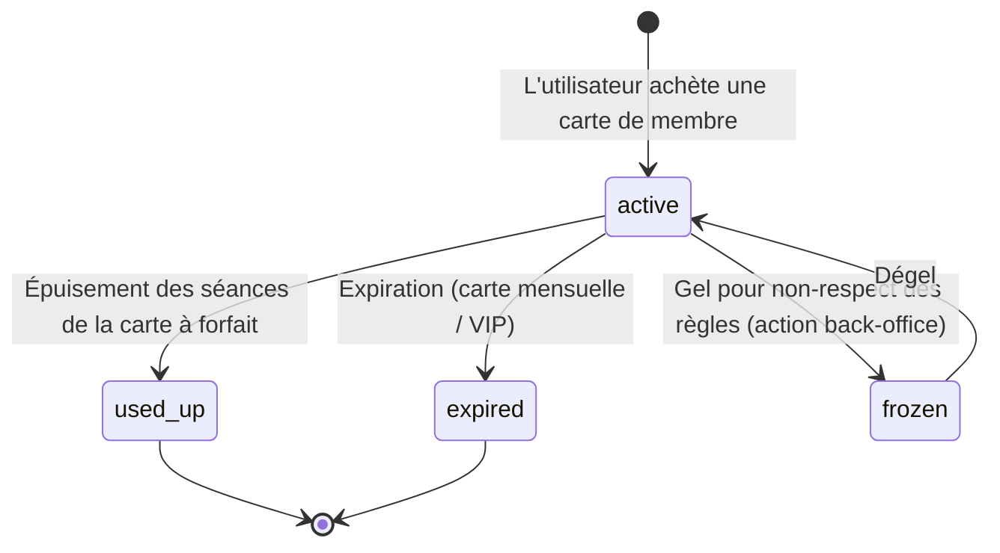

## 3. Cycle de vie de l'inscription d'un technicien

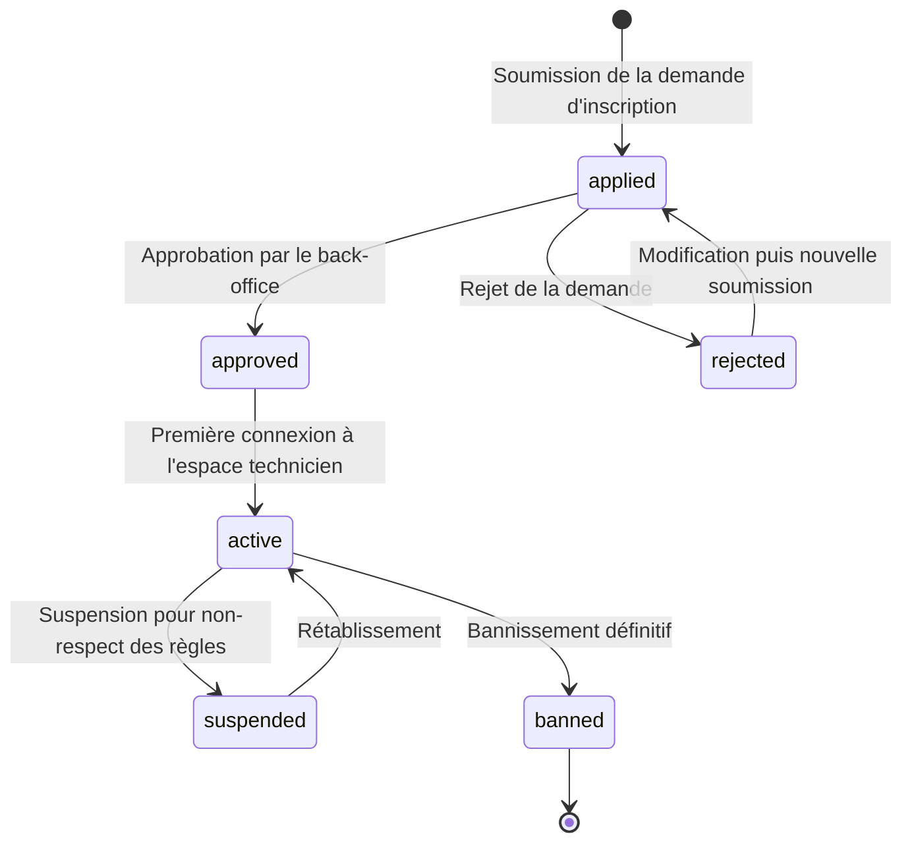

## 4. Cycle de vie d'un coupon

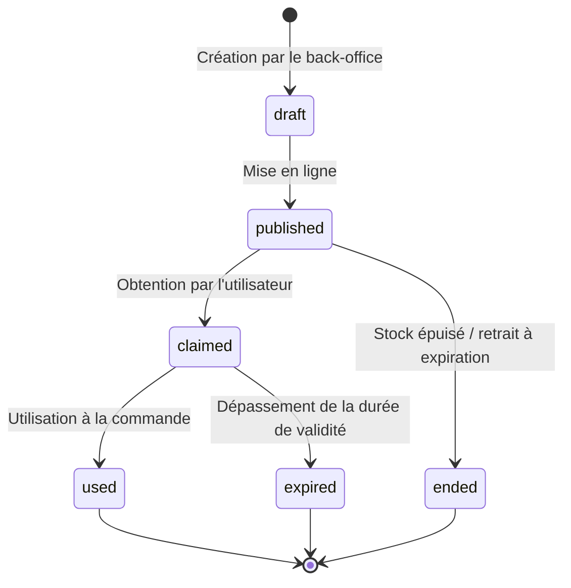

## 5. Cycle de vie d'un retrait de technicien

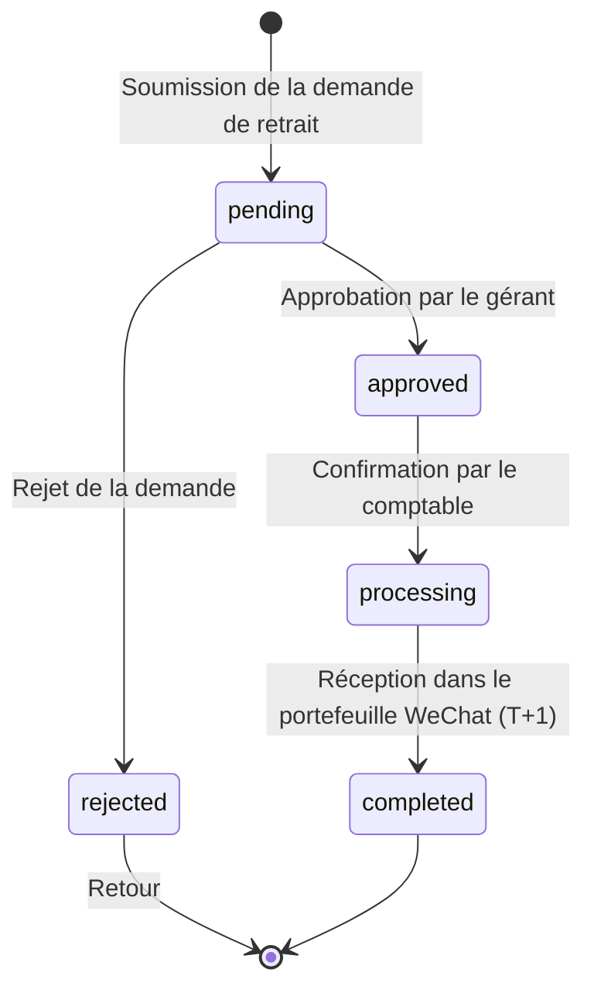

## 6. Cycle de vie de l'authentification Token

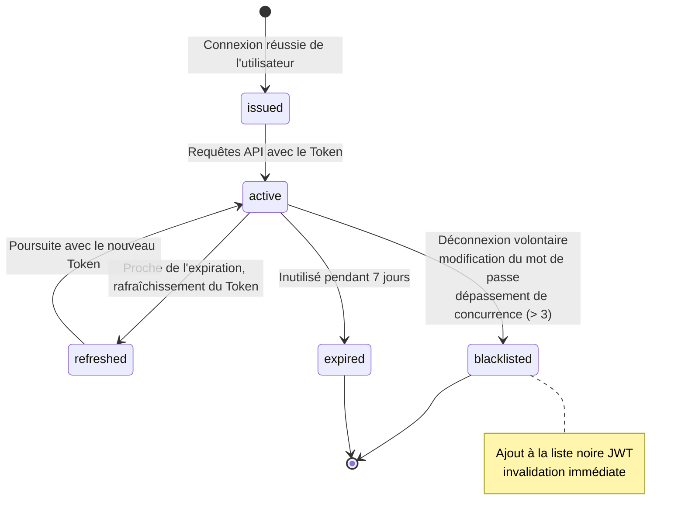

## 7. Cycle de vie d'une campagne groupée

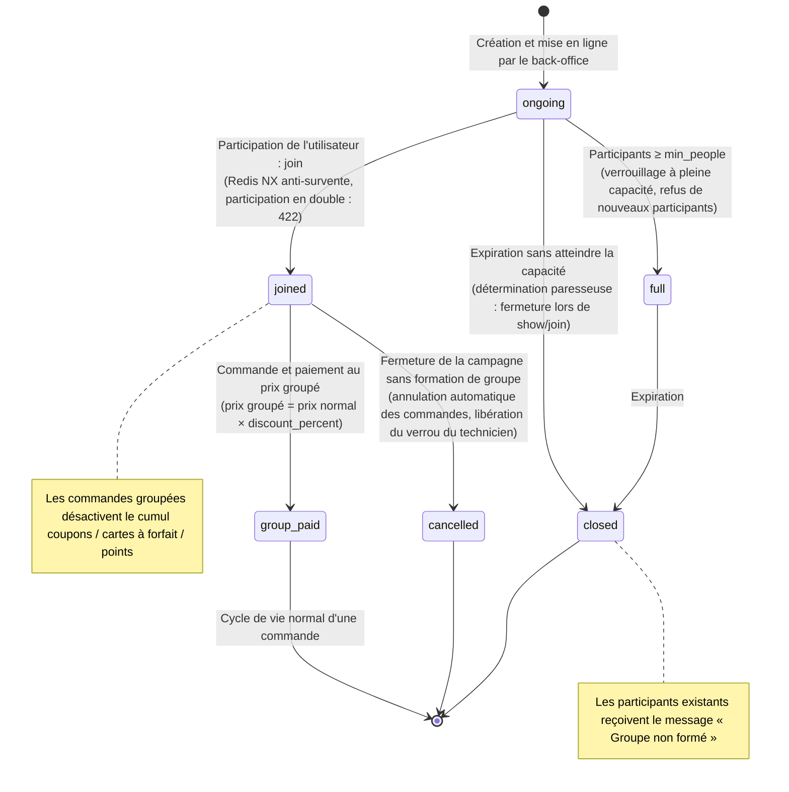

## 8. Cycle de vie d'un don de coupon

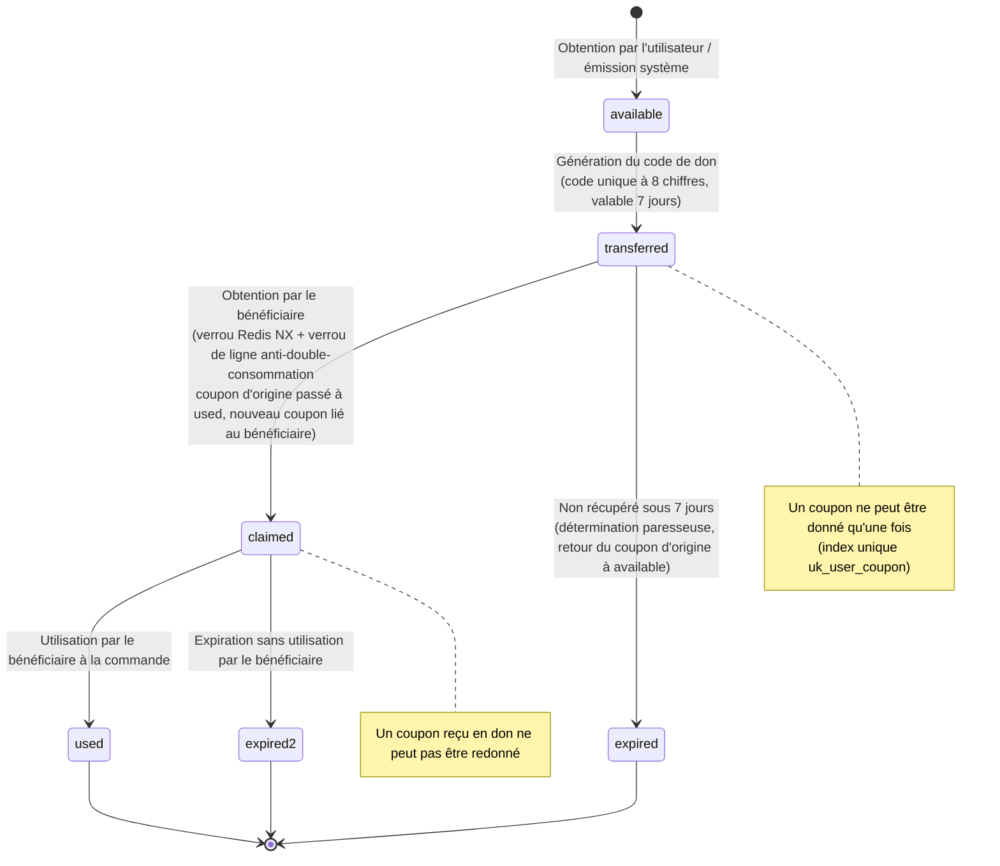

## 9. Cycle de vie de l'expiration des points

```mermaid
stateDiagram-v2
    [*] --> earned: Connexion / crédit à l'achat / compensation<br/>(expires_at = now + 365 jours)

    earned --> used: Utilisation en réduction / échange

    earned --> expired: Arrivée à expiration sans utilisation<br/>(PointsExpiryTimer : scan toutes les 60 s<br/>écriture d'une ligne de déduction négative type=expire)

    expired --> [*]: Notification interne « Points expirés »
    used --> [*]

    note right of expired: Triple idempotence : re-vérification du verrou de ligne d'origine<br/>+ pagination par curseur d'id + notifications émises uniquement par la passe de déduction
```

## 10. Cycle de vie des transferts (19e itération : transfert de solde + don de points)

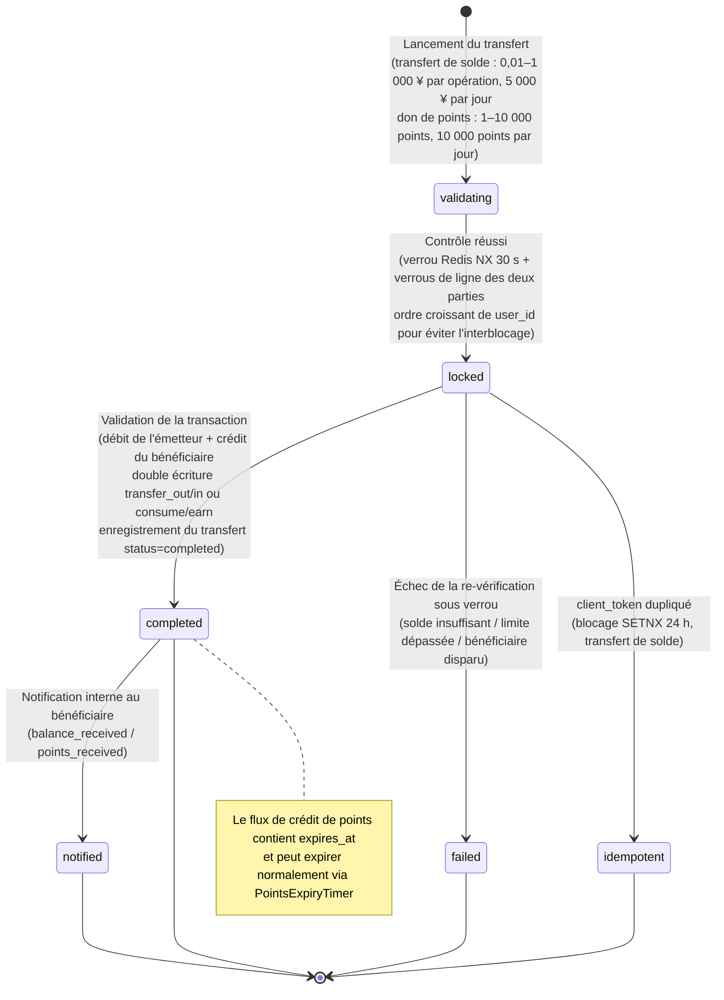

## 11. Cycle de vie d'un ticket d'assistance (20e itération)

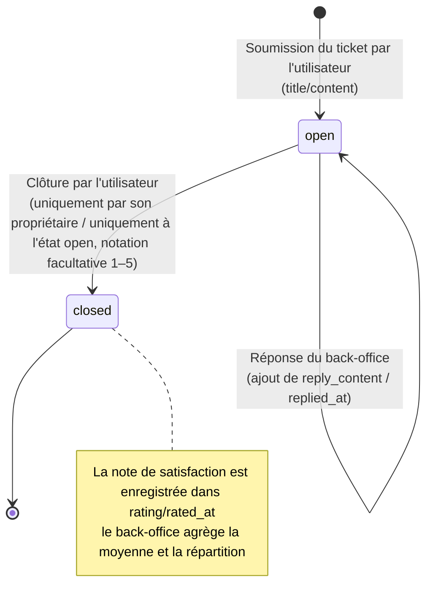

## 12. Cycle de vie d'une facture électronique (20e itération)

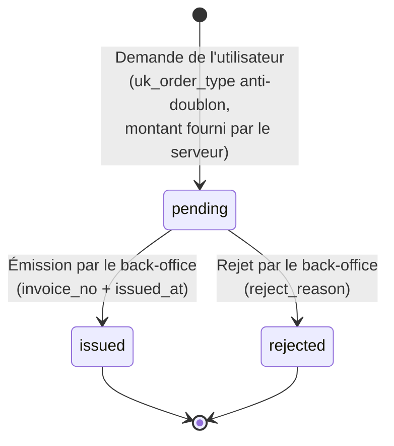

## 13. Cycle de vie d'une promotion à seuil (22e itération)

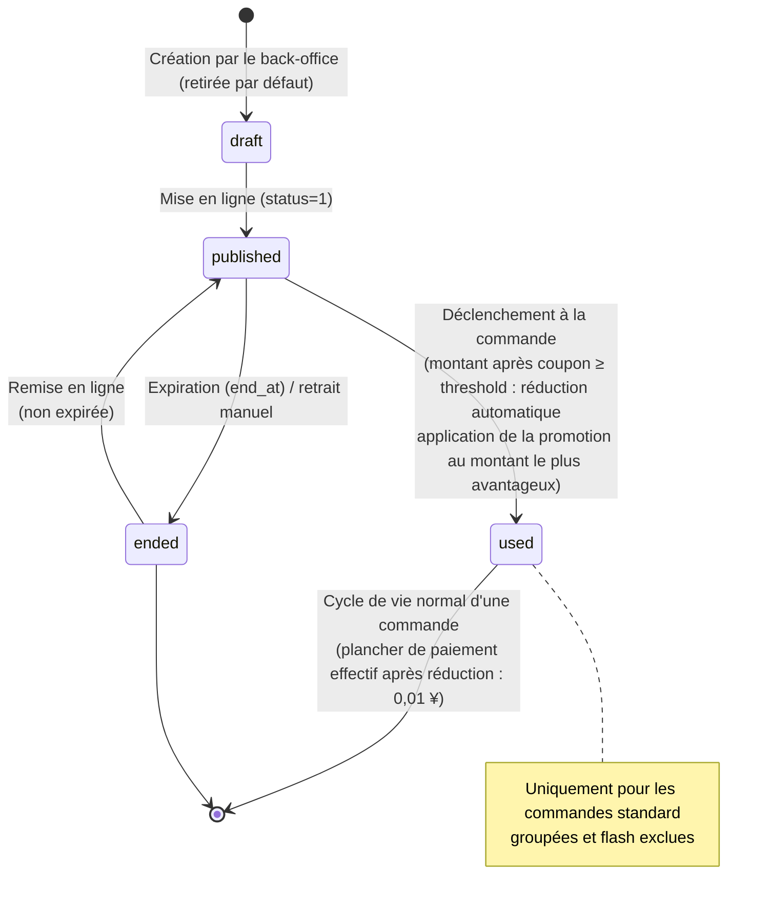

## 15. Cycle de vie du tirage à la roue (23e itération)

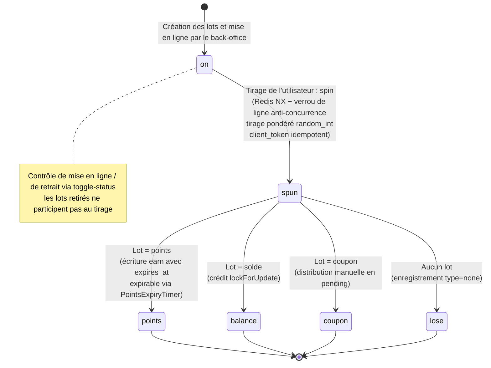

## 14. Cycle de vie de la suppression du compte (22e itération)

```mermaid
stateDiagram-v2
    [*] --> active: Utilisation normale

    active --> requested: Demande de suppression<br/>(solde / commandes non terminées / tickets en cours : blocage 422)

    requested --> active: Annulation de la demande (close-cancel)

    requested --> closing: Confirmation de suppression<br/>(close-confirm après 72 h)

    closing --> [*]: Anonymisation phone/nickname<br/>+ status=0 désactivation

    note right of requested: La connexion reste possible
    note right of closing: close_status=2 : blocage de connexion 403
```

## 16. Cycle de vie d'une vente flash (24e itération)

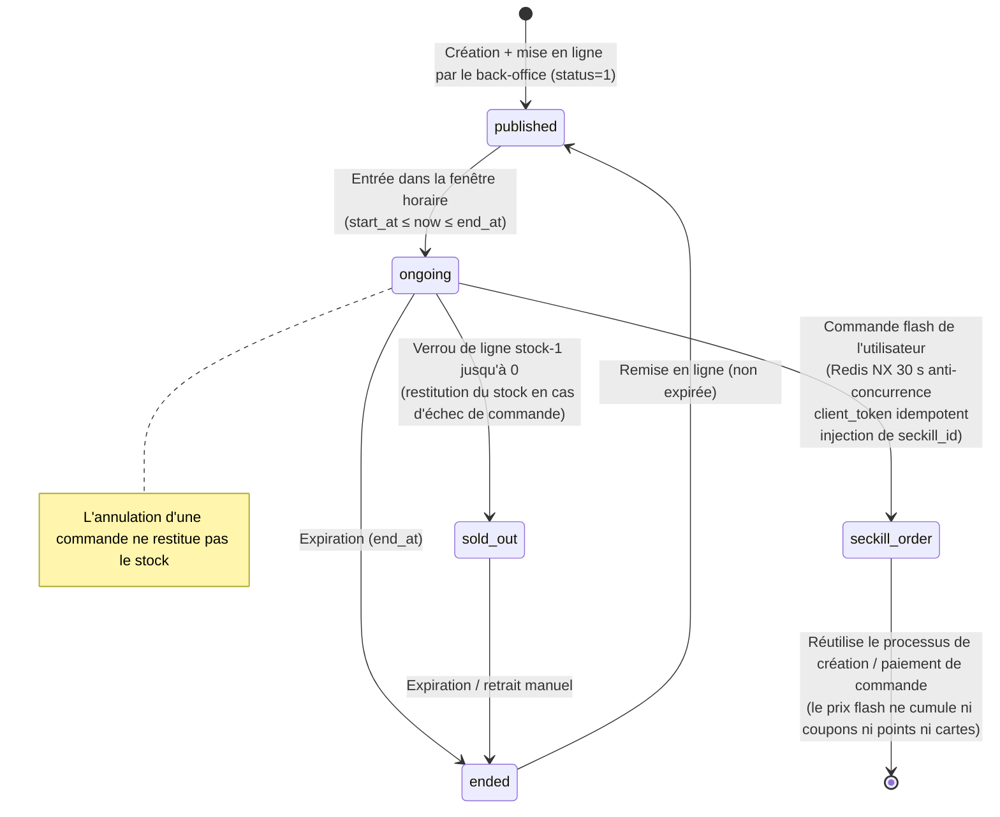

## 17. Cycle de vie de la récompense client fidèle (24e itération)

```mermaid
stateDiagram-v2
    [*] --> completed: Commande terminée<br/>(WorkController::complete : transaction avec verrou de ligne)

    completed --> checked: Détermination d'un second achat avec le même technicien sous 30 jours

    checked --> none: Premier achat / interrupteur désactivé<br/>(enabled=0)

    checked --> pending: Second achat<br/>(prime = montant payé × ratio<br/>idempotent par order_id+type)

    pending --> settled: Règlement via la chaîne de règlement des commissions<br/>(erik_technician_earnings<br/>type=return_customer)

    settled --> [*]
    none --> [*]

    note right of pending: status=pending<br/>inclus automatiquement dans le récapitulatif des revenus du technicien
```
