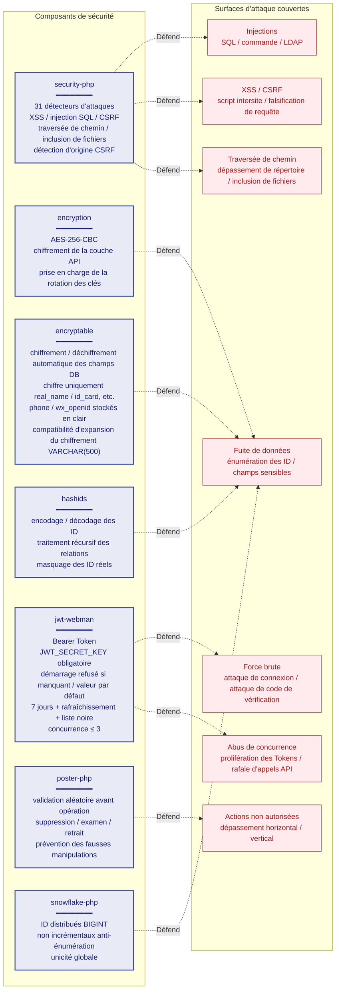
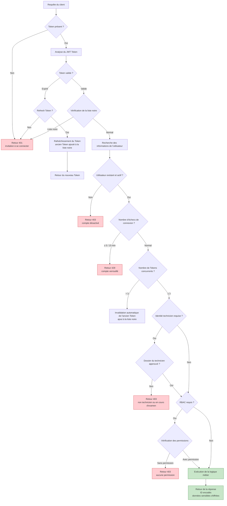
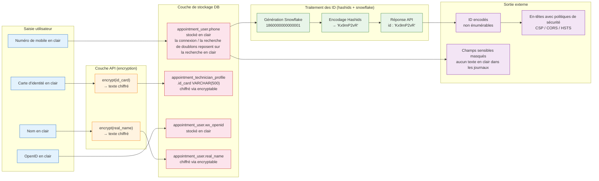

# Schéma de l'architecture de sécurité
> **Languages**: [中文](../../diagrams/SECURITY-ARCHITECTURE.md) · [English](../../en/diagrams/SECURITY-ARCHITECTURE.md) · [한국어](../../ko/diagrams/SECURITY-ARCHITECTURE.md) · [Русский](../../ru/diagrams/SECURITY-ARCHITECTURE.md) · [Deutsch](../../de/diagrams/SECURITY-ARCHITECTURE.md) · [Español](../../es/diagrams/SECURITY-ARCHITECTURE.md) · [Português](../../pt/diagrams/SECURITY-ARCHITECTURE.md) · [हिन्दी](../../hi/diagrams/SECURITY-ARCHITECTURE.md) · [العربية](../../ar/diagrams/SECURITY-ARCHITECTURE.md) · [বাংলা](../../bn/diagrams/SECURITY-ARCHITECTURE.md) · [Bahasa Indonesia](../../id/diagrams/SECURITY-ARCHITECTURE.md) · [日本語](../../ja/diagrams/SECURITY-ARCHITECTURE.md)

## 1. Système de défense en profondeur

```mermaid
graph TB
    subgraph 边界防护["Première couche : protection périmétrique"]
        WAF["WAF / Nginx<br/>en-têtes de sécurité<br/>protection des fichiers sensibles<br/>TLS 1.3"]
    end

    subgraph 接入防护["Deuxième couche : protection d'accès"]
        CORS["Middleware Cors<br/>liste blanche CORS_ALLOW_ORIGIN<br/>réponse * · non configuré : même origine uniquement<br/>6 en-têtes de sécurité<br/>pré-vérification OPTIONS"]
    end

    subgraph 攻击检测["Troisième couche : détection des attaques"]
        SEC["Middleware Security<br/>erikwang2013/security-php<br/>31 détecteurs d'attaques<br/>XSS / injection SQL / CSRF<br/>traversée de chemin / inclusion de fichiers<br/>détection d'origine CSRF (block)"]
        BLOCK["Bannissement automatique<br/>5 attaques / 60 s<br/>→ liste noire IP 15 min"]
    end

    subgraph 流量控制["Quatrième couche : contrôle du trafic"]
        RL["Middleware RateLimit<br/>fenêtre glissante Redis + atomique Lua<br/>défaut : 60 req/min/IP<br/>connexion : 10 req/min<br/>inscription : 5 req/min<br/>code de vérification : 1 req/60 s/numéro de mobile"]
    end

    subgraph 身份认证["Cinquième couche : authentification"]
        AUTH["Middleware Auth<br/>JWT Bearer Token (7 jours)<br/>JWT_SECRET_KEY obligatoire<br/>démarrage refusé si manquant / valeur publique par défaut<br/>mots de passe hachés bcrypt<br/>rafraîchissement du Token + liste noire<br/>verrouillage de connexion : 5 échecs → 15 min<br/>limite de concurrence : 3 Tokens maximum"]
        TECH_AUTH["TechnicianAuth<br/>validation du dossier du technicien<br/>contrôle du statut approved"]
        ADMIN_AUTH["AdminAuth<br/>authentification JWT du back-office<br/>liste noire des Tokens"]
    end

    subgraph 权限控制["Sixième couche : contrôle des permissions"]
        RBAC["AdminPermission<br/>vérification des permissions de rôle RBAC<br/>cache Redis 60 s<br/>utilisateur → rôle → permission"]
        POSTER["Validation Poster<br/>erikwang2013/poster-php<br/>suppression / examen / retrait<br/>validation aléatoire des opérations sensibles"]
    end

    subgraph 数据安全["Septième couche : sécurité des données"]
        ENC_API["Chiffrement de la couche API<br/>erikwang2013/encryption<br/>chiffrement / déchiffrement des champs sensibles"]
        ENC_DB["Chiffrement de la couche DB<br/>erikwang2013/encryptable<br/>chiffrement / déchiffrement automatique via trait de modèle<br/>chiffre uniquement real_name / id_card, etc.<br/>phone / wx_openid stockés en clair<br/>(la connexion / la recherche de doublons reposent sur la recherche en clair)"]
        HASHID["Chiffrement des ID<br/>erikwang2013/hashids<br/>masquage des ID réels<br/>encodage / déchiffrement récursifs"]
        SLOG["Journaux de sécurité<br/>masquage unifié des anomalies M3<br/>messages génériques + Log::error<br/>aucune donnée sensible dans les journaux<br/>OperationLog : 8 sources"]
    end

    subgraph 管理端防护["Huitième couche : protection du back-office"]
        EXCEL["Protection des exports<br/>safeCellValue()<br/>= + - @ / début par Tab / CR<br/>échappement par préfixe ' contre l'injection de formules"]
        UPLOAD["Validation des uploads<br/>finfo magic bytes<br/>MIME incompatible avec l'extension<br/>→ rejet 422"]
        INSTALL["Verrou d'installation<br/>déjà installé (installed=1<br/>ou administrateur existant)<br/>→ assistant d'installation désactivé 404"]
    end

    请求["Requête HTTP"] --> WAF
    WAF --> CORS
    CORS --> SEC
    SEC -->|"Passe"| RL
    SEC -->|"Attaque détectée"| BLOCK
    BLOCK -.->|"Rejet"| 拒绝["HTTP 403/429<br/>journalisation de l'attaque"]
    RL -->|"Passe"| AUTH
    RL -->|"Limite dépassée"| 限流拒绝["HTTP 429<br/>Retry-After"]
    AUTH --> TECH_AUTH
    AUTH --> ADMIN_AUTH
    TECH_AUTH --> RBAC
    ADMIN_AUTH --> RBAC
    RBAC --> POSTER
    POSTER --> ENC_API
    ENC_API --> ENC_DB
    ENC_DB --> HASHID
    HASHID --> SLOG
    SLOG --> EXCEL
    EXCEL --> UPLOAD
    UPLOAD --> INSTALL
    INSTALL --> 响应["HTTP Response<br/>données chiffrées et encodées"]

    classDef layer1 fill:#e3f2fd,stroke:#1565c0,stroke-width:2px,color:#01579b
    classDef layer2 fill:#bbdefb,stroke:#1976d2,stroke-width:2px,color:#01579b
    classDef layer3 fill:#ffcdd2,stroke:#c62828,stroke-width:2px,color:#b71c1c
    classDef layer4 fill:#fff9c4,stroke:#f9a825,stroke-width:2px,color:#f57f17
    classDef layer5 fill:#c8e6c9,stroke:#2e7d32,stroke-width:2px,color:#1b5e20
    classDef layer6 fill:#e1bee7,stroke:#7b1fa2,stroke-width:2px,color:#4a148c
    classDef layer7 fill:#d7ccc8,stroke:#5d4037,stroke-width:2px,color:#3e2723
    classDef layer8 fill:#cfd8dc,stroke:#37474f,stroke-width:2px,color:#263238
    classDef reject fill:#ff5252,stroke:#b71c1c,stroke-width:2px,color:#fff

    class WAF layer1
    class CORS layer2
    class SEC,BLOCK layer3
    class RL layer4
    class AUTH,TECH_AUTH,ADMIN_AUTH layer5
    class RBAC,POSTER layer6
    class ENC_API,ENC_DB,HASHID,SLOG layer7
    class EXCEL,UPLOAD,INSTALL layer8
    class 拒绝,限流拒绝 reject
```

## 2. Matrice des composants de sécurité

## 3. Processus d'authentification et d'autorisation

## 4. Flux de sécurité des données

