# अपॉइंटमेंट सेवा प्रणाली
> **Languages**: [中文](../README.md) · [English](../en/README.md) · [한국어](../ko/README.md) · [Русский](../ru/README.md) · [Deutsch](../de/README.md) · [Français](../fr/README.md) · [Español](../es/README.md) · [Português](../pt/README.md) · [العربية](../ar/README.md) · [বাংলা](../bn/README.md) · [Bahasa Indonesia](../id/README.md) · [日本語](../ja/README.md)

> हिन्दी अनुवाद · मूल: [中文](../../README.md)

चार-प्लेटफ़ॉर्म अपॉइंटमेंट सेवा प्रबंधन मंच: उपयोगकर्ता पक्ष — वीचैट मिनी प्रोग्राम + Flutter APP + HarmonyOS APP (एक ही खाते से प्लेटफ़ॉर्म स्विच), PC प्रबंधन बैकएंड।

> **परियोजना स्थिति**: सभी कार्य पूर्ण ✅ | 143 नियंत्रक (service 69 / admin 74) | 87 मॉडल | 722 परीक्षण (service 558 / admin 164) | 95 डेटा तालिकाएँ | 388 रूट (service 227 / admin 161)

## परियोजना परिचय


**अपॉइंटमेंट सेवा प्रणाली** जीवन-सेवा उद्योग के लिए एक चार-प्लेटफ़ॉर्म अपॉइंटमेंट प्रबंधन मंच है: उपयोगकर्ता पक्ष **वीचैट मिनी प्रोग्राम, Flutter APP, HarmonyOS APP** तीन प्लेटफ़ॉर्म को कवर करता है, एक ही खाते से प्लेटफ़ॉर्म के बीच स्वतंत्र रूप से स्विच करें, साथ ही **PC प्रबंधन बैकएंड**, "उपयोगकर्ता अपॉइंटमेंट → तकनीशियन ऑर्डर स्वीकार → बैकएंड संचालन" पूरी प्रक्रिया का डिजिटल बंद-लूप। चाहे स्टोर अपॉइंटमेंट, तकनीशियन सेवा, सदस्यता मार्केटिंग या वित्तीय निपटान — एक ही सिस्टम में सब कुछ।

**एक-स्टॉप अपॉइंटमेंट अनुभव**

उपयोगकर्ता तीनों प्लेटफ़ॉर्म पर समान अनुभव: कैलेंडर पर सहज समय चयन कर अपॉइंटमेंट, कूपन/सेशन कार्ड/पॉइंट्स छूट, फ्लैश सेल और समूह खरीद छूट, वीचैट/बैलेंस भुगतान, ऑर्डर स्थिति पूरी तरह ट्रैक करने योग्य — पुनर्निर्धारण, रद्दीकरण, रिफंड, आफ्टर-सेल, ई-इनवॉइस सभी प्रक्रियाएँ ऑनलाइन पूरी होती हैं; तकनीशियन पक्ष: वर्कबेंच, आने-जाने की क्लॉक-इन, बैच शेड्यूलिंग, सेवा सत्यापन और विड्रॉल अनुमोदन, संचालन दक्षता एक नज़र में स्पष्ट।

**संपूर्ण-श्रृंखला मार्केटिंग वृद्धि**

अंतर्निहित: फुल-रिडक्शन गतिविधियाँ, फ्लैश सेल, समूह खरीद, कूपन ट्रांसफर, पॉइंट्स मॉल और लकी व्हील, सदस्यता कार्ड/ग्रोथ लेवल अधिकार, दो-स्तरीय वितरण कमीशन, रिटर्न-कस्टमर पुरस्कार आदि दस से अधिक मार्केटिंग टूल; साथ में सब्सक्रिप्शन संदेश पुश और APP पुश, व्यापारियों को लगातार नए ग्राहक लाने, बनाए रखने और दोबारा खरीदने में मदद करता है।

**एंटरप्राइज़-स्तरीय सुरक्षा और अनुपालन**

स्व-विकसित सुरक्षा घटक: JWT प्रमाणीकरण, ID अस्पष्टीकरण, 31 प्रकार की आक्रमण पहचान, संवेदनशील डेटा दो-स्तरीय एन्क्रिप्शन, कीमत की सर्वर-पक्ष सत्यापन, भुगतान कॉलबैक की कड़ी तुलना और आइडेम्पोटेंसी सुरक्षा; साथ ही वीचैट आधिकारिक प्रॉफिट शेयरिंग, गोपनीयता डेटा निर्यात और खाता विलोपन, अनुपालन आवश्यकताओं को पूरा करता है।

**परिपक्व तकनीकी आधार**

PHP 8.3 + webman उच्च-प्रदर्शन रेज़िडेंट फ्रेमवर्क, MySQL 8.0 + Redis + Elasticsearch समर्थन; 95 डेटा तालिकाएँ, 388 इंटरफ़ेस, 285 सूक्ष्म-स्तरीय अनुमति बिंदु, 722 स्वचालित परीक्षण सभी पास; पूर्ण चीनी-अंग्रेज़ी वास्तुकला दस्तावेज़ और वन-क्लिक इंस्टॉल स्क्रिप्ट, आउट-ऑफ-द-बॉक्स उपयोग, आसान द्वितीयक विकास।

चाहे एकल स्टोर अपॉइंटमेंट हो या बहु-स्टोर चेन, अपॉइंटमेंट सेवा प्रणाली आपको स्थिर, सुरक्षित, स्केलेबल एकीकृत समाधान प्रदान करती है।

## परियोजना संरचना

```
appointment-php/
├── admin/                     # प्रबंधन बैकएंड (webman v2 + Flutter Web, अलग डिप्लॉयमेंट :8787)
│   ├── app/                   #   admin(बैकएंड नियंत्रक)/api/model/middleware/process/view
│   ├── apps/                  #   Flutter Web बैकएंड / HarmonyOS / वीचैट प्रबंधन पक्ष
│   ├── config/                #   रूट/डेटाबेस/प्रोसेस/प्लगिन कॉन्फ़िगरेशन
│   ├── database/              #   बैकअप स्क्रिप्ट (टेबल संरचना और सीड डेटा एकीकृत: docs/install.sql)
│   ├── tests/                 #   PHPUnit (#[\Test] एट्रिब्यूट शैली)
│   └── start.php
├── service/                   # बिज़नेस API सेवा (webman v2, अलग डिप्लॉयमेंट :8787)
│   ├── app/                   #   api/user/technician/order/wallet/marketing/notification आदि मॉड्यूल
│   ├── config/                #   रूट/डेटाबेस/प्रोसेस/भुगतान आदि कॉन्फ़िगरेशन
│   ├── support/               #   Model आधार क्लास (generateId)/Request/Response
│   ├── tests/                 #   PHPUnit
│   └── start.php
├── apps/                      # उपयोगकर्ता पक्ष फ्रंटएंड ऐप्स
│   ├── wechat/                #   वीचैट मिनी प्रोग्राम (नेटिव)
│   ├── flutter/               #   Flutter APP (iOS + Android)
│   └── harmonyos/             #   HarmonyOS APP (हार्मनी नेटिव)
└── docs/                      # परियोजना दस्तावेज़
    ├── API.md / FEATURES.md / STRUCTURE.md / install.sql / README.md ...
    └── diagrams/              #   वास्तुकला/प्रवाह आरेख (SVG + mermaid)
```

## त्वरित आरंभ

### पर्यावरण आवश्यकताएँ

- PHP 8.3+
- MySQL 8.0+
- Redis
- Composer

### वेब इंस्टॉल विज़ार्ड (अनुशंसित)

```bash
cd admin/
cp .env.example .env
composer install
php start.php start -d
```

ब्राउज़र में `http://localhost:8787/install` खोलें, निर्देशों के अनुसार डेटाबेस और व्यवस्थापक खाता भरें, इंस्टॉलेशन पूर्ण हो जाएगा।

### मैन्युअल इंस्टॉलेशन

```bash
# 1. निर्भरताएँ स्थापित करें
cd service/ && cp .env.example .env && composer install
cd ../admin/ && cp .env.example .env && composer install

# 2. वन-क्लिक डेटाबेस इम्पोर्ट (सभी 95 टेबल + अनुमति/कॉन्फ़िग सीड सहित)
mysql -u root -p < docs/install.sql

# 3. सेवा शुरू करें
cd service/ && php start.php start -d   # बिज़नेस API → :8787
cd ../admin/ && php start.php start -d  # प्रबंधन बैकएंड → :8787
```

### Docker डिप्लॉयमेंट

```bash
cd admin/ && cp .env.docker .env && docker-compose up -d
cd ../service/ && cp .env.docker .env && docker-compose up -d
```

## तकनीकी स्टैक

| स्तर | तकनीक | विवरण |
|------|------|------|
| बैकएंड फ्रेमवर्क | webman v2 (PHP 8.3+) | उच्च-प्रदर्शन रेज़िडेंट-मेमोरी HTTP सेवा |
| डेटाबेस | MySQL 8.0 | टेबल उपसर्ग `appointment_` |
| कैश | Redis | कैश/रेट-लिमिट/Session/क्यू |
| खोज | Elasticsearch | फुल-टेक्स्ट खोज (via webman-scout) |
| प्रबंधन बैकएंड फ्रंटएंड | Flutter Web | PC प्रबंधन बैकएंड शैली |
| उपयोगकर्ता पक्ष APP | Flutter | iOS + Android |
| उपयोगकर्ता पक्ष मिनी प्रोग्राम | नेटिव वीचैट मिनी प्रोग्राम | WXML/WXSS/JS |
| उपयोगकर्ता पक्ष हार्मनी APP | HarmonyOS ArkTS | नेटिव @ohos.net.http |
| ID जनरेशन | erikwang2013/snowflake-php | BIGINT गैर-ऑटो-इंक्रीमेंट प्राथमिक कुंजी |
| API ID एन्क्रिप्शन/डिक्रिप्शन | erikwang2013/hashids | बाहरी रूप से वास्तविक ID छिपाना |
| JWT प्रमाणीकरण | erikwang2013/jwt-webman | Bearer Token |
| संवेदनशील डेटा एन्क्रिप्शन | erikwang2013/encryption + encryptable | API + DB दो-स्तरीय एन्क्रिप्शन |
| सुरक्षा सुरक्षा | erikwang2013/security-php | 31 प्रकार की आक्रमण पहचान |
| ऑपरेशन सत्यापन | erikwang2013/poster-php | संवेदनशील ऑपरेशन यादृच्छिक सत्यापन |
| देश ध्वज | erikwang2013/season | राष्ट्रीय ध्वज आइकन |
| ES सिंक | erikwang2013/webman-scout | मॉडल स्वचालित सिंक |

## सिस्टम आर्किटेक्चर



## मुख्य प्रवाह

### सेवा अपॉइंटमेंट प्रवाह



### भुगतान और रिफंड प्रवाह



## ऑर्डर जीवनचक्र



## सुरक्षा आर्किटेक्चर

### सात-परत गहराई-रक्षा प्रणाली



> अधिक विस्तृत आरेख: [प्रवाह आरेख](diagrams/FLOWCHART.md) (तकनीशियन विड्रॉल/पहचान स्विच सहित) | [फ़ीचर माइंड-मैप](diagrams/FUNCTION-DIAGRAM.md) | [सभी जीवनचक्र](diagrams/LIFECYCLE-DIAGRAM.md) | [पूर्ण सुरक्षा आर्किटेक्चर](diagrams/SECURITY-ARCHITECTURE.md)

## मुख्य फ़ीचर हाइलाइट्स (राउंड 6-24)

| फ़ीचर | विवरण |
|------|------|
| स्टोरेज वॉलेट | user_wallet / wallet_recharge / wallet_txn टेबल; बैलेंस + ट्रांज़ैक्शन लॉग, वीचैट भुगतान रिचार्ज (कॉलबैक R उपसर्ग ऑर्डर नंबर), ऑर्डर बैलेंस भुगतान (pay_channel=balance), वीचैट/बैलेंस रिफंड स्वतः वॉलेट में वापस |
| प्रबंधन बैकएंड UI पूर्ण | Flutter Web 20 पेज: dashboard/उपयोगकर्ता/रोल/कॉन्फ़िगरेशन/लॉग/वेरिफिकेशन/शेड्यूल/सेवा/तकनीशियन/ऑर्डर/कूपन/सदस्य/सेशन कार्ड/घोषणा/FAQ/विड्रॉल/समीक्षा/रिपोर्ट/पर्सनल सेंटर |
| मिनी प्रोग्राम सब्सक्रिप्शन संदेश | ऑर्डर के 3 परिदृश्यों में सब्सक्रिप्शन पुश (भुगतान सफल/रिफंड प्राप्त/वेरिफिकेशन सफल); push_sent_at आइडेम्पोटेंट; टेम्पलेट कॉन्फ़िगर न होने पर स्वतः इन-ऐप नोटिफिकेशन में डिग्रेड |
| तकनीशियन विड्रॉल | प्रबंधन पक्ष अनुमोदन; राशि ≥500 दो-स्तरीय अनुमोदन (स्टोर मैनेजर → फाइनेंस); स्टेट मशीन pending→approved→completed (rejected/failed) |
| सेशन कार्ड वेरिफिकेशन बंद-लूप | मेरे सेशन कार्ड में used_up/expired रीयल-टाइम गणना; वेरिफिकेशन Redis NX आइडेम्पोटेंट + रो-लॉक सेशन घटाना, सीधे completed ऑर्डर + OrderItem + OrderPayment(pay_type='card') बनाना |
| तकनीशियन वर्कबेंच | आज के कार्य/पूर्ण रिकॉर्ड/शुरू·पूर्ण (रो-लॉक + स्टेट मशीन गार्ड + आइडेम्पोटेंसी, पूर्ण होने पर इन-ऐप नोटिफिकेशन); मिनी प्रोग्राम tech-work तीन टैब |
| कूपन छूट | PriceCalculator: applyCoupon केवल-पठनीय राशि गणना / consume भुगतान पर used स्थिति / restoreCouponAndCard रिफंड पर आइडेम्पोटेंट वापसी; fixed/percent + min_amount थ्रेशहोल्ड |
| गिफ्ट कार्ड | redeem पर cash प्रकार वॉलेट में रिचार्ज (रो-लॉक डबल-एंट्री रोकता है, WalletTxn type='gift_card'), gift प्रकार केवल चिह्नित |
| पॉइंट्स प्रणाली | चेक-इन से पॉइंट्स; वेरिफिकेशन उपभोग पर floor(paid×1) पॉइंट्स (order_id आइडेम्पोटेंट, balance स्नैपशॉट); रिफंड पर आनुपातिक वापसी; विवरण पेजिनेशन + type/source फ़िल्टर |
| सदस्यता प्रबंधन | appointment_user.member_level कॉलम (माइग्रेशन 000008); प्रबंधन पक्ष सदस्यता कार्ड पूर्ण CRUD (अनुमति 365-369) |
| मिनी प्रोग्राम ऑर्डर श्रृंखला | सेवा विवरण → ऑर्डर कन्फर्म (कूपन चयन/थ्रेशहोल्ड ग्रे/क्लाइंट अनुमानित राशि) → POST /order → वीचैट/बैलेंस भुगतान; मिनी प्रोग्राम में कुल 20 पेज |
| समूह खरीद बंद-लूप | join पर बार-बार भागीदारी 422 + पूर्ण-सदस्य लॉक + समाप्ति पर लेज़ी बंद; समूह पूर्ण होने पर store में promotion_id के साथ ग्रुप-बाय कीमत (discount_percent) पर ऑर्डर, कूपन/सेशन कार्ड/पॉइंट्स स्टैकिंग अक्षम, समूह नहीं बनने पर स्वतः ऑर्डर रद्द और तकनीशियन लॉक मुक्त (पुराना FLASH_SALE प्रोमो चैनल हटाया गया, सेकिल अलग चैनल) |
| स्टोर मैनेजर वर्कबेंच | service /api/store-manager 4 इंटरफ़ेस (overview/orders/technicians/revenue) store_id अनिवार्य अलगाव (कोई स्टोर नहीं → 403); admin स्टोर वर्कबेंच ओवरव्यू + ऑर्डर store_id फ़िल्टर + Flutter पेज + अनुमति 372 |
| वितरण कमीशन | रेफर किए गए व्यक्ति के पहले ऑर्डर के completed होने पर paid_amount × reward_rate (सिस्टम कॉन्फ़िग, डिफ़ॉल्ट 0.05) के अनुसार रेफरर को कमीशन वॉलेट में (WalletTxn referral_reward); रो-लॉक + खालीपन जाँच + पहले-ऑर्डर पुनर्जाँच तिहरा आइडेम्पोटेंसी; earnings विवरण + admin रिकॉर्ड देखें (अनुमति 379) |
| पॉइंट्स एक्सचेंज मॉल | एक्सचेंज उत्पाद/एक्सचेंज रिकॉर्ड दो टेबल; एक्सचेंज इंटरफ़ेस Redis NX + रो-लॉक ओवर-एक्सचेंज रोकता है + uk_user_goods एक ही उपयोगकर्ता एक बार; coupon कूपन जारी / wallet जमा / gift_card कार्ड-की तीन परिणाम; admin CRUD + ऑन/ऑफ शेल्फ + रिकॉर्ड (अनुमति 373-378) |
| अपॉइंटमेंट पुनर्निर्धारण | POST /api/order/reschedule/{id} उसी तकनीशियन के साथ समय बदलें; केवल pending/paid/confirmed और मूल सेवा शुरुआत से ≥6h पहले; order_lock + नए स्लॉट तकनीशियन लॉक SETNX(180s) समवर्ती ओवर-सेल रोकता है + B2 शेड्यूल संघर्ष जाँच; appointment_order_reschedule + SCENE_RESCHEDULE सब्सक्रिप्शन संदेश में लिखा |
| कूपन ट्रांसफर | 8-अंकीय अद्वितीय ट्रांसफर कोड (uk_code बैकअप, 7 दिन वैध); claim दुरुपयोग-रोधी: Redis NX लॉक + रो-लॉक पुनर्जाँच डबल-स्पेंड रोकता है, uk_user_coupon केवल एक बार ट्रांसफर, ट्रांसफर किया कूपन दोबारा ट्रांसफर नहीं, स्वयं क्लेम नहीं; लेज़ी समाप्ति पर मूल कूपन बहाल |
| पॉइंट्स समाप्ति | expires_at (डिफ़ॉल्ट 365 दिन, कॉन्फ़िग points.expiry_days); PointsExpiryTimer 60s कर्सर स्कैन type=expire ऋणात्मक घटाव (तीहरा आइडेम्पोटेंसी) + एकत्रित इन-ऐप नोटिफिकेशन; समाप्त पॉइंट्स नकद/एक्सचेंज में उपयोग नहीं |
| तकनीशियन टियर स्वतः मूल्यांकन | TierRatingService रीयल-टाइम ऑर्डर संख्या + औसत रेटिंग प्रोफ़ाइल में वापस लिखता है, tier_config के अनुसार ऊँचे से नीचे मिलान; केवल अपग्रेड, डाउनग्रेड नहीं (allowDowngrade मैन्युअल पुनर्मूल्यांकन के लिए); परिवर्तन appointment_technician_tier_log + इन-ऐप नोटिफिकेशन में; admin लॉग देखें (अनुमति 380) |
| सेकिल ऑर्डर बंद-लूप | /api/seckill गतिविधि + buy आइडेम्पोटेंट/समवर्ती-रोधी, ऑर्डर में seckill_id इंजेक्ट कर store() पुनः उपयोग, स्टॉक ट्रांज़ैक्शन के भीतर रो-लॉक में घटाया जाता है (सेकिल कीमत = seckill_price, DB ही आधार), सोल्ड-आउट 422 "खत्म हो गया", रद्द करने पर स्टॉक वापस नहीं; पुराना promotion flash_sale चैनल हटाया गया |
| सेवा शुरुआत पूर्व स्मरण | ServiceReminderTimer 60s 1 घंटे के भीतर शुरू होने वाले confirmed/serving ऑर्डर स्कैन → SCENE_REMINDER सब्सक्रिप्शन संदेश + इन-ऐप नोटिफिकेशन (order_id+type डुप्लिकेट-रोधी, तीहरा आइडेम्पोटेंसी); टेम्पलेट कॉन्फ़िगर न होने पर स्वतः इन-ऐप नोटिफिकेशन में डिग्रेड |
| समाप्ति स्मरण | ExpiryReminderTimer 6h 3 दिनों के भीतर समाप्त होने वाले सदस्यता कार्ड/कूपन स्कैन → type=card_expiry/coupon_expiry + SCENE_EXPIRY सब्सक्रिप्शन संदेश (order_id स्रोत रिकॉर्ड डुप्लिकेट-रोधी) |
| तकनीशियन समीक्षा उत्तर | POST /api/technician/review/reply/{order_id}: स्वयं का नहीं 404, डुप्लिकेट उत्तर 422, उत्तर सफल होने पर उपयोगकर्ता को इन-ऐप नोटिफिकेशन; appointment_order_review में replied_at; admin उत्तर विवरण (अनुमति 381) |
| रिचार्ज प्राप्ति सूचना | वीचैट रिचार्ज कॉलबैक ट्रांज़ैक्शन के भीतर type='wallet_recharge' इन-ऐप नोटिफिकेशन लिखना (कॉलबैक आइडेम्पोटेंसी पुनः उपयोग, उसी ट्रांज़ैक्शन में परमाणु कमिट, विफलता मुख्य प्रवाह नहीं रोकती) |
| बैलेंस ट्रांसफर | POST /api/wallet/transfer उपयोगकर्ताओं के बीच ट्रांसफर: राशि 0.01-1000/लेनदेन + दैनिक 5000 सीमा; Redis NX लॉक + दोनों वॉलेट रो-लॉक (user_id आरोही डेडलॉक-रोधी) + client_token 24h आइडेम्पोटेंसी; WalletTxn transfer_out/transfer_in दोहरा लॉग balance_after स्नैपशॉट सहित; प्राप्तकर्ता इन-ऐप नोटिफिकेशन type='balance_received' |
| पॉइंट्स ट्रांसफर | POST /api/user/points/transfer उपयोगकर्ताओं के बीच ट्रांसफर: 1-10000 पॉइंट्स + दैनिक कुल 10000 सीमा; Redis NX लॉक + दोनों पक्ष की अंतिम लॉग पर lockForUpdate (आरोही डेडलॉक-रोधी) + लॉक के भीतर पुनर्जाँच; भेजने वाले का consume/प्राप्तकर्ता का earn दोहरा लॉग (प्राप्ति में expires_at, सामान्य रूप से समाप्त हो सकता है); प्राप्तकर्ता इन-ऐप नोटिफिकेशन type='points_received' |
| समीक्षा अनुवर्ती | POST /api/order/review/{order_id}/append: स्वयं का नहीं 404/डुप्लिकेट 422/खाली सामग्री 422/गैर-completed 422, सफलता पर तकनीशियन को इन-ऐप नोटिफिकेशन type='review_append'; appointment_order_review में append_content/append_images(JSON)/append_at; साथ ही पंजीकृत उपयोगकर्ता समीक्षा रूट जोड़ा (मूल store बिना रूट पहुँच से बाहर था) और उसका गुप्त TypeError ठीक किया |
| उपयोगकर्ता पक्ष लॉजिस्टिक्स ट्रैकिंग | GET /api/order/logistics/{id}: केवल स्वयं के product ऑर्डर (404 गैर-स्वयं/गैर-उत्पाद/शिप नहीं हुआ); order.remark JSON पढ़ें (shipping_company/tracking_no/shipped_at, admin शिपिंग पर लिखता है); प्राप्तकर्ता मोबाइल मास्क 138****5678 |
| संदेश प्राथमिकता सेटिंग | appointment_user_notify_setting टेबल (uk_user_type अद्वितीय कुंजी, पंक्ति अनुपस्थित = डिफ़ॉल्ट चालू); GET/PUT /api/user/notify-settings; 5 प्रकार के स्विच service_reminder/card_expiry/points_expiry/marketing/system (system सदा चालू, बंद नहीं); notifySettingEnabled 3 टाइमर + सब्सक्रिप्शन इवेंट गेट करता है, बंद होने पर इन-ऐप नोटिफिकेशन और सब्सक्रिप्शन संदेश दोनों छोड़े जाते हैं |
| अपॉइंटमेंट मासिक कैलेंडर | GET /api/calendar/technician/{id} (मास दृश्य) + /day (दिन दृश्य): time_slots JSON में घंटे-स्लॉट विस्तार, appointment_order के पहले से बुक स्लॉट बाहर; स्टोर शेड्यूल विज़ुअलाइज़ेशन समय चयन |
| उपयोगकर्ता ग्रोथ लेवल | appointment_user_growth + appointment_growth_level (कांस्य0/चांदी100/स्वर्ण500/प्लैटिनम2000/हीरा5000); चेक-इन +10, समीक्षा +20, उपभोग प्रति 1 युआन 1 पॉइंट (मौजूदा स्थिति पुनर्जाँच का पुनः उपयोग, स्वाभाविक आइडेम्पोटेंट); GET /api/growth (overview/records/levels सार्वजनिक स्तर) |
| ई-इनवॉइस | POST/GET /api/invoices (आवेदन/सूची/विवरण): uk_order_type(order_id,order_type) डुप्लिकेट आवेदन रोकता है, राशि सर्वर से लाई जाती है; admin इनवॉइस जारी/अस्वीकार (अनुमति 382-384) |
| ग्राहक सेवा टिकट | POST/GET /api/tickets + /{id}/close: उपयोगकर्ता सबमिट/सूची/विवरण/बंद; admin उत्तर (अनुमति 385/387) |
| बहु-स्तरीय वितरण-दूसरा स्तर कमीशन | ऑर्डर भुगतान के बाद पहले-स्तर रेफरर के रेफरर को paid×level2_rate (कॉन्फ़िग 0.02): ट्रांज़ैक्शन रो-लॉक + uk_order_referred आइडेम्पोटेंसी डुप्लिकेट जारी रोकता है; WalletTxn TYPE_REFERRAL_LEVEL2; admin रिकॉर्ड देखें (अनुमति 386) |
| ग्रोथ लेवल अधिकार | GrowthLevel.benefits लागू: ऑर्डर पर लेवल अनुसार discount_rate छूट (केवल मानक ऑर्डर, कूपन/सेशन कार्ड के साथ लेवल छूट स्टैक, छूट राशि discount_amount + टिप्पणी में ट्रेस, निचली सीमा सुरक्षा 0 पर कट); भुगतान कॉलबैक पर floor(paid×points_multiplier) ग्रोथ पॉइंट्स (भुगतान के समय स्तर लिया, स्तर नहीं बढ़ाया) |
| इनवॉइस शीर्षक प्रबंधन | appointment_invoice_title सामान्य शीर्षक पुस्तकालय: सहेजें/संपादित करें/हटाएँ/डिफ़ॉल्ट (पहला स्वतः डिफ़ॉल्ट, डिफ़ॉल्ट हटाने पर स्वतः स्थानांतरण, डिफ़ॉल्ट सेट करने पर ट्रांज़ैक्शन शून्य); आवेदन पर title_id विकल्प, मैन्युअल भरना संगत रखा |
| टिकट संतुष्टि | बंद टिकट पर 1-5 स्कोर (सीमा से बाहर 422, अनुपलब्ध NULL संगत); admin संतुष्टि सारांश: औसत स्कोर/1-5 स्टार वितरण/मूल्यांकित-अनमूल्यांकित गणना (अनुमति 388) |
| समीक्षा छवि ऑडिट | admin ReviewAuditController: छवि वाली समीक्षा सूची (JSON_LENGTH फ़िल्टर + उपयोगकर्ता/तकनीशियन नाम join), छिपाएँ/बहाल करें (hide केवल visible, restore केवल hidden, 422 दो-तरफ़ा सत्यापन); छिपाने के बाद तकनीशियन समीक्षा सूची में स्वतः अदृश्य (अनुमति 389-391) |
| ब्राउज़िंग इतिहास | appointment_browse_history (uk_user_item डुप्लिकेट ब्राउज़ पर केवल viewed_at अपडेट): सेवा विवरण पर रिकॉर्ड जुड़ा (try/catch मुख्य प्रवाह नहीं रोकता, लॉगिन नहीं होने पर छोड़ें); सूची में सेवा जानकारी + hashid join; एकल/सभी हटाना केवल स्वयं |

> राउंड-8 ऑपरेशनल सुधार: 12 स्थानों के Poster::verify गुप्त fatal हटाए; DashboardController आँकड़े अब Capsule Manager क्वेरी से।
>
> राउंड-15 परिवर्धन: पॉइंट्स वापसी (रद्द/रिफंड पर points_offset पॉइंट्स लौटाना, refundOffsetPoints 5 हुक बिंदु आइडेम्पोटेंट); PromotionParticipant स्थिति पूर्णांक स्थिरांक में बदली (सख्त मोड में join 1366 क्षति ठीक)।
>
> राउंड-16 परिवर्धन: पॉइंट्स एक्सचेंज (PointsExchangeController, प्रकार consume/source=exchange); समूह खरीद ऑर्डर (appointment_order में promotion_id/participant_id कॉलम); वितरण कमीशन (ReferralRewardService WorkController::complete से जुड़ा)।
>
> राउंड-17 परिवर्धन: अपॉइंटमेंट पुनर्निर्धारण (appointment_order_reschedule + reschedule इंटरफ़ेस); कूपन ट्रांसफर (appointment_user_coupon_transfer + transfer/claim/transfers); पॉइंट्स समाप्ति (expires_at + PointsExpiryTimer प्रोसेस); तकनीशियन टियर स्वतः मूल्यांकन (TierRatingService + appointment_technician_tier_log, अनुमति 380)।
>
> राउंड-17 सुधार: AutoCancelTimer सूचना सम्मिलन में \support\Model::generateId() का उपयोग (मूल में अस्तित्वहीन Snowflake::generate() कॉल था, स्वचालित रद्द सूचना मौन रूप से विफल हो रही थी)।
>
> राउंड-18 परिवर्धन: सेकिल ऑर्डर (store() flash_sale सेकिल मूल्य समर्थन); सेवा शुरुआत पूर्व स्मरण (ServiceReminderTimer + SCENE_REMINDER); सदस्यता कार्ड/कूपन समाप्ति स्मरण (ExpiryReminderTimer + SCENE_EXPIRY); तकनीशियन समीक्षा उत्तर (review reply इंटरफ़ेस + replied_at कॉलम + अनुमति 381); रिचार्ज प्राप्ति सूचना (कॉलबैक ट्रांज़ैक्शन में type='wallet_recharge')।
>
> राउंड-19 परिवर्धन: बैलेंस ट्रांसफर (appointment_wallet_transfer + WalletTransferController, अनुमति के भीतर दोहरा रो-लॉक + client_token आइडेम्पोटेंसी); पॉइंट्स ट्रांसफर (appointment_user_points_transfer + PointsTransferController, दैनिक सीमा + दो-तरफ़ा लॉग); समीक्षा अनुवर्ती (appointment_order_review append तीन कॉलम + append इंटरफ़ेस + पंजीकृत store रूट); उपयोगकर्ता पक्ष लॉजिस्टिक्स ट्रैकिंग (logistics इंटरफ़ेस + remark JSON पार्सिंग + मोबाइल मास्क); संदेश प्राथमिकता सेटिंग (appointment_user_notify_setting + NotifySettingController + 3 टाइमर गेट)।
>
> राउंड-20 परिवर्धन: अपॉइंटमेंट मासिक कैलेंडर (CalendarController मास/दिन दृश्य + बुक स्लॉट बहिष्करण); उपयोगकर्ता ग्रोथ लेवल (appointment_user_growth + appointment_growth_level 5 स्तर + चेक-इन/समीक्षा/उपभोग हुक); ई-इनवॉइस (appointment_invoice + uk_order_type डुप्लिकेट-रोधी + बैकएंड जारी/अस्वीकार, अनुमति 382-384); ग्राहक सेवा टिकट (appointment_ticket सबमिट/सूची/विवरण/बंद + बैकएंड उत्तर, अनुमति 385/387); बहु-स्तरीय वितरण-दूसरा स्तर कमीशन (payLevel2Reward ट्रांज़ैक्शन रो-लॉक + uk_order_referred आइडेम्पोटेंसी, अनुमति 386)।
>
> राउंड-21 परिवर्धन: ग्रोथ लेवल अधिकार लागू (ऑर्डर discount_rate छूट + भुगतान points_multiplier पॉइंट्स, माइग्रेशन सीड 5 स्तर benefits); इनवॉइस शीर्षक प्रबंधन (appointment_invoice_title शीर्षक पुस्तकालय + आवेदन title_id समन्वय); टिकट संतुष्टि (बंद स्कोर rating/rated_at + admin सारांश आँकड़े, अनुमति 388); समीक्षा छवि ऑडिट (ReviewAuditController छिपाएँ/बहाल, अनुमति 389-391); उपयोगकर्ता ब्राउज़िंग इतिहास (appointment_browse_history + विवरण हुक + सूची/हटाएँ/सभी हटाएँ)।
>
> राउंड-22 परिवर्धन: फुल-रिडक्शन गतिविधि (appointment_full_reduction स्वतः कटौती + थ्रेशहोल्ड सत्यापन, अनुमति 396-400); ICS कैलेंडर निर्यात (RFC5545 मेरे अपॉइंटमेंट); तकनीशियन क्लॉक-इन उपस्थिति (appointment_technician_attendance आने-जाने की क्लॉक-इन + देरी चिह्न + admin आँकड़े, अनुमति 392-393); APP पुश सेवा (कॉन्फ़िग-संचालित एब्स्ट्रैक्शन + 5 इवेंट एकीकरण, appointment_push_log); वीचैट आधिकारिक प्रॉफिट शेयरिंग (appointment_profit_sharing_log कॉन्फ़िग-संचालित + डिग्रेड, अनुमति 394); गोपनीयता अनुपालन (डेटा निर्यात + खाता विलोपन 72h स्टेट मशीन close_status)।
>
> राउंड-23 परिवर्धन: उपयोगकर्ता स्वास्थ्य प्रोफ़ाइल (appointment_user_health_profile); वॉलेट भुगतान पासवर्ड (appointment_user_wallet pay_password सेट/सत्यापन); तकनीशियन बैच शेड्यूलिंग (batch इम्पोर्ट + ओवरलैप संघर्ष पहचान); ऑर्डर स्थिति टाइमलाइन (appointment_order_status_log 8 स्थिति ट्रैक + उपयोगकर्ता पक्ष/बैकएंड प्रदर्शन); पॉइंट्स लकी व्हील (appointment_lucky_wheel + appointment_wheel_record वेटेड ड्रॉ, अनुमति 401-406); पॉइंट्स वैधता (points.expiry_days कॉन्फ़िग + नए earn लॉग पर expires_at)।
>
> राउंड-24 परिवर्धन: गेस्ट मोड (/api/guest/* बिना लॉगिन केवल-पठनीय ब्राउज़िंग + Redis कैश); सेकिल (appointment_seckill_activity + Redis NX रो-लॉक ग्रैब + appointment_order.seckill_id इंजेक्शन ऑर्डर, अनुमति 407-411/420); APP संस्करण प्रबंधन और अपडेट जाँच (appointment_app_version + /api/app/version, अनुमति 416-419); रिटर्न-कस्टमर पुरस्कार (30 दिन में दूसरी खरीद बोनस type=return_customer, अनुमति 412-414); शेड्यूल CSV निर्यात (UTF-8 BOM + समय स्लॉट विवरण, अनुमति 415)।
>
> 2026-08-26 सुरक्षा सुदृढ़ीकरण: ऑर्डर इंटरफ़ेस की आइटम कीमतें हमेशा डेटाबेस रिकॉर्ड के अनुसार (क्लाइंट कीमत अविश्वसनीय, अज्ञात target_type 422, target_id hashid अनिवार्य), समूह खरीद/सेकिल कीमत भी DB आधारित; सेकिल स्टॉक एकीकृत रूप से /api/order store() ट्रांज़ैक्शन के भीतर रो-लॉक घटाव (SeckillController::buy अब पूर्व-घटाव नहीं, Redis गतिविधि लॉक + client_token आइडेम्पोटेंसी बरकरार); तकनीशियन विड्रॉल आवेदन पर इन-फ्लाइट आरक्षण, अनुमोदन ट्रांसफर से पहले पुनर्जाँच, समवर्ती अनुमोदन पर डबल-पेमेंट रोक; वीचैट भुगतान कॉलबैक total_fee ऑर्डर देय से कड़ी तुलना, अलीपे कॉलबैक लॉग मास्क; /install सफलता पर .install.lock लिखना दोहरा सत्यापन पुनः-इंस्टॉल रोकता है; निर्भरता संस्करण समेकन (webman-scout 2.0.5 / opensearch-php ^2.6 / dompdf, security-php, webman-database सटीक लॉक); दोनों ऐप्स के phpstan.neon मरम्मत योग्य (php -d memory_limit=2G)।

## दस्तावेज़ नेविगेशन

| दस्तावेज़ | विवरण |
|------|------|
| [आर्किटेक्चर विवरण](ARCHITECTURE.md) | सिस्टम आर्किटेक्चर, तीन पक्ष संबंध, तकनीकी घटक, डेटा प्रवाह |
| [फ़ीचर विवरण](FEATURES.md) | उपयोगकर्ता पक्ष/तकनीशियन पक्ष/प्रबंधन बैकएंड पूर्ण फ़ीचर सूची |
| [आर्किटेक्चर डिज़ाइन](ARCHITECTURE-DESIGN.md) | लेयर्ड डिज़ाइन, मिडलवेयर चेन, डेटाबेस डिज़ाइन, सुरक्षा डिज़ाइन |
| [फ़ीचर डिज़ाइन](FEATURE-DESIGN.md) | मुख्य बिज़नेस प्रवाह, बिज़नेस नियम, स्टेट मशीन, रिफंड नियम |
| [API दस्तावेज़](API.md) | बिज़नेस API + प्रबंधन बैकएंड API, अनुरोध/प्रतिक्रिया उदाहरण + OpenAPI एंडपॉइंट सहित |
| [इंस्टॉलेशन विवरण](INSTALL.md) | पर्यावरण आवश्यकताएँ, Docker डिप्लॉयमेंट, पर्यावरण चर, तृतीय-पक्ष कॉन्फ़िगरेशन, सामान्य समस्याएँ |
| [उपयोग विवरण](USAGE.md) | प्रबंधन बैकएंड कॉन्फ़िगरेशन, उपयोगकर्ता पक्ष/तकनीशियन पक्ष संचालन, रिफंड नियम (API इंटरफ़ेस के लिए API.md देखें) |
| [परियोजना संरचना](STRUCTURE.md) | पूर्ण निर्देशिका लेआउट, मिडलवेयर निष्पादन श्रृंखला, डेटाबेस टेबल सूची |
| [परीक्षण रिपोर्ट](TEST-REPORT.md) | पूर्ण परीक्षण कवरेज ऑडिट (558 मामले / 2508 एसर्शन) |
| [डिज़ाइन विनिर्देश](specs/2026-05-26-appointment-system-design.md) | सिस्टम डिज़ाइन विनिर्देश |
| [कार्यान्वयन योजना](plans/2026-05-26-appointment-system-plan.md) | चरणबद्ध कार्यान्वयन योजना |

## परियोजना का समर्थन / Support

यदि यह परियोजना आपके लिए उपयोगी है, तो आपका समर्थन स्वागत योग्य है! आपके प्रोत्साहन के लिए धन्यवाद :heart:

If this project helps you, your support is welcome and appreciated!

<table>
  <tr>
    <td align="center" width="50%">
      <br>
      <b>वीचैट भुगतान</b><br>WeChat Pay
    </td>
    <td align="center" width="50%">
      <br>
      <b>अलीपे</b><br>Alipay
    </td>
  </tr>
</table>

### वैश्विक बैंक ट्रांसफर / Global Bank Transfer

वैश्विक बैंक ट्रांसफर दान स्वीकार हैं (हाँगकाँग डॉलर / चीनी युआन / अमेरिकी डॉलर / अन्य मुद्राएँ), आपकी उदारता के लिए धन्यवाद :heart:

Global bank transfer donations are welcome (HKD / CNY / USD / other currencies). Thank you for your generosity!

| आइटम Item | विवरण Details |
|-----------|-------------|
| प्राप्तकर्ता का नाम Beneficiary Name | WANG KEXUN |
| प्राप्तकर्ता खाता संख्या Account Number | 881015918251 |
| प्राप्तकर्ता बैंक Bank | ZA Bank Limited (SWIFT Code: AABLHKHHXXX, बैंक कोड Bank Code: 387) |
| बैंक का पता Bank Address | Core F, Cyberport 3, 100 Cyberport Road, Hong Kong |

> **अंतरराष्ट्रीय रीमिटेंस मध्यस्थ बैंक (यदि आवश्यक हो) / Intermediary Bank (if required)**
> यह अंतरराष्ट्रीय रीमिटेंस मध्यस्थ (ट्रांज़िट) बैंक की जानकारी है, प्राप्तकर्ता बैंक की नहीं। कृपया अपने रीमिटिंग बैंक से पूछें कि क्या इसे प्रदान करना आवश्यक है।
> Note: this is intermediary bank information, not the receiving bank. Please check with your remitting bank whether it is required.
>
> - HKD / CNY / USD रीमिटेंस के लिए (For HKD / CNY / USD): **Citibank N.A. Hong Kong** — SWIFT Code: CITIHKHXXXX, बैंक कोड Bank Code: 006, शाखा का नाम Branch: Hong Kong Branch, शाखा कोड Branch Code: 391, पता Address: Citibank Tower, Citibank Plaza, 3 Garden Road, Central, Hong Kong
> - अन्य मुद्राओं के लिए (For other currencies): **The Bank of New York Mellon** — SWIFT Code: IRVTUS3NXXX, पता Address: 240 Greenwich Street, New York, United States

## कॉपीराइट

Copyright (c) 2026 erik <erik@erik.xyz> — https://erik.xyz
