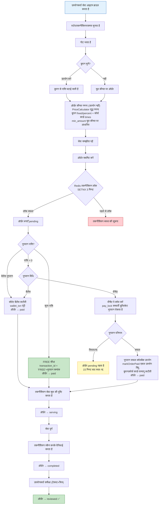
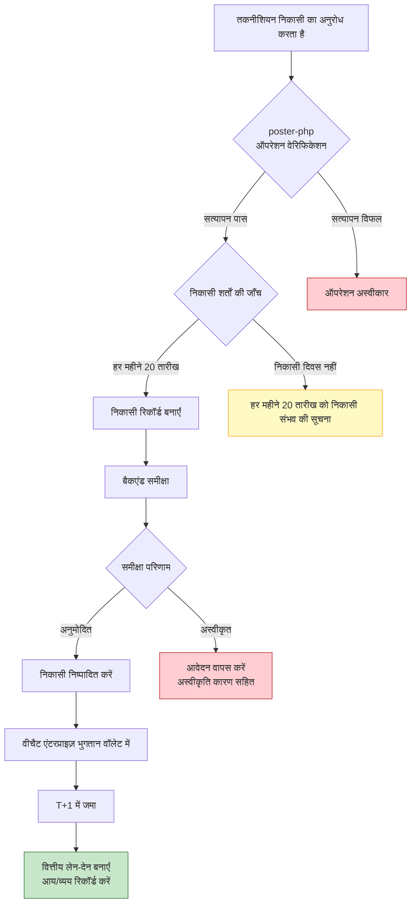
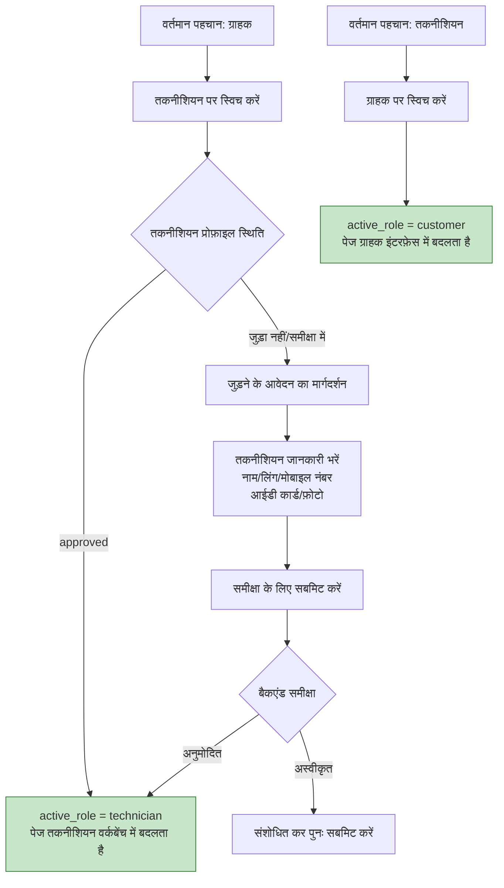
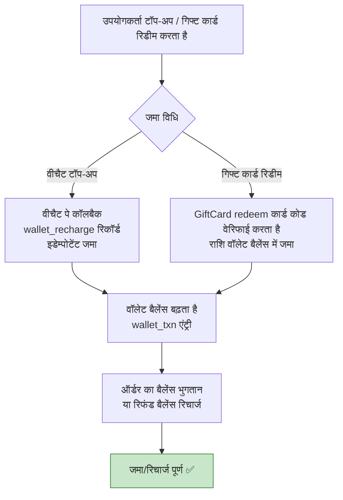

# मुख्य व्यावसायिक प्रक्रिया प्रवाह आरेख

## 1. सेवा आरक्षण प्रक्रिया

## 2. भुगतान और रिफंड प्रक्रिया

```mermaid
flowchart TD
    subgraph pay_flow["सामान्य भुगतान प्रक्रिया"]
        P1["भुगतान रिकॉर्ड बनाएँ"] --> P2["वीचैट यूनिफाइड ऑर्डर<br/>pay_lock समवर्ती रोकथाम<br/>out_trade_no = order_no इडेम्पोटेंट"]
        P2 --> P3["फ्रंटएंड भुगतान शुरू करता है<br/>भुगतान विधि चुनें"]
        P3 -->|"बैलेंस"| PB["वॉलेट बैलेंस कटौती<br/>wallet_txn एंट्री<br/>इडेम्पोटेंट केवल एक बार कटौती"]
        P3 -->|"वीचैट"| P4["वीचैट कॉलबैक notify"]
        P4 --> P5["सिग्नेचर सत्यापन पास"]
        PB --> P6["markOrderPaid इडेम्पोटेंट<br/>कूपन/कोर्स कार्ड केवल यहीं उपभोग"]
        P5 --> P6
        P6 --> P7["ऑर्डर → paid<br/>उपयोगकर्ता+तकनीशियन को सूचित करें"]
    end

    subgraph refund_flow["रिफंड प्रक्रिया"]
        R1["उपयोगकर्ता रिफंड का अनुरोध करता है<br/>refund_lock समवर्ती रोकथाम"] --> R2{"रिफंड नियम निर्धारण"}
        R2 -->|"ऑर्डर ≤15min या शुरू से >6h"| R3["रिफंड 100%"]
        R2 -->|"शुरू से ≤6h"| R4["रिफंड 90%"]
        R2 -->|"शुरू हुआ पर वेरिफाई नहीं"| R5["रिफंड 80%"]
        R2 -->|"सेवा वेरिफाई के बाद"| R6["कोई रिफंड नहीं"]
        R3 --> R7["ऑर्डर → refunding"]
        R4 --> R7
        R5 --> R7
        R7 --> R8["दो-स्तरीय अनुमोदन<br/>स्टोर मैनेजर→वित्त"]
        R8 --> R9["दो-चरणीय रिफंड<br/>ट्रांज़ैक्शन में रिफंड रिकॉर्ड बनाना<br/>ट्रांज़ैक्शन बाहर वीचैट रिफंड IO"]
        R9 -->|"वीचैट विफल"| R10["ऑर्डर PAID में रोलबैक<br/>रिफंड पुनः प्रयास कर सकते हैं"]
        R9 -->|"रिफंड सफल"| R11["ऑर्डर → refunded<br/>वीचैट मूल मार्ग वापसी / बैलेंस रिचार्ज<br/>कूपन वापसी + पॉइंट्स वापस"]
    end

    style P6 fill:#c8e6c9,stroke:#2e7d32,color:#333
    style R6 fill:#ffcdd2,stroke:#c62828,color:#333
    style R11 fill:#c8e6c9,stroke:#2e7d32,color:#333
    style R10 fill:#fff9c4,stroke:#f9a825,color:#333
```

## 3. तकनीशियन निकासी प्रक्रिया

## 4. पहचान स्विचिंग प्रक्रिया

## 5. वॉलेट टॉप-अप / गिफ्ट कार्ड जमा प्रक्रिया

