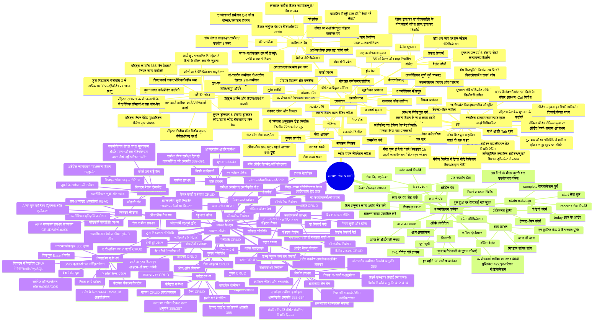

# सिस्टम फ़ंक्शन आरेख

```mermaid
mindmap
  root((आरक्षण सेवा प्रणाली))
    उपयोगकर्ता एंड
      प्रमाणीकरण
        मोबाइल पंजीकरण/लॉगिन
        सत्यापन कोड लॉगिन
        वीचैट अधिकृत लॉगिन
        गेस्ट मोड
        पासवर्ड भूलना
        उपयोगकर्ता/गोपनीयता समझौता
      होम पेज
        LBS लोकेशन और शहर स्विचिंग
        बैनर/घोषणाएँ
        सेवा श्रेणी प्रवेश
        नए उपयोगकर्ता कूपन
      सेवा आरक्षण
        स्टोर चयन नेविगेशन सहित
        तकनीशियन चयन रेटिंग सहित
        सेवा समय चयन
        ऑफ-पीक 9% छूट / पहले आरक्षण 5% छूट
        कूपन उपयोग
        नोट और सेवा समझौता
      प्रोडक्ट मॉल
        प्रोडक्ट खोज और फ़िल्टर
        प्रोडक्ट विवरण और पसंदीदा
        कार्ट प्रबंधन
        तुरंत खरीदें
      ऑर्डर प्रबंधन
        सभी ऑर्डर Tab दृश्य
        भुगतान लंबित/शिपमेंट लंबित/डिलीवरी लंबित
        रद्द/शिपमेंट रिमाइंडर/रसीद की पुष्टि
        रिफंड आवेदन
        आफ्टरसेल आवेदन वापसी/एक्सचेंज स्थिति ट्रैकिंग
        पॉइंट्स कैशबैक भुगतान के समय कटौती
        ग्रुप-बाय ऑर्डर गतिविधि में शामिल होकर समूह मूल्य पर ऑर्डर
        सेकिल ऑर्डर सेकिल मूल्य पर ऑर्डर बिक्री-समाप्त अवरोधन
        आरक्षण रीशेड्यूल उसी तकनीशियन के साथ समय बदलें शुरू से ≥6h
        आरक्षण कैलेंडर शिड्यूल माह/दिन दृश्य पहले से बुक बाहर
        सेवा शुरू होने से पहले रिमाइंडर 1h पहले सब्सक्रिप्शन मैसेज+इन-स्टेशन
        टेक्स्ट+चित्र समीक्षा
        समीक्षा पूरक अतिरिक्त कंटेंट/चित्र एक बार
        लॉजिस्टिक्स ट्रैकिंग शिपमेंट स्थिति/मास्क किया गया प्राप्तकर्ता
        इलेक्ट्रॉनिक इनवॉइस आवेदन/सूची/विवरण डुप्लिकेट रोकथाम
        ICS कैलेंडर निर्यात 90 दिनों के भीतर आरक्षण iCal निर्यात
        ऑर्डर टाइमलाइन स्थिति परिवर्तन रिकॉर्ड/केवल स्वयं
        इनवॉइस टाइटल सामान्य टाइटल लाइब्रेरी/डिफ़ॉल्ट
        मैसेज प्रेफरेंस सेटिंग्स नोटिफिकेशन स्विच/टाइमर गेटिंग
      तकनीशियन मॉड्यूल
        तकनीशियन सूची दूरी क्रमबद्ध
        तकनीशियन विवरण और पसंदीदा
        जुड़ने का आवेदन
        बैच शिड्यूलिंग दिनांक अवधि ≤7 दिन/ओवरलैप संघर्ष जाँच
      मार्केटिंग सेंटर
        कूपन प्राप्त करें/ऑर्डर कटौती
        कूपन ट्रांसफर 8-अंकीय ट्रांसफर कोड/डबल-स्पेंड रोकथाम/7 दिन वैध
        मेम्बर कार्ड मासिक कार्ड/VIP/कोर्स कार्ड
        कोर्स कार्ड वेरिफिकेशन my/use
        पॉइंट्स अर्जन और रिडीम/उपभोग वापसी
        पॉइंट्स समाप्ति 365 दिन वैधता/नियत समय कटौती
        पॉइंट्स रिडीम मॉल रिडीम कूपन/बैलेंस/गिफ्ट कार्ड
        ग्रुप-बाय/सेकिल शामिल हों/पूर्ण लॉक/समूह ऑर्डर
        कार्ड कूपन समाप्ति रिमाइंडर 3 दिनों के भीतर समाप्ति सूचना
        गिफ्ट कार्ड नकद/भौतिक/रिडीम जमा
        पॉइंट्स ट्रांसफर उपयोगकर्ताओं के बीच/दैनिक सीमा/दो-तरफ़ा लेन-देन
        दो-स्तरीय कमीशन दो-स्तरीय रेफ़रल 2% कमीशन
        फुल-रिडक्शन गतिविधि X से अधिक पर Y घटाएँ/ऑर्डर पर स्वतः लागू
        पॉइंट्स स्पिन वेटेड ड्रा/पॉइंट्स बैलेंस कूपन/lose
      वॉलेट
        बैलेंस क्वेरी
        टॉप-अप जमा पर इन-स्टेशन नोटिफिकेशन
        बैलेंस भुगतान
        रिफंड रिचार्ज
        बैलेंस ट्रांसफर उपयोगकर्ताओं के बीच/दोहरी पंक्ति लॉक/ट्रांसफर रिकॉर्ड
        भुगतान पासवर्ड 6-अंकीय सेट/सत्यापन/परिवर्तन
      व्यक्तिगत केंद्र
        अवतार/उपनाम/मोबाइल नंबर
        पहचान स्विचिंग ग्राहक↔तकनीशियन
        मैसेज नोटिफिकेशन
        मेरे पसंदीदा
        ब्राउज़िंग हिस्ट्री हाल ही में देखी गई सेवाएँ
        स्वास्थ्य प्रोफ़ाइल एलर्जी हिस्ट्री/पसंदीदा तकनीशियन
        आधिकारिक अकाउंट फ़ॉलो करें
        उपयोगकर्ता प्रमोशन QR कोड पोस्टर/कमीशन विवरण
        ग्रोथ लेवल साइन-इन/समीक्षा/उपभोग 5 स्तर
        लेवल लाभ ऑर्डर छूट/पॉइंट्स मल्टीप्लायर
        कस्टमर सर्विस टिकट सबमिट/सूची/विवरण/बंद
        टिकट संतुष्टि बंद पर रेटिंग/बैकएंड सारांश
        फीडबैक
      सेटिंग्स
        पासवर्ड बदलें
        मोबाइल रीबाइंड
        समझौता देखें
        अपडेट जाँचें
        गोपनीयता अनुपालन डेटा निर्यात/डिलीट 72h क्लोज-लूप
        अकाउंट डिलीट

    तकनीशियन वर्कबेंच
      अटेंडेंस पंच
        काम पर पंच लेट मार्क
        काम से पंच
      वर्कबेंच क्लोज-लूप
        today आज के ऑर्डर
        records सेवा रिकॉर्ड
        start सेवा शुरू
        complete वेरिफिकेशन पूर्ण
      आज का सारांश
        आज के ऑर्डर की संख्या
        आय अवलोकन
      शिड्यूल प्रबंधन
        दिन अनुसार समय अवधि सेट करें
        आरक्षण समय प्रकाशित करें
      ऑर्डर प्रोसेसिंग
        बुक हुआ पर वेरिफाई नहीं सूची
        पूर्ण सूची
        स्कैन वेरिफिकेशन
      मेम्बर प्रबंधन
        सेवा दिए गए मेम्बर
        पाठ उपभोग डेटा
        कोर्स कार्ड रिकॉर्ड
        मेम्बर प्रोफ़ाइल संपादन
      समीक्षा इंटरैक्शन
        उपयोगकर्ता समीक्षा का उत्तर 404/डुप्लिकेट 422/इन-स्टेशन नोटिफिकेशन
      आय प्रबंधन
        आज की आय
        निपटान लंबित राशि
        वॉलेट बैलेंस
        इन-ट्रांज़िट फंड 3 दिन स्वतः पुष्टि
      निकासी
        हर महीने 20 तारीख आवेदन
        T+1 वीचैट वॉलेट जमा
        न्यूनतम/रिटेन/सौ के गुणक सीमाएँ
      रिटर्न-कस्टमर रिवॉर्ड
        30 दिनों के भीतर दूसरी बार उपभोग पर बोनस
      प्रोफेशनल ट्रेनिंग
        वीडियो कोर्स
        टेक्स्ट+चित्र कोर्स

    प्रबंधन बैकएंड
      डैशबोर्ड
        रीयल-टाइम स्टैटिस्टिक्स पैनल
        ऑर्डर/राशि ट्रेंड ग्राफ़
        नए उपयोगकर्ता/सक्रियता
        क्विक नेविगेशन
        इन-स्टेशन मैसेज
      तकनीशियन प्रबंधन
        तकनीशियन सूची और खोज
        जोड़ें/निर्यात
        जुड़ने के आवेदन की समीक्षा
        शिड्यूल/सेवा आइटम सेटिंग्स
        कोर्स प्रगति ट्रैकिंग
        तकनीशियन लेवल स्वतः मूल्यांकन ऑर्डर मात्रा+औसत रेटिंग/केवल ऊपर नीचे नहीं/परिवर्तन लॉग
        अटेंडेंस सांख्यिकी माह/तकनीशियन समूह/लेट
      उपयोगकर्ता प्रबंधन
        मेम्बर सूची और खोज
        विवरण/लेवल सेटिंग
        सुपीरियर/पासवर्ड/मोबाइल संशोधन
      स्टोर प्रबंधन
        स्टोर CRUD
        सक्षम/अक्षम नियंत्रण
        मैप कोऑर्डिनेट कॉन्फ़िगरेशन
        स्टोर वर्कबेंच अवलोकन/ऑर्डर फ़िल्टर
      सेवाएँ और प्रोडक्ट
        सेवा आइटम CRUD
        प्रोडक्ट CRUD
        श्रेणी ट्री प्रबंधन
        कार्ड आइटम डिज़ाइन आइटम+प्रोडक्ट कॉम्बो
      मॉल प्रबंधन
        मॉल ऑर्डर/शिपमेंट/लॉजिस्टिक्स
        आफ्टरसेल ऑर्डर समीक्षा
        समीक्षा प्रबंधन
        समीक्षा चित्र समीक्षा छिपाएँ/पुनर्स्थापित करें अनुमति 389-391
        भुगतान लेन-देन
        बिक्री सांख्यिकी
      आरक्षण ऑर्डर
        बहु-शर्त खोज
        प्लेटफ़ॉर्म रद्द/पूर्ण पुष्टि
        विवरण देखें
      कूपन गतिविधि
        कूपन CRUD
        ऑन/ऑफ नियंत्रण
        प्राप्ति सांख्यिकी
      फुल-रिडक्शन गतिविधि
        X से अधिक पर Y घटाएँ CRUD
        ऑन/ऑफ नियंत्रण
      पॉइंट्स स्पिन
        प्राइज़ CRUD
        ऑन/ऑफ नियंत्रण
        ड्रा रिकॉर्ड देखें
      सेकिल गतिविधि
        गतिविधि CRUD
        ऑन/ऑफ नियंत्रण
        सेकिल ऑर्डर देखें
      पॉइंट्स रिडीम
        रिडीम प्रोडक्ट CRUD
        ऑन/ऑफ नियंत्रण
        रिडीम रिकॉर्ड देखें
      मेम्बर कार्ड प्रबंधन
        मेम्बर कार्ड परिभाषा CRUD
        कोर्स कार्ड/मासिक कार्ड/VIP
      आफ्टरसेल प्रबंधन
        आफ्टरसेल सूची स्थिति/उपयोगकर्ता/ऑर्डर फ़िल्टर
        समीक्षा अनुमोदन/अस्वीकृति नोट
      समीक्षाएँ और रिपोर्ट
        सेवा समीक्षा प्रबंधन
        डेटा रिपोर्ट सांख्यिकी
      वित्तीय प्रबंधन
        ऑर्डर रेवेन्यू शेयरिंग
        तकनीशियन निकासी समीक्षा
        कमीशन सेटिंग और इनाम/दंड
        आय/व्यय लेन-देन
        निकासी अकाउंट/सीमा कॉन्फ़िगरेशन
        रिफंड दो-स्तरीय अनुमोदन
        डिस्ट्रीब्यूशन कमीशन रिकॉर्ड
        दो-स्तरीय कमीशन रिकॉर्ड अनुमति 386
        शेयरिंग रिकॉर्ड वीचैट शेयरिंग/स्थिति फ़िल्टर
        इनवॉइस समीक्षा इनवॉइस/अस्वीकृति अनुमति 382-384
        रिटर्न-कस्टमर रिवॉर्ड स्विच/दर/रिवॉर्ड रिकॉर्ड अनुमति 412-414
      कंटेंट प्रबंधन
        बैनर CRUD
        घोषणा CRUD और प्रकाशन
        समझौता संपादन
        सामान्य प्रश्न CRUD
        फीडबैक प्रोसेसिंग
        कस्टमर सर्विस टिकट उत्तर अनुमति 385/387
        टिकट संतुष्टि सांख्यिकी अनुमति 388
        मोमेंट्स समीक्षा
        हमारे बारे में सेटिंग
      सिस्टम सेटिंग्स
        प्लेटफ़ॉर्म समझौता प्रबंधन
        तकनीशियन यूनिफ़ॉर्म कमीशन
        सिस्टम मैसेज टेम्पलेट
        APP पुश कॉन्फ़िग ड्रिवन/5 इवेंट एकीकरण
        सब्सक्रिप्शन मैसेज ऑर्डर इवेंट 3 सीन
        APP संस्करण प्रबंधन संस्करण CRUD/फ़ोर्स अपडेट
        सब-अकाउंट अनुमतियाँ RBAC
      विस्तारित सुविधाएँ
        सिस्टम मॉनिटरिंग CPU/मेमोरी/Redis/MySQL
        IP ब्लैकलिस्ट प्रबंधन
        डेटाबेस बैकअप/रिस्टोर
        कस्टमर प्रोफ़ाइल 360 दृश्य
        बैच मैसेज पुश
        नियत कार्य प्रबंधन
        SMS डुअल-चैनल कॉन्फ़िगरेशन
        स्टोरेज कॉन्फ़िगरेशन लोकल/OSS/COS
        शिड्यूल Excel निर्यात
        स्टोर मैनेजर अकाउंट store_id आइसोलेशन
```
