# लाइफ़साइकल आरेख

## 1. ऑर्डर लाइफ़साइकल (स्टेट मशीन)

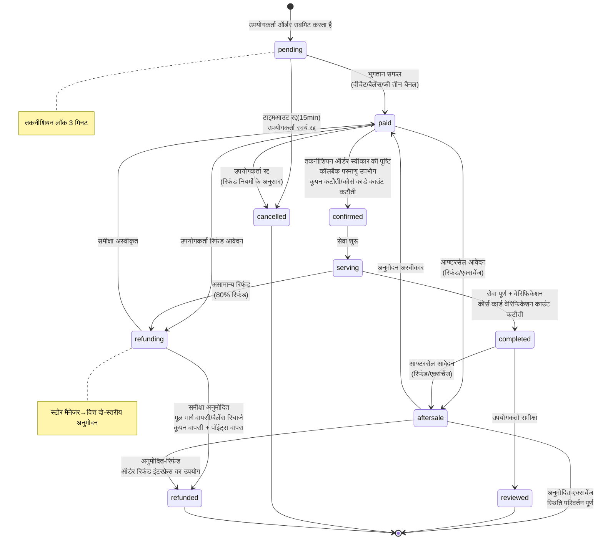
```mermaid
stateDiagram-v2
    [*] --> pending: उपयोगकर्ता ऑर्डर सबमिट करता है

    pending --> paid: भुगतान सफल<br/>(वीचैट/बैलेंस/फ्री तीन चैनल)

    pending --> cancelled: टाइमआउट रद्द(15min)<br/>उपयोगकर्ता स्वयं रद्द

    paid --> confirmed: तकनीशियन ऑर्डर स्वीकार की पुष्टि<br/>कॉलबैक परमाणु उपभोग<br/>कूपन कटौती/कोर्स कार्ड काउंट कटौती
    paid --> cancelled: उपयोगकर्ता रद्द<br/>(रिफंड नियमों के अनुसार)
    paid --> refunding: उपयोगकर्ता रिफंड आवेदन
    paid --> aftersale: आफ्टरसेल आवेदन<br/>(रिफंड/एक्सचेंज)

    confirmed --> serving: सेवा शुरू

    serving --> completed: सेवा पूर्ण + वेरिफिकेशन<br/>कोर्स कार्ड वेरिफिकेशन काउंट कटौती

    serving --> refunding: असामान्य रिफंड<br/>(80% रिफंड)

    completed --> reviewed: उपयोगकर्ता समीक्षा
    completed --> aftersale: आफ्टरसेल आवेदन<br/>(रिफंड/एक्सचेंज)

    refunding --> refunded: समीक्षा अनुमोदित<br/>मूल मार्ग वापसी/बैलेंस रिचार्ज<br/>कूपन वापसी + पॉइंट्स वापस
    refunding --> paid: समीक्षा अस्वीकृत

    aftersale --> refunded: अनुमोदित-रिफंड<br/>ऑर्डर रिफंड इंटरफ़ेस का उपयोग
    aftersale --> paid: अनुमोदन अस्वीकार
    aftersale --> [*]: अनुमोदित-एक्सचेंज<br/>स्थिति परिवर्तन पूर्ण

    reviewed --> [*]
    cancelled --> [*]
    refunded --> [*]

    note right of pending: तकनीशियन लॉक 3 मिनट
    note right of refunding: स्टोर मैनेजर→वित्त दो-स्तरीय अनुमोदन
```

## 2. मेम्बर कार्ड लाइफ़साइकल

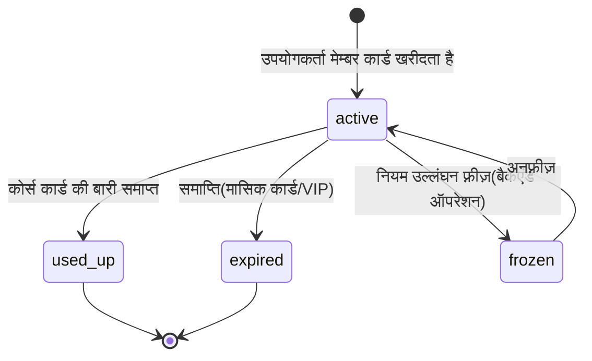
```mermaid
stateDiagram-v2
    [*] --> active: उपयोगकर्ता मेम्बर कार्ड खरीदता है

    active --> used_up: कोर्स कार्ड की बारी समाप्त

    active --> expired: समाप्ति(मासिक कार्ड/VIP)

    active --> frozen: नियम उल्लंघन फ़्रीज़(बैकएंड ऑपरेशन)

    frozen --> active: अनफ़्रीज़

    used_up --> [*]
    expired --> [*]
```

## 3. तकनीशियन जुड़ने का लाइफ़साइकल

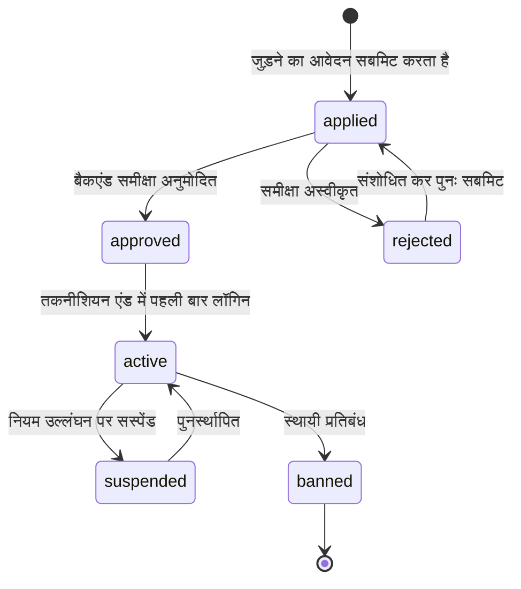
```mermaid
stateDiagram-v2
    [*] --> applied: जुड़ने का आवेदन सबमिट करता है

    applied --> approved: बैकएंड समीक्षा अनुमोदित
    applied --> rejected: समीक्षा अस्वीकृत

    rejected --> applied: संशोधित कर पुनः सबमिट

    approved --> active: तकनीशियन एंड में पहली बार लॉगिन

    active --> suspended: नियम उल्लंघन पर सस्पेंड
    suspended --> active: पुनर्स्थापित
    active --> banned: स्थायी प्रतिबंध

    banned --> [*]
```

## 4. कूपन लाइफ़साइकल

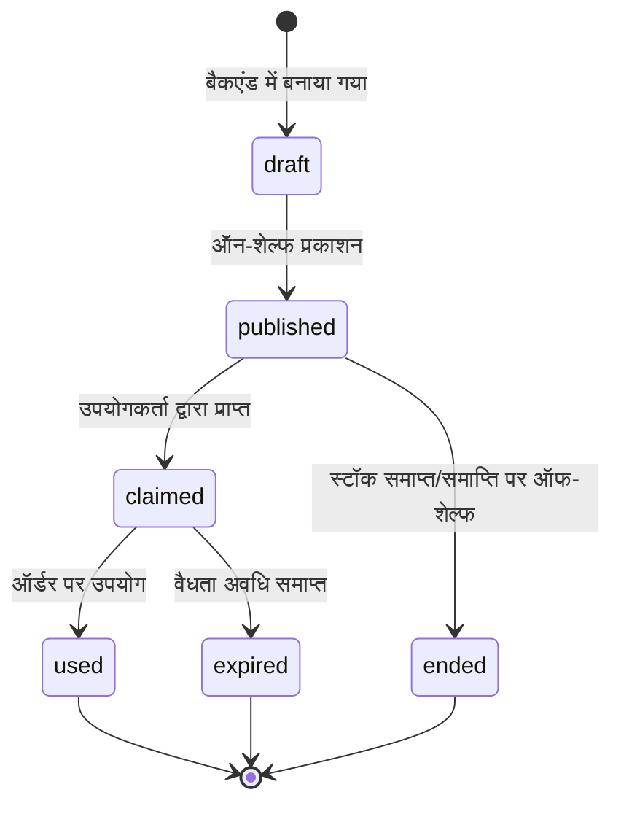
```mermaid
stateDiagram-v2
    [*] --> draft: बैकएंड में बनाया गया

    draft --> published: ऑन-शेल्फ प्रकाशन

    published --> claimed: उपयोगकर्ता द्वारा प्राप्त

    claimed --> used: ऑर्डर पर उपयोग
    claimed --> expired: वैधता अवधि समाप्त

    published --> ended: स्टॉक समाप्त/समाप्ति पर ऑफ-शेल्फ

    used --> [*]
    expired --> [*]
    ended --> [*]
```

## 5. तकनीशियन निकासी लाइफ़साइकल

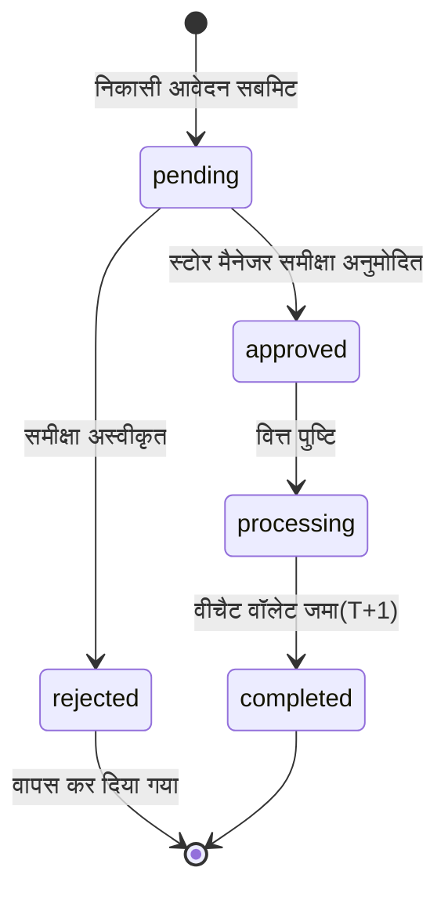
```mermaid
stateDiagram-v2
    [*] --> pending: निकासी आवेदन सबमिट

    pending --> approved: स्टोर मैनेजर समीक्षा अनुमोदित
    pending --> rejected: समीक्षा अस्वीकृत

    rejected --> [*]: वापस कर दिया गया

    approved --> processing: वित्त पुष्टि

    processing --> completed: वीचैट वॉलेट जमा(T+1)

    completed --> [*]
```

## 6. Token प्रमाणीकरण लाइफ़साइकल

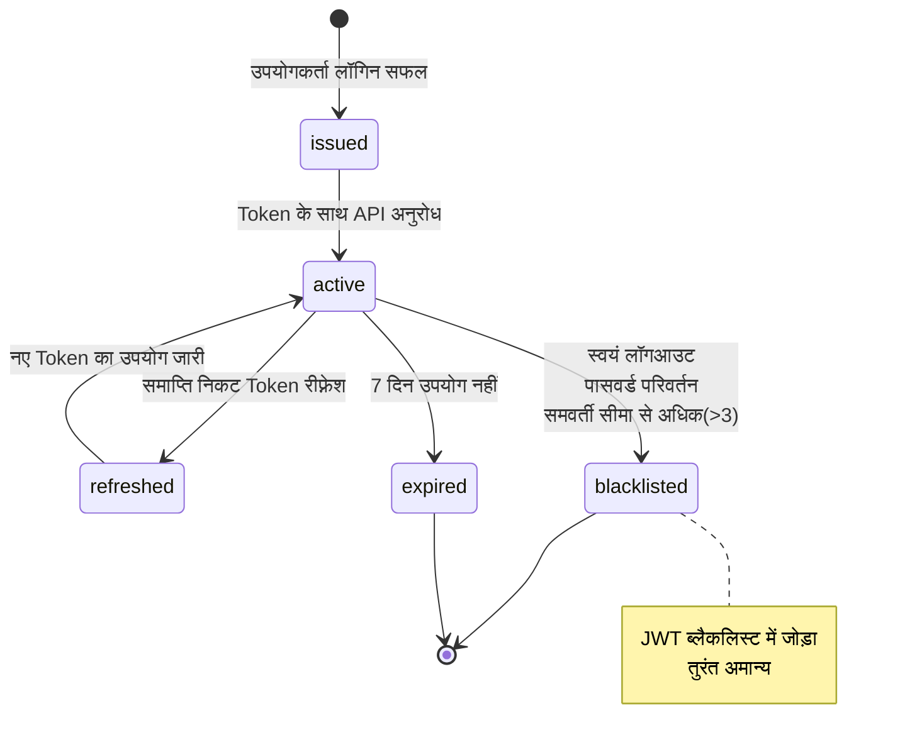
```mermaid
stateDiagram-v2
    [*] --> issued: उपयोगकर्ता लॉगिन सफल

    issued --> active: Token के साथ API अनुरोध

    active --> refreshed: समाप्ति निकट Token रीफ़्रेश

    refreshed --> active: नए Token का उपयोग जारी

    active --> blacklisted: स्वयं लॉगआउट<br/>पासवर्ड परिवर्तन<br/>समवर्ती सीमा से अधिक(>3)

    active --> expired: 7 दिन उपयोग नहीं

    blacklisted --> [*]
    expired --> [*]

    note right of blacklisted: JWT ब्लैकलिस्ट में जोड़ा<br/>तुरंत अमान्य
```

## 7. ग्रुप-बाय गतिविधि लाइफ़साइकल

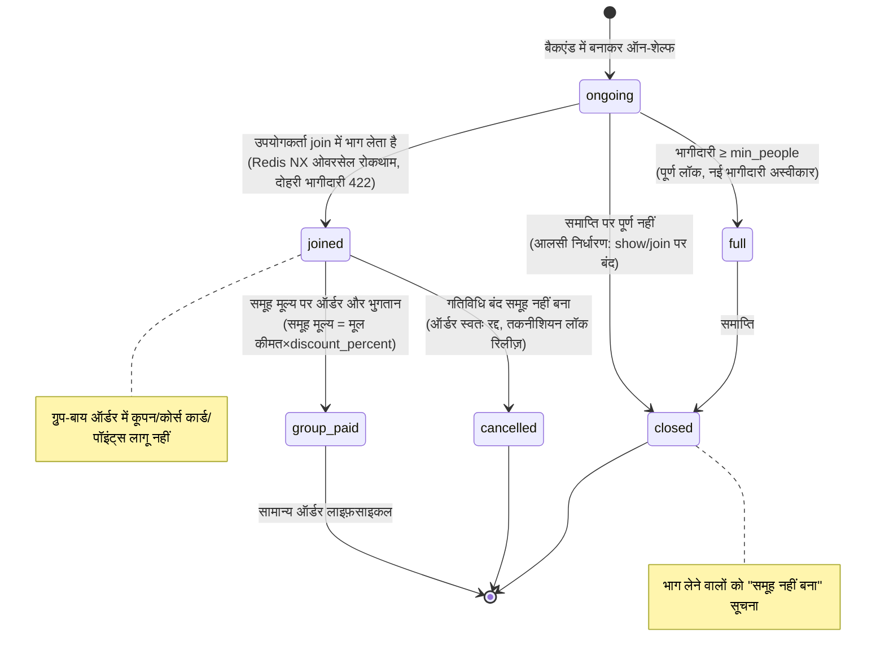
```mermaid
stateDiagram-v2
    [*] --> ongoing: बैकएंड में बनाकर ऑन-शेल्फ

    ongoing --> full: भागीदारी ≥ min_people<br/>(पूर्ण लॉक, नई भागीदारी अस्वीकार)

    ongoing --> closed: समाप्ति पर पूर्ण नहीं<br/>(आलसी निर्धारण: show/join पर बंद)

    full --> closed: समाप्ति

    ongoing --> joined: उपयोगकर्ता join में भाग लेता है<br/>(Redis NX ओवरसेल रोकथाम, दोहरी भागीदारी 422)

    joined --> group_paid: समूह मूल्य पर ऑर्डर और भुगतान<br/>(समूह मूल्य = मूल कीमत×discount_percent)

    joined --> cancelled: गतिविधि बंद समूह नहीं बना<br/>(ऑर्डर स्वतः रद्द, तकनीशियन लॉक रिलीज़)

    group_paid --> [*]: सामान्य ऑर्डर लाइफ़साइकल
    cancelled --> [*]
    closed --> [*]

    note right of joined: ग्रुप-बाय ऑर्डर में कूपन/कोर्स कार्ड/पॉइंट्स लागू नहीं
    note right of closed: भाग लेने वालों को "समूह नहीं बना" सूचना
```

## 8. कूपन ट्रांसफर लाइफ़साइकल

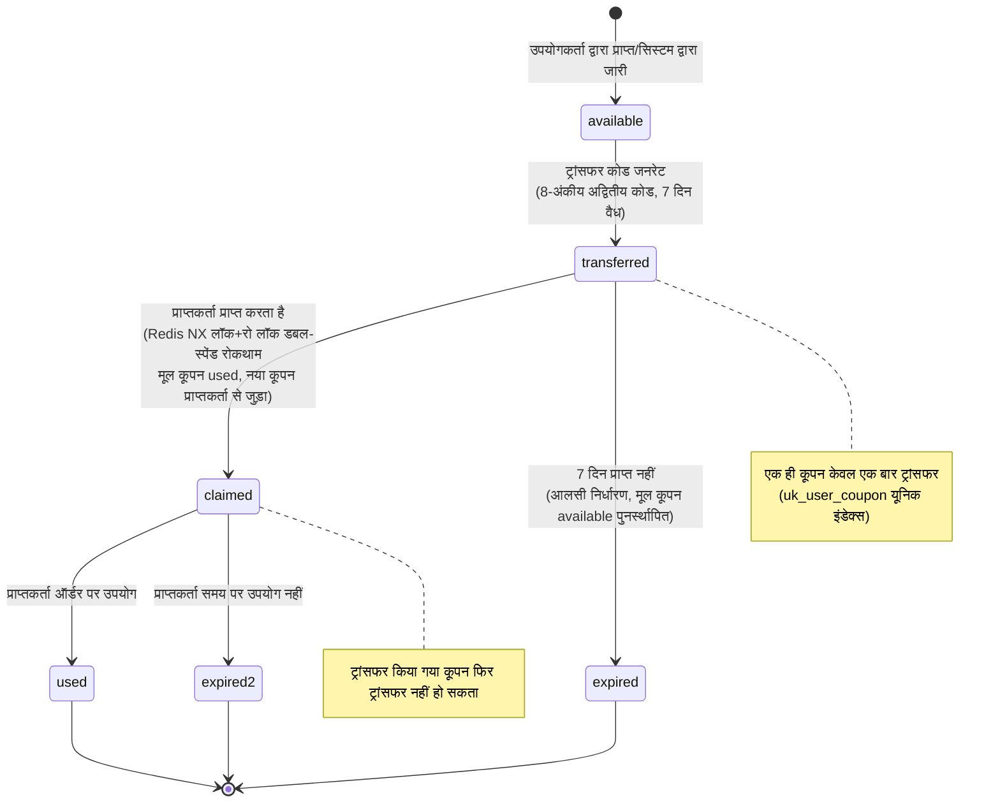
```mermaid
stateDiagram-v2
    [*] --> available: उपयोगकर्ता द्वारा प्राप्त/सिस्टम द्वारा जारी

    available --> transferred: ट्रांसफर कोड जनरेट<br/>(8-अंकीय अद्वितीय कोड, 7 दिन वैध)

    transferred --> claimed: प्राप्तकर्ता प्राप्त करता है<br/>(Redis NX लॉक+रो लॉक डबल-स्पेंड रोकथाम<br/>मूल कूपन used, नया कूपन प्राप्तकर्ता से जुड़ा)

    transferred --> expired: 7 दिन प्राप्त नहीं<br/>(आलसी निर्धारण, मूल कूपन available पुनर्स्थापित)

    claimed --> used: प्राप्तकर्ता ऑर्डर पर उपयोग
    claimed --> expired2: प्राप्तकर्ता समय पर उपयोग नहीं

    used --> [*]
    expired --> [*]
    expired2 --> [*]

    note right of transferred: एक ही कूपन केवल एक बार ट्रांसफर<br/>(uk_user_coupon यूनिक इंडेक्स)
    note right of claimed: ट्रांसफर किया गया कूपन फिर ट्रांसफर नहीं हो सकता
```

## 9. पॉइंट्स समाप्ति लाइफ़साइकल

```mermaid
stateDiagram-v2
    [*] --> earned: साइन-इन/उपभोग वापसी/वापस जमा<br/>(expires_at = now + 365 दिन)

    earned --> used: कैशबैक/रिडीम उपभोग

    earned --> expired: समाप्ति पर उपयोग नहीं<br/>(PointsExpiryTimer 60s स्कैन<br/>type=expire ऋणात्मक मान कटौती पंक्ति)

    expired --> [*]: इन-स्टेशन सूचना "पॉइंट्स समाप्त हो गए"
    used --> [*]

    note right of expired: तीन-परत इडेम्पोटेंसी: मूल पंक्ति रो लॉक पुनः सत्यापन<br/>+ id कर्सर पेजिनेशन + सूचना केवल कटौती राउंड पर
```

## 10. ट्रांसफर लाइफ़साइकल (राउंड 19: बैलेंस ट्रांसफर + पॉइंट्स ट्रांसफर)

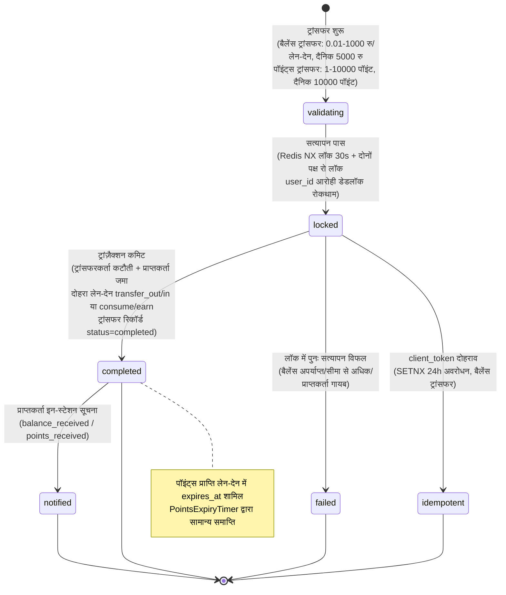
```mermaid
stateDiagram-v2
    [*] --> validating: ट्रांसफर शुरू<br/>(बैलेंस ट्रांसफर: 0.01-1000 रु/लेन-देन, दैनिक 5000 रु<br/>पॉइंट्स ट्रांसफर: 1-10000 पॉइंट, दैनिक 10000 पॉइंट)

    validating --> locked: सत्यापन पास<br/>(Redis NX लॉक 30s + दोनों पक्ष रो लॉक<br/>user_id आरोही डेडलॉक रोकथाम)

    locked --> completed: ट्रांज़ैक्शन कमिट<br/>(ट्रांसफरकर्ता कटौती + प्राप्तकर्ता जमा<br/>दोहरा लेन-देन transfer_out/in या consume/earn<br/>ट्रांसफर रिकॉर्ड status=completed)

    locked --> failed: लॉक में पुनः सत्यापन विफल<br/>(बैलेंस अपर्याप्त/सीमा से अधिक/प्राप्तकर्ता गायब)
    locked --> idempotent: client_token दोहराव<br/>(SETNX 24h अवरोधन, बैलेंस ट्रांसफर)

    completed --> notified: प्राप्तकर्ता इन-स्टेशन सूचना<br/>(balance_received / points_received)
    completed --> [*]
    failed --> [*]
    idempotent --> [*]
    notified --> [*]

    note right of completed: पॉइंट्स प्राप्ति लेन-देन में expires_at शामिल<br/>PointsExpiryTimer द्वारा सामान्य समाप्ति
```

## 11. कस्टमर सर्विस टिकट लाइफ़साइकल (राउंड 20)

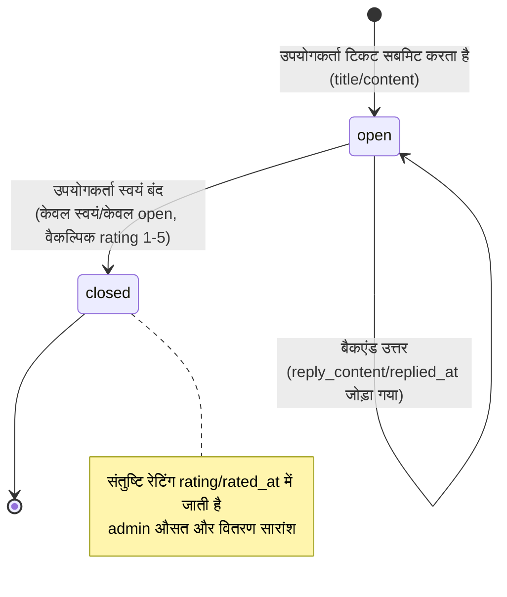
```mermaid
stateDiagram-v2
    [*] --> open: उपयोगकर्ता टिकट सबमिट करता है<br/>(title/content)

    open --> open: बैकएंड उत्तर<br/>(reply_content/replied_at जोड़ा गया)

    open --> closed: उपयोगकर्ता स्वयं बंद<br/>(केवल स्वयं/केवल open, वैकल्पिक rating 1-5)

    closed --> [*]

    note right of closed: संतुष्टि रेटिंग rating/rated_at में जाती है<br/>admin औसत और वितरण सारांश
```

## 12. इलेक्ट्रॉनिक इनवॉइस लाइफ़साइकल (राउंड 20)

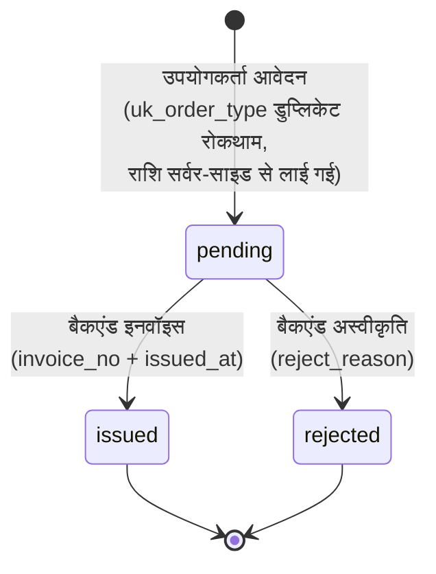
```mermaid
stateDiagram-v2
    [*] --> pending: उपयोगकर्ता आवेदन<br/>(uk_order_type डुप्लिकेट रोकथाम,<br/>राशि सर्वर-साइड से लाई गई)

    pending --> issued: बैकएंड इनवॉइस<br/>(invoice_no + issued_at)

    pending --> rejected: बैकएंड अस्वीकृति<br/>(reject_reason)

    issued --> [*]
    rejected --> [*]
```

## 13. फुल-रिडक्शन गतिविधि लाइफ़साइकल (राउंड 22)

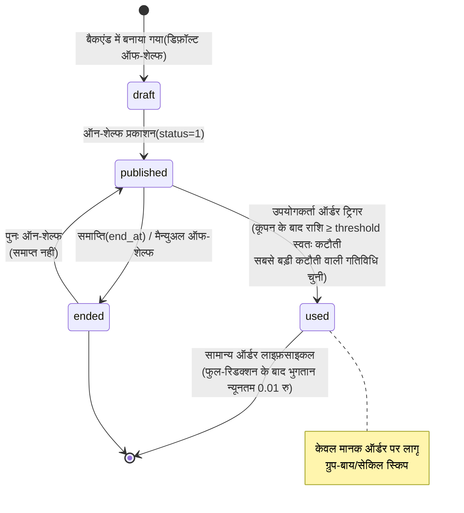
```mermaid
stateDiagram-v2
    [*] --> draft: बैकएंड में बनाया गया(डिफ़ॉल्ट ऑफ-शेल्फ)

    draft --> published: ऑन-शेल्फ प्रकाशन(status=1)

    published --> ended: समाप्ति(end_at) / मैन्युअल ऑफ-शेल्फ

    published --> used: उपयोगकर्ता ऑर्डर ट्रिगर<br/>(कूपन के बाद राशि ≥ threshold स्वतः कटौती<br/>सबसे बड़ी कटौती वाली गतिविधि चुनी)

    used --> [*]: सामान्य ऑर्डर लाइफ़साइकल<br/>(फुल-रिडक्शन के बाद भुगतान न्यूनतम 0.01 रु)

    ended --> published: पुनः ऑन-शेल्फ<br/>(समाप्त नहीं)
    ended --> [*]

    note right of used: केवल मानक ऑर्डर पर लागू<br/>ग्रुप-बाय/सेकिल स्किप
```

## 15. स्पिन ड्रॉ लाइफ़साइकल (राउंड 23)

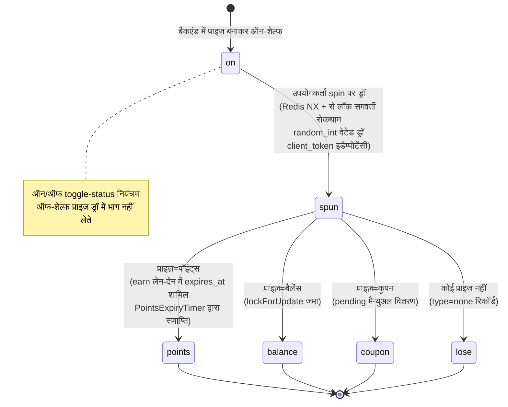
```mermaid
stateDiagram-v2
    [*] --> on: बैकएंड में प्राइज़ बनाकर ऑन-शेल्फ

    on --> spun: उपयोगकर्ता spin पर ड्रॉ<br/>(Redis NX + रो लॉक समवर्ती रोकथाम<br/>random_int वेटेड ड्रॉ<br/>client_token इडेम्पोटेंसी)

    spun --> points: प्राइज़=पॉइंट्स<br/>(earn लेन-देन में expires_at शामिल<br/>PointsExpiryTimer द्वारा समाप्ति)

    spun --> balance: प्राइज़=बैलेंस<br/>(lockForUpdate जमा)

    spun --> coupon: प्राइज़=कूपन<br/>(pending मैन्युअल वितरण)

    spun --> lose: कोई प्राइज़ नहीं<br/>(type=none रिकॉर्ड)

    points --> [*]
    balance --> [*]
    coupon --> [*]
    lose --> [*]

    note right of on: ऑन/ऑफ toggle-status नियंत्रण<br/>ऑफ-शेल्फ प्राइज़ ड्रॉ में भाग नहीं लेते
```

## 14. अकाउंट डिलीट लाइफ़साइकल (राउंड 22)

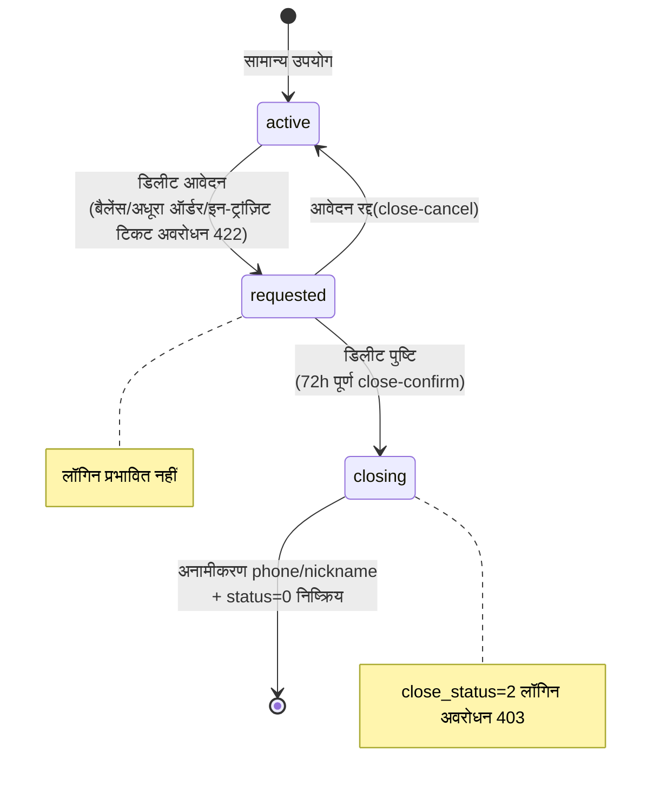
```mermaid
stateDiagram-v2
    [*] --> active: सामान्य उपयोग

    active --> requested: डिलीट आवेदन<br/>(बैलेंस/अधूरा ऑर्डर/इन-ट्रांज़िट टिकट अवरोधन 422)

    requested --> active: आवेदन रद्द(close-cancel)

    requested --> closing: डिलीट पुष्टि<br/>(72h पूर्ण close-confirm)

    closing --> [*]: अनामीकरण phone/nickname<br/>+ status=0 निष्क्रिय

    note right of requested: लॉगिन प्रभावित नहीं
    note right of closing: close_status=2 लॉगिन अवरोधन 403
```

## 16. सेकिल गतिविधि लाइफ़साइकल (राउंड 24)

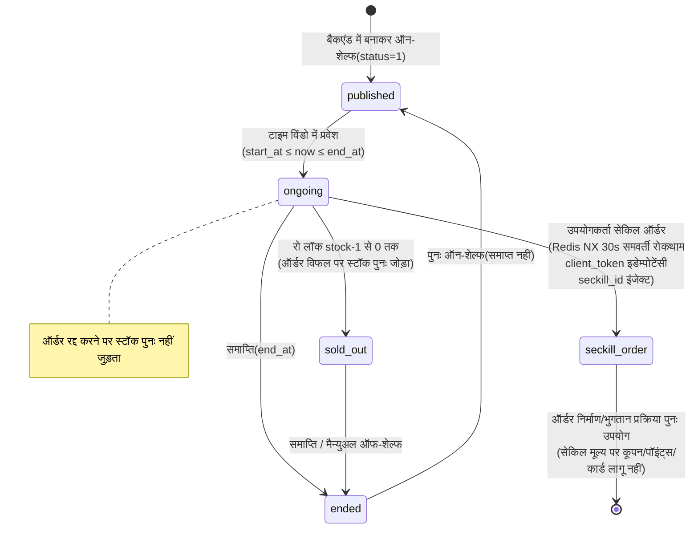
```mermaid
stateDiagram-v2
    [*] --> published: बैकएंड में बनाकर ऑन-शेल्फ(status=1)

    published --> ongoing: टाइम विंडो में प्रवेश<br/>(start_at ≤ now ≤ end_at)

    ongoing --> sold_out: रो लॉक stock-1 से 0 तक<br/>(ऑर्डर विफल पर स्टॉक पुनः जोड़ा)

    ongoing --> ended: समाप्ति(end_at)

    sold_out --> ended: समाप्ति / मैन्युअल ऑफ-शेल्फ

    ended --> published: पुनः ऑन-शेल्फ(समाप्त नहीं)

    ongoing --> seckill_order: उपयोगकर्ता सेकिल ऑर्डर<br/>(Redis NX 30s समवर्ती रोकथाम<br/>client_token इडेम्पोटेंसी<br/>seckill_id इंजेक्ट)

    seckill_order --> [*]: ऑर्डर निर्माण/भुगतान प्रक्रिया पुनः उपयोग<br/>(सेकिल मूल्य पर कूपन/पॉइंट्स/कार्ड लागू नहीं)

    note right of ongoing: ऑर्डर रद्द करने पर स्टॉक पुनः नहीं जुड़ता
```

## 17. रिटर्न-कस्टमर रिवॉर्ड लाइफ़साइकल (राउंड 24)

```mermaid
stateDiagram-v2
    [*] --> completed: ऑर्डर पूर्ण<br/>(WorkController::complete रो लॉक ट्रांज़ैक्शन)

    completed --> checked: 30 दिनों में उसी तकनीशियन के साथ दूसरा उपभोग निर्धारण

    checked --> none: पहला उपभोग / स्विच बंद<br/>(enabled=0)

    checked --> pending: दूसरा उपभोग<br/>(बोनस=भुगतान×ratio<br/>समान order_id+type इडेम्पोटेंट)

    pending --> settled: कमीशन निपटान श्रृंखला में एकीकृत निपटान<br/>(erik_technician_earnings<br/>type=return_customer)

    settled --> [*]
    none --> [*]

    note right of pending: status=pending<br/>तकनीशियन एंड आय सारांश में स्वतः शामिल
```
