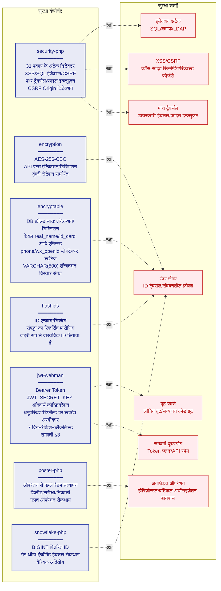
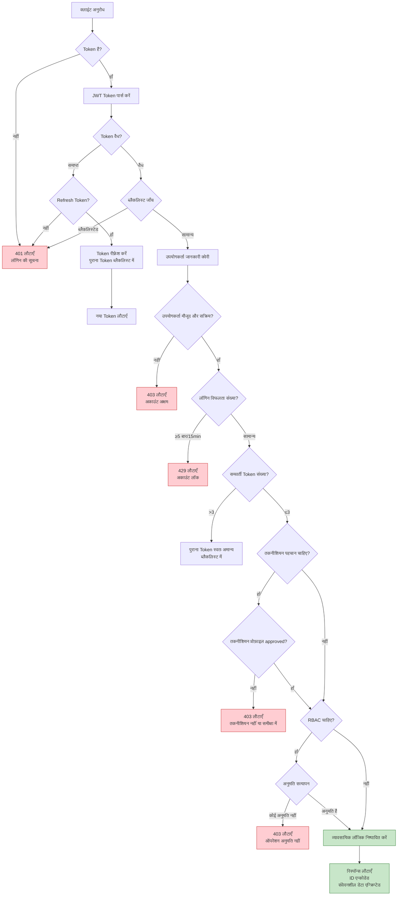
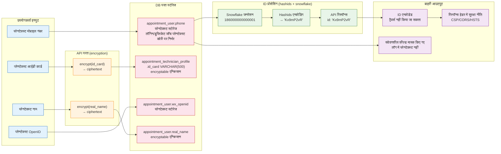

# सुरक्षा आर्किटेक्चर आरेख
> **Languages**: [中文](../../diagrams/SECURITY-ARCHITECTURE.md) · [English](../../en/diagrams/SECURITY-ARCHITECTURE.md) · [한국어](../../ko/diagrams/SECURITY-ARCHITECTURE.md) · [Русский](../../ru/diagrams/SECURITY-ARCHITECTURE.md) · [Deutsch](../../de/diagrams/SECURITY-ARCHITECTURE.md) · [Français](../../fr/diagrams/SECURITY-ARCHITECTURE.md) · [Español](../../es/diagrams/SECURITY-ARCHITECTURE.md) · [Português](../../pt/diagrams/SECURITY-ARCHITECTURE.md) · [العربية](../../ar/diagrams/SECURITY-ARCHITECTURE.md) · [বাংলা](../../bn/diagrams/SECURITY-ARCHITECTURE.md) · [Bahasa Indonesia](../../id/diagrams/SECURITY-ARCHITECTURE.md) · [日本語](../../ja/diagrams/SECURITY-ARCHITECTURE.md)

## 1. डेप्थ डिफेंस सिस्टम

```mermaid
graph TB
    subgraph boundary_defense["पहली परत: बाउंड्री डिफेंस"]
        WAF["WAF / Nginx<br/>सुरक्षित रिस्पॉन्स हेडर<br/>संवेदनशील फ़ाइल सुरक्षा<br/>TLS 1.3"]
    end

    subgraph access_defense["दूसरी परत: एक्सेस डिफेंस"]
        CORS["Cors मिडलवेयर<br/>CORS_ALLOW_ORIGIN व्हाइटलिस्ट<br/>* इको · कॉन्फ़िग न होने पर केवल समान-ओरिजिन<br/>6 सुरक्षित रिस्पॉन्स हेडर<br/>OPTIONS प्रीफ़्लाइट"]
    end

    subgraph attack_detection["तीसरी परत: अटैक डिटेक्शन"]
        SEC["Security मिडलवेयर<br/>erikwang2013/security-php<br/>31 प्रकार के अटैक डिटेक्टर<br/>XSS / SQL इंजेक्शन / CSRF<br/>पाथ ट्रैवर्सल / फ़ाइल इन्क्लूज़न<br/>CSRF Origin डिटेक्शन(block)"]
        BLOCK["स्वतः ब्लॉक<br/>5 अटैक/60s<br/>→ IP ब्लैकलिस्ट 15min"]
    end

    subgraph traffic_control["चौथी परत: ट्रैफ़िक कंट्रोल"]
        RL["RateLimit मिडलवेयर<br/>Redis स्लाइडिंग विंडो + Lua एटॉमिक<br/>डिफ़ॉल्ट: 60 बार/min/IP<br/>लॉगिन: 10 बार/min<br/>पंजीकरण: 5 बार/min<br/>सत्यापन कोड: 1 बार/60s/मोबाइल"]
    end

    subgraph identity_auth["पाँचवीं परत: पहचान प्रमाणीकरण"]
        AUTH["Auth मिडलवेयर<br/>JWT Bearer Token (7 दिन)<br/>JWT_SECRET_KEY अनिवार्य कॉन्फ़िगरेशन<br/>अनुपस्थित/सार्वजनिक डिफ़ॉल्ट पर स्टार्टप अस्वीकार<br/>पासवर्ड bcrypt हैश<br/>Token रीफ़्रेश + ब्लैकलिस्ट<br/>लॉगिन लॉक: 5 विफलताएँ→15min<br/>समवर्ती सीमा: अधिकतम 3 Token"]
        TECH_AUTH["TechnicianAuth<br/>तकनीशियन प्रोफ़ाइल सत्यापन<br/>approved स्थिति जाँच"]
        ADMIN_AUTH["AdminAuth<br/>Admin पक्ष JWT प्रमाणीकरण<br/>Token ब्लैकलिस्ट"]
    end

    subgraph permission_control["छठी परत: अनुमति नियंत्रण"]
        RBAC["AdminPermission<br/>RBAC रोल अनुमति सत्यापन<br/>Redis 60s कैश<br/>उपयोगकर्ता→रोल→अनुमति"]
        POSTER["Poster सत्यापन<br/>erikwang2013/poster-php<br/>डिलीट/समीक्षा/निकासी<br/>संवेदनशील ऑपरेशन पर रैंडम सत्यापन"]
    end

    subgraph data_security["सातवीं परत: डेटा सुरक्षा"]
        ENC_API["API परत एन्क्रिप्शन<br/>erikwang2013/encryption<br/>संवेदनशील फ़ील्ड एन्क्रिप्शन/डिक्रिप्शन"]
        ENC_DB["DB परत एन्क्रिप्शन<br/>erikwang2013/encryptable<br/>Model trait स्वतः एन्क्रिप्शन/डिक्रिप्शन<br/>केवल real_name/id_card आदि एन्क्रिप्ट<br/>phone/wx_openid प्लेनटेक्स्ट में अनिवार्य<br/>(लॉगिन/डुप्लिकेट जाँच प्लेनटेक्स्ट क्वेरी पर निर्भर)"]
        HASHID["ID एन्क्रिप्शन/डिक्रिप्शन<br/>erikwang2013/hashids<br/>बाहरी रूप से वास्तविक ID छिपाता है<br/>रिकर्सिव एन्कोड/डिकोड"]
        SLOG["सुरक्षा लॉग<br/>M3 अपवाद एकीकृत मास्किंग<br/>सामान्य टेक्स्ट + Log::error<br/>संवेदनशील डेटा लॉग में नहीं<br/>OperationLog 8 स्रोत"]
    end

    subgraph admin_defense["आठवीं परत: प्रबंधन पक्ष सुरक्षा"]
        EXCEL["एक्सपोर्ट सुरक्षा<br/>safeCellValue()<br/>= + - @ / Tab/CR शुरुआत<br/>' प्रीफ़िक्स फ़ॉर्मूला इंजेक्शन एस्केप"]
        UPLOAD["अपलोड सत्यापन<br/>finfo magic bytes<br/>MIME और एक्सटेंशन बेमेल<br/>→ 422 अस्वीकार"]
        INSTALL["इंस्टॉलेशन लॉक<br/>इंस्टॉल हो चुका(installed=1<br/>या एडमिन मौजूद)<br/>→ 404 इंस्टॉल विज़ार्ड अक्षम"]
    end

    请求["HTTP अनुरोध"] --> WAF
    WAF --> CORS
    CORS --> SEC
    SEC -->|"पास"| RL
    SEC -->|"अटैक पहचाना"| BLOCK
    BLOCK -.->|"अस्वीकार"| reject_req["HTTP 403/429<br/>अटैक लॉग रिकॉर्ड"]
    RL -->|"पास"| AUTH
    RL -->|"सीमा से अधिक"| rate_reject["HTTP 429<br/>Retry-After"]
    AUTH --> TECH_AUTH
    AUTH --> ADMIN_AUTH
    TECH_AUTH --> RBAC
    ADMIN_AUTH --> RBAC
    RBAC --> POSTER
    POSTER --> ENC_API
    ENC_API --> ENC_DB
    ENC_DB --> HASHID
    HASHID --> SLOG
    SLOG --> EXCEL
    EXCEL --> UPLOAD
    UPLOAD --> INSTALL
    INSTALL --> response["HTTP रिस्पॉन्स<br/>डेटा एन्क्रिप्टेड+एन्कोडेड"]

    classDef layer1 fill:#e3f2fd,stroke:#1565c0,stroke-width:2px,color:#01579b
    classDef layer2 fill:#bbdefb,stroke:#1976d2,stroke-width:2px,color:#01579b
    classDef layer3 fill:#ffcdd2,stroke:#c62828,stroke-width:2px,color:#b71c1c
    classDef layer4 fill:#fff9c4,stroke:#f9a825,stroke-width:2px,color:#f57f17
    classDef layer5 fill:#c8e6c9,stroke:#2e7d32,stroke-width:2px,color:#1b5e20
    classDef layer6 fill:#e1bee7,stroke:#7b1fa2,stroke-width:2px,color:#4a148c
    classDef layer7 fill:#d7ccc8,stroke:#5d4037,stroke-width:2px,color:#3e2723
    classDef layer8 fill:#cfd8dc,stroke:#37474f,stroke-width:2px,color:#263238
    classDef reject fill:#ff5252,stroke:#b71c1c,stroke-width:2px,color:#fff

    class WAF layer1
    class CORS layer2
    class SEC,BLOCK layer3
    class RL layer4
    class AUTH,TECH_AUTH,ADMIN_AUTH layer5
    class RBAC,POSTER layer6
    class ENC_API,ENC_DB,HASHID,SLOG layer7
    class EXCEL,UPLOAD,INSTALL layer8
    class reject_req,rate_reject reject
```

## 2. सुरक्षा कंपोनेंट मैट्रिक्स

## 3. प्रमाणीकरण और अधिकृतता प्रक्रिया

## 4. डेटा सुरक्षा प्रवाह

