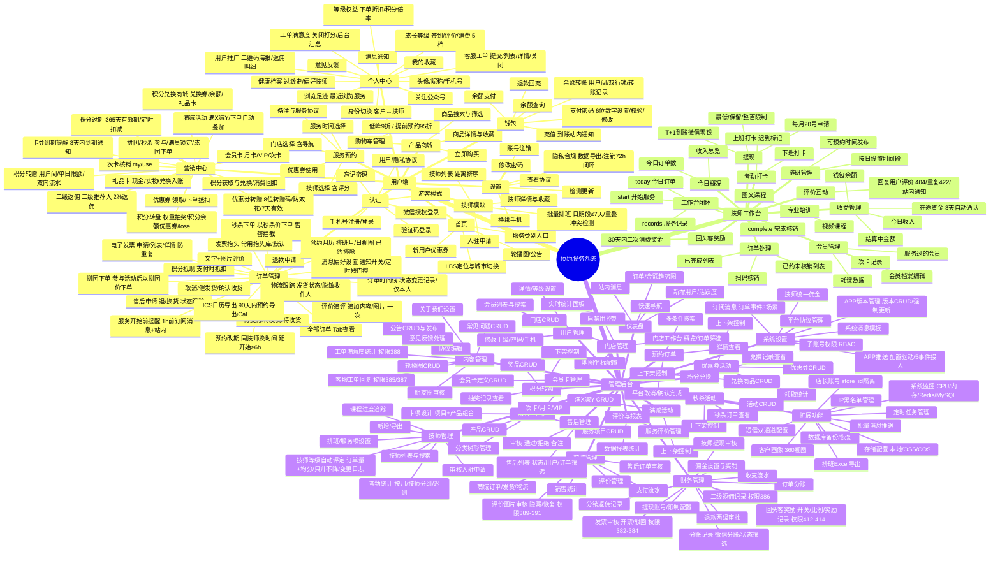

# Diagram Fungsi Sistem

> Terjemahan bahasa Indonesia · Asli: [中文](../../docs/diagrams/FUNCTION-DIAGRAM.md)

```mermaid
mindmap
  root((预约服务系统))
    用户端
      认证
        手机号注册/登录
        验证码登录
        微信授权登录
        游客模式
        忘记密码
        用户/隐私协议
      首页
        LBS定位与城市切换
        轮播图/公告
        服务类别入口
        新用户优惠券
      服务预约
        门店选择 含导航
        技师选择 含评分
        服务时间选择
        低峰9折 / 提前预约95折
        优惠券使用
        备注与服务协议
      产品商城
        商品搜索与筛选
        商品详情与收藏
        购物车管理
        立即购买
      订单管理
        全部订单 Tab查看
        待支付/待发货/待收货
        取消/催发货/确认收货
        退款申请
        售后申请 退/换货 状态跟踪
        积分抵现 支付时抵扣
        拼团下单 参与活动后以拼团价下单
        秒杀下单 以秒杀价下单 售罄拦截
        预约改期 同技师换时间 距开始≥6h
        预约月历 排班月/日视图 已约排除
        服务开始前提醒 1h前订阅消息+站内
        文字+图片评价
        评价追评 追加内容/图片 一次
        物流跟踪 发货状态/脱敏收件人
        电子发票 申请/列表/详情 防重复
        ICS日历导出 90天内预约导出iCal
        订单时间线 状态变更记录/仅本人
        发票抬头 常用抬头库/默认
        消息偏好设置 通知开关/定时器门控
      技师模块
        技师列表 距离排序
        技师详情与收藏
        入驻申请
        批量排班 日期段≤7天/重叠冲突检测
      营销中心
        优惠券 领取/下单抵扣
        优惠券转赠 8位转赠码/防双花/7天有效
        会员卡 月卡/VIP/次卡
        次卡核销 my/use
        积分获取与兑换/消费回扣
        积分过期 365天有效期/定时扣减
        积分兑换商城 兑换券/余额/礼品卡
        拼团/秒杀 参与/满员锁定/成团下单
        卡券到期提醒 3天内到期通知
        礼品卡 现金/实物/兑换入账
        积分转赠 用户间/单日限额/双向流水
        二级返佣 二级推荐人 2%返佣
        满减活动 满X减Y/下单自动叠加
        积分转盘 权重抽奖/积分余额优惠券/lose
      钱包
        余额查询
        充值 到账站内通知
        余额支付
        退款回充
        余额转账 用户间/双行锁/转账记录
        支付密码 6位数字设置/校验/修改
      个人中心
        头像/昵称/手机号
        身份切换 客户↔技师
        消息通知
        我的收藏
        浏览足迹 最近浏览服务
        健康档案 过敏史/偏好技师
        关注公众号
        用户推广 二维码海报/返佣明细
        成长等级 签到/评价/消费 5档
        等级权益 下单折扣/积分倍率
        客服工单 提交/列表/详情/关闭
        工单满意度 关闭打分/后台汇总
        意见反馈
      设置
        修改密码
        换绑手机
        查看协议
        检测更新
        隐私合规 数据导出/注销72h闭环
        账号注销

    技师工作台
      考勤打卡
        上班打卡 迟到标记
        下班打卡
      工作台闭环
        today 今日订单
        records 服务记录
        start 开始服务
        complete 完成核销
      今日概况
        今日订单数
        收入总览
      排班管理
        按日设置时间段
        可预约时间发布
      订单处理
        已约未核销列表
        已完成列表
        扫码核销
      会员管理
        服务过的会员
        耗课数据
        次卡记录
        会员档案编辑
      评价互动
        回复用户评价 404/重复422/站内通知
      收益管理
        今日收入
        结算中金额
        钱包余额
        在途资金 3天自动确认
      提现
        每月20号申请
        T+1到账微信零钱
        最低/保留/整百限制
      回头客奖励
        30天内二次消费奖金
      专业培训
        视频课程
        图文课程

    管理后台
      仪表盘
        实时统计面板
        订单/金额趋势图
        新增用户/活跃度
        快速导航
        站内消息
      技师管理
        技师列表与搜索
        新增/导出
        审核入驻申请
        排班/服务项设置
        课程进度追踪
        技师等级自动评定 订单量+均分/只升不降/变更日志
        考勤统计 按月/技师分组/迟到
      用户管理
        会员列表与搜索
        详情/等级设置
        修改上级/密码/手机
      门店管理
        门店CRUD
        启禁用控制
        地图坐标配置
        门店工作台 概览/订单筛选
      服务与产品
        服务项目CRUD
        产品CRUD
        分类树形管理
        卡项设计 项目+产品组合
      商城管理
        商城订单/发货/物流
        售后订单审核
        评价管理
        评价图片审核 隐藏/恢复 权限389-391
        支付流水
        销售统计
      预约订单
        多条件搜索
        平台取消/确认完成
        详情查看
      优惠券活动
        优惠券CRUD
        上下架控制
        领取统计
      满减活动
        满X减Y CRUD
        上下架控制
      积分转盘
        奖品CRUD
        上下架控制
        抽奖记录查看
      秒杀活动
        活动CRUD
        上下架控制
        秒杀订单查看
      积分兑换
        兑换商品CRUD
        上下架控制
        兑换记录查看
      会员卡管理
        会员卡定义CRUD
        次卡/月卡/VIP
      售后管理
        售后列表 状态/用户/订单筛选
        审核 通过/拒绝 备注
      评价与报表
        服务评价管理
        数据报表统计
      财务管理
        订单分账
        技师提现审核
        佣金设置与奖罚
        收支流水
        提现账号/限制配置
        退款两级审批
        分销返佣记录
        二级返佣记录 权限386
        分账记录 微信分账/状态筛选
        发票审核 开票/驳回 权限382-384
        回头客奖励 开关/比例/奖励记录 权限412-414
      内容管理
        轮播图CRUD
        公告CRUD与发布
        协议编辑
        常见问题CRUD
        意见反馈处理
        客服工单回复 权限385/387
        工单满意度统计 权限388
        朋友圈审核
        关于我们设置
      系统设置
        平台协议管理
        技师统一佣金
        系统消息模板
        APP推送 配置驱动/5事件接入
        订阅消息 订单事件3场景
        APP版本管理 版本CRUD/强制更新
        子账号权限 RBAC
      扩展功能
        系统监控 CPU/内存/Redis/MySQL
        IP黑名单管理
        数据库备份/恢复
        客户画像 360视图
        批量消息推送
        定时任务管理
        短信双通道配置
        存储配置 本地/OSS/COS
        排班Excel导出
        店长账号 store_id隔离
```
