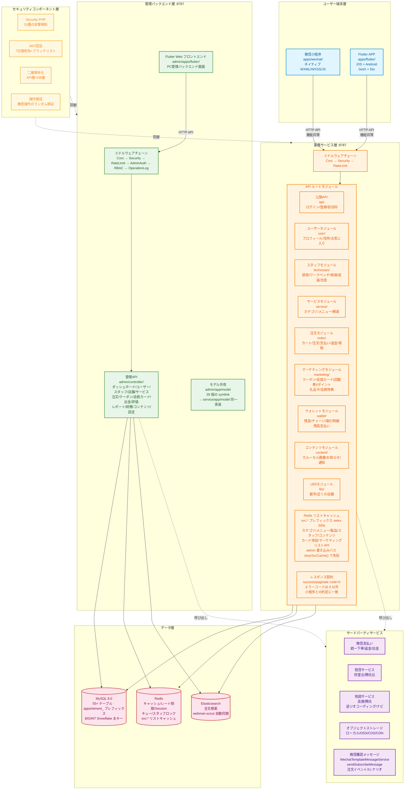

# システムアーキテクチャ図
> **Languages**: [中文](../../diagrams/ARCHITECTURE-DIAGRAM.md) · [English](../../en/diagrams/ARCHITECTURE-DIAGRAM.md) · [한국어](../../ko/diagrams/ARCHITECTURE-DIAGRAM.md) · [Русский](../../ru/diagrams/ARCHITECTURE-DIAGRAM.md) · [Deutsch](../../de/diagrams/ARCHITECTURE-DIAGRAM.md) · [Français](../../fr/diagrams/ARCHITECTURE-DIAGRAM.md) · [Español](../../es/diagrams/ARCHITECTURE-DIAGRAM.md) · [Português](../../pt/diagrams/ARCHITECTURE-DIAGRAM.md) · [हिन्दी](../../hi/diagrams/ARCHITECTURE-DIAGRAM.md) · [العربية](../../ar/diagrams/ARCHITECTURE-DIAGRAM.md) · [বাংলা](../../bn/diagrams/ARCHITECTURE-DIAGRAM.md) · [Bahasa Indonesia](../../id/diagrams/ARCHITECTURE-DIAGRAM.md)

