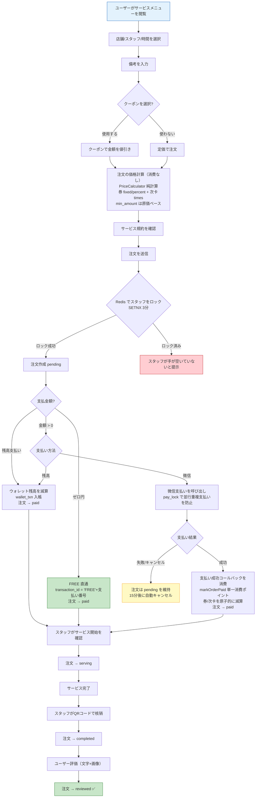
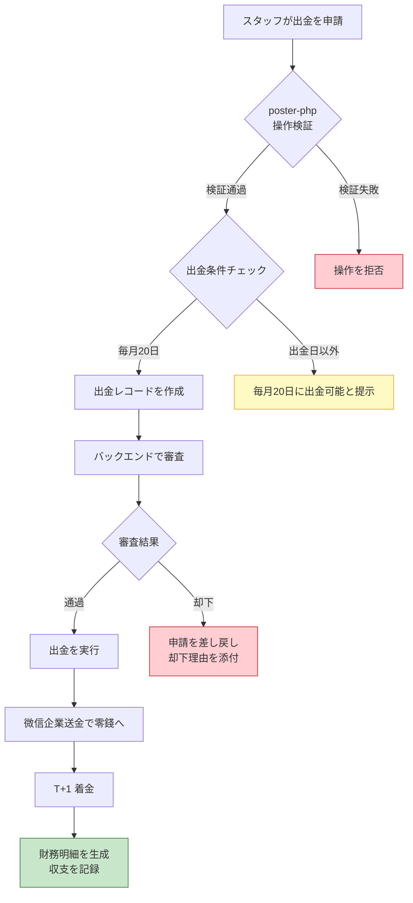
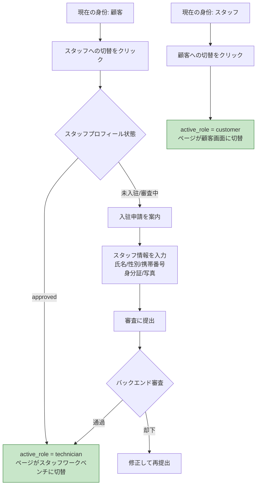
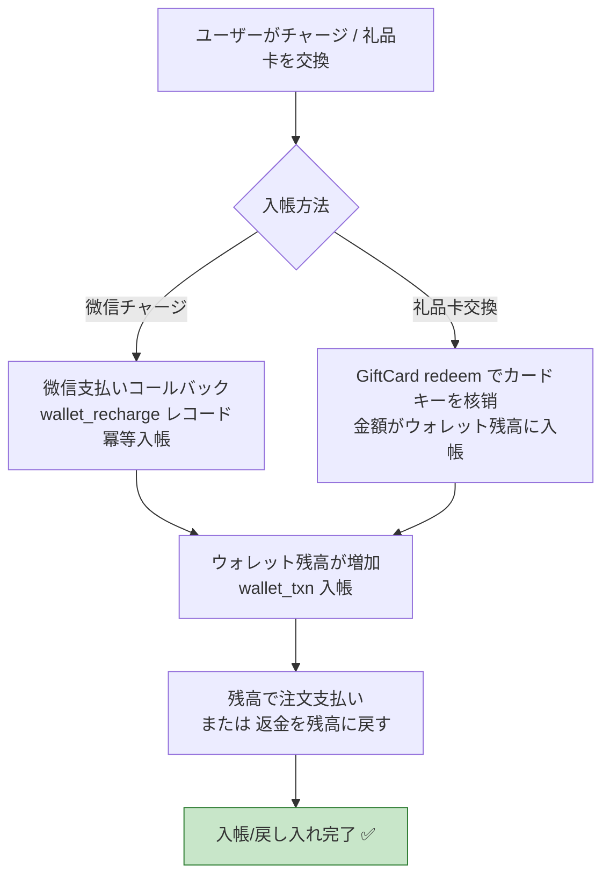

# コア業務フローチャート

## 1. サービス予約フロー

```mermaid
flowchart TD
    A["ユーザーがサービスメニューを閲覧"] --> B["店舗/スタッフ/時間を選択"]
    B --> C["備考を入力"]
    C --> D{"クーポンを選択?"}
    D -->|"使用する"| E["クーポンで金額を値引き"]
    D -->|"使わない"| F["定価で注文"]
    E --> G["注文の価格計算（消費なし）<br/>PriceCalculator 純計算<br/>券 fixed/percent + 次卡 times<br/>min_amount は原価ベース"]
    F --> G
    G --> H["サービス規約を確認"]
    H --> I["注文を送信"]
    I --> J{"Redis でスタッフをロック<br/>SETNX 3分"}
    J -->|"ロック成功"| K["注文作成 pending"]
    J -->|"ロック済み"| L["スタッフが手が空いていないと提示"]
    K --> M{"支払金額?"}
    M -->|"ゼロ円"| N["FREE 直通<br/>transaction_id = 'FREE'+支払い番号<br/>注文 → paid"]
    M -->|"残高支払い"| B1["ウォレット残高を減算<br/>wallet_txn 入帳<br/>注文 → paid"]
    M -->|"金額 > 0"| O{"支払い方法"}
    O -->|"微信"| OW["微信支払いを呼び出し<br/>pay_lock で並行重複支払いを防止"]
    O -->|"残高"| B1
    OW --> P{"支払い結果"}
    B1 --> S
    P -->|"成功"| Q["支払い成功コールバックを消費<br/>markOrderPaid 単一消費ポイント<br/>券/次卡を原子的に減算<br/>注文 → paid"]
    P -->|"失敗/キャンセル"| R["注文は pending を維持<br/>15分後に自動キャンセル"]
    N --> S["スタッフがサービス開始を確認"]
    Q --> S
    S --> T["注文 → serving"]
    T --> U["サービス完了"]
    U --> V["スタッフがQRコードで核销"]
    V --> W["注文 → completed"]
    W --> X["ユーザー評価（文字+画像）"]
    X --> Y["注文 → reviewed ✅"]

    style A fill:#e3f2fd,stroke:#1565c0,color:#333
    style Y fill:#c8e6c9,stroke:#2e7d32,color:#333
    style L fill:#ffcdd2,stroke:#c62828,color:#333
    style R fill:#fff9c4,stroke:#f9a825,color:#333
    style N fill:#c8e6c9,stroke:#2e7d32,color:#333
```

## 2. 支払いと返金フロー

```mermaid
flowchart TD
    subgraph 支付流程["順方向の支払いフロー"]
        P1["支払いレコード作成"] --> P2["微信統一下単<br/>pay_lock で並行防止<br/>out_trade_no = order_no 冪等"]
        P2 --> P3["フロントが支払いを起動<br/>支払い方法を選択"]
        P3 -->|"残高"| PB["ウォレット残高を減算<br/>wallet_txn 入帳<br/>冪等 一度だけ減算"]
        P3 -->|"微信"| P4["微信コールバック notify"]
        P4 --> P5["署名検証を通過"]
        PB --> P6["markOrderPaid 冪等<br/>券/次卡はこの一度だけ消費"]
        P5 --> P6
        P6 --> P7["注文 → paid<br/>ユーザー+スタッフに通知"]
    end

    subgraph 退款流程["返金フロー"]
        R1["ユーザーが返金を申請<br/>refund_lock で並行防止"] --> R2{"返金ルール判定"}
        R2 -->|"注文後≤15min または 開始まで>6h"| R3["返金 100%"]
        R2 -->|"開始まで≤6h"| R4["返金 90%"]
        R2 -->|"開始済み・未確認"| R5["返金 80%"]
        R2 -->|"サービス確認後"| R6["返金なし"]
        R3 --> R7["注文 → refunding"]
        R4 --> R7
        R5 --> R7
        R7 --> R8["二段階審査<br/>店長→財務"]
        R8 --> R9["二段階返金<br/>トランザクション内で返金レコード作成<br/>トランザクション外で微信返金 IO"]
        R9 -->|"微信失敗"| R10["注文を PAID にロールバック<br/>返金を再試行可能"]
        R9 -->|"返金成功"| R11["注文 → refunded<br/>微信は元ルート返却 / 残高に戻す<br/>クーポン返還 + ポイント回扣"]
    end

    style P6 fill:#c8e6c9,stroke:#2e7d32,color:#333
    style R6 fill:#ffcdd2,stroke:#c62828,color:#333
    style R11 fill:#c8e6c9,stroke:#2e7d32,color:#333
    style R10 fill:#fff9c4,stroke:#f9a825,color:#333
```

## 3. スタッフ出金フロー

```mermaid
flowchart TD
    A["スタッフが出金を申請"] --> B{"poster-php<br/>操作検証"}
    B -->|"検証通過"| C{"出金条件チェック"}
    B -->|"検証失敗"| X["操作を拒否"]
    C -->|"毎月20日"| D["出金レコードを作成"]
    C -->|"出金日以外"| Y["毎月20日に出金可能と提示"]
    D --> E["バックエンドで審査"]
    E --> F{"審査結果"}
    F -->|"通過"| G["出金を実行"]
    F -->|"却下"| H["申請を差し戻し<br/>却下理由を添付"]
    G --> I["微信企業送金で零錢へ"]
    I --> J["T+1 着金"]
    J --> K["財務明細を生成<br/>収支を記録"]

    style K fill:#c8e6c9,stroke:#2e7d32,color:#333
    style X fill:#ffcdd2,stroke:#c62828,color:#333
    style Y fill:#fff9c4,stroke:#f9a825,color:#333
    style H fill:#ffcdd2,stroke:#c62828,color:#333
```

## 4. 身份切替フロー

```mermaid
flowchart TD
    A["現在の身份: 顧客"] --> B["スタッフへの切替をクリック"]
    B --> C{"スタッフプロフィール状態"}
    C -->|"approved"| D["active_role = technician<br/>ページがスタッフワークベンチに切替"]
    C -->|"未入驻/審査中"| E["入驻申請を案内"]
    E --> F["スタッフ情報を入力<br/>氏名/性別/携帯番号<br/>身分証/写真"]
    F --> G["審査に提出"]
    G --> H{"バックエンド審査"}
    H -->|"通過"| D
    H -->|"却下"| I["修正して再提出"]

    J["現在の身份: スタッフ"] --> K["顧客への切替をクリック"]
    K --> L["active_role = customer<br/>ページが顧客画面に切替"]

    style D fill:#c8e6c9,stroke:#2e7d32,color:#333
    style L fill:#c8e6c9,stroke:#2e7d32,color:#333
```

## 5. ウォレットチャージ/礼品卡入帳フロー

```mermaid
flowchart TD
    A["ユーザーがチャージ / 礼品卡を交換"] --> B{"入帳方法"}
    B -->|"微信チャージ"| C["微信支払いコールバック<br/>wallet_recharge レコード<br/>冪等入帳"]
    B -->|"礼品卡交換"| D["GiftCard redeem でカードキーを核销<br/>金額がウォレット残高に入帳"]
    C --> E["ウォレット残高が増加<br/>wallet_txn 入帳"]
    D --> E
    E --> F["残高で注文支払い<br/>または 返金を残高に戻す"]
    F --> G["入帳/戻し入れ完了 ✅"]

    style G fill:#c8e6c9,stroke:#2e7d32,color:#333
```
