# ライフサイクル図
> **Languages**: [中文](../../diagrams/LIFECYCLE-DIAGRAM.md) · [English](../../en/diagrams/LIFECYCLE-DIAGRAM.md) · [한국어](../../ko/diagrams/LIFECYCLE-DIAGRAM.md) · [Русский](../../ru/diagrams/LIFECYCLE-DIAGRAM.md) · [Deutsch](../../de/diagrams/LIFECYCLE-DIAGRAM.md) · [Français](../../fr/diagrams/LIFECYCLE-DIAGRAM.md) · [Español](../../es/diagrams/LIFECYCLE-DIAGRAM.md) · [Português](../../pt/diagrams/LIFECYCLE-DIAGRAM.md) · [हिन्दी](../../hi/diagrams/LIFECYCLE-DIAGRAM.md) · [العربية](../../ar/diagrams/LIFECYCLE-DIAGRAM.md) · [বাংলা](../../bn/diagrams/LIFECYCLE-DIAGRAM.md) · [Bahasa Indonesia](../../id/diagrams/LIFECYCLE-DIAGRAM.md)

## 1. 注文ライフサイクル（状態機械）

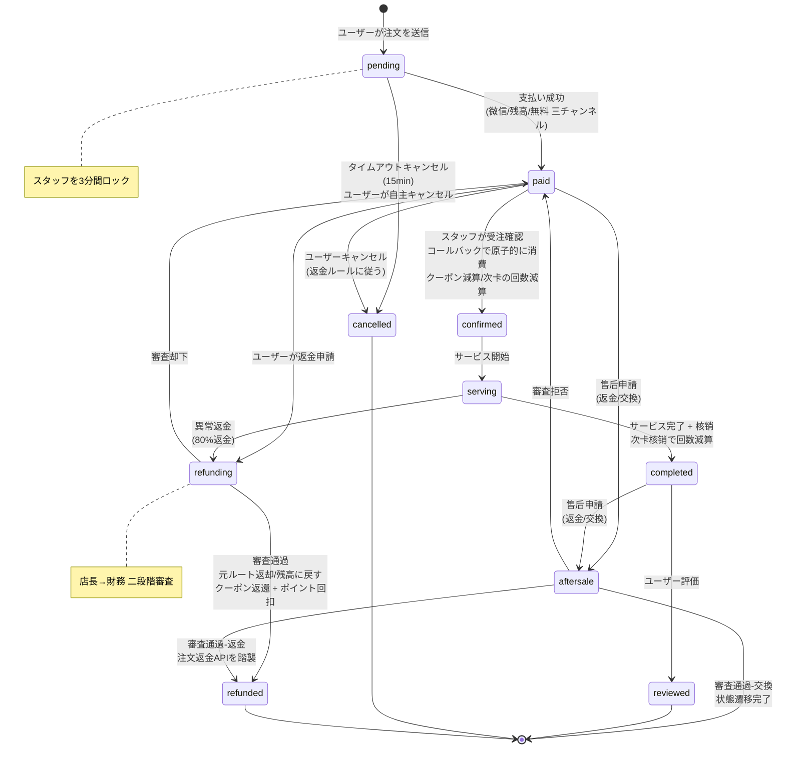
```mermaid
stateDiagram-v2
    [*] --> pending: ユーザーが注文を送信

    pending --> paid: 支払い成功<br/>(微信/残高/無料 三チャンネル)

    pending --> cancelled: タイムアウトキャンセル(15min)<br/>ユーザーが自主キャンセル

    paid --> confirmed: スタッフが受注確認<br/>コールバックで原子的に消費<br/>クーポン減算/次卡の回数減算
    paid --> cancelled: ユーザーキャンセル<br/>(返金ルールに従う)
    paid --> refunding: ユーザーが返金申請
    paid --> aftersale: 售后申請<br/>(返金/交換)

    confirmed --> serving: サービス開始

    serving --> completed: サービス完了 + 核销<br/>次卡核销で回数減算

    serving --> refunding: 異常返金<br/>(80%返金)

    completed --> reviewed: ユーザー評価
    completed --> aftersale: 售后申請<br/>(返金/交換)

    refunding --> refunded: 審査通過<br/>元ルート返却/残高に戻す<br/>クーポン返還 + ポイント回扣
    refunding --> paid: 審査却下

    aftersale --> refunded: 審査通過-返金<br/>注文返金APIを踏襲
    aftersale --> paid: 審査拒否
    aftersale --> [*]: 審査通過-交換<br/>状態遷移完了

    reviewed --> [*]
    cancelled --> [*]
    refunded --> [*]

    note right of pending: スタッフを3分間ロック
    note right of refunding: 店長→財務 二段階審査
```

## 2. 会員カードライフサイクル

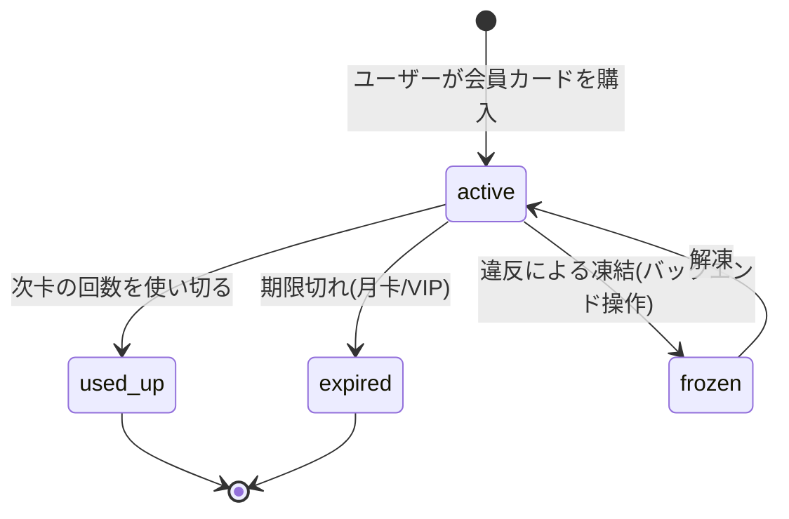
```mermaid
stateDiagram-v2
    [*] --> active: ユーザーが会員カードを購入

    active --> used_up: 次卡の回数を使い切る

    active --> expired: 期限切れ(月卡/VIP)

    active --> frozen: 違反による凍結(バックエンド操作)

    frozen --> active: 解凍

    used_up --> [*]
    expired --> [*]
```

## 3. スタッフ入驻ライフサイクル

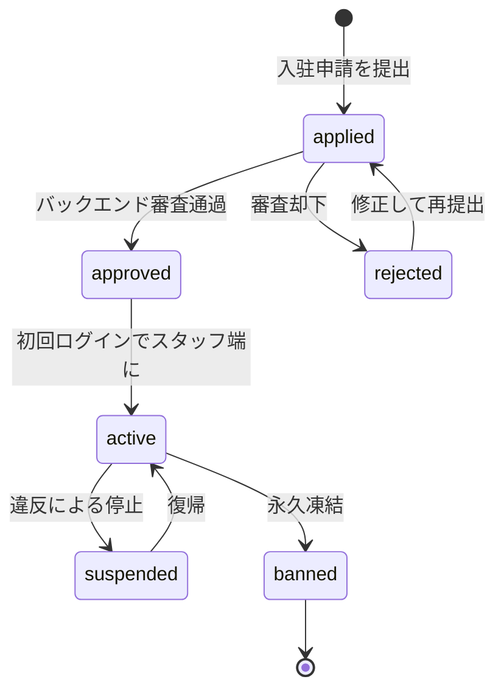
```mermaid
stateDiagram-v2
    [*] --> applied: 入驻申請を提出

    applied --> approved: バックエンド審査通過
    applied --> rejected: 審査却下

    rejected --> applied: 修正して再提出

    approved --> active: 初回ログインでスタッフ端に

    active --> suspended: 違反による停止
    suspended --> active: 復帰
    active --> banned: 永久凍結

    banned --> [*]
```

## 4. クーポンライフサイクル

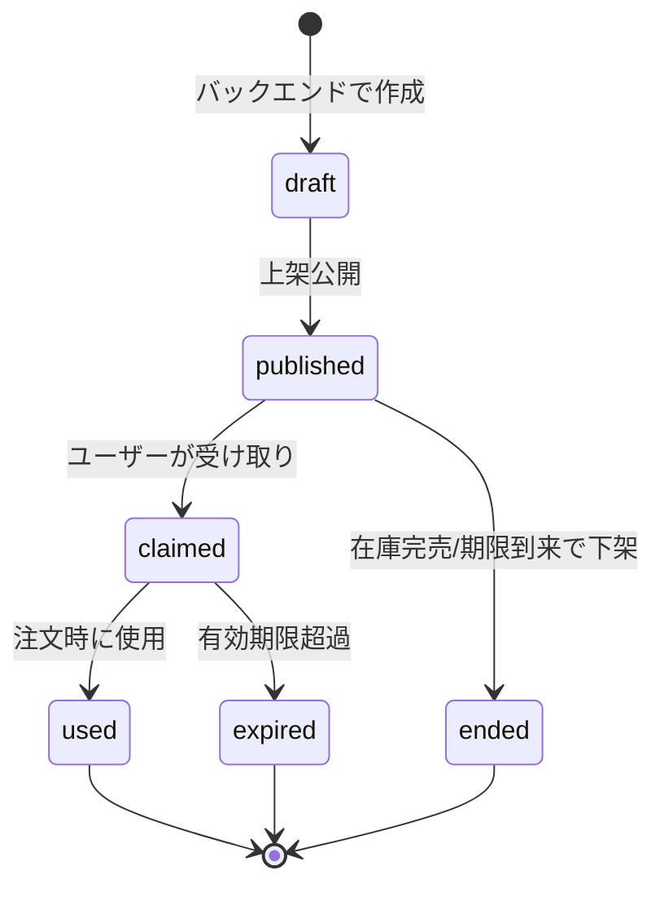
```mermaid
stateDiagram-v2
    [*] --> draft: バックエンドで作成

    draft --> published: 上架公開

    published --> claimed: ユーザーが受け取り

    claimed --> used: 注文時に使用
    claimed --> expired: 有効期限超過

    published --> ended: 在庫完売/期限到来で下架

    used --> [*]
    expired --> [*]
    ended --> [*]
```

## 5. スタッフ出金ライフサイクル

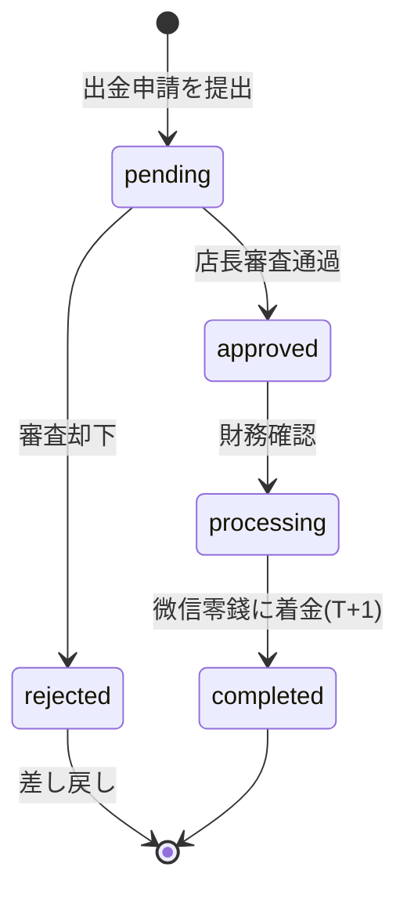
```mermaid
stateDiagram-v2
    [*] --> pending: 出金申請を提出

    pending --> approved: 店長審査通過
    pending --> rejected: 審査却下

    rejected --> [*]: 差し戻し

    approved --> processing: 財務確認

    processing --> completed: 微信零錢に着金(T+1)

    completed --> [*]
```

## 6. Token 認証ライフサイクル

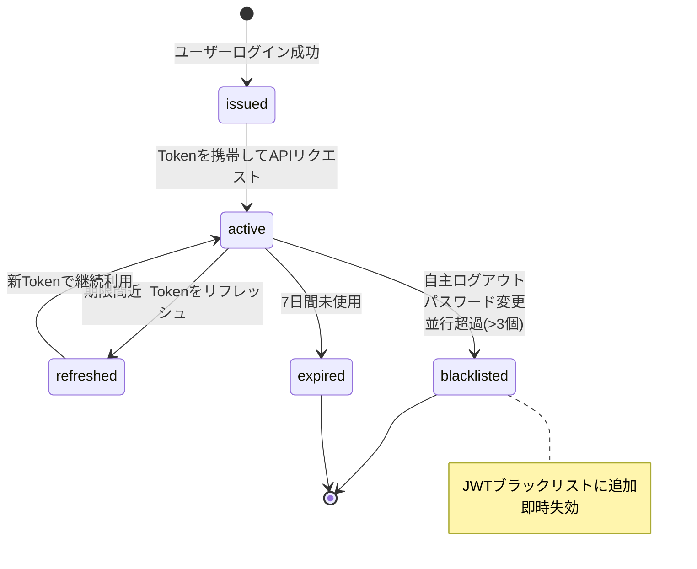
```mermaid
stateDiagram-v2
    [*] --> issued: ユーザーログイン成功

    issued --> active: Tokenを携帯してAPIリクエスト

    active --> refreshed: 期限間近  Tokenをリフレッシュ

    refreshed --> active: 新Tokenで継続利用

    active --> blacklisted: 自主ログアウト<br/>パスワード変更<br/>並行超過(>3個)

    active --> expired: 7日間未使用

    blacklisted --> [*]
    expired --> [*]

    note right of blacklisted: JWTブラックリストに追加<br/>即時失効
```

## 7. 拼团キャンペーンライフサイクル

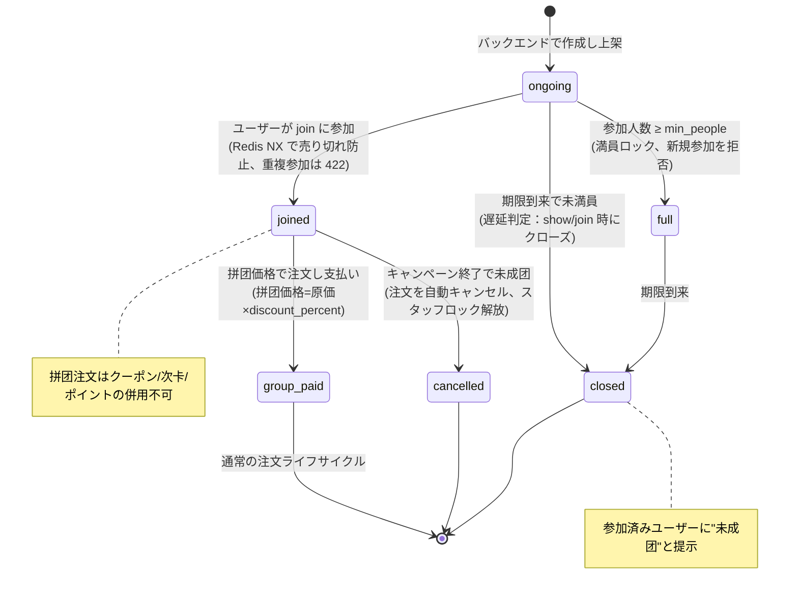
```mermaid
stateDiagram-v2
    [*] --> ongoing: バックエンドで作成し上架

    ongoing --> full: 参加人数 ≥ min_people<br/>(満員ロック、新規参加を拒否)

    ongoing --> closed: 期限到来で未満員<br/>(遅延判定：show/join 時にクローズ)

    full --> closed: 期限到来

    ongoing --> joined: ユーザーが join に参加<br/>(Redis NX で売り切れ防止、重複参加は 422)

    joined --> group_paid: 拼团価格で注文し支払い<br/>(拼团価格=原価×discount_percent)

    joined --> cancelled: キャンペーン終了で未成团<br/>(注文を自動キャンセル、スタッフロック解放)

    group_paid --> [*]: 通常の注文ライフサイクル
    cancelled --> [*]
    closed --> [*]

    note right of joined: 拼团注文はクーポン/次卡/ポイントの併用不可
    note right of closed: 参加済みユーザーに"未成团"と提示
```

## 8. クーポン転贈ライフサイクル

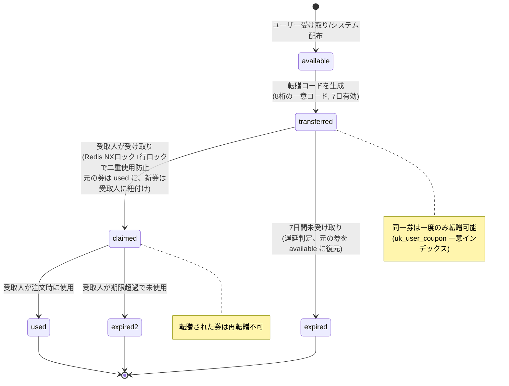
```mermaid
stateDiagram-v2
    [*] --> available: ユーザー受け取り/システム配布

    available --> transferred: 転贈コードを生成<br/>(8桁の一意コード, 7日有効)

    transferred --> claimed: 受取人が受け取り<br/>(Redis NXロック+行ロックで二重使用防止<br/>元の券は used に、新券は受取人に紐付け)

    transferred --> expired: 7日間未受け取り<br/>(遅延判定、元の券を available に復元)

    claimed --> used: 受取人が注文時に使用
    claimed --> expired2: 受取人が期限超過で未使用

    used --> [*]
    expired --> [*]
    expired2 --> [*]

    note right of transferred: 同一券は一度のみ転贈可能<br/>(uk_user_coupon 一意インデックス)
    note right of claimed: 転贈された券は再転贈不可
```

## 9. ポイント有効期限ライフサイクル

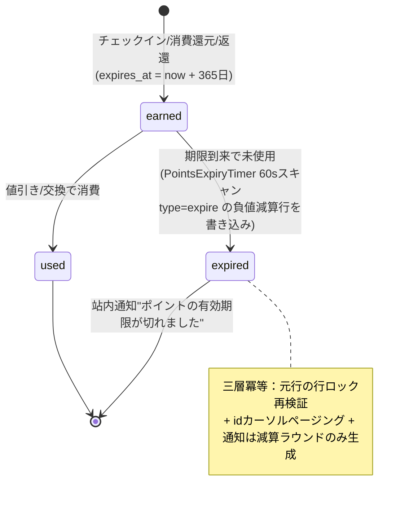
```mermaid
stateDiagram-v2
    [*] --> earned: チェックイン/消費還元/返還<br/>(expires_at = now + 365日)

    earned --> used: 値引き/交換で消費

    earned --> expired: 期限到来で未使用<br/>(PointsExpiryTimer 60sスキャン<br/>type=expire の負値減算行を書き込み)

    expired --> [*]: 站内通知"ポイントの有効期限が切れました"
    used --> [*]

    note right of expired: 三層冪等：元行の行ロック再検証<br/>+ idカーソルページング + 通知は減算ラウンドのみ生成
```

## 10. 振替ライフサイクル（第19ラウンド：残高振替 + ポイント転贈）

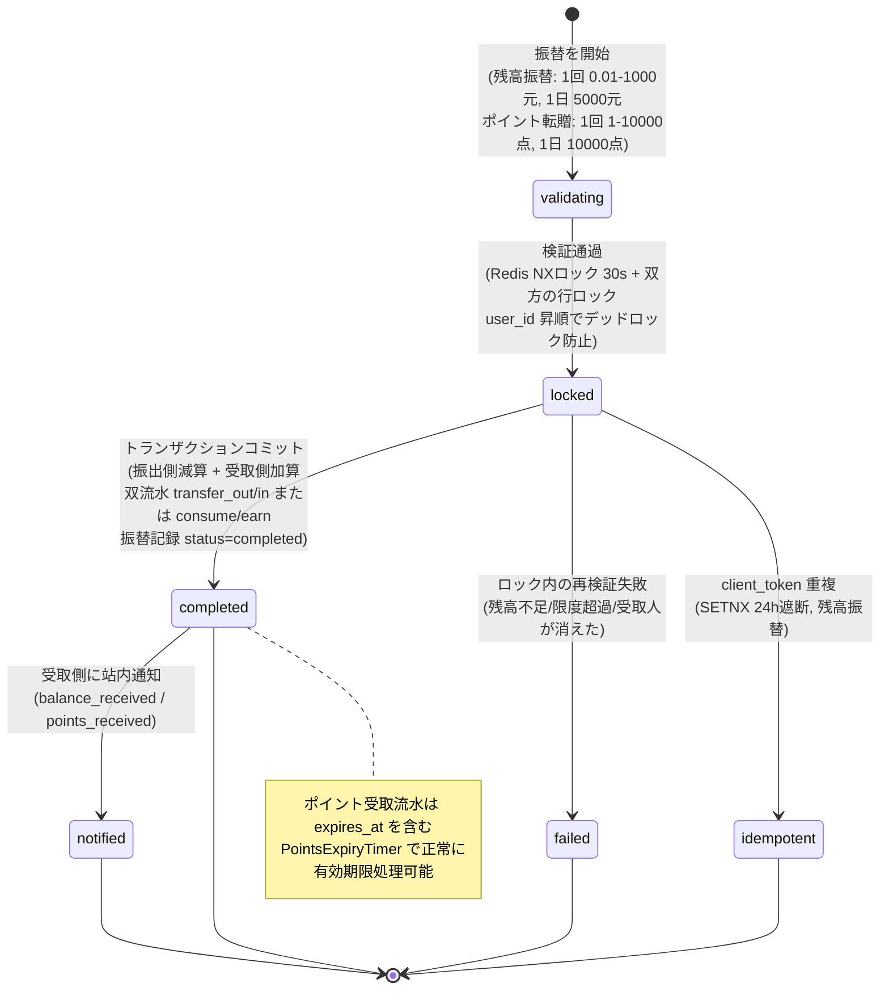
```mermaid
stateDiagram-v2
    [*] --> validating: 振替を開始<br/>(残高振替: 1回 0.01-1000元, 1日 5000元<br/>ポイント転贈: 1回 1-10000点, 1日 10000点)

    validating --> locked: 検証通過<br/>(Redis NXロック 30s + 双方の行ロック<br/>user_id 昇順でデッドロック防止)

    locked --> completed: トランザクションコミット<br/>(振出側減算 + 受取側加算<br/>双流水 transfer_out/in または consume/earn<br/>振替記録 status=completed)

    locked --> failed: ロック内の再検証失敗<br/>(残高不足/限度超過/受取人が消えた)
    locked --> idempotent: client_token 重複<br/>(SETNX 24h遮断, 残高振替)

    completed --> notified: 受取側に站内通知<br/>(balance_received / points_received)
    completed --> [*]
    failed --> [*]
    idempotent --> [*]
    notified --> [*]

    note right of completed: ポイント受取流水は expires_at を含む<br/>PointsExpiryTimer で正常に有効期限処理可能
```

## 11. 客服工单ライフサイクル（第20ラウンド）

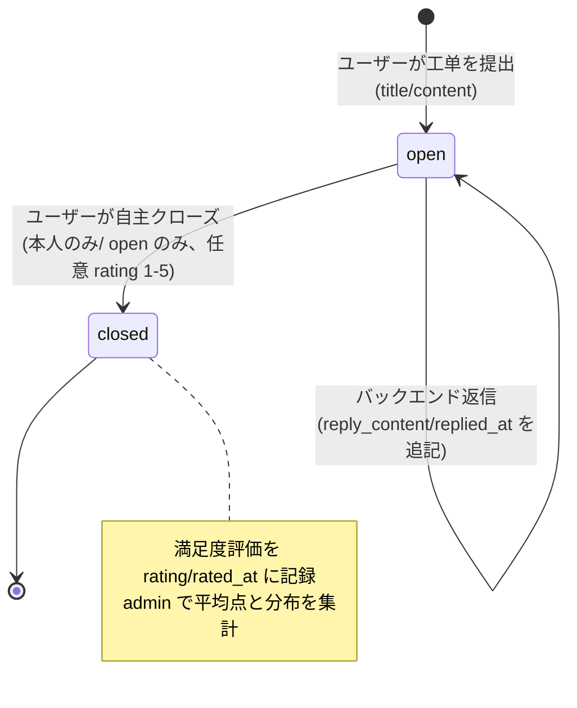
```mermaid
stateDiagram-v2
    [*] --> open: ユーザーが工单を提出<br/>(title/content)

    open --> open: バックエンド返信<br/>(reply_content/replied_at を追記)

    open --> closed: ユーザーが自主クローズ<br/>(本人のみ/ open のみ、任意 rating 1-5)

    closed --> [*]

    note right of closed: 満足度評価を rating/rated_at に記録<br/>admin で平均点と分布を集計
```

## 12. 電子インボイスライフサイクル（第20ラウンド）

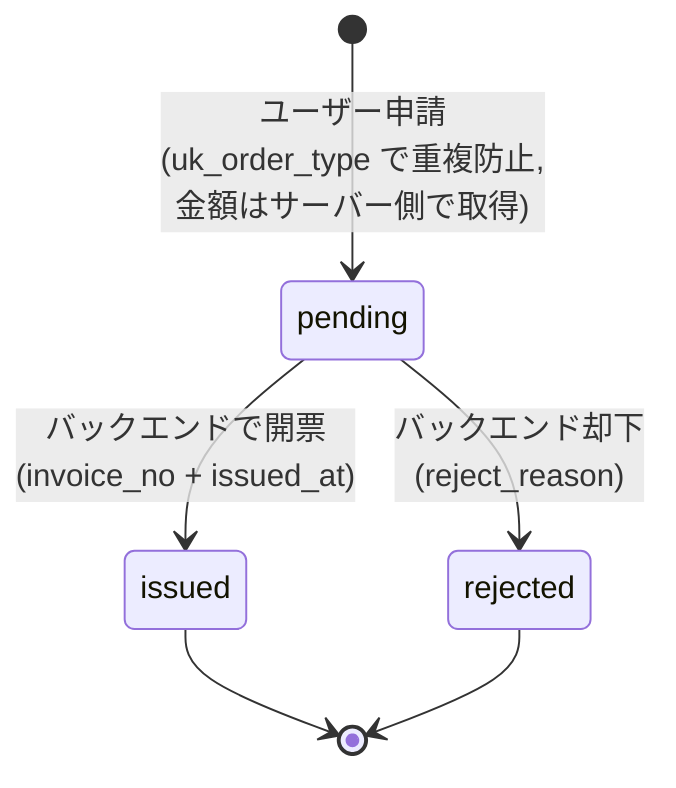
```mermaid
stateDiagram-v2
    [*] --> pending: ユーザー申請<br/>(uk_order_type で重複防止,<br/>金額はサーバー側で取得)

    pending --> issued: バックエンドで開票<br/>(invoice_no + issued_at)

    pending --> rejected: バックエンド却下<br/>(reject_reason)

    issued --> [*]
    rejected --> [*]
```

## 13. 満減キャンペーンライフサイクル（第22ラウンド）

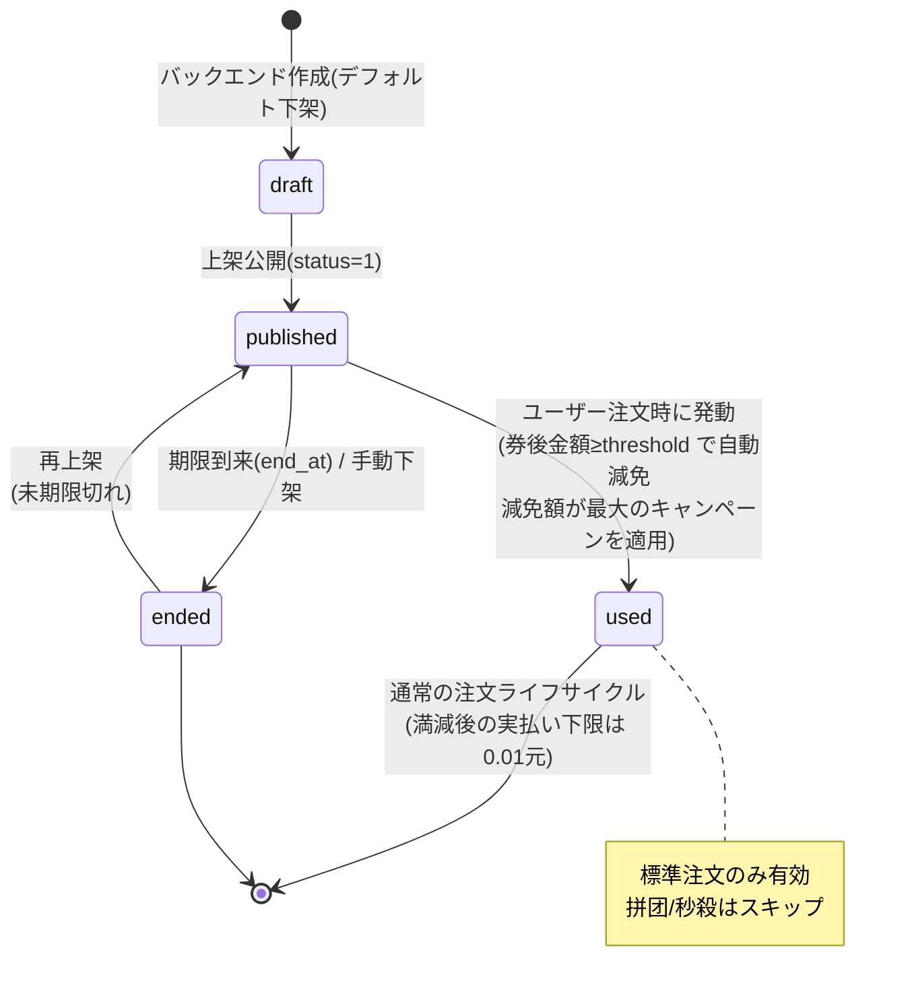
```mermaid
stateDiagram-v2
    [*] --> draft: バックエンド作成(デフォルト下架)

    draft --> published: 上架公開(status=1)

    published --> ended: 期限到来(end_at) / 手動下架

    published --> used: ユーザー注文時に発動<br/>(券後金額≥threshold で自動減免<br/>減免額が最大のキャンペーンを適用)

    used --> [*]: 通常の注文ライフサイクル<br/>(満減後の実払い下限は 0.01元)

    ended --> published: 再上架<br/>(未期限切れ)

    ended --> [*]

    note right of used: 標準注文のみ有効<br/>拼团/秒殺はスキップ
```

## 15. 抽選ライフサイクル（第23ラウンド）

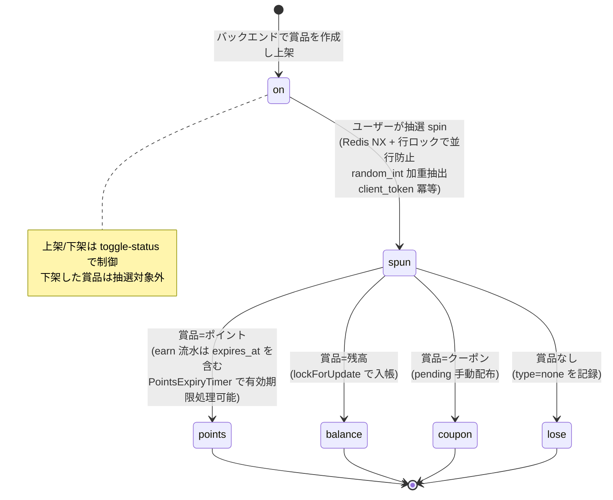
```mermaid
stateDiagram-v2
    [*] --> on: バックエンドで賞品を作成し上架

    on --> spun: ユーザーが抽選 spin<br/>(Redis NX + 行ロックで並行防止<br/>random_int 加重抽出<br/>client_token 冪等)

    spun --> points: 賞品=ポイント<br/>(earn 流水は expires_at を含む<br/>PointsExpiryTimer で有効期限処理可能)

    spun --> balance: 賞品=残高<br/>(lockForUpdate で入帳)

    spun --> coupon: 賞品=クーポン<br/>(pending 手動配布)

    spun --> lose: 賞品なし<br/>(type=none を記録)

    points --> [*]
    balance --> [*]
    coupon --> [*]
    lose --> [*]

    note right of on: 上架/下架は toggle-status で制御<br/>下架した賞品は抽選対象外
```

## 14. アカウント注销ライフサイクル（第22ラウンド）

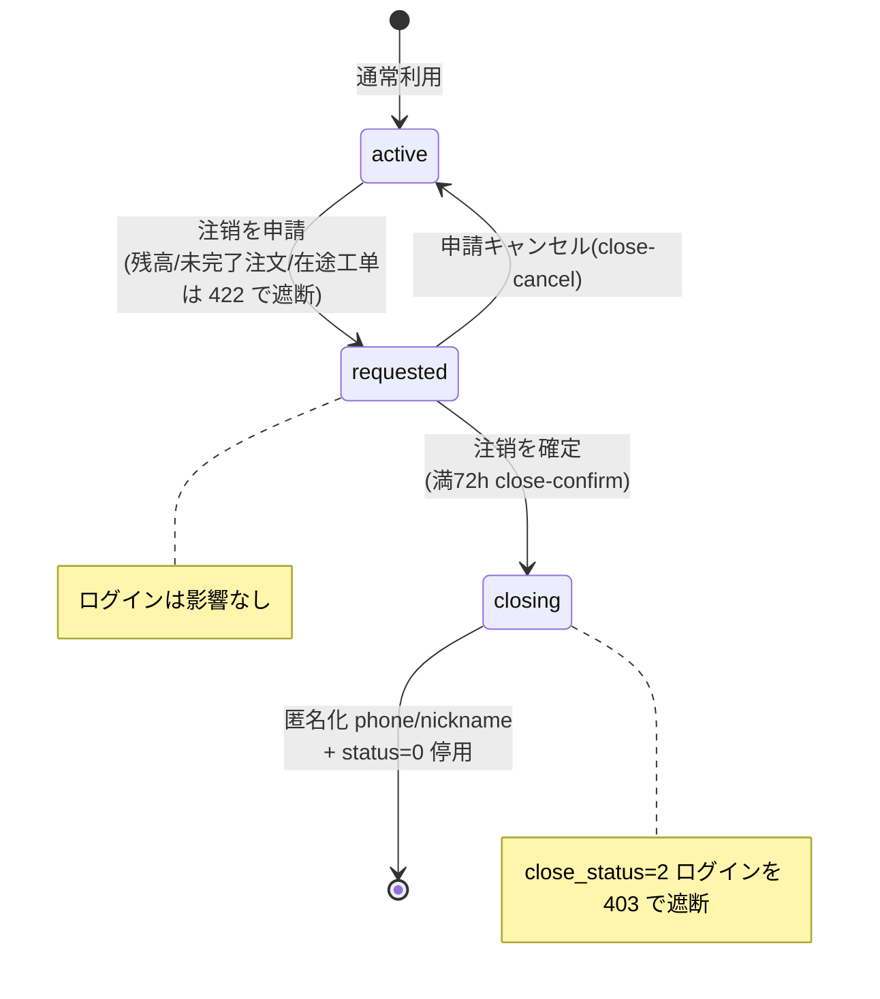
```mermaid
stateDiagram-v2
    [*] --> active: 通常利用

    active --> requested: 注销を申請<br/>(残高/未完了注文/在途工单は 422 で遮断)

    requested --> active: 申請キャンセル(close-cancel)

    requested --> closing: 注销を確定<br/>(満72h close-confirm)

    closing --> [*]: 匿名化 phone/nickname<br/>+ status=0 停用

    note right of requested: ログインは影響なし
    note right of closing: close_status=2 ログインを 403 で遮断
```

## 16. 秒殺キャンペーンライフサイクル（第24ラウンド）

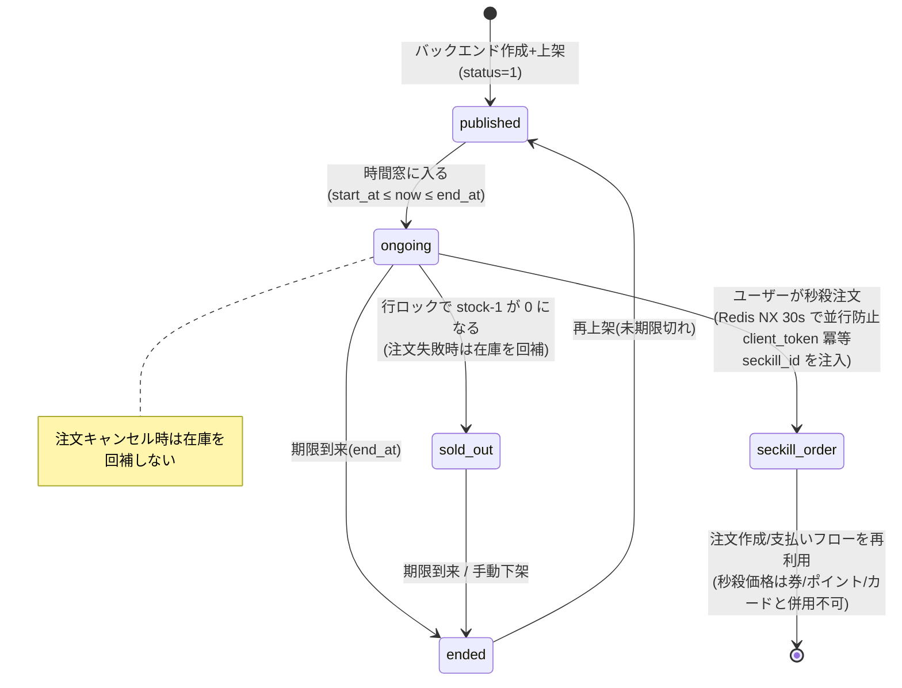
```mermaid
stateDiagram-v2
    [*] --> published: バックエンド作成+上架(status=1)

    published --> ongoing: 時間窓に入る<br/>(start_at ≤ now ≤ end_at)

    ongoing --> sold_out: 行ロックで stock-1 が 0 になる<br/>(注文失敗時は在庫を回補)

    ongoing --> ended: 期限到来(end_at)

    sold_out --> ended: 期限到来 / 手動下架

    ended --> published: 再上架(未期限切れ)

    ongoing --> seckill_order: ユーザーが秒殺注文<br/>(Redis NX 30s で並行防止<br/>client_token 冪等<br/>seckill_id を注入)

    seckill_order --> [*]: 注文作成/支払いフローを再利用<br/>(秒殺価格は券/ポイント/カードと併用不可)

    note right of ongoing: 注文キャンセル時は在庫を回補しない
```

## 17. リピーター報酬ライフサイクル（第24ラウンド）

```mermaid
stateDiagram-v2
    [*] --> completed: 注文完了<br/>(WorkController::complete 行ロックトランザクション)

    completed --> checked: 30日以内の同一スタッフ2回目消費を判定

    checked --> none: 初回消費 / スイッチオフ<br/>(enabled=0)

    checked --> pending: 2回目消費<br/>(ボーナス=実払い×ratio<br/>同 order_id+type 冪等)

    pending --> settled: 佣金決済チェーンで一括決済<br/>(erik_technician_earnings<br/>type=return_customer)

    settled --> [*]
    none --> [*]

    note right of pending: status=pending<br/>スタッフ端の収益集計に自動で含まれる
```
