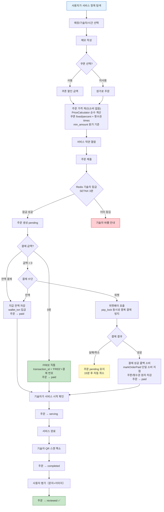
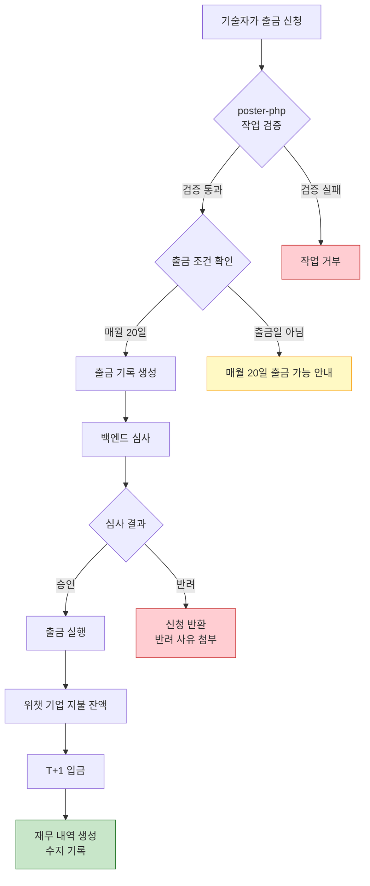
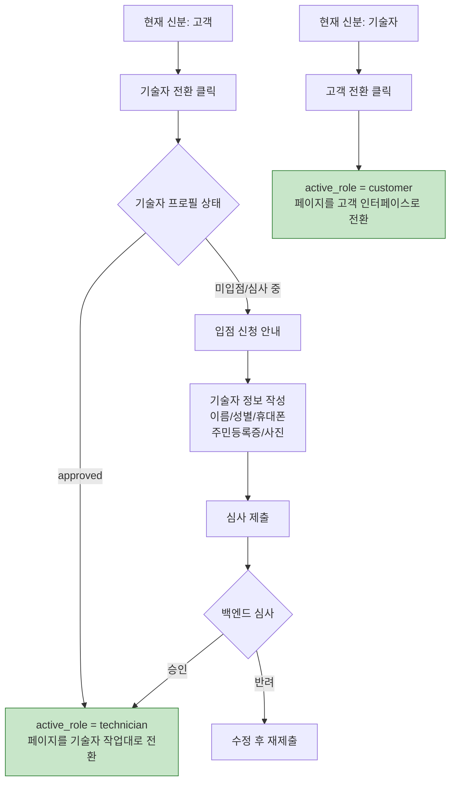
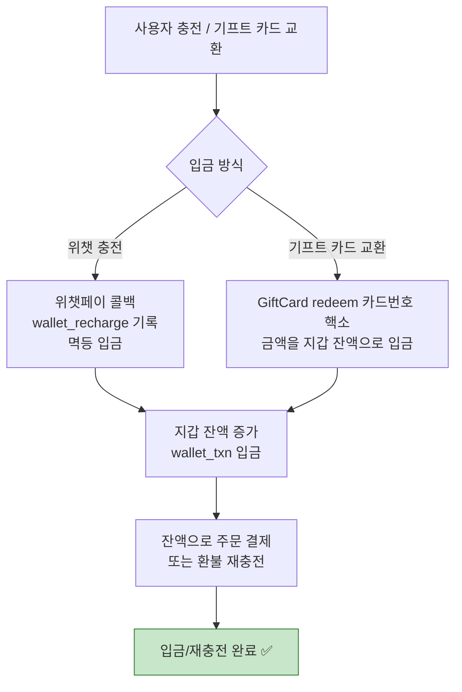

# 핵심 비즈니스 플로우차트

## 1. 서비스 예약 플로우

```mermaid
flowchart TD
    A["사용자가 서비스 항목 탐색"] --> B["매장/기술자/시간 선택"]
    B --> C["메모 작성"]
    C --> D{"쿠폰 선택?"}
    D -->|"사용"| E["쿠폰 할인 금액"]
    D -->|"미사용"| F["원가로 주문"]
    E --> G["주문 가격 계산(소비 없음)<br/>PriceCalculator 순수 계산<br/>쿠폰 fixed/percent + 횟수권 times<br/>min_amount 원가 기준"]
    F --> G
    G --> H["서비스 약관 열람"]
    H --> I["주문 제출"]
    I --> J{"Redis 기술자 잠금<br/>SETNX 3분"}
    J -->|"잠금 성공"| K["주문 생성 pending"]
    J -->|"이미 잠김"| L["기술자 바쁨 안내"]
    K --> M{"결제 금액?"}
    M -->|"0원"| N["FREE 직통<br/>transaction_id = 'FREE'+결제 번호<br/>주문 → paid"]
    M -->|"잔액 결제"| B1["지갑 잔액 차감<br/>wallet_txn 입금<br/>주문 → paid"]
    M -->|"금액 > 0"| O{"결제 수단"}
    O -->|"위챗"| OW["위챗페이 호출<br/>pay_lock 동시성 중복 결제 방지"]
    O -->|"잔액"| B1
    OW --> P{"결제 결과"}
    B1 --> S
    P -->|"성공"| Q["결제 성공 콜백 소비<br/>markOrderPaid 단일 소비 지점<br/>쿠폰/횟수권 원자 차감<br/>주문 → paid"]
    P -->|"실패/취소"| R["주문 pending 유지<br/>15분 후 자동 취소"]
    N --> S["기술자가 서비스 시작 확인"]
    Q --> S
    S --> T["주문 → serving"]
    T --> U["서비스 완료"]
    U --> V["기술자 QR 스캔 핵소"]
    V --> W["주문 → completed"]
    W --> X["사용자 평가（문자+이미지）"]
    X --> Y["주문 → reviewed ✅"]

    style A fill:#e3f2fd,stroke:#1565c0,color:#333
    style Y fill:#c8e6c9,stroke:#2e7d32,color:#333
    style L fill:#ffcdd2,stroke:#c62828,color:#333
    style R fill:#fff9c4,stroke:#f9a825,color:#333
    style N fill:#c8e6c9,stroke:#2e7d32,color:#333
```

## 2. 결제와 환불 플로우

```mermaid
flowchart TD
    subgraph 결제_플로우["정방향 결제 플로우"]
        P1["결제 기록 생성"] --> P2["위챗 통합 주문<br/>pay_lock 동시성 방지<br/>out_trade_no = order_no 멱등"]
        P2 --> P3["프런트 결제 호출<br/>결제 수단 선택"]
        P3 -->|"잔액"| PB["지갑 잔액 차감<br/>wallet_txn 입금<br/>멱등 1회만 차감"]
        P3 -->|"위챗"| P4["위챗 콜백 notify"]
        P4 --> P5["서명 검증 통과"]
        PB --> P6["markOrderPaid 멱등<br/>쿠폰/횟수권 이 소비 지점에서만"]
        P5 --> P6
        P6 --> P7["주문 → paid<br/>사용자+기술자 알림"]
    end

    subgraph 환불_플로우["환불 플로우"]
        R1["사용자 환불 신청<br/>refund_lock 동시성 방지"] --> R2{"환불 규칙 판정"}
        R2 -->|"주문 후 ≤15min 또는 시작까지 >6h"| R3["환불 100%"]
        R2 -->|"시작까지 ≤6h"| R4["환불 90%"]
        R2 -->|"시작했지만 미확인"| R5["환불 80%"]
        R2 -->|"서비스 확인 후"| R6["환불 불가"]
        R3 --> R7["주문 → refunding"]
        R4 --> R7
        R5 --> R7
        R7 --> R8["2단계 승인<br/>점장→재무"]
        R8 --> R9["2단계 환불<br/>트랜잭션 내 환불 기록 생성<br/>트랜잭션 외 위챗 환불 IO"]
        R9 -->|"위챗 실패"| R10["주문 PAID 롤백<br/>환불 재시도 가능"]
        R9 -->|"환불 성공"| R11["주문 → refunded<br/>위챗 원래 경로 반환 / 잔액 재충전<br/>쿠폰 반환 + 포인트 회수"]
    end

    style P6 fill:#c8e6c9,stroke:#2e7d32,color:#333
    style R6 fill:#ffcdd2,stroke:#c62828,color:#333
    style R11 fill:#c8e6c9,stroke:#2e7d32,color:#333
    style R10 fill:#fff9c4,stroke:#f9a825,color:#333
```

## 3. 기술자 출금 플로우

```mermaid
flowchart TD
    A["기술자가 출금 신청"] --> B{"poster-php<br/>작업 검증"}
    B -->|"검증 통과"| C{"출금 조건 확인"}
    B -->|"검증 실패"| X["작업 거부"]
    C -->|"매월 20일"| D["출금 기록 생성"]
    C -->|"출금일 아님"| Y["매월 20일 출금 가능 안내"]
    D --> E["백엔드 심사"]
    E --> F{"심사 결과"}
    F -->|"승인"| G["출금 실행"]
    F -->|"반려"| H["신청 반환<br/>반려 사유 첨부"]
    G --> I["위챗 기업 지불 잔액"]
    I --> J["T+1 입금"]
    J --> K["재무 내역 생성<br/>수지 기록"]

    style K fill:#c8e6c9,stroke:#2e7d32,color:#333
    style X fill:#ffcdd2,stroke:#c62828,color:#333
    style Y fill:#fff9c4,stroke:#f9a825,color:#333
    style H fill:#ffcdd2,stroke:#c62828,color:#333
```

## 4. 신분 전환 플로우

```mermaid
flowchart TD
    A["현재 신분: 고객"] --> B["기술자 전환 클릭"]
    B --> C{"기술자 프로필 상태"}
    C -->|"approved"| D["active_role = technician<br/>페이지를 기술자 작업대로 전환"]
    C -->|"미입점/심사 중"| E["입점 신청 안내"]
    E --> F["기술자 정보 작성<br/>이름/성별/휴대폰<br/>주민등록증/사진"]
    F --> G["심사 제출"]
    G --> H{"백엔드 심사"}
    H -->|"승인"| D
    H -->|"반려"| I["수정 후 재제출"]

    J["현재 신분: 기술자"] --> K["고객 전환 클릭"]
    K --> L["active_role = customer<br/>페이지를 고객 인터페이스로 전환"]

    style D fill:#c8e6c9,stroke:#2e7d32,color:#333
    style L fill:#c8e6c9,stroke:#2e7d32,color:#333
```

## 5. 지갑 충전/기프트 카드 입금 플로우

```mermaid
flowchart TD
    A["사용자 충전 / 기프트 카드 교환"] --> B{"입금 방식"}
    B -->|"위챗 충전"| C["위챗페이 콜백<br/>wallet_recharge 기록<br/>멱등 입금"]
    B -->|"기프트 카드 교환"| D["GiftCard redeem 카드번호 핵소<br/>금액을 지갑 잔액으로 입금"]
    C --> E["지갑 잔액 증가<br/>wallet_txn 입금"]
    D --> E
    E --> F["잔액으로 주문 결제<br/>또는 환불 재충전"]
    F --> G["입금/재충전 완료 ✅"]

    style G fill:#c8e6c9,stroke:#2e7d32,color:#333
```
