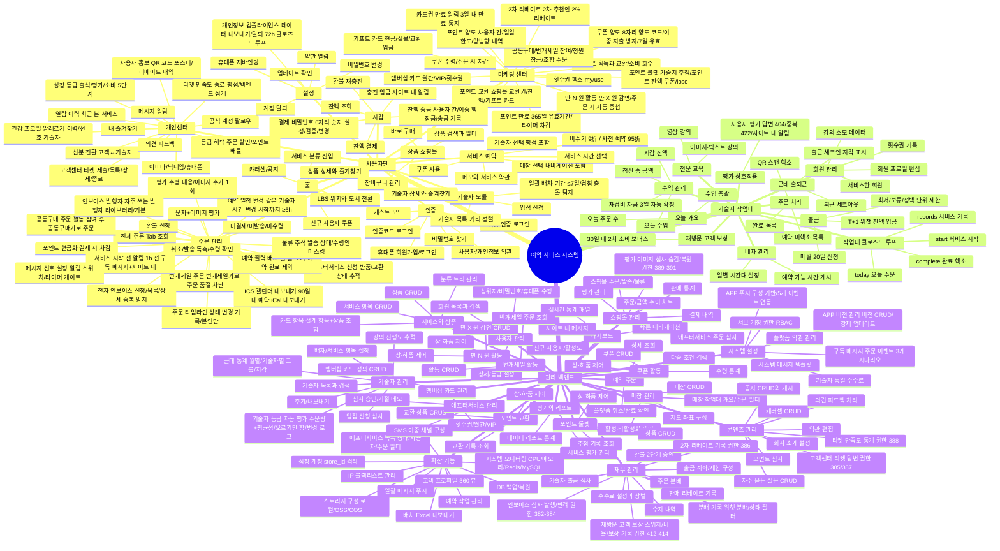

# 시스템 기능 다이어그램

```mermaid
mindmap
  root((예약 서비스 시스템))
    사용자단
      인증
        휴대폰 회원가입/로그인
        인증코드 로그인
        위챗 인증 로그인
        게스트 모드
        비밀번호 찾기
        사용자/개인정보 약관
      홈
        LBS 위치와 도시 전환
        캐러셀/공지
        서비스 분류 진입
        신규 사용자 쿠폰
      서비스 예약
        매장 선택 내비게이션 포함
        기술자 선택 평점 포함
        서비스 시간 선택
        비수기 9折 / 사전 예약 95折
        쿠폰 사용
        메모와 서비스 약관
      상품 쇼핑몰
        상품 검색과 필터
        상품 상세와 즐겨찾기
        장바구니 관리
        바로 구매
      주문 관리
        전체 주문 Tab 조회
        미결제/미발송/미수령
        취소/발송 독촉/수령 확인
        환불 신청
        애프터서비스 신청 반품/교환 상태 추적
        포인트 현금화 결제 시 차감
        공동구매 주문 활동 참여 후 공동구매가로 주문
        번개세일 주문 번개세일가로 주문 품절 차단
        예약 일정 변경 같은 기술자 시간 변경 시작까지 ≥6h
        예약 월력 배차 월/일 보기 예약 완료 제외
        서비스 시작 전 알림 1h 전 구독 메시지+사이트 내
        문자+이미지 평가
        평가 추평 내용/이미지 추가 1회
        물류 추적 발송 상태/수령인 마스킹
        전자 인보이스 신청/목록/상세 중복 방지
        ICS 캘린더 내보내기 90일 내 예약 iCal 내보내기
        주문 타임라인 상태 변경 기록/본인만
        인보이스 발행자 자주 쓰는 발행자 라이브러리/기본
        메시지 선호 설정 알림 스위치/타이머 게이트
      기술자 모듈
        기술자 목록 거리 정렬
        기술자 상세와 즐겨찾기
        입점 신청
        일괄 배차 기간 ≤7일/겹침 충돌 탐지
      마케팅 센터
        쿠폰 수령/주문 시 차감
        쿠폰 양도 8자리 양도 코드/이중 지출 방지/7일 유효
        멤버십 카드 월간/VIP/횟수권
        횟수권 핵소 my/use
        포인트 획득과 교환/소비 회수
        포인트 만료 365일 유효기간/타이머 차감
        포인트 교환 쇼핑몰 교환권/잔액/기프트 카드
        공동구매/번개세일 참여/정원 잠금/조합 주문
        카드권 만료 알림 3일 내 만료 통지
        기프트 카드 현금/실물/교환 입금
        포인트 양도 사용자 간/일일 한도/양방향 내역
        2차 리베이트 2차 추천인 2% 리베이트
        만 N 원 활동 만 X 원 감면/주문 시 자동 중첩
        포인트 룰렛 가중치 추첨/포인트 잔액 쿠폰/lose
      지갑
        잔액 조회
        충전 입금 사이트 내 알림
        잔액 결제
        환불 재충전
        잔액 송금 사용자 간/이중 행 잠금/송금 기록
        결제 비밀번호 6자리 숫자 설정/검증/변경
      개인센터
        아바타/닉네임/휴대폰
        신분 전환 고객↔기술자
        메시지 알림
        내 즐겨찾기
        열람 이력 최근 본 서비스
        건강 프로필 알레르기 이력/선호 기술자
        공식 계정 팔로우
        사용자 홍보 QR 코드 포스터/리베이트 내역
        성장 등급 출석/평가/소비 5단계
        등급 혜택 주문 할인/포인트 배율
        고객센터 티켓 제출/목록/상세/종료
        티켓 만족도 종료 평점/백엔드 집계
        의견 피드백
      설정
        비밀번호 변경
        휴대폰 재바인딩
        약관 열람
        업데이트 확인
        개인정보 컴플라이언스 데이터 내보내기/탈퇴 72h 클로즈드 루프
        계정 탈퇴

    기술자 작업대
      근태 출퇴근
        출근 체크인 지각 표시
        퇴근 체크아웃
      작업대 클로즈드 루프
        today 오늘 주문
        records 서비스 기록
        start 서비스 시작
        complete 완료 핵소
      오늘 개요
        오늘 주문 수
        수입 총괄
      배차 관리
        일별 시간대 설정
        예약 가능 시간 게시
      주문 처리
        예약 미핵소 목록
        완료 목록
        QR 스캔 핵소
      회원 관리
        서비스한 회원
        강의 소모 데이터
        횟수권 기록
        회원 프로필 편집
      평가 상호작용
        사용자 평가 답변 404/중복 422/사이트 내 알림
      수익 관리
        오늘 수입
        정산 중 금액
        지갑 잔액
        재경비 자금 3일 자동 확정
      출금
        매월 20일 신청
        T+1 위챗 잔액 입금
        최저/보류/정백 단위 제한
      재방문 고객 보상
        30일 내 2차 소비 보너스
      전문 교육
        영상 강의
        이미지·텍스트 강의

    관리 백엔드
      대시보드
        실시간 통계 패널
        주문/금액 추이 차트
        신규 사용자/활성도
        빠른 내비게이션
        사이트 내 메시지
      기술자 관리
        기술자 목록과 검색
        추가/내보내기
        입점 신청 심사
        배차/서비스 항목 설정
        강의 진행도 추적
        기술자 등급 자동 평가 주문량+평균점/오르기만 함/변경 로그
        근태 통계 월별/기술자별 그룹/지각
      사용자 관리
        회원 목록과 검색
        상세/등급 설정
        상위자/비밀번호/휴대폰 수정
      매장 관리
        매장 CRUD
        활성·비활성화 제어
        지도 좌표 구성
        매장 작업대 개요/주문 필터
      서비스와 상품
        서비스 항목 CRUD
        상품 CRUD
        분류 트리 관리
        카드 항목 설계 항목+상품 조합
      쇼핑몰 관리
        쇼핑몰 주문/발송/물류
        애프터서비스 주문 심사
        평가 관리
        평가 이미지 심사 숨김/복원 권한 389-391
        결제 내역
        판매 통계
      예약 주문
        다중 조건 검색
        플랫폼 취소/완료 확인
        상세 조회
      쿠폰 활동
        쿠폰 CRUD
        상·하품 제어
        수령 통계
      만 N 원 활동
        만 X 원 감면 CRUD
        상·하품 제어
      포인트 룰렛
        상품 CRUD
        상·하품 제어
        추첨 기록 조회
      번개세일 활동
        활동 CRUD
        상·하품 제어
        번개세일 주문 조회
      포인트 교환
        교환 상품 CRUD
        상·하품 제어
        교환 기록 조회
      멤버십 카드 관리
        멤버십 카드 정의 CRUD
        횟수권/월간/VIP
      애프터서비스 관리
        애프터서비스 목록 상태/사용자/주문 필터
        심사 승인/거절 메모
      평가와 리포트
        서비스 평가 관리
        데이터 리포트 통계
      재무 관리
        주문 분배
        기술자 출금 심사
        수수료 설정과 상벌
        수지 내역
        출금 계좌/제한 구성
        환불 2단계 승인
        판매 리베이트 기록
        2차 리베이트 기록 권한 386
        분배 기록 위챗 분배/상태 필터
        인보이스 심사 발행/반려 권한 382-384
        재방문 고객 보상 스위치/비율/보상 기록 권한 412-414
      콘텐츠 관리
        캐러셀 CRUD
        공지 CRUD와 게시
        약관 편집
        자주 묻는 질문 CRUD
        의견 피드백 처리
        고객센터 티켓 답변 권한 385/387
        티켓 만족도 통계 권한 388
        모먼트 심사
        회사 소개 설정
      시스템 설정
        플랫폼 약관 관리
        기술자 통일 수수료
        시스템 메시지 템플릿
        APP 푸시 구성 기반/5개 이벤트 연동
        구독 메시지 주문 이벤트 3개 시나리오
        APP 버전 관리 버전 CRUD/강제 업데이트
        서브 계정 권한 RBAC
      확장 기능
        시스템 모니터링 CPU/메모리/Redis/MySQL
        IP 블랙리스트 관리
        DB 백업/복원
        고객 프로파일 360 뷰
        일괄 메시지 푸시
        예약 작업 관리
        SMS 이중 채널 구성
        스토리지 구성 로컬/OSS/COS
        배차 Excel 내보내기
        점장 계정 store_id 격리
```
