# 생명주기 다이어그램
> **Languages**: [中文](../../diagrams/LIFECYCLE-DIAGRAM.md) · [English](../../en/diagrams/LIFECYCLE-DIAGRAM.md) · [Русский](../../ru/diagrams/LIFECYCLE-DIAGRAM.md) · [Deutsch](../../de/diagrams/LIFECYCLE-DIAGRAM.md) · [Français](../../fr/diagrams/LIFECYCLE-DIAGRAM.md) · [Español](../../es/diagrams/LIFECYCLE-DIAGRAM.md) · [Português](../../pt/diagrams/LIFECYCLE-DIAGRAM.md) · [हिन्दी](../../hi/diagrams/LIFECYCLE-DIAGRAM.md) · [العربية](../../ar/diagrams/LIFECYCLE-DIAGRAM.md) · [বাংলা](../../bn/diagrams/LIFECYCLE-DIAGRAM.md) · [Bahasa Indonesia](../../id/diagrams/LIFECYCLE-DIAGRAM.md) · [日本語](../../ja/diagrams/LIFECYCLE-DIAGRAM.md)

## 1. 주문 생명주기（상태 머신）

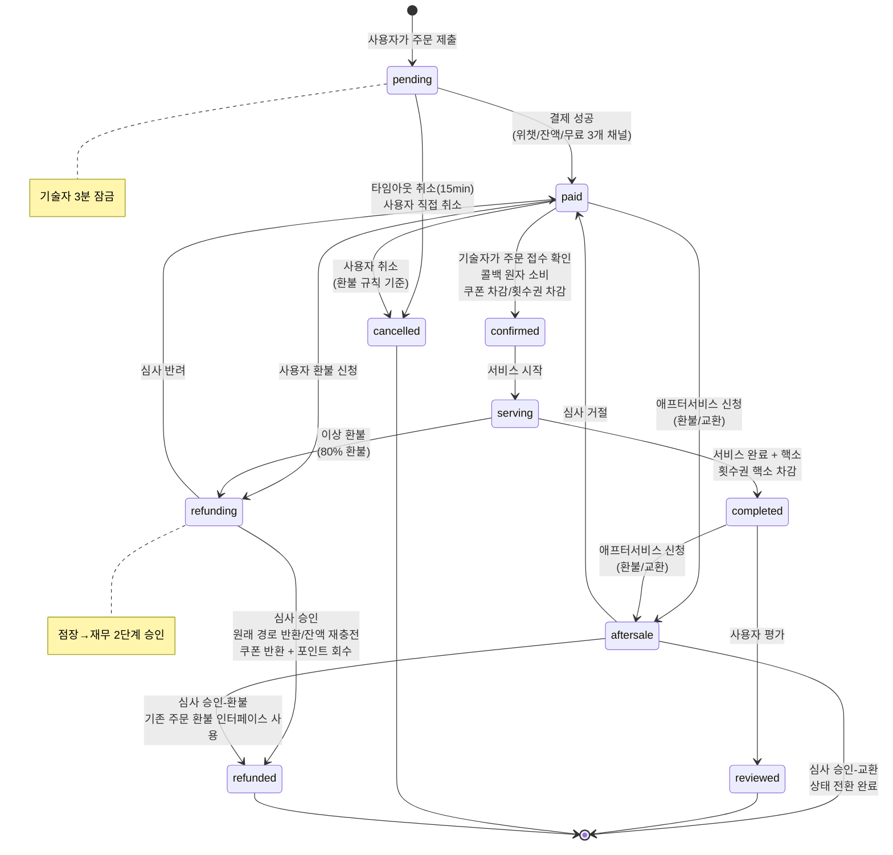
```mermaid
stateDiagram-v2
    [*] --> pending: 사용자가 주문 제출

    pending --> paid: 결제 성공<br/>(위챗/잔액/무료 3개 채널)

    pending --> cancelled: 타임아웃 취소(15min)<br/>사용자 직접 취소

    paid --> confirmed: 기술자가 주문 접수 확인<br/>콜백 원자 소비<br/>쿠폰 차감/횟수권 차감
    paid --> cancelled: 사용자 취소<br/>(환불 규칙 기준)
    paid --> refunding: 사용자 환불 신청
    paid --> aftersale: 애프터서비스 신청<br/>(환불/교환)

    confirmed --> serving: 서비스 시작

    serving --> completed: 서비스 완료 + 핵소<br/>횟수권 핵소 차감

    serving --> refunding: 이상 환불<br/>(80% 환불)

    completed --> reviewed: 사용자 평가
    completed --> aftersale: 애프터서비스 신청<br/>(환불/교환)

    refunding --> refunded: 심사 승인<br/>원래 경로 반환/잔액 재충전<br/>쿠폰 반환 + 포인트 회수
    refunding --> paid: 심사 반려

    aftersale --> refunded: 심사 승인-환불<br/>기존 주문 환불 인터페이스 사용
    aftersale --> paid: 심사 거절
    aftersale --> [*]: 심사 승인-교환<br/>상태 전환 완료

    reviewed --> [*]
    cancelled --> [*]
    refunded --> [*]

    note right of pending: 기술자 3분 잠금
    note right of refunding: 점장→재무 2단계 승인
```

## 2. 멤버십 카드 생명주기

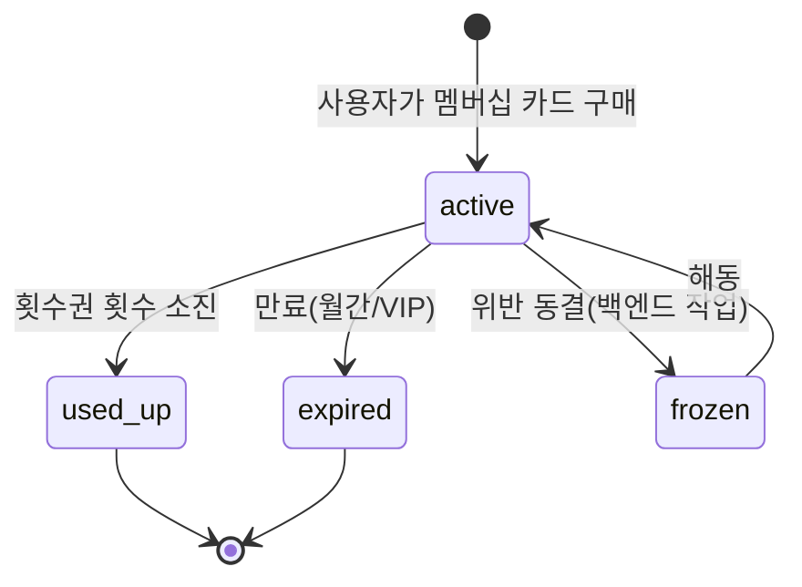
```mermaid
stateDiagram-v2
    [*] --> active: 사용자가 멤버십 카드 구매

    active --> used_up: 횟수권 횟수 소진

    active --> expired: 만료(월간/VIP)

    active --> frozen: 위반 동결(백엔드 작업)

    frozen --> active: 해동

    used_up --> [*]
    expired --> [*]
```

## 3. 기술자 입점 생명주기

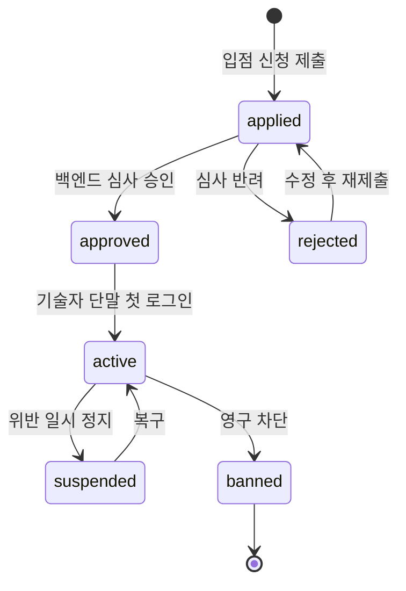
```mermaid
stateDiagram-v2
    [*] --> applied: 입점 신청 제출

    applied --> approved: 백엔드 심사 승인
    applied --> rejected: 심사 반려

    rejected --> applied: 수정 후 재제출

    approved --> active: 기술자 단말 첫 로그인

    active --> suspended: 위반 일시 정지
    suspended --> active: 복구
    active --> banned: 영구 차단

    banned --> [*]
```

## 4. 쿠폰 생명주기

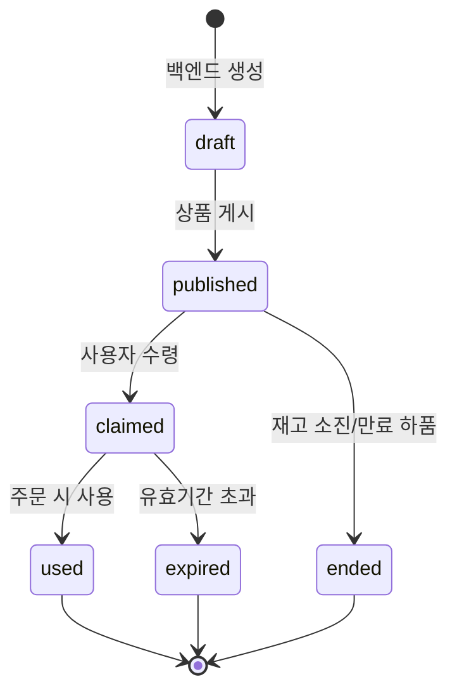
```mermaid
stateDiagram-v2
    [*] --> draft: 백엔드 생성

    draft --> published: 상품 게시

    published --> claimed: 사용자 수령

    claimed --> used: 주문 시 사용
    claimed --> expired: 유효기간 초과

    published --> ended: 재고 소진/만료 하품

    used --> [*]
    expired --> [*]
    ended --> [*]
```

## 5. 기술자 출금 생명주기

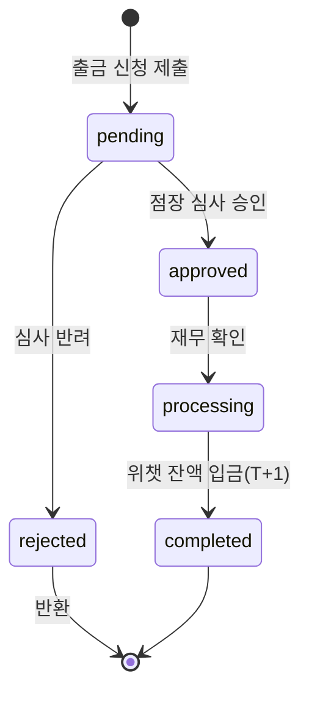
```mermaid
stateDiagram-v2
    [*] --> pending: 출금 신청 제출

    pending --> approved: 점장 심사 승인
    pending --> rejected: 심사 반려

    rejected --> [*]: 반환

    approved --> processing: 재무 확인

    processing --> completed: 위챗 잔액 입금(T+1)

    completed --> [*]
```

## 6. Token 인증 생명주기

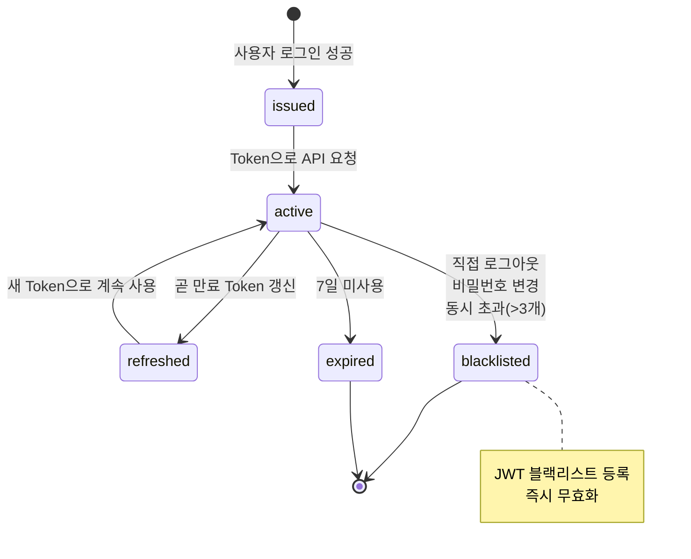
```mermaid
stateDiagram-v2
    [*] --> issued: 사용자 로그인 성공

    issued --> active: Token으로 API 요청

    active --> refreshed: 곧 만료 Token 갱신

    refreshed --> active: 새 Token으로 계속 사용

    active --> blacklisted: 직접 로그아웃<br/>비밀번호 변경<br/>동시 초과(>3개)

    active --> expired: 7일 미사용

    blacklisted --> [*]
    expired --> [*]

    note right of blacklisted: JWT 블랙리스트 등록<br/>즉시 무효화
```

## 7. 공동구매 활동 생명주기

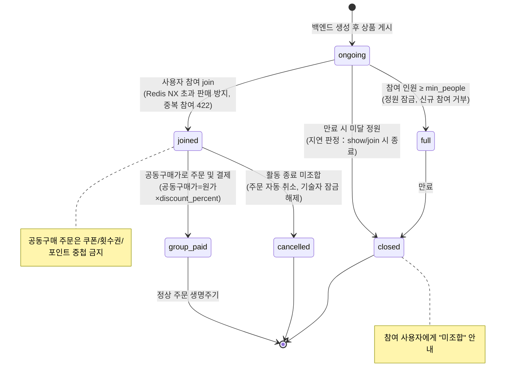
```mermaid
stateDiagram-v2
    [*] --> ongoing: 백엔드 생성 후 상품 게시

    ongoing --> full: 참여 인원 ≥ min_people<br/>(정원 잠금, 신규 참여 거부)

    ongoing --> closed: 만료 시 미달 정원<br/>(지연 판정：show/join 시 종료)

    full --> closed: 만료

    ongoing --> joined: 사용자 참여 join<br/>(Redis NX 초과 판매 방지, 중복 참여 422)

    joined --> group_paid: 공동구매가로 주문 및 결제<br/>(공동구매가=원가×discount_percent)

    joined --> cancelled: 활동 종료 미조합<br/>(주문 자동 취소, 기술자 잠금 해제)

    group_paid --> [*]: 정상 주문 생명주기
    cancelled --> [*]
    closed --> [*]

    note right of joined: 공동구매 주문은 쿠폰/횟수권/포인트 중첩 금지
    note right of closed: 참여 사용자에게 "미조합" 안내
```

## 8. 쿠폰 양도 생명주기

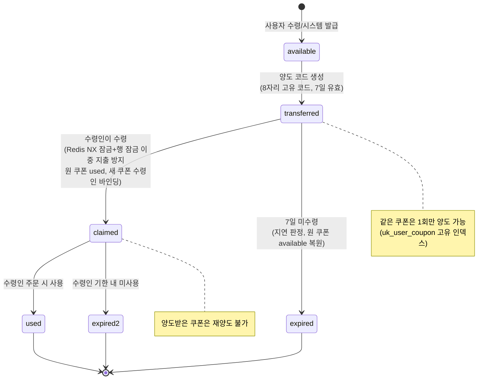
```mermaid
stateDiagram-v2
    [*] --> available: 사용자 수령/시스템 발급

    available --> transferred: 양도 코드 생성<br/>(8자리 고유 코드, 7일 유효)

    transferred --> claimed: 수령인이 수령<br/>(Redis NX 잠금+행 잠금 이중 지출 방지<br/>원 쿠폰 used, 새 쿠폰 수령인 바인딩)

    transferred --> expired: 7일 미수령<br/>(지연 판정, 원 쿠폰 available 복원)

    claimed --> used: 수령인 주문 시 사용
    claimed --> expired2: 수령인 기한 내 미사용

    used --> [*]
    expired --> [*]
    expired2 --> [*]

    note right of transferred: 같은 쿠폰은 1회만 양도 가능<br/>(uk_user_coupon 고유 인덱스)
    note right of claimed: 양도받은 쿠폰은 재양도 불가
```

## 9. 포인트 만료 생명주기

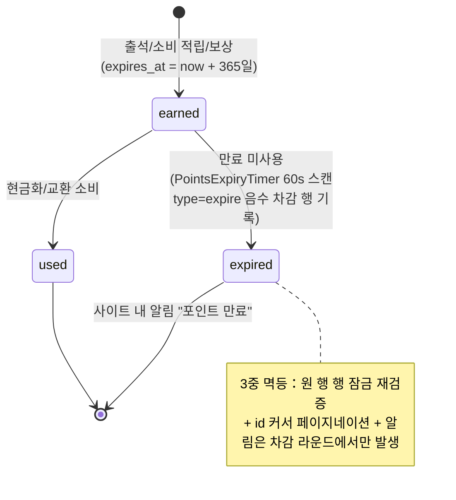
```mermaid
stateDiagram-v2
    [*] --> earned: 출석/소비 적립/보상<br/>(expires_at = now + 365일)

    earned --> used: 현금화/교환 소비

    earned --> expired: 만료 미사용<br/>(PointsExpiryTimer 60s 스캔<br/>type=expire 음수 차감 행 기록)

    expired --> [*]: 사이트 내 알림 "포인트 만료"
    used --> [*]

    note right of expired: 3중 멱등：원 행 행 잠금 재검증<br/>+ id 커서 페이지네이션 + 알림은 차감 라운드에서만 발생
```

## 10. 송금 생명주기（19차 라운드：잔액 송금 + 포인트 양도）

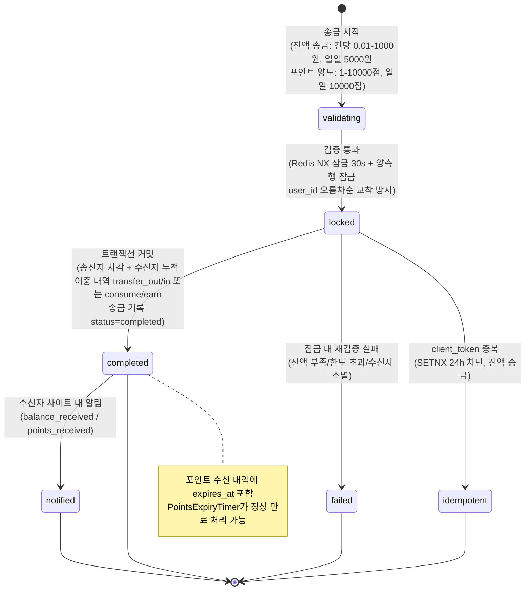
```mermaid
stateDiagram-v2
    [*] --> validating: 송금 시작<br/>(잔액 송금: 건당 0.01-1000원, 일일 5000원<br/>포인트 양도: 1-10000점, 일일 10000점)

    validating --> locked: 검증 통과<br/>(Redis NX 잠금 30s + 양측 행 잠금<br/>user_id 오름차순 교착 방지)

    locked --> completed: 트랜잭션 커밋<br/>(송신자 차감 + 수신자 누적<br/>이중 내역 transfer_out/in 또는 consume/earn<br/>송금 기록 status=completed)

    locked --> failed: 잠금 내 재검증 실패<br/>(잔액 부족/한도 초과/수신자 소멸)
    locked --> idempotent: client_token 중복<br/>(SETNX 24h 차단, 잔액 송금)

    completed --> notified: 수신자 사이트 내 알림<br/>(balance_received / points_received)
    completed --> [*]
    failed --> [*]
    idempotent --> [*]
    notified --> [*]

    note right of completed: 포인트 수신 내역에 expires_at 포함<br/>PointsExpiryTimer가 정상 만료 처리 가능
```

## 11. 고객센터 티켓 생명주기（20차 라운드）

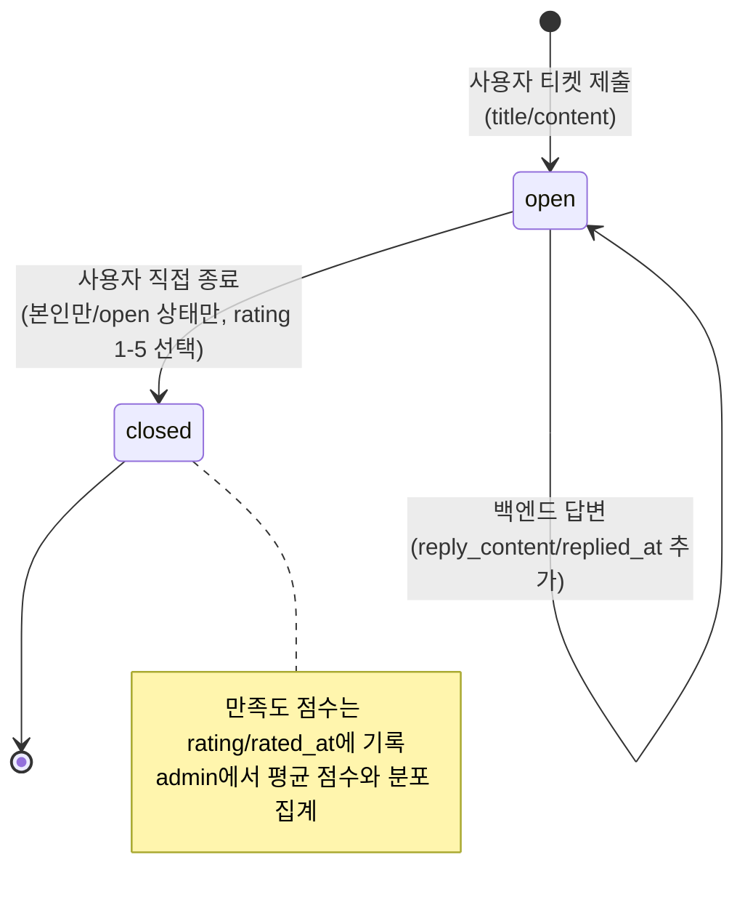
```mermaid
stateDiagram-v2
    [*] --> open: 사용자 티켓 제출<br/>(title/content)

    open --> open: 백엔드 답변<br/>(reply_content/replied_at 추가)

    open --> closed: 사용자 직접 종료<br/>(본인만/open 상태만, rating 1-5 선택)

    closed --> [*]

    note right of closed: 만족도 점수는 rating/rated_at에 기록<br/>admin에서 평균 점수와 분포 집계
```

## 12. 전자 인보이스 생명주기（20차 라운드）

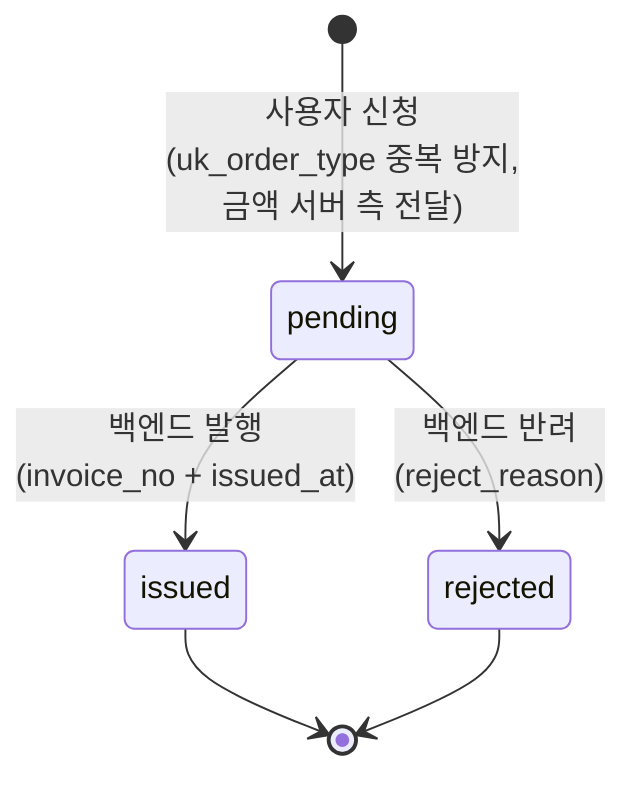
```mermaid
stateDiagram-v2
    [*] --> pending: 사용자 신청<br/>(uk_order_type 중복 방지,<br/>금액 서버 측 전달)

    pending --> issued: 백엔드 발행<br/>(invoice_no + issued_at)

    pending --> rejected: 백엔드 반려<br/>(reject_reason)

    issued --> [*]
    rejected --> [*]
```

## 13. 만 N 원 활동 생명주기（22차 라운드）

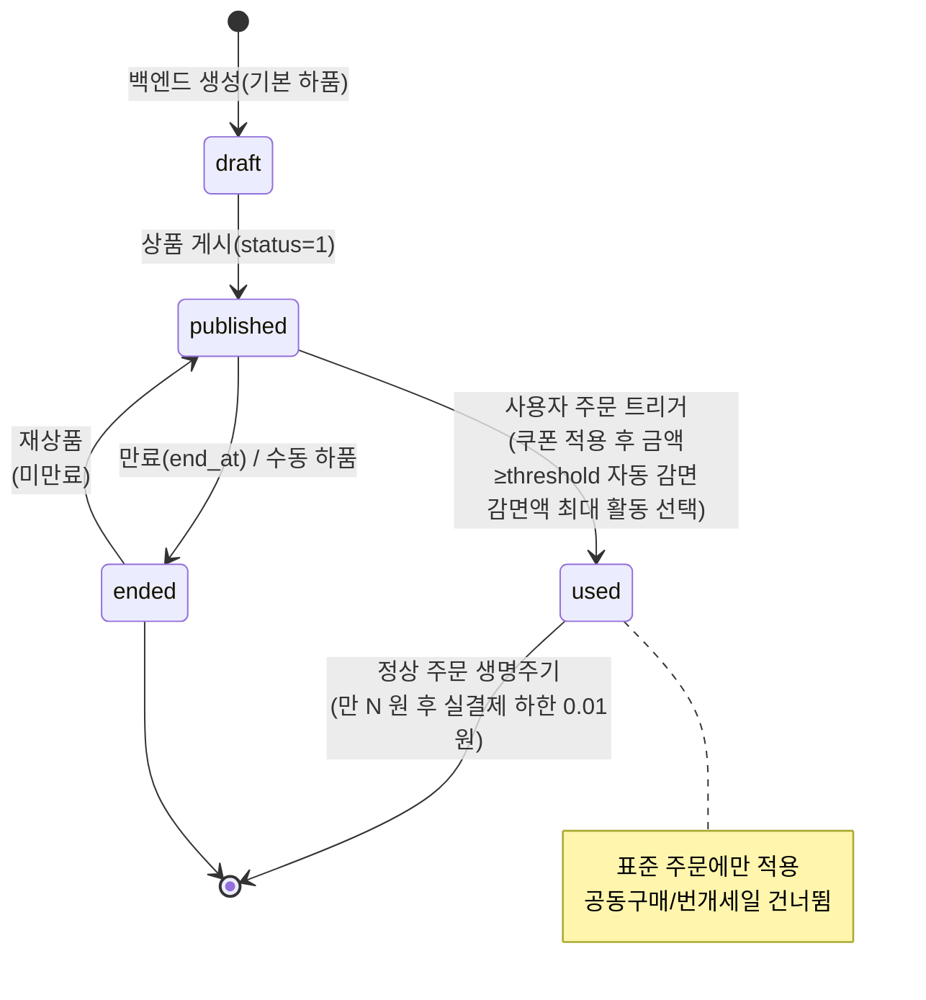
```mermaid
stateDiagram-v2
    [*] --> draft: 백엔드 생성(기본 하품)

    draft --> published: 상품 게시(status=1)

    published --> ended: 만료(end_at) / 수동 하품

    published --> used: 사용자 주문 트리거<br/>(쿠폰 적용 후 금액≥threshold 자동 감면<br/>감면액 최대 활동 선택)

    used --> [*]: 정상 주문 생명주기<br/>(만 N 원 후 실결제 하한 0.01원)

    ended --> published: 재상품<br/>(미만료)

    ended --> [*]

    note right of used: 표준 주문에만 적용<br/>공동구매/번개세일 건너뜀
```

## 15. 룰렛 추첨 생명주기（23차 라운드）

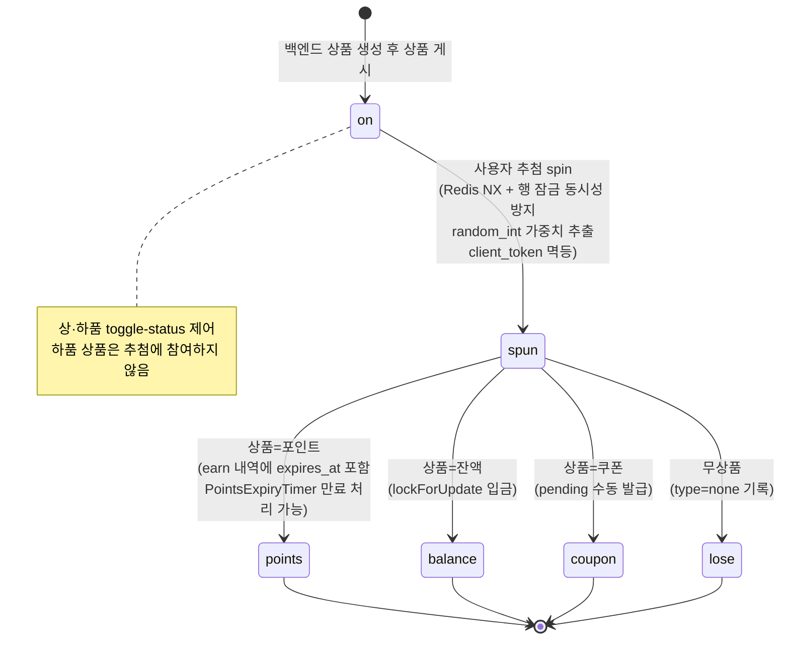
```mermaid
stateDiagram-v2
    [*] --> on: 백엔드 상품 생성 후 상품 게시

    on --> spun: 사용자 추첨 spin<br/>(Redis NX + 행 잠금 동시성 방지<br/>random_int 가중치 추출<br/>client_token 멱등)

    spun --> points: 상품=포인트<br/>(earn 내역에 expires_at 포함<br/>PointsExpiryTimer 만료 처리 가능)

    spun --> balance: 상품=잔액<br/>(lockForUpdate 입금)

    spun --> coupon: 상품=쿠폰<br/>(pending 수동 발급)

    spun --> lose: 무상품<br/>(type=none 기록)

    points --> [*]
    balance --> [*]
    coupon --> [*]
    lose --> [*]

    note right of on: 상·하품 toggle-status 제어<br/>하품 상품은 추첨에 참여하지 않음
```

## 14. 계정 탈퇴 생명주기（22차 라운드）

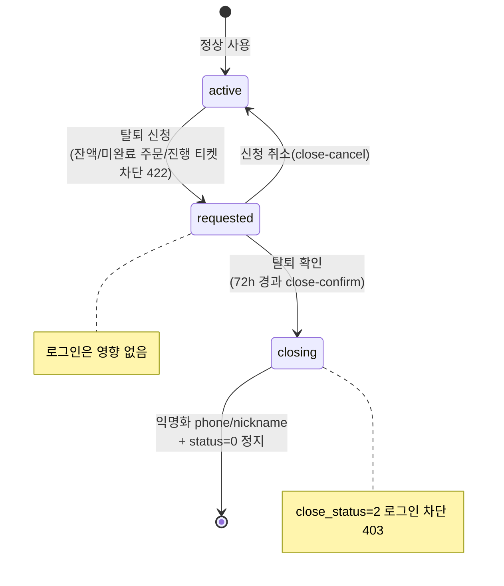
```mermaid
stateDiagram-v2
    [*] --> active: 정상 사용

    active --> requested: 탈퇴 신청<br/>(잔액/미완료 주문/진행 티켓 차단 422)

    requested --> active: 신청 취소(close-cancel)

    requested --> closing: 탈퇴 확인<br/>(72h 경과 close-confirm)

    closing --> [*]: 익명화 phone/nickname<br/>+ status=0 정지

    note right of requested: 로그인은 영향 없음
    note right of closing: close_status=2 로그인 차단 403
```

## 16. 번개세일 활동 생명주기（24차 라운드）

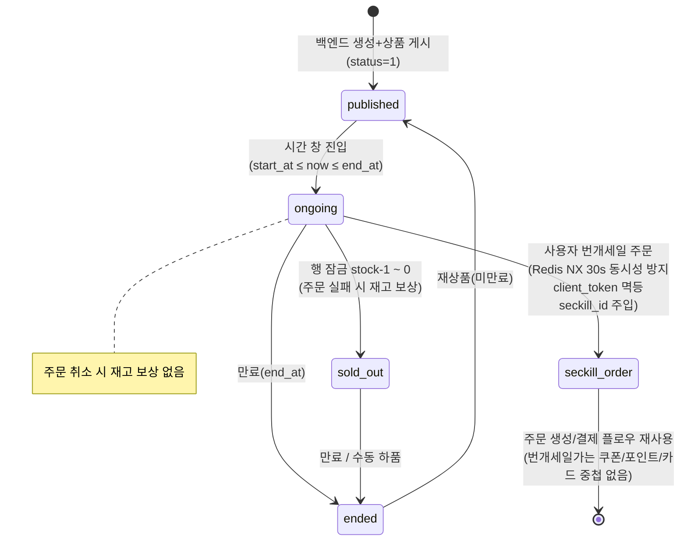
```mermaid
stateDiagram-v2
    [*] --> published: 백엔드 생성+상품 게시(status=1)

    published --> ongoing: 시간 창 진입<br/>(start_at ≤ now ≤ end_at)

    ongoing --> sold_out: 행 잠금 stock-1 ~ 0<br/>(주문 실패 시 재고 보상)

    ongoing --> ended: 만료(end_at)

    sold_out --> ended: 만료 / 수동 하품

    ended --> published: 재상품(미만료)

    ongoing --> seckill_order: 사용자 번개세일 주문<br/>(Redis NX 30s 동시성 방지<br/>client_token 멱등<br/>seckill_id 주입)

    seckill_order --> [*]: 주문 생성/결제 플로우 재사용<br/>(번개세일가는 쿠폰/포인트/카드 중첩 없음)

    note right of ongoing: 주문 취소 시 재고 보상 없음
```

## 17. 재방문 고객 보상 생명주기（24차 라운드）

```mermaid
stateDiagram-v2
    [*] --> completed: 주문 완료<br/>(WorkController::complete 행 잠금 트랜잭션)

    completed --> checked: 30일 내 같은 기술자 2차 소비 판정

    checked --> none: 최초 소비 / 스위치 꺼짐<br/>(enabled=0)

    checked --> pending: 2차 소비<br/>(보너스=실결제×ratio<br/>같은 order_id+type 멱등)

    pending --> settled: 수수료 정산 체인에서 일괄 정산<br/>(erik_technician_earnings<br/>type=return_customer)

    settled --> [*]
    none --> [*]

    note right of pending: status=pending<br/>기술자 단말 수익 집계에 자동 포함
```
