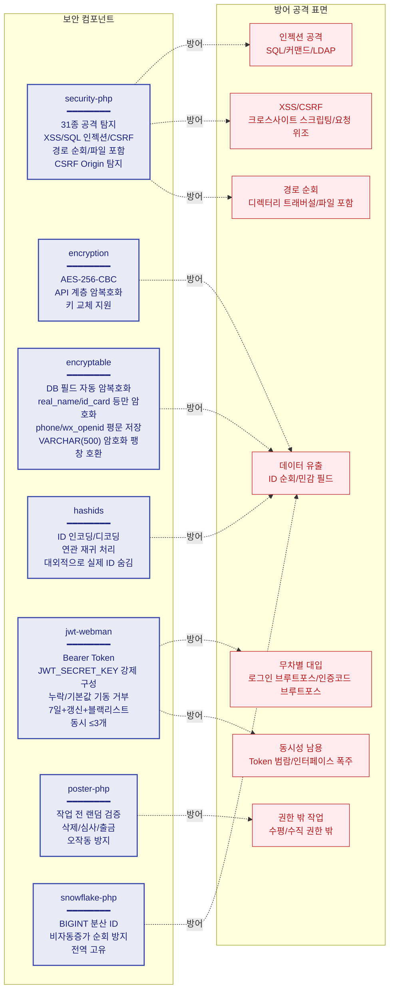
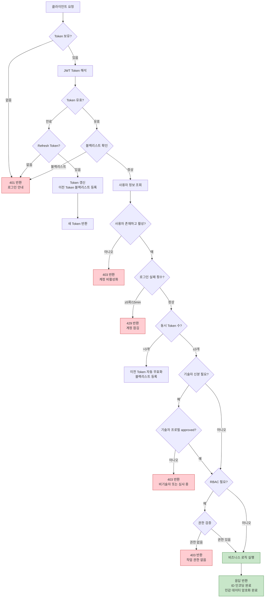
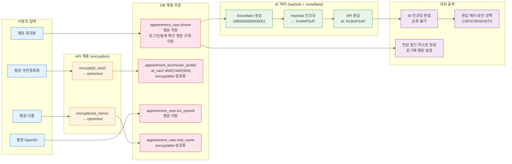

# 보안 아키텍처 다이어그램
> **Languages**: [中文](../../diagrams/SECURITY-ARCHITECTURE.md) · [English](../../en/diagrams/SECURITY-ARCHITECTURE.md) · [Русский](../../ru/diagrams/SECURITY-ARCHITECTURE.md) · [Deutsch](../../de/diagrams/SECURITY-ARCHITECTURE.md) · [Français](../../fr/diagrams/SECURITY-ARCHITECTURE.md) · [Español](../../es/diagrams/SECURITY-ARCHITECTURE.md) · [Português](../../pt/diagrams/SECURITY-ARCHITECTURE.md) · [हिन्दी](../../hi/diagrams/SECURITY-ARCHITECTURE.md) · [العربية](../../ar/diagrams/SECURITY-ARCHITECTURE.md) · [বাংলা](../../bn/diagrams/SECURITY-ARCHITECTURE.md) · [Bahasa Indonesia](../../id/diagrams/SECURITY-ARCHITECTURE.md) · [日本語](../../ja/diagrams/SECURITY-ARCHITECTURE.md)

## 1. 심층 방어 체계

```mermaid
graph TB
    subgraph 경계_방어["제1계층：경계 방어"]
        WAF["WAF / Nginx<br/>보안 응답 헤더<br/>민감 파일 보호<br/>TLS 1.3"]
    end

    subgraph 접근_방어["제2계층：접근 방어"]
        CORS["Cors 미들웨어<br/>CORS_ALLOW_ORIGIN 화이트리스트<br/>* 에코 · 미구성 시 동일 출처만<br/>보안 응답 헤더 6개<br/>OPTIONS 프리플라이트"]
    end

    subgraph 공격_탐지["제3계층：공격 탐지"]
        SEC["Security 미들웨어<br/>erikwang2013/security-php<br/>31종 공격 탐지기<br/>XSS / SQL 인젝션 / CSRF<br/>경로 순회 / 파일 포함<br/>CSRF Origin 탐지(block)"]
        BLOCK["자동 차단<br/>5회 공격/60s<br/>→ IP 블랙리스트 15min"]
    end

    subgraph 트래픽_제어["제4계층：트래픽 제어"]
        RL["RateLimit 미들웨어<br/>Redis 슬라이딩 윈도우 + Lua 원자화<br/>기본: 60회/min/IP<br/>로그인: 10회/min<br/>회원가입: 5회/min<br/>인증코드: 1회/60s/휴대폰"]
    end

    subgraph 신분_인증["제5계층：신분 인증"]
        AUTH["Auth 미들웨어<br/>JWT Bearer Token (7일)<br/>JWT_SECRET_KEY 강제 구성<br/>누락/공개 기본값 시 기동 거부<br/>비밀번호 bcrypt 해시<br/>Token 갱신 + 블랙리스트<br/>로그인 잠금: 5회 실패→15min<br/>동시 제한: 최대 3개 Token"]
        TECH_AUTH["TechnicianAuth<br/>기술자 프로필 검증<br/>approved 상태 확인"]
        ADMIN_AUTH["AdminAuth<br/>Admin단 JWT 인증<br/>Token 블랙리스트"]
    end

    subgraph 권한_제어["제6계층：권한 제어"]
        RBAC["AdminPermission<br/>RBAC 역할 권한 검증<br/>Redis 60s 캐시<br/>사용자→역할→권한"]
        POSTER["Poster 검증<br/>erikwang2013/poster-php<br/>삭제/심사/출금<br/>민감 작업 랜덤 검증"]
    end

    subgraph 데이터_보안["제7계층：데이터 보안"]
        ENC_API["API 계층 암호화<br/>erikwang2013/encryption<br/>민감 필드 암복호화"]
        ENC_DB["DB 계층 암호화<br/>erikwang2013/encryptable<br/>Model trait 자동 암복호화<br/>real_name/id_card 등만 암호화<br/>phone/wx_openid은 반드시 평문 저장<br/>(로그인/중복 확인이 평문 조회에 의존)"]
        HASHID["ID 암복호화<br/>erikwang2013/hashids<br/>대외적으로 실제 ID 숨김<br/>재귀 인코딩/디코딩"]
        SLOG["보안 로그<br/>M3 예외 통일 마스킹<br/>공통 문구 + Log::error<br/>민감 데이터는 로그 미포함<br/>OperationLog 8개 단말 출처"]
    end

    subgraph 관리단_방어["제8계층：관리단 방어"]
        EXCEL["내보내기 방어<br/>safeCellValue()<br/>= + - @ / Tab/CR 시작<br/>접두사 ' 이스케이프 공식 인젝션 방지"]
        UPLOAD["업로드 검증<br/>finfo magic bytes<br/>MIME과 확장자 불일치<br/>→ 422 거부"]
        INSTALL["설치 잠금<br/>이미 설치(installed=1<br/>또는 관리자 존재)<br/>→ 404 설치 마법사 비활성화"]
    end

    요청["HTTP Request"] --> WAF
    WAF --> CORS
    CORS --> SEC
    SEC -->|"통과"| RL
    SEC -->|"공격 탐지"| BLOCK
    BLOCK -.->|"거부"| 거부["HTTP 403/429<br/>공격 로그 기록"]
    RL -->|"통과"| AUTH
    RL -->|"초과"| 속도제한_거부["HTTP 429<br/>Retry-After"]
    AUTH --> TECH_AUTH
    AUTH --> ADMIN_AUTH
    TECH_AUTH --> RBAC
    ADMIN_AUTH --> RBAC
    RBAC --> POSTER
    POSTER --> ENC_API
    ENC_API --> ENC_DB
    ENC_DB --> HASHID
    HASHID --> SLOG
    SLOG --> EXCEL
    EXCEL --> UPLOAD
    UPLOAD --> INSTALL
    INSTALL --> 응답["HTTP Response<br/>데이터 암호화+인코딩 완료"]

    classDef layer1 fill:#e3f2fd,stroke:#1565c0,stroke-width:2px,color:#01579b
    classDef layer2 fill:#bbdefb,stroke:#1976d2,stroke-width:2px,color:#01579b
    classDef layer3 fill:#ffcdd2,stroke:#c62828,stroke-width:2px,color:#b71c1c
    classDef layer4 fill:#fff9c4,stroke:#f9a825,stroke-width:2px,color:#f57f17
    classDef layer5 fill:#c8e6c9,stroke:#2e7d32,stroke-width:2px,color:#1b5e20
    classDef layer6 fill:#e1bee7,stroke:#7b1fa2,stroke-width:2px,color:#4a148c
    classDef layer7 fill:#d7ccc8,stroke:#5d4037,stroke-width:2px,color:#3e2723
    classDef layer8 fill:#cfd8dc,stroke:#37474f,stroke-width:2px,color:#263238
    classDef reject fill:#ff5252,stroke:#b71c1c,stroke-width:2px,color:#fff

    class WAF layer1
    class CORS layer2
    class SEC,BLOCK layer3
    class RL layer4
    class AUTH,TECH_AUTH,ADMIN_AUTH layer5
    class RBAC,POSTER layer6
    class ENC_API,ENC_DB,HASHID,SLOG layer7
    class EXCEL,UPLOAD,INSTALL layer8
    class 거부,속도제한_거부 reject
```

## 2. 보안 컴포넌트 매트릭스

## 3. 인증과 권한 부여 플로우

## 4. 데이터 보안 흐름

