> Tradução em português · Original: [中文](../../README.md)

# Sistema de Serviços de Agendamento

Plataforma de gestão de agendamentos em quatro terminais: miniprograma WeChat do lado do utilizador + APP Flutter + APP HarmonyOS (alternância de identidade na mesma conta) e painel de administração PC.

> **Estado do projeto**: Concluído ✅ | 143 controladores (service 69 / admin 74) | 87 modelos | 722 testes (service 558 / admin 164) | 95 tabelas de dados | 388 rotas (service 227 / admin 161)

## Apresentação do projeto


**Sistema de Serviços de Agendamento** é uma plataforma de gestão de agendamentos em quatro terminais orientada ao setor de serviços do dia a dia: o lado do utilizador abrange **miniprograma WeChat, APP Flutter e APP HarmonyOS**, com alternância livre entre terminais na mesma conta, em conjunto com o **painel de administração PC**, concretizando o ciclo digital completo de "utilizador agenda → técnico aceita → equipa de operações gere". Quer seja agendamento em loja, serviço de técnico, marketing de membros ou liquidação financeira, um único sistema resolve tudo.

**Experiência de agendamento tudo-em-um**

Experiência consistente nos três terminais do utilizador: seleção visual de horários pelo calendário, desconto com cupões/cartões de vezes/pontos, promoções relâmpago e compras em grupo, pagamento por WeChat/saldo, com o estado do pedido rastreável em todas as etapas — remarcação, cancelamento, reembolso, pós-venda e fatura eletrónica concluídos online de ponta a ponta; o lado do técnico oferece bancada de trabalho, registo de ponto de entrada/saída, agendamento em lote, verificação de serviço e aprovação de levantamentos, com eficiência operacional à vista.

**Crescimento de marketing de ponta a ponta**

Mais de dez ferramentas de marketing integradas: atividades de desconto por valor mínimo, promoções relâmpago, compras em grupo, oferta de cupões, loja de pontos e roleta da sorte, cartões de membro/direitos por nível de crescimento, comissões de distribuição em dois níveis, recompensa por cliente recorrente, entre outras, complementadas com notificações por subscrição de mensagens e push do APP, ajudando os comerciantes a atrair, reter e fidelizar clientes.

**Segurança e conformidade de nível empresarial**

Componentes de segurança próprios: autenticação JWT, ofuscação de IDs, deteção de 31 tipos de ataques, encriptação dupla de dados sensíveis, validação de preços no servidor, comparação rigorosa de callbacks de pagamento com proteção contra duplicação idempotente; suporte ainda à divisão oficial de lucros do WeChat, exportação de dados pessoais e cancelamento de conta, cumprindo os requisitos de conformidade.

**Base tecnológica madura**

Assente em PHP 8.3 + webman, framework residente de alto desempenho, suportado por MySQL 8.0 + Redis + Elasticsearch; 95 tabelas de dados, 388 interfaces, 285 permissões granulares, 722 testes automatizados todos aprovados, além de documentação de arquitetura completa em chinês e inglês e script de instalação com um clique — pronta a usar e fácil de adaptar.

Quer seja agendamento numa única loja ou em cadeia com várias lojas, o Sistema de Serviços de Agendamento oferece uma solução integrada estável, segura e escalável.

## Estrutura do projeto

```
appointment-php/
├── admin/                     # Painel de administração (webman v2 + Flutter Web, implantação independente :8787)
│   ├── app/                   #   admin(controladores)/api/model/middleware/process/view
│   ├── apps/                  #   Flutter Web do painel / HarmonyOS / WeChat de gestão
│   ├── config/                #   configuração de rotas/base de dados/processos/plugins
│   ├── database/              #   scripts de backup (estrutura de tabelas e dados de seed unificados em docs/install.sql)
│   ├── tests/                 #   PHPUnit (estilo de atributo #[\Test])
│   └── start.php
├── service/                   # Serviço de API de negócio (webman v2, implantação independente :8787)
│   ├── app/                   #   módulos api/user/technician/order/wallet/marketing/notification, etc.
│   ├── config/                #   configuração de rotas/base de dados/processos/pagamentos, etc.
│   ├── support/               #   classe base de Model (generateId)/Request/Response
│   ├── tests/                 #   PHPUnit
│   └── start.php
├── apps/                      # Aplicações frontend do lado do utilizador
│   ├── wechat/                #   Miniprograma WeChat (nativo)
│   ├── flutter/               #   APP Flutter (iOS + Android)
│   └── harmonyos/             #   APP HarmonyOS (nativo)
└── docs/                      # Documentação do projeto
    ├── API.md / FEATURES.md / STRUCTURE.md / install.sql / README.md ...
    └── diagrams/              #   Diagramas de arquitetura/fluxo (SVG + mermaid)
```

## Início rápido

### Requisitos de ambiente

- PHP 8.3+
- MySQL 8.0+
- Redis
- Composer

### Assistente de instalação Web (recomendado)

```bash
cd admin/
cp .env.example .env
composer install
php start.php start -d
```

Abra `http://localhost:8787/install` no navegador e preencha a base de dados e a conta de administrador conforme as instruções para concluir a instalação.

### Instalação manual

```bash
# 1. Instalar dependências
cd service/ && cp .env.example .env && composer install
cd ../admin/ && cp .env.example .env && composer install

# 2. Importar a base de dados com um clique (inclui as 95 tabelas + seeds de permissões/configuração)
mysql -u root -p < docs/install.sql

# 3. Iniciar os serviços
cd service/ && php start.php start -d   # API de negócio → :8787
cd ../admin/ && php start.php start -d  # Painel de administração → :8787
```

### Implantação Docker

```bash
cd admin/ && cp .env.docker .env && docker-compose up -d
cd ../service/ && cp .env.docker .env && docker-compose up -d
```

## Stack tecnológica

| Camada | Tecnologia | Descrição |
|------|------|------|
| Framework backend | webman v2 (PHP 8.3+) | Serviço HTTP residente em memória de alto desempenho |
| Base de dados | MySQL 8.0 | Prefixo de tabelas `erik_` |
| Cache | Redis | Cache/limitação de tráfego/Sessão/Filas |
| Pesquisa | Elasticsearch | Pesquisa de texto integral (via webman-scout) |
| Frontend do painel | Flutter Web | Estilo de painel de administração PC |
| APP do utilizador | Flutter | iOS + Android |
| Miniprograma do utilizador | Miniprograma WeChat nativo | WXML/WXSS/JS |
| APP HarmonyOS do utilizador | HarmonyOS ArkTS | Nativo @ohos.net.http |
| Geração de IDs | erikwang2013/snowflake-php | Chave primária BIGINT não autoincrementada |
| Encriptação/desencriptação de IDs de API | erikwang2013/hashids | Oculta IDs reais externamente |
| Autenticação JWT | erikwang2013/jwt-webman | Bearer Token |
| Encriptação de dados sensíveis | erikwang2013/encryption + encryptable | Encriptação dupla em API + DB |
| Proteção de segurança | erikwang2013/security-php | Deteção de 31 tipos de ataques |
| Verificação de operações | erikwang2013/poster-php | Verificação aleatória de operações sensíveis |
| Bandeiras de países | erikwang2013/season | Ícones de bandeiras |
| Sincronização ES | erikwang2013/webman-scout | Sincronização automática de modelos |

## Arquitetura do sistema



## Fluxos principais

### Fluxo de agendamento de serviço



### Fluxo de pagamento e reembolso



## Ciclo de vida do pedido



## Arquitetura de segurança

### Sistema de defesa em profundidade em sete camadas



> Mais diagramas detalhados: [Diagrama de fluxo](diagrams/FLOWCHART.md) (inclui levantamento do técnico/alternância de identidade) | [Mapa mental de funcionalidades](diagrams/FUNCTION-DIAGRAM.md) | [Todos os ciclos de vida](diagrams/LIFECYCLE-DIAGRAM.md) | [Arquitetura de segurança completa](diagrams/SECURITY-ARCHITECTURE.md)

## Destaques de funcionalidades principais (Rondas 6-24)

| Funcionalidade | Descrição |
|------|------|
| Carteira de saldo | Tabelas user_wallet / wallet_recharge / wallet_txn; saldo + movimentos, recarga por pagamento WeChat (callback com prefixo R no número do pedido), pagamento de pedidos com saldo (pay_channel=balance), reembolsos WeChat/saldo recarregam automaticamente o saldo |
| UI do painel de administração completa | Flutter Web com 20 páginas: dashboard/ utilizadores/ papéis/ configuração/ registos/ verificação/ agendamentos/ serviços/ técnicos/ pedidos/ cupões/ membros/ cartões de vezes/ anúncios/ FAQ/ levantamentos/ avaliações/ relatórios/ conta pessoal |
| Mensagens de subscrição do miniprograma | Notificações de subscrição em 3 cenários do pedido (pagamento concluído/reembolso recebido/verificação concluída); idempotência de push_sent_at; sem modelo configurado degrada automaticamente para notificação interna |
| Levantamento do técnico | Aprovação no painel de gestão; montante ≥500 com aprovação em dois níveis (gerente de loja → financeiro); máquina de estados pending→approved→completed (rejected/failed) |
| Ciclo fechado de verificação de cartões de vezes | Os meus cartões de vezes calculam used_up/expired em tempo real; verificação com idempotência Redis NX + bloqueio de linha na dedução de vezes, cria diretamente pedido completed + OrderItem + OrderPayment(pay_type='card') |
| Bancada de trabalho do técnico | Tarefas de hoje/registos concluídos/início·conclusão (bloqueio de linha + guardas da máquina de estados + idempotência, escreve notificação interna após conclusão); três separadores tech-work no miniprograma |
| Desconto com cupões | PriceCalculator: applyCoupon calcula apenas em leitura / consume define used no pagamento / restoreCouponAndCard devolução idempotente no reembolso; fixed/percent + limite de min_amount |
| Cartão-presente | No redeem, o tipo cash recarrega na carteira (bloqueio de linha contra dupla contabilização, WalletTxn type='gift_card'), o tipo gift é apenas marcado |
| Sistema de pontos | Pontos por registo diário; pontos por consumo verificado floor(paid×1) (idempotência de order_id, snapshot de balance); reembolso desconta proporcionalmente; extratos paginados + filtro type/source |
| Gestão de membros | Coluna erik_user.member_level (migração 000008); CRUD completo de cartões de membro no painel (permissões 365-369) |
| Cadeia de encomenda no miniprograma | Detalhes do serviço → confirmar pedido (selecionar cupão/limite a cinzento/valor estimado no cliente) → POST /order → pagamento WeChat/saldo; miniprograma com 20 páginas no total |
| Ciclo fechado de compras em grupo | join com participação repetida 422 + bloqueio quando cheio + encerramento inativo na expiração; ao formar grupo, o pedido store envia promotion_id para comprar ao preço de grupo (discount_percent), com cupões/cartões de vezes/pontos desativados; grupo não formado cancela automaticamente o pedido e liberta o bloqueio do técnico (o antigo canal de promoção FLASH_SALE foi descontinuado, as promoções relâmpago usam canal independente) |
| Bancada de trabalho do gerente de loja | service /api/store-manager com 4 interfaces (overview/orders/technicians/revenue), isolamento forçado por store_id (403 sem loja); painel admin com visão geral da loja + filtro de pedidos por store_id + página Flutter + permissão 372 |
| Comissões de distribuição | Após o primeiro pedido completed do recomendado, comissão de paid_amount × reward_rate (configuração do sistema, padrão 0.05) para a carteira do recomendador (WalletTxn referral_reward); tripla idempotência com bloqueio de linha + verificação de vazio + reavaliação do primeiro pedido; extratos earnings + visualização de registos no admin (permissão 379) |
| Loja de troca de pontos | Duas tabelas: produtos de troca e registos de troca; interface de troca com Redis NX + bloqueio de linha contra troca excessiva + uk_user_goods limita uma vez por utilizador; três resultados: cupão emitido / wallet creditado / cartão-presente com código; CRUD no admin + colocação/remoção de prateleira + registos (permissões 373-378) |
| Remarcação de agendamento | POST /api/order/reschedule/{id} altera o horário com o mesmo técnico; apenas pending/paid/confirmed e com ≥6h até ao início original; order_lock + bloqueio do técnico para o novo horário SETNX(180s) contra sobre-venda em concorrência + validação de conflito de agendamento B2; regista erik_order_reschedule + mensagem de subscrição SCENE_RESCHEDULE |
| Oferta de cupões | Código de oferta único de 8 dígitos (uk_code como salvaguarda, válido 7 dias); claim anti-abuso: bloqueio Redis NX + revalidação com bloqueio de linha contra gasto duplo, uk_user_coupon limita oferta a uma vez, cupão recebido não pode ser reofertado nem auto-reclamado; expiração inativa devolve o cupão original |
| Expiração de pontos | expires_at (padrão 365 dias, config points.expiry_days); PointsExpiryTimer varrimento cursor de 60s escreve dedução negativa type=expire (idempotência de três níveis) + notificação interna agregada; pontos expirados não podem ser usados para pagamento/troca |
| Avaliação automática de nível do técnico | TierRatingService calcula em tempo real quantidade de pedidos + média de avaliações e escreve de volta em profile, correspondendo de alto para baixo conforme tier_config; apenas promoção, sem despromoção (allowDowngrade para reavaliação manual); alterações registadas em erik_technician_tier_log + notificação interna; registos no admin (permissão 380) |
| Ciclo fechado de compra relâmpago | /api/seckill atividade + buy com idempotência/anti-concorrência, o pedido injeta seckill_id reutilizando store(), stock deduzido dentro da transação com bloqueio de linha (preço relâmpago = seckill_price tomado do DB como referência), esgotado 422 "Esgotado", cancelamento não repõe stock; o antigo canal de promoção flash_sale foi descontinuado |
| Lembrete antes do início do serviço | ServiceReminderTimer varrimento de 60s de pedidos confirmed/serving que começam dentro de 1h → mensagem de subscrição SCENE_REMINDER + notificação interna (deduplicação order_id+type, idempotência de três níveis); sem modelo configurado degrada automaticamente para notificação interna |
| Lembrete de expiração | ExpiryReminderTimer varrimento de 6h de cartões de membro/cupões que expiram em 3 dias → type=card_expiry/coupon_expiry + mensagem de subscrição SCENE_EXPIRY (order_id regista a origem contra duplicação) |
| Resposta do técnico a avaliações | POST /api/technician/review/reply/{order_id}: não próprio 404, resposta repetida 422, após sucesso notificação interna ao utilizador; erik_order_review acrescenta replied_at; detalhes de resposta no admin (permissão 381) |
| Notificação de recarga recebida | No callback de recarga WeChat, dentro da transação, escreve notificação interna type='wallet_recharge' (reutiliza a idempotência do callback, commit atómico na mesma transação, falha não bloqueia o fluxo principal) |
| Transferência de saldo | POST /api/wallet/transfer transferência entre utilizadores: montante 0.01-1000/operação + limite diário de 5000; bloqueio Redis NX + bloqueios de linha nas carteiras de ambas as partes (user_id por ordem crescente contra deadlock) + idempotência client_token de 24h; dupla movimentação WalletTxn transfer_out/transfer_in com snapshot balance_after; notificação interna ao recetor type='balance_received' |
| Transferência de pontos | POST /api/user/points/transfer transferência entre utilizadores: 1-10000 pontos + limite diário acumulado de 10000; bloqueio Redis NX + lockForUpdate na última movimentação de ambas as partes (ordem crescente contra deadlock) + revalidação dentro do bloqueio; dupla movimentação consume do remetente/earn do recetor (recetor inclui expires_at, expiração normal); notificação interna ao recetor type='points_received' |
| Avaliação complementar | POST /api/order/review/{order_id}/append: não próprio 404/repetida 422/conteúdo vazio 422/não completed 422, em caso de sucesso escreve notificação interna ao técnico type='review_append'; erik_order_review acrescenta append_content/append_images(JSON)/append_at; aproveita para completar a rota de avaliação de utilizadores registados (a store original não tinha rota acessível) e corrige o seu TypeError latente |
| Rastreio de logística no lado do utilizador | GET /api/order/logistics/{id}: apenas pedidos de produtos próprios (404 não próprio/não produto/não expedido); lê order.remark JSON (shipping_company/tracking_no/shipped_at, escritos pelo admin na expedição); telefone do recetor mascarado 138****5678 |
| Preferências de notificações | Tabela erik_user_notify_setting (chave única uk_user_type, linha ausente = ativo por padrão); GET/PUT /api/user/notify-settings; 5 interruptores service_reminder/card_expiry/points_expiry/marketing/system (system sempre ativo, não pode ser desligado); notifySettingEnabled controla 3 temporizadores + eventos de subscrição; quando desligado, notificações internas e mensagens de subscrição são ambas ignoradas |
| Calendário de agendamentos | GET /api/calendar/technician/{id} (vista mensal) + /day (vista diária): expansão de time_slots em faixas horárias, exclusão de períodos já agendados em erik_order; seleção visual de horários por agendamento da loja |
| Nível de crescimento do utilizador | erik_user_growth + erik_growth_level (Bronze 0/Prata 100/Ouro 500/Platina 2000/Diamante 5000); registo diário +10, avaliação +20, cada 1 RMB de consumo 1 ponto (reutiliza a revalidação de estado existente, idempotência natural); GET /api/growth (visão geral/registos/níveis públicos) |
| Fatura eletrónica | POST/GET /api/invoices (pedido/lista/detalhes): uk_order_type(order_id,order_type) contra pedidos duplicados, montante trazido pelo servidor; emissão/rejeição no admin (permissões 382-384) |
| Tickets de apoio ao cliente | POST/GET /api/tickets + /{id}/close: submissão/lista/detalhes/encerramento do utilizador; resposta no admin (permissões 385/387) |
| Distribuição multinível — comissão de segundo nível | Após pagamento do pedido, envia paid×level2_rate (config 0.02) ao recomendador do recomendador de primeiro nível: bloqueio de linha em transação + idempotência uk_order_referred contra emissão duplicada; WalletTxn TYPE_REFERRAL_LEVEL2; visualização de registos no admin (permissão 386) |
| Direitos do nível de crescimento | Benefits do GrowthLevel concretizados: desconto discount_rate por nível no pedido (apenas pedidos padrão; cupão/cartão de vezes → desconto de nível sobreposto, valor do desconto em discount_amount + nota rastreável, proteção de piso cortada para 0); pontos de crescimento no callback de pagamento com multiplicador floor(paid×points_multiplier) (o nível é fixado no momento do pagamento, sem subir de nível) |
| Gestão de dados de fatura | Biblioteca erik_invoice_title de dados comuns: guardar/editar/eliminar/predeterminado (primeiro automaticamente predeterminado, eliminar predeterminado transfere automaticamente, definir predeterminado limpa em transação); no pedido de fatura é possível indicar title_id, com compatibilidade de preenchimento manual |
| Satisfação de tickets | Ao encerrar o ticket é possível pontuar 1-5 (fora do intervalo 422, ausente compatível com NULL); resumo de satisfação no admin: média/ distribuição de 1-5 estrelas/ contagem avaliada e não avaliada (permissão 388) |
| Auditoria de imagens de avaliações | Admin ReviewAuditController: lista de avaliações com imagens (filtro JSON_LENGTH + join de nome do utilizador/técnico), ocultar/restaurar (hide apenas visible, restore apenas hidden, validação bidirecional 422); após ocultação, a lista de avaliações do técnico fica automaticamente invisível (permissões 389-391) |
| Histórico de navegação | erik_browse_history (uk_user_item com navegação repetida apenas atualiza viewed_at): registo ligado aos detalhes do serviço (try/catch não bloqueia o fluxo principal, omitido sem login); lista com join de informações do serviço + hashid; eliminar único/limpar apenas do próprio |

> Ronda 8, correções operacionais: remoção de 12 fatales latentes do Poster::verify; estatísticas do DashboardController migradas para consultas via Capsule Manager.
>
> Complemento Ronda-15: devolução de pontos (cancelamento/reembolso devolve os pontos points_offset, 5 pontos de ligação idempotentes no refundOffsetPoints); estado do PromotionParticipant alterado para constantes inteiras (corrige dano join 1366 em modo estrito).
>
> Complemento Ronda-16: troca de pontos (PointsExchangeController, tipo consume/source=exchange); compras em grupo (colunas promotion_id/participant_id novas em erik_order); comissões de distribuição (ReferralRewardService ligado ao WorkController::complete).
>
> Complemento Ronda-17: remarcação de agendamento (erik_order_reschedule + interface reschedule); oferta de cupões (erik_user_coupon_transfer + transfer/claim/transfers); expiração de pontos (expires_at + processo PointsExpiryTimer); avaliação automática de nível do técnico (TierRatingService + erik_technician_tier_log, permissão 380).
>
> Correção Ronda-17: a inserção de notificação do AutoCancelTimer passou a usar \support\Model::generateId() (antes chamava o inexistente Snowflake::generate(), a notificação de cancelamento automático falhava em silêncio).
>
> Complemento Ronda-18: compra relâmpago (store() suporta preço relâmpago flash_sale); lembrete antes do início do serviço (ServiceReminderTimer + SCENE_REMINDER); lembrete de expiração de cartões de membro/cupões (ExpiryReminderTimer + SCENE_EXPIRY); resposta do técnico a avaliações (interface de resposta review + coluna replied_at + permissão 381); notificação de recarga recebida (type='wallet_recharge' dentro da transação do callback).
>
> Complemento Ronda-19: transferência de saldo (erik_wallet_transfer + WalletTransferController, bloqueio duplo de linha dentro da permissão + idempotência client_token); transferência de pontos (erik_user_points_transfer + PointsTransferController, limite diário + movimentação bidirecional); avaliação complementar (três colunas append em erik_order_review + interface append + rota store de registo completada); rastreio de logística no lado do utilizador (interface logistics + análise do JSON remark + mascaramento de telefone); preferências de notificações (erik_user_notify_setting + NotifySettingController + controlo por 3 temporizadores).
>
> Complemento Ronda-20: calendário de agendamentos (CalendarController vista mensal/diária + exclusão de já agendados); nível de crescimento do utilizador (erik_user_growth + erik_growth_level 5 escalões + ligação registo diário/avaliação/consumo); fatura eletrónica (erik_invoice + uk_order_type contra duplicados + emissão/rejeição no painel, permissões 382-384); tickets de apoio ao cliente (erik_ticket submissão/lista/detalhes/encerramento + resposta no painel, permissões 385/387); distribuição multinível — comissão de segundo nível (payLevel2Reward bloqueio de linha em transação + idempotência uk_order_referred, permissão 386).
>
> Complemento Ronda-21: direitos do nível de crescimento concretizados (desconto discount_rate no pedido + multiplicador de pontos points_multiplier no pagamento, migração seed de benefits em 5 escalões); gestão de dados de fatura (biblioteca erik_invoice_title + título_id ligado no pedido); satisfação de tickets (classificação no encerramento rating/rated_at + estatísticas agregadas no admin, permissão 388); auditoria de imagens de avaliações (ReviewAuditController ocultar/restaurar, permissões 389-391); histórico de navegação do utilizador (erik_browse_history + ligação aos detalhes + lista/eliminar/limpar).
>
> Complemento Ronda-22: atividades de desconto por valor mínimo (erik_full_reduction dedução automática + validação de limite, permissões 396-400); exportação de calendário ICS (RFC5545 dos meus agendamentos); assiduidade do técnico (erik_technician_attendance registo de ponto de entrada/saída + marcação de atraso + estatísticas no admin, permissões 392-393); serviço de push do APP (abstração orientada por configuração + 5 eventos ligados, erik_push_log); divisão oficial de lucros do WeChat (erik_profit_sharing_log orientado por configuração + degradação, permissão 394); privacidade e conformidade (exportação de dados + máquina de estados de cancelamento de conta em 72h close_status).
>
> Complemento Ronda-23: ficha de saúde do utilizador (erik_user_health_profile); palavra-passe de pagamento da carteira (erik_user_wallet pay_password definição/validação); agendamento em lote do técnico (importação batch + deteção de conflitos de sobreposição); linha do tempo de estado do pedido (erik_order_status_log 8 pontos de estado + exibição no lado do utilizador/painel); roleta da sorte de pontos (erik_lucky_wheel + erik_wheel_record sorteio ponderado, permissões 401-406); validade dos pontos (config points.expiry_days + novas movimentações earn com expires_at).
>
> Complemento Ronda-24: modo convidado (/api/guest/* navegação só de leitura sem login + cache Redis); promoções relâmpago (erik_seckill_activity + compra com bloqueio Redis NX + injeção de erik_order.seckill_id no pedido, permissões 407-411/420); gestão de versões do APP e verificação de atualizações (erik_app_version + /api/app/version, permissões 416-419); recompensa por cliente recorrente (bónus de segundo consumo em 30 dias type=return_customer, permissões 412-414); exportação CSV de agendamentos (UTF-8 BOM + detalhes de faixas horárias, permissão 415).
>
> Reforço de segurança 2026-08-26: no pedido, os preços dos itens são sempre tomados dos registos da base de dados (preço do cliente não confiável, target_type desconhecido 422, target_id obrigatoriamente hashid), preços de compras em grupo/relâmpago também tomados do DB; stock das promoções relâmpago deduzido uniformemente com bloqueio de linha dentro da transação do /api/order store() (SeckillController::buy deixa de pré-deduzir, mantendo bloqueio de atividade Redis + idempotência client_token); levantamento do técnico com reserva em trânsito no pedido, reavaliação antes da transferência na aprovação, aprovação concorrente contra duplo pagamento; callback de pagamento WeChat com comparação rigorosa entre total_fee e valor a pagar do pedido, registos do callback Alipay mascarados; /install escreve .install.lock após sucesso com dupla validação contra reinstalação; convergência de versões de dependências (webman-scout 2.0.5 / opensearch-php ^2.6 / dompdf, security-php, webman-database com fixação exata); phpstan.neon dos dois aplicativos corrigido e executável (php -d memory_limit=2G).

## Navegação de documentação

| Documento | Descrição |
|------|------|
| [Arquitetura](ARCHITECTURE.md) | Arquitetura do sistema, relação entre terminais, componentes técnicos, fluxo de dados |
| [Funcionalidades](FEATURES.md) | Lista completa de funcionalidades do lado do utilizador/técnico/painel de administração |
| [Design da arquitetura](ARCHITECTURE-DESIGN.md) | Design em camadas, cadeia de middleware, design da base de dados, design de segurança |
| [Design de funcionalidades](FEATURE-DESIGN.md) | Fluxos de negócio principais, regras de negócio, máquinas de estado, regras de reembolso |
| [Documentação da API](API.md) | APIs de negócio + APIs do painel, com exemplos de pedido/resposta + endpoint OpenAPI |
| [Instalação](INSTALL.md) | Requisitos de ambiente, implantação Docker, variáveis de ambiente, configuração de terceiros, FAQ |
| [Utilização](USAGE.md) | Configuração do painel, operações do utilizador/técnico, regras de reembolso (interfaces de API em API.md) |
| [Estrutura do projeto](STRUCTURE.md) | Layout completo de diretórios, cadeia de execução de middleware, lista de tabelas |
| [Relatório de testes](TEST-REPORT.md) | Auditoria de cobertura de testes completa (558 casos / 2508 asserções) |
| [Especificação de design](specs/2026-05-26-appointment-system-design.md) | Especificação de design do sistema |
| [Plano de implementação](plans/2026-05-26-appointment-system-plan.md) | Plano de implementação por fases |

## Apoie o projeto / Support

Se este projeto te ajudar, o teu apoio é bem-vindo! Obrigado pelo incentivo :heart:

If this project helps you, your support is welcome and appreciated!

<table>
  <tr>
    <td align="center" width="50%">
      <br>
      <b>WeChat Pay</b><br>WeChat Pay
    </td>
    <td align="center" width="50%">
      <br>
      <b>Alipay</b><br>Alipay
    </td>
  </tr>
</table>

### Transferência bancária global / Global Bank Transfer

Doações por transferência bancária global são bem-vindas (dólares de Hong Kong / RMB / dólares americanos / outras moedas). Obrigado pela tua generosidade :heart:

Global bank transfer donations are welcome (HKD / CNY / USD / other currencies). Thank you for your generosity!

| Item | Detalhes Details |
|-----------|-------------|
| Nome do beneficiário Beneficiary Name | WANG KEXUN |
| Número da conta Account Number | 881015918251 |
| Banco Bank | ZA Bank Limited（Código SWIFT：AABLHKHHXXX，Código do banco Bank Code：387） |
| Morada do banco Bank Address | Core F, Cyberport 3, 100 Cyberport Road, Hong Kong |

> **Banco intermediário para transferências transfronteiriças (se necessário) / Intermediary Bank (if required)**
> Esta é a informação do banco intermediário (banco de trânsito) para transferências transfronteiriças, não do banco recetor; consulta o teu banco emissor se é necessário fornecê-la.
> Note: this is intermediary bank information, not the receiving bank. Please check with your remitting bank whether it is required.
>
> - Para dólares de Hong Kong, RMB e dólares americanos (For HKD / CNY / USD)：**Citibank N.A. Hong Kong** — Código SWIFT：CITIHKHXXXX，Código do banco Bank Code：006，Sucursal Branch：Hong Kong Branch，Código da sucursal Branch Code：391，Morada Address：Citibank Tower, Citibank Plaza, 3 Garden Road, Central, Hong Kong
> - Para outras moedas (For other currencies)：**The Bank of New York Mellon** — Código SWIFT：IRVTUS3NXXX，Morada Address：240 Greenwich Street, New York, United States

## Direitos de autor

Copyright (c) 2026 erik <erik@erik.xyz> — https://erik.xyz
