> Tradução em português · Original: [中文](../../diagrams/FUNCTION-DIAGRAM.md)

# Diagrama de funcionalidades do sistema
> **Languages**: [中文](../../diagrams/FUNCTION-DIAGRAM.md) · [English](../../en/diagrams/FUNCTION-DIAGRAM.md) · [한국어](../../ko/diagrams/FUNCTION-DIAGRAM.md) · [Русский](../../ru/diagrams/FUNCTION-DIAGRAM.md) · [Deutsch](../../de/diagrams/FUNCTION-DIAGRAM.md) · [Français](../../fr/diagrams/FUNCTION-DIAGRAM.md) · [Español](../../es/diagrams/FUNCTION-DIAGRAM.md) · [हिन्दी](../../hi/diagrams/FUNCTION-DIAGRAM.md) · [العربية](../../ar/diagrams/FUNCTION-DIAGRAM.md) · [বাংলা](../../bn/diagrams/FUNCTION-DIAGRAM.md) · [Bahasa Indonesia](../../id/diagrams/FUNCTION-DIAGRAM.md) · [日本語](../../ja/diagrams/FUNCTION-DIAGRAM.md)

```mermaid
mindmap
  root((Sistema de Serviços de Agendamento))
    Lado do utilizador
      Autenticação
        Registo / início de sessão por número de telemóvel
        Início de sessão por código de verificação
        Início de sessão via autorização WeChat
        Modo convidado
        Palavra-passe esquecida
        Acordo do utilizador / política de privacidade
      Página inicial
        Localização LBS e mudança de cidade
        Carrossel / anúncios
        Entradas das categorias de serviços
        Cupão de novo utilizador
      Reserva de serviço
        Escolha da loja com navegação
        Escolha do técnico com avaliação
        Escolha do horário de serviço
        10% de desconto fora de horas / 5% de desconto por reserva antecipada
        Utilização de cupões
        Observações e acordo de serviço
      Loja de produtos
        Pesquisa e filtros de produtos
        Detalhes e favoritos dos produtos
        Gestão do carrinho de compras
        Comprar agora
      Gestão de encomendas
        Consulta de todas as encomendas por separador
        Por pagar / por expedir / por receber
        Cancelar / urgir expedição / confirmar receção
        Pedido de reembolso
        Pedido pós-venda  devolução/troca com acompanhamento do estado
        Pontos como pagamento  dedução no pagamento
        Encomenda em grupo  encomenda ao preço de grupo após participação
        Encomenda flash  encomenda ao preço relâmpago, bloqueio quando esgotado
        Reagendamento  nova hora com o mesmo técnico ≥6h antes do início
        Calendário de reservas  vistas mensal/diária do horário, reservados excluídos
        Lembrete antes do início do serviço  subscrição + interno 1h antes
        Avaliação com texto + imagens
        Avaliação complementar  conteúdo/imagens adicionais, uma vez
        Seguimento logístico  estado de envio/destinatário mascarado
        Fatura eletrónica  pedido/lista/detalhes anti-duplicação
        Exportação de calendário ICS  exportar reservas de 90 dias em iCal
        Linha temporal da encomenda  registo de alterações de estado/visível apenas ao dono
        Títulos de fatura  biblioteca de títulos habituais/definição
        Preferências de notificação  interruptores/gating por temporizador
      Módulo do técnico
        Lista de técnicos  ordenação por distância
        Detalhes do técnico e favoritos
        Pedido de adesão
        Agendamento em massa  período ≤7 dias/deteção de conflitos
      Centro de marketing
        Cupões  obtenção/dedução na encomenda
        Oferta de cupão  código de oferta de 8 dígitos/anti-dupla utilização/válido 7 dias
        Cartões de membro  mensal/VIP/por vezes
        Verificação de cartão de vezes  os meus/usar
        Ganho e troca de pontos/reembolso de consumo
        Expiração de pontos  validade de 365 dias/dedução agendada
        Centro de troca de pontos  troca por cupões/saldo/cartões-presente
        Compra em grupo/flash  participação/bloqueio por lotação/encomenda após formação
        Lembretes de expiração  notificação 3 dias antes da expiração
        Cartões-presente  valor/físico/entrada por troca
        Transferência de pontos  entre utilizadores/limite diário/movimentos duplos
        Comissão de nível 2  recomendador de nível 2 com comissão de 2%
        Promoções por valor mínimo  gastar X poupar Y/acumulação automática na encomenda
        Roleta de pontos  sorteio ponderado/cupões de saldo de pontos/perder
      Carteira
        Consulta de saldo
        Carregamento  notificação interna à chegada
        Pagamento com saldo
        Devolução de reembolso
        Transferência de saldo  entre utilizadores/bloqueios duplos de linha/registos
        Palavra-passe de pagamento  definir/verificar/alterar 6 dígitos
      Centro pessoal
        Avatar/nome de utilizador/número de telemóvel
        Mudança de identidade  cliente↔técnico
        Notificações
        Os meus favoritos
        Histórico de navegação  serviços vistos recentemente
        Perfil de saúde  alergias/técnico preferido
        Seguir conta oficial
        Promoção do utilizador  cartaz QR/detalhes de comissão
        Níveis de crescimento  registo diário/avaliação/consumo 5 níveis
        Benefícios de nível  desconto na encomenda/multiplicador de pontos
        Bilhetes de apoio  submeter/lista/detalhes/fechar
        Satisfação do bilhete  classificação ao fechar/resumo no painel
        Feedback
      Definições
        Alterar palavra-passe
        Reassociar número de telemóvel
        Ver acordos
        Verificar atualizações
        Conformidade de privacidade  exportação de dados/ciclo de encerramento em 72h
        Encerramento de conta

    Bancada de trabalho do técnico
      Registo de assiduidade
        Marcar entrada  marcação de atraso
        Marcar saída
      Ciclo da bancada de trabalho
        today  encomendas de hoje
        records  registos de serviço
        start  iniciar serviço
        complete  concluir verificação
      Resumo de hoje
        Número de encomendas de hoje
        Visão geral do rendimento
      Gestão de horários
        Definir horários por dia
        Publicar horários reserváveis
      Processamento de encomendas
        Lista de reservadas não verificadas
        Lista de concluídas
        Verificação por código QR
      Gestão de membros
        Membros servidos
        Dados de aulas consumidas
        Registos de cartões de vezes
        Edição do perfil do membro
      Interação de avaliações
        Responder a avaliações de utilizadores  404/duplicação 422/notificação interna
      Gestão de rendimentos
        Rendimento de hoje
        Montante em liquidação
        Saldo da carteira
        Fundos em trânsito  confirmação automática após 3 dias
      Levantamento
        Pedido no dia 20 de cada mês
        T+1 para o saldo WeChat
        Limites mínimos/retidos/múltiplos de 100
      Recompensa por cliente recorrente
        Bónus por segundo consumo em 30 dias
      Formação profissional
        Cursos em vídeo
        Cursos com texto e imagens

    Painel de administração
      Dashboard
        7 cartões de estatísticas  total de utilizadores/novos hoje/ativos/registo de operações/marcações de hoje/levantamentos pendentes/técnicos pendentes de análise
        Gráficos de tendência de 30 dias  volume de encomendas/montante/novos utilizadores/atividade
        Gráfico circular de estado de utilizadores  ativado/desativado
        Últimos registos de operações 10
        Navegação rápida
        Mensagens internas
      Gestão de técnicos
        Lista e pesquisa de técnicos
        Adicionar/exportar
        Aprovação de pedidos de adesão
        Definições de horários/itens de serviço
        Acompanhamento do progresso dos cursos
        Avaliação automática do nível do técnico  volume de encomendas+média/sobe apenas/registo de alterações
        Estatísticas de assiduidade  mensal/agrupado por técnico/atrasos
      Gestão de utilizadores
        Lista e pesquisa de membros
        Detalhes/definição de nível
        Alterar superior/palavra-passe/telemóvel
      Gestão de lojas
        CRUD de lojas
        Controlo de ativação/desativação
        Configuração de coordenadas no mapa
        Bancada de trabalho da loja  resumo/filtro de encomendas
      Serviços e produtos
        CRUD de itens de serviço
        CRUD de produtos
        Gestão de árvore de categorias
        Design de cartões  combinação item+produto
      Gestão da loja online
        Encomendas da loja/envio/logística
        Aprovação de encomendas pós-venda
        Gestão de avaliações
        Auditoria de imagens de avaliações  ocultar/restaurar permissões 389-391
        Movimentos de pagamento
        Estatísticas de vendas
      Encomendas de reserva
        Pesquisa multicondicional
        Cancelamento pela plataforma/confirmação de conclusão
        Consulta de detalhes
      Atividades de cupões
        CRUD de cupões
        Controlo de publicação/retirada
        Estatísticas de obtenção
      Promoções por valor mínimo
        CRUD de gastar X poupar Y
        Controlo de publicação/retirada
      Roleta de pontos
        CRUD de prémios
        Controlo de publicação/retirada
        Consulta de registos de sorteios
      Promoções relâmpago
        CRUD de atividades
        Controlo de publicação/retirada
        Consulta de encomendas flash
      Troca de pontos
        CRUD de produtos de troca
        Controlo de publicação/retirada
        Consulta de registos de troca
      Gestão de cartões de membro
        CRUD de definição de cartões de membro
        Por vezes/mensal/VIP
      Gestão de pós-venda
        Lista pós-venda  filtro por estado/utilizador/encomenda
        Aprovação  aprovar/rejeitar com observações
      Avaliações e relatórios
        Gestão de avaliações de serviço
        Relatórios de dados  estatísticas de encomendas/TOP10 técnicos/distribuição de canais intervalo de 7-30 dias Redis 300s
        Estatísticas de vendas  resumo de encomendas do período/loja/tipo de serviço
      Gestão financeira
        Repartição de encomendas
        Aprovação de levantamentos de técnicos
        Configuração de comissões e prémios/multas
        Movimentos de receitas e despesas
        Estatísticas financeiras  receitas/reembolsos/levantamentos/comissões resumo do período
        Configuração de contas/limites de levantamento
        Aprovação de reembolsos em dois níveis
        Registos de comissão de distribuição
        Registos de comissão de nível 2  permissão 386
        Registos de repartição  repartição WeChat/filtro por estado
        Aprovação de faturas  emissão/rejeição permissões 382-384
        Recompensa por cliente recorrente  interruptor/proporção/registos de recompensa permissões 412-414
      Gestão de conteúdo
        CRUD de carrossel
        CRUD e publicação de anúncios
        Edição de acordos
        CRUD de FAQ
        Tratamento de feedback
        Respostas a bilhetes de apoio  permissões 385/387
        Estatísticas de satisfação de bilhetes  permissão 388
        Moderação do Moments
        Definições de Sobre nós
      Definições do sistema
        Gestão de acordos da plataforma
        Comissão unificada dos técnicos
        Modelos de mensagens do sistema
        Push do APP  configurável/5 eventos ligados
        Mensagens de subscrição  3 cenários de eventos de encomenda
        Gestão de versões do APP  CRUD de versões/atualização forçada
        Permissões de subcontas  RBAC
      Funcionalidades alargadas
        Monitorização do sistema  CPU/memória/Redis/MySQL
        Gestão de lista negra de IP
        Cópia de segurança/restauro da base de dados
        Perfil do cliente  vista 360°
        Envio de mensagens em massa
        Gestão de tarefas agendadas
        Configuração de SMS de dois canais
        Configuração de armazenamento  local/OSS/COS
        Exportação de horários em Excel
        Contas de gerente de loja  isolamento store_id
```

