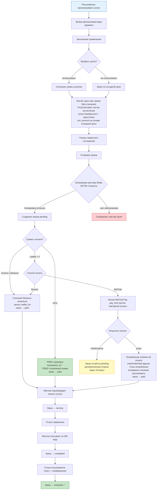
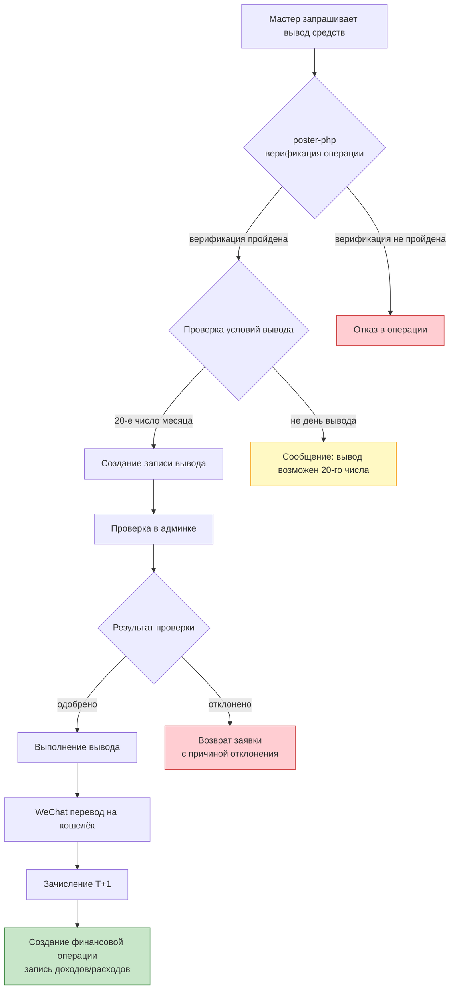
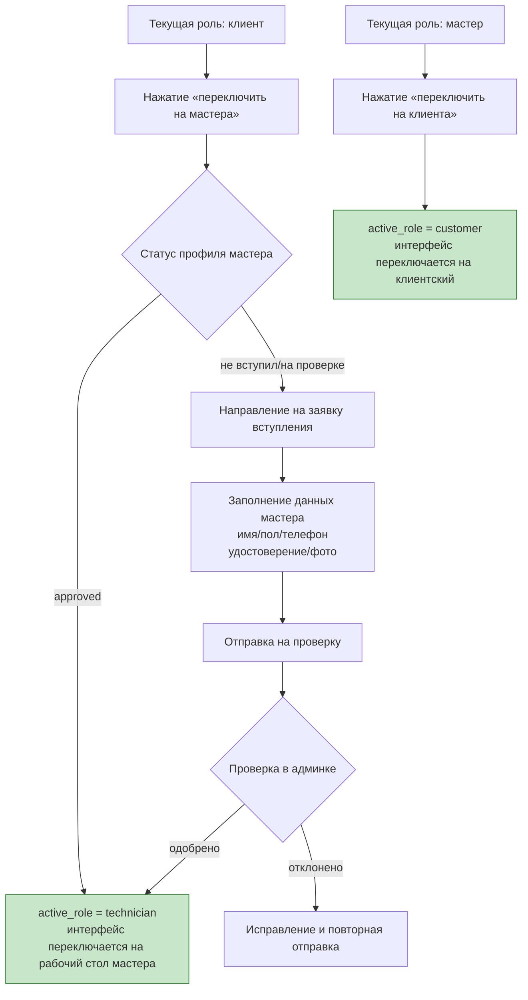
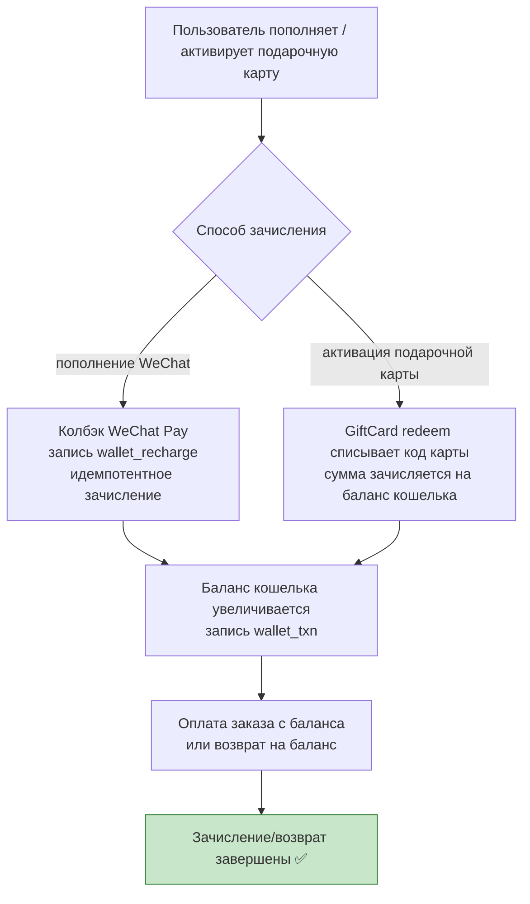

# Схема ключевых бизнес-процессов
> **Languages**: [中文](../../diagrams/FLOWCHART.md) · [English](../../en/diagrams/FLOWCHART.md) · [한국어](../../ko/diagrams/FLOWCHART.md) · [Deutsch](../../de/diagrams/FLOWCHART.md) · [Français](../../fr/diagrams/FLOWCHART.md) · [Español](../../es/diagrams/FLOWCHART.md) · [Português](../../pt/diagrams/FLOWCHART.md) · [हिन्दी](../../hi/diagrams/FLOWCHART.md) · [العربية](../../ar/diagrams/FLOWCHART.md) · [বাংলা](../../bn/diagrams/FLOWCHART.md) · [Bahasa Indonesia](../../id/diagrams/FLOWCHART.md) · [日本語](../../ja/diagrams/FLOWCHART.md)

## 1. Процесс записи на услугу

## 2. Процесс оплаты и возврата

```mermaid
flowchart TD
    subgraph 支付流程["Процесс оплаты (прямой)"]
        P1["Создание записи оплаты"] --> P2["Единый заказ WeChat<br/>pay_lock против конкурентности<br/>out_trade_no = order_no идемпотентно"]
        P2 --> P3["Фронтенд инициирует оплату<br/>выбор способа"]
        P3 -->|"баланс"| PB["Списание баланса кошелька<br/>запись wallet_txn<br/>идемпотентно, списывается один раз"]
        P3 -->|"WeChat"| P4["Колбэк WeChat notify"]
        P4 --> P5["Проверка подписи пройдена"]
        PB --> P6["markOrderPaid идемпотентно<br/>купон/карта списываются только здесь"]
        P5 --> P6
        P6 --> P7["Заказ → paid<br/>уведомление пользователя + мастера"]
    end

    subgraph 退款流程["Процесс возврата"]
        R1["Пользователь запрашивает возврат<br/>refund_lock против конкурентности"] --> R2{"Оценка по правилам возврата"}
        R2 -->|"заказ ≤15мин или до начала >6ч"| R3["Возврат 100%"]
        R2 -->|"до начала ≤6ч"| R4["Возврат 90%"]
        R2 -->|"начато без подтверждения"| R5["Возврат 80%"]
        R2 -->|"после подтверждения услуги"| R6["Возврата нет"]
        R3 --> R7["Заказ → refunding"]
        R4 --> R7
        R5 --> R7
        R7 --> R8["Двухуровневое одобрение<br/>руководитель филиала → финансы"]
        R8 --> R9["Двухэтапный возврат<br/>в транзакции создаётся запись возврата<br/>вне транзакции IO возврата WeChat"]
        R9 -->|"сбой WeChat"| R10["Откат заказа в PAID<br/>повторная попытка возврата"]
        R9 -->|"возврат успешен"| R11["Заказ → refunded<br/>WeChat возврат на исходный канал / зачисление на баланс<br/>возврат купона + удержание баллов"]
    end

    style P6 fill:#c8e6c9,stroke:#2e7d32,color:#333
    style R6 fill:#ffcdd2,stroke:#c62828,color:#333
    style R11 fill:#c8e6c9,stroke:#2e7d32,color:#333
    style R10 fill:#fff9c4,stroke:#f9a825,color:#333
```

## 3. Процесс вывода средств мастера

## 4. Процесс переключения роли

## 5. Процесс пополнения кошелька / зачисления подарочной карты

