# Схема жизненного цикла
> **Languages**: [中文](../../diagrams/LIFECYCLE-DIAGRAM.md) · [English](../../en/diagrams/LIFECYCLE-DIAGRAM.md) · [한국어](../../ko/diagrams/LIFECYCLE-DIAGRAM.md) · [Deutsch](../../de/diagrams/LIFECYCLE-DIAGRAM.md) · [Français](../../fr/diagrams/LIFECYCLE-DIAGRAM.md) · [Español](../../es/diagrams/LIFECYCLE-DIAGRAM.md) · [Português](../../pt/diagrams/LIFECYCLE-DIAGRAM.md) · [हिन्दी](../../hi/diagrams/LIFECYCLE-DIAGRAM.md) · [العربية](../../ar/diagrams/LIFECYCLE-DIAGRAM.md) · [বাংলা](../../bn/diagrams/LIFECYCLE-DIAGRAM.md) · [Bahasa Indonesia](../../id/diagrams/LIFECYCLE-DIAGRAM.md) · [日本語](../../ja/diagrams/LIFECYCLE-DIAGRAM.md)

## 1. Жизненный цикл заказа (конечный автомат)

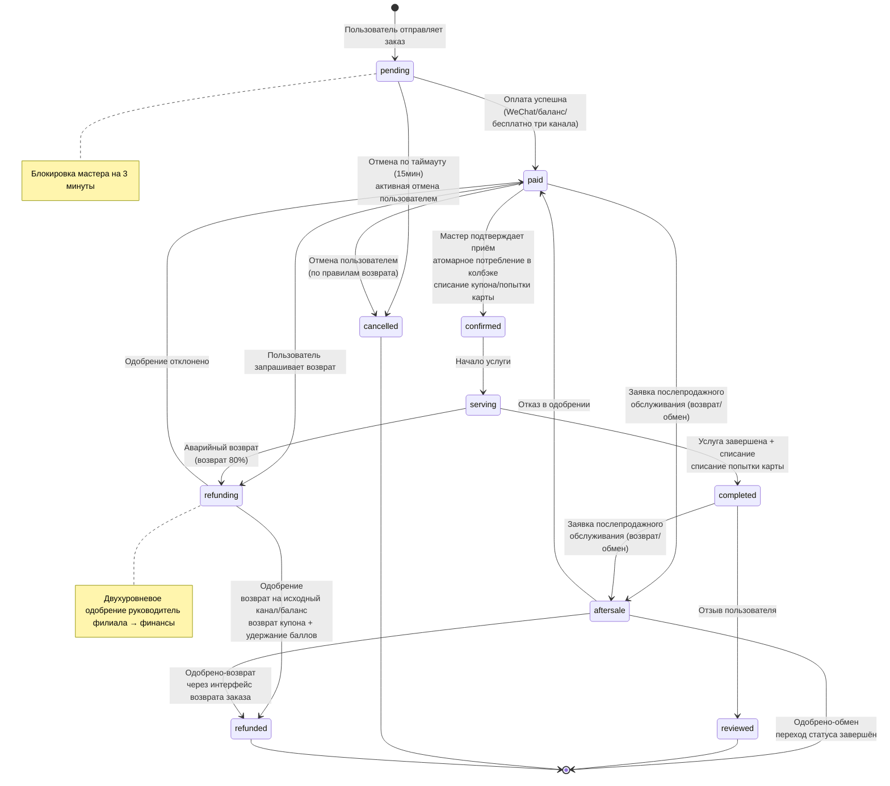
```mermaid
stateDiagram-v2
    [*] --> pending: Пользователь отправляет заказ

    pending --> paid: Оплата успешна<br/>(WeChat/баланс/бесплатно три канала)

    pending --> cancelled: Отмена по таймауту (15мин)<br/>активная отмена пользователем

    paid --> confirmed: Мастер подтверждает приём<br/>атомарное потребление в колбэке<br/>списание купона/попытки карты
    paid --> cancelled: Отмена пользователем<br/>(по правилам возврата)
    paid --> refunding: Пользователь запрашивает возврат
    paid --> aftersale: Заявка послепродажного<br/>обслуживания (возврат/обмен)

    confirmed --> serving: Начало услуги

    serving --> completed: Услуга завершена + списание<br/>списание попытки карты

    serving --> refunding: Аварийный возврат<br/>(возврат 80%)

    completed --> reviewed: Отзыв пользователя
    completed --> aftersale: Заявка послепродажного<br/>обслуживания (возврат/обмен)

    refunding --> refunded: Одобрение<br/>возврат на исходный канал/баланс<br/>возврат купона + удержание баллов
    refunding --> paid: Одобрение отклонено

    aftersale --> refunded: Одобрено-возврат<br/>через интерфейс возврата заказа
    aftersale --> paid: Отказ в одобрении
    aftersale --> [*]: Одобрено-обмен<br/>переход статуса завершён

    reviewed --> [*]
    cancelled --> [*]
    refunded --> [*]

    note right of pending: Блокировка мастера на 3 минуты
    note right of refunding: Двухуровневое одобрение руководитель филиала → финансы
```

## 2. Жизненный цикл карты

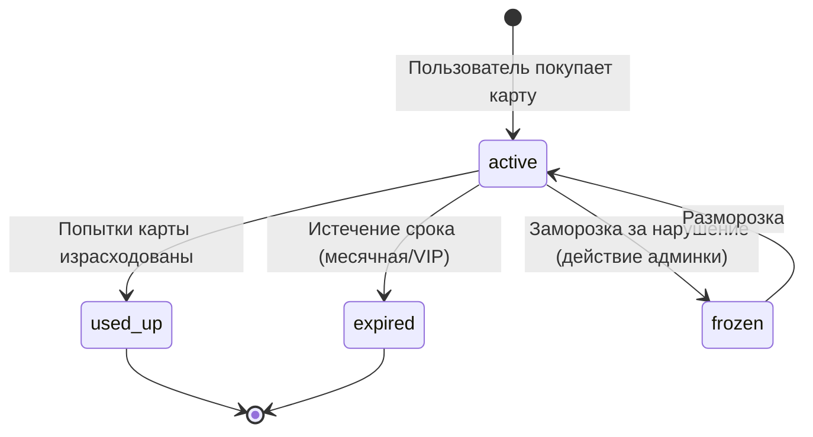
```mermaid
stateDiagram-v2
    [*] --> active: Пользователь покупает карту

    active --> used_up: Попытки карты израсходованы

    active --> expired: Истечение срока (месячная/VIP)

    active --> frozen: Заморозка за нарушение (действие админки)

    frozen --> active: Разморозка

    used_up --> [*]
    expired --> [*]
```

## 3. Жизненный цикл вступления мастера

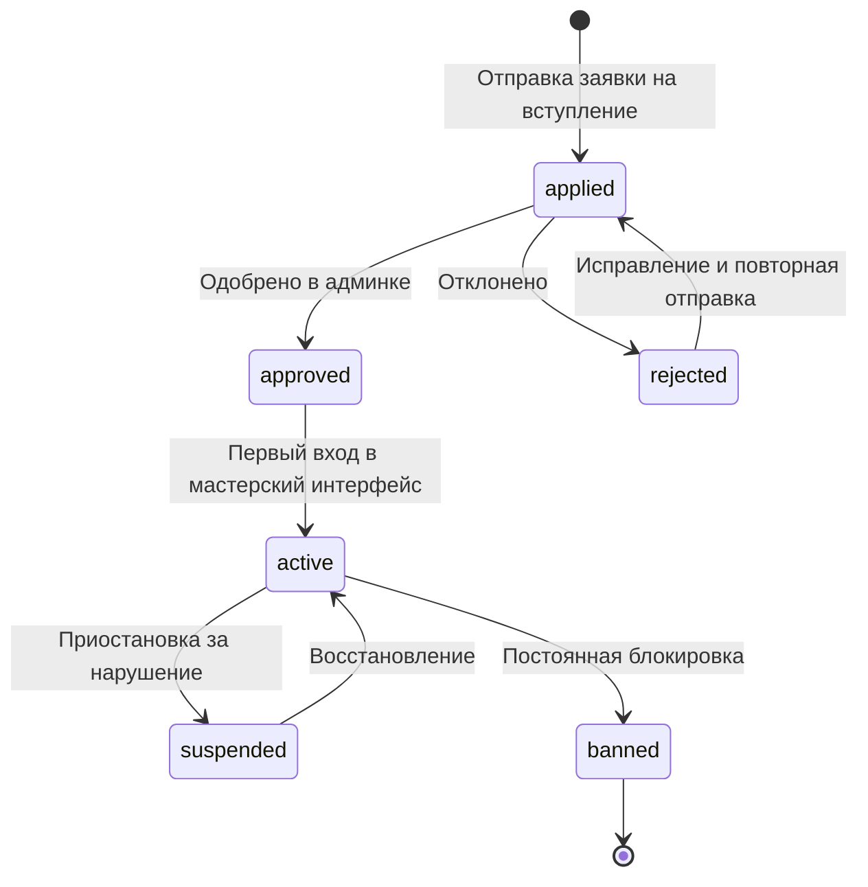
```mermaid
stateDiagram-v2
    [*] --> applied: Отправка заявки на вступление

    applied --> approved: Одобрено в админке
    applied --> rejected: Отклонено

    rejected --> applied: Исправление и повторная отправка

    approved --> active: Первый вход в мастерский интерфейс

    active --> suspended: Приостановка за нарушение
    suspended --> active: Восстановление
    active --> banned: Постоянная блокировка

    banned --> [*]
```

## 4. Жизненный цикл купона

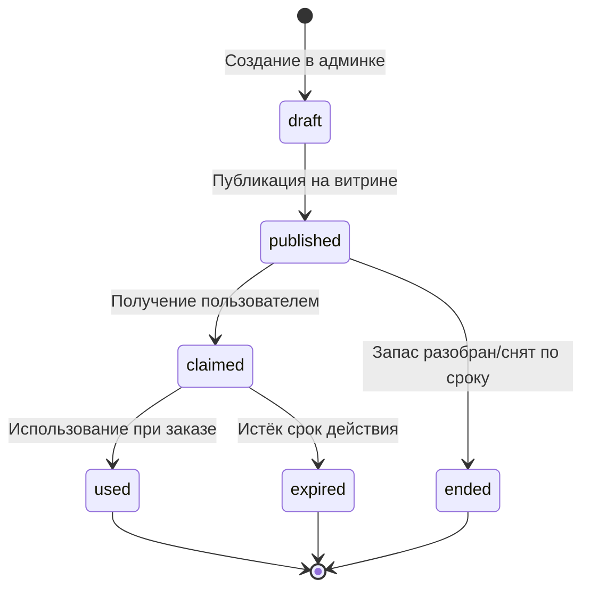
```mermaid
stateDiagram-v2
    [*] --> draft: Создание в админке

    draft --> published: Публикация на витрине

    published --> claimed: Получение пользователем

    claimed --> used: Использование при заказе
    claimed --> expired: Истёк срок действия

    published --> ended: Запас разобран/снят по сроку

    used --> [*]
    expired --> [*]
    ended --> [*]
```

## 5. Жизненный цикл вывода средств мастера

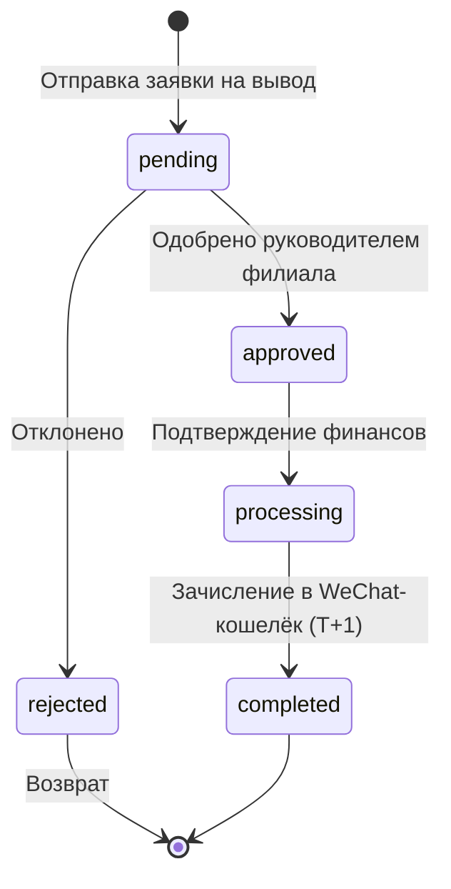
```mermaid
stateDiagram-v2
    [*] --> pending: Отправка заявки на вывод

    pending --> approved: Одобрено руководителем филиала
    pending --> rejected: Отклонено

    rejected --> [*]: Возврат

    approved --> processing: Подтверждение финансов

    processing --> completed: Зачисление в WeChat-кошелёк (T+1)

    completed --> [*]
```

## 6. Жизненный цикл аутентификации Token

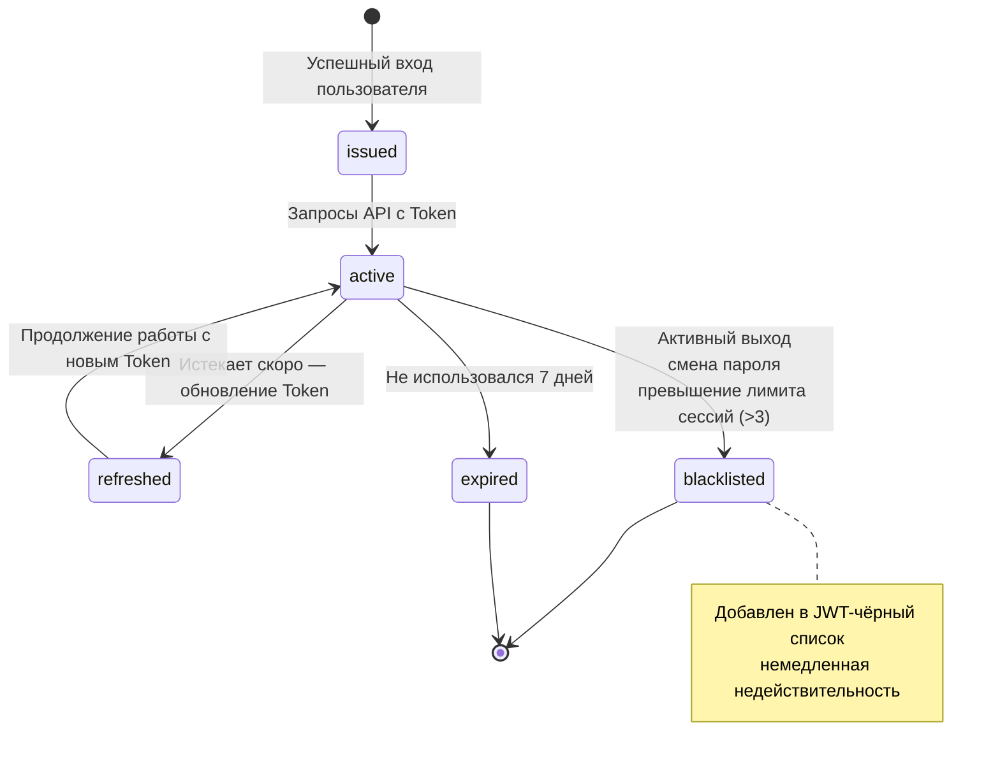
```mermaid
stateDiagram-v2
    [*] --> issued: Успешный вход пользователя

    issued --> active: Запросы API с Token

    active --> refreshed: Истекает скоро — обновление Token

    refreshed --> active: Продолжение работы с новым Token

    active --> blacklisted: Активный выход<br/>смена пароля<br/>превышение лимита сессий (>3)

    active --> expired: Не использовался 7 дней

    blacklisted --> [*]
    expired --> [*]

    note right of blacklisted: Добавлен в JWT-чёрный список<br/>немедленная недействительность
```

## 7. Жизненный цикл групповой покупки

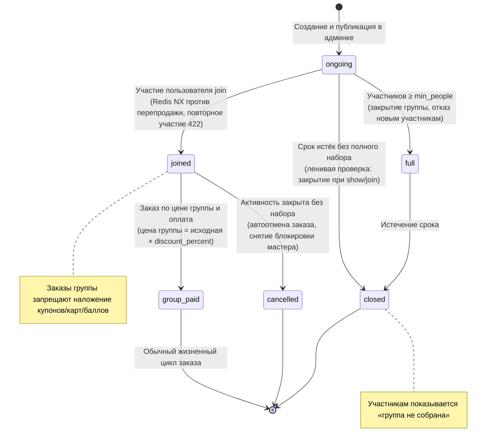
```mermaid
stateDiagram-v2
    [*] --> ongoing: Создание и публикация в админке

    ongoing --> full: Участников ≥ min_people<br/>(закрытие группы, отказ новым участникам)

    ongoing --> closed: Срок истёк без полного набора<br/>(ленивая проверка: закрытие при show/join)

    full --> closed: Истечение срока

    ongoing --> joined: Участие пользователя join<br/>(Redis NX против перепродажи, повторное участие 422)

    joined --> group_paid: Заказ по цене группы и оплата<br/>(цена группы = исходная × discount_percent)

    joined --> cancelled: Активность закрыта без набора<br/>(автоотмена заказа, снятие блокировки мастера)

    group_paid --> [*]: Обычный жизненный цикл заказа
    cancelled --> [*]
    closed --> [*]

    note right of joined: Заказы группы запрещают наложение купонов/карт/баллов
    note right of closed: Участникам показывается «группа не собрана»
```

## 8. Жизненный цикл передачи купона

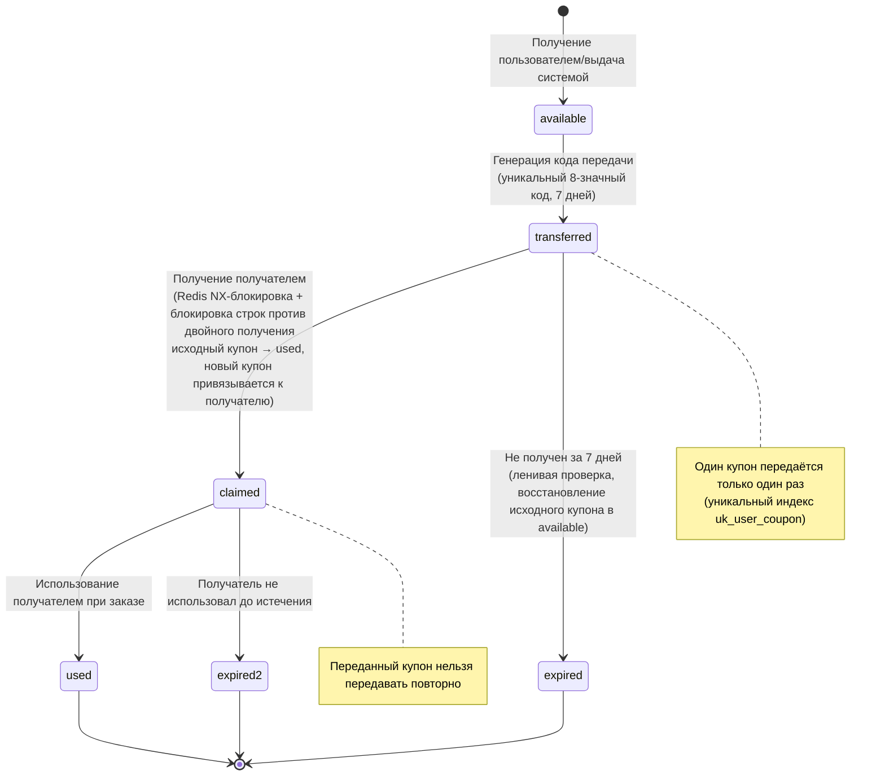
```mermaid
stateDiagram-v2
    [*] --> available: Получение пользователем/выдача системой

    available --> transferred: Генерация кода передачи<br/>(уникальный 8-значный код, 7 дней)

    transferred --> claimed: Получение получателем<br/>(Redis NX-блокировка + блокировка строк против двойного получения<br/>исходный купон → used, новый купон привязывается к получателю)

    transferred --> expired: Не получен за 7 дней<br/>(ленивая проверка, восстановление исходного купона в available)

    claimed --> used: Использование получателем при заказе
    claimed --> expired2: Получатель не использовал до истечения

    used --> [*]
    expired --> [*]
    expired2 --> [*]

    note right of transferred: Один купон передаётся только один раз<br/>(уникальный индекс uk_user_coupon)
    note right of claimed: Переданный купон нельзя передавать повторно
```

## 9. Жизненный цикл истечения баллов

```mermaid
stateDiagram-v2
    [*] --> earned: Отметка/возврат за покупку/восстановление<br/>(expires_at = now + 365 дней)

    earned --> used: Зачёт/обмен

    earned --> expired: Истёк без использования<br/>(PointsExpiryTimer сканирование 60с<br/>запись отрицательного списания type=expire)

    expired --> [*]: Внутрисистемное уведомление «баллы истекли»
    used --> [*]

    note right of expired: Тройная идемпотентность: повторная проверка блокировкой строк<br/>+ курсор по id + уведомление только из раунда списания
```

## 10. Жизненный цикл переводов (раунд 19: перевод баланса + перевод баллов)

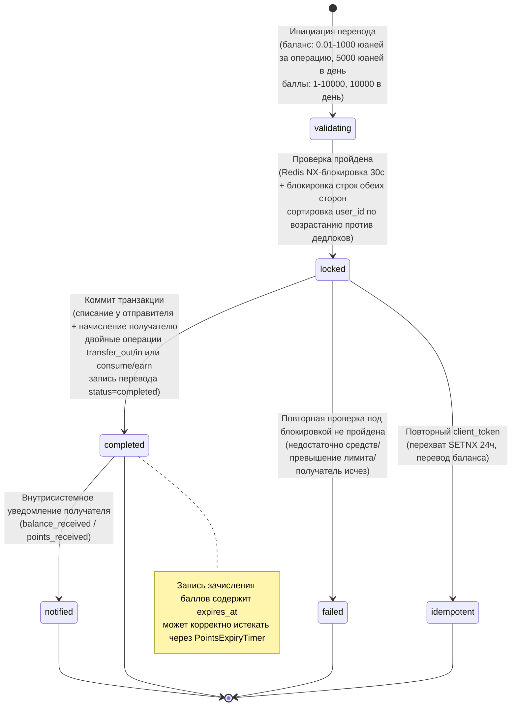
```mermaid
stateDiagram-v2
    [*] --> validating: Инициация перевода<br/>(баланс: 0.01-1000 юаней за операцию, 5000 юаней в день<br/>баллы: 1-10000, 10000 в день)

    validating --> locked: Проверка пройдена<br/>(Redis NX-блокировка 30с + блокировка строк обеих сторон<br/>сортировка user_id по возрастанию против дедлоков)

    locked --> completed: Коммит транзакции<br/>(списание у отправителя + начисление получателю<br/>двойные операции transfer_out/in или consume/earn<br/>запись перевода status=completed)

    locked --> failed: Повторная проверка под блокировкой не пройдена<br/>(недостаточно средств/превышение лимита/получатель исчез)
    locked --> idempotent: Повторный client_token<br/>(перехват SETNX 24ч, перевод баланса)

    completed --> notified: Внутрисистемное уведомление получателя<br/>(balance_received / points_received)
    completed --> [*]
    failed --> [*]
    idempotent --> [*]
    notified --> [*]

    note right of completed: Запись зачисления баллов содержит expires_at<br/>может корректно истекать через PointsExpiryTimer
```

## 11. Жизненный цикл тикета поддержки (раунд 20)

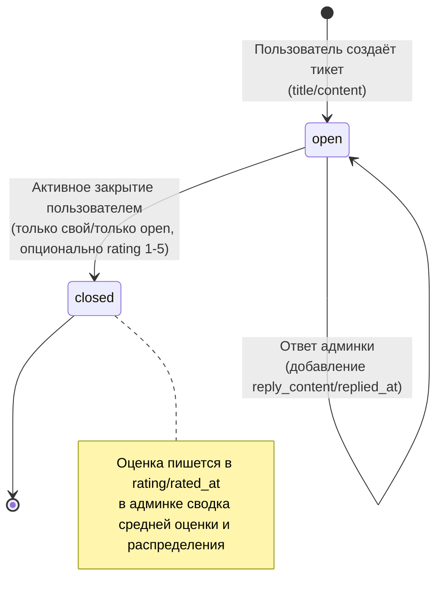
```mermaid
stateDiagram-v2
    [*] --> open: Пользователь создаёт тикет<br/>(title/content)

    open --> open: Ответ админки<br/>(добавление reply_content/replied_at)

    open --> closed: Активное закрытие пользователем<br/>(только свой/только open, опционально rating 1-5)

    closed --> [*]

    note right of closed: Оценка пишется в rating/rated_at<br/>в админке сводка средней оценки и распределения
```

## 12. Жизненный цикл электронного счёта (раунд 20)

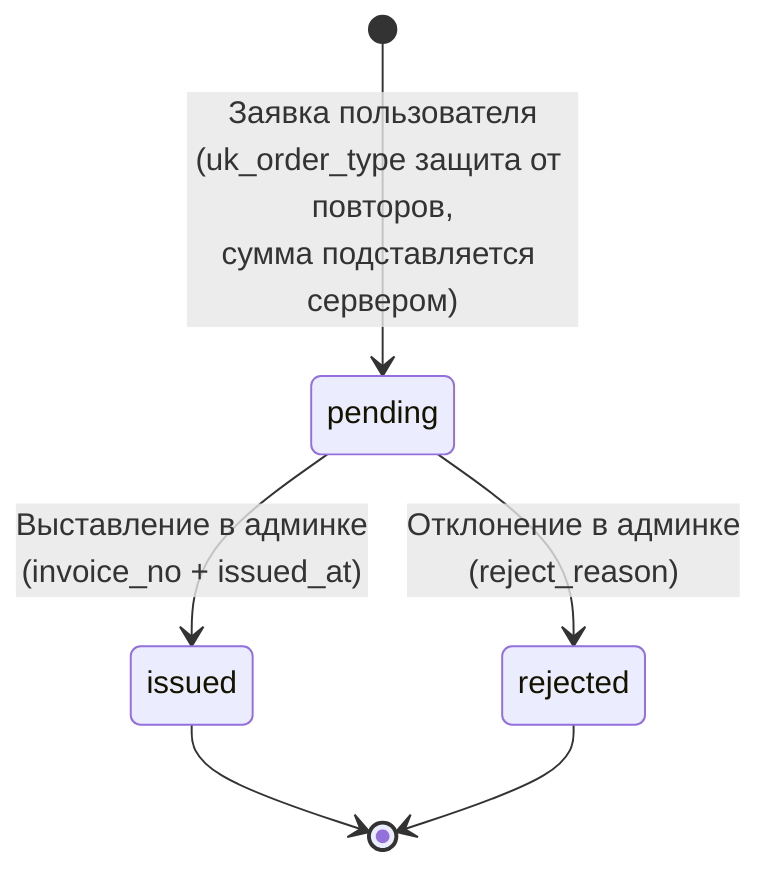
```mermaid
stateDiagram-v2
    [*] --> pending: Заявка пользователя<br/>(uk_order_type защита от повторов,<br/>сумма подставляется сервером)

    pending --> issued: Выставление в админке<br/>(invoice_no + issued_at)

    pending --> rejected: Отклонение в админке<br/>(reject_reason)

    issued --> [*]
    rejected --> [*]
```

## 13. Жизненный цикл скидки при сумме (раунд 22)

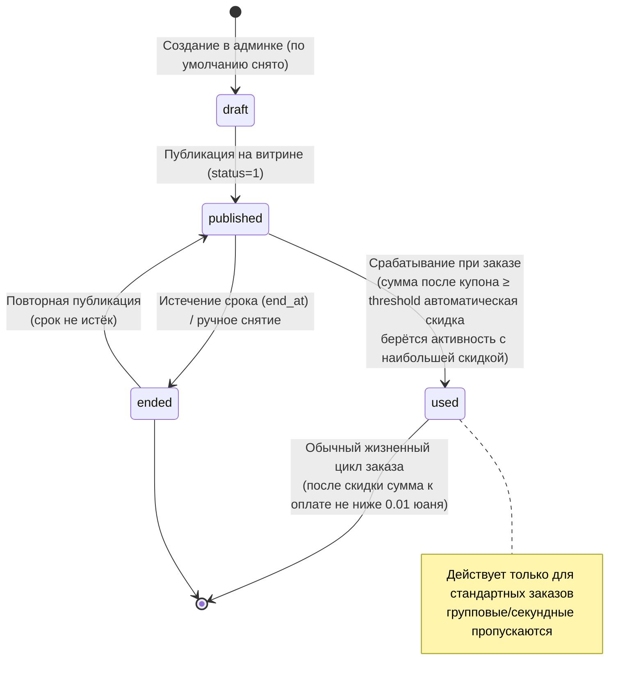
```mermaid
stateDiagram-v2
    [*] --> draft: Создание в админке (по умолчанию снято)

    draft --> published: Публикация на витрине (status=1)

    published --> ended: Истечение срока (end_at) / ручное снятие

    published --> used: Срабатывание при заказе<br/>(сумма после купона ≥ threshold автоматическая скидка<br/>берётся активность с наибольшей скидкой)

    used --> [*]: Обычный жизненный цикл заказа<br/>(после скидки сумма к оплате не ниже 0.01 юаня)

    ended --> published: Повторная публикация<br/>(срок не истёк)
    ended --> [*]

    note right of used: Действует только для стандартных заказов<br/>групповые/секундные пропускаются
```

## 15. Жизненный цикл розыгрыша колеса (раунд 23)

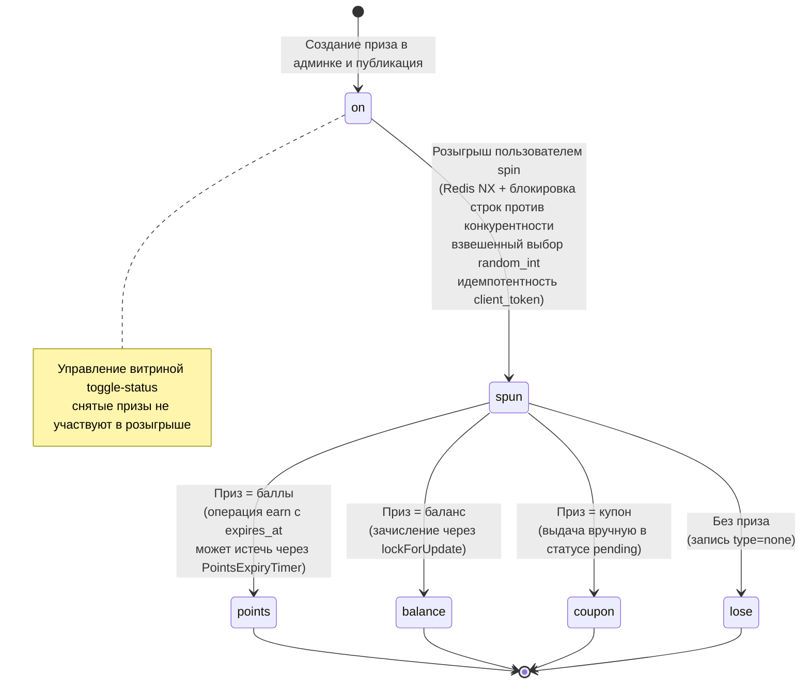
```mermaid
stateDiagram-v2
    [*] --> on: Создание приза в админке и публикация

    on --> spun: Розыгрыш пользователем spin<br/>(Redis NX + блокировка строк против конкурентности<br/>взвешенный выбор random_int<br/>идемпотентность client_token)

    spun --> points: Приз = баллы<br/>(операция earn с expires_at<br/>может истечь через PointsExpiryTimer)

    spun --> balance: Приз = баланс<br/>(зачисление через lockForUpdate)

    spun --> coupon: Приз = купон<br/>(выдача вручную в статусе pending)

    spun --> lose: Без приза<br/>(запись type=none)

    points --> [*]
    balance --> [*]
    coupon --> [*]
    lose --> [*]

    note right of on: Управление витриной toggle-status<br/>снятые призы не участвуют в розыгрыше
```

## 14. Жизненный цикл удаления аккаунта (раунд 22)

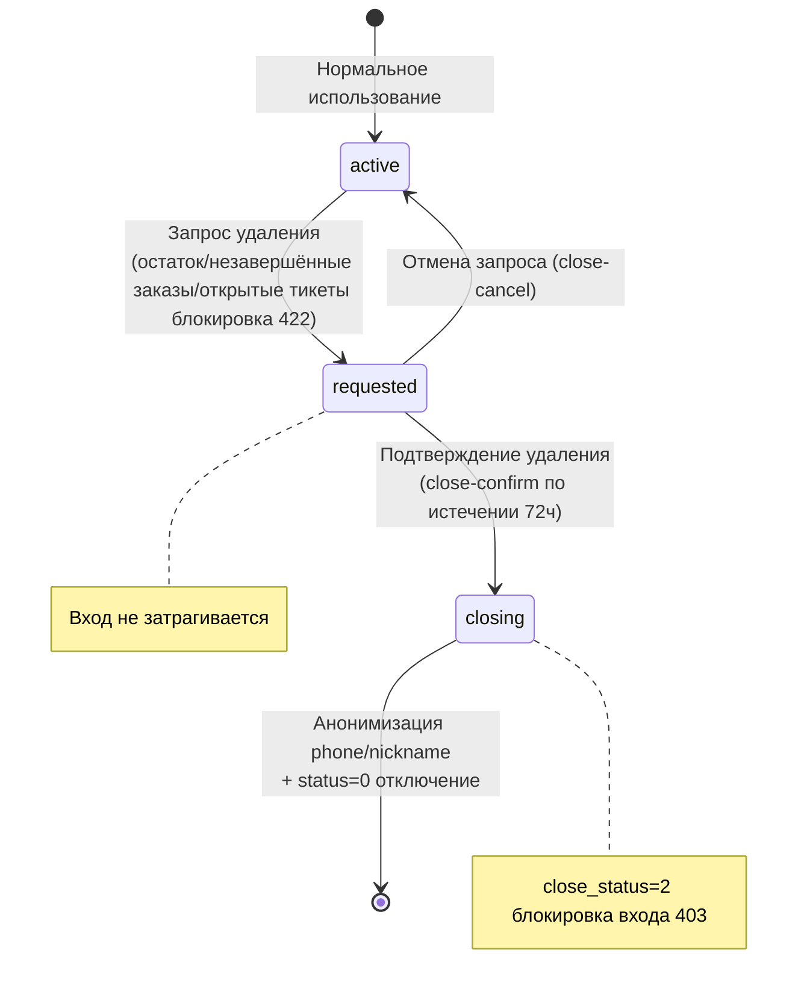
```mermaid
stateDiagram-v2
    [*] --> active: Нормальное использование

    active --> requested: Запрос удаления<br/>(остаток/незавершённые заказы/открытые тикеты блокировка 422)

    requested --> active: Отмена запроса (close-cancel)

    requested --> closing: Подтверждение удаления<br/>(close-confirm по истечении 72ч)

    closing --> [*]: Анонимизация phone/nickname<br/>+ status=0 отключение

    note right of requested: Вход не затрагивается
    note right of closing: close_status=2 блокировка входа 403
```

## 16. Жизненный цикл секундной распродажи (раунд 24)

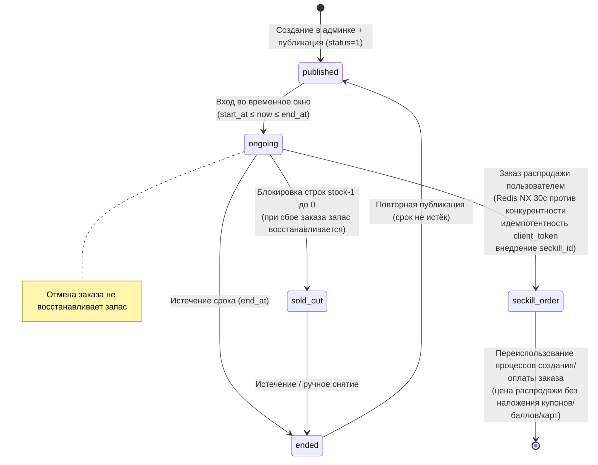
```mermaid
stateDiagram-v2
    [*] --> published: Создание в админке + публикация (status=1)

    published --> ongoing: Вход во временное окно<br/>(start_at ≤ now ≤ end_at)

    ongoing --> sold_out: Блокировка строк stock-1 до 0<br/>(при сбое заказа запас восстанавливается)

    ongoing --> ended: Истечение срока (end_at)

    sold_out --> ended: Истечение / ручное снятие

    ended --> published: Повторная публикация (срок не истёк)

    ongoing --> seckill_order: Заказ распродажи пользователем<br/>(Redis NX 30с против конкурентности<br/>идемпотентность client_token<br/>внедрение seckill_id)

    seckill_order --> [*]: Переиспользование процессов создания/оплаты заказа<br/>(цена распродажи без наложения купонов/баллов/карт)

    note right of ongoing: Отмена заказа не восстанавливает запас
```

## 17. Жизненный цикл награды постоянным клиентам (раунд 24)

```mermaid
stateDiagram-v2
    [*] --> completed: Заказ завершён<br/>(WorkController::complete блокировка строк в транзакции)

    completed --> checked: Проверка второй покупки у того же мастера за 30 дней

    checked --> none: Первая покупка / переключатель выключен<br/>(enabled=0)

    checked --> pending: Вторая покупка<br/>(бонус = оплаченное × ratio<br/>идемпотентность по order_id+type)

    pending --> settled: Расчёт в единой цепочке комиссионных<br/>(erik_technician_earnings<br/>type=return_customer)

    settled --> [*]
    none --> [*]

    note right of pending: status=pending<br/>автоматически входит в сводку доходов мастера
```
