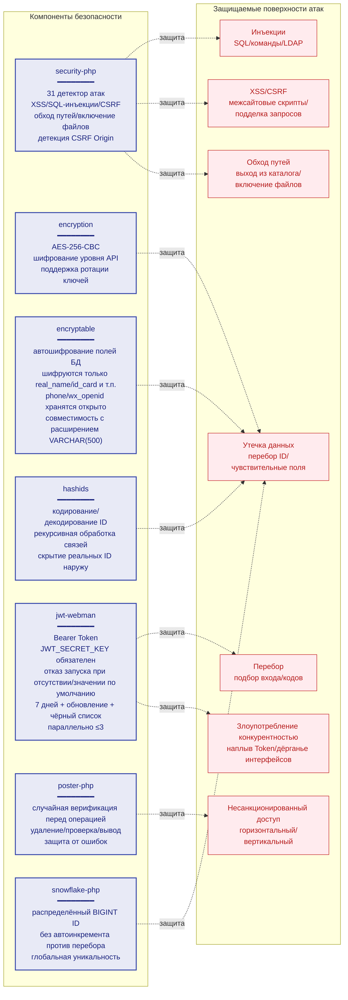
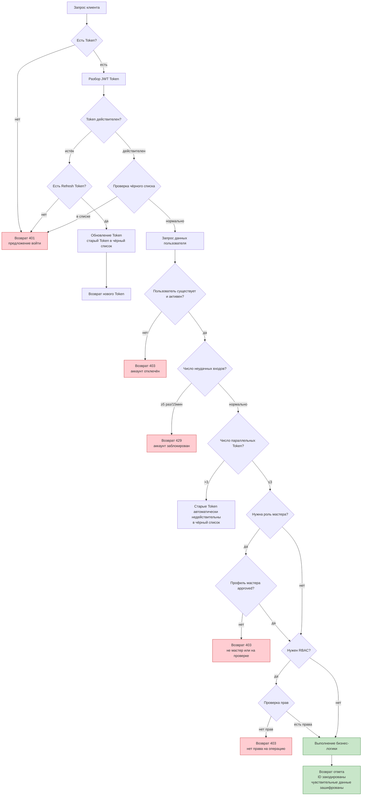
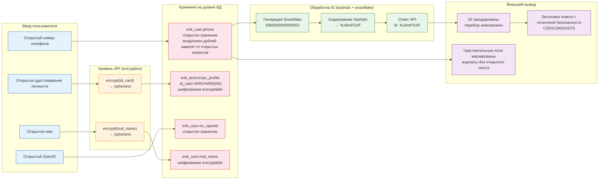

# Схема архитектуры безопасности
> **Languages**: [中文](../../diagrams/SECURITY-ARCHITECTURE.md) · [English](../../en/diagrams/SECURITY-ARCHITECTURE.md) · [한국어](../../ko/diagrams/SECURITY-ARCHITECTURE.md) · [Deutsch](../../de/diagrams/SECURITY-ARCHITECTURE.md) · [Français](../../fr/diagrams/SECURITY-ARCHITECTURE.md) · [Español](../../es/diagrams/SECURITY-ARCHITECTURE.md) · [Português](../../pt/diagrams/SECURITY-ARCHITECTURE.md) · [हिन्दी](../../hi/diagrams/SECURITY-ARCHITECTURE.md) · [العربية](../../ar/diagrams/SECURITY-ARCHITECTURE.md) · [বাংলা](../../bn/diagrams/SECURITY-ARCHITECTURE.md) · [Bahasa Indonesia](../../id/diagrams/SECURITY-ARCHITECTURE.md) · [日本語](../../ja/diagrams/SECURITY-ARCHITECTURE.md)

## 1. Система эшелонированной обороны

```mermaid
graph TB
    subgraph 边界防护["Первый слой: защита границы"]
        WAF["WAF / Nginx<br/>безопасные заголовки ответов<br/>защита чувствительных файлов<br/>TLS 1.3"]
    end

    subgraph 接入防护["Второй слой: защита подключения"]
        CORS["Промежуточное ПО Cors<br/>белый список CORS_ALLOW_ORIGIN<br/>* эхо · без конфигурации только same-origin<br/>6 безопасных заголовков ответов<br/>предварительный запрос OPTIONS"]
    end

    subgraph 攻击检测["Третий слой: обнаружение атак"]
        SEC["Промежуточное ПО Security<br/>erikwang2013/security-php<br/>31 детектор атак<br/>XSS / SQL-инъекции / CSRF<br/>обход путей / включение файлов<br/>детекция CSRF Origin (block)"]
        BLOCK["Автоматическая блокировка<br/>5 атак/60с<br/>→ IP-чёрный список 15мин"]
    end

    subgraph 流量控制["Четвёртый слой: контроль трафика"]
        RL["Промежуточное ПО RateLimit<br/>Redis скользящее окно + атомарность Lua<br/>по умолчанию: 60 раз/мин/IP<br/>вход: 10 раз/мин<br/>регистрация: 5 раз/мин<br/>проверочный код: 1 раз/60с/телефон"]
    end

    subgraph 身份认证["Пятый слой: идентификация"]
        AUTH["Промежуточное ПО Auth<br/>JWT Bearer Token (7 дней)<br/>JWT_SECRET_KEY обязателен<br/>запуск отклоняется при отсутствии/публичном значении по умолчанию<br/>пароли хешируются bcrypt<br/>обновление Token + чёрный список<br/>блокировка входа: 5 сбоев → 15мин<br/>лимит сессий: максимум 3 Token"]
        TECH_AUTH["TechnicianAuth<br/>проверка профиля мастера<br/>проверка статуса approved"]
        ADMIN_AUTH["AdminAuth<br/>JWT-аутентификация админки<br/>чёрный список Token"]
    end

    subgraph 权限控制["Шестой слой: контроль прав"]
        RBAC["AdminPermission<br/>проверка ролей RBAC<br/>кэш Redis 60с<br/>пользователь → роль → право"]
        POSTER["Верификация Poster<br/>erikwang2013/poster-php<br/>удаление/проверка/вывод<br/>случайная верификация чувствительных операций"]
    end

    subgraph 数据安全["Седьмой слой: безопасность данных"]
        ENC_API["Шифрование уровня API<br/>erikwang2013/encryption<br/>шифрование/расшифровка чувствительных полей"]
        ENC_DB["Шифрование уровня БД<br/>erikwang2013/encryptable<br/>автошифрование трейтом Model<br/>шифруются только real_name/id_card и т.п.<br/>phone/wx_openid обязаны храниться открыто<br/>(вход/поиск дублей зависят от открытых запросов)"]
        HASHID["Шифрование ID<br/>erikwang2013/hashids<br/>скрытие реальных ID наружу<br/>рекурсивное кодирование/декодирование"]
        SLOG["Журнал безопасности<br/>M3 аномалии единообразно маскируются<br/>общий текст + Log::error<br/>чувствительные данные не попадают в журнал<br/>OperationLog 8 источников"]
    end

    subgraph 管理端防护["Восьмой слой: защита админки"]
        EXCEL["Защита экспорта<br/>safeCellValue()<br/>префиксы = + - @ / Tab/CR<br/>экранирование ' против инъекции формул"]
        UPLOAD["Проверка загрузок<br/>finfo magic bytes<br/>MIME и расширение не совпадают<br/>→ отказ 422"]
        INSTALL["Блокировка установки<br/>уже установлено (installed=1<br/>или есть администратор)<br/>→ 404 отключение мастера установки"]
    end

    请求["HTTP Request"] --> WAF
    WAF --> CORS
    CORS --> SEC
    SEC -->|"пройдено"| RL
    SEC -->|"обнаружена атака"| BLOCK
    BLOCK -.->|"отказ"| 拒绝["HTTP 403/429<br/>запись журнала атак"]
    RL -->|"пройдено"| AUTH
    RL -->|"превышен лимит"| 限流拒绝["HTTP 429<br/>Retry-After"]
    AUTH --> TECH_AUTH
    AUTH --> ADMIN_AUTH
    TECH_AUTH --> RBAC
    ADMIN_AUTH --> RBAC
    RBAC --> POSTER
    POSTER --> ENC_API
    ENC_API --> ENC_DB
    ENC_DB --> HASHID
    HASHID --> SLOG
    SLOG --> EXCEL
    EXCEL --> UPLOAD
    UPLOAD --> INSTALL
    INSTALL --> 响应["HTTP Response<br/>данные зашифрованы + закодированы"]

    classDef layer1 fill:#e3f2fd,stroke:#1565c0,stroke-width:2px,color:#01579b
    classDef layer2 fill:#bbdefb,stroke:#1976d2,stroke-width:2px,color:#01579b
    classDef layer3 fill:#ffcdd2,stroke:#c62828,stroke-width:2px,color:#b71c1c
    classDef layer4 fill:#fff9c4,stroke:#f9a825,stroke-width:2px,color:#f57f17
    classDef layer5 fill:#c8e6c9,stroke:#2e7d32,stroke-width:2px,color:#1b5e20
    classDef layer6 fill:#e1bee7,stroke:#7b1fa2,stroke-width:2px,color:#4a148c
    classDef layer7 fill:#d7ccc8,stroke:#5d4037,stroke-width:2px,color:#3e2723
    classDef layer8 fill:#cfd8dc,stroke:#37474f,stroke-width:2px,color:#263238
    classDef reject fill:#ff5252,stroke:#b71c1c,stroke-width:2px,color:#fff

    class WAF layer1
    class CORS layer2
    class SEC,BLOCK layer3
    class RL layer4
    class AUTH,TECH_AUTH,ADMIN_AUTH layer5
    class RBAC,POSTER layer6
    class ENC_API,ENC_DB,HASHID,SLOG layer7
    class EXCEL,UPLOAD,INSTALL layer8
    class 拒绝,限流拒绝 reject
```

## 2. Матрица компонентов безопасности

## 3. Процесс аутентификации и авторизации

## 4. Поток безопасности данных

